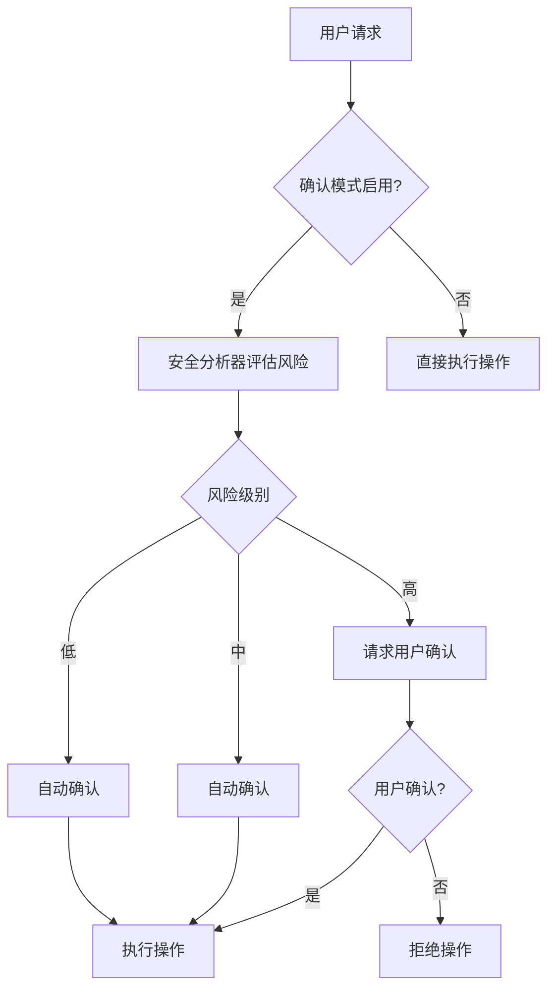
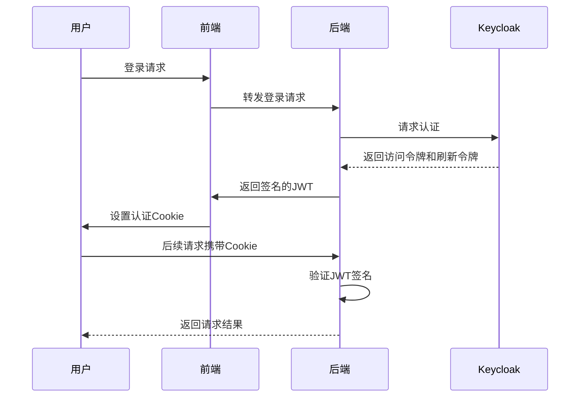
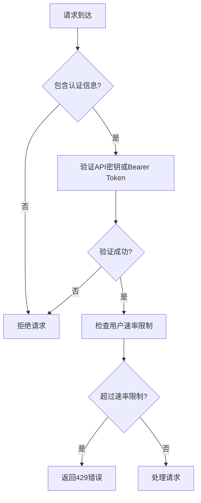
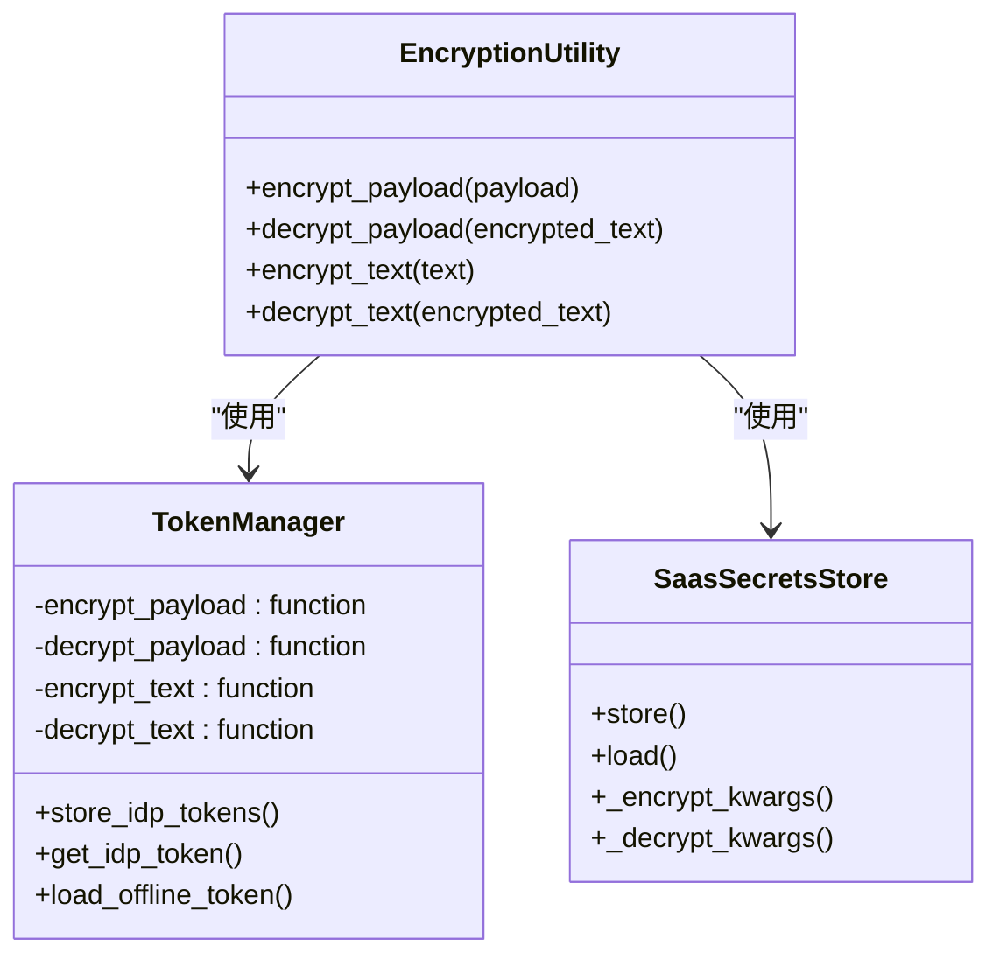
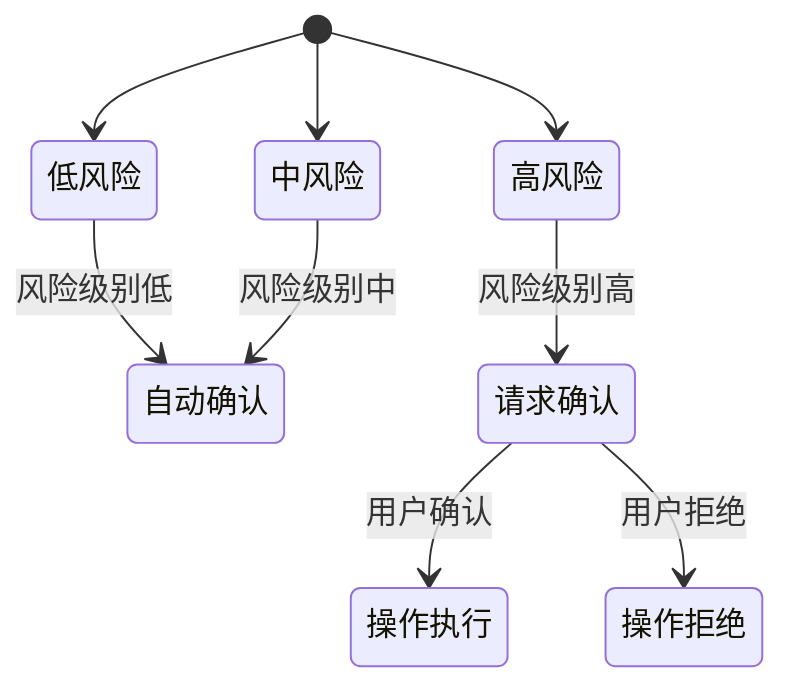
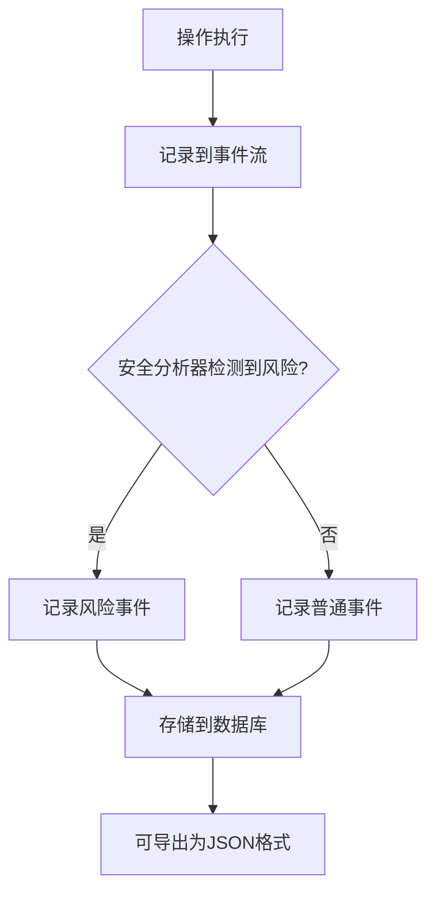

# 安全配置

<cite>
**本文档中引用的文件**   
- [analyzer.py](file://openhands/security/analyzer.py)
- [options.py](file://openhands/security/options.py)
- [README.md](file://openhands/security/README.md)
- [saas_user_auth.py](file://enterprise/server/auth/saas_user_auth.py)
- [token_manager.py](file://enterprise/server/auth/token_manager.py)
- [keycloak_manager.py](file://enterprise/server/auth/keycloak_manager.py)
- [rate_limit.py](file://enterprise/server/rate_limit.py)
- [middleware.py](file://enterprise/server/middleware.py)
- [config.template.toml](file://config.template.toml)
- [invariant-service.ts](file://frontend/src/api/invariant-service.ts)
- [llm-settings.tsx](file://frontend/src/routes/llm-settings.tsx)
</cite>

## 目录
1. [简介](#简介)
2. [安全策略与防护机制](#安全策略与防护机制)
3. [认证机制配置](#认证机制配置)
4. [授权策略配置](#授权策略配置)
5. [数据保护措施](#数据保护措施)
6. [安全分析器配置](#安全分析器配置)
7. [风险检测规则](#风险检测规则)
8. [响应策略](#响应策略)
9. [系统配置交互](#系统配置交互)
10. [安全最佳实践](#安全最佳实践)
11. [合规性要求](#合规性要求)
12. [安全事件监控](#安全事件监控)
13. [审计配置](#审计配置)

## 简介
OpenHands平台提供了一套全面的安全配置框架，旨在确保编码代理在执行任务时的安全性。该框架通过多种安全机制来防止意外操作或安全漏洞，包括确认模式、安全分析器、速率限制和加密存储等。用户可以通过Web界面或配置文件来启用和配置这些安全功能。

## 安全策略与防护机制
OpenHands的安全策略主要围绕确认模式和安全分析器构建。确认模式要求用户在执行高风险操作前进行确认，从而防止意外的破坏性操作。安全分析器则通过监听事件流来分析代理操作的安全风险，并在必要时采取行动。



**Diagram sources**
- [analyzer.py](file://openhands/security/analyzer.py#L8-L38)
- [README.md](file://openhands/security/README.md#L13-L18)

**Section sources**
- [analyzer.py](file://openhands/security/analyzer.py#L8-L38)
- [README.md](file://openhands/security/README.md#L1-L130)

## 认证机制配置
OpenHands使用Keycloak进行用户认证，支持多种身份提供商（如GitHub、GitLab、Bitbucket）。认证过程通过JWT（JSON Web Token）实现，确保了安全的用户会话管理。



**Diagram sources**
- [saas_user_auth.py](file://enterprise/server/auth/saas_user_auth.py#L279-L311)
- [token_manager.py](file://enterprise/server/auth/token_manager.py#L89-L108)

**Section sources**
- [saas_user_auth.py](file://enterprise/server/auth/saas_user_auth.py#L1-L324)
- [token_manager.py](file://enterprise/server/auth/token_manager.py#L1-L672)
- [keycloak_manager.py](file://enterprise/server/auth/keycloak_manager.py#L1-L51)

## 授权策略配置
授权策略通过API密钥和Bearer Token实现，确保只有经过认证的用户才能访问系统资源。系统还实现了基于用户ID的速率限制，防止滥用。



**Diagram sources**
- [saas_user_auth.py](file://enterprise/server/auth/saas_user_auth.py#L248-L267)
- [rate_limit.py](file://enterprise/server/rate_limit.py#L58-L78)

**Section sources**
- [saas_user_auth.py](file://enterprise/server/auth/saas_user_auth.py#L1-L324)
- [rate_limit.py](file://enterprise/server/rate_limit.py#L1-L138)

## 数据保护措施
系统通过多种方式保护敏感数据，包括使用Fernet加密存储令牌、在日志中过滤敏感信息以及使用HTTPS传输数据。



**Diagram sources**
- [token_manager.py](file://enterprise/server/auth/token_manager.py#L47-L75)
- [test_saas_secrets_store.py](file://enterprise/tests/unit/test_saas_secrets_store.py#L118-L146)

**Section sources**
- [token_manager.py](file://enterprise/server/auth/token_manager.py#L1-L672)
- [test_saas_secrets_store.py](file://enterprise/tests/unit/test_saas_secrets_store.py#L44-L146)

## 安全分析器配置
安全分析器是OpenHands安全框架的核心组件，用户可以通过配置文件或Web界面选择和配置不同的安全分析器。

### 配置选项
安全分析器可以通过以下方式配置：

1. **Web界面配置**：
   - 打开配置界面（点击右下角的齿轮图标）
   - 从下拉菜单中选择安全分析器
   - 保存设置

2. **配置文件配置**：
```toml
[security]
# 启用确认模式
confirmation_mode = true
# 使用的安全分析器
security_analyzer = "your-security-analyzer"
```

**Section sources**
- [README.md](file://openhands/security/README.md#L5-L18)
- [config.template.toml](file://config.template.toml#L368-L375)

## 风险检测规则
不同的安全分析器实现了不同的风险检测规则，用于识别潜在的安全威胁。

### LLM风险分析器
LLM风险分析器是默认的安全分析器，它利用LLM提供的风险评估来判断操作的安全性。

- 使用LLM提供的风险评估（低、中、高）
- 自动要求确认高风险操作
- 尊重确认模式设置以处理中低风险操作
- 轻量级且高效，无外部依赖

### Invariant分析器
Invariant分析器使用外部服务来分析跟踪并检测潜在问题。

- 检测代理可能泄露的机密
- 检测Python代码中的安全问题
- 检测恶意bash命令
- 检测危险的用户任务（浏览代理设置）
- 检测有害内容生成（浏览代理设置）

### Gray Swan分析器
Gray Swan分析器集成了Gray Swan AI的Cygnal API，提供高级AI安全监控。

- 需要Gray Swan API密钥
- 可选的Gray Swan策略ID
- 提供默认保护和自定义保护

**Section sources**
- [README.md](file://openhands/security/README.md#L56-L130)

## 响应策略
安全分析器根据检测到的风险级别采取相应的响应策略。



**Diagram sources**
- [README.md](file://openhands/security/README.md#L60-L66)
- [runner.py](file://openhands-cli/openhands_cli/runner.py#L174-L184)

**Section sources**
- [README.md](file://openhands/security/README.md#L1-L130)
- [runner.py](file://openhands-cli/openhands_cli/runner.py#L159-L188)

## 系统配置交互
安全配置与其他系统配置紧密交互，确保整体系统的安全性和功能性。

### 与核心配置的交互
安全配置与核心配置中的JWT密钥、工作区路径等设置相关联。

```toml
[core]
# JWT密钥用于认证
jwt_secret = ""
# 工作区基础路径
workspace_base = "./workspace"
```

### 与LLM配置的交互
安全分析器可能使用特定的LLM模型进行风险评估。

```toml
[llm.condenser]
model = "gpt-4o"
temperature = 0.1
max_input_tokens = 1024
```

**Section sources**
- [config.template.toml](file://config.template.toml#L76-L88)
- [config.template.toml](file://config.template.toml#L437-L442)

## 安全最佳实践
遵循以下最佳实践可以提高OpenHands系统的安全性：

1. **使用强密码和密钥**：确保所有API密钥和密码都足够复杂。
2. **定期轮换密钥**：定期更新JWT密钥和其他认证密钥。
3. **最小权限原则**：为每个用户和代理分配最小必要的权限。
4. **启用确认模式**：在生产环境中始终启用确认模式。
5. **监控和审计**：定期检查日志和审计记录，及时发现异常行为。

## 合规性要求
为满足合规性要求，系统提供了以下功能：

- **数据加密**：所有敏感数据在存储时都经过加密。
- **访问控制**：严格的访问控制机制确保只有授权用户才能访问数据。
- **审计日志**：详细的审计日志记录所有关键操作。
- **隐私保护**：在日志中过滤敏感信息，防止数据泄露。

## 安全事件监控
系统通过多种方式监控安全事件，确保及时发现和响应潜在威胁。

### 前端监控
前端通过API调用获取安全相关的信息和设置。

```typescript
class InvariantService {
  static async getPolicy() {
    const { data } = await openHands.get("/api/security/policy");
    return data.policy;
  }

  static async getRiskSeverity() {
    const { data } = await openHands.get("/api/security/settings");
    return data.RISK_SEVERITY;
  }

  static async updatePolicy(policy: string) {
    await openHands.post("/api/security/policy", { policy });
  }

  static async updateRiskSeverity(riskSeverity: number) {
    await openHands.post("/api/security/settings", {
      RISK_SEVERITY: riskSeverity,
    });
  }
}
```

**Section sources**
- [invariant-service.ts](file://frontend/src/api/invariant-service.ts#L1-L30)

## 审计配置
审计配置确保所有关键操作都被记录和追踪。

### 日志记录
系统记录所有安全相关事件，包括：

- 操作及其关联风险
- OpenHands跟踪（JSON格式）
- 认证和授权事件
- 速率限制事件

### 审计数据导出
审计数据可以通过API导出，便于进一步分析。



**Diagram sources**
- [README.md](file://openhands/security/README.md#L84-L86)
- [invariant-service.ts](file://frontend/src/api/invariant-service.ts#L14-L16)

**Section sources**
- [README.md](file://openhands/security/README.md#L1-L130)
- [invariant-service.ts](file://frontend/src/api/invariant-service.ts#L1-L30)