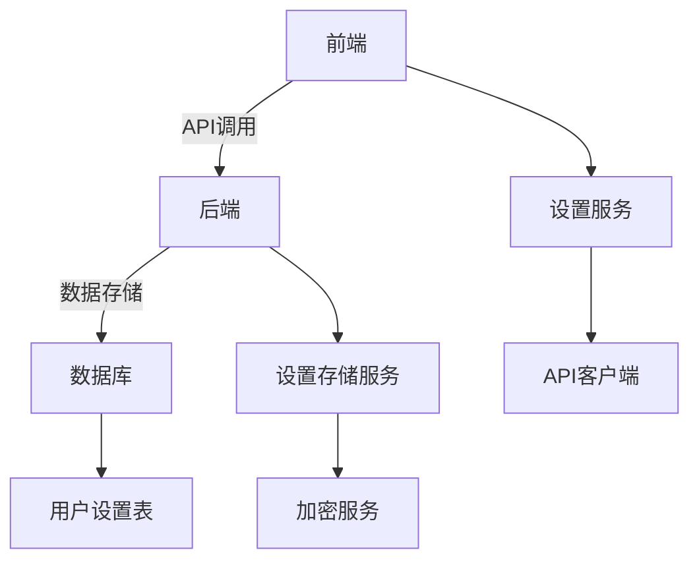
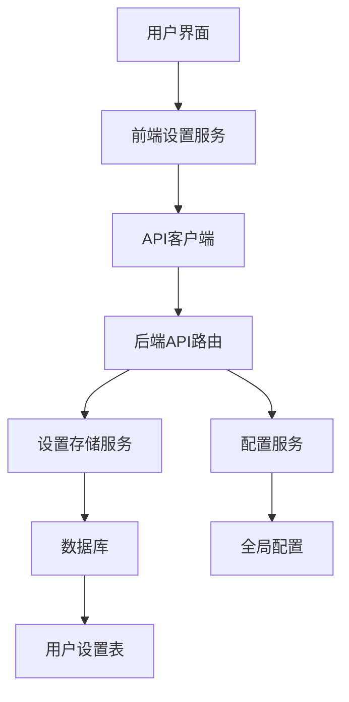
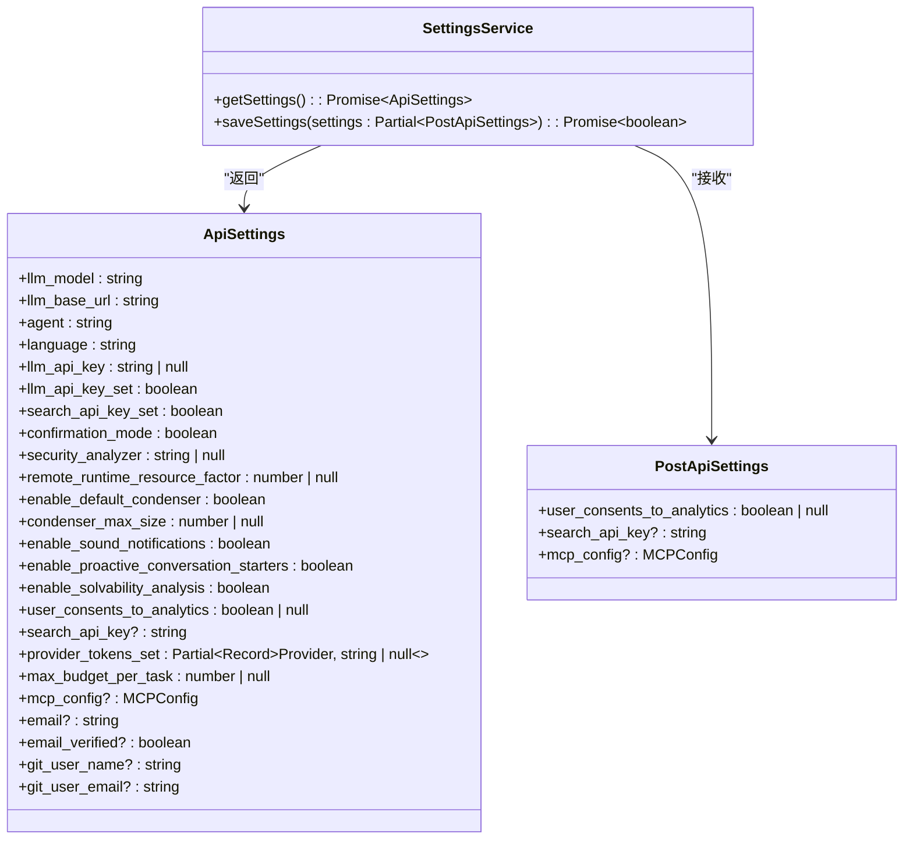
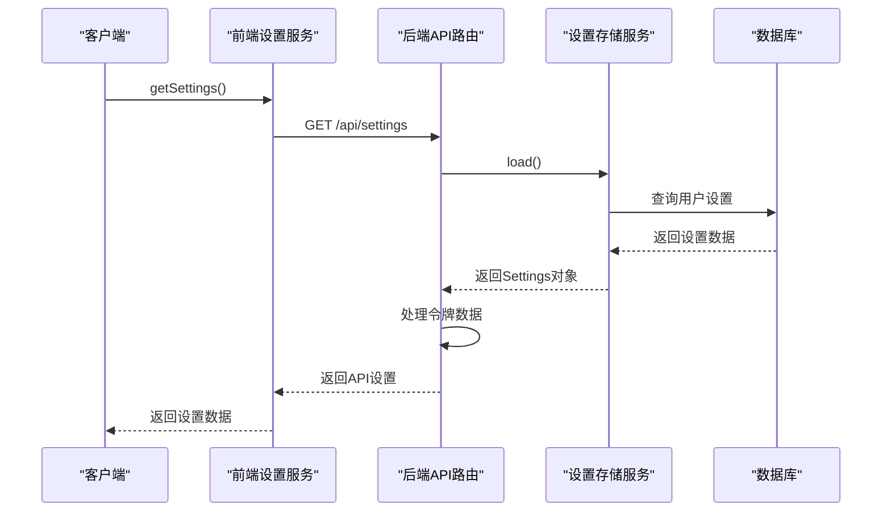
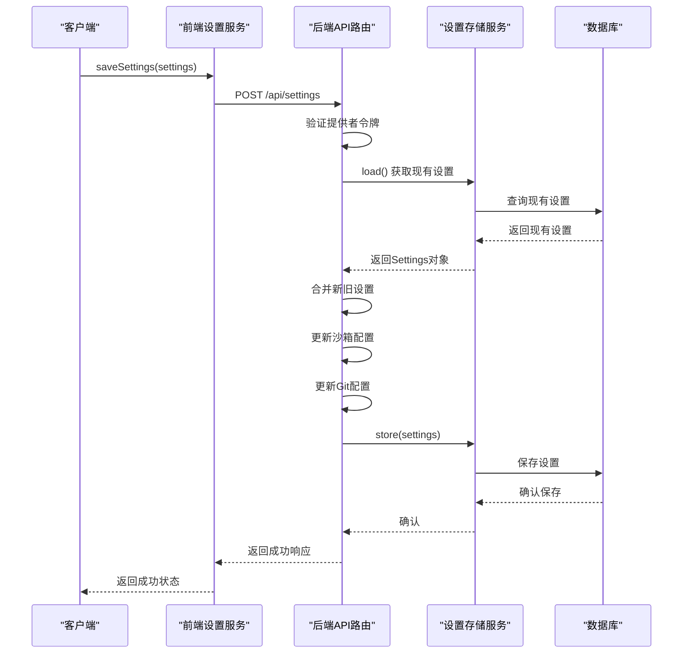
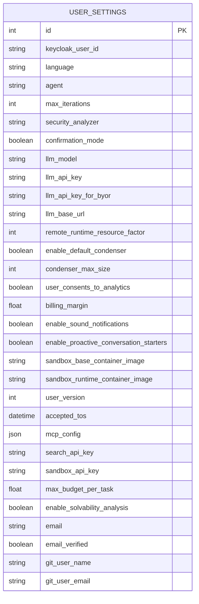
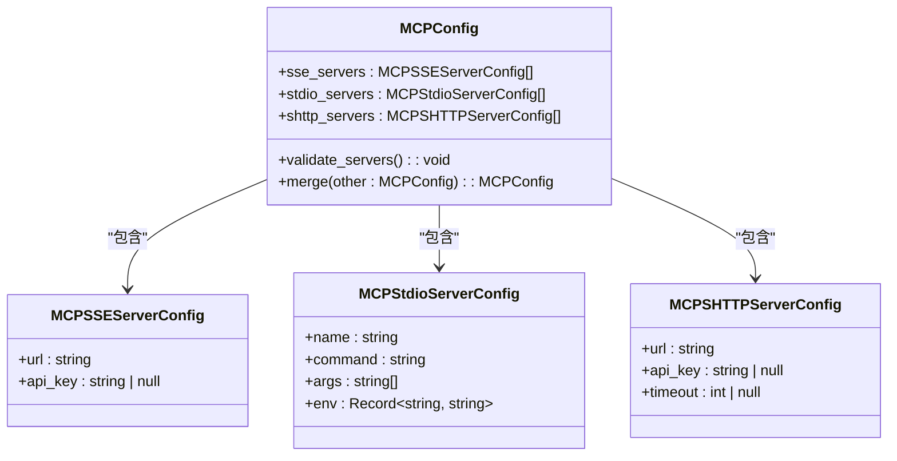
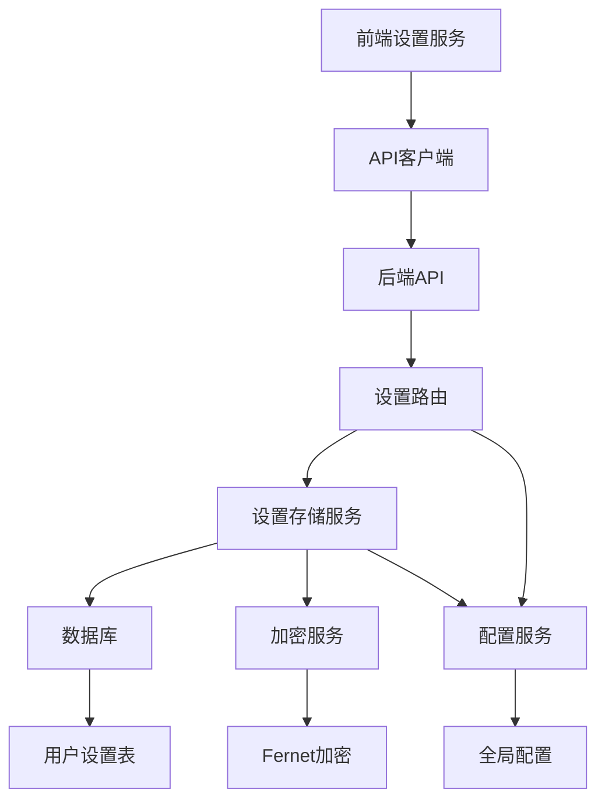

# 用户设置

<cite>
**本文档中引用的文件**   
- [user_settings.py](file://enterprise/storage/user_settings.py)
- [settings.py](file://openhands/server/routes/settings.py)
- [settings.types.ts](file://frontend/src/settings-service/settings.types.ts)
- [settings-service.api.ts](file://frontend/src/settings-service/settings-service.api.ts)
- [mcp_config.py](file://openhands/core/config/mcp_config.py)
- [saas_settings_store.py](file://enterprise/storage/saas_settings_store.py)
- [settings.py](file://openhands/storage/data_models/settings.py)
</cite>

## 目录
1. [简介](#简介)
2. [项目结构](#项目结构)
3. [核心组件](#核心组件)
4. [架构概述](#架构概述)
5. [详细组件分析](#详细组件分析)
6. [依赖分析](#依赖分析)
7. [性能考虑](#性能考虑)
8. [故障排除指南](#故障排除指南)
9. [结论](#结论)

## 简介
本文档详细介绍了OpenHands平台的用户设置功能，重点涵盖用户偏好管理、个性化配置和账户设置。文档详细说明了如何通过API管理用户配置，包括获取、更新和验证用户设置。同时涵盖了用户界面中可配置的选项，如通知偏好、显示设置和默认行为，并解释了设置的持久化机制和数据验证规则。

## 项目结构
用户设置功能分布在多个模块中，主要包含前端设置服务、后端API路由和数据库模型。系统采用分层架构，前端通过API与后端通信，后端将设置数据持久化到数据库中。

**Diagram sources**
- [user_settings.py](file://enterprise/storage/user_settings.py#L6-L41)
- [settings.py](file://openhands/server/routes/settings.py#L25-L212)
- [settings.types.ts](file://frontend/src/settings-service/settings.types.ts#L3-L54)

**Section sources**
- [user_settings.py](file://enterprise/storage/user_settings.py#L1-L41)
- [settings.py](file://openhands/server/routes/settings.py#L1-L212)

## 核心组件
用户设置系统由三个主要组件构成：前端设置服务、后端API路由和数据库模型。前端设置服务负责与用户界面交互，后端API路由处理HTTP请求，数据库模型定义了用户设置的持久化结构。

**Section sources**
- [settings-service.api.ts](file://frontend/src/settings-service/settings-service.api.ts#L1-L28)
- [settings.py](file://openhands/server/routes/settings.py#L25-L212)
- [user_settings.py](file://enterprise/storage/user_settings.py#L6-L41)

## 架构概述
用户设置系统的架构采用典型的三层模式：表示层（前端）、业务逻辑层（后端API）和数据访问层（数据库）。这种分层架构确保了系统的可维护性和可扩展性。

**Diagram sources**
- [settings-service.api.ts](file://frontend/src/settings-service/settings-service.api.ts#L1-L28)
- [settings.py](file://openhands/server/routes/settings.py#L25-L212)
- [saas_settings_store.py](file://enterprise/storage/saas_settings_store.py#L38-L393)

## 详细组件分析

### 前端设置服务分析
前端设置服务提供了获取和保存用户设置的API接口，通过Axios与后端进行通信。

#### 前端设置服务类图

**Diagram sources**
- [settings-service.api.ts](file://frontend/src/settings-service/settings-service.api.ts#L7-L26)
- [settings.types.ts](file://frontend/src/settings-service/settings.types.ts#L3-L54)

**Section sources**
- [settings-service.api.ts](file://frontend/src/settings-service/settings-service.api.ts#L1-L28)
- [settings.types.ts](file://frontend/src/settings-service/settings.types.ts#L1-L54)

### 后端API路由分析
后端API路由处理用户设置的获取和保存请求，包含数据验证和错误处理逻辑。

#### 获取设置序列图

#### 保存设置序列图

**Diagram sources**
- [settings.py](file://openhands/server/routes/settings.py#L28-L212)
- [saas_settings_store.py](file://enterprise/storage/saas_settings_store.py#L78-L127)

**Section sources**
- [settings.py](file://openhands/server/routes/settings.py#L28-L212)

### 数据库模型分析
用户设置数据库模型定义了所有可配置的用户偏好，包括语言、代理、最大迭代次数等。

#### 用户设置数据模型

**Diagram sources**
- [user_settings.py](file://enterprise/storage/user_settings.py#L6-L41)

**Section sources**
- [user_settings.py](file://enterprise/storage/user_settings.py#L1-L41)

### MCP配置分析
MCP（消息控制协议）配置允许用户定义与外部服务的集成，包括SSE服务器、stdio服务器和SHTTP服务器。

#### MCP配置类图

**Diagram sources**
- [mcp_config.py](file://openhands/core/config/mcp_config.py#L222-L332)

**Section sources**
- [mcp_config.py](file://openhands/core/config/mcp_config.py#L1-L384)

## 依赖分析
用户设置系统依赖于多个外部服务和内部组件，包括数据库、加密服务、配置服务等。

**Diagram sources**
- [settings-service.api.ts](file://frontend/src/settings-service/settings-service.api.ts#L1-L28)
- [settings.py](file://openhands/server/routes/settings.py#L25-L212)
- [saas_settings_store.py](file://enterprise/storage/saas_settings_store.py#L38-L393)

**Section sources**
- [settings-service.api.ts](file://frontend/src/settings-service/settings-service.api.ts#L1-L28)
- [settings.py](file://openhands/server/routes/settings.py#L1-L212)
- [saas_settings_store.py](file://enterprise/storage/saas_settings_store.py#L1-L393)

## 性能考虑
用户设置系统在性能方面考虑了以下几个关键点：
- 设置数据的缓存机制，减少数据库查询次数
- API响应的优化，确保快速加载用户设置
- 数据库查询的索引优化，特别是针对keycloak_user_id字段
- 异步操作的合理使用，避免阻塞主线程

## 故障排除指南
以下是用户设置功能常见问题的解决方案：

### 设置无法保存
**问题**：用户更改设置后点击保存，但设置未持久化。
**解决方案**：
1. 检查后端API是否返回500错误
2. 验证数据库连接是否正常
3. 检查用户是否有足够的权限修改设置
4. 查看日志中的具体错误信息

### 设置加载缓慢
**问题**：用户设置加载时间过长。
**解决方案**：
1. 检查数据库查询性能，确保相关字段有适当索引
2. 考虑实现设置数据的缓存机制
3. 优化API响应数据，只返回必要的字段

### MCP服务器配置冲突
**问题**：添加MCP服务器时出现URL重复错误。
**解决方案**：
1. 检查现有MCP服务器列表，确保URL唯一
2. 使用validateUrlUniqueness函数验证URL的唯一性
3. 提示用户使用不同的URL

### 默认值恢复问题
**问题**：用户期望恢复默认设置，但系统不支持此功能。
**解决方案**：
1. 当前系统已弃用重置设置功能
2. 建议用户手动将设置更改为默认值
3. 可以考虑在未来版本中重新实现此功能

**Section sources**
- [settings.py](file://openhands/server/routes/settings.py#L99-L105)
- [mcp-server-form.tsx](file://frontend/src/components/features/settings/mcp-settings/mcp-server-form.tsx#L96-L107)

## 结论
OpenHands的用户设置系统提供了一套完整的用户偏好管理解决方案，涵盖了从界面交互到数据持久化的各个方面。系统采用分层架构，确保了良好的可维护性和可扩展性。通过API接口，前端和后端实现了有效的通信，同时系统提供了完善的数据验证和错误处理机制。未来可以考虑增加设置版本控制和更灵活的默认值管理功能。