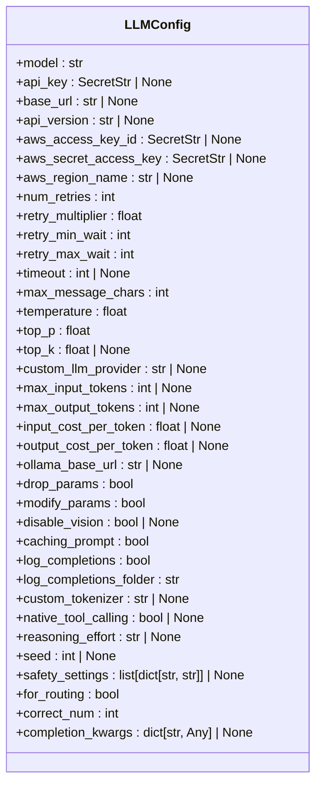
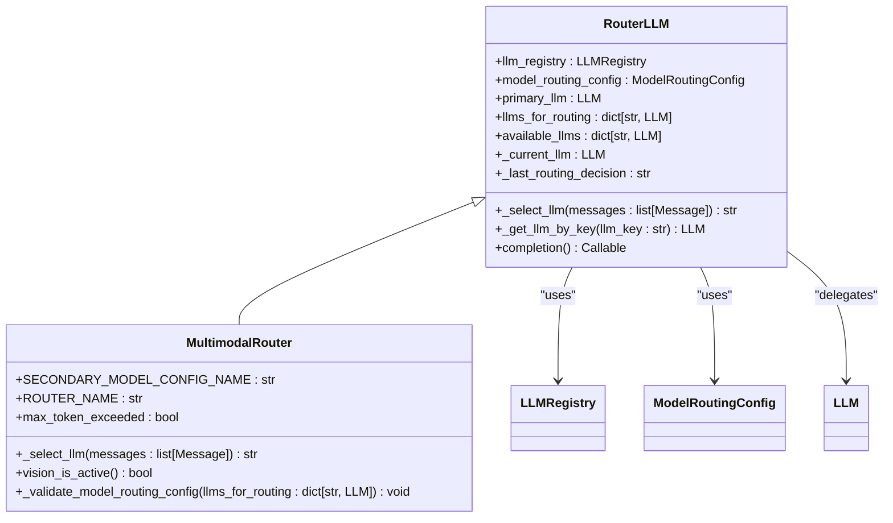
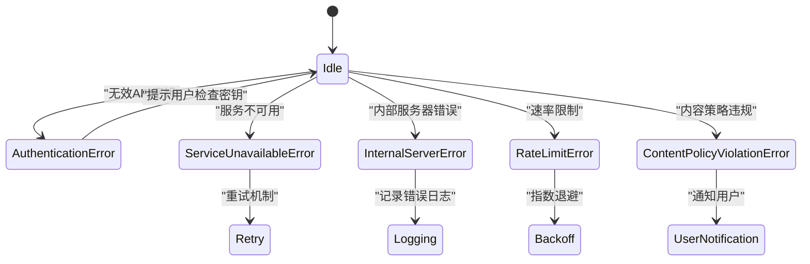
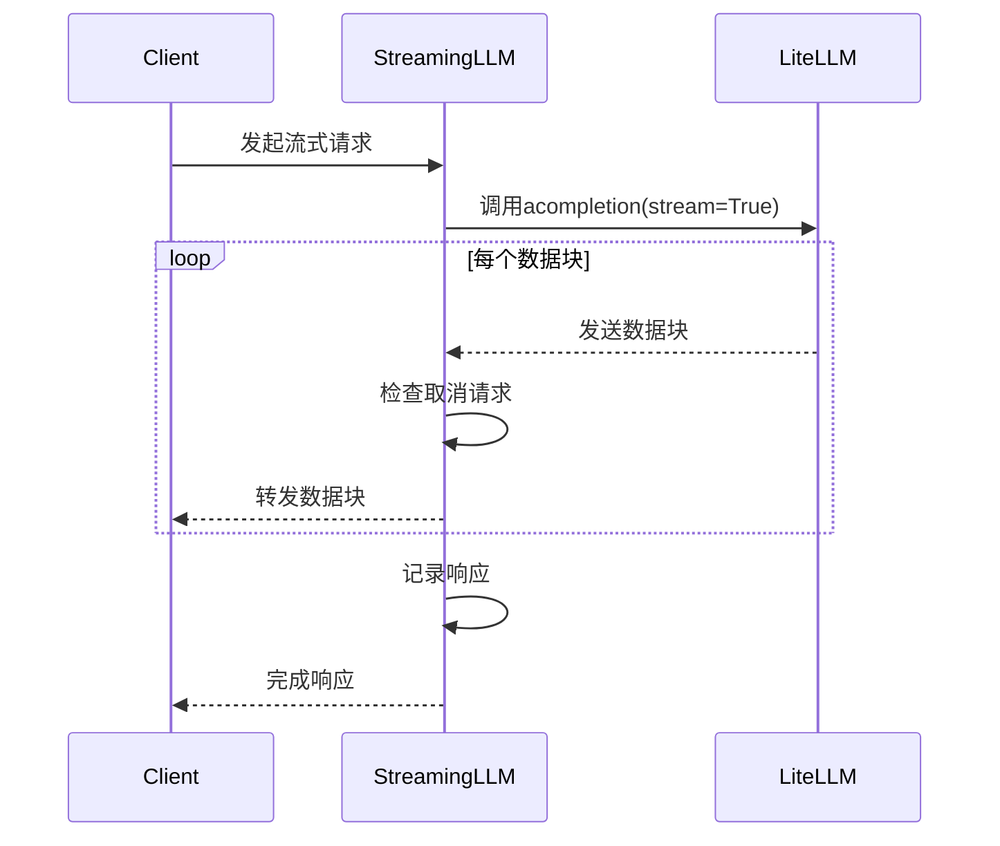
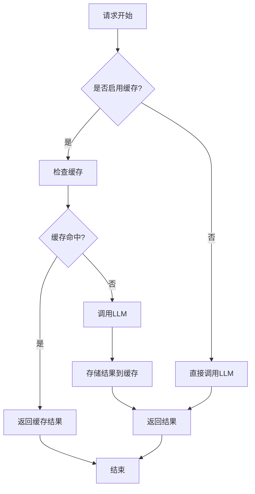

# LLM配置

<cite>
**本文档中引用的文件**   
- [llm_config.py](file://openhands/core/config/llm_config.py)
- [llm.py](file://openhands/llm/llm.py)
- [config.template.toml](file://config.template.toml)
- [base.py](file://openhands/llm/router/base.py)
- [impl.py](file://openhands/llm/router/rule_based/impl.py)
- [llm_registry.py](file://openhands/llm/llm_registry.py)
- [use-llm-api-key.ts](file://frontend/src/hooks/query/use-llm-api-key.ts)
- [agent_controller.py](file://openhands/controller/agent_controller.py)
</cite>

## 目录
1. [引言](#引言)
2. [核心配置项](#核心配置项)
3. [多模型路由配置](#多模型路由配置)
4. [不同LLM提供商的配置示例](#不同llm提供商的配置示例)
5. [配置验证与错误处理](#配置验证与错误处理)
6. [性能优化建议](#性能优化建议)
7. [结论](#结论)

## 引言
LLM配置是OpenHands系统的核心组成部分，它定义了大语言模型的行为、参数和集成方式。本文档详细介绍了LLM的配置选项和参数设置，包括API密钥管理、模型选择、温度参数、最大token数等核心配置项。同时，文档还深入探讨了多模型路由配置的实现机制和使用场景，提供了不同LLM提供商的配置示例，并描述了配置验证和错误处理机制。

## 核心配置项

LLM配置的核心是`LLMConfig`类，它定义了所有与大语言模型相关的配置参数。这些参数控制着模型的行为、性能和安全特性。

### API密钥管理
API密钥是访问LLM服务的身份验证凭证。在OpenHands中，API密钥通过`api_key`字段进行配置，该字段被定义为`SecretStr`类型，确保密钥在日志和表示中不会被意外暴露。



**Diagram sources**
- [llm_config.py](file://openhands/core/config/llm_config.py#L12-L105)

**Section sources**
- [llm_config.py](file://openhands/core/config/llm_config.py#L1-L199)

### 模型选择
模型选择通过`model`字段进行配置，支持多种LLM提供商的模型。系统通过`extractModelAndProvider`函数解析模型字符串，提取提供商和模型名称。例如，`"azure/ada"`会被解析为Azure提供商的ada模型。

### 温度参数
温度参数（`temperature`）控制生成文本的随机性。较低的温度值（如0.0）会产生更确定性和保守的输出，而较高的温度值（如1.0）会产生更多样化和创造性的输出。默认值为0.0，适用于需要确定性输出的场景。

### 最大token数
最大token数配置包括`max_input_tokens`和`max_output_tokens`两个字段，分别控制输入和输出的最大token数量。这些参数对于管理模型的上下文窗口和输出长度至关重要，有助于避免超出模型限制和控制成本。

## 多模型路由配置

多模型路由配置允许系统根据特定条件在多个LLM模型之间智能切换，以优化性能和成本。

### 路由机制
多模型路由通过`RouterLLM`基类实现，该类继承自`LLM`并提供了路由功能。路由决策由`_select_llm`方法实现，该方法根据消息内容和上下文决定使用哪个模型。



**Diagram sources**
- [base.py](file://openhands/llm/router/base.py#L17-L165)
- [impl.py](file://openhands/llm/router/rule_based/impl.py#L9-L75)

**Section sources**
- [base.py](file://openhands/llm/router/base.py#L1-L165)
- [impl.py](file://openhands/llm/router/rule_based/impl.py#L1-L75)

### 配置示例
在`config.toml`中配置多模型路由：

```toml
# 主LLM（主模型）
[llm]
model = "claude-sonnet-4"
api_key = "your-api-key"

# 用于路由的次级模型
[llm.secondary_model]
model = "kimi-k2"
api_key = "your-api-key"
for_routing = true

# 启用路由
[model_routing]
router_name = "multimodal_router"
```

### 使用场景
多模型路由特别适用于以下场景：
- **多模态内容处理**：当输入包含图像时，路由到支持多模态的主模型
- **成本优化**：对于简单任务使用成本较低的次级模型
- **性能优化**：当次级模型的上下文窗口不足时，自动切换到主模型

## 不同LLM提供商的配置示例

### OpenAI配置
```toml
[llm]
model = "gpt-4o"
api_key = "your-openai-api-key"
temperature = 0.7
max_output_tokens = 2000
```

### Anthropic配置
```toml
[llm]
model = "claude-3-5-sonnet-20240620"
api_key = "your-anthropic-api-key"
temperature = 0.0
top_p = 0.9
```

### LiteLLM配置
LiteLLM作为统一接口，支持多种后端提供商：

```toml
[llm]
model = "azure/gpt-3.5-turbo"
api_key = "your-azure-api-key"
base_url = "https://your-resource.openai.azure.com"
api_version = "2024-12-01-preview"
custom_llm_provider = "azure"
```

### 本地LLM配置
对于本地运行的LLM，如Ollama：

```toml
[llm]
model = "llama3"
base_url = "http://localhost:11434"
custom_llm_provider = "ollama"
```

## 配置验证与错误处理

### 验证机制
系统通过多层次的验证机制确保配置的有效性：

1. **类型验证**：使用Pydantic的`Field`和`model_config`进行类型和约束验证
2. **密钥验证**：通过`ApiKeyStore`验证API密钥的有效性
3. **模型验证**：检查模型名称是否在支持的模型列表中

### 错误处理
系统定义了多种错误类型来处理不同的异常情况：



**Diagram sources**
- [agent_controller.py](file://openhands/controller/agent_controller.py#L320-L347)

**Section sources**
- [agent_controller.py](file://openhands/controller/agent_controller.py#L320-L347)

### 无效API密钥处理
当API密钥无效时，系统会：
1. 记录警告日志
2. 返回401未授权响应
3. 提示用户检查密钥配置

### 不支持的模型名称处理
当模型名称不支持时，系统会：
1. 记录错误日志
2. 使用默认模型作为回退
3. 通知用户模型不可用

## 性能优化建议

### 流式响应配置
流式响应可以显著改善用户体验，特别是在处理长文本生成时。通过`StreamingLLM`类实现流式响应：



**Diagram sources**
- [streaming_llm.py](file://openhands/llm/streaming_llm.py#L11-L117)

**Section sources**
- [streaming_llm.py](file://openhands/llm/streaming_llm.py#L1-L117)

### 缓存策略
系统实现了多层次的缓存策略：

1. **响应缓存**：通过`caching_prompt`参数启用提示缓存
2. **会话缓存**：使用`EventStream`的缓存页面提高事件检索性能
3. **API密钥缓存**：在前端使用React Query缓存LLM API密钥



**Diagram sources**
- [use-llm-api-key.ts](file://frontend/src/hooks/query/use-llm-api-key.ts#L1-L42)
- [test_event_stream.py](file://tests/unit/events/test_event_stream.py#L401-L430)

**Section sources**
- [use-llm-api-key.ts](file://frontend/src/hooks/query/use-llm-api-key.ts#L1-L42)
- [test_event_stream.py](file://tests/unit/events/test_event_stream.py#L401-L430)

## 结论
LLM配置是OpenHands系统的核心，它通过灵活的参数设置和智能的路由机制，实现了对多种大语言模型的高效管理和优化使用。通过合理的API密钥管理、模型选择、温度参数和最大token数配置，用户可以根据具体需求定制LLM的行为。多模型路由配置进一步增强了系统的灵活性和性能，使其能够根据输入内容和上下文智能选择最合适的模型。完善的配置验证和错误处理机制确保了系统的稳定性和可靠性，而流式响应和缓存策略则显著提升了用户体验和系统性能。