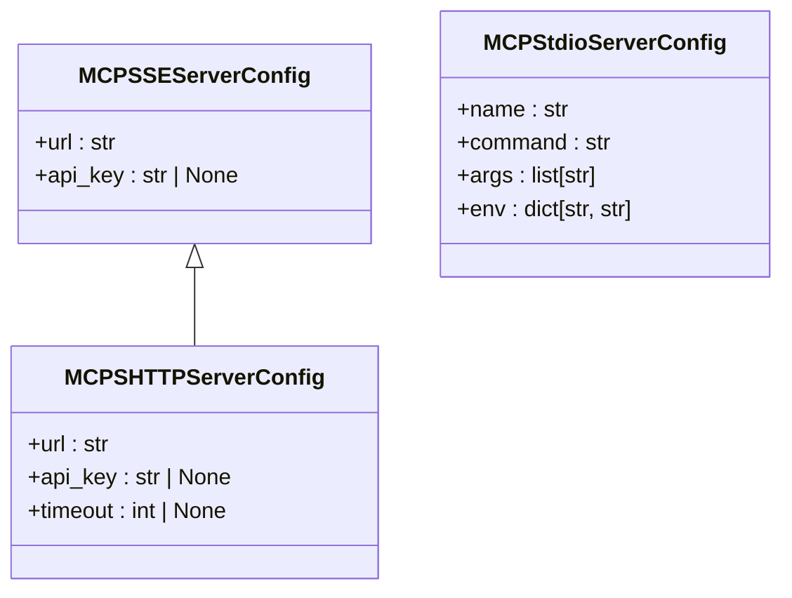
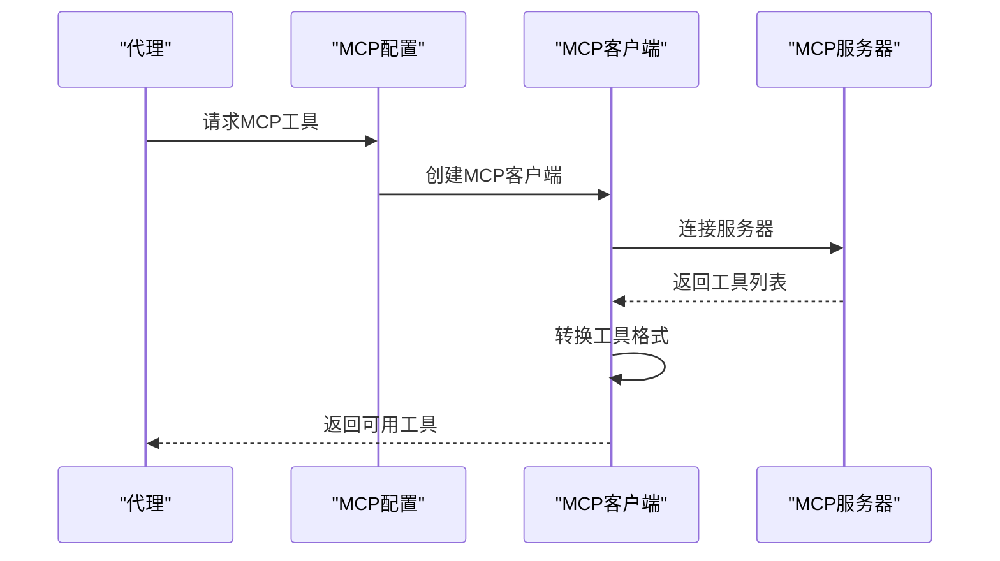
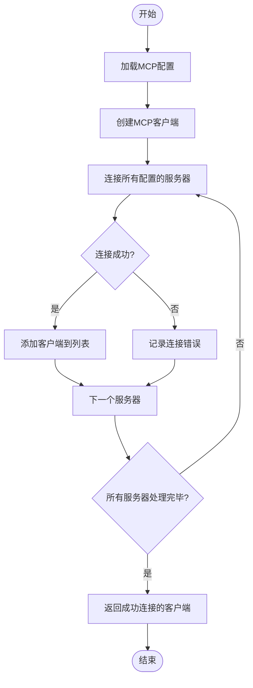
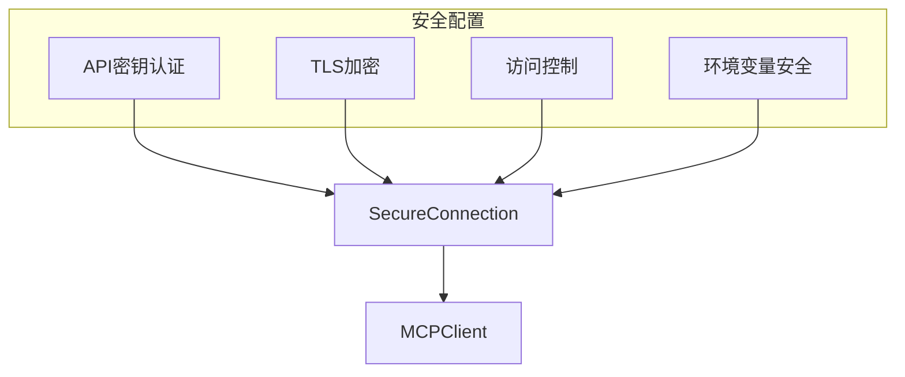
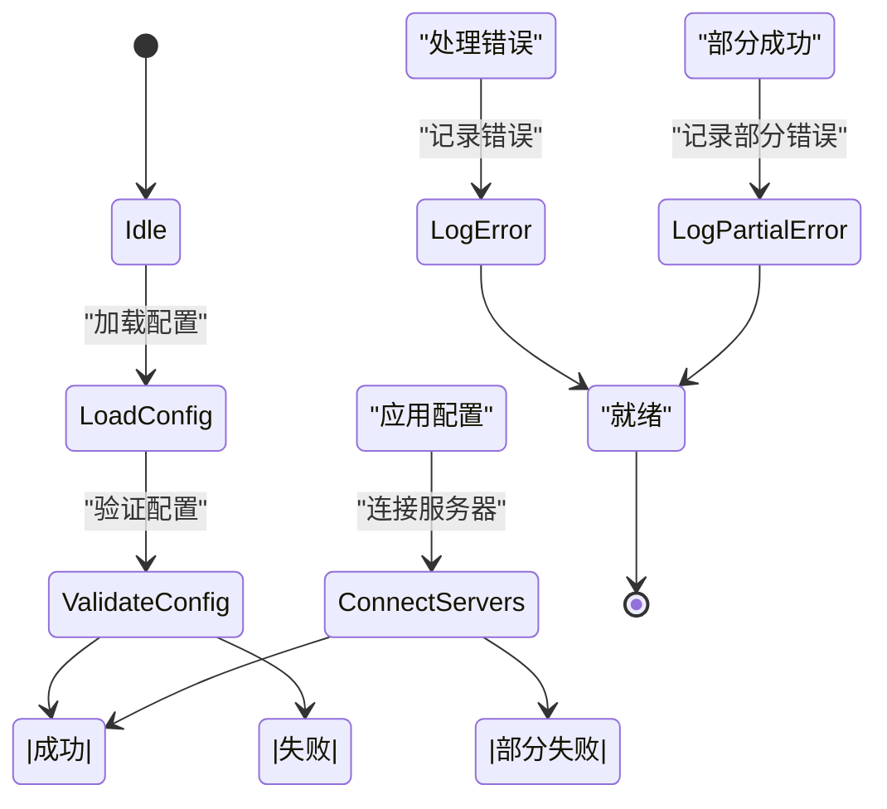

# MCP配置

<cite>
**本文档引用的文件**
- [mcp_config.py](file://openhands/core/config/mcp_config.py)
- [client.py](file://openhands/mcp/client.py)
- [tool.py](file://openhands/mcp/tool.py)
- [mcp_screen.py](file://openhands-cli/openhands_cli/tui/settings/mcp_screen.py)
- [mcp-server-form.tsx](file://frontend/src/components/features/settings/mcp-settings/mcp-server-form.tsx)
- [mcp_config.py](file://enterprise/server/mcp/mcp_config.py)
- [action_execution_server.py](file://openhands/runtime/action_execution_server.py)
</cite>

## 目录
1. [MCP配置概述](#mcp配置概述)
2. [MCP客户端配置参数](#mcp客户端配置参数)
3. [MCP工具发现机制和配置格式](#mcp工具发现机制和配置格式)
4. [多MCP服务器配置和负载均衡策略](#多mcp服务器配置和负载均衡策略)
5. [安全配置选项](#安全配置选项)
6. [配置的热重载功能和错误恢复机制](#配置的热重载功能和错误恢复机制)
7. [实际配置示例](#实际配置示例)

## MCP配置概述

MCP（Model Context Protocol）配置是OpenHands系统中用于管理模型上下文协议的核心组件。MCP配置允许系统连接到不同的MCP服务器，包括SSE、SHTTP和stdio类型的服务器，以实现灵活的工具集成和功能扩展。MCP配置通过`MCPConfig`类进行管理，该类定义了SSE、stdio和SHTTP服务器的配置。

MCP配置的主要目的是为OpenHands代理提供访问外部工具和服务的能力。通过配置不同的MCP服务器，代理可以调用各种工具来完成复杂的任务。MCP配置支持多种连接类型，包括基于URL的SSE和SHTTP连接，以及基于命令行的stdio连接。

**Section sources**
- [mcp_config.py](file://openhands/core/config/mcp_config.py#L222-L332)

## MCP客户端配置参数

MCP客户端配置参数包括服务器地址、认证令牌和超时设置。这些参数在不同的MCP服务器类型中有不同的配置方式。

对于SSE和SHTTP服务器，主要配置参数包括：
- **url**: 服务器的URL地址，必须包含有效的协议（http、https、ws或wss）
- **api_key**: 可选的API密钥，用于身份验证
- **timeout**: 超时设置（仅SHTTP服务器），以秒为单位，必须为正数且不超过3600秒

对于stdio服务器，主要配置参数包括：
- **name**: 服务器名称，只能包含字母、数字、连字符和下划线
- **command**: 要执行的命令，应为单个可执行文件
- **args**: 传递给命令的参数列表
- **env**: 服务器的环境变量

SHTTP服务器的超时设置具有严格的验证规则：
- 超时值必须为正数
- 超时值不能超过3600秒（1小时）
- 默认超时值为60秒
- 如果未指定超时值，则使用默认值



**Diagram sources**
- [mcp_config.py](file://openhands/core/config/mcp_config.py#L46-L220)

**Section sources**
- [mcp_config.py](file://openhands/core/config/mcp_config.py#L46-L220)
- [mcp-server-form.tsx](file://frontend/src/components/features/settings/mcp-settings/mcp-server-form.tsx#L299-L336)

## MCP工具发现机制和配置格式

MCP工具发现机制通过连接到配置的MCP服务器并获取可用工具列表来工作。系统使用`fetch_mcp_tools_from_config`函数从MCP配置中获取工具，该函数会创建MCP客户端并连接到服务器以发现可用工具。

MCP配置格式基于JSON结构，支持三种服务器类型：SSE、SHTTP和stdio。配置文件可以包含一个或多个服务器配置。配置格式支持字符串URL的简化语法，可以自动转换为完整的服务器配置对象。

工具发现过程包括以下步骤：
1. 创建MCP客户端实例
2. 连接到配置的MCP服务器
3. 获取服务器提供的工具列表
4. 将工具转换为代理可用的格式
5. 将工具添加到代理的工具集合中

配置格式支持向后兼容性，允许在不指定超时值的情况下使用默认值。配置验证确保服务器URL有效且唯一，防止重复配置。



**Diagram sources**
- [mcp_config.py](file://openhands/core/config/mcp_config.py#L277-L332)
- [client.py](file://openhands/mcp/client.py#L59-L101)

**Section sources**
- [mcp_config.py](file://openhands/core/config/mcp_config.py#L277-L332)
- [client.py](file://openhands/mcp/client.py#L149-L179)
- [tool.py](file://openhands/mcp/tool.py#L14-L23)

## 多MCP服务器配置和负载均衡策略

系统支持配置多个MCP服务器，包括多个SSE、SHTTP和stdio服务器。多服务器配置通过将不同类型的服务器配置合并到`MCPConfig`对象中实现。系统支持通过`merge`方法合并多个MCP配置，允许从不同来源集成服务器配置。

负载均衡策略主要通过以下方式实现：
1. **并行连接**: 系统会尝试连接所有配置的服务器，失败的连接会被记录但不会影响其他服务器的连接
2. **错误收集**: 使用`mcp_error_collector`收集连接错误，便于诊断和监控
3. **配置合并**: 支持将多个配置源的服务器合并，实现灵活的配置管理

当配置多个服务器时，系统会为每个服务器创建独立的客户端连接。如果某个服务器连接失败，系统会记录错误但继续尝试连接其他服务器。这种设计确保了系统的高可用性，即使部分服务器不可用，其他服务器仍可正常工作。



**Diagram sources**
- [mcp_config.py](file://openhands/core/config/mcp_config.py#L327-L332)
- [client.py](file://openhands/mcp/client.py#L127-L147)

**Section sources**
- [mcp_config.py](file://openhands/core/config/mcp_config.py#L327-L332)
- [client.py](file://openhands/mcp/client.py#L127-L147)

## 安全配置选项

MCP配置包含多种安全配置选项，包括TLS加密和访问控制。系统通过API密钥实现访问控制，确保只有授权客户端可以访问MCP服务器。

安全特性包括：
- **API密钥认证**: 支持在服务器配置中指定API密钥，用于身份验证
- **HTTPS支持**: 强制要求URL包含有效的协议（http、https、ws或wss），确保安全连接
- **环境变量保护**: stdio服务器的环境变量可以安全地传递敏感信息
- **Windows平台限制**: 在Windows平台上禁用MCP功能，避免潜在的安全风险

对于SaaS环境，系统使用`SaaSOpenHandsMCPConfig`类创建安全的MCP配置，该类会从API密钥存储中检索用户特定的MCP API密钥。这种设计确保了每个用户都有独立的访问凭证，增强了多租户环境的安全性。



**Diagram sources**
- [mcp_config.py](file://openhands/core/config/mcp_config.py#L25-L44)
- [mcp_config.py](file://enterprise/server/mcp/mcp_config.py#L25-L55)

**Section sources**
- [mcp_config.py](file://openhands/core/config/mcp_config.py#L25-L44)
- [mcp_config.py](file://enterprise/server/mcp/mcp_config.py#L25-L55)

## 配置的热重载功能和错误恢复机制

MCP配置支持热重载功能和健壮的错误恢复机制。系统能够在运行时动态更新MCP配置，无需重启服务。错误恢复机制确保在配置错误或连接失败时系统能够继续运行。

热重载功能通过以下方式实现：
- **配置文件监控**: 系统监控MCP配置文件的变化
- **动态更新**: 在会话重启时应用新的配置
- **配置差异检测**: 比较当前配置和新配置，显示将要添加或更改的服务器

错误恢复机制包括：
- **连接错误收集**: 使用`mcp_error_collector`收集和记录连接错误
- **异常处理**: 在连接失败时捕获异常并继续处理其他服务器
- **超时处理**: 支持工具调用的超时控制，防止长时间阻塞
- **Windows平台兼容性**: 在Windows平台上优雅地禁用MCP功能

当MCP配置文件存在但格式无效时，系统会报告配置错误但不会中断主要功能。这种设计确保了系统的稳定性，即使配置出现问题，核心功能仍可正常工作。



**Diagram sources**
- [mcp_screen.py](file://openhands-cli/openhands_cli/tui/settings/mcp_screen.py#L43-L58)
- [client.py](file://openhands/mcp/client.py#L101-L125)

**Section sources**
- [mcp_screen.py](file://openhands-cli/openhands_cli/tui/settings/mcp_screen.py#L43-L74)
- [client.py](file://openhands/mcp/client.py#L101-L147)

## 实际配置示例

以下是MCP配置的实际示例，展示如何集成不同的MCP服务。

### SSE服务器配置示例
```json
{
  "sse_servers": [
    {
      "url": "https://api.example.com/mcp",
      "api_key": "your-api-key"
    }
  ]
}
```

### SHTTP服务器配置示例
```json
{
  "shttp_servers": [
    {
      "url": "https://api.example.com/mcp",
      "api_key": "your-api-key",
      "timeout": 90
    }
  ]
}
```

### stdio服务器配置示例
```json
{
  "stdio_servers": [
    {
      "name": "tavily",
      "command": "npx",
      "args": ["-y", "tavily-mcp@0.2.1"],
      "env": {
        "TAVILY_API_KEY": "your-tavily-key"
      }
    }
  ]
}
```

### 综合配置示例
```json
{
  "sse_servers": [
    {
      "url": "https://sse.example.com/mcp"
    }
  ],
  "shttp_servers": [
    {
      "url": "https://shttp.example.com/mcp",
      "timeout": 120
    }
  ],
  "stdio_servers": [
    {
      "name": "search",
      "command": "python",
      "args": ["-m", "search_server"],
      "env": {
        "API_KEY": "your-key"
      }
    }
  ]
}
```

这些配置示例展示了如何集成不同类型的MCP服务。SSE服务器适用于需要实时通信的场景，SHTTP服务器适用于传统的HTTP请求-响应模式，而stdio服务器适用于本地运行的工具。通过组合这些配置，可以创建功能丰富的代理系统，能够访问各种外部服务和工具。

**Section sources**
- [mcp_config.py](file://openhands/core/config/mcp_config.py#L222-L332)
- [mcp_screen.py](file://openhands-cli/openhands_cli/tui/settings/mcp_screen.py#L43-L58)