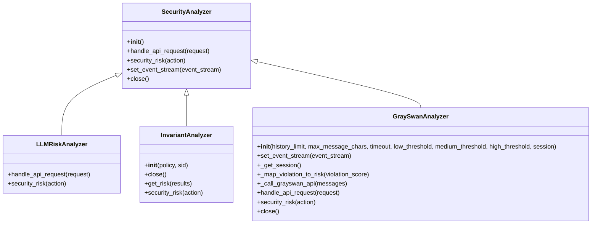
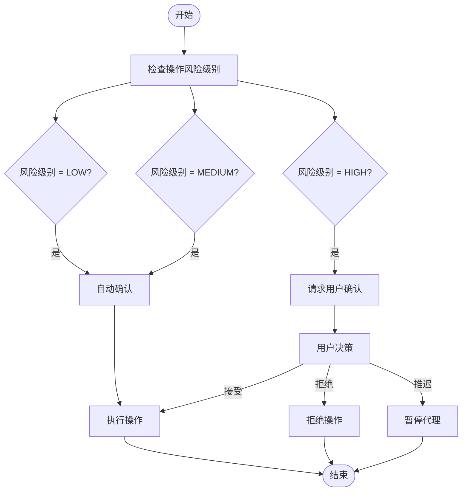
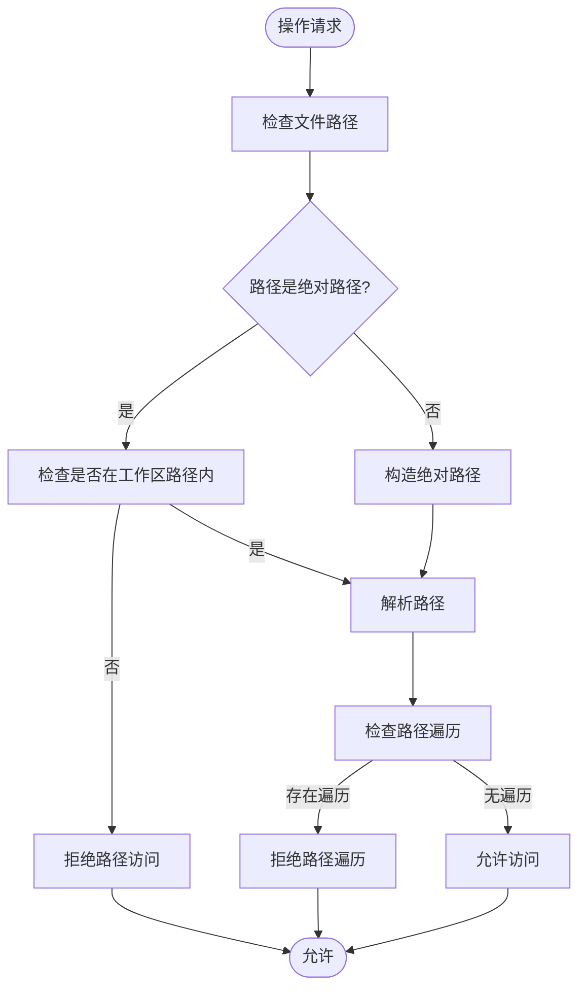
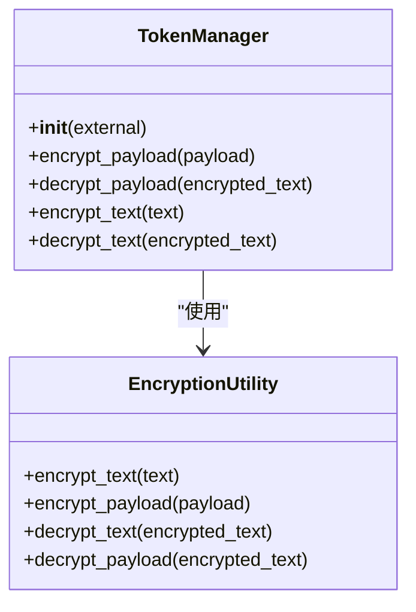
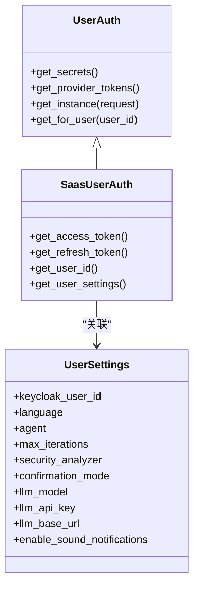
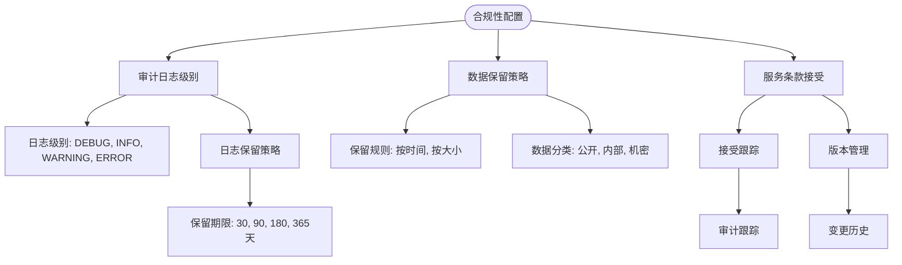

# 安全配置

<cite>
**本文档中引用的文件**   
- [analyzer.py](file://openhands/security/analyzer.py)
- [options.py](file://openhands/security/options.py)
- [config.template.toml](file://config.template.toml)
- [security_analyzer.py](file://openhands/security/llm/analyzer.py)
- [invariant/analyzer.py](file://openhands/security/invariant/analyzer.py)
- [grayswan/analyzer.py](file://openhands/security/grayswan/analyzer.py)
- [agent_controller.py](file://openhands/controller/agent_controller.py)
- [token_manager.py](file://enterprise/server/auth/token_manager.py)
- [user_settings_store.py](file://enterprise/storage/user_settings.py)
- [invariant-service.ts](file://frontend/src/api/invariant-service.ts)
- [README.md](file://openhands/security/README.md)
</cite>

## 目录
1. [简介](#简介)
2. [安全分析器配置](#安全分析器配置)
3. [风险级别阈值和自动阻止策略](#风险级别阈值和自动阻止策略)
4. [敏感文件访问控制和命令执行限制](#敏感文件访问控制和命令执行限制)
5. [数据加密配置](#数据加密配置)
6. [用户权限管理和访问控制列表](#用户权限管理和访问控制列表)
7. [合规性相关配置](#合规性相关配置)
8. [安全配置最佳实践](#安全配置最佳实践)

## 简介
OpenHands系统提供了一套全面的安全配置机制，旨在保护用户数据和系统完整性。该系统通过多种安全分析器、加密机制和访问控制策略来确保代理操作的安全性。安全配置主要通过配置文件和运行时设置来管理，支持多种安全分析器选项，包括基于LLM的风险评估、Invariant分析器和GraySwan分析器。这些机制共同工作，为用户提供了一个安全可靠的开发环境。

## 安全分析器配置
OpenHands系统支持多种安全分析器，用户可以根据需求选择合适的分析器。安全分析器通过分析代理操作来评估潜在的安全风险，并在必要时要求用户确认。系统提供了三种主要的安全分析器：LLM风险分析器、Invariant分析器和GraySwan分析器。



**图表来源**
- [analyzer.py](file://openhands/security/analyzer.py)
- [security_analyzer.py](file://openhands/security/llm/analyzer.py)
- [invariant/analyzer.py](file://openhands/security/invariant/analyzer.py)
- [grayswan/analyzer.py](file://openhands/security/grayswan/analyzer.py)

**安全分析器配置说明：**

1. **LLM风险分析器**：这是默认的安全分析器，利用LLM提供的风险评估。它尊重LLM在生成操作时设置的`security_risk`属性，允许基于上下文和操作内容进行智能风险评估。

2. **Invariant分析器**：使用Invariant分析器来分析跟踪并检测OpenHands工作流中的潜在问题。它使用确认模式来请求用户确认可能有风险的操作。

3. **GraySwan分析器**：使用GraySwan的Cygnal API进行AI安全监控。需要设置`GRAYSWAN_API_KEY`环境变量，并可选择性地设置`GRAYSWAN_POLICY_ID`。

安全分析器的配置可以通过Web界面或配置文件进行。在Web界面中，用户可以通过点击右下角的齿轮图标打开配置，然后从下拉菜单中选择安全分析器。在配置文件中，可以通过修改`config.toml`文件来配置安全分析器：

```toml
[security]
# 启用确认模式
confirmation_mode = true
# 要使用的安全分析器
security_analyzer = "your-security-analyzer"
```

**章节来源**
- [analyzer.py](file://openhands/security/analyzer.py)
- [options.py](file://openhands/security/options.py)
- [config.template.toml](file://config.template.toml)
- [README.md](file://openhands/security/README.md)

## 风险级别阈值和自动阻止策略
OpenHands系统定义了明确的风险级别阈值和自动阻止策略，以确保系统的安全性。风险级别分为LOW、MEDIUM和HIGH三个等级，每个等级对应不同的处理策略。



**图表来源**
- [agent_controller.py](file://openhands/controller/agent_controller.py)
- [security_analyzer.py](file://openhands/security/llm/analyzer.py)

**风险级别和处理策略：**

1. **LOW风险**：低风险操作被视为安全，系统会自动确认并执行，无需用户干预。

2. **MEDIUM风险**：中等风险操作也被视为相对安全，系统会自动确认并执行。

3. **HIGH风险**：高风险操作需要用户确认。系统会暂停代理并等待用户输入，直到用户明确接受或拒绝操作。

4. **UNKNOWN风险**：当没有配置安全分析器或分析器无法确定风险级别时，操作被视为UNKNOWN风险，系统会要求用户确认。

系统还支持基于风险的确认策略，用户可以选择"始终确认"、"从不确认"或"仅对高风险操作确认"。这种灵活的策略允许用户根据自己的安全需求进行调整。

**章节来源**
- [agent_controller.py](file://openhands/controller/agent_controller.py)
- [security_analyzer.py](file://openhands/security/llm/analyzer.py)
- [invariant/analyzer.py](file://openhands/security/invariant/analyzer.py)

## 敏感文件访问控制和命令执行限制
OpenHands系统实施了严格的敏感文件访问控制和命令执行限制，以防止未经授权的访问和潜在的安全威胁。



**图表来源**
- [cli_runtime.py](file://openhands/runtime/impl/cli/cli_runtime.py)

**敏感文件访问控制机制：**

1. **路径验证**：系统会对所有文件路径进行验证，确保它们在允许的工作区路径内。任何试图访问工作区外文件的请求都会被拒绝。

2. **路径遍历防护**：系统会检测并阻止路径遍历攻击，防止通过`../`等序列访问受限目录。

3. **工作区隔离**：所有文件操作都被限制在指定的工作区目录内，确保代理无法访问系统其他部分的文件。

**命令执行限制：**

1. **沙箱环境**：所有命令都在隔离的沙箱环境中执行，限制了对主机系统的直接访问。

2. **超时机制**：每个命令执行都有超时限制，防止无限循环或长时间运行的命令占用系统资源。

3. **权限控制**：沙箱环境以非特权用户身份运行，限制了可以执行的系统命令类型。

**章节来源**
- [cli_runtime.py](file://openhands/runtime/impl/cli/cli_runtime.py)
- [agent_controller.py](file://openhands/controller/agent_controller.py)

## 数据加密配置
OpenHands系统提供了全面的数据加密配置，确保静态数据和传输中数据的安全性。



**图表来源**
- [token_manager.py](file://enterprise/server/auth/token_manager.py)

**静态数据加密：**

1. **Fernet加密**：系统使用Fernet对敏感数据进行加密，包括用户令牌、API密钥和其他机密信息。加密密钥基于JWT密钥生成，确保了加密的安全性。

2. **数据库加密**：用户设置和敏感数据在存储到数据库前会被加密，确保即使数据库被泄露，敏感信息也不会暴露。

3. **密钥管理**：加密密钥通过环境变量`jwt_secret`配置，建议使用强随机密钥并定期轮换。

**传输中数据加密：**

1. **HTTPS**：所有外部通信都通过HTTPS进行，确保数据在传输过程中的机密性和完整性。

2. **JWT令牌**：用户认证使用JWT令牌，令牌使用HS256算法签名，防止篡改。

3. **API密钥**：API访问使用API密钥进行身份验证，密钥在传输过程中通过HTTPS加密。

**章节来源**
- [token_manager.py](file://enterprise/server/auth/token_manager.py)
- [user_settings_store.py](file://enterprise/storage/user_settings.py)

## 用户权限管理和访问控制列表
OpenHands系统实现了完善的用户权限管理和访问控制机制，确保只有授权用户才能访问特定资源。



**图表来源**
- [token_manager.py](file://enterprise/server/auth/token_manager.py)
- [user_settings_store.py](file://enterprise/storage/user_settings.py)

**用户权限管理：**

1. **基于角色的访问控制**：系统使用Keycloak进行身份验证和授权，支持多种身份提供商，包括GitHub、GitLab和Bitbucket。

2. **用户设置存储**：每个用户的设置存储在数据库中，包括安全分析器选择、确认模式、LLM配置等。

3. **会话管理**：用户会话通过JWT令牌管理，令牌包含用户ID和权限信息。

**访问控制列表：**

1. **API访问控制**：所有API端点都受身份验证保护，只有经过身份验证的用户才能访问。

2. **资源访问控制**：用户只能访问自己创建或被授权的资源，系统实施严格的资源隔离。

3. **权限继承**：用户的权限从其身份提供商继承，确保一致的访问控制策略。

**章节来源**
- [token_manager.py](file://enterprise/server/auth/token_manager.py)
- [user_settings_store.py](file://enterprise/storage/user_settings.py)
- [middleware.py](file://enterprise/server/middleware.py)

## 合规性相关配置
OpenHands系统提供了多种合规性相关配置，帮助用户满足各种法规和标准要求。



**图表来源**
- [user_settings_store.py](file://enterprise/storage/user_settings.py)
- [middleware.py](file://enterprise/server/middleware.py)

**审计日志级别：**

1. **日志级别配置**：系统支持多种日志级别，包括DEBUG、INFO、WARNING和ERROR，用户可以根据需要调整日志详细程度。

2. **日志内容**：审计日志记录所有关键操作，包括用户登录、配置更改、代理操作等。

3. **日志格式**：日志采用结构化格式，便于分析和监控。

**数据保留策略：**

1. **保留期限**：用户可以配置数据保留期限，系统会自动清理过期数据。

2. **数据分类**：数据根据敏感程度进行分类，不同类别的数据有不同的保留策略。

3. **合规性报告**：系统可以生成合规性报告，帮助用户证明其符合相关法规要求。

**服务条款接受：**

1. **接受跟踪**：系统跟踪用户对服务条款的接受情况，确保所有用户都同意最新的条款。

2. **版本管理**：服务条款的每个版本都有唯一标识，便于跟踪变更历史。

3. **审计跟踪**：用户的接受操作被记录在审计日志中，提供完整的审计跟踪。

**章节来源**
- [user_settings_store.py](file://enterprise/storage/user_settings.py)
- [middleware.py](file://enterprise/server/middleware.py)
- [auth.py](file://enterprise/server/routes/auth.py)

## 安全配置最佳实践
为了确保OpenHands系统的安全性，建议遵循以下最佳实践：

1. **启用安全分析器**：始终启用安全分析器，特别是对于生产环境。推荐使用LLM风险分析器作为起点，然后根据需要升级到更高级的分析器。

2. **配置强密码策略**：确保所有用户账户使用强密码，并定期轮换密码。

3. **限制API密钥权限**：为API密钥配置最小必要权限，避免使用具有广泛权限的密钥。

4. **定期更新系统**：及时应用安全补丁和更新，确保系统免受已知漏洞的影响。

5. **监控和审计**：启用审计日志并定期审查，及时发现和响应潜在的安全事件。

6. **数据加密**：确保所有敏感数据在静态和传输过程中都经过加密。

7. **访问控制**：实施最小权限原则，确保用户只能访问完成其工作所需的资源。

8. **备份和恢复**：定期备份关键数据，并测试恢复流程，确保在发生安全事件时能够快速恢复。

9. **安全培训**：对用户进行安全意识培训，提高他们对潜在安全威胁的认识。

10. **漏洞管理**：建立漏洞管理流程，及时识别、评估和修复安全漏洞。

通过遵循这些最佳实践，可以显著提高OpenHands系统的安全性，保护用户数据和系统完整性。

**章节来源**
- [README.md](file://openhands/security/README.md)
- [config.template.toml](file://config.template.toml)
- [security_analyzer.py](file://openhands/security/llm/analyzer.py)