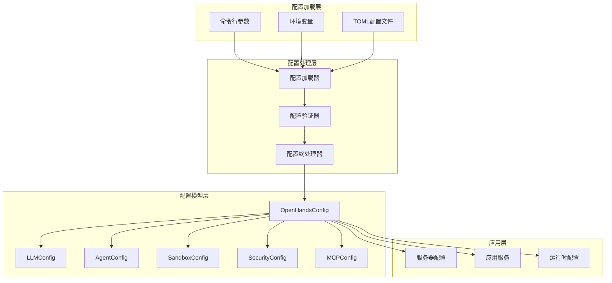
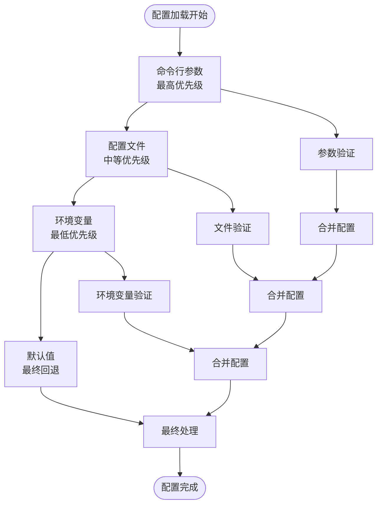
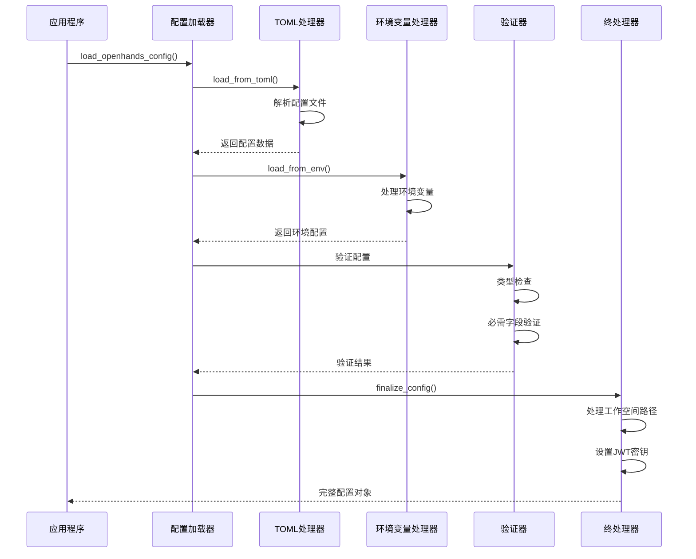
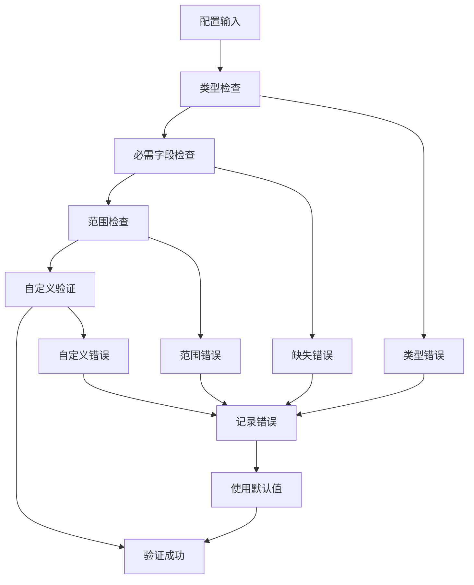

# 系统配置

<cite>
**本文档中引用的文件**
- [config.template.toml](file://config.template.toml)
- [openhands/core/config/openhands_config.py](file://openhands/core/config/openhands_config.py)
- [openhands/core/config/utils.py](file://openhands/core/config/utils.py)
- [openhands/core/config/config_utils.py](file://openhands/core/config/config_utils.py)
- [openhands/core/config/server_config.py](file://openhands/core/config/server_config.py)
- [openhands/app_server/config.py](file://openhands/app_server/config.py)
- [openhands/core/config/arg_utils.py](file://openhands/core/config/arg_utils.py)
- [openhands/core/config/llm_config.py](file://openhands/core/config/llm_config.py)
- [openhands/core/config/mcp_config.py](file://openhands/core/config/mcp_config.py)
- [openhands/core/config/README.md](file://openhands/core/config/README.md)
</cite>

## 目录
1. [简介](#简介)
2. [配置系统架构](#配置系统架构)
3. [配置文件结构](#配置文件结构)
4. [配置优先级](#配置优先级)
5. [核心配置选项](#核心配置选项)
6. [配置加载机制](#配置加载机制)
7. [配置模板详解](#配置模板详解)
8. [环境变量配置](#环境变量配置)
9. [配置验证与错误处理](#配置验证与错误处理)
10. [最佳实践](#最佳实践)
11. [故障排除指南](#故障排除指南)
12. [总结](#总结)

## 简介

OpenHands 提供了一个灵活且强大的配置管理系统，支持通过多种方式定义和管理应用程序的全局设置。该系统采用分层配置架构，允许用户通过配置文件、环境变量和命令行参数进行配置，并提供了完善的类型安全和验证机制。

配置系统的核心特点包括：
- 支持多种配置源（TOML文件、环境变量、命令行参数）
- 类型安全的配置验证
- 层次化的配置结构
- 向后兼容性保证
- 灵活的配置覆盖机制

## 配置系统架构

OpenHands 的配置系统采用模块化设计，主要由以下组件构成：



**图表来源**
- [openhands/core/config/openhands_config.py](file://openhands/core/config/openhands_config.py#L23-L184)
- [openhands/core/config/utils.py](file://openhands/core/config/utils.py#L39-L136)

**章节来源**
- [openhands/core/config/openhands_config.py](file://openhands/core/config/openhands_config.py#L1-L184)
- [openhands/core/config/README.md](file://openhands/core/config/README.md#L1-L87)

## 配置文件结构

OpenHands 使用 TOML 格式作为主要的配置文件格式，配置文件采用层次化的结构组织：

```mermaid
graph TD
CONFIG[config.toml] --> CORE[core - 核心配置]
CONFIG --> LLM[llm - LLM配置]
CONFIG --> AGENT[agent - 代理配置]
CONFIG --> SANDBOX[sandbox - 沙箱配置]
CONFIG --> SECURITY[security - 安全配置]
CONFIG --> MCP[mcp - MCP配置]
CONFIG --> KUBERNETES[kubernetes - Kubernetes配置]
CONFIG --> CONDENSER[condenser - 压缩器配置]
CONFIG --> MODEL_ROUTING[model_routing - 模型路由配置]
CONFIG --> EXTENDED[extended - 扩展配置]
CORE --> WORKSPACE[workspace_base]
CORE --> CACHE[cache_dir]
CORE --> DEBUG[debug]
CORE --> MAX_ITER[max_iterations]
LLM --> MODEL[model]
LLM --> API_KEY[api_key]
LLM --> BASE_URL[base_url]
LLM --> RETRY[num_retries]
AGENT --> ENABLE_BROWSING[enable_browsing]
AGENT --> ENABLE_EDITOR[enable_editor]
AGENT --> MEMORY[enable_prompt_extensions]
SANDBOX --> TIMEOUT[timeout]
SANDBOX --> IMAGE[base_container_image]
SANDBOX --> VOLUMES[volumes]
```



**图表来源**
- [config.template.toml](file://config.template.toml#L1-L543)

### 配置文件层次结构

| 配置节 | 描述 | 主要选项 |
|--------|------|----------|
| `[core]` | 应用程序核心设置 | workspace_base, cache_dir, debug, max_iterations |
| `[llm]` | 大语言模型配置 | model, api_key, base_url, num_retries |
| `[agent]` | 代理配置 | enable_browsing, enable_editor, memory_enabled |
| `[sandbox]` | 运行时沙箱配置 | timeout, base_container_image, volumes |
| `[security]` | 安全设置 | confirmation_mode, security_analyzer |
| `[mcp]` | 模型上下文协议配置 | sse_servers, stdio_servers, shttp_servers |
| `[kubernetes]` | Kubernetes部署配置 | namespace, resource_cpu_request |
| `[condenser]` | 对话历史压缩配置 | type, max_size, llm_config |
| `[model_routing]` | 模型路由配置 | router_name, llms_for_routing |

**章节来源**
- [config.template.toml](file://config.template.toml#L1-L543)

## 配置优先级

OpenHands 配置系统遵循明确的优先级规则，确保配置的灵活性和可预测性：



**图表来源**
- [openhands/core/config/utils.py](file://openhands/core/config/utils.py#L820-L883)

### 优先级规则

1. **命令行参数**（最高优先级）：通过 `-l`、`--llm-config` 等参数指定
2. **配置文件**：`config.toml` 文件中的设置
3. **环境变量**：操作系统环境变量
4. **默认值**：代码中定义的默认配置（最低优先级）

### 配置覆盖示例

```bash
# 命令行参数覆盖
openhands --llm-config gpt4

# 环境变量覆盖
export LLM_MODEL=gpt-4o
export SANDBOX_TIMEOUT=300

# 配置文件覆盖
[llm]
model = "gpt-4o-mini"
```

**章节来源**
- [openhands/core/config/utils.py](file://openhands/core/config/utils.py#L820-L883)
- [openhands/core/config/arg_utils.py](file://openhands/core/config/arg_utils.py#L1-L225)

## 核心配置选项

### 服务器配置

| 配置项 | 默认值 | 描述 |
|--------|--------|------|
| `workspace_base` | `./workspace` | 工作空间基础路径 |
| `cache_dir` | `/tmp/cache` | 缓存目录路径 |
| `debug` | `false` | 调试模式开关 |
| `max_iterations` | `500` | 最大迭代次数 |
| `max_budget_per_task` | `0.0` | 每个任务的最大预算 |
| `disable_color` | `false` | 禁用终端颜色输出 |

### LLM 配置

| 配置项 | 默认值 | 描述 |
|--------|--------|------|
| `model` | `claude-sonnet-4-20250514` | 使用的模型名称 |
| `api_key` | `""` | API 密钥 |
| `base_url` | `None` | API 基础 URL |
| `num_retries` | `5` | 重试次数 |
| `retry_multiplier` | `8` | 指数退避乘数 |
| `timeout` | `None` | API 超时时间 |

### 沙箱配置

| 配置项 | 默认值 | 描述 |
|--------|--------|------|
| `timeout` | `120` | 沙箱超时时间（秒） |
| `base_container_image` | `nikolaik/python-nodejs:python3.12-nodejs22` | 基础容器镜像 |
| `user_id` | `1000` | 用户 ID |
| `use_host_network` | `false` | 使用主机网络 |
| `volumes` | `None` | 卷挂载配置 |

**章节来源**
- [openhands/core/config/openhands_config.py](file://openhands/core/config/openhands_config.py#L23-L184)
- [openhands/core/config/llm_config.py](file://openhands/core/config/llm_config.py#L12-L199)

## 配置加载机制

OpenHands 使用统一的配置加载流程，确保所有配置源都被正确处理：



**图表来源**
- [openhands/core/config/utils.py](file://openhands/core/config/utils.py#L820-L883)

### 配置加载函数

主要的配置加载函数包括：

1. **`load_openhands_config()`**：主配置加载入口
2. **`load_from_toml()`**：从 TOML 文件加载配置
3. **`load_from_env()`**：从环境变量加载配置
4. **`finalize_config()`**：最终配置处理和验证

### 配置初始化流程

```python
# 配置加载步骤
config = OpenHandsConfig()                    # 创建配置实例
load_from_toml(config, 'config.toml')        # 加载TOML文件
load_from_env(config, os.environ)            # 加载环境变量
finalize_config(config)                      # 最终处理
register_custom_agents(config)               # 注册自定义代理
```

**章节来源**
- [openhands/core/config/utils.py](file://openhands/core/config/utils.py#L820-L883)

## 配置模板详解

### 核心配置模板

配置模板提供了完整的配置选项参考，每个配置项都有详细的注释说明：

```toml
[core]
# 工作空间基础路径
workspace_base = "./workspace"

# 缓存目录路径
cache_dir = "/tmp/cache"

# 调试模式
debug = false

# 最大迭代次数
max_iterations = 500

# 最大任务预算
max_budget_per_task = 0.0
```

### LLM 配置模板

```toml
[llm]
# API密钥
api_key = ""

# 模型名称
model = "gpt-4o"

# 重试设置
num_retries = 8
retry_multiplier = 2.0
retry_min_wait = 15
retry_max_wait = 120

# 温度和采样参数
temperature = 0.0
top_p = 1.0

# 视觉能力控制
disable_vision = true
```

### MCP 配置模板

```toml
[mcp]
# SSE服务器配置
sse_servers = [
    # 基础SSE服务器
    "http://localhost:8080/mcp/sse",
    
    # 带认证的SSE服务器
    {url = "https://api.example.com/mcp/sse", api_key = "your-api-key"}
]

# SHTTP服务器配置
shttp_servers = [
    # 基础SHTTP服务器
    "https://api.example.com/mcp/shttp",
    
    # 带超时的SHTTP服务器
    {
        url = "https://api.example.com/mcp/shttp",
        api_key = "your-api-key",
        timeout = 180
    }
]

# Stdio服务器配置
stdio_servers = [
    # 文件系统服务器
    {name = "filesystem", command = "npx", args = ["@modelcontextprotocol/server-filesystem", "/"]}
]
```

**章节来源**
- [config.template.toml](file://config.template.toml#L1-L543)

## 环境变量配置

OpenHands 支持通过环境变量进行配置，遵循特定的命名约定：

### 环境变量命名规范

```
PREFIX_FIELDNAME
```

- **PREFIX**：配置类的全大写名称加下划线（如 `LLM_`, `AGENT_`）
- **FIELDNAME**：字段名的全大写形式
- **完整变量名**：PREFIX + FIELDNAME（如 `LLM_API_KEY`, `AGENT_MEMORY_ENABLED`）

### 常用环境变量

| 环境变量 | 对应配置项 | 示例值 |
|----------|------------|--------|
| `LLM_API_KEY` | `llm.api_key` | `"sk-..."` |
| `LLM_MODEL` | `llm.model` | `"gpt-4o"` |
| `SANDBOX_TIMEOUT` | `sandbox.timeout` | `"300"` |
| `WORKSPACE_BASE` | `workspace_base` | `"/workspace"` |
| `DEBUG` | `debug` | `"true"` |
| `MAX_ITERATIONS` | `max_iterations` | `"1000"` |

### 环境变量类型转换

配置系统自动处理环境变量到相应类型的转换：

```python
# 字符串到布尔值
"true" → True, "false" → False, "1" → True

# 字符串到数值
"300" → 300 (int), "3.14" → 3.14 (float)

# 字符串到列表/字典
"{key=value}" → {"key": "value"}
```

**章节来源**
- [openhands/core/config/README.md](file://openhands/core/config/README.md#L23-L46)
- [openhands/core/config/utils.py](file://openhands/core/config/utils.py#L71-L192)

## 配置验证与错误处理

### 验证机制

OpenHands 使用 Pydantic 进行配置验证，提供强类型检查和数据验证：



**图表来源**
- [openhands/core/config/llm_config.py](file://openhands/core/config/llm_config.py#L140-L166)

### 错误处理策略

1. **验证失败**：记录警告并使用默认值
2. **文件不存在**：静默忽略并使用默认配置
3. **类型转换错误**：记录错误并使用默认值
4. **未知配置项**：记录警告但继续处理

### 配置验证示例

```python
try:
    config = LLMConfig.model_validate(toml_data)
except ValidationError as e:
    logger.warning(f'配置验证失败: {e}')
    # 使用默认配置继续
    config = LLMConfig()
```

**章节来源**
- [openhands/core/config/llm_config.py](file://openhands/core/config/llm_config.py#L140-L166)
- [openhands/core/config/utils.py](file://openhands/core/config/utils.py#L147-L192)

## 最佳实践

### 配置组织建议

1. **使用配置文件**：将复杂配置保存在 `config.toml` 中
2. **环境变量用于敏感信息**：API密钥等敏感信息使用环境变量
3. **命令行参数用于临时调整**：开发和调试时使用命令行参数
4. **保持配置简洁**：只修改必要的配置项

### 安全配置建议

1. **避免在代码库中存储敏感配置**
2. **使用环境变量管理API密钥**
3. **定期轮换API密钥**
4. **限制配置文件权限**

### 性能优化配置

1. **合理设置超时时间**
2. **优化缓存配置**
3. **选择合适的模型**
4. **监控资源使用**

### 开发环境配置

```toml
# development.toml
[core]
debug = true
max_iterations = 100

[llm]
model = "gpt-4o-mini"
temperature = 0.1

[sandbox]
timeout = 60
```

### 生产环境配置

```toml
# production.toml
[core]
debug = false
max_budget_per_task = 10.0

[llm]
model = "gpt-4o"
num_retries = 3

[sandbox]
timeout = 300
```

## 故障排除指南

### 常见配置错误

#### 1. 配置文件格式错误

**问题**：TOML 文件语法错误
**解决方法**：
- 检查 TOML 语法
- 使用在线 TOML 验证器
- 查看错误日志中的具体位置

#### 2. 环境变量类型错误

**问题**：环境变量值类型不匹配
**解决方法**：
```bash
# 错误：字符串类型
export SANDBOX_TIMEOUT="abc"

# 正确：数值类型
export SANDBOX_TIMEOUT="300"
```

#### 3. 配置项不存在

**问题**：使用了不存在的配置项
**解决方法**：
- 检查配置模板
- 查看官方文档
- 使用正确的配置项名称

#### 4. 权限问题

**问题**：无法访问配置文件或目录
**解决方法**：
```bash
# 检查文件权限
ls -la config.toml

# 修改权限
chmod 644 config.toml
```

### 调试配置问题

#### 启用调试模式

```bash
# 环境变量
export DEBUG=true

# 或在配置文件中
[core]
debug = true
```

#### 检查配置加载

```python
from openhands.core.config import load_openhands_config

# 加载配置并打印
config = load_openhands_config()
print(f"LLM Model: {config.get_llm_config().model}")
print(f"Sandbox Timeout: {config.sandbox.timeout}")
```

#### 日志分析

查看应用程序日志以获取配置相关的信息和错误：

```bash
# 查看日志
tail -f openhands.log

# 关键日志模式
grep -i "config\|load\|error" openhands.log
```

### 配置验证工具

```python
# 配置验证脚本
from openhands.core.config import OpenHandsConfig, load_from_toml

def validate_config(config_file='config.toml'):
    config = OpenHandsConfig()
    try:
        load_from_toml(config, config_file)
        print("配置验证成功！")
        return True
    except Exception as e:
        print(f"配置验证失败: {e}")
        return False

if __name__ == "__main__":
    validate_config()
```

**章节来源**
- [openhands/core/config/utils.py](file://openhands/core/config/utils.py#L147-L192)
- [openhands/core/config/README.md](file://openhands/core/config/README.md#L48-L87)

## 总结

OpenHands 的配置系统提供了强大而灵活的配置管理能力，支持多种配置源和层次化的配置结构。通过合理的配置管理和最佳实践，可以确保应用程序的稳定运行和高效性能。

### 关键要点

1. **多源配置支持**：TOML文件、环境变量、命令行参数
2. **类型安全**：Pydantic 提供的强类型验证
3. **向后兼容**：保持配置接口的稳定性
4. **错误处理**：优雅的错误恢复和日志记录
5. **灵活性**：支持复杂的配置场景和定制需求

### 配置管理建议

- 始终备份重要的配置文件
- 在生产环境中使用环境变量管理敏感信息
- 定期审查和更新配置
- 利用配置模板快速设置新环境
- 建立配置变更的测试流程

通过掌握这些配置知识和最佳实践，开发者可以更好地利用 OpenHands 的功能，构建稳定可靠的自动化解决方案。