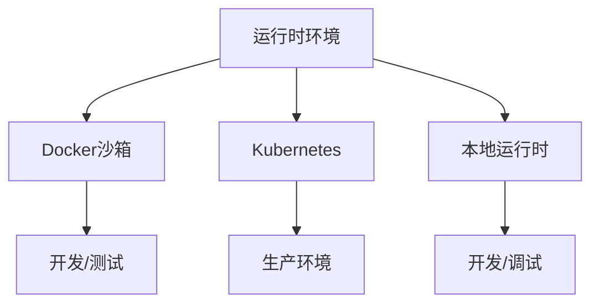
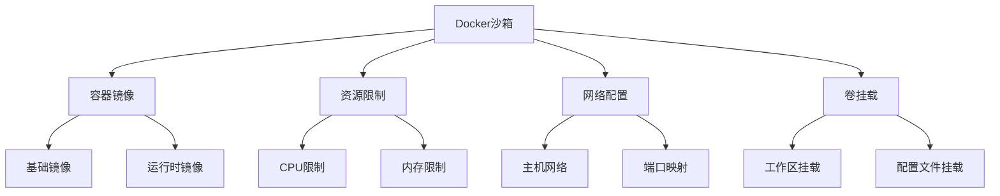
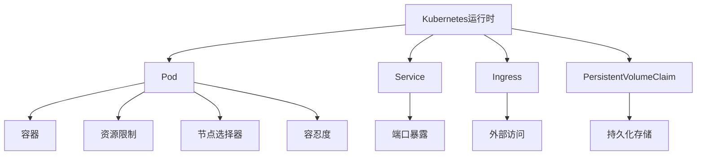
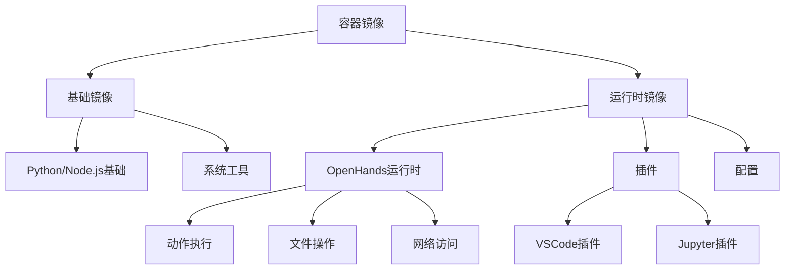
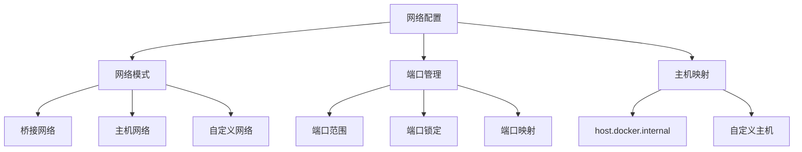
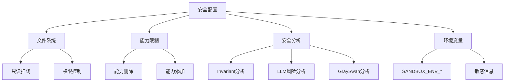
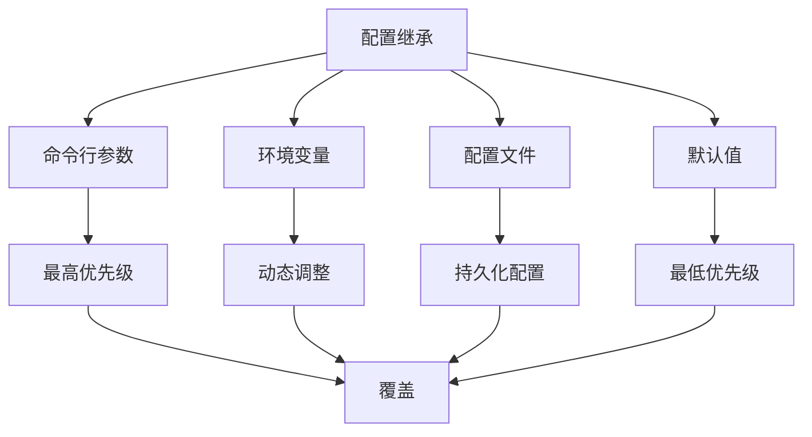

# 运行时配置

<cite>
**本文档引用的文件**   
- [Dockerfile](file://containers/app/Dockerfile)
- [compose.yml](file://containers/dev/compose.yml)
- [docker-compose.yml](file://docker-compose.yml)
- [config.sh](file://containers/runtime/config.sh)
- [README.md](file://containers/runtime/README.md)
- [docker_runtime.py](file://openhands/runtime/impl/docker/docker_runtime.py)
- [kubernetes_runtime.py](file://openhands/runtime/impl/kubernetes/kubernetes_runtime.py)
- [remote_runtime.py](file://openhands/runtime/impl/remote/remote_runtime.py)
- [base.py](file://openhands/runtime/base.py)
- [config.py](file://openhands/app_server/config.py)
- [sandbox_config.py](file://openhands/core/config/sandbox_config.py)
- [options.py](file://openhands/security/options.py)
- [port_lock.py](file://openhands/runtime/utils/port_lock.py)
- [cluster.yaml](file://kind/cluster.yaml)
</cite>

## 目录
1. [引言](#引言)
2. [运行时环境概述](#运行时环境概述)
3. [Docker沙箱配置](#docker沙箱配置)
4. [Kubernetes运行时配置](#kubernetes运行时配置)
5. [本地运行时配置](#本地运行时配置)
6. [容器镜像设置](#容器镜像设置)
7. [资源限制配置](#资源限制配置)
8. [网络配置](#网络配置)
9. [挂载卷配置](#挂载卷配置)
10. [安全配置](#安全配置)
11. [健康检查与超时设置](#健康检查与超时设置)
12. [配置继承与覆盖机制](#配置继承与覆盖机制)
13. [环境变量动态调整](#环境变量动态调整)
14. [最佳实践](#最佳实践)

## 引言

本文档详细说明OpenHands平台的运行时配置，涵盖Docker沙箱、Kubernetes和本地运行时的配置选项。文档将深入探讨容器镜像设置、资源限制（CPU、内存）、网络配置、挂载卷等参数，解释不同运行时环境的配置差异和适用场景。同时，文档将提供安全配置选项的说明，包括只读文件系统和能力限制，并包含运行时健康检查配置和超时设置的最佳实践。最后，文档将描述配置的继承和覆盖机制，以及如何通过环境变量动态调整运行时参数。

**Section sources**
- [docker-compose.yml](file://docker-compose.yml#L1-L24)
- [compose.yml](file://containers/dev/compose.yml#L1-L40)

## 运行时环境概述

OpenHands平台支持多种运行时环境，包括Docker沙箱、Kubernetes集群和本地运行时。每种环境都有其特定的配置需求和适用场景。

Docker沙箱提供了一个隔离的容器化环境，适用于开发和测试场景。Kubernetes运行时则适用于生产环境，提供了高可用性和可扩展性。本地运行时主要用于开发和调试，直接在宿主机上运行。

这些运行时环境通过统一的配置接口进行管理，允许用户根据具体需求选择最适合的运行时类型。配置系统支持通过环境变量、配置文件和命令行参数等多种方式进行设置，提供了灵活的配置管理能力。

**Diagram sources**
- [docker-compose.yml](file://docker-compose.yml#L1-L24)
- [compose.yml](file://containers/dev/compose.yml#L1-L40)

**Section sources**
- [docker-compose.yml](file://docker-compose.yml#L1-L24)
- [compose.yml](file://containers/dev/compose.yml#L1-L40)

## Docker沙箱配置

Docker沙箱是OpenHands平台的主要运行时环境之一，通过Docker容器提供隔离的执行环境。Docker沙箱的配置主要通过`docker-compose.yml`文件和环境变量进行管理。

在`docker-compose.yml`文件中，定义了OpenHands应用容器的基本配置，包括构建上下文、Dockerfile路径、环境变量、端口映射和卷挂载。关键配置包括：

- **环境变量**：`SANDBOX_RUNTIME_CONTAINER_IMAGE`指定沙箱容器镜像，`WORKSPACE_MOUNT_PATH`定义工作区挂载路径
- **端口映射**：将容器的3000端口映射到宿主机的3000端口
- **卷挂载**：挂载Docker套接字、用户配置文件和工作区目录

Docker沙箱还支持通过`SANDBOX_VOLUMES`环境变量配置额外的卷挂载，允许用户自定义文件系统的挂载点和权限。

**Diagram sources**
- [docker-compose.yml](file://docker-compose.yml#L1-L24)
- [Dockerfile](file://containers/app/Dockerfile#L1-L96)

**Section sources**
- [docker-compose.yml](file://docker-compose.yml#L1-L24)
- [Dockerfile](file://containers/app/Dockerfile#L1-L96)

## Kubernetes运行时配置

Kubernetes运行时为OpenHands提供了生产级别的部署能力，通过Kubernetes集群管理容器化应用。Kubernetes配置主要通过`kind/cluster.yaml`文件定义集群的基本结构。

在Kubernetes环境中，OpenHands运行时以Pod的形式部署，通过Service暴露服务，使用Ingress进行外部访问。Kubernetes配置支持节点选择器、容忍度和资源限制等高级特性，可以精确控制Pod的调度和资源分配。

Kubernetes运行时的配置通过`kubernetes`配置部分进行管理，包括命名空间、节点选择器、容忍度和资源限制等参数。这些配置允许用户根据集群的实际情况优化Pod的部署策略。

**Diagram sources**
- [cluster.yaml](file://kind/cluster.yaml#L1-L10)
- [kubernetes_runtime.py](file://openhands/runtime/impl/kubernetes/kubernetes_runtime.py#L1-L200)

**Section sources**
- [cluster.yaml](file://kind/cluster.yaml#L1-L10)
- [kubernetes_runtime.py](file://openhands/runtime/impl/kubernetes/kubernetes_runtime.py#L1-L200)

## 本地运行时配置

本地运行时主要用于开发和调试场景，直接在宿主机上运行OpenHands应用。本地运行时的配置通过`containers/dev/compose.yml`文件进行管理。

在开发模式下，容器以特权模式运行，允许访问宿主机的Docker守护进程。配置文件定义了开发容器的构建上下文、Dockerfile路径、环境变量、端口映射和卷挂载。关键配置包括：

- **特权模式**：`privileged: true`允许容器访问宿主机的设备
- **环境变量**：`SANDBOX_API_HOSTNAME`和`DOCKER_HOST_ADDR`配置API主机名和Docker主机地址
- **卷挂载**：挂载源代码、用户凭证和缓存目录

本地运行时还支持通过环境变量动态调整配置，如`SANDBOX_RUNTIME_CONTAINER_IMAGE`用于指定沙箱容器镜像，`SANDBOX_USER_ID`用于指定沙箱用户ID。

**Section sources**
- [compose.yml](file://containers/dev/compose.yml#L1-L40)

## 容器镜像设置

OpenHands平台的容器镜像设置通过多层次的配置机制实现，支持基础镜像和运行时镜像的分离。容器镜像配置主要通过`SandboxConfig`类进行管理。

基础容器镜像通过`base_container_image`参数指定，默认值为`nikolaik/python-nodejs:python3.12-nodejs22`。运行时容器镜像通过`runtime_container_image`参数指定，可以从环境变量`SANDBOX_RUNTIME_CONTAINER_IMAGE`获取。

当运行时容器镜像未指定时，系统会根据基础容器镜像动态构建运行时镜像。构建过程包括安装OpenHands运行时依赖、配置环境变量和设置启动脚本。用户还可以通过`runtime_extra_deps`参数指定额外的依赖包。

容器镜像的标签和版本管理通过`DOCKER_IMAGE_TAG`和`DOCKER_IMAGE_SOURCE_TAG`变量进行控制，这些变量在构建过程中由脚本自动填充。

**Diagram sources**
- [config.sh](file://containers/runtime/config.sh#L1-L8)
- [README.md](file://containers/runtime/README.md#L1-L13)

**Section sources**
- [config.sh](file://containers/runtime/config.sh#L1-L8)
- [README.md](file://containers/runtime/README.md#L1-L13)

## 资源限制配置

OpenHands运行时支持详细的资源限制配置，包括CPU、内存和其他系统资源。资源限制通过`SandboxConfig`类的相应字段进行管理。

CPU限制通过`cpu_period`和`cpu_quota`参数配置，允许设置CPU使用的时间片和配额。内存限制通过`mem_limit`、`memswap_limit`和`mem_swappiness`参数配置，可以控制容器的内存使用上限、交换内存和内存交换倾向。

系统还支持通过`resource_factor`参数动态调整资源分配，根据工作负载的需求自动调整资源限制。对于GPU资源，通过`cuda_visible_devices`参数指定可见的CUDA设备。

资源限制的配置可以通过环境变量进行覆盖，如`SANDBOX_CPU_PERIOD`、`SANDBOX_CPU_QUOTA`和`SANDBOX_MEM_LIMIT`等，提供了灵活的资源管理能力。

**Section sources**
- [docker_runtime.py](file://openhands/runtime/impl/docker/docker_runtime.py#L1-L200)
- [kubernetes_runtime.py](file://openhands/runtime/impl/kubernetes/kubernetes_runtime.py#L1-L200)

## 网络配置

OpenHands运行时的网络配置支持多种模式，包括桥接网络、主机网络和自定义网络。网络配置通过`SandboxConfig`类的网络相关字段进行管理。

在Docker环境中，通过`USE_HOST_NETWORK`参数控制是否使用主机网络模式。当启用主机网络时，容器直接使用宿主机的网络栈，避免了端口映射的复杂性。在Kubernetes环境中，通过Service和Ingress配置网络暴露策略。

端口管理通过预定义的端口范围实现，包括执行服务器端口范围(30000-39999)、VSCode端口范围(40000-49999)和应用端口范围(50000-59999)。系统使用`PortLock`机制防止端口冲突，确保端口分配的原子性。

网络配置还支持通过`extra_hosts`参数添加自定义主机映射，如`host.docker.internal:host-gateway`，用于容器访问宿主机服务。

**Diagram sources**
- [port_lock.py](file://openhands/runtime/utils/port_lock.py#L1-L269)
- [docker-compose.yml](file://docker-compose.yml#L1-L24)

**Section sources**
- [port_lock.py](file://openhands/runtime/utils/port_lock.py#L1-L269)
- [docker-compose.yml](file://docker-compose.yml#L1-L24)

## 挂载卷配置

挂载卷配置是OpenHands运行时的重要组成部分，用于在容器和宿主机之间共享文件和目录。挂载卷配置通过`SandboxConfig`类的`volumes`字段进行管理。

系统支持通过`SANDBOX_VOLUMES`环境变量配置多个卷挂载，格式为`host_path:container_path:mode`。常见的挂载包括：

- **工作区挂载**：将宿主机的工作区目录挂载到容器的`/workspace`目录
- **配置文件挂载**：将用户配置文件挂载到容器的相应位置
- **缓存目录挂载**：将缓存目录挂载到容器，提高性能

对于Docker环境，还需要挂载`/var/run/docker.sock`以允许容器访问Docker守护进程。在开发模式下，还会挂载源代码目录和用户凭证文件。

挂载卷的权限通过模式参数控制，支持`rw`(读写)和`ro`(只读)模式。系统会自动处理路径的解析和权限设置，确保挂载的正确性。

**Section sources**
- [compose.yml](file://containers/dev/compose.yml#L1-L40)
- [docker-compose.yml](file://docker-compose.yml#L1-L24)

## 安全配置

OpenHands平台提供了多层次的安全配置选项，包括只读文件系统、能力限制和安全分析器。安全配置通过`SecurityConfig`类进行管理。

只读文件系统通过`readonly`挂载选项实现，可以防止容器对特定目录的写入操作。能力限制通过Docker的`--cap-drop`和`--cap-add`参数实现，可以精确控制容器的系统权限。

平台集成了多种安全分析器，包括InvariantAnalyzer、LLMRiskAnalyzer和GraySwanAnalyzer，用于检测和防止安全风险。这些分析器可以在运行时动态启用，通过`security_analyzer`参数指定。

环境变量`SANDBOX_ENV_*`用于传递沙箱环境变量，前缀`SANDBOX_ENV_`会被自动移除。这种机制允许安全地传递敏感信息，同时避免命名冲突。

**Diagram sources**
- [options.py](file://openhands/security/options.py#L1-L11)
- [base.py](file://openhands/runtime/base.py#L1-L800)

**Section sources**
- [options.py](file://openhands/security/options.py#L1-L11)
- [base.py](file://openhands/runtime/base.py#L1-L800)

## 健康检查与超时设置

OpenHands运行时提供了完善的健康检查和超时设置机制，确保系统的稳定性和可靠性。健康检查通过`wait_until_alive`方法实现，定期检查运行时的可用性。

超时设置通过`timeout`参数配置，控制各种操作的最大执行时间。系统支持硬超时和软超时两种模式，硬超时会强制终止操作，软超时则允许操作继续但标记为超时。

对于网络请求，使用`httpx`库的超时机制，包括连接超时、读取超时和写入超时。对于长时间运行的操作，使用`tenacity`库实现重试机制，配合`stop_if_should_exit`函数实现优雅退出。

健康检查的状态通过`RuntimeStatus`枚举表示，包括`STARTING_RUNTIME`、`RUNNING`、`ERROR`等状态。状态变化会通过`status_callback`函数通知上层应用。

**Section sources**
- [docker_runtime.py](file://openhands/runtime/impl/docker/docker_runtime.py#L1-L200)
- [remote_runtime.py](file://openhands/runtime/impl/remote/remote_runtime.py#L1-L248)

## 配置继承与覆盖机制

OpenHands平台采用多层次的配置继承与覆盖机制，允许用户在不同级别上定制配置。配置系统遵循"就近原则"，即更具体的配置会覆盖更通用的配置。

配置继承的优先级从高到低为：
1. 命令行参数
2. 环境变量
3. 配置文件
4. 默认值

这种机制允许用户通过环境变量动态调整配置，而无需修改配置文件。例如，`SANDBOX_RUNTIME_CONTAINER_IMAGE`环境变量可以覆盖配置文件中指定的容器镜像。

配置系统使用Pydantic模型进行验证，确保配置的类型和格式正确。`model_validator`装饰器用于在配置加载后进行后处理，如设置默认值和转换数据格式。

**Diagram sources**
- [config.py](file://openhands/app_server/config.py#L1-L359)
- [sandbox_config.py](file://openhands/core/config/sandbox_config.py#L96-L123)

**Section sources**
- [config.py](file://openhands/app_server/config.py#L1-L359)
- [sandbox_config.py](file://openhands/core/config/sandbox_config.py#L96-L123)

## 环境变量动态调整

OpenHands平台支持通过环境变量动态调整运行时参数，提供了极大的灵活性和可配置性。环境变量的处理通过`load_from_env`函数实现，支持多种数据类型和复杂结构。

环境变量的命名遵循`SANDBOX_`前缀约定，如`SANDBOX_TIMEOUT`、`SANDBOX_CPU_PERIOD`等。对于列表类型的配置，支持JSON格式的字符串表示，如`SANDBOX_RUNTIME_EXTRA_BUILD_ARGS`。

系统还支持通过`SANDBOX_ENV_*`前缀传递沙箱环境变量，这些变量会被自动注入到运行时环境中。这种机制允许安全地传递API密钥、令牌等敏感信息。

环境变量的优先级高于配置文件，允许在部署时动态调整配置而无需修改代码或配置文件。这对于多环境部署（开发、测试、生产）特别有用。

**Section sources**
- [config.py](file://openhands/app_server/config.py#L1-L359)
- [sandbox_config.py](file://openhands/core/config/sandbox_config.py#L96-L123)

## 最佳实践

基于OpenHands平台的运行时配置，以下是一些最佳实践建议：

1. **生产环境使用Kubernetes**：对于生产部署，建议使用Kubernetes运行时，以获得更好的可扩展性和高可用性。

2. **合理设置资源限制**：根据工作负载的需求合理设置CPU和内存限制，避免资源浪费和性能瓶颈。

3. **使用只读挂载保护关键文件**：对于不需要写入的目录，使用只读挂载模式，提高安全性。

4. **定期更新容器镜像**：定期更新基础镜像和运行时镜像，确保系统安全性和稳定性。

5. **监控运行时状态**：使用健康检查和状态回调功能，实时监控运行时的状态，及时发现和处理问题。

6. **合理使用环境变量**：利用环境变量的动态调整能力，实现配置的灵活管理，特别是在多环境部署场景中。

7. **备份重要数据**：对于重要的工作区数据，定期备份到持久化存储，防止数据丢失。

8. **启用安全分析器**：根据安全需求启用相应的安全分析器，及时发现和防范安全风险。

**Section sources**
- [docker-compose.yml](file://docker-compose.yml#L1-L24)
- [compose.yml](file://containers/dev/compose.yml#L1-L40)
- [config.py](file://openhands/app_server/config.py#L1-L359)