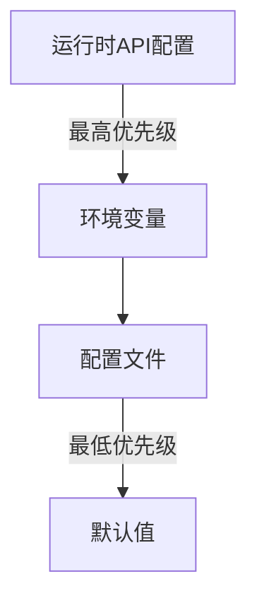
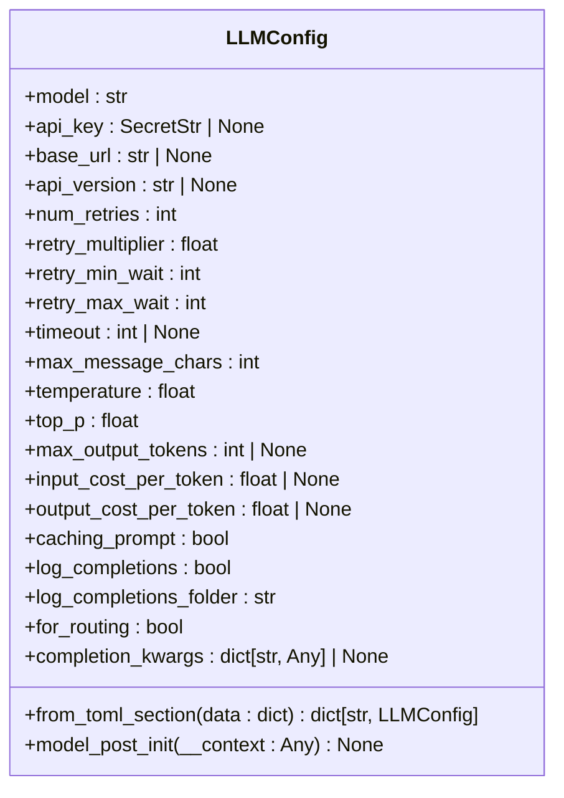
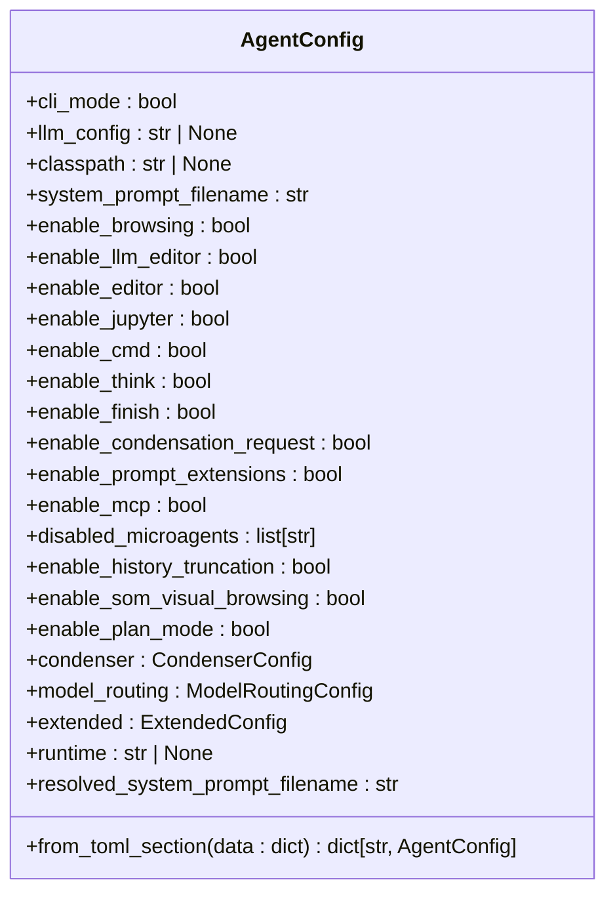
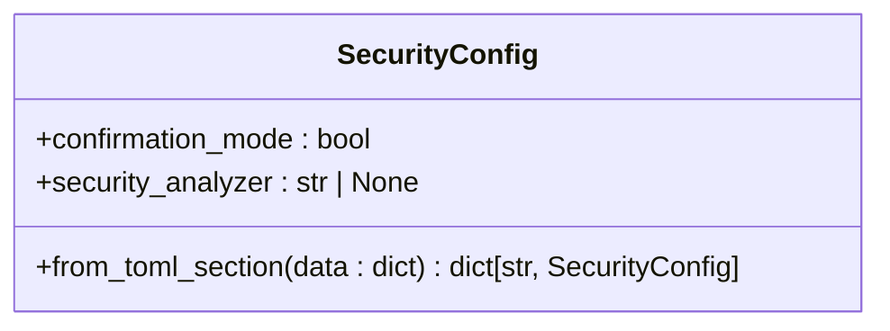
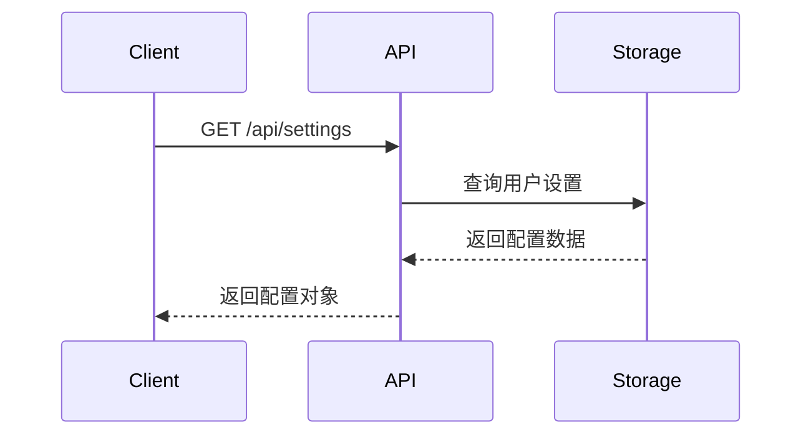
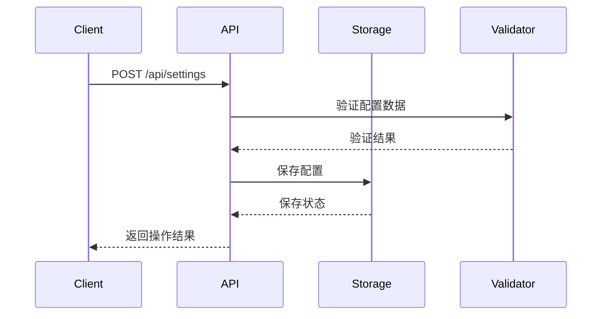
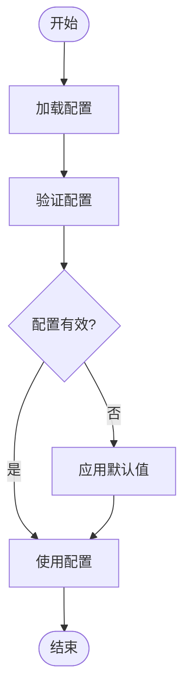
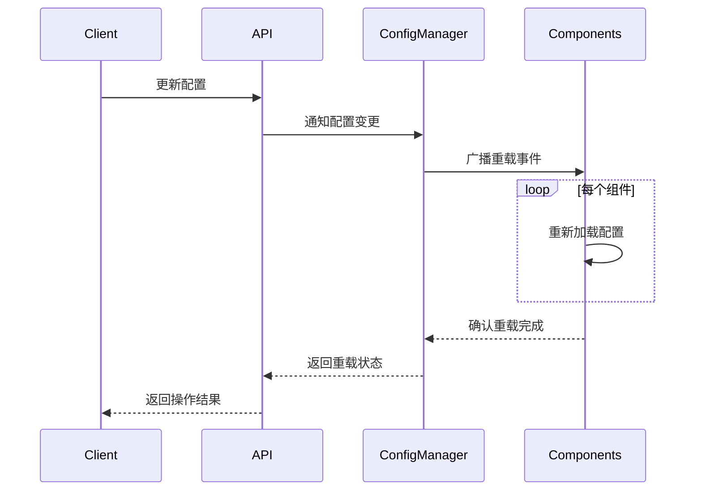
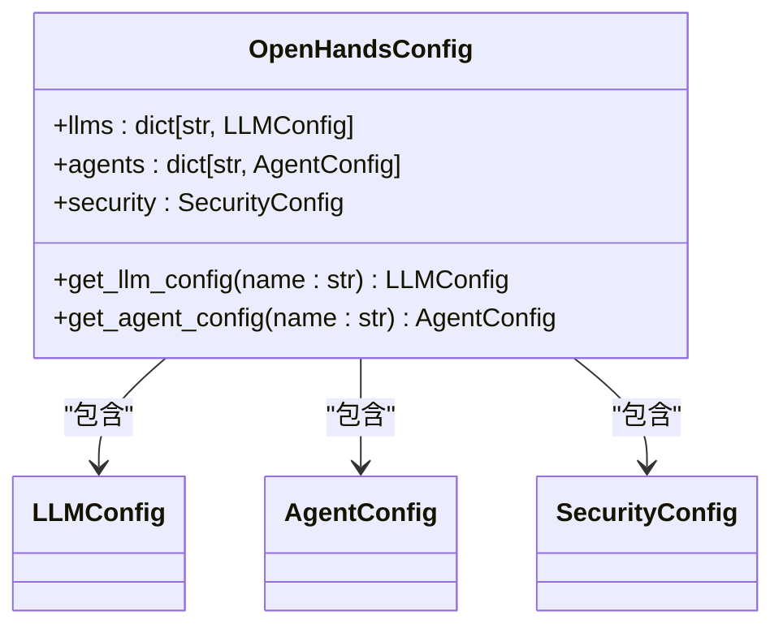

# 设置与配置

<cite>
**本文档中引用的文件**  
- [openhands_config.py](file://openhands/core/config/openhands_config.py)
- [server_config.py](file://openhands/server/config/server_config.py)
- [llm_config.py](file://openhands/core/config/llm_config.py)
- [agent_config.py](file://openhands/core/config/agent_config.py)
- [security_config.py](file://openhands/core/config/security_config.py)
- [settings.types.ts](file://frontend/src/settings-service/settings.types.ts)
- [settings-service.api.ts](file://frontend/src/settings-service/settings-service.api.ts)
- [user.py](file://enterprise/server/routes/user.py)
- [user_settings.py](file://enterprise/storage/user_settings.py)
</cite>

## 目录
1. [简介](#简介)
2. [配置层次结构与优先级](#配置层次结构与优先级)
3. [核心配置组件](#核心配置组件)
4. [API端点与使用方法](#api端点与使用方法)
5. [配置验证与默认值管理](#配置验证与默认值管理)
6. [动态重载机制](#动态重载机制)
7. [常见配置场景示例](#常见配置场景示例)
8. [安全策略配置](#安全策略配置)

## 简介

OpenHands系统提供了一套全面的设置与配置API，用于管理用户偏好、系统配置和环境变量。该系统支持通过API读取和更新各种配置选项，包括LLM设置、运行时配置和安全策略。配置系统采用分层架构，支持多种配置源的优先级管理，确保配置的灵活性和可扩展性。

## 配置层次结构与优先级

OpenHands的配置系统采用多层优先级结构，从高到低依次为：

1. **运行时API配置**：通过API动态设置的配置，具有最高优先级
2. **环境变量**：系统环境变量中的配置
3. **配置文件**：通过TOML配置文件定义的设置
4. **默认值**：代码中定义的默认配置值

这种层次结构允许用户在不同级别上管理配置，从全局默认值到特定会话的临时覆盖。配置优先级的设计确保了灵活性，同时保持了系统的可预测性。



**Diagram sources**
- [openhands_config.py](file://openhands/core/config/openhands_config.py)
- [server_config.py](file://openhands/server/config/server_config.py)

## 核心配置组件

### LLM配置

LLM配置管理大语言模型的各种参数，包括模型选择、API密钥、重试策略和性能调优选项。`LLMConfig`类定义了完整的配置结构，支持通过TOML文件的`[llm]`部分进行配置。



**Diagram sources**
- [llm_config.py](file://openhands/core/config/llm_config.py)

### 代理配置

代理配置管理代理行为的各种选项，包括启用的工具、系统提示和高级功能。`AgentConfig`类提供了灵活的配置机制，支持为不同代理类型定义特定配置。



**Diagram sources**
- [agent_config.py](file://openhands/core/config/agent_config.py)

### 安全配置

安全配置管理系统的安全相关功能，包括确认模式和安全分析器设置。`SecurityConfig`类提供了基本的安全配置选项。



**Diagram sources**
- [security_config.py](file://openhands/core/config/security_config.py)

## API端点与使用方法

### 获取配置

获取当前用户的配置信息：



**Diagram sources**
- [settings-service.api.ts](file://frontend/src/settings-service/settings-service.api.ts)
- [user.py](file://enterprise/server/routes/user.py)

### 更新配置

更新用户配置：



**Diagram sources**
- [settings-service.api.ts](file://frontend/src/settings-service/settings-service.api.ts)
- [user.py](file://enterprise/server/routes/user.py)

## 配置验证与默认值管理

系统在配置加载时执行严格的验证，确保所有配置值的有效性。`model_config = ConfigDict(extra='forbid')`设置防止未定义字段的意外添加，确保配置的完整性。

默认值管理通过`Field(default=...)`实现，为每个配置项提供合理的默认值。当配置项未明确设置时，系统自动使用默认值，确保系统始终处于可操作状态。



**Diagram sources**
- [openhands_config.py](file://openhands/core/config/openhands_config.py)
- [llm_config.py](file://openhands/core/config/llm_config.py)

## 动态重载机制

配置系统支持动态重载，允许在运行时修改配置而无需重启服务。当配置更新时，系统会自动通知相关组件重新加载配置，确保配置变更立即生效。



**Diagram sources**
- [user.py](file://enterprise/server/routes/user.py)
- [user_settings.py](file://enterprise/storage/user_settings.py)

## 常见配置场景示例

### LLM设置配置

配置不同的LLM模型和参数：

```toml
[llm]
model = "gpt-4-turbo"
api_key = "your-api-key"
temperature = 0.7
max_output_tokens = 4096

[llm.claude]
model = "claude-3-opus-20240229"
base_url = "https://api.anthropic.com"
```

### 运行时配置

配置运行时环境和资源限制：

```toml
runtime = "docker"
max_iterations = 100
max_budget_per_task = 10.0
workspace_mount_path_in_sandbox = "/workspace"
```

### 安全策略配置

配置安全相关的选项：

```toml
[security]
confirmation_mode = true
security_analyzer = "invariant"
```

## 安全策略配置

系统提供多层次的安全配置选项，包括确认模式和安全分析器。确认模式要求用户在执行关键操作前进行确认，防止意外操作。安全分析器可以集成第三方安全工具，提供额外的安全保障。



**Diagram sources**
- [openhands_config.py](file://openhands/core/config/openhands_config.py)
- [security_config.py](file://openhands/core/config/security_config.py)

**Section sources**
- [openhands_config.py](file://openhands/core/config/openhands_config.py)
- [security_config.py](file://openhands/core/config/security_config.py)