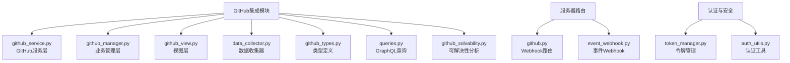
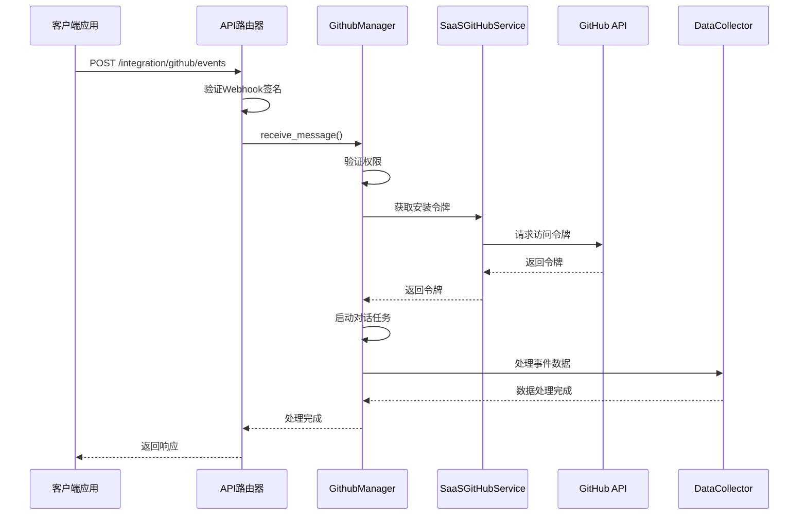
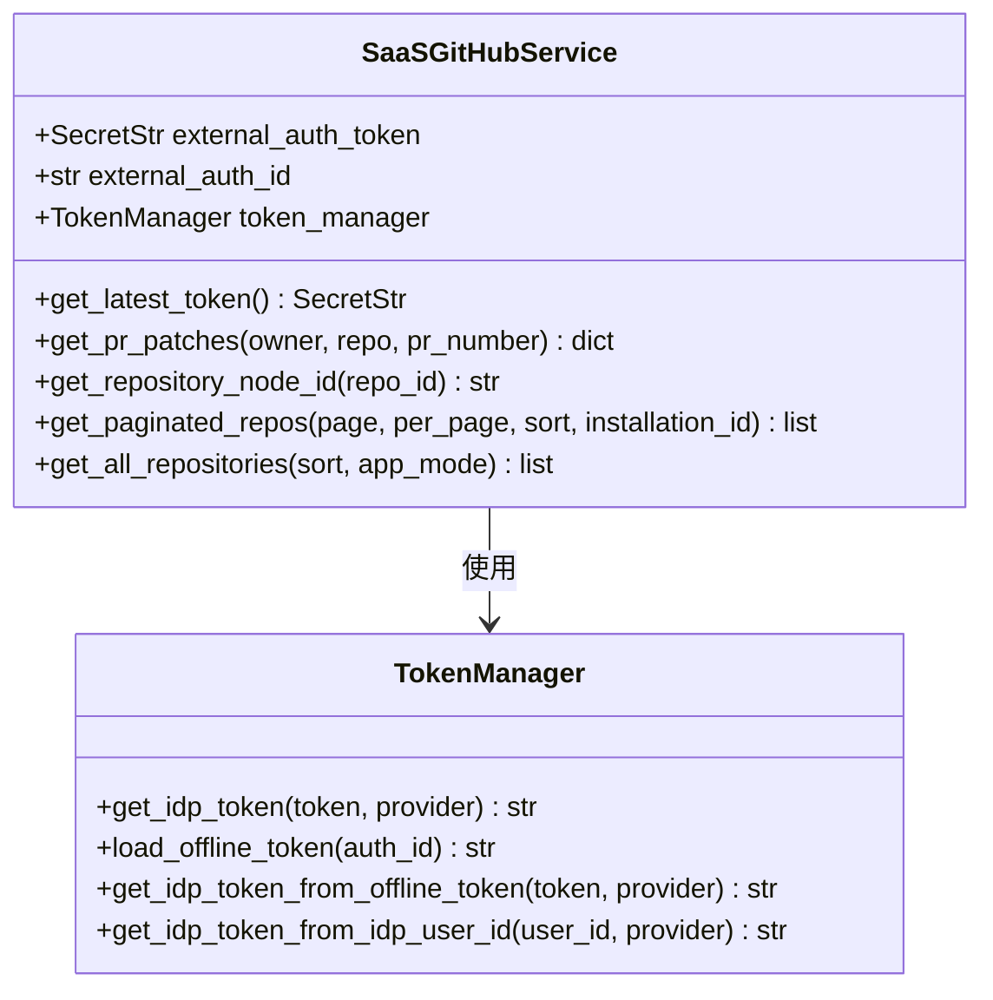
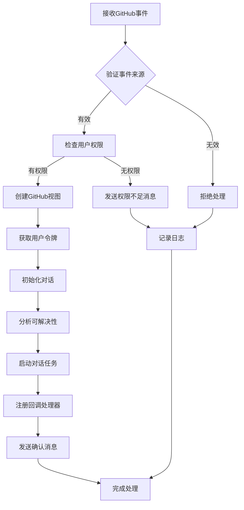
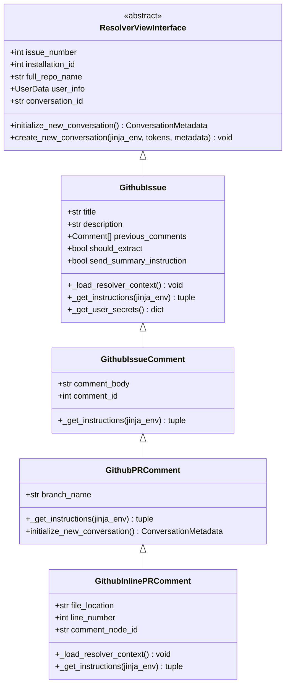
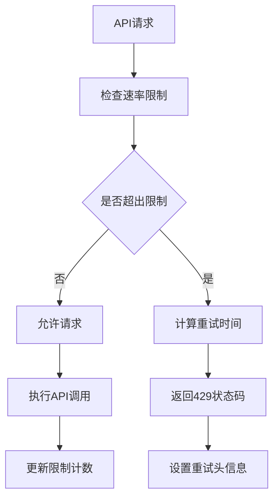

# GitHub集成API详细文档

<cite>
**本文档中引用的文件**
- [github_service.py](file://enterprise/integrations/github/github_service.py)
- [github_manager.py](file://enterprise/integrations/github/github_manager.py)
- [github_view.py](file://enterprise/integrations/github/github_view.py)
- [data_collector.py](file://enterprise/integrations/github/data_collector.py)
- [github_types.py](file://enterprise/integrations/github/github_types.py)
- [queries.py](file://enterprise/integrations/github/queries.py)
- [github_solvability.py](file://enterprise/integrations/github/github_solvability.py)
- [github.py](file://enterprise/server/routes/integration/github.py)
- [event_webhook.py](file://enterprise/server/routes/event_webhook.py)
- [rate_limit.py](file://enterprise/server/rate_limit.py)
</cite>

## 目录
1. [简介](#简介)
2. [项目结构](#项目结构)
3. [核心组件](#核心组件)
4. [架构概览](#架构概览)
5. [详细组件分析](#详细组件分析)
6. [认证流程](#认证流程)
7. [API端点](#api端点)
8. [Webhook事件处理](#webhook事件处理)
9. [双向同步机制](#双向同步机制)
10. [错误处理策略](#错误处理策略)
11. [速率限制管理](#速率限制管理)
12. [数据一致性保证](#数据一致性保证)
13. [故障排除指南](#故障排除指南)
14. [结论](#结论)

## 简介

OpenHands的GitHub集成API提供了全面的GitHub平台交互能力，支持OAuth认证、个人访问令牌认证、Webhook事件处理、双向数据同步等功能。该系统采用微服务架构，通过专门的服务层处理GitHub API调用，管理层协调业务逻辑，并提供RESTful API接口供外部系统集成。

## 项目结构

GitHub集成模块位于`enterprise/integrations/github/`目录下，包含以下核心文件：



**图表来源**
- [github_service.py](file://enterprise/integrations/github/github_service.py#L1-L144)
- [github_manager.py](file://enterprise/integrations/github/github_manager.py#L1-L345)
- [github_view.py](file://enterprise/integrations/github/github_view.py#L1-L757)

## 核心组件

### SaaSGitHubService
继承自基础GitHub服务类，提供SaaS环境下的GitHub API功能，包括令牌管理和分页数据获取。

### GithubManager
负责处理GitHub事件消息，执行权限验证，启动对话任务，并管理与GitHub的双向通信。

### GitHubDataCollector
收集和存储GitHub交互数据，包括问题、拉取请求、评论等元数据。

### GithubView
提供不同类型的GitHub视图抽象，如问题、评论、内联评论等，支持统一的处理接口。

**章节来源**
- [github_service.py](file://enterprise/integrations/github/github_service.py#L13-L144)
- [github_manager.py](file://enterprise/integrations/github/github_manager.py#L38-L345)
- [data_collector.py](file://enterprise/integrations/github/data_collector.py#L45-L693)
- [github_view.py](file://enterprise/integrations/github/github_view.py#L84-L757)

## 架构概览

GitHub集成系统采用分层架构设计，确保职责分离和可扩展性：



**图表来源**
- [github.py](file://enterprise/server/routes/integration/github.py#L45-L84)
- [github_manager.py](file://enterprise/integrations/github/github_manager.py#L157-L184)

## 详细组件分析

### SaaSGitHubService服务实现

SaaSGitHubService是GitHub集成的核心服务类，提供以下关键功能：

#### 令牌管理
- 支持多种令牌获取方式：外部认证令牌、外部用户ID、用户ID
- 自动刷新过期令牌
- 统一的令牌获取接口

#### 分页数据获取
- 支持拉取请求文件列表的分页查询
- 自动处理GitHub API的分页头部信息
- 提供完整的分页元数据

#### 仓库节点ID转换
- 将旧格式的仓库ID转换为新的GraphQL节点ID
- 支持向后兼容的降级处理



**图表来源**
- [github_service.py](file://enterprise/integrations/github/github_service.py#L13-L144)

**章节来源**
- [github_service.py](file://enterprise/integrations/github/github_service.py#L13-L144)

### GithubManager业务逻辑处理

GithubManager负责协调GitHub事件处理的完整流程：

#### 权限验证
- 检查用户对仓库的写入权限
- 验证安装令牌的有效性
- 支持组织级别的权限检查

#### 事件处理流程
1. 接收GitHub事件消息
2. 验证事件来源和权限
3. 创建适当的GitHub视图对象
4. 启动对话任务
5. 发送确认回复

#### 对话任务管理
- 初始化新对话会话
- 设置对话元数据
- 集成LLM可解决性分析
- 注册回调处理器



**图表来源**
- [github_manager.py](file://enterprise/integrations/github/github_manager.py#L121-L184)

**章节来源**
- [github_manager.py](file://enterprise/integrations/github/github_manager.py#L38-L345)

### GitHubDataCollector数据收集

数据收集器负责捕获和存储GitHub交互的详细信息：

#### 数据收集策略
- 跟踪标签触发的问题
- 记录评论触发的事件
- 收集拉取请求的完整历史
- 存储对话元数据和上下文

#### 数据持久化
- 使用文件存储保存原始数据
- 数据库存储结构化信息
- 支持增量更新和批量处理

#### 事件追踪
- 监控拉取请求的关闭和合并
- 记录OpenHands参与统计
- 跟踪对话生命周期

**章节来源**
- [data_collector.py](file://enterprise/integrations/github/data_collector.py#L45-L693)

### GithubView视图抽象

GithubView提供统一的GitHub资源视图接口：

#### 视图类型
- **GithubIssue**: 基础问题视图
- **GithubIssueComment**: 问题评论视图  
- **GithubPRComment**: 拉取请求评论视图
- **GithubInlinePRComment**: 内联拉取请求评论视图

#### 核心功能
- 加载解析器上下文
- 获取用户指令模板
- 初始化对话会话
- 创建新对话实例



**图表来源**
- [github_view.py](file://enterprise/integrations/github/github_view.py#L84-L757)

**章节来源**
- [github_view.py](file://enterprise/integrations/github/github_view.py#L84-L757)

## 认证流程

### OAuth认证

系统支持GitHub应用的OAuth认证流程：

#### 应用安装
1. 用户在GitHub上安装OpenHands应用
2. GitHub重定向到配置的安装页面
3. 系统接收安装事件并存储安装信息

#### 令牌获取
- 使用安装ID获取访问令牌
- 支持令牌自动刷新
- 多种令牌获取方式

### 个人访问令牌

支持用户使用个人访问令牌进行直接认证：

#### 令牌管理
- 安全存储用户令牌
- 支持令牌轮换
- 实时验证令牌有效性

**章节来源**
- [github_service.py](file://enterprise/integrations/github/github_service.py#L39-L73)

## API端点

### Webhook事件端点

主要的Webhook处理端点：

| 端点 | 方法 | 描述 | 认证 |
|------|------|------|------|
| `/integration/github/events` | POST | 处理GitHub事件Webhook | 签名验证 |

#### 端点特性
- 支持所有GitHub事件类型
- 自动验证Webhook签名
- 环境变量控制启用状态
- 异步事件处理

### GraphQL查询端点

系统使用GraphQL查询获取详细数据：

#### 查询类型
- 按节点ID查询拉取请求详情
- 支持分页查询提交历史
- 获取评论和审查数据
- 查询仓库元数据

**章节来源**
- [github.py](file://enterprise/server/routes/integration/github.py#L45-L84)
- [queries.py](file://enterprise/integrations/github/queries.py#L1-L103)

## Webhook事件处理

### 支持的事件类型

系统处理多种GitHub事件：

#### 问题相关事件
- `issues`: 问题创建、编辑、标签添加
- `issue_comment`: 问题评论创建

#### 拉取请求相关事件
- `pull_request`: 拉取请求创建、更新、合并
- `pull_request_review`: 审查提交
- `pull_request_review_comment`: 审查评论

#### 评论相关事件
- `issue_comment.created`: 问题评论创建
- `pull_request_comment.created`: 拉取请求评论创建
- `pull_request_review_comment.created`: 内联审查评论创建

### 事件处理流程

```mermaid
flowchart TD
A[接收Webhook事件] --> B{验证签名}
B --> |失败| C[返回403错误]
B --> |成功| D[解析事件负载]
D --> E{检查事件类型}
E --> |标签事件| F[检查是否包含@openhands]
E --> |评论事件| G[检查是否包含@openhands]
E --> |其他事件| H[忽略事件]
F --> |是| I[启动问题处理]
G --> |是| J[启动评论处理]
I --> K[验证权限]
J --> K
K --> |有权限| L[创建对话任务]
K --> |无权限| M[发送权限消息]
L --> N[处理完成]
M --> N
H --> N
C --> O[记录错误]
```

**图表来源**
- [github_manager.py](file://enterprise/integrations/github/github_manager.py#L121-L184)

**章节来源**
- [github_manager.py](file://enterprise/integrations/github/github_manager.py#L121-L184)
- [github_view.py](file://enterprise/integrations/github/github_view.py#L431-L757)

## 双向同步机制

### 数据流向

系统实现了完整的双向数据同步：

#### 从GitHub到系统
1. **事件监听**: 监听GitHub事件Webhook
2. **数据提取**: 解析事件负载获取相关信息
3. **权限验证**: 验证用户权限和仓库访问
4. **任务创建**: 启动相应的对话任务
5. **状态更新**: 更新内部状态和统计数据

#### 从系统到GitHub
1. **消息发送**: 将系统消息发送到GitHub
2. **评论创建**: 在问题或拉取请求中创建评论
3. **状态反馈**: 提供任务进度和结果反馈
4. **交互记录**: 记录所有交互历史

### 同步策略

#### 实时同步
- Webhook事件实时处理
- 即时消息响应
- 实时状态更新

#### 批量同步
- 定期数据备份
- 批量状态更新
- 历史数据归档

**章节来源**
- [github_manager.py](file://enterprise/integrations/github/github_manager.py#L157-L184)
- [data_collector.py](file://enterprise/integrations/github/data_collector.py#L677-L693)

## 错误处理策略

### 异常分类

系统定义了多种异常类型：

| 异常类型 | 描述 | 处理策略 |
|----------|------|----------|
| `AuthenticationError` | GitHub认证失败 | 重新获取令牌，记录详细日志 |
| `RateLimitError` | API速率限制 | 实施退避策略，等待重试 |
| `ResourceNotFoundError` | 资源未找到 | 验证资源存在性，提供友好提示 |
| `UnknownException` | 未知异常 | 记录堆栈跟踪，提供通用错误消息 |

### 错误恢复机制

#### 自动重试
- 指数退避算法
- 最大重试次数限制
- 条件性重试（仅对临时错误）

#### 降级处理
- 功能降级：禁用受影响的功能
- 服务降级：提供基本功能
- 数据降级：使用缓存数据

#### 监控告警
- 错误计数统计
- 性能指标监控
- 自动告警通知

**章节来源**
- [service_types.py](file://openhands/integrations/service_types.py#L163-L182)

## 速率限制管理

### GitHub API限制

GitHub API实施严格的速率限制：

#### 限制类型
- **公共API**: 60次请求/小时（未经认证）
- **已认证API**: 5000次请求/小时
- **GraphQL API**: 5000次请求/小时

### 速率限制实现

系统使用Redis作为后端存储实现速率限制：

#### 限制策略
- 固定窗口算法
- 多维度限制（用户、IP、API类型）
- 动态调整限制窗口

#### 限制检查流程


**图表来源**
- [rate_limit.py](file://enterprise/server/rate_limit.py#L58-L96)

### 限制优化策略

#### 连接池管理
- 复用HTTP连接
- 限制并发连接数
- 实施连接超时

#### 缓存策略
- 结果缓存
- 元数据缓存
- 配置缓存

**章节来源**
- [rate_limit.py](file://enterprise/server/rate_limit.py#L1-L138)

## 数据一致性保证

### 数据完整性

#### 事务处理
- 数据库事务保证
- 原子操作
- 回滚机制

#### 数据验证
- 输入参数验证
- 数据格式检查
- 业务规则验证

### 并发控制

#### 锁机制
- 数据库锁
- 分布式锁
- 乐观锁

#### 冲突解决
- 时间戳比较
- 版本号检查
- 合并策略

### 数据备份

#### 备份策略
- 定期全量备份
- 增量备份
- 跨区域复制

#### 恢复机制
- 快速恢复
- 数据校验
- 回滚测试

## 故障排除指南

### 常见问题

#### Webhook无法接收
1. 检查Webhook URL配置
2. 验证SSL证书有效性
3. 确认网络连通性
4. 检查防火墙设置

#### 认证失败
1. 验证GitHub令牌有效性
2. 检查令牌权限范围
3. 确认令牌未过期
4. 重新授权应用

#### 速率限制
1. 监控API使用情况
2. 实施退避策略
3. 优化请求频率
4. 使用缓存减少请求

### 调试技巧

#### 日志分析
- 启用详细日志记录
- 关注错误堆栈
- 分析性能指标
- 监控系统资源

#### 测试工具
- Postman测试Webhook
- curl验证API端点
- 本地开发环境调试
- 单元测试覆盖

**章节来源**
- [github.py](file://enterprise/server/routes/integration/github.py#L26-L43)
- [rate_limit.py](file://enterprise/server/rate_limit.py#L62-L78)

## 结论

OpenHands的GitHub集成API提供了一个完整、可靠的GitHub平台集成解决方案。通过分层架构设计、完善的错误处理机制、智能的速率限制管理和可靠的数据一致性保证，系统能够稳定地处理各种GitHub事件和API请求。

### 主要优势

1. **全面的事件支持**: 支持所有主要的GitHub事件类型
2. **灵活的认证方式**: 支持OAuth和个人访问令牌
3. **强大的错误处理**: 多层次的错误检测和恢复机制
4. **高效的速率限制**: 智能的API使用优化
5. **可靠的数据同步**: 确保数据一致性和完整性

### 未来发展方向

1. **性能优化**: 进一步优化API调用效率
2. **功能扩展**: 支持更多GitHub功能和事件
3. **监控增强**: 完善的监控和告警系统
4. **安全性提升**: 更强的安全防护措施

该GitHub集成API为OpenHands平台提供了坚实的GitHub平台集成基础，支持开发者高效地利用GitHub的各种功能来增强AI代理的能力。