# GitLab集成API

<cite>
**本文档中引用的文件**
- [gitlab_service.py](file://enterprise/integrations/gitlab/gitlab_service.py)
- [gitlab_manager.py](file://enterprise/integrations/gitlab/gitlab_manager.py)
- [gitlab_view.py](file://enterprise/integrations/gitlab/gitlab_view.py)
- [gitlab.py](file://enterprise/server/routes/integration/gitlab.py)
- [gitlab_webhook.py](file://enterprise/storage/gitlab_webhook.py)
- [gitlab_webhook_store.py](file://enterprise/storage/gitlab_webhook_store.py)
- [install_gitlab_webhooks.py](file://enterprise/sync/install_gitlab_webhooks.py)
- [token_manager.py](file://enterprise/server/auth/token_manager.py)
- [rate_limit.py](file://enterprise/server/rate_limit.py)
</cite>

## 目录
1. [简介](#简介)
2. [系统架构概览](#系统架构概览)
3. [认证机制](#认证机制)
4. [核心组件分析](#核心组件分析)
5. [API端点详解](#api端点详解)
6. [事件订阅与Webhook管理](#事件订阅与webhook管理)
7. [错误处理与重试机制](#错误处理与重试机制)
8. [配置指南](#配置指南)
9. [性能优化与可靠性保障](#性能优化与可靠性保障)
10. [故障排除指南](#故障排除指南)
11. [总结](#总结)

## 简介

OpenHands的GitLab集成API提供了完整的GitLab平台集成功能，支持OAuth2认证、项目访问管理、合并请求处理、Webhook事件订阅等核心功能。该系统采用分层架构设计，通过服务层、管理层和视图层的分离实现了高内聚、低耦合的模块化结构。

## 系统架构概览

GitLab集成系统采用三层架构模式，确保了清晰的职责分离和良好的可维护性：

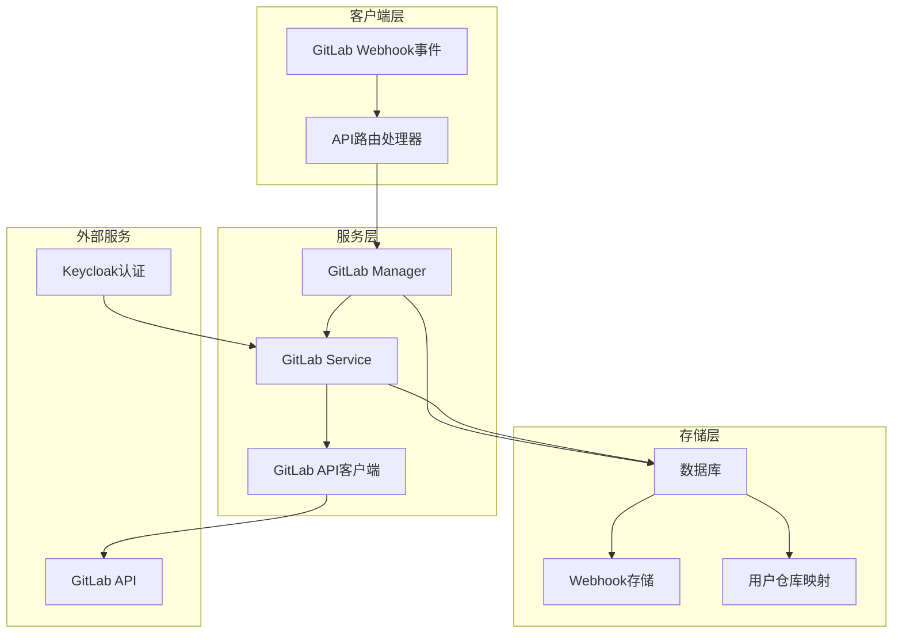

**图表来源**
- [gitlab_manager.py](file://enterprise/integrations/gitlab/gitlab_manager.py#L31-L262)
- [gitlab_service.py](file://enterprise/integrations/gitlab/gitlab_service.py#L21-L530)
- [gitlab.py](file://enterprise/server/routes/integration/gitlab.py#L14-L86)

## 认证机制

### OAuth2流程

系统支持多种认证方式，确保灵活的用户身份验证：

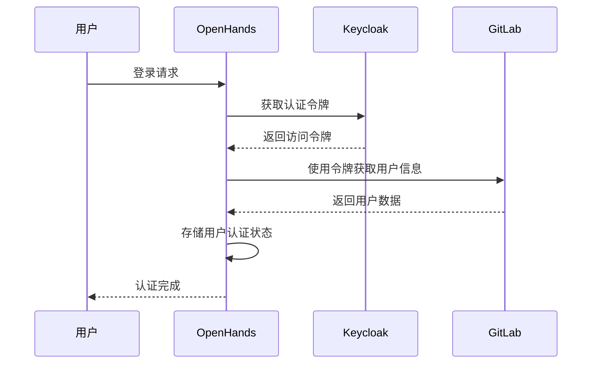

**图表来源**
- [gitlab_service.py](file://enterprise/integrations/gitlab/gitlab_service.py#L47-L81)
- [token_manager.py](file://enterprise/server/auth/token_manager.py#L324-L411)

### 令牌管理

系统实现了完善的令牌刷新机制，支持多种令牌类型：

| 令牌类型 | 用途 | 刷新策略 |
|---------|------|----------|
| 访问令牌 | API调用认证 | 自动刷新 |
| 刷新令牌 | 获取新访问令牌 | 定期轮换 |
| 离线令牌 | 长期会话保持 | 持久存储 |

**章节来源**
- [gitlab_service.py](file://enterprise/integrations/gitlab/gitlab_service.py#L47-L81)
- [token_manager.py](file://enterprise/server/auth/token_manager.py#L324-L411)

## 核心组件分析

### SaaSGitLabService服务层

服务层是系统的核心，负责与GitLab API的直接交互：

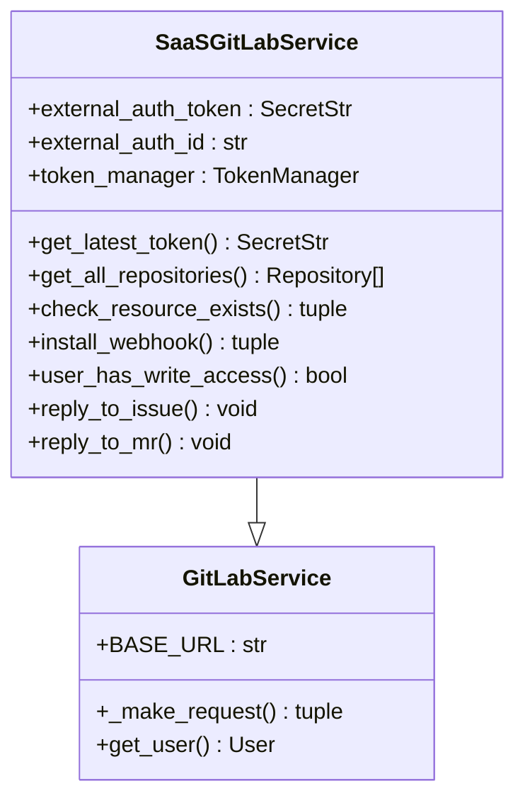

**图表来源**
- [gitlab_service.py](file://enterprise/integrations/gitlab/gitlab_service.py#L21-L530)

#### 关键功能特性

1. **多源令牌获取**：支持从不同认证源获取GitLab令牌
2. **资源检查**：验证资源存在性和用户权限
3. **Webhook管理**：安装和管理GitLab Webhook
4. **评论回复**：支持在Issue和Merge Request中回复

**章节来源**
- [gitlab_service.py](file://enterprise/integrations/gitlab/gitlab_service.py#L21-L530)

### GitlabManager管理层

管理层负责业务逻辑处理和消息路由：

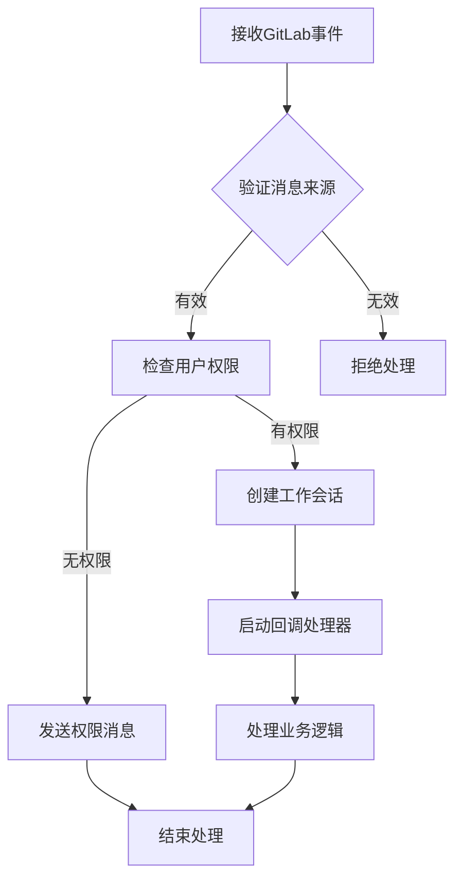

**图表来源**
- [gitlab_manager.py](file://enterprise/integrations/gitlab/gitlab_manager.py#L74-L262)

#### 权限验证机制

系统实现了细粒度的权限控制：

| 权限级别 | 描述 | API要求 |
|---------|------|---------|
| 只读访问 | 查看项目内容 | `read_repository` |
| 写入权限 | 创建分支和提交 | `write_repository` |
| 管理员权限 | 安装Webhook和修改设置 | `admin` |

**章节来源**
- [gitlab_manager.py](file://enterprise/integrations/gitlab/gitlab_manager.py#L39-L262)

### GitlabView视图层

视图层处理不同类型GitLab事件的特定逻辑：

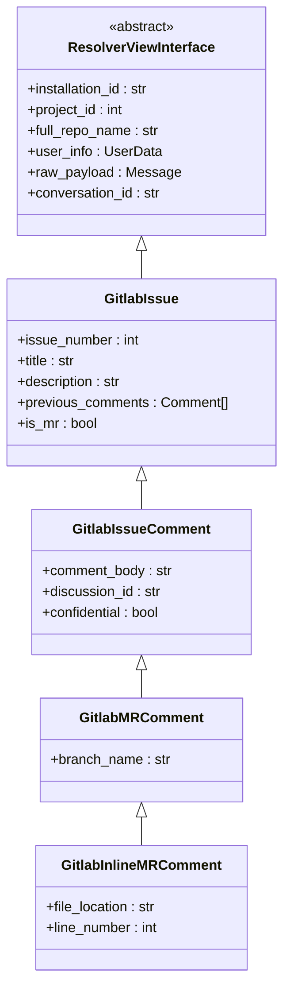

**图表来源**
- [gitlab_view.py](file://enterprise/integrations/gitlab/gitlab_view.py#L28-L452)

**章节来源**
- [gitlab_view.py](file://enterprise/integrations/gitlab/gitlab_view.py#L28-L452)

## API端点详解

### Webhook事件接收端点

系统提供专门的端点处理来自GitLab的事件：

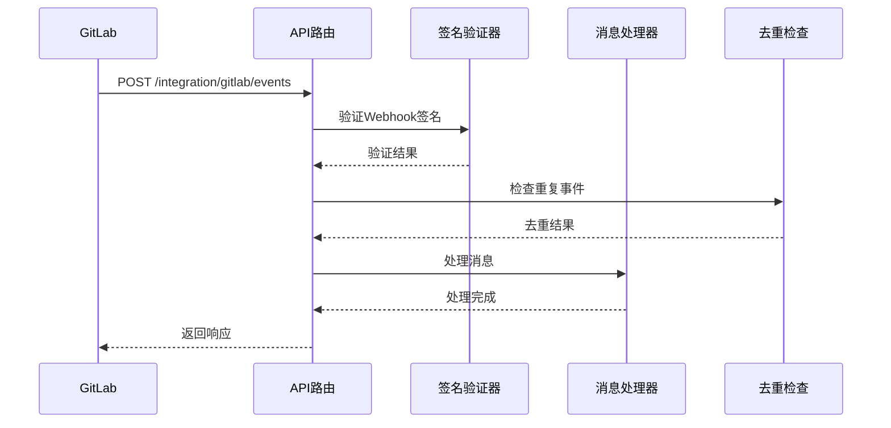

**图表来源**
- [gitlab.py](file://enterprise/server/routes/integration/gitlab.py#L35-L86)

#### 端点参数

| 参数名称 | 类型 | 必需 | 描述 |
|---------|------|------|------|
| `x_gitlab_token` | Header | 是 | Webhook签名密钥 |
| `x_openhands_webhook_id` | Header | 是 | OpenHands Webhook标识符 |
| `x_openhands_user_id` | Header | 是 | 用户唯一标识符 |

**章节来源**
- [gitlab.py](file://enterprise/server/routes/integration/gitlab.py#L35-L86)

### 项目访问API

系统提供多种项目访问接口：

| API方法 | 功能 | 权限要求 |
|---------|------|----------|
| `get_all_repositories` | 获取用户所有项目 | 已认证用户 |
| `get_owned_groups` | 获取用户拥有的组 | 已认证用户 |
| `user_has_write_access` | 检查写入权限 | 项目成员 |

**章节来源**
- [gitlab_service.py](file://enterprise/integrations/gitlab/gitlab_service.py#L171-L268)

## 事件订阅与Webhook管理

### Webhook生命周期管理

系统实现了完整的Webhook生命周期管理：

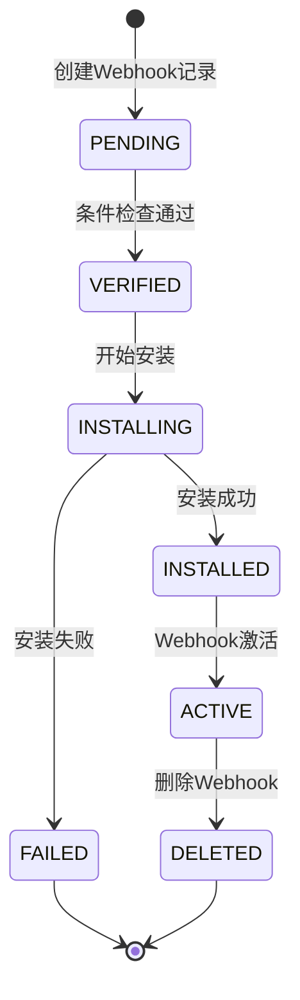

**图表来源**
- [gitlab_webhook.py](file://enterprise/storage/gitlab_webhook.py#L8-L13)
- [install_gitlab_webhooks.py](file://enterprise/sync/install_gitlab_webhooks.py#L31-L325)

### Webhook配置选项

系统支持丰富的Webhook配置：

| 配置项 | 默认值 | 描述 |
|--------|--------|------|
| `note_events` | 启用 | 评论事件通知 |
| `merge_requests_events` | 启用 | 合并请求事件 |
| `issues_events` | 启用 | Issue事件通知 |
| `pipeline_events` | 启用 | 构建管道事件 |
| `job_events` | 启用 | 作业执行事件 |

**章节来源**
- [install_gitlab_webhooks.py](file://enterprise/sync/install_gitlab_webhooks.py#L16-L24)

### 事件去重机制

为防止重复处理，系统实现了基于Redis的事件去重：

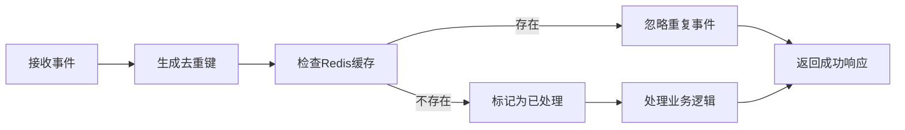

**图表来源**
- [gitlab.py](file://enterprise/server/routes/integration/gitlab.py#L59-L66)

**章节来源**
- [gitlab.py](file://enterprise/server/routes/integration/gitlab.py#L59-L66)

## 错误处理与重试机制

### 异常分类体系

系统定义了完整的异常处理体系：

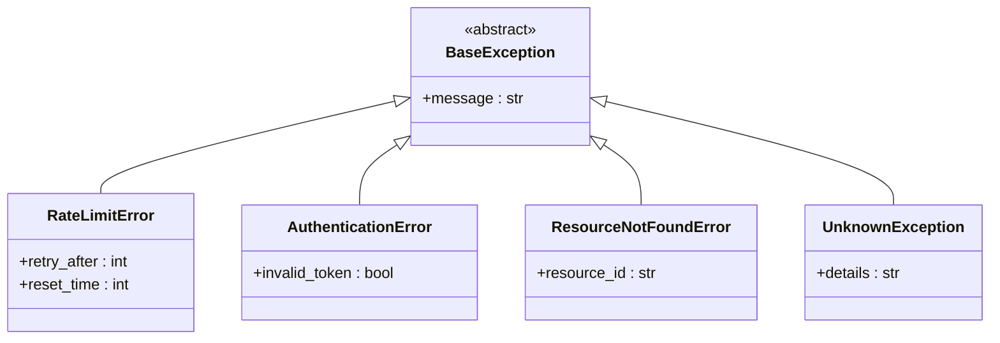

**图表来源**
- [rate_limit.py](file://enterprise/server/rate_limit.py#L123-L137)

### 速率限制策略

系统实现了智能的速率限制处理：

| 状态码 | 处理策略 | 重试间隔 |
|--------|----------|----------|
| 429 | 等待重试 | 动态计算 |
| 401 | 刷新令牌 | 立即重试 |
| 404 | 标记失效 | 不重试 |
| 其他 | 记录错误 | 不重试 |

**章节来源**
- [rate_limit.py](file://enterprise/server/rate_limit.py#L123-L137)

### 重试机制实现

系统提供了多层次的重试保护：

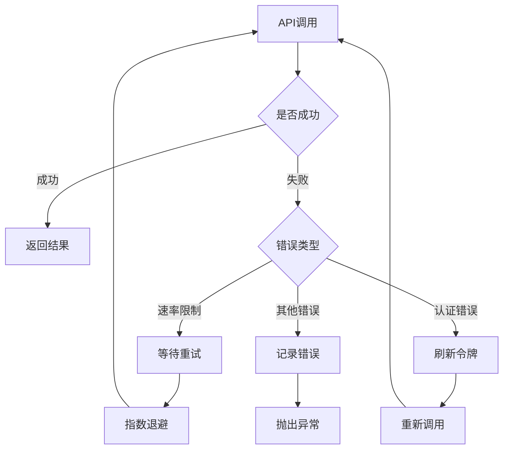

**图表来源**
- [install_gitlab_webhooks.py](file://enterprise/sync/install_gitlab_webhooks.py#L37-L43)

**章节来源**
- [install_gitlab_webhooks.py](file://enterprise/sync/install_gitlab_webhooks.py#L37-L43)

## 配置指南

### 应用注册配置

在GitLab上注册OpenHands应用的步骤：

1. **创建OAuth应用**
   - 进入GitLab设置 → 应用
   - 添加新应用
   - 设置重定向URI：`https://your-domain.com/auth/gitlab/callback`

2. **配置环境变量**
   ```bash
   GITLAB_APP_CLIENT_ID=your_client_id
   GITLAB_APP_CLIENT_SECRET=your_client_secret
   ```

3. **Webhook配置**
   - Webhook URL：`https://your-domain.com/integration/gitlab/events`
   - 密钥：自动生成
   - 事件范围：选择所需事件类型

### 权限设置

系统需要以下GitLab权限：

| 权限类别 | 所需权限 | 用途 |
|---------|----------|------|
| 项目访问 | `read_repository` | 读取项目信息 |
| 项目访问 | `write_repository` | 创建分支和提交 |
| Webhook管理 | `admin` | 安装和管理Webhook |
| Issue管理 | `read_issues` | 读取Issue信息 |
| Merge Request | `read_merge_requests` | 读取合并请求 |

### 数据库配置

Webhook状态管理使用数据库存储：

```sql
CREATE TABLE gitlab_webhook (
    id SERIAL PRIMARY KEY,
    group_id VARCHAR NULL,
    project_id VARCHAR NULL,
    user_id VARCHAR NOT NULL,
    webhook_exists BOOLEAN NOT NULL DEFAULT FALSE,
    webhook_url VARCHAR NULL,
    webhook_secret VARCHAR NULL,
    webhook_uuid VARCHAR NULL,
    scopes TEXT[],
    last_synced TIMESTAMP WITH TIME ZONE
);
```

**章节来源**
- [gitlab_webhook.py](file://enterprise/storage/gitlab_webhook.py#L15-L43)

## 性能优化与可靠性保障

### 缓存策略

系统实现了多级缓存机制：

1. **令牌缓存**：避免频繁的令牌刷新
2. **用户信息缓存**：减少API调用次数
3. **权限检查缓存**：快速响应权限验证

### 并发控制

为防止API滥用，系统实施了并发控制：

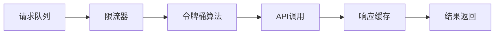

### 数据同步保障

系统提供了可靠的数据同步机制：

| 同步类型 | 触发条件 | 重试策略 |
|---------|----------|----------|
| Webhook安装 | 用户授权后 | 指数退避 |
| 项目列表更新 | 定时任务 | 固定间隔 |
| 权限验证 | 事件触发 | 立即重试 |

**章节来源**
- [install_gitlab_webhooks.py](file://enterprise/sync/install_gitlab_webhooks.py#L243-L325)

## 故障排除指南

### 常见问题诊断

#### Webhook安装失败

**症状**：Webhook无法正常工作

**排查步骤**：
1. 检查网络连接和防火墙设置
2. 验证GitLab应用权限配置
3. 确认Webhook URL可达性
4. 检查令牌有效性

#### 权限不足错误

**症状**：无法访问某些项目或执行操作

**解决方案**：
1. 确认用户在项目中的权限级别
2. 检查OAuth作用域配置
3. 验证令牌刷新机制

#### 速率限制问题

**症状**：API调用频繁失败

**解决策略**：
1. 实施指数退避重试
2. 优化API调用频率
3. 使用批量操作减少请求数量

### 日志监控

系统提供了详细的日志记录：

```python
# 关键日志级别
logger.info("Webhook installation started")
logger.warning("Rate limit exceeded, retrying...")
logger.error("Authentication failed, refreshing token")
```

### 性能监控指标

| 指标名称 | 监控目标 | 告警阈值 |
|---------|----------|----------|
| API响应时间 | < 2秒 | > 5秒 |
| Webhook成功率 | > 95% | < 90% |
| 错误率 | < 1% | > 5% |
| 重试次数 | < 3次 | > 5次 |

**章节来源**
- [gitlab_service.py](file://enterprise/integrations/gitlab/gitlab_service.py#L470-L474)
- [install_gitlab_webhooks.py](file://enterprise/sync/install_gitlab_webhooks.py#L37-L43)

## 总结

OpenHands的GitLab集成API提供了一个完整、可靠的GitLab平台集成功能。通过分层架构设计、完善的认证机制、智能的错误处理和重试策略，系统能够稳定地处理各种GitLab事件和API请求。

### 主要优势

1. **安全性**：多重认证和权限验证机制
2. **可靠性**：完善的错误处理和重试机制
3. **可扩展性**：模块化设计支持功能扩展
4. **性能**：智能缓存和并发控制
5. **易用性**：简洁的配置和部署流程

### 最佳实践建议

1. **定期监控**：建立完善的监控和告警机制
2. **版本管理**：及时更新GitLab API兼容性
3. **安全加固**：定期轮换Webhook密钥
4. **性能优化**：根据实际负载调整缓存策略
5. **文档维护**：保持配置文档的及时更新

该集成系统为开发者提供了强大的GitLab平台集成能力，支持自动化工作流、实时事件处理和项目管理等功能，是现代DevOps工具链的重要组成部分。