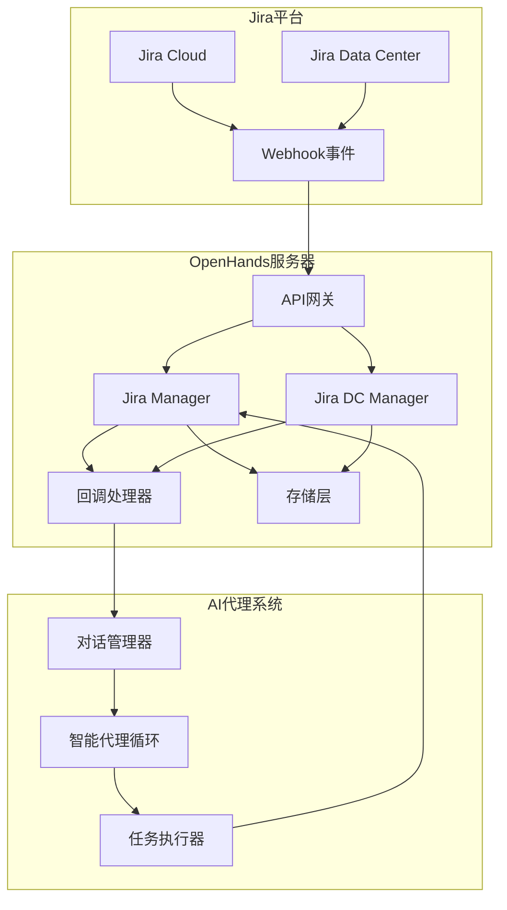
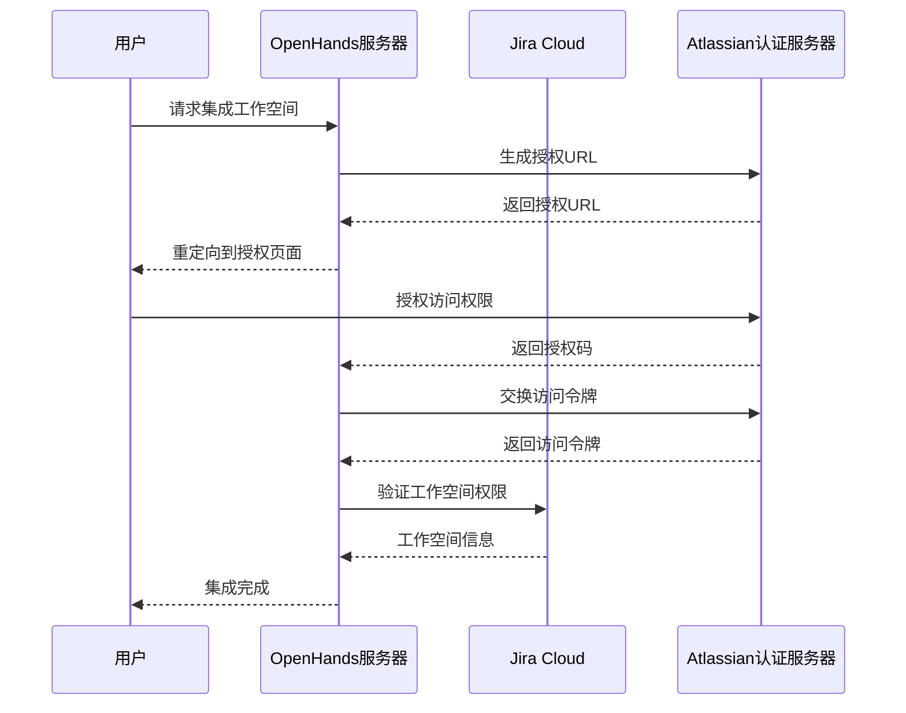
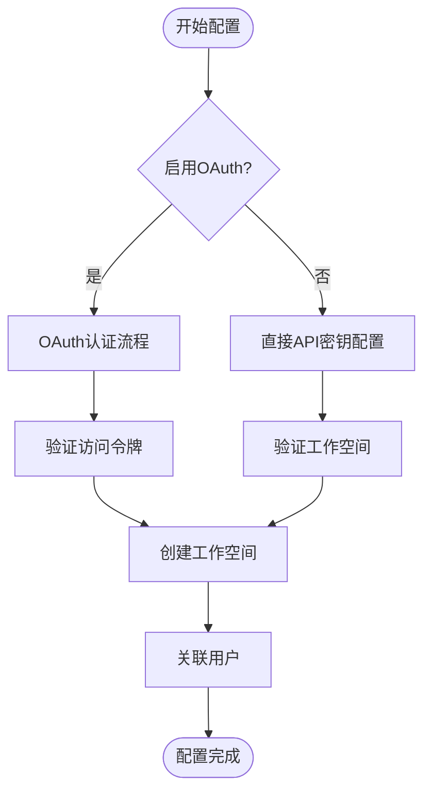
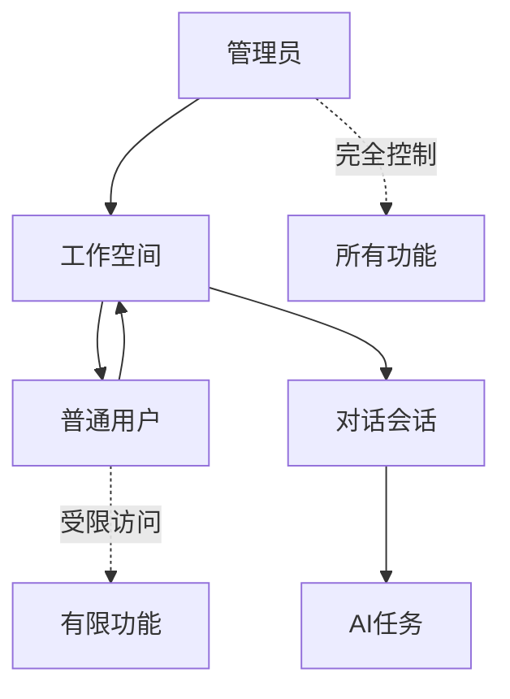
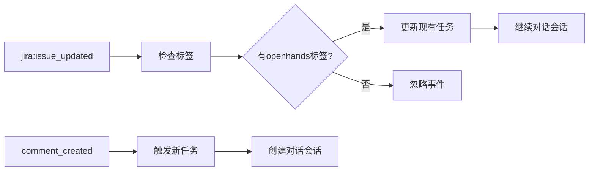
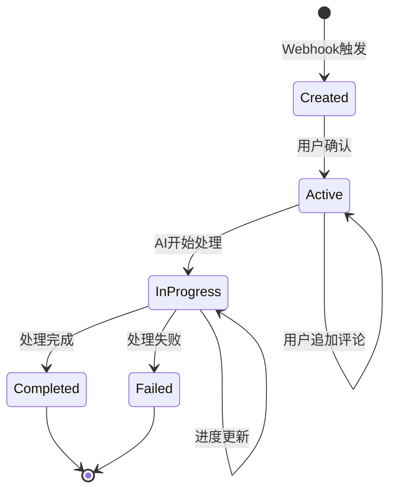
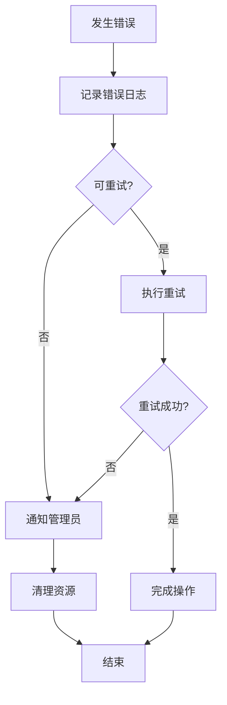

# Jira集成API技术文档

<cite>
**本文档中引用的文件**
- [jira_manager.py](file://enterprise/integrations/jira/jira_manager.py)
- [jira_service.py](file://enterprise/integrations/jira/jira_service.py)
- [jira_view.py](file://enterprise/integrations/jira/jira_view.py)
- [jira_types.py](file://enterprise/integrations/jira/jira_types.py)
- [jira_dc_manager.py](file://enterprise/integrations/jira_dc/jira_dc_manager.py)
- [jira_dc_view.py](file://enterprise/integrations/jira_dc/jira_dc_view.py)
- [jira_dc_types.py](file://enterprise/integrations/jira_dc/jira_dc_types.py)
- [jira.py](file://enterprise/server/routes/integration/jira.py)
- [jira_dc.py](file://enterprise/server/routes/integration/jira_dc.py)
- [jira_callback_processor.py](file://enterprise/server/conversation_callback_processor/jira_callback_processor.py)
- [jira_dc_callback_processor.py](file://enterprise/server/conversation_callback_processor/jira_dc_callback_processor.py)
- [jira_integration_store.py](file://enterprise/storage/jira_integration_store.py)
- [jira_dc_integration_store.py](file://enterprise/storage/jira_dc_integration_store.py)
- [jira_workspace.py](file://enterprise/storage/jira_workspace.py)
- [jira_dc_workspace.py](file://enterprise/storage/jira_dc_workspace.py)
- [jira_user.py](file://enterprise/storage/jira_user.py)
- [jira_dc_user.py](file://enterprise/storage/jira_dc_user.py)
- [jira_conversation.py](file://enterprise/storage/jira_conversation.py)
- [jira_dc_conversation.py](file://enterprise/storage/jira_dc_conversation.py)
</cite>

## 目录
1. [概述](#概述)
2. [系统架构](#系统架构)
3. [Jira Cloud集成](#jira-cloud集成)
4. [Jira Data Center集成](#jira-data-center集成)
5. [认证与授权](#认证与授权)
6. [API端点详解](#api端点详解)
7. [事件监听机制](#事件监听机制)
8. [工单管理](#工单管理)
9. [错误处理策略](#错误处理策略)
10. [性能优化与限制](#性能优化与限制)
11. [配置指南](#配置指南)
12. [故障排除](#故障排除)

## 概述

OpenHands提供了完整的Jira集成解决方案，支持Jira Cloud和Jira Data Center两种部署模式。该集成允许用户通过Jira工单触发AI代理任务，实现实时的工单响应和进度跟踪。

### 核心功能特性

- **双向通信**：支持从Jira到OpenHands的任务创建和从OpenHands到Jira的状态更新
- **事件驱动**：基于Webhook的实时事件监听机制
- **会话管理**：自动化的对话会话创建和管理
- **权限控制**：细粒度的用户权限和工作空间访问控制
- **数据同步**：确保Jira和OpenHands之间的数据一致性

## 系统架构



**图表来源**
- [jira_manager.py](file://enterprise/integrations/jira/jira_manager.py#L40-L50)
- [jira_dc_manager.py](file://enterprise/integrations/jira_dc/jira_dc_manager.py#L40-L50)
- [jira_callback_processor.py](file://enterprise/server/conversation_callback_processor/jira_callback_processor.py#L28-L40)

### 架构组件说明

1. **Jira Manager**：负责Jira Cloud的业务逻辑处理
2. **Jira DC Manager**：负责Jira Data Center的业务逻辑处理  
3. **回调处理器**：处理AI代理状态变化的回调事件
4. **存储层**：持久化工作空间、用户和对话数据
5. **API网关**：统一的入口点，处理认证和请求路由

**章节来源**
- [jira_manager.py](file://enterprise/integrations/jira/jira_manager.py#L40-L80)
- [jira_dc_manager.py](file://enterprise/integrations/jira_dc/jira_dc_manager.py#L40-L80)

## Jira Cloud集成

### 认证流程

Jira Cloud集成采用OAuth 2.0标准认证流程：



**图表来源**
- [jira.py](file://enterprise/server/routes/integration/jira.py#L394-L470)
- [jira_manager.py](file://enterprise/integrations/jira/jira_manager.py#L48-L67)

### 核心配置参数

| 参数名称 | 描述 | 示例值 |
|---------|------|--------|
| `workspace_name` | 工作空间显示名称 | `mycompany.atlassian.net` |
| `webhook_secret` | Webhook签名密钥 | `your-secret-key` |
| `svc_acc_email` | 服务账户邮箱 | `service-account@mycompany.com` |
| `svc_acc_api_key` | 服务账户API密钥 | `your-api-token` |
| `is_active` | 是否激活集成 | `true` |

**章节来源**
- [jira.py](file://enterprise/server/routes/integration/jira.py#L36-L75)
- [jira_workspace.py](file://enterprise/storage/jira_workspace.py#L5-L25)

## Jira Data Center集成

### 认证方式差异

Jira Data Center支持两种认证模式：

1. **OAuth模式**：需要配置客户端ID和密钥
2. **API密钥模式**：直接使用API密钥进行身份验证



**图表来源**
- [jira_dc.py](file://enterprise/server/routes/integration/jira_dc.py#L283-L380)
- [jira_dc_manager.py](file://enterprise/integrations/jira_dc/jira_dc_manager.py#L48-L82)

**章节来源**
- [jira_dc.py](file://enterprise/server/routes/integration/jira_dc.py#L283-L380)
- [jira_dc_workspace.py](file://enterprise/storage/jira_dc_workspace.py#L5-L24)

## 认证与授权

### 权限模型

系统采用分层权限模型：



**图表来源**
- [jira_user.py](file://enterprise/storage/jira_user.py#L5-L22)
- [jira_workspace.py](file://enterprise/storage/jira_workspace.py#L5-L25)

### 安全机制

1. **Webhook签名验证**：使用HMAC-SHA256算法验证请求来源
2. **重复请求防护**：基于Redis的请求去重机制
3. **用户身份验证**：基于Keycloak的统一身份认证
4. **访问令牌加密**：敏感信息采用AES加密存储

**章节来源**
- [jira_manager.py](file://enterprise/integrations/jira/jira_manager.py#L86-L132)
- [jira_dc_manager.py](file://enterprise/integrations/jira_dc/jira_dc_manager.py#L101-L147)

## API端点详解

### Jira Cloud API端点

| 端点 | 方法 | 功能描述 | 请求体 |
|------|------|----------|--------|
| `/integration/jira/events` | POST | 处理Jira Webhook事件 | Webhook负载 |
| `/integration/jira/workspaces` | POST | 创建Jira工作空间 | 工作空间配置 |
| `/integration/jira/workspaces/link` | POST | 链接用户到工作空间 | 工作空间名称 |
| `/integration/jira/workspaces/unlink` | POST | 解除用户链接 | 无 |
| `/integration/jira/workspaces/validate/{workspace_name}` | GET | 验证工作空间状态 | 路径参数 |
| `/integration/jira/workspaces/link` | GET | 获取当前链接详情 | 无 |

### Jira Data Center API端点

| 端点 | 方法 | 功能描述 | 请求体 |
|------|------|----------|--------|
| `/integration/jira-dc/events` | POST | 处理Jira DC Webhook事件 | Webhook负载 |
| `/integration/jira-dc/workspaces` | POST | 创建Jira DC工作空间 | 工作空间配置 |
| `/integration/jira-dc/workspaces/link` | POST | 链接用户到Jira DC工作空间 | 工作空间名称 |
| `/integration/jira-dc/workspaces/unlink` | POST | 解除Jira DC用户链接 | 无 |
| `/integration/jira-dc/workspaces/validate/{workspace_name}` | GET | 验证Jira DC工作空间状态 | 路径参数 |
| `/integration/jira-dc/workspaces/link` | GET | 获取当前Jira DC链接详情 | 无 |

**章节来源**
- [jira.py](file://enterprise/server/routes/integration/jira.py#L215-L254)
- [jira_dc.py](file://enterprise/server/routes/integration/jira_dc.py#L224-L261)

## 事件监听机制

### Webhook事件类型

系统支持以下Webhook事件：



**图表来源**
- [jira_manager.py](file://enterprise/integrations/jira/jira_manager.py#L134-L206)
- [jira_dc_manager.py](file://enterprise/integrations/jira_dc/jira_dc_manager.py#L149-L221)

### 事件处理流程

1. **签名验证**：验证Webhook请求的完整性
2. **重复检测**：防止同一事件被多次处理
3. **事件解析**：提取关键信息如工单ID、用户信息等
4. **权限检查**：验证用户是否有权访问相关资源
5. **任务调度**：根据事件类型启动相应的工作流

**章节来源**
- [jira_manager.py](file://enterprise/integrations/jira/jira_manager.py#L208-L298)
- [jira_dc_manager.py](file://enterprise/integrations/jira_dc/jira_dc_manager.py#L223-L314)

## 工单管理

### 工单生命周期



**图表来源**
- [jira_view.py](file://enterprise/integrations/jira/jira_view.py#L27-L96)
- [jira_dc_view.py](file://enterprise/integrations/jira_dc/jira_dc_view.py#L30-L100)

### 会话管理

系统自动管理对话会话：

1. **新会话创建**：当用户首次提及`@openhands`时创建
2. **会话恢复**：后续评论自动关联到现有会话
3. **会话终止**：AI任务完成后自动关闭会话
4. **会话查询**：基于工单ID快速查找相关会话

**章节来源**
- [jira_view.py](file://enterprise/integrations/jira/jira_view.py#L185-L225)
- [jira_dc_view.py](file://enterprise/integrations/jira_dc/jira_dc_view.py#L189-L226)

## 错误处理策略

### 常见错误类型

| 错误类型 | 状态码 | 处理策略 | 用户提示 |
|---------|--------|----------|----------|
| 签名验证失败 | 403 | 记录日志，拒绝请求 | 无效的Webhook签名 |
| 工作空间不存在 | 404 | 返回友好错误消息 | 工作空间未配置 |
| 用户未授权 | 403 | 检查权限，记录审计 | 用户未授权访问 |
| API调用失败 | 500 | 重试机制，降级处理 | 服务暂时不可用 |
| 会话创建失败 | 500 | 清理资源，通知管理员 | 无法创建会话 |

### 错误恢复机制



**图表来源**
- [jira_manager.py](file://enterprise/integrations/jira/jira_manager.py#L375-L388)
- [jira_dc_manager.py](file://enterprise/integrations/jira_dc/jira_dc_manager.py#L392-L404)

**章节来源**
- [jira_manager.py](file://enterprise/integrations/jira/jira_manager.py#L375-L404)
- [jira_dc_manager.py](file://enterprise/integrations/jira_dc/jira_dc_manager.py#L392-L420)

## 性能优化与限制

### API调用限制

| 限制类型 | Jira Cloud | Jira Data Center | 说明 |
|---------|------------|------------------|------|
| Webhook并发数 | 1000/分钟 | 500/分钟 | 单个工作空间限制 |
| API请求频率 | 1000/小时 | 500/小时 | 基于IP的限制 |
| 会话保持时间 | 24小时 | 48小时 | 自动清理超时会话 |
| 事件处理延迟 | < 5秒 | < 10秒 | 系统响应时间 |

### 缓存策略

1. **用户信息缓存**：缓存用户权限和工作空间信息
2. **工单详情缓存**：减少重复的API调用
3. **会话状态缓存**：提高会话查询效率
4. **配置信息缓存**：避免频繁的数据库查询

**章节来源**
- [jira_manager.py](file://enterprise/integrations/jira/jira_manager.py#L238-L244)
- [jira_dc_manager.py](file://enterprise/integrations/jira_dc/jira_dc_manager.py#L251-L257)

## 配置指南

### 环境变量配置

```bash
# Jira Cloud配置
JIRA_CLIENT_ID=your-client-id
JIRA_CLIENT_SECRET=your-client-secret
JIRA_WEBHOOKS_ENABLED=true

# Jira Data Center配置  
JIRA_DC_CLIENT_ID=your-dc-client-id
JIRA_DC_CLIENT_SECRET=your-dc-client-secret
JIRA_DC_BASE_URL=https://jira.example.com
JIRA_DC_ENABLE_OAUTH=true
JIRA_DC_WEBHOOKS_ENABLED=true
```

### 数据库迁移

系统包含完整的数据库迁移脚本，支持自动创建必要的表结构：

- `jira_workspaces`：Jira Cloud工作空间配置
- `jira_users`：Jira Cloud用户映射关系
- `jira_conversations`：Jira Cloud对话会话记录
- `jira_dc_workspaces`：Jira Data Center工作空间配置
- `jira_dc_users`：Jira Data Center用户映射关系
- `jira_dc_conversations`：Jira Data Center对话会话记录

**章节来源**
- [jira_workspace.py](file://enterprise/storage/jira_workspace.py#L5-L25)
- [jira_dc_workspace.py](file://enterprise/storage/jira_dc_workspace.py#L5-L24)

## 故障排除

### 常见问题诊断

1. **Webhook不生效**
   - 检查Webhook URL是否正确配置
   - 验证网络连通性和防火墙设置
   - 确认Webhook签名密钥匹配

2. **用户认证失败**
   - 验证OAuth令牌是否有效
   - 检查用户在Jira中的权限
   - 确认工作空间管理员权限

3. **会话创建失败**
   - 检查数据库连接状态
   - 验证用户权限配置
   - 查看AI代理服务状态

### 监控指标

系统提供以下监控指标：

- Webhook接收成功率
- 事件处理延迟时间
- 会话创建成功率
- API调用错误率
- 用户活跃度统计

**章节来源**
- [jira_manager.py](file://enterprise/integrations/jira/jira_manager.py#L223-L230)
- [jira_dc_manager.py](file://enterprise/integrations/jira_dc/jira_dc_manager.py#L238-L245)