# Slack集成API完整文档

<cite>
**本文档引用的文件**
- [slack_manager.py](file://enterprise/integrations/slack/slack_manager.py)
- [slack_view.py](file://enterprise/integrations/slack/slack_view.py)
- [slack_types.py](file://enterprise/integrations/slack/slack_types.py)
- [slack_callback_processor.py](file://enterprise/server/conversation_callback_processor/slack_callback_processor.py)
- [slack.py](file://enterprise/server/routes/integration/slack.py)
- [slack_user.py](file://enterprise/storage/slack_user.py)
- [slack_team.py](file://enterprise/storage/slack_team.py)
- [slack_conversation.py](file://enterprise/storage/slack_conversation.py)
- [test_slack_integration.py](file://enterprise/tests/unit/test_slack_integration.py)
</cite>

## 目录
1. [简介](#简介)
2. [项目结构](#项目结构)
3. [核心组件](#核心组件)
4. [架构概览](#架构概览)
5. [详细组件分析](#详细组件分析)
6. [Slack应用认证](#slack应用认证)
7. [API端点与事件处理](#api端点与事件处理)
8. [实时通信功能](#实时通信功能)
9. [错误处理与限流策略](#错误处理与限流策略)
10. [配置与部署](#配置与部署)
11. [故障排除指南](#故障排除指南)
12. [结论](#结论)

## 简介

OpenHands的Slack集成API提供了一个完整的解决方案，用于在Slack平台上构建智能对话机器人。该系统支持OAuth2认证、Bot Token授权、消息发送、事件订阅和实时通信功能。通过分层架构设计，系统实现了从用户认证到消息处理的完整流程。

## 项目结构

Slack集成模块采用模块化设计，主要包含以下核心文件：

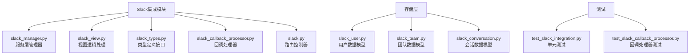

**图表来源**
- [slack_manager.py](file://enterprise/integrations/slack/slack_manager.py#L1-L50)
- [slack_view.py](file://enterprise/integrations/slack/slack_view.py#L1-L50)
- [slack_types.py](file://enterprise/integrations/slack/slack_types.py#L1-L49)

**章节来源**
- [slack_manager.py](file://enterprise/integrations/slack/slack_manager.py#L1-L364)
- [slack_view.py](file://enterprise/integrations/slack/slack_view.py#L1-L447)
- [slack_types.py](file://enterprise/integrations/slack/slack_types.py#L1-L49)

## 核心组件

### SlackManager - 服务层核心

SlackManager是整个Slack集成的核心服务类，负责：
- 用户认证和权限验证
- 消息接收和处理
- 仓库选择和对话启动
- 错误处理和日志记录

主要功能包括：
- OAuth2认证流程管理
- Bot Token验证和使用
- 用户身份映射和关联
- 消息转发和响应处理

### SlackViewInterface - 视图抽象层

定义了Slack视图的统一接口，支持多种视图类型：
- SlackNewConversationView：新对话创建
- SlackUpdateExistingConversationView：现有对话更新
- SlackNewConversationFromRepoFormView：基于表单的选择
- SlackUnkownUserView：未知用户处理

### SlackCallbackProcessor - 实时回调处理

专门处理来自Slack的实时事件回调，实现：
- 代理状态变化监控
- 自动摘要生成
- 消息重试机制
- 状态跟踪和持久化

**章节来源**
- [slack_manager.py](file://enterprise/integrations/slack/slack_manager.py#L42-L364)
- [slack_view.py](file://enterprise/integrations/slack/slack_view.py#L37-L447)
- [slack_types.py](file://enterprise/integrations/slack/slack_types.py#L10-L49)

## 架构概览

Slack集成采用分层架构设计，确保了系统的可扩展性和维护性：

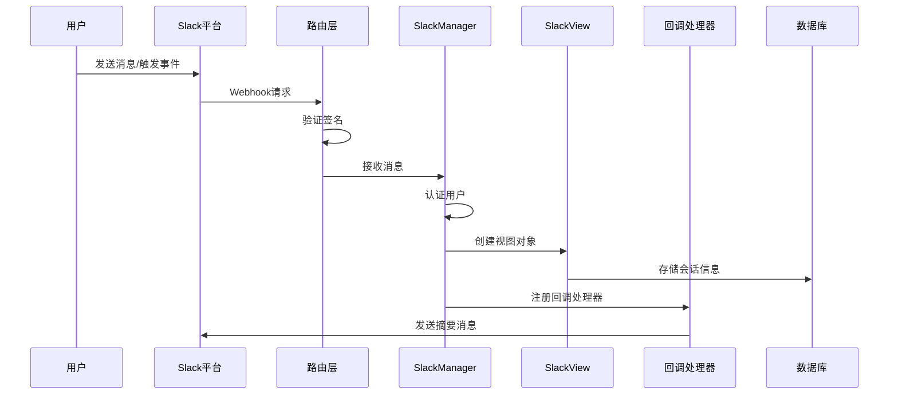

**图表来源**
- [slack.py](file://enterprise/server/routes/integration/slack.py#L238-L297)
- [slack_manager.py](file://enterprise/integrations/slack/slack_manager.py#L180-L218)
- [slack_callback_processor.py](file://enterprise/server/conversation_callback_processor/slack_callback_processor.py#L28-L183)

## 详细组件分析

### SlackManager服务层实现

SlackManager提供了完整的Slack集成功能，其核心方法包括：

#### 用户认证和身份验证
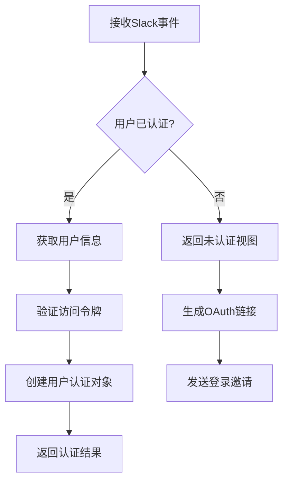

**图表来源**
- [slack_manager.py](file://enterprise/integrations/slack/slack_manager.py#L68-L87)

#### 消息处理流程
消息处理遵循严格的验证和路由机制：

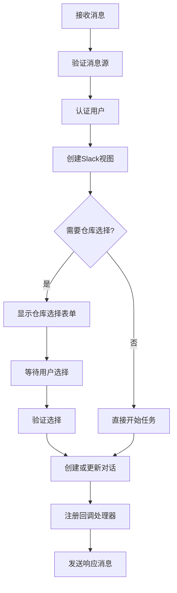

**图表来源**
- [slack_manager.py](file://enterprise/integrations/slack/slack_manager.py#L180-L296)

#### 仓库推理和选择
系统具备智能仓库识别能力：

| 输入模式 | 匹配规则 | 示例 |
|---------|---------|------|
| 完整仓库路径 | `org/repo`格式 | `OpenHands/OpenHands` |
| 关键词匹配 | `deploy repo`模式 | `deploy hello-world` |
| 部分匹配 | 部分名称匹配 | `use project` |

**章节来源**
- [slack_manager.py](file://enterprise/integrations/slack/slack_manager.py#L89-L178)

### SlackView视图逻辑处理

SlackView层负责处理不同类型的Slack交互场景：

#### 视图类型层次结构
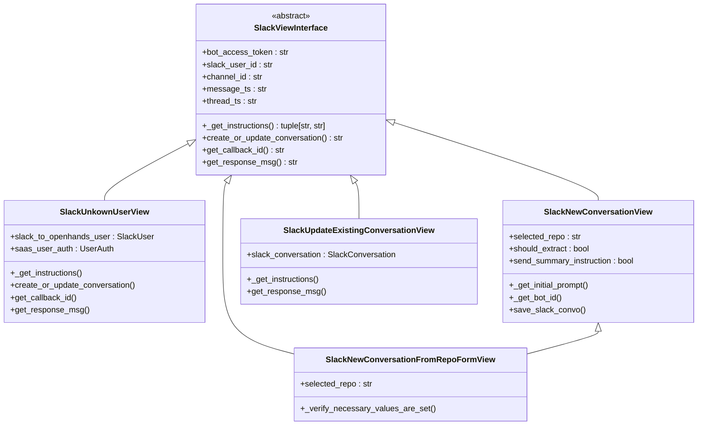

**图表来源**
- [slack_view.py](file://enterprise/integrations/slack/slack_view.py#L37-L447)
- [slack_types.py](file://enterprise/integrations/slack/slack_types.py#L10-L49)

#### 对话上下文获取
系统能够智能获取和处理对话上下文：

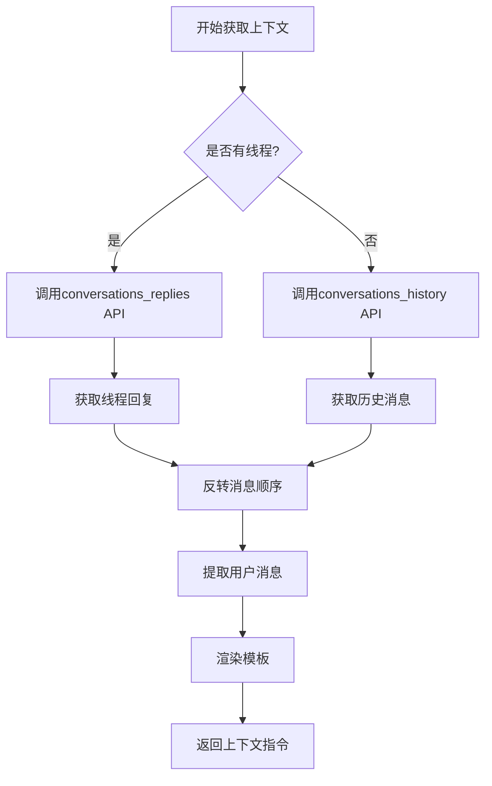

**图表来源**
- [slack_view.py](file://enterprise/integrations/slack/slack_view.py#L82-L152)

**章节来源**
- [slack_view.py](file://enterprise/integrations/slack/slack_view.py#L37-L447)

### SlackCallbackProcessor回调处理

回调处理器实现了实时消息同步和状态监控：

#### 回调处理流程
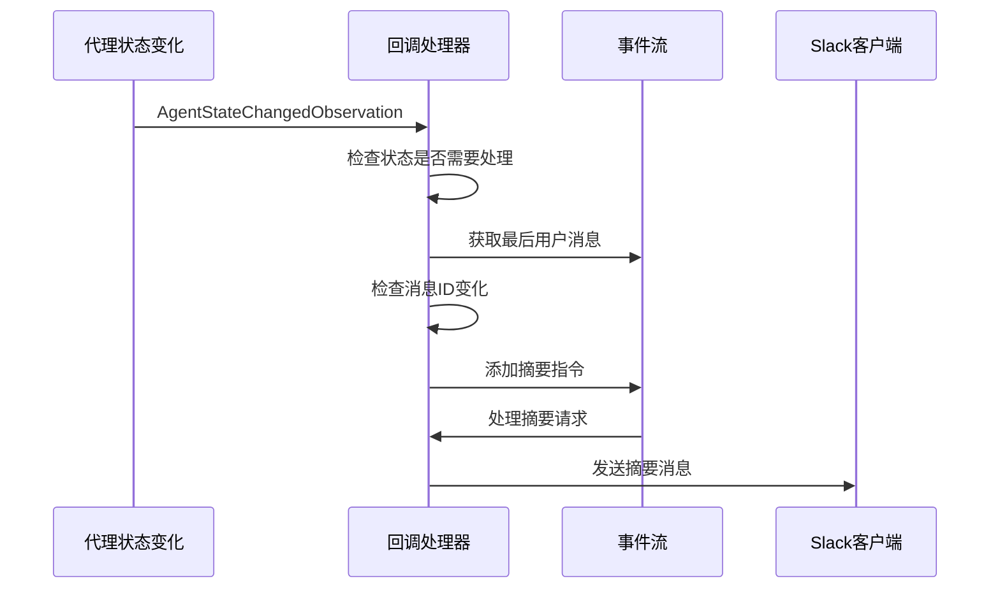

**图表来源**
- [slack_callback_processor.py](file://enterprise/server/conversation_callback_processor/slack_callback_processor.py#L81-L183)

#### 摘要生成和发送
系统自动检测并生成对话摘要：

| 状态类型 | 处理方式 | 触发条件 |
|---------|---------|---------|
| AWAITING_USER_INPUT | 发送摘要指令 | 等待用户输入 |
| FINISHED | 提取并发送摘要 | 任务完成 |
| 其他状态 | 忽略 | 不需要处理 |

**章节来源**
- [slack_callback_processor.py](file://enterprise/server/conversation_callback_processor/slack_callback_processor.py#L28-L183)

## Slack应用认证

### OAuth2认证流程

系统支持完整的OAuth2认证流程：

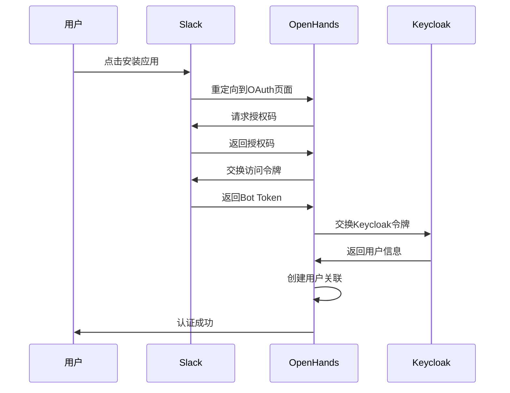

**图表来源**
- [slack.py](file://enterprise/server/routes/integration/slack.py#L55-L235)

### Bot Token管理

系统使用Bot Access Token进行Slack API调用：

| Token类型 | 用途 | 权限范围 |
|----------|------|---------|
| Bot Access Token | 消息发送和事件处理 | chat:write, app_mentions:read |
| User Access Token | 用户特定操作 | search:read |
| Team Token | 团队级别管理 | 完整权限 |

**章节来源**
- [slack.py](file://enterprise/server/routes/integration/slack.py#L42-L235)
- [slack_team.py](file://enterprise/storage/slack_team.py#L1-L15)

## API端点与事件处理

### 主要API端点

系统提供以下关键API端点：

| 端点 | 方法 | 功能 | 认证要求 |
|------|------|------|---------|
| `/slack/install` | GET | 启动OAuth流程 | 无 |
| `/slack/install-callback` | GET | OAuth回调处理 | 无 |
| `/slack/on-event` | POST | Slack事件接收 | 签名验证 |
| `/slack/on-form-interaction` | POST | 表单交互处理 | 签名验证 |

### 事件处理机制

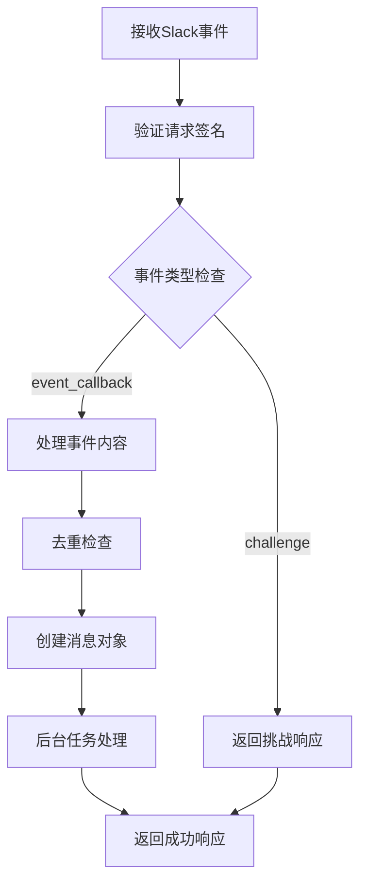

**图表来源**
- [slack.py](file://enterprise/server/routes/integration/slack.py#L238-L297)

### 表单交互处理

系统支持复杂的Slack表单交互：

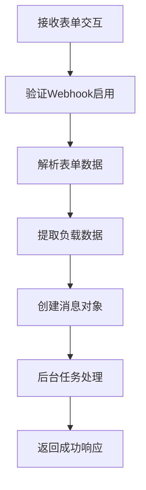

**图表来源**
- [slack.py](file://enterprise/server/routes/integration/slack.py#L300-L352)

**章节来源**
- [slack.py](file://enterprise/server/routes/integration/slack.py#L42-L366)

## 实时通信功能

### 事件订阅和回调

系统实现了完整的事件订阅机制：

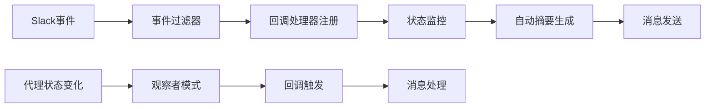

**图表来源**
- [slack_callback_processor.py](file://enterprise/server/conversation_callback_processor/slack_callback_processor.py#L28-L183)

### 消息同步策略

系统采用多层消息同步策略：

| 同步类型 | 触发条件 | 响应方式 | 优先级 |
|---------|---------|---------|-------|
| 即时摘要 | 代理状态变化 | 异步发送 | 高 |
| 会话更新 | 用户消息 | 同步响应 | 中 |
| 错误通知 | 异常情况 | 立即通知 | 最高 |

### 重复消息防护

系统实现了Redis-based的重复消息防护机制：

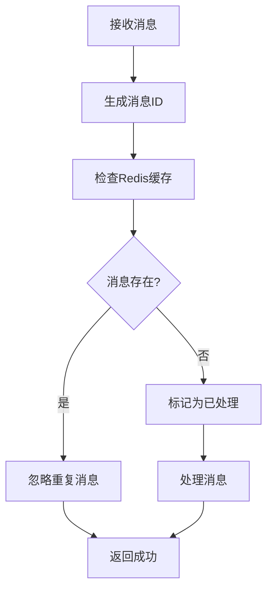

**图表来源**
- [slack.py](file://enterprise/server/routes/integration/slack.py#L273-L279)

**章节来源**
- [slack_callback_processor.py](file://enterprise/server/conversation_callback_processor/slack_callback_processor.py#L28-L183)
- [slack.py](file://enterprise/server/routes/integration/slack.py#L273-L279)

## 错误处理与限流策略

### 错误处理机制

系统实现了多层次的错误处理：

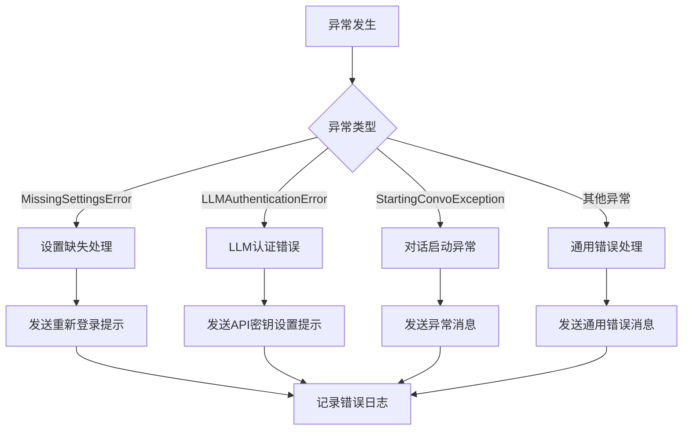

**图表来源**
- [slack_manager.py](file://enterprise/integrations/slack/slack_manager.py#L341-L363)

### 速率限制策略

系统采用Redis-based的固定窗口限流算法：

| 限制维度 | 限制规则 | 重置策略 | 降级处理 |
|---------|---------|---------|---------|
| 用户级别 | 10次/秒 | 窗口结束时重置 | 返回429状态码 |
| IP级别 | 100次/分钟 | 窗口结束时重置 | 连接拒绝 |
| 全局级别 | 1000次/小时 | 时间戳重置 | 服务降级 |

### 可靠性保障措施

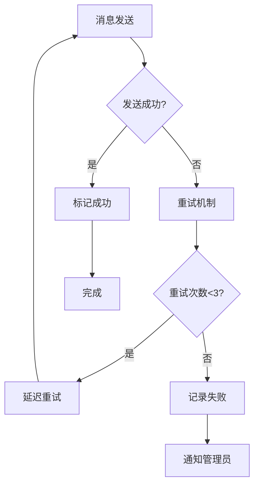

**章节来源**
- [slack_manager.py](file://enterprise/integrations/slack/slack_manager.py#L341-L363)
- [rate_limit.py](file://enterprise/server/rate_limit.py#L50-L137)

## 配置与部署

### 环境变量配置

| 变量名 | 描述 | 示例值 | 必需 |
|--------|------|--------|------|
| `SLACK_CLIENT_ID` | Slack应用客户端ID | `A08MFF9S6FQ` | 是 |
| `SLACK_CLIENT_SECRET` | Slack应用客户端密钥 | `xxx` | 是 |
| `SLACK_SIGNING_SECRET` | Slack签名密钥 | `xxx` | 是 |
| `SLACK_WEBHOOKS_ENABLED` | 启用Webhook | `true` | 否 |

### 数据库表结构

系统使用三个核心数据库表：

| 表名 | 主要字段 | 用途 |
|------|---------|------|
| `slack_users` | keycloak_user_id, slack_user_id, slack_display_name | 用户关联信息 |
| `slack_teams` | team_id, bot_access_token | 团队和Token信息 |
| `slack_conversation` | conversation_id, channel_id, keycloak_user_id, parent_id | 会话跟踪信息 |

### 部署要求

- Python 3.8+
- PostgreSQL数据库
- Redis缓存服务器
- Slack应用配置
- OAuth回调URL设置

## 故障排除指南

### 常见问题及解决方案

| 问题类型 | 症状 | 可能原因 | 解决方案 |
|---------|------|---------|---------|
| 认证失败 | 用户无法登录 | Token过期或无效 | 重新授权应用 |
| 消息不发送 | 用户无响应 | Bot权限不足 | 检查应用权限 |
| 重复消息 | 同一消息多次处理 | 签名验证失败 | 检查签名密钥 |
| 限流错误 | API调用被拒绝 | 超出速率限制 | 实现退避策略 |

### 日志分析

系统提供详细的日志记录：

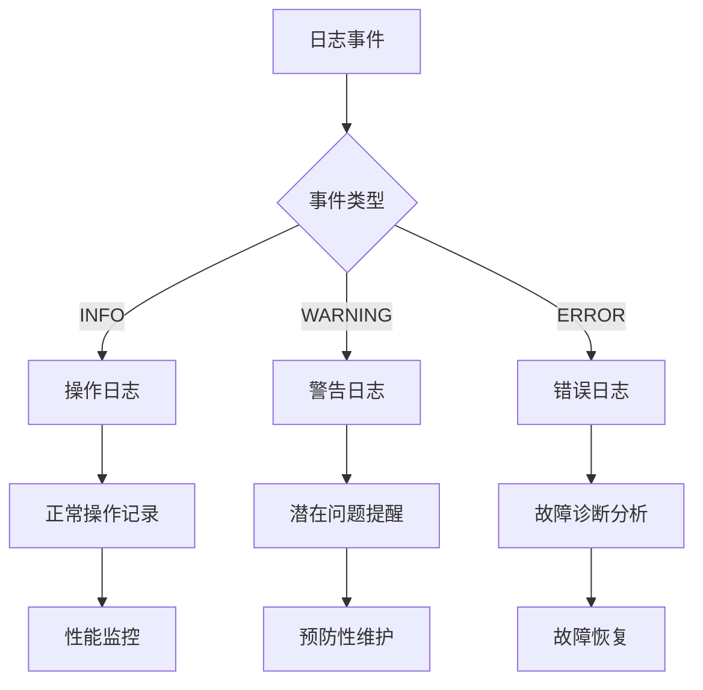

### 监控指标

| 指标类型 | 监控项 | 告警阈值 | 处理建议 |
|---------|-------|---------|---------|
| 性能指标 | API响应时间 | >2秒 | 检查网络和数据库 |
| 可用性指标 | 成功率 | <95% | 检查服务健康状态 |
| 资源指标 | 内存使用率 | >80% | 扩容或优化代码 |
| 业务指标 | 消息处理量 | 异常下降 | 检查Slack连接状态 |

**章节来源**
- [slack_manager.py](file://enterprise/integrations/slack/slack_manager.py#L341-L363)
- [rate_limit.py](file://enterprise/server/rate_limit.py#L50-L137)

## 结论

OpenHands的Slack集成API提供了一个功能完整、架构清晰的解决方案。通过分层设计、完善的错误处理和实时通信机制，系统能够可靠地处理各种Slack交互场景。

### 主要优势

1. **完整的认证流程**：支持OAuth2和Bot Token双重认证
2. **灵活的视图系统**：适应不同的用户交互场景
3. **实时回调处理**：及时响应代理状态变化
4. **强大的错误处理**：多层次的异常处理和恢复机制
5. **高效的限流策略**：确保API使用的稳定性

### 最佳实践建议

1. **定期检查Token有效性**：确保Bot Token不会过期
2. **监控API使用情况**：避免超出Slack的速率限制
3. **实现适当的重试机制**：提高消息传递的可靠性
4. **保持日志记录**：便于问题诊断和性能优化
5. **测试各种边界情况**：确保系统的鲁棒性

该Slack集成API为开发者提供了一个可靠的平台，可以轻松构建智能的Slack机器人应用，实现自动化的工作流程和智能的对话交互。