# 集成API

<cite>
**本文档中引用的文件**
- [enterprise/integrations/github/github_service.py](file://enterprise/integrations/github/github_service.py)
- [enterprise/integrations/gitlab/gitlab_service.py](file://enterprise/integrations/gitlab/gitlab_service.py)
- [enterprise/integrations/jira/jira_manager.py](file://enterprise/integrations/jira/jira_manager.py)
- [enterprise/integrations/slack/slack_manager.py](file://enterprise/integrations/slack/slack_manager.py)
- [enterprise/integrations/manager.py](file://enterprise/integrations/manager.py)
- [enterprise/integrations/types.py](file://enterprise/integrations/types.py)
- [enterprise/integrations/models.py](file://enterprise/integrations/models.py)
- [enterprise/integrations/utils.py](file://enterprise/integrations/utils.py)
- [enterprise/sync/install_gitlab_webhooks.py](file://enterprise/sync/install_gitlab_webhooks.py)
- [enterprise/server/conversation_callback_processor/github_callback_processor.py](file://enterprise/server/conversation_callback_processor/github_callback_processor.py)
- [enterprise/server/conversation_callback_processor/slack_callback_processor.py](file://enterprise/server/conversation_callback_processor/slack_callback_processor.py)
- [enterprise/server/conversation_callback_processor/jira_callback_processor.py](file://enterprise/server/conversation_callback_processor/jira_callback_processor.py)
- [enterprise/server/routes/integration/github.py](file://enterprise/server/routes/integration/github.py)
- [enterprise/server/routes/integration/gitlab.py](file://enterprise/server/routes/integration/gitlab.py)
- [enterprise/server/routes/integration/slack.py](file://enterprise/server/routes/integration/slack.py)
- [enterprise/server/routes/integration/jira.py](file://enterprise/server/routes/integration/jira.py)
</cite>

## 目录
1. [简介](#简介)
2. [系统架构概览](#系统架构概览)
3. [GitHub集成](#github集成)
4. [GitLab集成](#gitlab集成)
5. [Jira集成](#jira集成)
6. [Slack集成](#slack集成)
7. [Webhook配置与事件订阅](#webhook配置与事件订阅)
8. [双向同步机制](#双向同步机制)
9. [错误处理与速率限制](#错误处理与速率限制)
10. [数据一致性保证](#数据一致性保证)
11. [实际使用示例](#实际使用示例)
12. [故障排除指南](#故障排除指南)

## 简介

OpenHands集成API提供了与多个第三方服务（GitHub、GitLab、Jira、Slack）的深度集成能力。该系统支持实时事件订阅、双向数据同步、智能对话处理和自动化的任务管理。通过统一的架构设计，用户可以在不同的协作平台上无缝地使用OpenHands的功能。

### 核心特性

- **多平台支持**：同时集成GitHub、GitLab、Jira和Slack
- **实时事件处理**：基于Webhook的实时事件订阅和响应
- **双向数据同步**：在不同平台之间保持数据一致性
- **智能对话管理**：自动化的对话状态跟踪和总结
- **灵活的认证机制**：支持OAuth、Token等多种认证方式
- **强大的错误处理**：完善的错误恢复和重试机制

## 系统架构概览

集成系统采用模块化架构设计，核心组件包括管理器（Manager）、服务层（Service）、回调处理器（Callback Processor）和路由层（Router）。

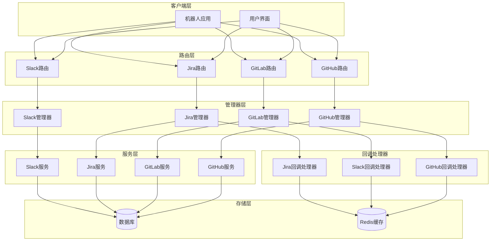

**图表来源**
- [enterprise/integrations/manager.py](file://enterprise/integrations/manager.py#L1-L31)
- [enterprise/server/routes/integration/github.py](file://enterprise/server/routes/integration/github.py#L1-L84)
- [enterprise/server/conversation_callback_processor/github_callback_processor.py](file://enterprise/server/conversation_callback_processor/github_callback_processor.py#L1-L144)

**章节来源**
- [enterprise/integrations/manager.py](file://enterprise/integrations/manager.py#L1-L31)
- [enterprise/integrations/types.py](file://enterprise/integrations/types.py#L1-L52)
- [enterprise/integrations/models.py](file://enterprise/integrations/models.py#L1-L53)

## GitHub集成

GitHub集成提供了全面的仓库管理和问题跟踪功能，支持Pull Request分析、代码审查和自动化工作流。

### 认证流程

GitHub集成支持多种认证方式：

1. **GitHub App认证**：使用GitHub App进行安装和授权
2. **个人访问令牌**：用户提供的个人访问令牌
3. **外部身份提供商**：通过Keycloak等身份提供商认证

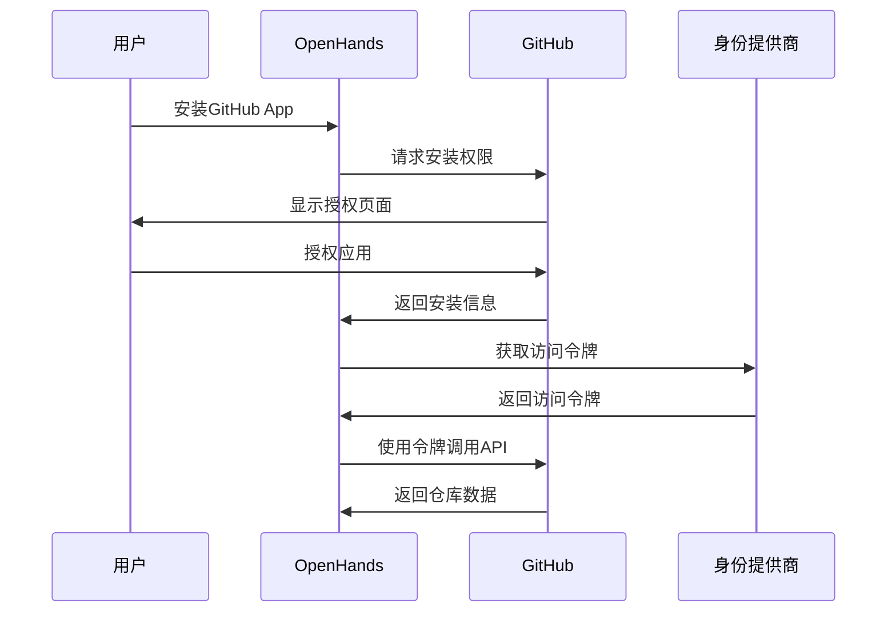

**图表来源**
- [enterprise/integrations/github/github_service.py](file://enterprise/integrations/github/github_service.py#L35-L73)
- [enterprise/server/routes/integration/github.py](file://enterprise/server/routes/integration/github.py#L26-L43)

### API端点

GitHub集成提供以下主要API端点：

| 端点 | 方法 | 描述 | 认证 |
|------|------|------|------|
| `/integration/github/events` | POST | 处理GitHub Webhook事件 | 签名验证 |
| `/api/github/repositories` | GET | 获取用户仓库列表 | OAuth令牌 |
| `/api/github/pull-requests` | GET | 获取Pull Request详情 | OAuth令牌 |
| `/api/github/issues` | GET | 获取问题列表 | OAuth令牌 |

### 数据同步机制

GitHub集成实现了以下数据同步功能：

1. **仓库信息同步**：自动获取用户的仓库列表和元数据
2. **PR状态跟踪**：实时跟踪Pull Request的状态变化
3. **问题更新通知**：监听问题的评论和状态变更
4. **分支信息同步**：同步分支结构和保护规则

**章节来源**
- [enterprise/integrations/github/github_service.py](file://enterprise/integrations/github/github_service.py#L1-L144)
- [enterprise/server/routes/integration/github.py](file://enterprise/server/routes/integration/github.py#L1-L84)

## GitLab集成

GitLab集成提供了企业级的DevOps功能，支持项目管理、CI/CD监控和团队协作。

### 认证流程

GitLab集成采用OAuth 2.0流程进行认证：

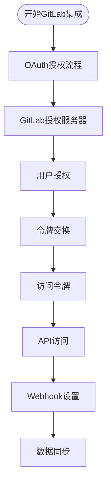

**图表来源**
- [enterprise/integrations/gitlab/gitlab_service.py](file://enterprise/integrations/gitlab/gitlab_service.py#L47-L81)
- [enterprise/server/routes/integration/gitlab.py](file://enterprise/server/routes/integration/gitlab.py#L21-L33)

### Webhook配置

GitLab集成支持多种类型的Webhook事件：

| 事件类型 | 触发条件 | 同步内容 |
|----------|----------|----------|
| `issues_events` | 问题创建/更新/删除 | 问题状态、评论、标签 |
| `merge_requests_events` | MR创建/更新/合并 | MR状态、代码变更、审查意见 |
| `note_events` | 评论创建/更新/删除 | 代码行注释、讨论回复 |
| `job_events` | CI/CD作业状态变更 | 构建状态、日志输出 |
| `pipeline_events` | 流水线状态变更 | 流水线状态、阶段信息 |

### 项目资源管理

GitLab集成支持以下资源类型：

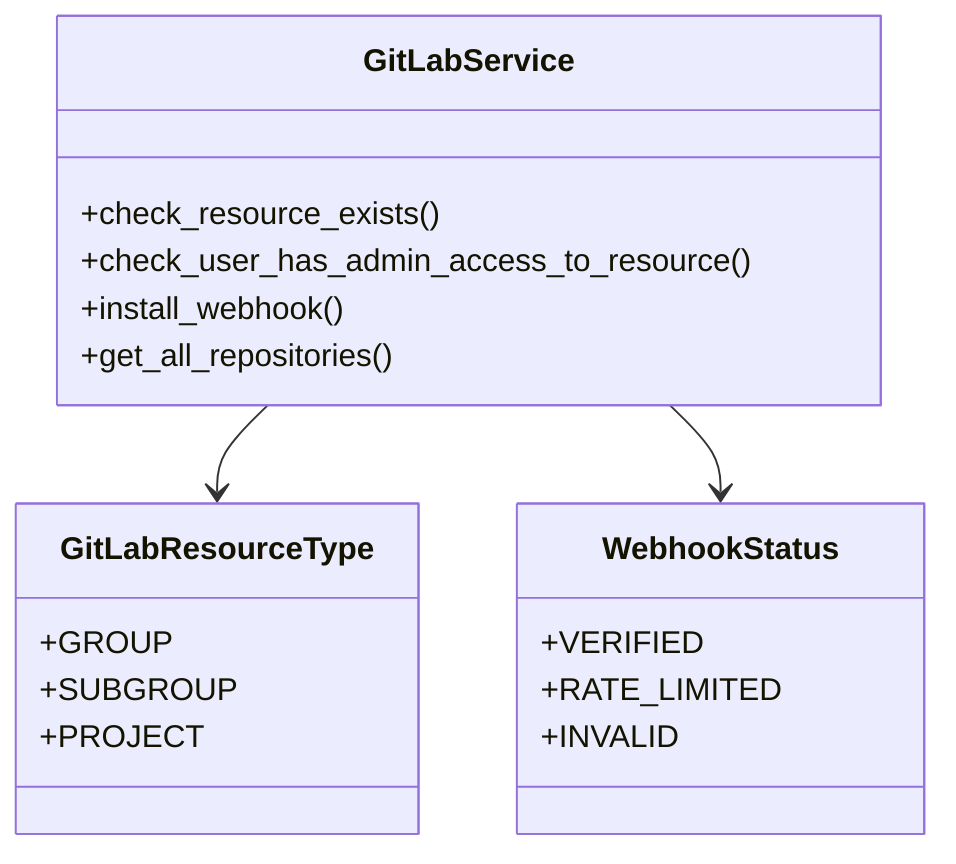

**图表来源**
- [enterprise/integrations/types.py](file://enterprise/integrations/types.py#L8-L12)
- [enterprise/integrations/gitlab/gitlab_service.py](file://enterprise/integrations/gitlab/gitlab_service.py#L270-L300)

**章节来源**
- [enterprise/integrations/gitlab/gitlab_service.py](file://enterprise/integrations/gitlab/gitlab_service.py#L1-L530)
- [enterprise/server/routes/integration/gitlab.py](file://enterprise/server/routes/integration/gitlab.py#L1-L86)

## Jira集成

Jira集成提供了与Atlassian Jira的深度集成，支持问题跟踪、敏捷看板和项目管理。

### 认证流程

Jira集成使用Atlassian OAuth 2.0流程：

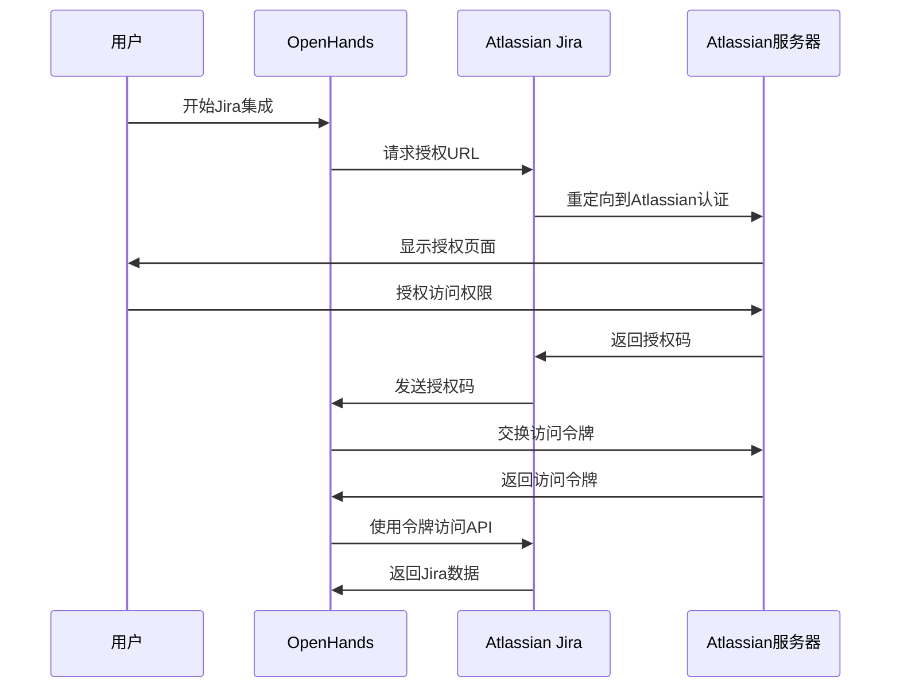

**图表来源**
- [enterprise/server/routes/integration/jira.py](file://enterprise/server/routes/integration/jira.py#L394-L432)

### 工作空间管理

Jira集成支持多工作空间管理：

| 操作 | 描述 | 权限要求 |
|------|------|----------|
| 创建工作空间 | 注册新的Jira云实例 | 管理员权限 |
| 链接用户 | 将用户账户关联到工作空间 | 工作空间管理员 |
| 更新配置 | 修改工作空间设置 | 工作空间管理员 |
| 取消链接 | 断开用户与工作空间的关联 | 用户本人或管理员 |

### 事件处理机制

Jira集成支持以下事件类型：

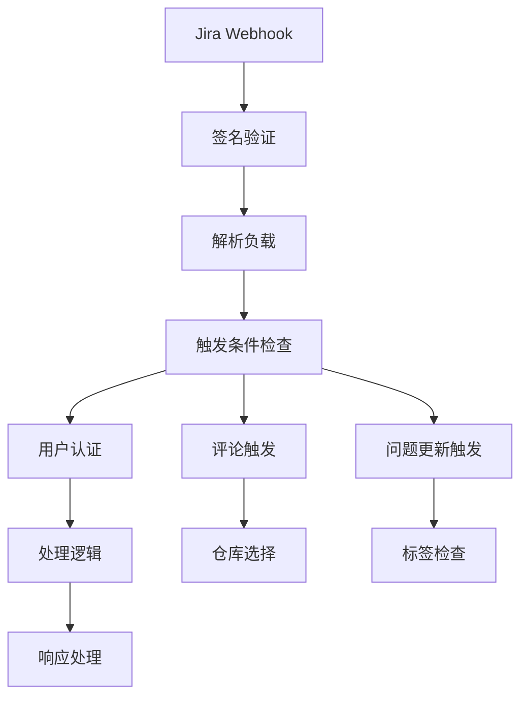

**图表来源**
- [enterprise/integrations/jira/jira_manager.py](file://enterprise/integrations/jira/jira_manager.py#L134-L180)

**章节来源**
- [enterprise/integrations/jira/jira_manager.py](file://enterprise/integrations/jira/jira_manager.py#L1-L505)
- [enterprise/server/routes/integration/jira.py](file://enterprise/server/routes/integration/jira.py#L1-L688)

## Slack集成

Slack集成提供了与Slack平台的深度集成，支持消息处理、频道管理和用户交互。

### 认证流程

Slack集成采用OAuth 2.0 + Keycloak的双重认证机制：

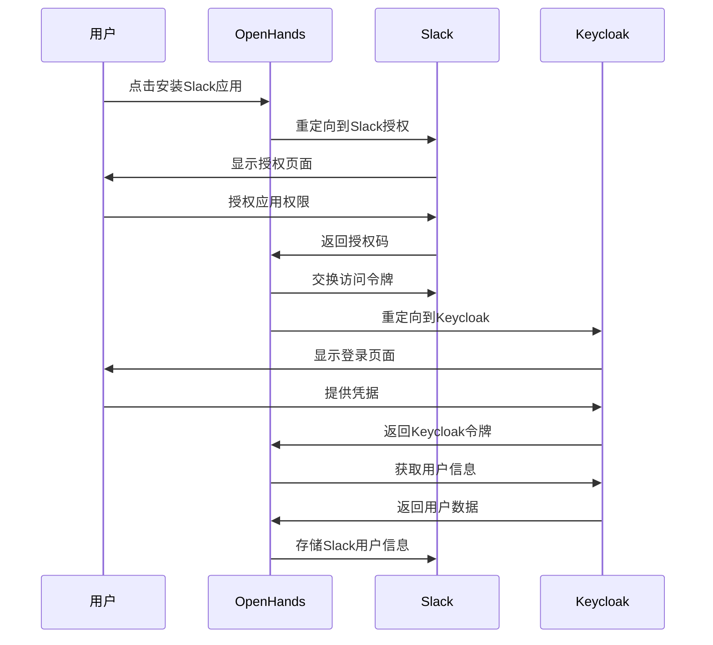

**图表来源**
- [enterprise/server/routes/integration/slack.py](file://enterprise/server/routes/integration/slack.py#L62-L120)

### 消息处理

Slack集成支持多种消息类型：

| 消息类型 | 触发条件 | 处理方式 |
|----------|----------|----------|
| 应用提及 | @openhands被提及 | 自动启动对话 |
| 私信 | 用户私信 | 响应用户请求 |
| 表单交互 | 仓库选择表单 | 处理用户选择 |
| 重复检测 | 相同消息多次发送 | 忽略重复消息 |

### 回调处理器

Slack集成使用专门的回调处理器来管理对话状态：

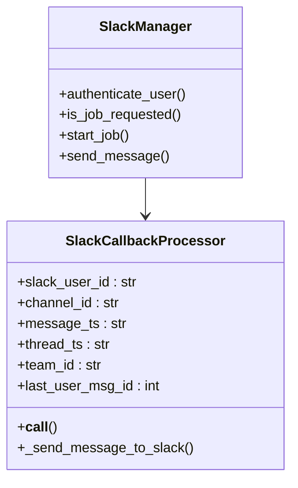

**图表来源**
- [enterprise/server/conversation_callback_processor/slack_callback_processor.py](file://enterprise/server/conversation_callback_processor/slack_callback_processor.py#L28-L183)

**章节来源**
- [enterprise/integrations/slack/slack_manager.py](file://enterprise/integrations/slack/slack_manager.py#L1-L364)
- [enterprise/server/routes/integration/slack.py](file://enterprise/server/routes/integration/slack.py#L1-L367)

## Webhook配置与事件订阅

所有集成都支持基于Webhook的事件订阅机制，确保实时响应平台事件。

### Webhook安全验证

每个平台都有独特的安全验证机制：

| 平台 | 验证方法 | 密钥类型 |
|------|----------|----------|
| GitHub | HMAC SHA256签名 | App Webhook密钥 |
| GitLab | 自定义头部验证 | 用户ID + UUID |
| Jira | HMAC SHA256签名 | 工作空间Webhook密钥 |
| Slack | 时间戳+签名验证 | 签名密钥 |

### 事件去重机制

为防止重复事件处理，系统实现了分布式去重：

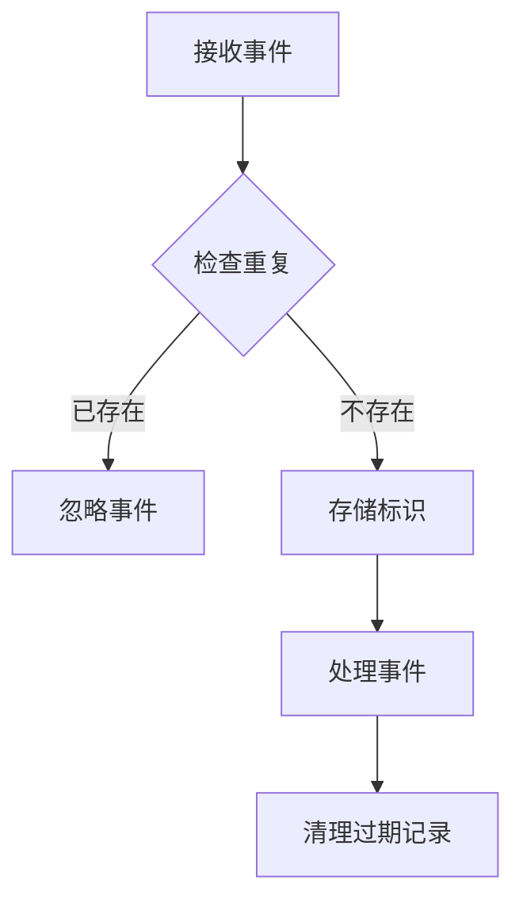

**图表来源**
- [enterprise/server/routes/integration/gitlab.py](file://enterprise/server/routes/integration/gitlab.py#L59-L62)
- [enterprise/server/routes/integration/slack.py](file://enterprise/server/routes/integration/slack.py#L274-L279)

**章节来源**
- [enterprise/sync/install_gitlab_webhooks.py](file://enterprise/sync/install_gitlab_webhooks.py#L1-L325)
- [enterprise/integrations/utils.py](file://enterprise/integrations/utils.py#L1-L558)

## 双向同步机制

集成系统实现了强大的双向同步机制，确保不同平台之间的数据一致性。

### 同步策略

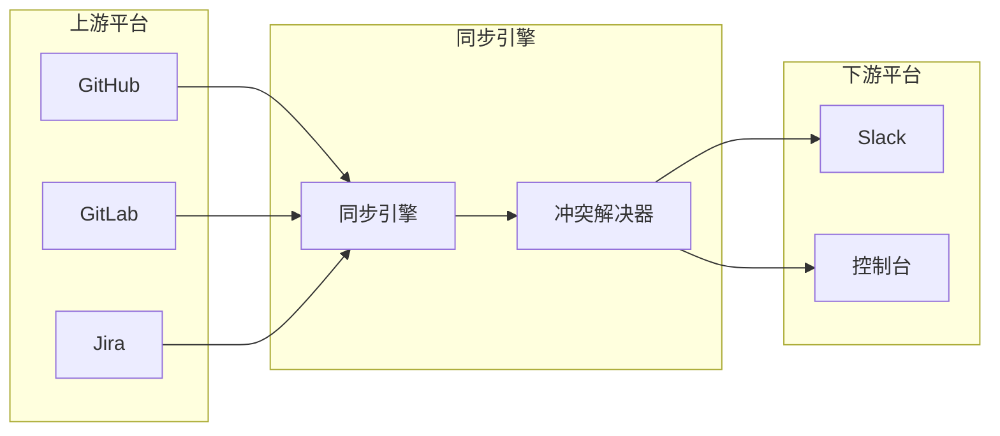

### 数据映射规则

| 源平台 | 目标平台 | 映射字段 | 同步方向 |
|--------|----------|----------|----------|
| GitHub PR | Slack消息 | 标题、描述、状态 | 单向（上到下） |
| GitLab Issue | Jira问题 | 标题、标签、优先级 | 双向 |
| Jira评论 | Slack频道 | 内容、作者、时间 | 双向 |
| Slack命令 | GitHub操作 | 命令、参数、上下文 | 单向（下到上） |

### 冲突解决

当出现数据冲突时，系统采用以下策略：

1. **时间戳优先**：较新的数据覆盖旧数据
2. **手动干预**：复杂冲突需要人工确认
3. **版本控制**：保留历史版本用于审计
4. **回滚机制**：支持快速回滚到稳定状态

**章节来源**
- [enterprise/server/conversation_callback_processor/github_callback_processor.py](file://enterprise/server/conversation_callback_processor/github_callback_processor.py#L1-L144)
- [enterprise/server/conversation_callback_processor/slack_callback_processor.py](file://enterprise/server/conversation_callback_processor/slack_callback_processor.py#L1-L183)
- [enterprise/server/conversation_callback_processor/jira_callback_processor.py](file://enterprise/server/conversation_callback_processor/jira_callback_processor.py#L1-L155)

## 错误处理与速率限制

集成系统实现了完善的错误处理和速率限制机制。

### 错误分类

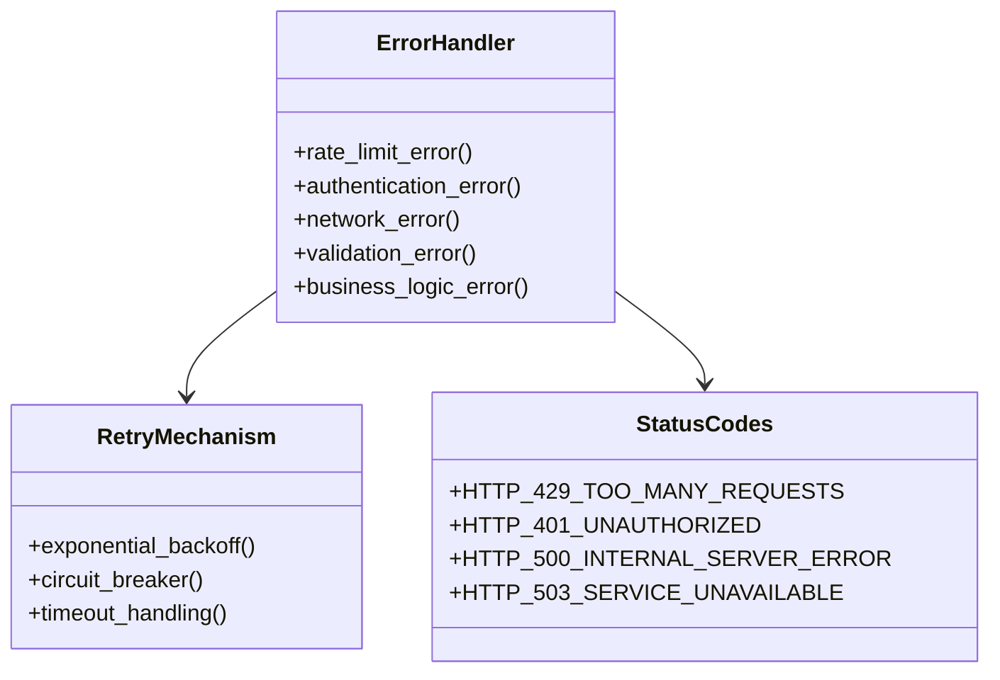

### 速率限制策略

| 平台 | 限制类型 | 限制值 | 重置周期 |
|------|----------|--------|----------|
| GitHub | API调用 | 5000次/小时 | 1小时 |
| GitLab | API调用 | 1000次/分钟 | 1分钟 |
| Jira | API调用 | 1000次/10秒 | 10秒 |
| Slack | 消息发送 | 1000次/日 | 24小时 |

### 错误恢复机制

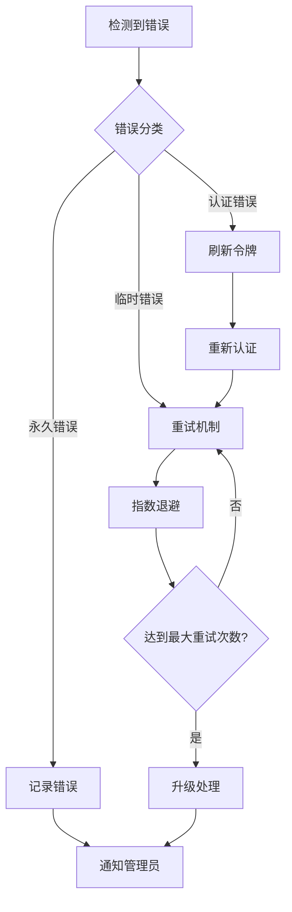

**章节来源**
- [enterprise/integrations/utils.py](file://enterprise/integrations/utils.py#L119-L130)

## 数据一致性保证

系统采用多种技术手段确保数据的一致性。

### 事务管理

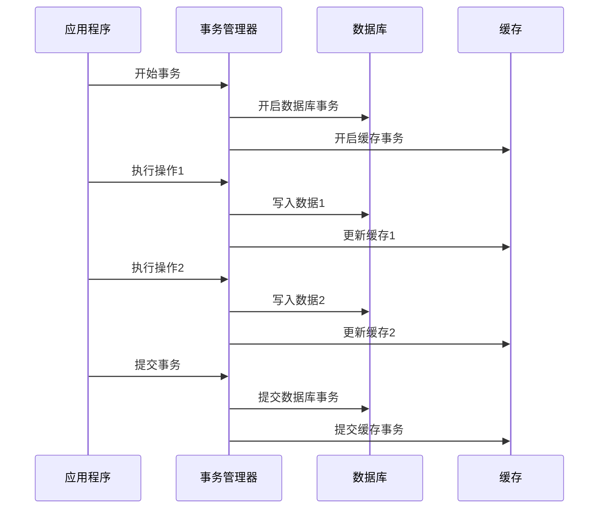

### 数据验证

系统在每个数据操作点执行验证：

1. **格式验证**：确保数据符合预期格式
2. **业务规则验证**：检查数据是否满足业务约束
3. **完整性验证**：确保数据关系的完整性
4. **权限验证**：检查用户是否有操作权限

### 监控与告警

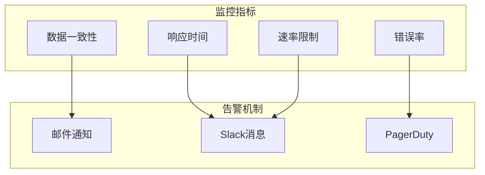

**章节来源**
- [enterprise/integrations/utils.py](file://enterprise/integrations/utils.py#L323-L366)

## 实际使用示例

以下是各平台集成的实际使用场景和配置示例。

### GitHub集成配置

```bash
# 设置GitHub App环境变量
export GITHUB_APP_ID=your_app_id
export GITHUB_APP_PRIVATE_KEY=path/to/private_key.pem
export GITHUB_APP_WEBHOOK_SECRET=your_webhook_secret

# 启用GitHub Webhooks
export GITHUB_WEBHOOKS_ENABLED=true
```

### GitLab集成配置

```bash
# 设置GitLab OAuth配置
export GITLAB_CLIENT_ID=your_client_id
export GITLAB_CLIENT_SECRET=your_client_secret
export GITLAB_REDIRECT_URI=https://your-domain.com/integration/gitlab/callback

# 配置Webhook
export GITLAB_WEBHOOK_SECRET=your_unique_secret
```

### Jira集成配置

```bash
# Atlassian OAuth配置
export JIRA_CLIENT_ID=your_client_id
export JIRA_CLIENT_SECRET=your_client_secret
export JIRA_REDIRECT_URI=https://your-domain.com/integration/jira/callback

# 启用Jira Webhooks
export JIRA_WEBHOOKS_ENABLED=true
```

### Slack集成配置

```bash
# Slack OAuth配置
export SLACK_CLIENT_ID=your_client_id
export SLACK_CLIENT_SECRET=your_client_secret
export SLACK_SIGNING_SECRET=your_signing_secret
export SLACK_WEBHOOKS_ENABLED=true
```

### API调用示例

#### GitHub API调用

```python
# 获取仓库列表
response = requests.get(
    f"https://api.github.com/user/repos",
    headers={"Authorization": f"token {access_token}"}
)

# 获取PR详情
response = requests.get(
    f"https://api.github.com/repos/{owner}/{repo}/pulls/{pr_number}",
    headers={"Authorization": f"token {access_token}"}
)
```

#### GitLab API调用

```python
# 获取项目列表
response = requests.get(
    f"https://gitlab.com/api/v4/projects",
    headers={"PRIVATE-TOKEN": access_token}
)

# 获取MR评论
response = requests.get(
    f"https://gitlab.com/api/v4/projects/{project_id}/merge_requests/{mr_iid}/notes",
    headers={"PRIVATE-TOKEN": access_token}
)
```

#### Jira API调用

```python
# 获取问题详情
response = requests.get(
    f"https://api.atlassian.com/ex/jira/{cloud_id}/rest/api/2/issue/{issue_key}",
    auth=(email, api_token)
)

# 添加评论
response = requests.post(
    f"https://api.atlassian.com/ex/jira/{cloud_id}/rest/api/2/issue/{issue_key}/comment",
    auth=(email, api_token),
    json={"body": "Comment content"}
)
```

#### Slack API调用

```python
# 发送消息
response = client.chat_postMessage(
    channel=channel_id,
    text="Hello from OpenHands!",
    thread_ts=thread_ts
)

# 发送表单
response = client.views_open(
    trigger_id=trigger_id,
    view={
        "type": "modal",
        "title": {"type": "plain_text", "text": "Select Repository"},
        "blocks": [...]
    }
)
```

**章节来源**
- [enterprise/server/routes/integration/github.py](file://enterprise/server/routes/integration/github.py#L45-L84)
- [enterprise/server/routes/integration/gitlab.py](file://enterprise/server/routes/integration/gitlab.py#L35-L86)
- [enterprise/server/routes/integration/jira.py](file://enterprise/server/routes/integration/jira.py#L215-L265)
- [enterprise/server/routes/integration/slack.py](file://enterprise/server/routes/integration/slack.py#L238-L298)

## 故障排除指南

本节提供了常见问题的诊断和解决方案。

### 常见问题及解决方案

#### 1. Webhook验证失败

**症状**：Webhook事件无法正常处理
**原因**：签名验证失败或密钥不匹配
**解决方案**：
- 检查Webhook密钥配置
- 验证签名算法正确性
- 确认请求头包含正确的签名信息

#### 2. 认证失败

**症状**：API调用返回401错误
**原因**：访问令牌过期或无效
**解决方案**：
- 刷新访问令牌
- 检查OAuth授权范围
- 验证用户权限

#### 3. 速率限制

**症状**：API调用频繁返回429错误
**原因**：超出平台的API调用限制
**解决方案**：
- 实现指数退避重试
- 优化API调用频率
- 使用批量操作减少调用次数

#### 4. 数据同步延迟

**症状**：平台间数据更新不及时
**原因**：Webhook处理延迟或网络问题
**解决方案**：
- 检查Webhook配置和可达性
- 监控网络连接质量
- 实现主动轮询作为备用方案

### 调试工具

#### 日志配置

```python
import logging

# 启用详细日志
logging.basicConfig(level=logging.DEBUG)

# 针对特定模块启用日志
logger = logging.getLogger("integrations.github")
logger.setLevel(logging.DEBUG)
```

#### 性能监控

```python
import time
from functools import wraps

def monitor_performance(func):
    @wraps(func)
    def wrapper(*args, **kwargs):
        start_time = time.time()
        result = func(*args, **kwargs)
        duration = time.time() - start_time
        logger.info(f"{func.__name__} took {duration:.2f}s")
        return result
    return wrapper
```

### 监控指标

| 指标类型 | 关键指标 | 告警阈值 |
|----------|----------|----------|
| 可用性 | 成功响应率 | < 99% |
| 性能 | 平均响应时间 | > 5秒 |
| 错误率 | 错误百分比 | > 1% |
| 吞吐量 | 每秒请求数 | 异常波动 |

### 支持资源

- **文档中心**：https://docs.all-hands.dev
- **GitHub Issues**：报告bug和功能请求
- **Slack社区**：获取技术支持和交流
- **API参考**：完整的API文档和示例

**章节来源**
- [enterprise/integrations/utils.py](file://enterprise/integrations/utils.py#L119-L130)
- [enterprise/server/routes/integration/github.py](file://enterprise/server/routes/integration/github.py#L82-L84)