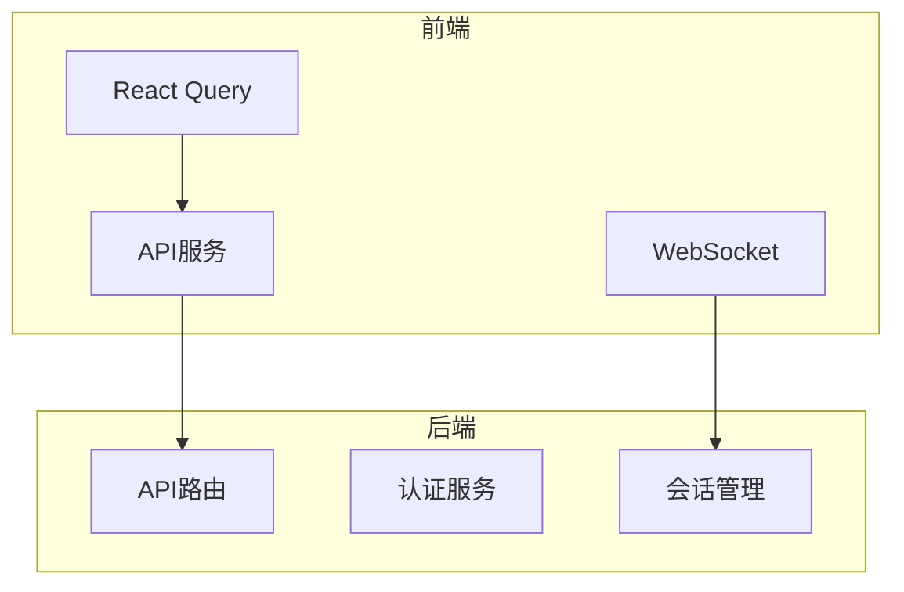
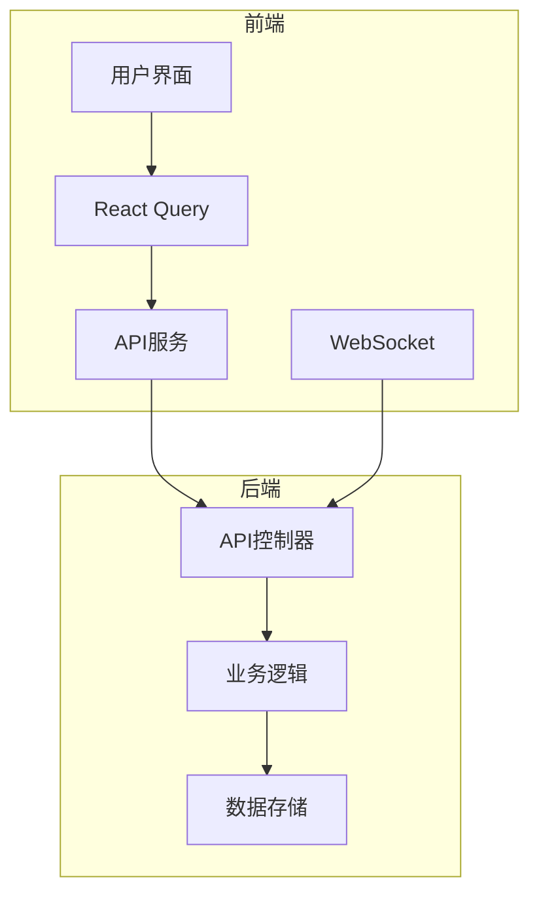
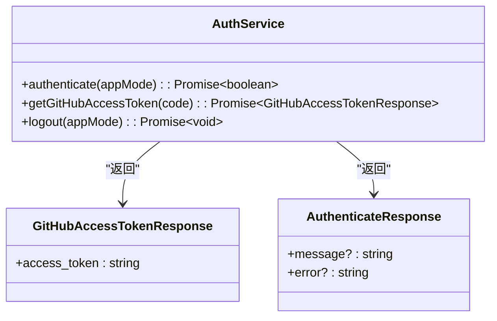
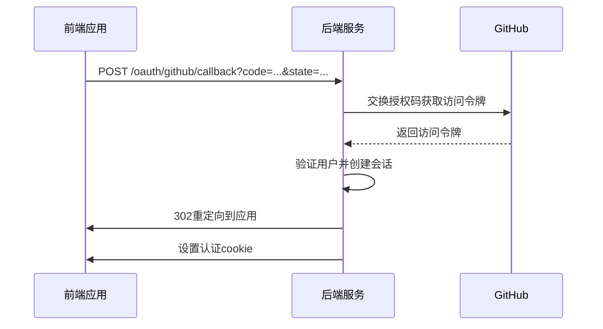
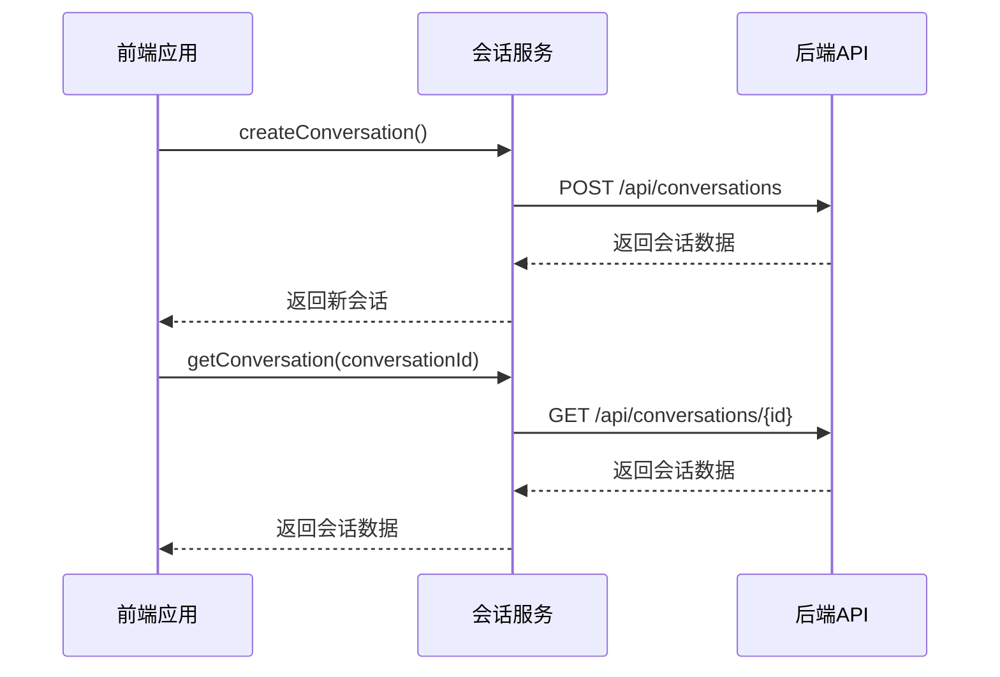
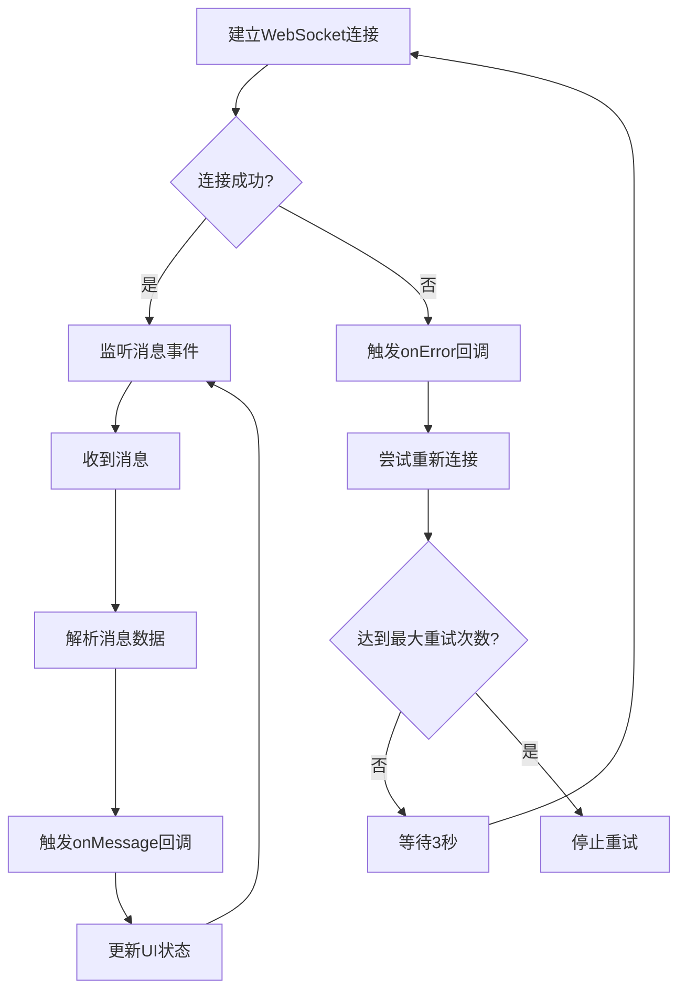
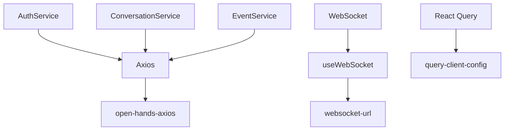

# API集成

<cite>
**本文档引用的文件**
- [auth-service.api.ts](file://frontend/src/api/auth-service/auth-service.api.ts)
- [conversation-service.api.ts](file://frontend/src/api/conversation-service/conversation-service.api.ts)
- [event-service.api.ts](file://frontend/src/api/event-service/event-service.api.ts)
- [open-hands-axios.ts](file://frontend/src/api/open-hands-axios.ts)
- [query-client-config.ts](file://frontend/src/query-client-config.ts)
- [use-websocket.ts](file://frontend/src/hooks/use-websocket.ts)
- [websocket-url.ts](file://frontend/src/utils/websocket-url.ts)
- [auth.py](file://enterprise/server/routes/auth.py)
</cite>

## 目录
1. [简介](#简介)
2. [项目结构](#项目结构)
3. [核心组件](#核心组件)
4. [架构概述](#架构概述)
5. [详细组件分析](#详细组件分析)
6. [依赖分析](#依赖分析)
7. [性能考虑](#性能考虑)
8. [故障排除指南](#故障排除指南)
9. [结论](#结论)

## 简介
本文档详细描述了OpenHands平台的API集成机制，重点关注前端与后端服务之间的通信。文档涵盖了REST API客户端封装、WebSocket实时通信、查询缓存(RTK Query)和突变操作的实现。分析了auth-service、conversation-service、event-service等API模块的设计模式和错误处理策略。提供了API请求/响应的序列图和性能监控方案，包括认证流程、请求重试机制和数据序列化的具体实现细节。

## 项目结构
OpenHands项目的API集成主要分布在前端和企业级服务器的特定目录中。前端API服务位于`frontend/src/api/`目录下，包括认证、会话和事件处理服务。后端API路由在`enterprise/server/routes/`目录中定义，处理各种HTTP请求。WebSocket通信通过`frontend/src/hooks/use-websocket.ts`实现，而API客户端配置在`frontend/src/api/open-hands-axios.ts`中管理。

**图表来源**
- [auth-service.api.ts](file://frontend/src/api/auth-service/auth-service.api.ts)
- [conversation-service.api.ts](file://frontend/src/api/conversation-service/conversation-service.api.ts)
- [auth.py](file://enterprise/server/routes/auth.py)

**章节来源**
- [auth-service.api.ts](file://frontend/src/api/auth-service/auth-service.api.ts)
- [conversation-service.api.ts](file://frontend/src/api/conversation-service/conversation-service.api.ts)
- [auth.py](file://enterprise/server/routes/auth.py)

## 核心组件
核心API组件包括认证服务(auth-service)、会话服务(conversation-service)和事件服务(event-service)。这些服务通过REST API和WebSocket协议与后端通信，使用Axios作为HTTP客户端，并通过React Query管理状态和缓存。认证服务处理用户登录和令牌管理，会话服务管理对话生命周期，事件服务处理实时事件通信。

**章节来源**
- [auth-service.api.ts](file://frontend/src/api/auth-service/auth-service.api.ts)
- [conversation-service.api.ts](file://frontend/src/api/conversation-service/conversation-service.api.ts)
- [event-service.api.ts](file://frontend/src/api/event-service/event-service.api.ts)

## 架构概述
系统采用前后端分离架构，前端通过REST API和WebSocket与后端通信。REST API用于常规的CRUD操作，而WebSocket用于实时事件推送。React Query用于管理API响应的缓存，实现自动数据同步和请求去重。错误处理通过全局拦截器实现，确保一致的错误响应处理。

**图表来源**
- [open-hands-axios.ts](file://frontend/src/api/open-hands-axios.ts)
- [query-client-config.ts](file://frontend/src/query-client-config.ts)
- [use-websocket.ts](file://frontend/src/hooks/use-websocket.ts)

## 详细组件分析

### 认证服务分析
认证服务负责处理用户身份验证和会话管理。它通过GitHub OAuth流程获取访问令牌，并将认证状态存储在安全的HTTP-only cookie中。

#### 认证服务类图

**图表来源**
- [auth-service.api.ts](file://frontend/src/api/auth-service/auth-service.api.ts)
- [auth.types.ts](file://frontend/src/api/auth-service/auth.types.ts)

#### 认证流程序列图

**图表来源**
- [auth.py](file://enterprise/server/routes/auth.py)
- [auth-service.api.ts](file://frontend/src/api/auth-service/auth-service.api.ts)

### 会话服务分析
会话服务管理对话的创建、更新和删除操作，以及相关的数据查询。

#### 会话服务API调用序列图

**图表来源**
- [conversation-service.api.ts](file://frontend/src/api/conversation-service/conversation-service.api.ts)

### 事件服务分析
事件服务处理实时事件通信，特别是通过WebSocket进行的双向通信。

#### WebSocket通信流程图

**图表来源**
- [use-websocket.ts](file://frontend/src/hooks/use-websocket.ts)
- [websocket-url.ts](file://frontend/src/utils/websocket-url.ts)

## 依赖分析
API集成组件之间存在明确的依赖关系。前端API服务依赖于Axios进行HTTP通信，依赖React Query进行状态管理，依赖WebSocket API进行实时通信。后端路由处理程序依赖于认证管理器、令牌管理器和数据库存储等服务组件。

**图表来源**
- [open-hands-axios.ts](file://frontend/src/api/open-hands-axios.ts)
- [use-websocket.ts](file://frontend/src/hooks/use-websocket.ts)
- [query-client-config.ts](file://frontend/src/query-client-config.ts)

## 性能考虑
API集成设计考虑了多项性能优化策略。React Query的缓存机制减少了重复的网络请求，自动去重和后台同步确保了数据的一致性。WebSocket连接的智能重连机制在保持连接可靠性的同时避免了过于频繁的重试。HTTP请求使用适当的超时设置，并通过拦截器统一处理错误。

## 故障排除指南
常见的API集成问题包括认证失败、WebSocket连接中断和缓存数据不一致。对于认证问题，检查cookie设置和令牌有效期。对于WebSocket问题，验证连接URL和网络配置。对于缓存问题，使用React Query的devtools检查缓存状态，并在必要时手动使缓存失效。

**章节来源**
- [open-hands-axios.ts](file://frontend/src/api/open-hands-axios.ts)
- [query-client-config.ts](file://frontend/src/query-client-config.ts)
- [use-websocket.ts](file://frontend/src/hooks/use-websocket.ts)

## 结论
OpenHands的API集成设计采用了现代前端架构的最佳实践，结合了REST API和WebSocket的优势。通过React Query的状态管理、Axios的HTTP客户端和健壮的错误处理机制，实现了高效、可靠的前后端通信。认证流程安全且用户友好，实时通信通过WebSocket高效实现。整体架构具有良好的可扩展性和维护性。