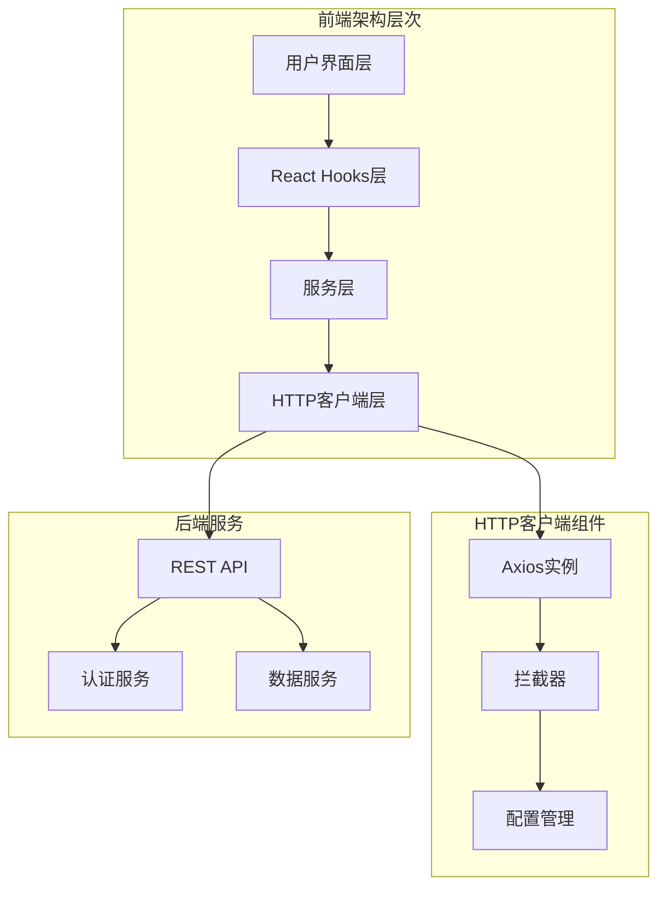
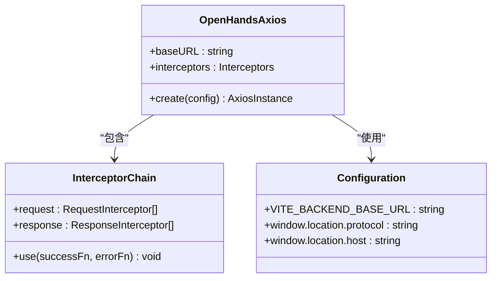
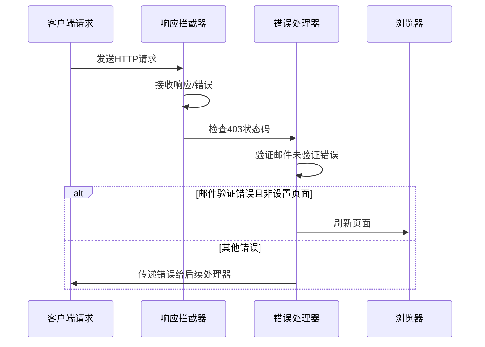
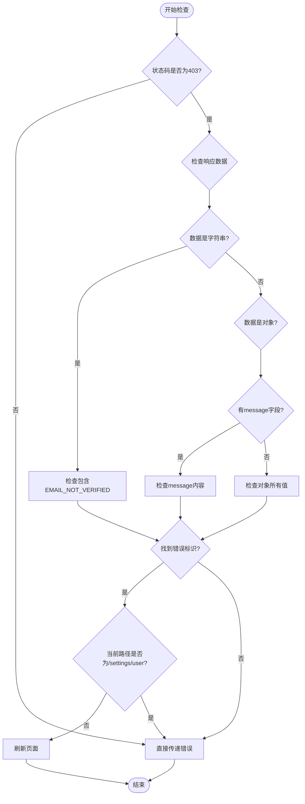
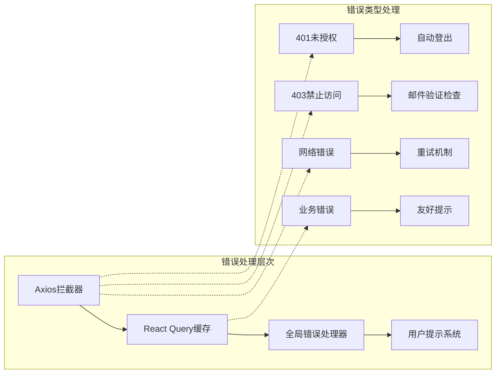
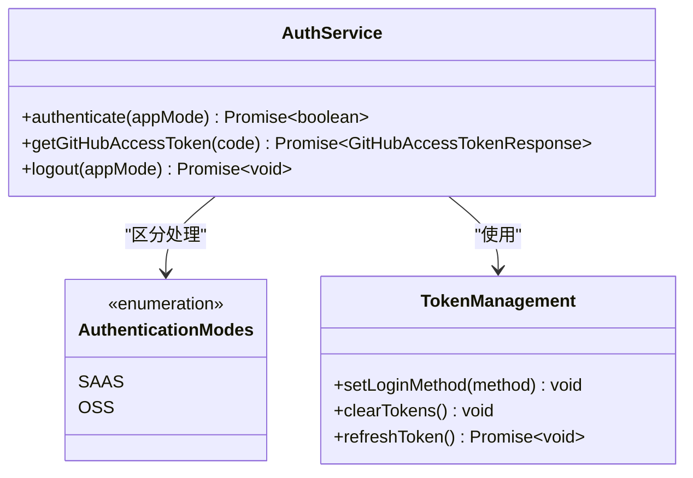
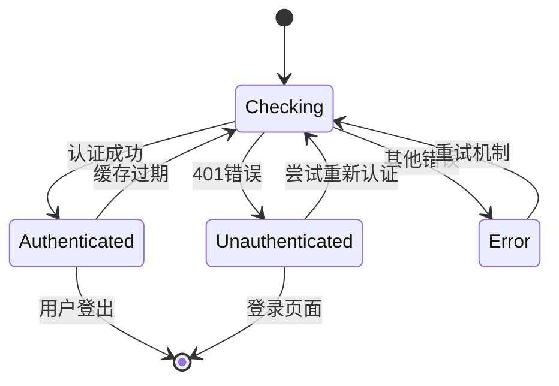
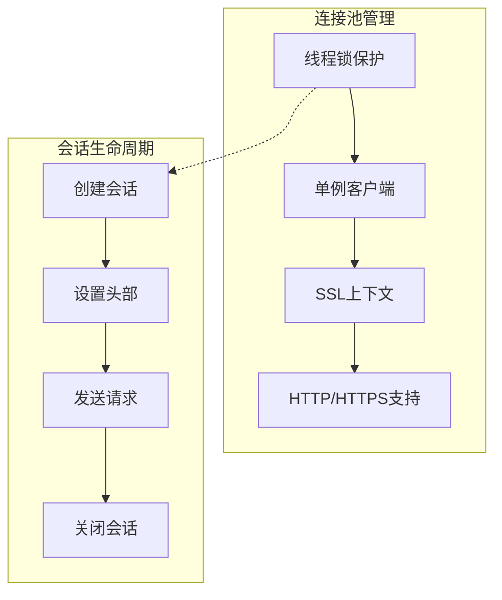
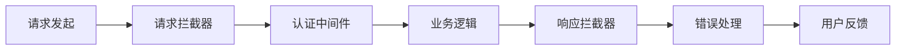
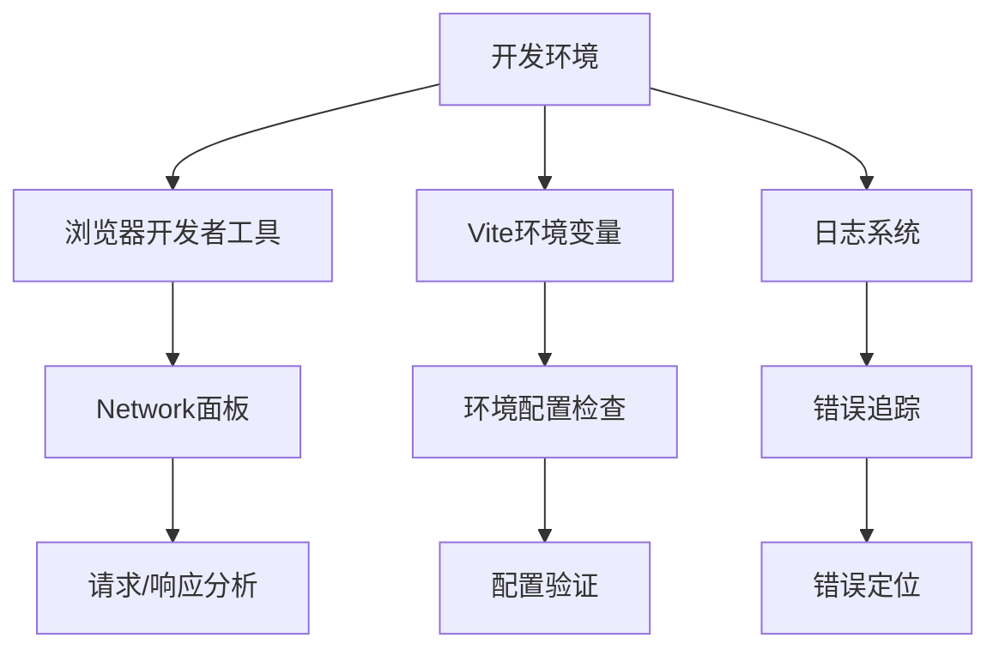

# Axios配置与拦截器

<cite>
**本文档中引用的文件**
- [open-hands-axios.ts](file://frontend/src/api/open-hands-axios.ts)
- [query-client-config.ts](file://frontend/src/query-client-config.ts)
- [auth-service.api.ts](file://frontend/src/api/auth-service/auth-service.api.ts)
- [use-is-authed.ts](file://frontend/src/hooks/query/use-is-authed.ts)
- [use-auth-callback.ts](file://frontend/src/hooks/use-auth-callback.ts)
- [retrieve-axios-error-message.ts](file://frontend/src/utils/retrieve-axios-error-message.ts)
- [type-guards.ts](file://frontend/src/utils/type-guards.ts)
- [http_session.py](file://openhands/utils/http_session.py)
- [request.py](file://openhands/runtime/utils/request.py)
- [vite.config.ts](file://frontend/vite.config.ts)
</cite>

## 目录
1. [简介](#简介)
2. [项目架构概览](#项目架构概览)
3. [核心配置分析](#核心配置分析)
4. [拦截器实现详解](#拦截器实现详解)
5. [错误处理机制](#错误处理机制)
6. [认证与授权](#认证与授权)
7. [性能优化考虑](#性能优化考虑)
8. [扩展点与自定义配置](#扩展点与自定义配置)
9. [故障排除指南](#故障排除指南)
10. [总结](#总结)

## 简介

OpenHands项目采用现代化的前端架构，使用Axios作为主要的HTTP客户端库来处理所有API通信。本文档深入分析了项目中Axios的配置策略、拦截器实现以及错误处理机制，为开发者提供了全面的技术参考。

该项目的HTTP客户端设计遵循了最佳实践，实现了统一的请求预处理、响应处理和错误管理机制，确保了应用程序的稳定性和可维护性。

## 项目架构概览

OpenHands的前端架构采用了分层设计模式，HTTP客户端位于数据访问层，为上层业务逻辑提供可靠的API通信能力。

**图表来源**
- [open-hands-axios.ts](file://frontend/src/api/open-hands-axios.ts#L1-L61)
- [query-client-config.ts](file://frontend/src/query-client-config.ts#L1-L48)

**章节来源**
- [open-hands-axios.ts](file://frontend/src/api/open-hands-axios.ts#L1-L61)
- [query-client-config.ts](file://frontend/src/query-client-config.ts#L1-L48)

## 核心配置分析

### 基础Axios实例配置

项目中的Axios实例通过工厂函数创建，支持动态的基础URL配置和环境变量集成。

**图表来源**
- [open-hands-axios.ts](file://frontend/src/api/open-hands-axios.ts#L3-L5)
- [vite.config.ts](file://frontend/vite.config.ts#L11-L25)

### 环境变量配置

系统通过Vite的环境变量加载机制，支持灵活的部署配置：

| 配置项 | 描述 | 默认值 | 用途 |
|--------|------|--------|------|
| `VITE_BACKEND_BASE_URL` | 后端主机名（无协议） | `localhost:3000` | WebSocket连接基础 |
| `VITE_BACKEND_HOST` | 后端主机地址 | `127.0.0.1:3000` | API请求目标 |
| `VITE_USE_TLS` | 是否使用HTTPS | `false` | 安全连接控制 |
| `VITE_INSECURE_SKIP_VERIFY` | 跳过TLS验证 | `false` | 开发环境调试 |

**章节来源**
- [open-hands-axios.ts](file://frontend/src/api/open-hands-axios.ts#L3-L5)
- [vite.config.ts](file://frontend/vite.config.ts#L11-L25)

## 拦截器实现详解

### 响应拦截器架构

项目实现了专门的响应拦截器来处理特定的业务场景，特别是邮件验证错误的特殊处理。

**图表来源**
- [open-hands-axios.ts](file://frontend/src/api/open-hands-axios.ts#L44-L59)

### 邮件验证错误检测机制

拦截器实现了智能的邮件验证错误检测，支持多种数据格式：

**图表来源**
- [open-hands-axios.ts](file://frontend/src/api/open-hands-axios.ts#L8-L41)

**章节来源**
- [open-hands-axios.ts](file://frontend/src/api/open-hands-axios.ts#L44-L60)

## 错误处理机制

### 多层错误处理架构

项目采用了多层次的错误处理策略，结合Axios拦截器和React Query缓存机制。

**图表来源**
- [query-client-config.ts](file://frontend/src/query-client-config.ts#L8-L12)
- [query-client-config.ts](file://frontend/src/query-client-config.ts#L16-L47)

### 错误消息提取机制

系统提供了统一的错误消息提取功能，支持多种错误格式：

| 错误格式 | 提取字段 | 处理方式 |
|----------|----------|----------|
| `{error: "message"}` | `error`字段 | 直接使用 |
| `{message: "message"}` | `message`字段 | 直接使用 |
| 其他格式 | `error.message` | 使用默认消息 |

**章节来源**
- [query-client-config.ts](file://frontend/src/query-client-config.ts#L1-L48)
- [retrieve-axios-error-message.ts](file://frontend/src/utils/retrieve-axios-error-message.ts#L1-L26)
- [type-guards.ts](file://frontend/src/utils/type-guards.ts#L1-L17)

## 认证与授权

### 认证服务架构

项目实现了完整的认证服务，支持SaaS和OSS两种部署模式：

**图表来源**
- [auth-service.api.ts](file://frontend/src/api/auth-service/auth-service.api.ts#L8-L51)
- [use-is-authed.ts](file://frontend/src/hooks/query/use-is-authed.ts#L14-L30)

### 认证状态管理

系统通过React Query实现了智能的认证状态缓存：

**图表来源**
- [use-is-authed.ts](file://frontend/src/hooks/query/use-is-authed.ts#L13-L30)

**章节来源**
- [auth-service.api.ts](file://frontend/src/api/auth-service/auth-service.api.ts#L1-L52)
- [use-is-authed.ts](file://frontend/src/hooks/query/use-is-authed.ts#L1-L41)
- [use-auth-callback.ts](file://frontend/src/hooks/use-auth-callback.ts#L1-L47)

## 性能优化考虑

### 请求缓存策略

系统实现了智能的请求缓存机制，减少不必要的网络请求：

| 缓存参数 | 值 | 说明 |
|----------|-----|------|
| `staleTime` | 5分钟 | 数据陈旧时间 |
| `gcTime` | 15分钟 | 垃圾回收时间 |
| `retry` | false | 禁用自动重试 |
| `enabled` | 条件性 | 基于应用模式启用 |

### 连接池管理

后端Python部分实现了HTTP连接池管理，提高并发性能：

**图表来源**
- [http_session.py](file://openhands/utils/http_session.py#L34-L87)

**章节来源**
- [use-is-authed.ts](file://frontend/src/hooks/query/use-is-authed.ts#L32-L36)
- [http_session.py](file://openhands/utils/http_session.py#L1-L87)

## 扩展点与自定义配置

### 自定义拦截器扩展

开发者可以通过以下方式扩展拦截器功能：

1. **请求预处理扩展**：添加自定义请求头、签名验证等
2. **响应后处理扩展**：实现特定的业务逻辑处理
3. **错误恢复机制**：添加自动重试、降级处理等功能

### 配置选项表

| 配置项 | 类型 | 默认值 | 扩展说明 |
|--------|------|--------|----------|
| `baseURL` | string | 动态生成 | 支持环境变量覆盖 |
| `timeout` | number | 无限制 | 可配置请求超时 |
| `headers` | object | {} | 支持全局头部设置 |
| `withCredentials` | boolean | false | 控制凭据发送 |

### 中间件集成点

系统提供了多个中间件集成点：

**章节来源**
- [open-hands-axios.ts](file://frontend/src/api/open-hands-axios.ts#L3-L5)
- [http_session.py](file://openhands/utils/http_session.py#L40-L87)

## 故障排除指南

### 常见问题诊断

#### 1. 认证失败问题

**症状**：401未授权错误频繁出现
**解决方案**：
- 检查认证服务配置
- 验证Token有效性
- 确认缓存策略设置

#### 2. 邮件验证错误

**症状**：收到邮件未验证错误但实际已验证
**解决方案**：
- 检查错误检测逻辑
- 验证响应数据格式
- 确认路径判断准确性

#### 3. 网络连接问题

**症状**：请求超时或连接失败
**解决方案**：
- 检查基础URL配置
- 验证网络连通性
- 确认防火墙设置

### 调试工具

系统提供了多种调试工具：

**章节来源**
- [open-hands-axios.ts](file://frontend/src/api/open-hands-axios.ts#L8-L41)
- [query-client-config.ts](file://frontend/src/query-client-config.ts#L16-L47)

## 总结

OpenHands项目的Axios配置与拦截器实现展现了现代Web应用的最佳实践。通过统一的配置管理、智能的错误处理和完善的认证机制，系统确保了良好的用户体验和系统的稳定性。

### 关键特性

1. **模块化设计**：清晰的职责分离和可扩展的架构
2. **智能错误处理**：多层错误处理和用户友好的错误提示
3. **认证安全**：支持多种部署模式和安全的认证流程
4. **性能优化**：智能缓存和连接池管理
5. **开发友好**：丰富的调试工具和扩展点

### 最佳实践

- 使用环境变量进行配置管理
- 实现多层次的错误处理机制
- 采用智能的缓存策略
- 提供完善的调试和监控能力
- 保持代码的可测试性和可维护性

这套HTTP客户端配置方案为OpenHands项目提供了坚实的数据访问层基础，支撑了整个应用的稳定运行和持续发展。