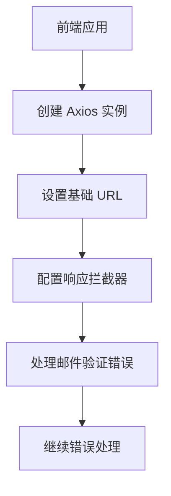
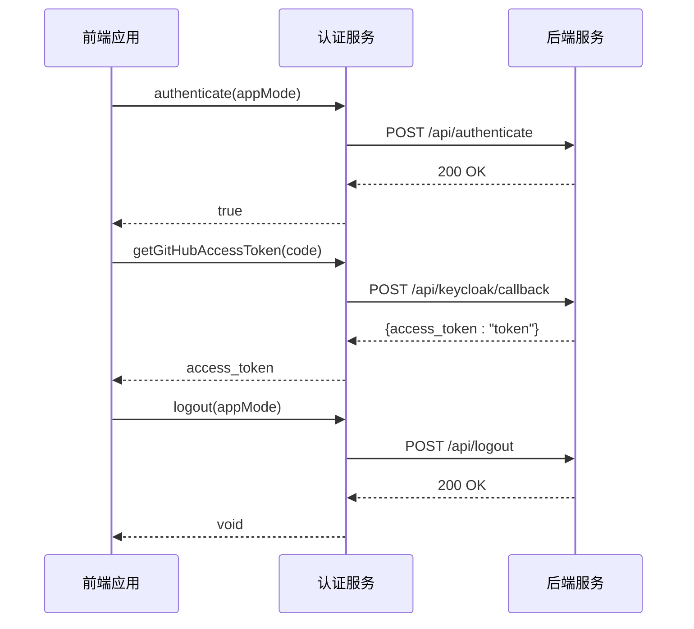
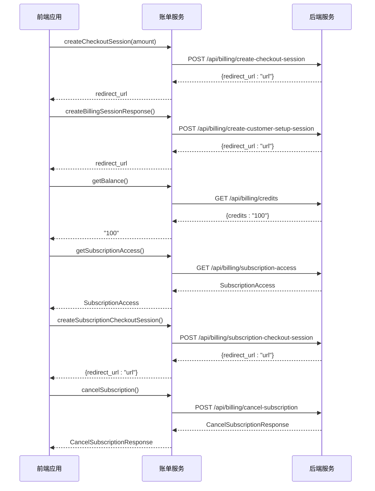
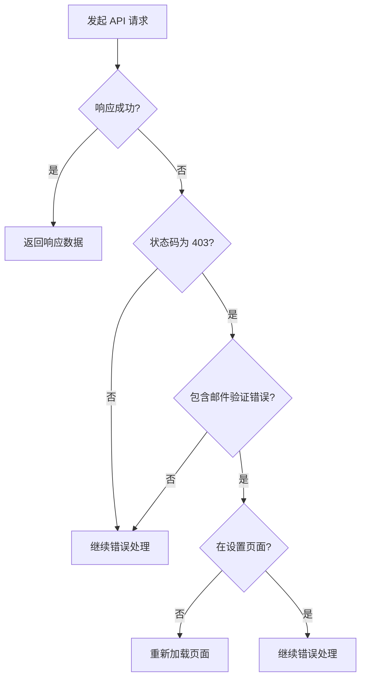
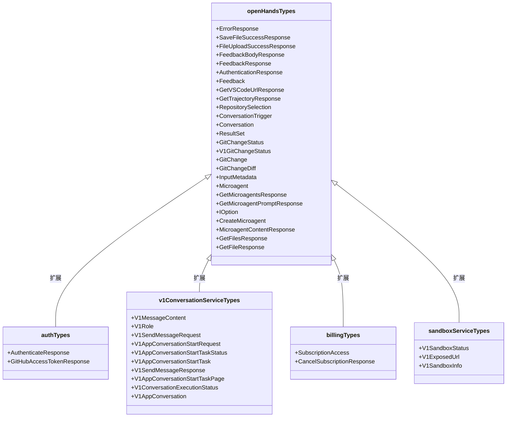
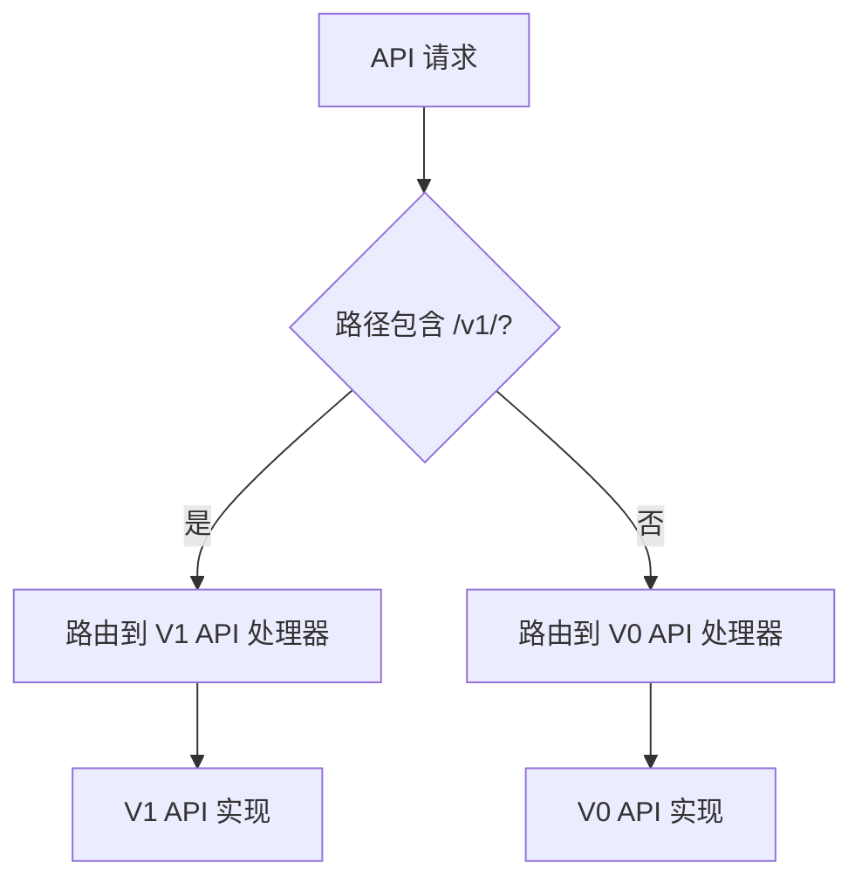
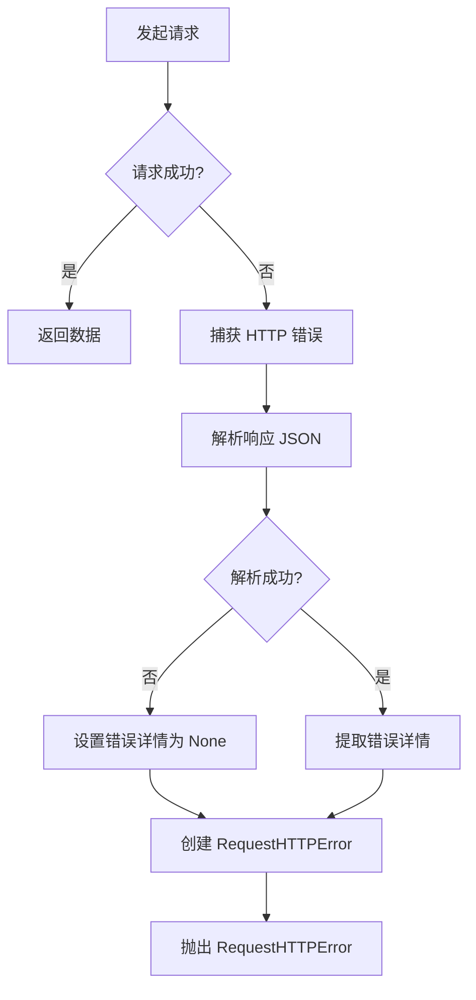
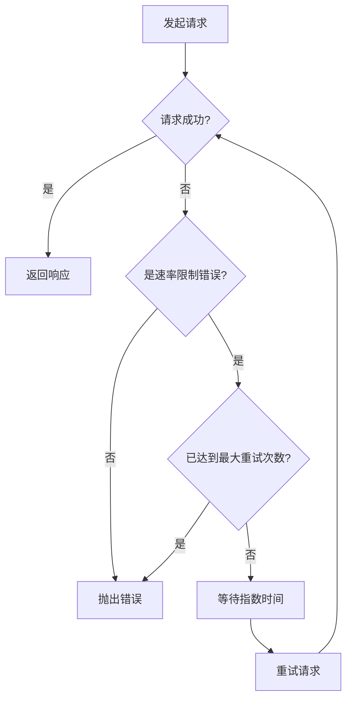

# REST API 集成

<cite>
**本文档中引用的文件**  
- [open-hands-axios.ts](file://frontend/src/api/open-hands-axios.ts)
- [auth-service.api.ts](file://frontend/src/api/auth-service/auth-service.api.ts)
- [v1-conversation-service.api.ts](file://frontend/src/api/conversation-service/v1-conversation-service.api.ts)
- [billing-service.api.ts](file://frontend/src/api/billing-service/billing-service.api.ts)
- [sandbox-service.api.ts](file://frontend/src/api/sandbox-service/sandbox-service.api.ts)
- [auth.types.ts](file://frontend/src/api/auth-service/auth.types.ts)
- [v1-conversation-service.types.ts](file://frontend/src/api/conversation-service/v1-conversation-service.types.ts)
- [billing.types.ts](file://frontend/src/api/billing-service/billing.types.ts)
- [sandbox-service.types.ts](file://frontend/src/api/sandbox-service/sandbox-service.types.ts)
- [open-hands.types.ts](file://frontend/src/api/open-hands.types.ts)
- [request.py](file://openhands/runtime/utils/request.py)
</cite>

## 目录
1. [简介](#简介)
2. [API 客户端配置](#api-客户端配置)
3. [认证服务 API](#认证服务-api)
4. [会话管理 API](#会话管理-api)
5. [代码仓库操作 API](#代码仓库操作-api)
6. [账单处理 API](#账单处理-api)
7. [沙箱控制 API](#沙箱控制-api)
8. [Axios 封装与拦截器](#axios-封装与拦截器)
9. [API 类型定义与类型安全](#api-类型定义与类型安全)
10. [API 版本控制策略](#api-版本控制策略)
11. [错误处理机制](#错误处理机制)
12. [重试机制实现](#重试机制实现)
13. [请求头配置与认证令牌传递](#请求头配置与认证令牌传递)
14. [数据序列化策略](#数据序列化策略)

## 简介
OpenHands 项目提供了一套完整的 REST API 接口，用于前端与后端服务的通信。该 API 集成文档详细描述了前端如何通过 Axios 封装与后端服务进行交互，涵盖了认证服务、会话管理、代码仓库操作、账单处理和沙箱控制等核心功能。文档重点分析了 `open-hands-axios.ts` 中的拦截器、错误处理和重试机制实现，并提供了各服务 API 的调用示例。同时，文档还深入探讨了 API 类型定义的设计原则和类型安全保证，以及 API 版本控制策略和向后兼容性处理方案。

## API 客户端配置
API 客户端通过 Axios 创建，配置了基础 URL 和拦截器。基础 URL 根据环境变量或窗口位置动态生成，确保在不同部署环境中都能正确指向后端服务。



**Diagram sources**
- [open-hands-axios.ts](file://frontend/src/api/open-hands-axios.ts#L1-L61)

**Section sources**
- [open-hands-axios.ts](file://frontend/src/api/open-hands-axios.ts#L1-L61)

## 认证服务 API
认证服务 API 负责处理用户的身份验证和会话管理。它提供了登录、登出和获取 GitHub 访问令牌等核心功能。

### 认证端点
| 端点 | HTTP 方法 | 描述 | 请求参数 | 响应类型 |
|------|---------|------|---------|---------|
| `/api/authenticate` | POST | 验证用户身份 | 无 | `AuthenticateResponse` |
| `/api/keycloak/callback` | POST | 获取 GitHub 访问令牌 | `code` (GitHub 提供的授权码) | `GitHubAccessTokenResponse` |
| `/api/logout` | POST | 用户登出 | 无 | void |

### 认证服务实现


**Diagram sources**
- [auth-service.api.ts](file://frontend/src/api/auth-service/auth-service.api.ts#L1-L53)
- [auth.types.ts](file://frontend/src/api/auth-service/auth.types.ts#L1-L9)

**Section sources**
- [auth-service.api.ts](file://frontend/src/api/auth-service/auth-service.api.ts#L1-L53)
- [auth.types.ts](file://frontend/src/api/auth-service/auth.types.ts#L1-L9)

## 会话管理 API
会话管理 API 负责创建、启动、停止和查询会话。它支持 V0 和 V1 两个版本的会话，提供了丰富的会话状态和操作功能。

### 会话管理端点
| 端点 | HTTP 方法 | 描述 | 请求参数 | 响应类型 |
|------|---------|------|---------|---------|
| `/api/conversations/{id}/start` | POST | 启动会话 | conversationId | `Conversation` |
| `/api/conversations/{id}/stop` | POST | 停止会话 | conversationId | `Conversation` |
| `/api/conversations/{id}/trajectory` | GET | 获取会话轨迹 | conversationId | `GetTrajectoryResponse` |
| `/api/conversations/{id}/microagents` | GET | 获取会话的微代理 | conversationId | `GetMicroagentsResponse` |

### 会话管理实现
```mermaid
classDiagram
class ConversationService {
+getCurrentConversation() Conversation
+setCurrentConversation(conversation) void
+getConversationUrl(conversationId) string
+getConversationHeaders() AxiosHeaders
+submitFeedback(conversationId, feedback) FeedbackResponse
+submitConversationFeedback(conversationId, rating, eventId, reason) {status, message}
+checkFeedbackExists(conversationId, eventId) {exists, rating, reason}
+getBatchFeedback(conversationId) Record<string, BatchFeedbackData>
+getWebHosts(conversationId) string[]
+getVSCodeUrl(conversationId) GetVSCodeUrlResponse
+getRuntimeId(conversationId) {runtime_id}
+getUserConversations(limit, pageId) ResultSet<Conversation>
+getConversation(conversationId) Conversation
+createConversation(title, repository, branch, provider) Conversation
+deleteConversation(conversationId) void
}
class V1ConversationService {
+buildRuntimeUrl(conversationUrl, path) string
+sendMessage(conversationId, message) V1SendMessageResponse
+createConversation(selectedRepository, git_provider, initialUserMsg, selected_branch, conversationInstructions, trigger) V1AppConversationStartTask
+getStartTask(taskId) V1AppConversationStartTask
+searchStartTasks(limit) V1AppConversationStartTask[]
+getVSCodeUrl(conversationId, conversationUrl, sessionApiKey) GetVSCodeUrlResponse
+pauseConversation(conversationId, conversationUrl, sessionApiKey) {success}
+resumeConversation(conversationId, conversationUrl, sessionApiKey) {success}
+batchGetAppConversations(ids) (V1AppConversation | null)[]
+uploadFile(conversationUrl, sessionApiKey, file, path) void
+getConversationConfig(conversationId) {runtime_id}
}
ConversationService <|-- V1ConversationService : 继承
```

**Diagram sources**
- [conversation-service.api.ts](file://frontend/src/api/conversation-service/conversation-service.api.ts#L1-L398)
- [v1-conversation-service.api.ts](file://frontend/src/api/conversation-service/v1-conversation-service.api.ts#L1-L294)
- [v1-conversation-service.types.ts](file://frontend/src/api/conversation-service/v1-conversation-service.types.ts#L1-L95)

**Section sources**
- [conversation-service.api.ts](file://frontend/src/api/conversation-service/conversation-service.api.ts#L1-L398)
- [v1-conversation-service.api.ts](file://frontend/src/api/conversation-service/v1-conversation-service.api.ts#L1-L294)
- [v1-conversation-service.types.ts](file://frontend/src/api/conversation-service/v1-conversation-service.types.ts#L1-L95)

## 代码仓库操作 API
代码仓库操作 API 提供了与代码仓库交互的功能，包括获取仓库列表、创建仓库和管理仓库设置。

### 代码仓库操作端点
| 端点 | HTTP 方法 | 描述 | 请求参数 | 响应类型 |
|------|---------|------|---------|---------|
| `/api/git/repositories` | GET | 获取用户仓库列表 | 无 | `GitRepository[]` |
| `/api/git/repositories` | POST | 创建新仓库 | repositoryData | `GitRepository` |
| `/api/git/repositories/{id}` | PUT | 更新仓库设置 | repositoryId, settings | `GitRepository` |
| `/api/git/repositories/{id}` | DELETE | 删除仓库 | repositoryId | void |

## 账单处理 API
账单处理 API 负责管理用户的订阅和支付信息，提供了创建支付会话、获取余额和管理订阅等功能。

### 账单处理端点
| 端点 | HTTP 方法 | 描述 | 请求参数 | 响应类型 |
|------|---------|------|---------|---------|
| `/api/billing/create-checkout-session` | POST | 创建支付会话 | amount | string (重定向 URL) |
| `/api/billing/create-customer-setup-session` | POST | 创建客户设置会话 | 无 | string (重定向 URL) |
| `/api/billing/credits` | GET | 获取用户余额 | 无 | `{credits: string}` |
| `/api/billing/subscription-access` | GET | 获取订阅信息 | 无 | `SubscriptionAccess` |
| `/api/billing/subscription-checkout-session` | POST | 创建订阅会话 | 无 | `{redirect_url?: string}` |
| `/api/billing/cancel-subscription` | POST | 取消订阅 | 无 | `CancelSubscriptionResponse` |

### 账单处理实现


**Diagram sources**
- [billing-service.api.ts](file://frontend/src/api/billing-service/billing-service.api.ts#L1-L85)
- [billing.types.ts](file://frontend/src/api/billing-service/billing.types.ts#L1-L13)

**Section sources**
- [billing-service.api.ts](file://frontend/src/api/billing-service/billing-service.api.ts#L1-L85)
- [billing.types.ts](file://frontend/src/api/billing-service/billing.types.ts#L1-L13)

## 沙箱控制 API
沙箱控制 API 负责管理 V1 沙箱的生命周期，包括暂停、恢复和批量获取沙箱信息。

### 沙箱控制端点
| 端点 | HTTP 方法 | 描述 | 请求参数 | 响应类型 |
|------|---------|------|---------|---------|
| `/api/v1/sandboxes/{id}/pause` | POST | 暂停沙箱 | sandboxId | `{success: boolean}` |
| `/api/v1/sandboxes/{id}/resume` | POST | 恢复沙箱 | sandboxId | `{success: boolean}` |
| `/api/v1/sandboxes` | GET | 批量获取沙箱信息 | ids | `(V1SandboxInfo | null)[]` |

### 沙箱控制实现
```mermaid
classDiagram
class SandboxService {
+pauseSandbox(sandboxId) {success : boolean}
+resumeSandbox(sandboxId) {success : boolean}
+batchGetSandboxes(ids) (V1SandboxInfo | null)[]
}
class V1SandboxInfo {
+id : string
+created_by_user_id : string | null
+sandbox_spec_id : string
+status : V1SandboxStatus
+session_api_key : string | null
+exposed_urls : V1ExposedUrl[] | null
+created_at : string
}
class V1ExposedUrl {
+name : string
+url : string
}
SandboxService --> V1SandboxInfo : 使用
V1SandboxInfo --> V1ExposedUrl : 包含
```

**Diagram sources**
- [sandbox-service.api.ts](file://frontend/src/api/sandbox-service/sandbox-service.api.ts#L1-L53)
- [sandbox-service.types.ts](file://frontend/src/api/sandbox-service/sandbox-service.types.ts#L1-L25)

**Section sources**
- [sandbox-service.api.ts](file://frontend/src/api/sandbox-service/sandbox-service.api.ts#L1-L53)
- [sandbox-service.types.ts](file://frontend/src/api/sandbox-service/sandbox-service.types.ts#L1-L25)

## Axios 封装与拦截器
`open-hands-axios.ts` 文件封装了 Axios 实例，配置了全局的响应拦截器，用于处理特定的错误情况。

### 拦截器实现
```typescript
// Set up the global interceptor
openHands.interceptors.response.use(
  (response: AxiosResponse) => response,
  (error: AxiosError) => {
    // Check if it's a 403 error with the email verification message
    if (
      error.response?.status === 403 &&
      checkForEmailVerificationError(error.response?.data)
    ) {
      if (window.location.pathname !== "/settings/user") {
        window.location.reload();
      }
    }

    // Continue with the error for other error handlers
    return Promise.reject(error);
  },
);
```

### 拦截器工作流程


**Diagram sources**
- [open-hands-axios.ts](file://frontend/src/api/open-hands-axios.ts#L43-L60)

**Section sources**
- [open-hands-axios.ts](file://frontend/src/api/open-hands-axios.ts#L1-L61)

## API 类型定义与类型安全
API 类型定义位于各个服务的 `.types.ts` 文件中，使用 TypeScript 接口定义了请求和响应的数据结构，确保了类型安全。

### 类型定义示例
```typescript
// auth.types.ts
export interface AuthenticateResponse {
  message?: string;
  error?: string;
}

export interface GitHubAccessTokenResponse {
  access_token: string;
}

// v1-conversation-service.types.ts
export interface V1AppConversation {
  id: string;
  created_by_user_id: string | null;
  sandbox_id: string;
  selected_repository: string | null;
  selected_branch: string | null;
  git_provider: Provider | null;
  title: string | null;
  trigger: ConversationTrigger | null;
  pr_number: number[];
  llm_model: string | null;
  metrics: unknown | null;
  created_at: string;
  updated_at: string;
  sandbox_status: V1SandboxStatus;
  execution_status: V1ConversationExecutionStatus | null;
  conversation_url: string | null;
  session_api_key: string | null;
}

// billing.types.ts
export type SubscriptionAccess = {
  start_at: string;
  end_at: string;
  created_at: string;
  cancelled_at?: string | null;
  stripe_subscription_id?: string | null;
};

export interface CancelSubscriptionResponse {
  status: string;
  message: string;
}

// sandbox-service.types.ts
export type V1SandboxStatus =
  | "MISSING"
  | "STARTING"
  | "RUNNING"
  | "STOPPED"
  | "PAUSED";

export interface V1SandboxInfo {
  id: string;
  created_by_user_id: string | null;
  sandbox_spec_id: string;
  status: V1SandboxStatus;
  session_api_key: string | null;
  exposed_urls: V1ExposedUrl[] | null;
  created_at: string;
}
```

### 类型安全保证


**Diagram sources**
- [open-hands.types.ts](file://frontend/src/api/open-hands.types.ts#L1-L148)
- [auth.types.ts](file://frontend/src/api/auth-service/auth.types.ts#L1-L9)
- [v1-conversation-service.types.ts](file://frontend/src/api/conversation-service/v1-conversation-service.types.ts#L1-L95)
- [billing.types.ts](file://frontend/src/api/billing-service/billing.types.ts#L1-L13)
- [sandbox-service.types.ts](file://frontend/src/api/sandbox-service/sandbox-service.types.ts#L1-L25)

**Section sources**
- [open-hands.types.ts](file://frontend/src/api/open-hands.types.ts#L1-L148)
- [auth.types.ts](file://frontend/src/api/auth-service/auth.types.ts#L1-L9)
- [v1-conversation-service.types.ts](file://frontend/src/api/conversation-service/v1-conversation-service.types.ts#L1-L95)
- [billing.types.ts](file://frontend/src/api/billing-service/billing.types.ts#L1-L13)
- [sandbox-service.types.ts](file://frontend/src/api/sandbox-service/sandbox-service.types.ts#L1-L25)

## API 版本控制策略
OpenHands 项目采用了清晰的 API 版本控制策略，通过 URL 路径中的版本号来区分不同版本的 API。

### 版本控制实现
- **V0 API**: 基础路径为 `/api/`，例如 `/api/conversations/{id}/start`
- **V1 API**: 基础路径为 `/api/v1/`，例如 `/api/v1/app-conversations`

这种版本控制策略允许系统同时支持多个 API 版本，确保向后兼容性，同时为新功能的开发提供灵活性。



**Diagram sources**
- [v1-conversation-service.api.ts](file://frontend/src/api/conversation-service/v1-conversation-service.api.ts#L1-L294)
- [conversation-service.api.ts](file://frontend/src/api/conversation-service/conversation-service.api.ts#L1-L398)

**Section sources**
- [v1-conversation-service.api.ts](file://frontend/src/api/conversation-service/v1-conversation-service.api.ts#L1-L294)
- [conversation-service.api.ts](file://frontend/src/api/conversation-service/conversation-service.api.ts#L1-L398)

## 错误处理机制
系统实现了全面的错误处理机制，包括客户端和服务端的错误处理。

### 客户端错误处理
客户端通过 Axios 拦截器处理响应错误，特别是针对邮件验证错误的特殊处理。

```typescript
// Helper function to check if a response contains an email verification error
const checkForEmailVerificationError = (data: any): boolean => {
  const EMAIL_NOT_VERIFIED = "EmailNotVerifiedError";

  if (typeof data === "string") {
    return data.includes(EMAIL_NOT_VERIFIED);
  }

  if (typeof data === "object" && data !== null) {
    if ("message" in data) {
      const { message } = data;
      if (typeof message === "string") {
        return message.includes(EMAIL_NOT_VERIFIED);
      }
      if (Array.isArray(message)) {
        return message.some(
          (msg) => typeof msg === "string" && msg.includes(EMAIL_NOT_VERIFIED),
        );
      }
    }

    // Search any values in object in case message key is different
    return Object.values(data).some(
      (value) =>
        (typeof value === "string" && value.includes(EMAIL_NOT_VERIFIED)) ||
        (Array.isArray(value) &&
          value.some(
            (v) => typeof v === "string" && v.includes(EMAIL_NOT_VERIFIED),
          )),
    );
  }

  return false;
};
```

### 服务端错误处理
服务端使用自定义的 `RequestHTTPError` 异常类来处理 HTTP 请求错误，提供了详细的错误信息。

```python
class RequestHTTPError(httpx.HTTPStatusError):
    """Exception raised when an error occurs in a request with details."""

    def __init__(self, *args: Any, detail: Any = None, **kwargs: Any) -> None:
        super().__init__(*args, **kwargs)
        self.detail = detail

    def __str__(self) -> str:
        s = super().__str__()
        if self.detail is not None:
            s += f'\nDetails: {self.detail}'
        return str(s)
```

### 错误处理流程


**Diagram sources**
- [open-hands-axios.ts](file://frontend/src/api/open-hands-axios.ts#L7-L41)
- [request.py](file://openhands/runtime/utils/request.py#L11-L22)

**Section sources**
- [open-hands-axios.ts](file://frontend/src/api/open-hands-axios.ts#L1-L61)
- [request.py](file://openhands/runtime/utils/request.py#L1-L60)

## 重试机制实现
系统实现了智能的重试机制，主要针对速率限制错误（429 状态码）进行自动重试。

### 重试机制实现
```python
def is_retryable_error(exception: Any) -> bool:
    return (
        isinstance(exception, httpx.HTTPStatusError)
        and exception.response.status_code == 429
    )

@retry(
    retry=retry_if_exception(is_retryable_error),
    stop=stop_after_attempt(3) | stop_if_should_exit(),
    wait=wait_exponential(multiplier=1, min=4, max=60),
)
def send_request(
    session: HttpSession,
    method: str,
    url: str,
    timeout: int = 60,
    **kwargs: Any,
) -> httpx.Response:
    response = session.request(method, url, timeout=timeout, **kwargs)
    try:
        response.raise_for_status()
    except httpx.HTTPError as e:
        try:
            _json = response.json()
        except json.decoder.JSONDecodeError:
            _json = None
        finally:
            response.close()
        raise RequestHTTPError(
            e,
            request=e.request,
            response=e.response,
            detail=_json.get('detail') if _json is not None else None,
        ) from e
    return response
```

### 重试机制工作流程


**Diagram sources**
- [request.py](file://openhands/runtime/utils/request.py#L25-L60)

**Section sources**
- [request.py](file://openhands/runtime/utils/request.py#L1-L60)

## 请求头配置与认证令牌传递
系统使用自定义的请求头 `X-Session-API-Key` 来传递会话认证令牌，确保 API 调用的安全性。

### 请求头配置实现
```typescript
/**
 * Build headers for V1 API requests that require session authentication
 * @param sessionApiKey Session API key for authentication
 * @returns Headers object with X-Session-API-Key if provided
 */
export const buildSessionHeaders = (
  sessionApiKey?: string | null,
): Record<string, string> => {
  const headers: Record<string, string> = {};
  if (sessionApiKey) {
    headers["X-Session-API-Key"] = sessionApiKey;
  }
  return headers;
};
```

### 认证令牌传递示例
```typescript
static async getVSCodeUrl(
  _conversationId: string,
  conversationUrl: string | null | undefined,
  sessionApiKey?: string | null,
): Promise<GetVSCodeUrlResponse> {
  const url = this.buildRuntimeUrl(conversationUrl, "/api/vscode/url");
  const headers = buildSessionHeaders(sessionApiKey);

  // V1 API returns {url: '...'} instead of {vscode_url: '...'}
  // Map it to match the expected interface
  const { data } = await axios.get<{ url: string | null }>(url, { headers });
  return {
    vscode_url: data.url,
  };
}
```

**Section sources**
- [utils.ts](file://frontend/src/utils/utils.ts#L600-L612)
- [v1-conversation-service.api.ts](file://frontend/src/api/conversation-service/v1-conversation-service.api.ts#L143-L157)

## 数据序列化策略
系统采用了 JSON 作为主要的数据序列化格式，确保了数据的可读性和跨平台兼容性。

### 数据序列化实现
- **请求数据**: 使用 JSON.stringify() 将 JavaScript 对象序列化为 JSON 字符串
- **响应数据**: Axios 自动将 JSON 响应反序列化为 JavaScript 对象
- **文件上传**: 使用 FormData 对象处理文件上传，支持 multipart/form-data 格式

### 文件上传示例
```typescript
static async uploadFile(
  conversationUrl: string | null | undefined,
  sessionApiKey: string | null | undefined,
  file: File,
  path?: string,
): Promise<void> {
  // Default to /workspace/{filename} if no path provided (must be absolute)
  const uploadPath = path || `/workspace/${file.name}`;
  const encodedPath = encodeURIComponent(uploadPath);
  const url = this.buildRuntimeUrl(
    conversationUrl,
    `/api/file/upload/${encodedPath}`,
  );
  const headers = buildSessionHeaders(sessionApiKey);

  // Create FormData with the file
  const formData = new FormData();
  formData.append("file", file);

  // Upload file
  await axios.post(url, formData, {
    headers: {
      ...headers,
      "Content-Type": "multipart/form-data",
    },
  });
}
```

**Section sources**
- [v1-conversation-service.api.ts](file://frontend/src/api/conversation-service/v1-conversation-service.api.ts#L251-L277)