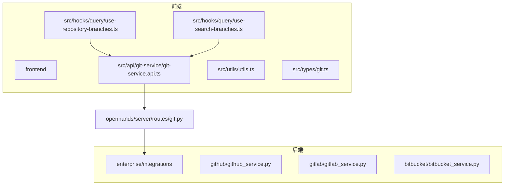
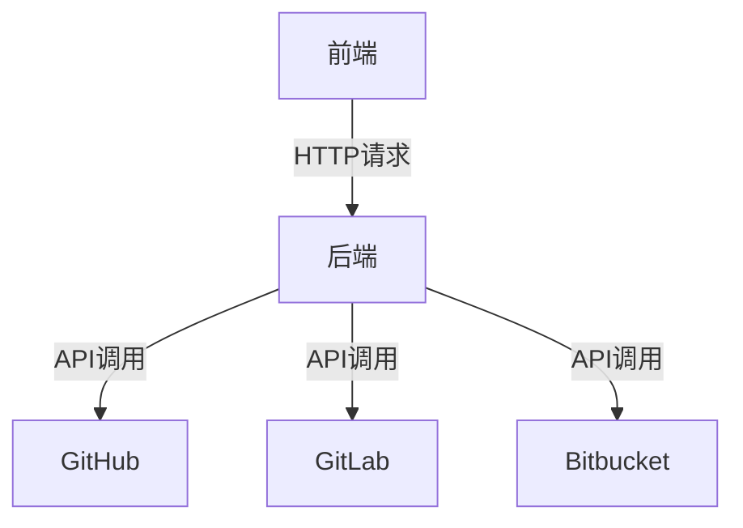
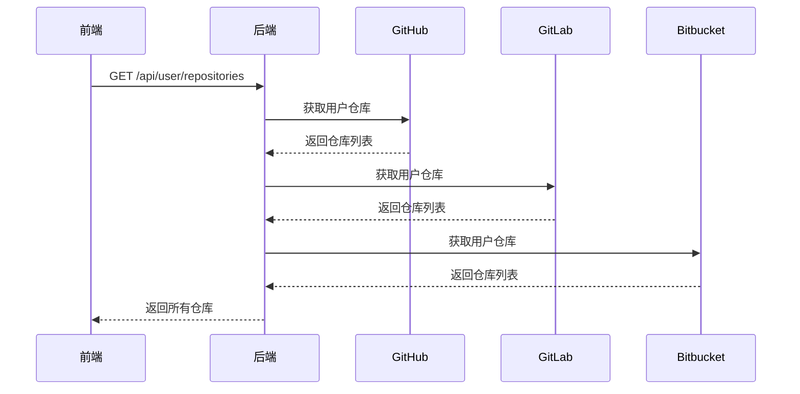
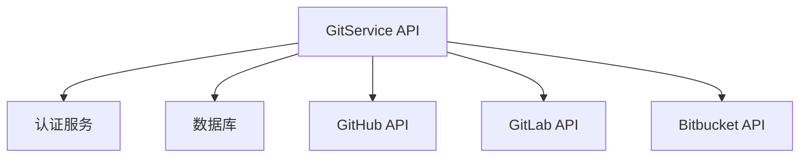

# 代码仓库服务集成

<cite>
**本文档引用的文件**   
- [git-service.api.ts](file://frontend/src/api/git-service/git-service.api.ts)
- [git.py](file://openhands/server/routes/git.py)
- [github_service.py](file://enterprise/integrations/github/github_service.py)
- [gitlab_service.py](file://enterprise/integrations/gitlab/gitlab_service.py)
- [bitbucket_service.py](file://enterprise/integrations/bitbucket/bitbucket_service.py)
- [use-repository-branches.ts](file://frontend/src/hooks/query/use-repository-branches.ts)
- [use-search-branches.ts](file://frontend/src/hooks/query/use-search-branches.ts)
- [utils.ts](file://frontend/src/utils/utils.ts)
- [git-service.types.ts](file://frontend/src/types/git.ts)
</cite>

## 目录
1. [简介](#简介)
2. [项目结构](#项目结构)
3. [核心组件](#核心组件)
4. [架构概述](#架构概述)
5. [详细组件分析](#详细组件分析)
6. [依赖分析](#依赖分析)
7. [性能考虑](#性能考虑)
8. [故障排除指南](#故障排除指南)
9. [结论](#结论)

## 简介
本文档详细描述了前端如何通过GitService API与Git仓库进行交互。涵盖了仓库克隆、分支管理、提交操作、拉取请求等核心功能的请求/响应模式。详细说明了API如何封装Git操作，以及如何处理异步操作的状态更新。提供了实际调用示例，展示代码仓库操作的完整流程，包括权限处理、冲突解决和操作结果反馈。

## 项目结构
项目结构清晰地分为前端和后端两个主要部分。前端位于`frontend`目录下，包含React应用的源代码、API服务、钩子和类型定义。后端服务位于`enterprise/integrations`目录下，包含了针对不同Git提供商（GitHub、GitLab、Bitbucket）的具体实现。



**图表来源**
- [git-service.api.ts](file://frontend/src/api/git-service/git-service.api.ts)
- [git.py](file://openhands/server/routes/git.py)
- [github_service.py](file://enterprise/integrations/github/github_service.py)
- [gitlab_service.py](file://enterprise/integrations/gitlab/gitlab_service.py)
- [bitbucket_service.py](file://enterprise/integrations/bitbucket/bitbucket_service.py)

**章节来源**
- [git-service.api.ts](file://frontend/src/api/git-service/git-service.api.ts)
- [git.py](file://openhands/server/routes/git.py)

## 核心组件
核心组件包括前端的GitService API和后端的Git服务实现。前端通过GitService API与后端通信，后端则负责与不同的Git提供商进行交互。

**章节来源**
- [git-service.api.ts](file://frontend/src/api/git-service/git-service.api.ts)
- [git.py](file://openhands/server/routes/git.py)

## 架构概述
系统架构采用前后端分离的设计，前端通过RESTful API与后端进行通信。后端服务封装了与不同Git提供商的交互逻辑，提供了统一的接口供前端调用。



**图表来源**
- [git-service.api.ts](file://frontend/src/api/git-service/git-service.api.ts)
- [git.py](file://openhands/server/routes/git.py)

## 详细组件分析
### GitService API分析
GitService API是前端与后端通信的核心，提供了搜索仓库、获取分支、创建拉取请求等功能。

#### 对象导向组件：
```mermaid
classDiagram
class GitService {
+searchGitRepositories(query : string, per_page : number, selected_provider : Provider) : Promise~GitRepository[]~
+retrieveUserGitRepositories(selected_provider : Provider, page : number, per_page : number) : Promise~{data : GitRepository[], nextPage : string}~
+getRepositoryBranches(repository : string, page : number, perPage : number) : Promise~PaginatedBranchesResponse~
+searchRepositoryBranches(repository : string, query : string, perPage : number, selectedProvider : Provider) : Promise~Branch[]~
+getUserInstallationIds(provider : Provider) : Promise~string[]~
+getGitChanges(conversationId : string) : Promise~GitChange[]~
+getGitChangeDiff(conversationId : string, path : string) : Promise~GitChangeDiff~
}
```

**图表来源**
- [git-service.api.ts](file://frontend/src/api/git-service/git-service.api.ts)

### 后端Git服务分析
后端Git服务实现了与不同Git提供商的交互，包括GitHub、GitLab和Bitbucket。

#### API/服务组件：


**图表来源**
- [git.py](file://openhands/server/routes/git.py)
- [github_service.py](file://enterprise/integrations/github/github_service.py)
- [gitlab_service.py](file://enterprise/integrations/gitlab/gitlab_service.py)
- [bitbucket_service.py](file://enterprise/integrations/bitbucket/bitbucket_service.py)

**章节来源**
- [git.py](file://openhands/server/routes/git.py)
- [github_service.py](file://enterprise/integrations/github/github_service.py)
- [gitlab_service.py](file://enterprise/integrations/gitlab/gitlab_service.py)
- [bitbucket_service.py](file://enterprise/integrations/bitbucket/bitbucket_service.py)

## 依赖分析
系统依赖于多个外部服务和库，包括Git提供商的API、认证服务和数据库。



**图表来源**
- [git-service.api.ts](file://frontend/src/api/git-service/git-service.api.ts)
- [git.py](file://openhands/server/routes/git.py)

**章节来源**
- [git-service.api.ts](file://frontend/src/api/git-service/git-service.api.ts)
- [git.py](file://openhands/server/routes/git.py)

## 性能考虑
在处理大量仓库和分支时，系统需要考虑性能优化。建议使用分页和缓存机制来减少API调用次数和响应时间。

## 故障排除指南
当遇到权限问题时，请确保用户已正确授权访问Git提供商。当遇到网络问题时，请检查API端点是否可达。

**章节来源**
- [git-service.api.ts](file://frontend/src/api/git-service/git-service.api.ts)
- [git.py](file://openhands/server/routes/git.py)

## 结论
本文档详细描述了代码仓库服务集成的各个方面，从前端API到后端服务实现。通过统一的接口，系统能够与不同的Git提供商进行交互，提供了灵活和可扩展的解决方案。