# 会话服务集成

<cite>
**本文档引用的文件**
- [v1-conversation-service.api.ts](file://frontend/src/api/conversation-service/v1-conversation-service.api.ts)
- [v1-conversation-service.types.ts](file://frontend/src/api/conversation-service/v1-conversation-service.types.ts)
- [conversation-service.api.ts](file://frontend/src/api/conversation-service/conversation-service.api.ts)
- [conversation-status.ts](file://frontend/src/types/conversation-status.ts)
- [conversation.py](file://openhands/server/routes/conversation.py)
- [manage_conversations.py](file://openhands/server/routes/manage_conversations.py)
- [conversation_info.py](file://openhands/server/data_models/conversation_info.py)
- [live_status_app_conversation_service.py](file://openhands/app_server/app_conversation/live_status_app_conversation_service.py)
</cite>

## 目录
1. [简介](#简介)
2. [会话服务API概览](#会话服务api概览)
3. [核心操作](#核心操作)
4. [数据模型与类型约束](#数据模型与类型约束)
5. [版本化API设计原则](#版本化api设计原则)
6. [实际调用示例](#实际调用示例)
7. [错误恢复机制](#错误恢复机制)
8. [最佳实践](#最佳实践)

## 简介

会话服务是OpenHands平台的核心组件，负责管理AI代理的会话生命周期。本文档详细描述了前端如何通过ConversationService API与后端进行交互，重点涵盖会话创建、启动、停止、状态查询等核心操作的请求/响应模式。文档还深入解析了v1-conversation-service.types.ts中定义的数据模型和类型约束，以及版本化API的设计原则。

会话服务支持两种版本的API：V0（传统）和V1（新版本）。V1 API提供了更丰富的功能和更好的性能，包括实时状态更新、更细粒度的控制和更灵活的配置选项。前端应用需要根据会话版本选择相应的API进行调用。

**Section sources**
- [v1-conversation-service.api.ts](file://frontend/src/api/conversation-service/v1-conversation-service.api.ts#L1-L294)
- [conversation-service.api.ts](file://frontend/src/api/conversation-service/conversation-service.api.ts#L1-L398)

## 会话服务API概览

会话服务API提供了丰富的端点来管理AI代理会话。主要功能包括会话的创建、启动、停止、状态查询、消息发送和文件上传等。API设计遵循RESTful原则，使用标准的HTTP方法和状态码。

V1 API引入了异步会话创建机制，通过`createConversation`方法创建会话启动任务，然后通过`getStartTask`方法轮询任务状态，直到会话准备就绪。这种设计提高了用户体验，避免了长时间的等待。

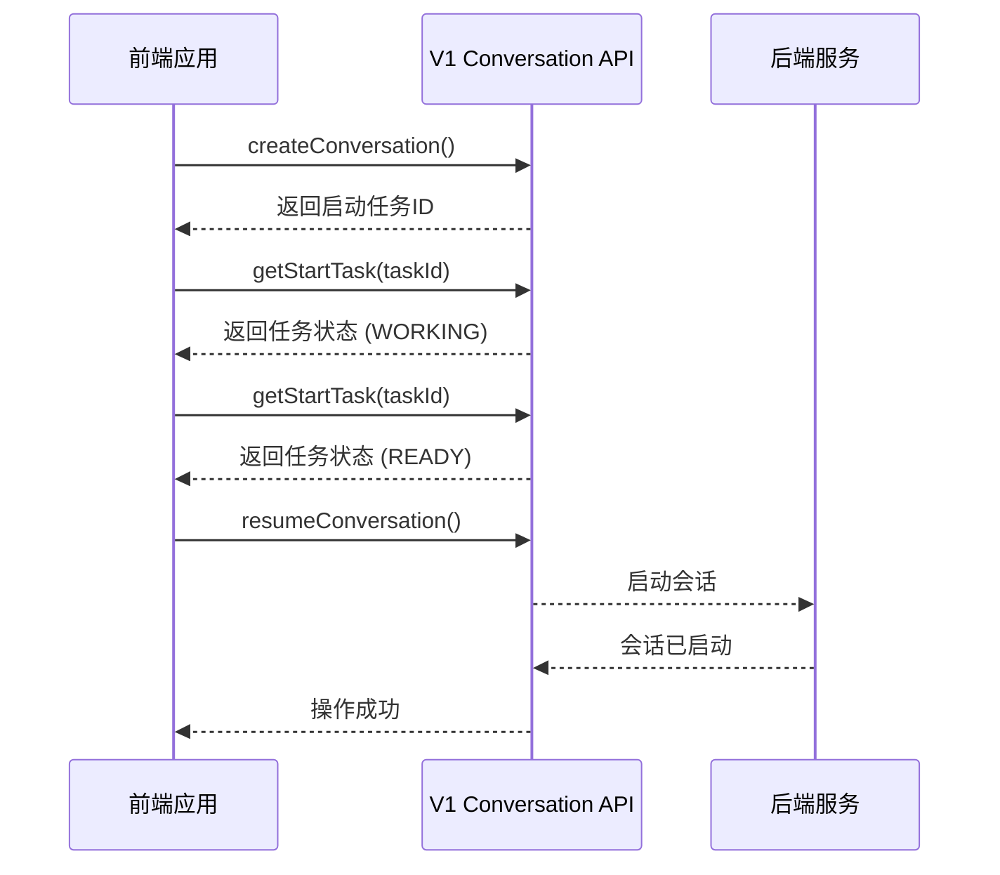

**Diagram sources**
- [v1-conversation-service.api.ts](file://frontend/src/api/conversation-service/v1-conversation-service.api.ts#L56-L91)
- [v1-conversation-service.api.ts](file://frontend/src/api/conversation-service/v1-conversation-service.api.ts#L196-L213)

## 核心操作

### 会话创建

会话创建是启动AI代理交互的第一步。V1 API使用异步创建模式，首先创建一个会话启动任务，然后轮询任务状态直到会话准备就绪。

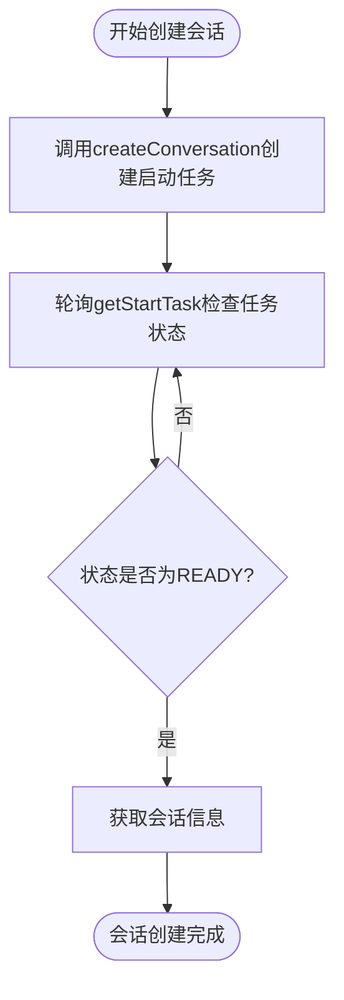

**Diagram sources**
- [v1-conversation-service.api.ts](file://frontend/src/api/conversation-service/v1-conversation-service.api.ts#L56-L91)
- [v1-conversation-service.api.ts](file://frontend/src/api/conversation-service/v1-conversation-service.api.ts#L100-L108)

### 会话启动与停止

会话启动和停止操作允许用户控制AI代理的执行状态。V1 API提供了`resumeConversation`和`pauseConversation`方法来控制会话的运行状态。

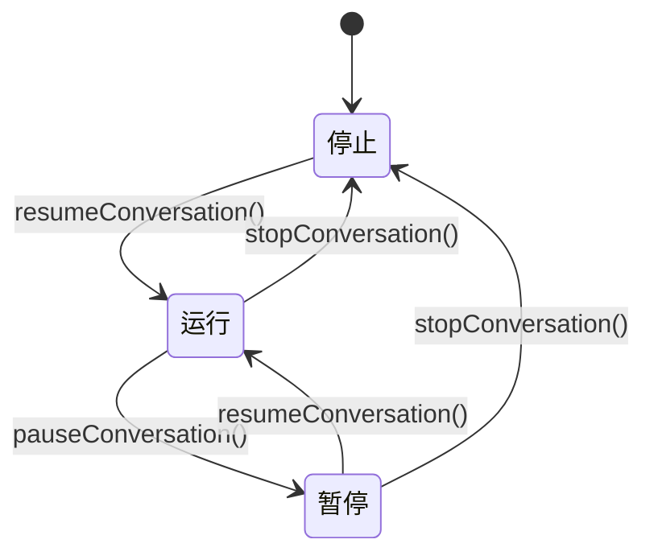

**Diagram sources**
- [v1-conversation-service.api.ts](file://frontend/src/api/conversation-service/v1-conversation-service.api.ts#L168-L185)
- [v1-conversation-service.api.ts](file://frontend/src/api/conversation-service/v1-conversation-service.api.ts#L196-L213)

### 状态查询

会话状态查询API允许前端应用实时获取会话的当前状态。系统支持多种状态，包括启动中、运行中、已停止、已归档和错误等。

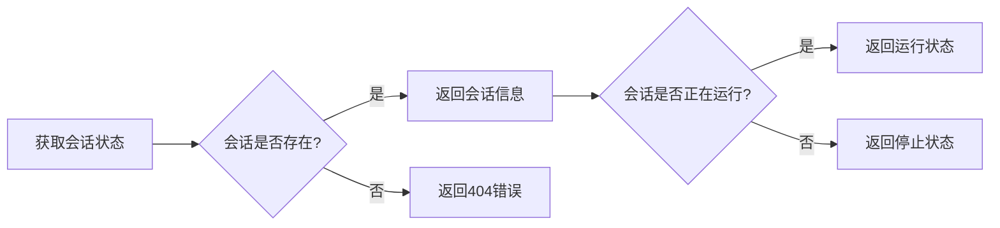

**Diagram sources**
- [manage_conversations.py](file://openhands/server/routes/manage_conversations.py#L433-L465)
- [conversation-status.ts](file://frontend/src/types/conversation-status.ts#L1-L6)

## 数据模型与类型约束

### V1会话数据模型

v1-conversation-service.types.ts文件定义了V1 API使用的数据模型和类型约束。这些类型确保了前后端之间的数据一致性。

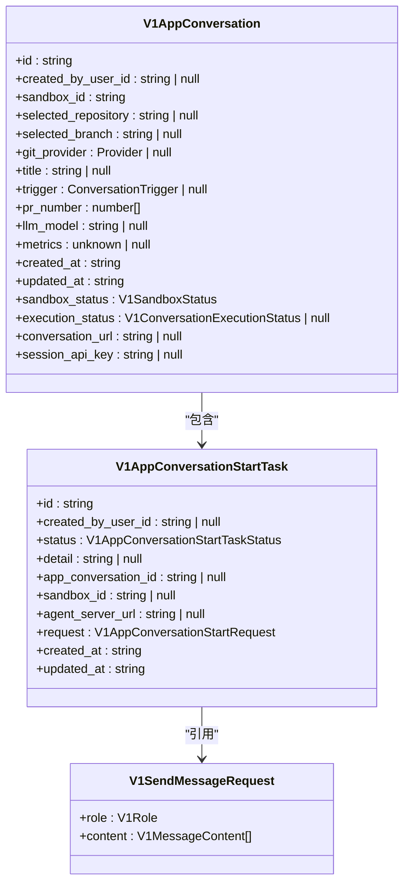

**Diagram sources**
- [v1-conversation-service.types.ts](file://frontend/src/api/conversation-service/v1-conversation-service.types.ts#L76-L94)
- [v1-conversation-service.types.ts](file://frontend/src/api/conversation-service/v1-conversation-service.types.ts#L45-L56)

### 类型约束详解

V1 API定义了严格的类型约束，确保数据的完整性和一致性。主要类型包括：

- **V1MessageContent**: 定义消息内容的结构，支持文本和图片URL
- **V1Role**: 定义消息角色，包括用户、系统、助手和工具
- **V1AppConversationStartTaskStatus**: 定义会话启动任务的状态
- **V1ConversationExecutionStatus**: 定义会话执行状态

这些类型约束在编译时就能捕获潜在的错误，提高了代码的可靠性和可维护性。

**Section sources**
- [v1-conversation-service.types.ts](file://frontend/src/api/conversation-service/v1-conversation-service.types.ts#L7-L94)

## 版本化API设计原则

### 版本兼容性

会话服务API采用版本化设计，确保向后兼容性。V1 API在路径中明确标识版本号（/api/v1/），避免与V0 API冲突。

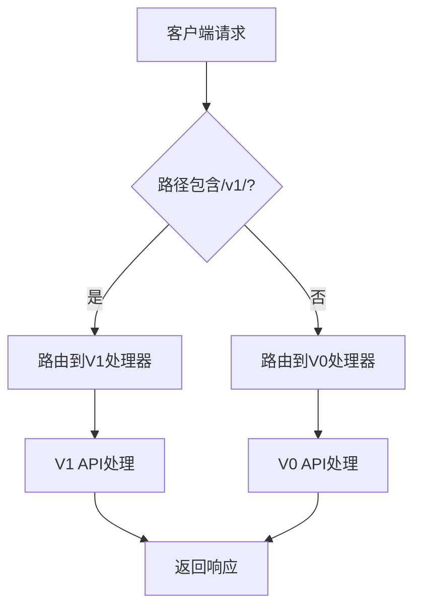

**Diagram sources**
- [manage_conversations.py](file://openhands/server/routes/manage_conversations.py#L433-L465)
- [conversation.py](file://openhands/server/routes/conversation.py#L107-L139)

### 降级处理

系统实现了优雅的降级处理机制。当V1 API不可用时，系统会自动回退到V0 API，确保基本功能的可用性。

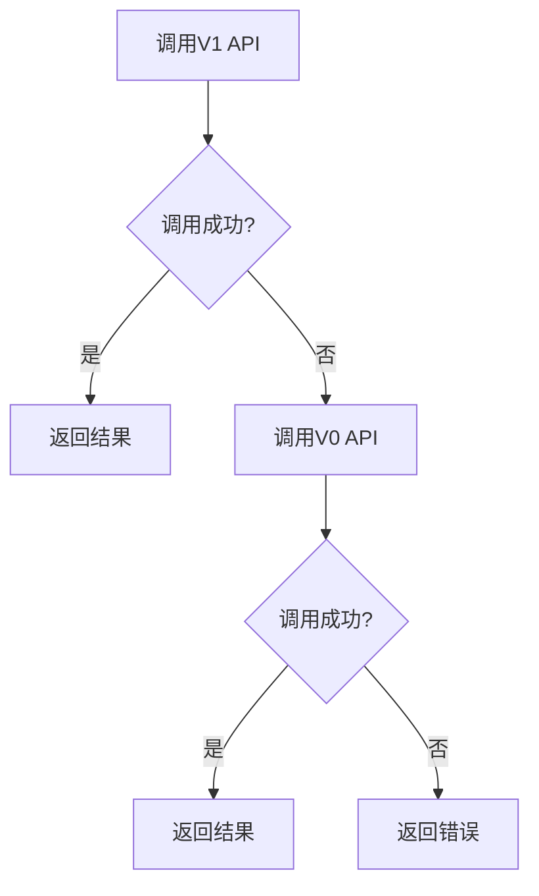

**Diagram sources**
- [manage_conversations.py](file://openhands/server/routes/manage_conversations.py#L475-L485)
- [conversation.py](file://openhands/server/routes/conversation.py#L34-L57)

## 实际调用示例

### 会话创建示例

以下示例展示了如何使用V1 API创建会话：

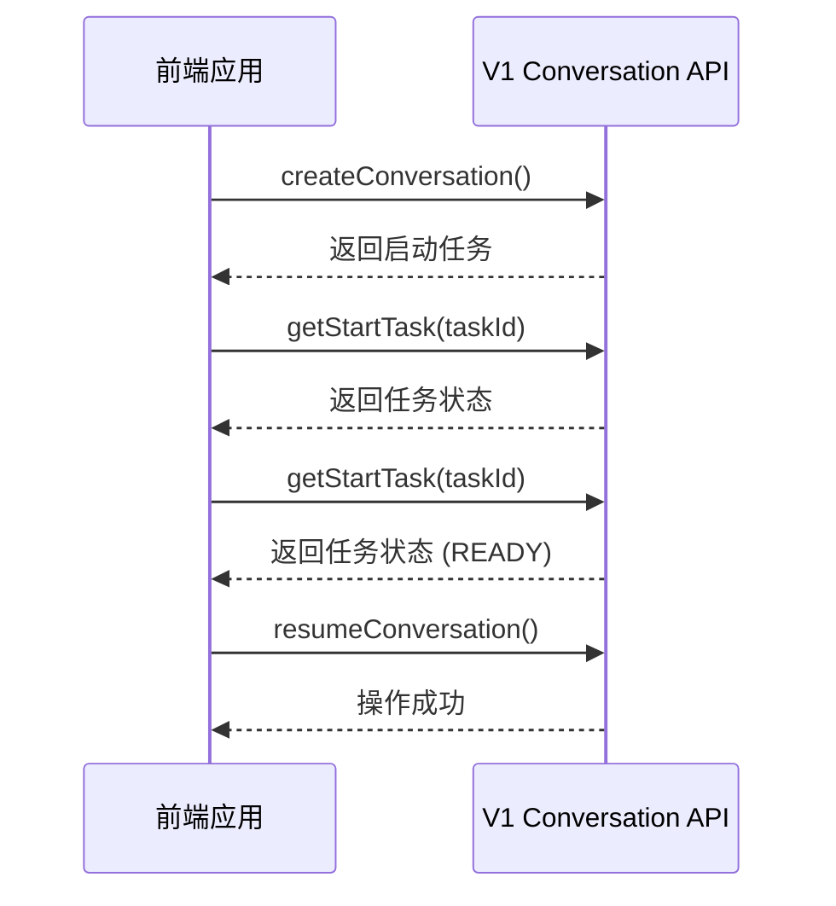

**Diagram sources**
- [v1-conversation-service.api.ts](file://frontend/src/api/conversation-service/v1-conversation-service.api.ts#L56-L91)
- [v1-conversation-service.api.ts](file://frontend/src/api/conversation-service/v1-conversation-service.api.ts#L196-L213)

### 文件上传示例

文件上传操作允许用户将会话所需的文件上传到工作区：

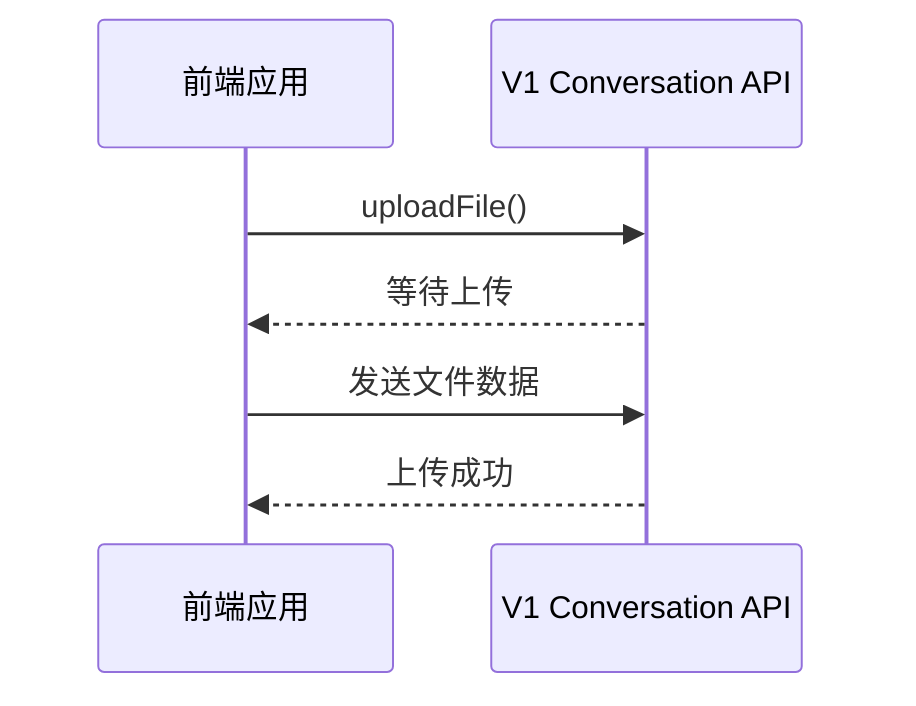

**Diagram sources**
- [v1-conversation-service.api.ts](file://frontend/src/api/conversation-service/v1-conversation-service.api.ts#L251-L277)

## 错误恢复机制

### 重试策略

系统实现了智能的重试策略，处理临时性错误。对于网络错误或服务暂时不可用的情况，客户端会自动重试请求。

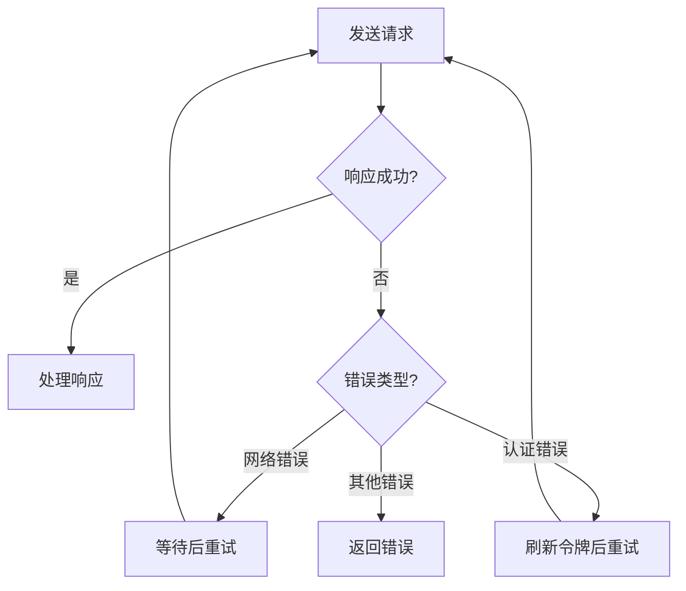

**Diagram sources**
- [v1-conversation-service.api.ts](file://frontend/src/api/conversation-service/v1-conversation-service.api.ts#L179-L184)
- [v1-conversation-service.api.ts](file://frontend/src/api/conversation-service/v1-conversation-service.api.ts#L207-L212)

### 状态同步

会话状态同步机制确保前端UI与后端状态保持一致。系统定期轮询会话状态，并在状态变化时更新UI。

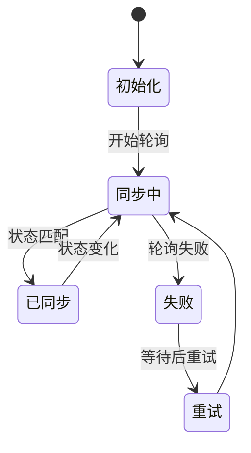

**Diagram sources**
- [use-user-conversation.ts](file://frontend/src/hooks/query/use-user-conversation.ts#L19-L38)
- [conversation-mutation-utils.ts](file://frontend/src/hooks/mutation/conversation-mutation-utils.ts#L106-L126)

## 最佳实践

### 性能优化

为了优化性能，建议采用以下最佳实践：

1. 使用批量操作减少网络请求
2. 合理设置轮询间隔，避免过度请求
3. 缓存常用数据，减少重复查询

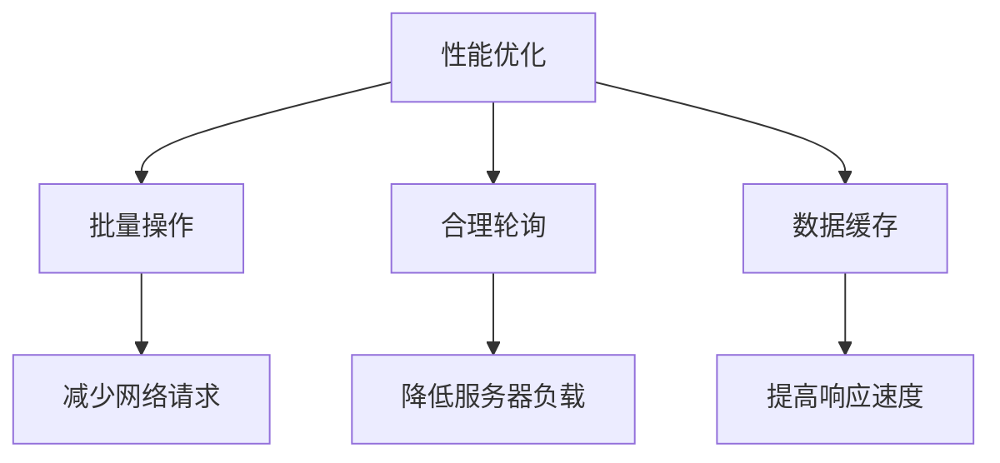

**Diagram sources**
- [v1-conversation-service.api.ts](file://frontend/src/api/conversation-service/v1-conversation-service.api.ts#L222-L239)
- [use-user-conversation.ts](file://frontend/src/hooks/query/use-user-conversation.ts#L35-L37)

### 安全考虑

安全是会话服务的重要方面。系统采用了多种安全措施：

1. 使用会话API密钥进行身份验证
2. 验证会话ID的格式，防止路径遍历攻击
3. 限制敏感操作的访问权限

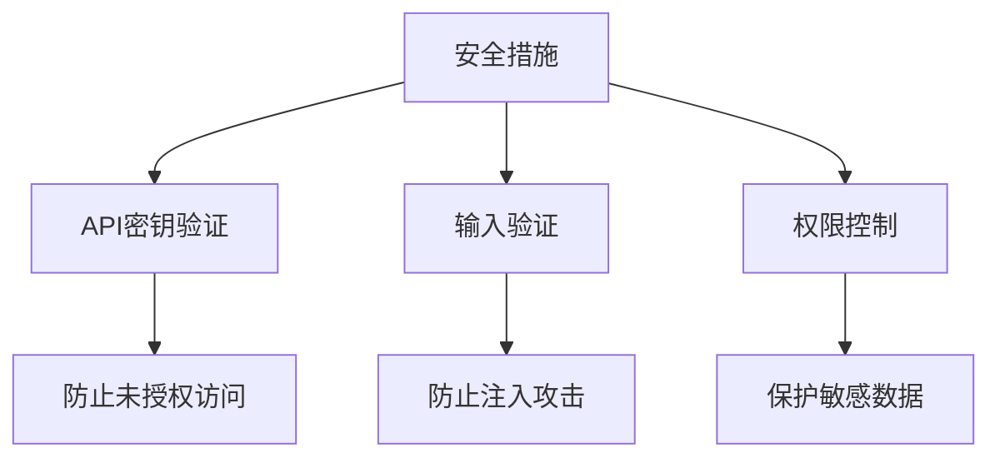

**Diagram sources**
- [conversation.py](file://openhands/server/routes/conversation.py#L43-L55)
- [v1-conversation-service.api.ts](file://frontend/src/api/conversation-service/v1-conversation-service.api.ts#L177-L183)