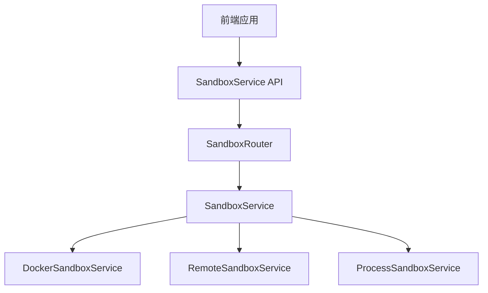
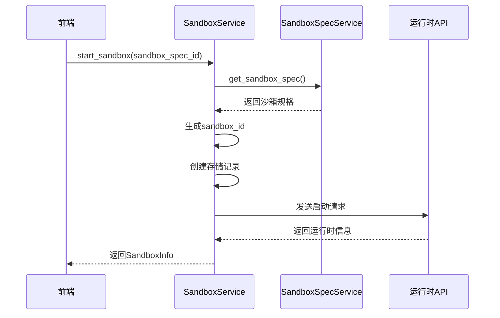
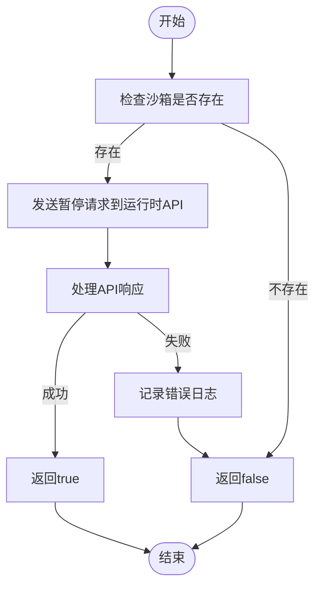
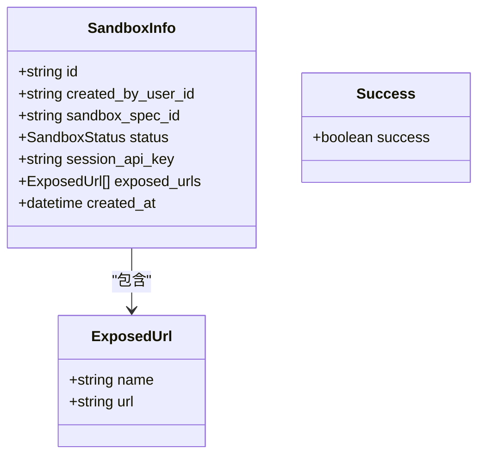
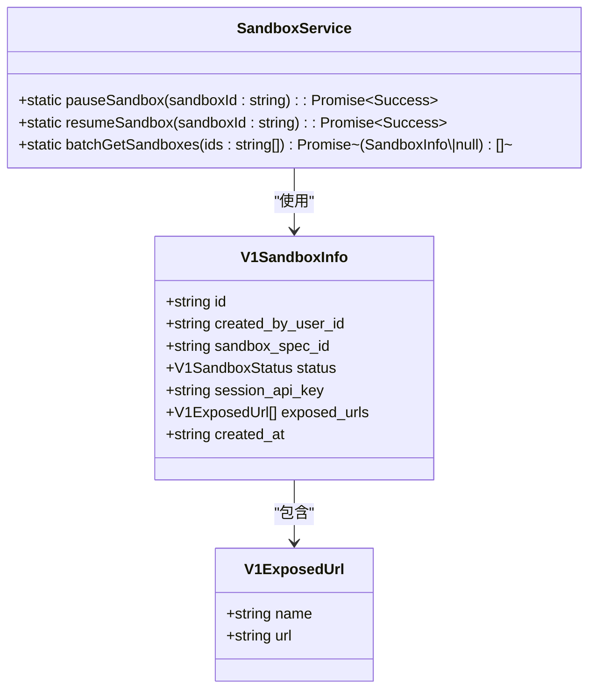
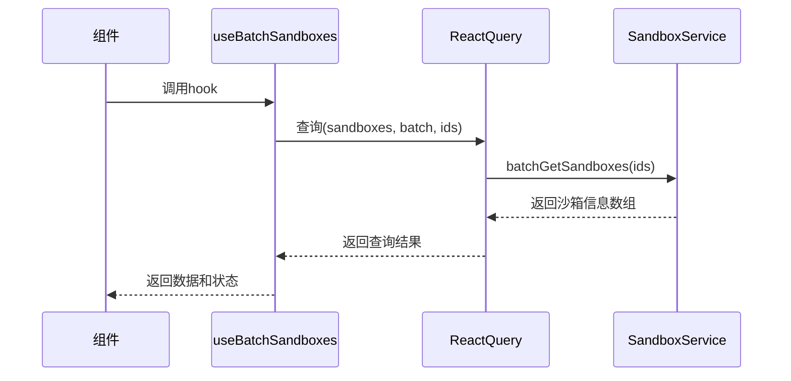
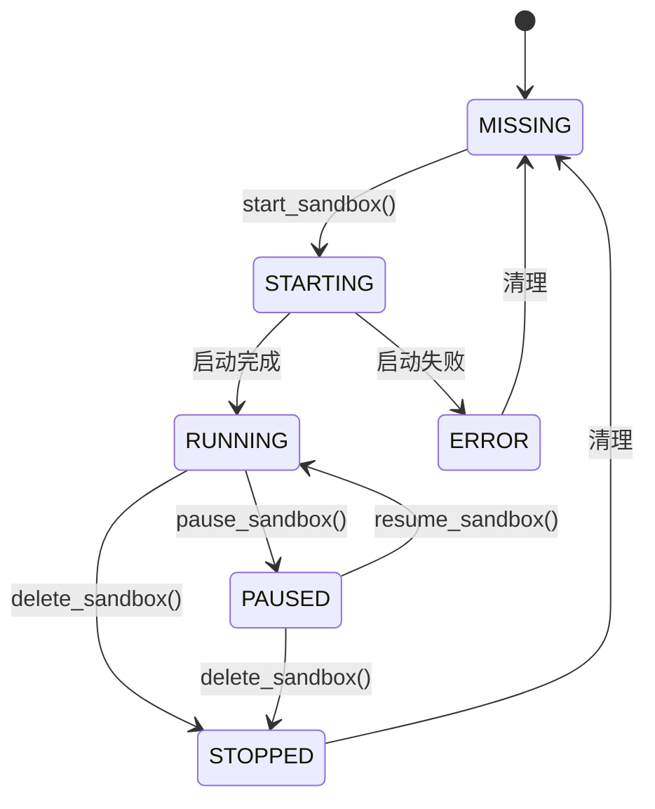
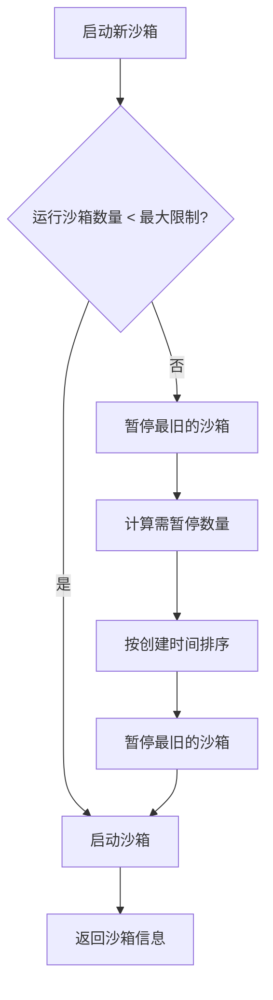
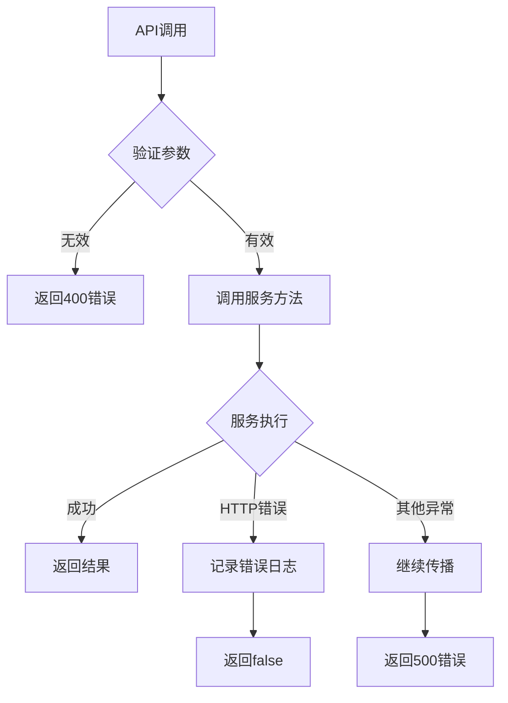

# 沙箱服务集成

<cite>
**本文档引用的文件**   
- [sandbox_service.py](file://openhands/app_server/sandbox/sandbox_service.py)
- [sandbox_router.py](file://openhands/app_server/sandbox/sandbox_router.py)
- [sandbox_models.py](file://openhands/app_server/sandbox/sandbox_models.py)
- [remote_sandbox_service.py](file://openhands/app_server/sandbox/remote_sandbox_service.py)
- [docker_sandbox_service.py](file://openhands/app_server/sandbox/docker_sandbox_service.py)
- [sandbox-service.api.ts](file://frontend/src/api/sandbox-service/sandbox-service.api.ts)
- [sandbox-service.types.ts](file://frontend/src/api/sandbox-service/sandbox-service.types.ts)
- [use-batch-sandboxes.ts](file://frontend/src/hooks/query/use-batch-sandboxes.ts)
- [sandbox_config.py](file://openhands/core/config/sandbox_config.py)
</cite>

## 目录
1. [简介](#简介)
2. [核心架构](#核心架构)
3. [沙箱生命周期管理](#沙箱生命周期管理)
4. [API请求/响应模式](#api请求响应模式)
5. [前端集成模式](#前端集成模式)
6. [状态监控与资源管理](#状态监控与资源管理)
7. [错误处理与性能优化](#错误处理与性能优化)
8. [配置管理](#配置管理)

## 简介
沙箱服务为AI代理提供安全的运行时环境管理功能，通过标准化的API接口实现对容器化执行环境的全生命周期管理。该服务支持多种后端实现，包括Docker本地运行时和远程运行时API，为前端应用提供了统一的沙箱管理接口。

## 核心架构
沙箱服务采用分层架构设计，通过抽象接口实现不同后端的统一管理。核心组件包括沙箱服务接口、具体实现类和前端API适配器。



**图示来源**
- [sandbox_service.py](file://openhands/app_server/sandbox/sandbox_service.py#L13-L126)
- [sandbox_router.py](file://openhands/app_server/sandbox/sandbox_router.py#L14-L92)

## 沙箱生命周期管理
沙箱服务提供完整的生命周期管理功能，包括创建、启动、暂停、恢复和删除操作。

### 创建与启动
沙箱创建过程包括生成唯一ID、获取沙箱规格、创建存储记录和启动代理进程等步骤。



**图示来源**
- [remote_sandbox_service.py](file://openhands/app_server/sandbox/remote_sandbox_service.py#L294-L324)
- [process_sandbox_service.py](file://openhands/app_server/sandbox/process_sandbox_service.py#L273-L303)

### 暂停与恢复
沙箱的暂停和恢复操作通过异步API调用实现，确保操作的可靠性和状态一致性。



**图示来源**
- [remote_sandbox_service.py](file://openhands/app_server/sandbox/remote_sandbox_service.py#L399-L422)

## API请求/响应模式
沙箱服务通过RESTful API提供标准化的接口，前端通过这些接口管理沙箱环境。

### 请求模式
前端通过HTTP请求与沙箱服务交互，主要操作包括：

| 操作 | HTTP方法 | 路径 | 请求体 | 认证 |
|------|---------|------|--------|------|
| 搜索沙箱 | GET | /api/v1/sandboxes/search | 无 | JWT |
| 批量获取沙箱 | GET | /api/v1/sandboxes | id参数 | JWT |
| 启动沙箱 | POST | /api/v1/sandboxes | sandbox_spec_id | JWT |
| 暂停沙箱 | POST | /api/v1/sandboxes/{id}/pause | 空对象 | JWT |
| 恢复沙箱 | POST | /api/v1/sandboxes/{id}/resume | 空对象 | JWT |
| 删除沙箱 | DELETE | /api/v1/sandboxes/{id} | 无 | JWT |

**表来源**
- [sandbox_router.py](file://openhands/app_server/sandbox/sandbox_router.py#L14-L92)

### 响应模式
API响应遵循统一的数据结构，包含操作结果和相关数据。



**图示来源**
- [sandbox_models.py](file://openhands/app_server/sandbox/sandbox_models.py#L32-L61)
- [sandbox-service.types.ts](file://frontend/src/api/sandbox-service/sandbox-service.types.ts#L16-L24)

## 前端集成模式
前端通过封装的API服务类与沙箱服务进行交互，实现类型安全的操作。

### API服务封装
前端使用TypeScript类封装沙箱API调用，提供类型安全的接口。



**图示来源**
- [sandbox-service.api.ts](file://frontend/src/api/sandbox-service/sandbox-service.api.ts#L7-L53)
- [sandbox-service.types.ts](file://frontend/src/api/sandbox-service/sandbox-service.types.ts#L16-L24)

### 批量查询实现
前端使用React Query实现沙箱的批量查询，支持缓存和自动刷新。



**图示来源**
- [use-batch-sandboxes.ts](file://frontend/src/hooks/query/use-batch-sandboxes.ts#L4-L12)

## 状态监控与资源管理
沙箱服务提供全面的状态监控和资源管理功能，确保运行时环境的稳定性和可靠性。

### 状态转换
沙箱服务定义了完整的状态机，管理沙箱的生命周期状态转换。



**图示来源**
- [sandbox_models.py](file://openhands/app_server/sandbox/sandbox_models.py#L9-L16)
- [remote_sandbox_service.py](file://openhands/app_server/sandbox/remote_sandbox_service.py#L52-L66)

### 资源限制
系统通过配置参数管理沙箱资源，防止资源过度消耗。



**图示来源**
- [sandbox_service.py](file://openhands/app_server/sandbox/sandbox_service.py#L67-L121)

## 错误处理与性能优化
沙箱服务实现了健壮的错误处理机制和性能优化策略，确保系统的稳定运行。

### 错误处理策略
服务采用分层错误处理机制，捕获和处理不同级别的异常。



**图示来源**
- [remote_sandbox_service.py](file://openhands/app_server/sandbox/remote_sandbox_service.py#L399-L422)
- [sandbox_router.py](file://openhands/app_server/sandbox/sandbox_router.py#L61-L69)

### 性能优化
系统通过多种机制优化性能，包括批量操作、缓存和异步处理。

```mermaid
flowchart TD
A[批量获取沙箱] --> B[并发执行get_sandbox()]
B --> C[使用asyncio.gather()]
C --> D[并行处理所有请求]
D --> E[返回结果数组]
F[轮询模式] --> G{有公共URL?}
G --> |是| H[通过回调接收更新]
G --> |否| I[启动轮询任务]
I --> J[定期调用API]
J --> K[更新本地状态]
```

**图示来源**
- [sandbox_service.py](file://openhands/app_server/sandbox/sandbox_service.py#L28-L35)
- [remote_sandbox_service.py](file://openhands/app_server/sandbox/remote_sandbox_service.py#L633-L646)

## 配置管理
沙箱服务通过配置文件管理运行时参数，支持灵活的环境适配。

### 配置参数
核心配置参数定义了沙箱的行为和资源分配。

| 参数 | 类型 | 默认值 | 描述 |
|------|------|--------|------|
| remote_runtime_api_url | string | http://localhost:8000 | 远程运行时API地址 |
| api_key | string | null | API认证密钥 |
| remote_runtime_resource_factor | int | 1 | 远程运行时资源因子 |
| runtime_startup_env_vars | dict | {} | 运行时启动环境变量 |
| max_num_sandboxes | int | 100 | 最大沙箱数量 |
| polling_interval | int | 30 | 轮询间隔（秒） |

**表来源**
- [sandbox_config.py](file://openhands/core/config/sandbox_config.py#L49-L97)
- [remote_sandbox_service.py](file://openhands/app_server/sandbox/remote_sandbox_service.py#L93-L99)

**本节来源**
- [sandbox_config.py](file://openhands/core/config/sandbox_config.py#L8-L124)
- [remote_sandbox_service.py](file://openhands/app_server/sandbox/remote_sandbox_service.py#L92-L103)