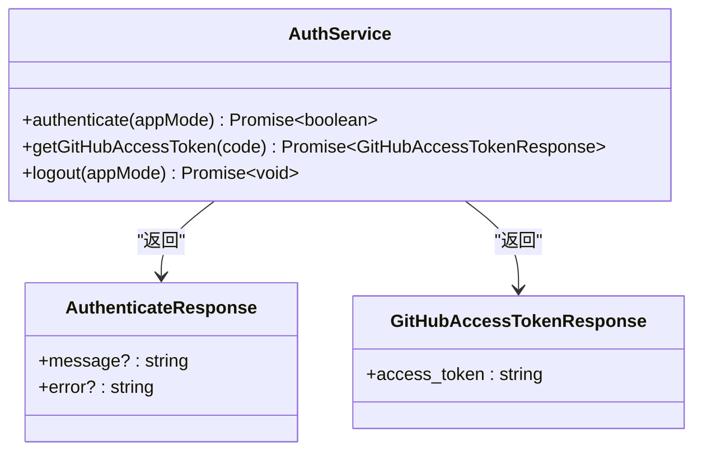
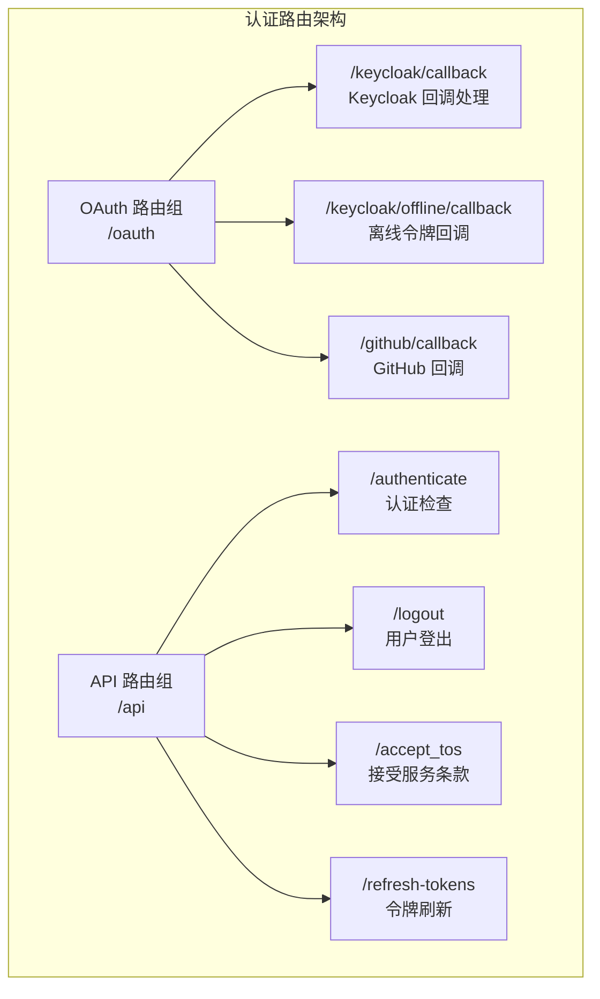
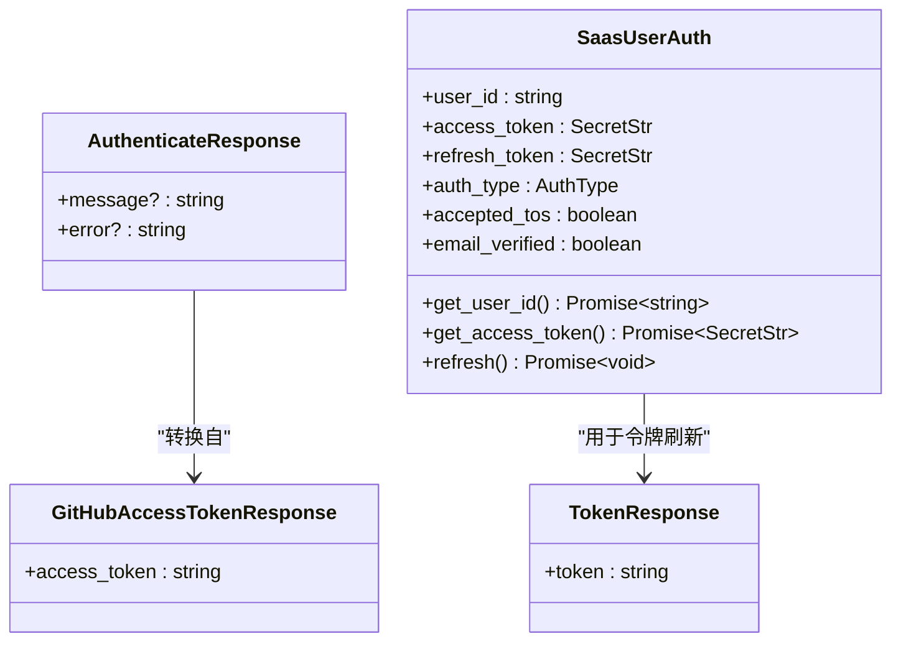
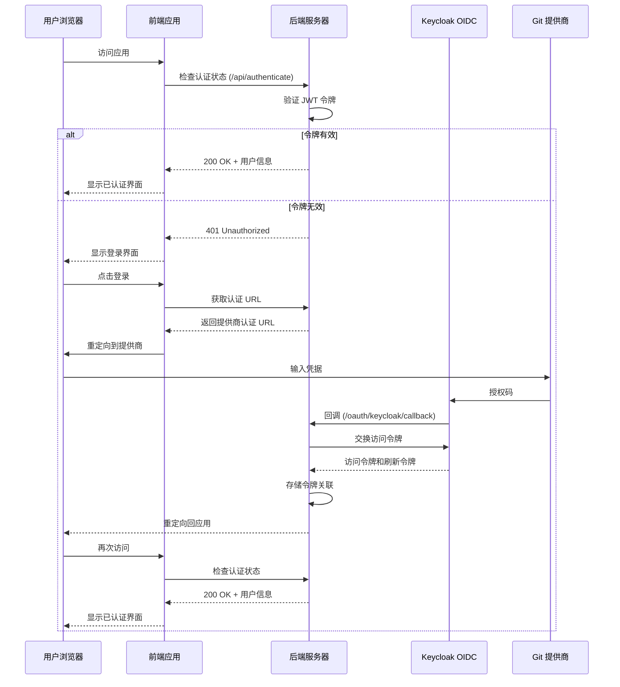
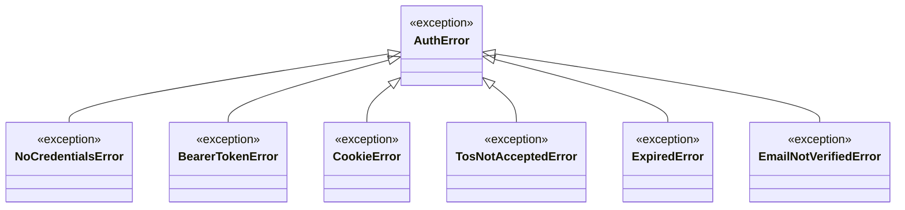
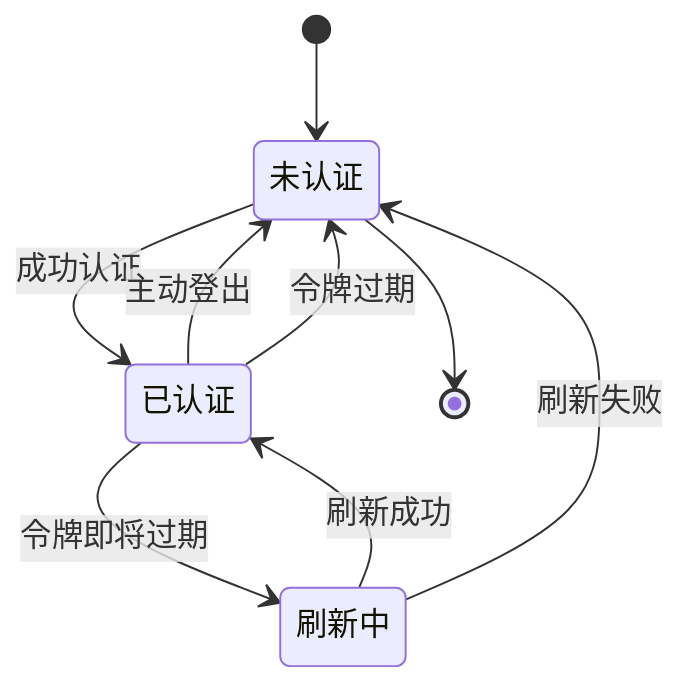

# 认证服务集成

<cite>
**本文档中引用的文件**
- [auth-service.api.ts](file://frontend/src/api/auth-service/auth-service.api.ts)
- [auth.types.ts](file://frontend/src/api/auth-service/auth.types.ts)
- [auth.py](file://enterprise/server/routes/auth.py)
- [middleware.py](file://enterprise/server/middleware.py)
- [auth_error.py](file://enterprise/server/auth/auth_error.py)
- [saas_user_auth.py](file://enterprise/server/auth/saas_user_auth.py)
- [token_manager.py](file://enterprise/server/auth/token_manager.py)
- [use-logout.ts](file://frontend/src/hooks/mutation/use-logout.ts)
- [use-auth-callback.ts](file://frontend/src/hooks/use-auth-callback.ts)
- [use-auto-login.ts](file://frontend/src/hooks/use-auto-login.ts)
- [open-hands-axios.ts](file://frontend/src/api/open-hands-axios.ts)
- [test_auth_routes.py](file://enterprise/tests/unit/test_auth_routes.py)
- [test_saas_user_auth.py](file://enterprise/tests/unit/test_saas_user_auth.py)
- [test_auth_error.py](file://enterprise/tests/unit/test_auth_error.py)
</cite>

## 目录
1. [简介](#简介)
2. [系统架构概览](#系统架构概览)
3. [前端认证服务](#前端认证服务)
4. [后端认证路由](#后端认证路由)
5. [认证类型接口](#认证类型接口)
6. [认证流程详解](#认证流程详解)
7. [错误处理机制](#错误处理机制)
8. [令牌管理](#令牌管理)
9. [实际调用示例](#实际调用示例)
10. [最佳实践](#最佳实践)

## 箹

OpenHands 认证服务采用基于 JWT 的现代认证架构，支持多种身份提供商（GitHub、GitLab、Bitbucket、企业SSO），并提供完整的令牌刷新和错误处理机制。该系统设计为可扩展的微服务架构，支持开源版本（OSS）和企业版本（SAAS）两种部署模式。

## 前端认证服务

### AuthService 核心功能

前端认证服务通过 `AuthService` 类提供统一的认证 API 接口，封装了所有与后端认证相关的 HTTP 请求。



**图表来源**
- [auth-service.api.ts](file://frontend/src/api/auth-service/auth-service.api.ts#L8-L52)
- [auth.types.ts](file://frontend/src/api/auth-service/auth.types.ts#L1-L8)

### 认证方法详解

#### 1. 用户认证（authenticate）
- **功能**：验证当前用户的认证状态
- **参数**：`appMode` - 应用程序模式（"saas" 或 "oss"）
- **返回值**：Promise<boolean> - 认证成功返回 true
- **适用场景**：页面加载时的认证检查

#### 2. GitHub 访问令牌获取（getGitHubAccessToken）
- **功能**：从 Keycloak 回调获取 GitHub 访问令牌
- **参数**：`code` - GitHub 提供的授权码
- **返回值**：Promise<GitHubAccessTokenResponse> - 包含访问令牌的对象
- **适用场景**：OAuth 流程中的令牌交换

#### 3. 用户登出（logout）
- **功能**：清除用户认证状态
- **参数**：`appMode` - 应用程序模式
- **返回值**：Promise<void>
- **适用场景**：用户主动登出或自动登出

**章节来源**
- [auth-service.api.ts](file://frontend/src/api/auth-service/auth-service.api.ts#L8-L52)

## 后端认证路由

### 路由架构

后端认证系统采用分层路由设计，包含 OAuth 路由和 API 路由两个主要部分。



**图表来源**
- [auth.py](file://enterprise/server/routes/auth.py#L37-L42)

### 核心认证端点

#### 1. 认证检查端点（POST /api/authenticate）
- **功能**：验证用户认证状态
- **请求方式**：POST
- **认证要求**：需要有效的认证令牌
- **响应**：
  - 成功：200 OK + {"message": "User authenticated"}
  - 失败：401 Unauthorized + {"error": "User is not authenticated"}

#### 2. 登出端点（POST /api/logout）
- **功能**：清除用户认证状态并清理令牌
- **请求方式**：POST
- **认证要求**：需要有效的认证令牌
- **响应**：200 OK + {"message": "User logged out"}

#### 3. 服务条款接受端点（POST /api/accept_tos）
- **功能**：记录用户接受服务条款的状态
- **请求方式**：POST
- **请求体**：{"redirect_url": "重定向URL"}
- **响应**：200 OK + {"redirect_url": "重定向URL"}

**章节来源**
- [auth.py](file://enterprise/server/routes/auth.py#L295-L435)

## 认证类型接口

### TypeScript 类型定义

认证系统使用严格的 TypeScript 类型定义确保类型安全。



**图表来源**
- [auth.types.ts](file://frontend/src/api/auth-service/auth.types.ts#L1-L8)
- [saas_user_auth.py](file://enterprise/server/auth/saas_user_auth.py#L1-L50)

### 类型安全特性

1. **密封字符串（SecretStr）**：保护敏感令牌数据
2. **可选属性**：支持灵活的响应结构
3. **泛型支持**：确保 API 响应的一致性

**章节来源**
- [auth.types.ts](file://frontend/src/api/auth-service/auth.types.ts#L1-L8)

## 认证流程详解

### 完整认证流程



**图表来源**
- [auth.py](file://enterprise/server/routes/auth.py#L99-L248)
- [auth-service.api.ts](file://frontend/src/api/auth-service/auth-service.api.ts#L14-L48)

### OAuth 认证流程

#### Keycloak 回调处理

1. **授权码验证**：验证 GitHub 提供的授权码
2. **令牌交换**：使用授权码从 Keycloak 获取访问令牌和刷新令牌
3. **用户信息获取**：通过访问令牌获取用户基本信息
4. **令牌存储**：将令牌与用户 ID 关联存储
5. **Cookie 设置**：设置加密的认证 Cookie

**章节来源**
- [auth.py](file://enterprise/server/routes/auth.py#L99-L248)

## 错误处理机制

### 错误类型层次结构



**图表来源**
- [auth_error.py](file://enterprise/server/auth/auth_error.py#L1-L40)

### 错误处理策略

#### 1. 中间件级错误处理
- **自动登出**：检测到认证错误时自动清理认证状态
- **Cookie 清理**：删除无效的认证 Cookie
- **状态码映射**：将认证错误映射为适当的 HTTP 状态码

#### 2. 前端错误处理
- **自动重试**：对临时性错误进行自动重试
- **用户体验优化**：友好的错误提示和引导
- **状态恢复**：错误后的状态重置和恢复

**章节来源**
- [middleware.py](file://enterprise/server/middleware.py#L69-L96)
- [auth_error.py](file://enterprise/server/auth/auth_error.py#L1-L40)

## 令牌管理

### 令牌生命周期



### 令牌刷新机制

#### 自动刷新触发条件
1. **访问令牌即将过期**：在访问令牌到期前自动刷新
2. **手动刷新请求**：通过 `/api/refresh-tokens` 端点手动刷新
3. **中间件检查**：每次 API 请求时检查令牌有效性

#### 刷新流程
1. **令牌验证**：验证当前刷新令牌的有效性
2. **新令牌获取**：向 Keycloak 请求新的访问令牌
3. **状态更新**：更新本地认证状态
4. **Cookie 更新**：更新客户端认证 Cookie

**章节来源**
- [token_manager.py](file://enterprise/server/auth/token_manager.py#L89-L262)
- [saas_user_auth.py](file://enterprise/server/auth/saas_user_auth.py#L227-L293)

## 实际调用示例

### 前端认证调用示例

#### 1. 用户登录流程
```typescript
// 使用 AuthService 进行认证
const isAuthenticated = await AuthService.authenticate(appMode);

// 获取 GitHub 访问令牌
const accessToken = await AuthService.getGitHubAccessToken(authorizationCode);

// 执行登出操作
await AuthService.logout(appMode);
```

#### 2. React Hooks 集成
```typescript
// 使用登出 Hook
const { mutate: logout } = useLogout();

// 在组件中使用
const handleLogout = () => {
  logout({
    onSuccess: () => {
      // 登出成功后的处理逻辑
      console.log('用户已登出');
    }
  });
};
```

**章节来源**
- [auth-service.api.ts](file://frontend/src/api/auth-service/auth-service.api.ts#L14-L48)
- [use-logout.ts](file://frontend/src/hooks/mutation/use-logout.ts#L7-L30)

### 后端认证处理示例

#### 1. 认证中间件配置
```python
# 在 FastAPI 应用中注册认证中间件
app.add_middleware(SetAuthCookieMiddleware)
```

#### 2. 认证状态检查
```python
# 在路由处理器中获取用户认证信息
user_auth: SaasUserAuth = await get_user_auth(request)
access_token = await user_auth.get_access_token()
user_id = await user_auth.get_user_id()
```

**章节来源**
- [middleware.py](file://enterprise/server/middleware.py#L26-L175)
- [auth.py](file://enterprise/server/routes/auth.py#L295-L307)

## 最佳实践

### 安全最佳实践

1. **HTTPS 强制**：所有认证通信必须使用 HTTPS
2. **Cookie 安全**：设置 HttpOnly、Secure、SameSite 属性
3. **令牌保护**：使用 SecretStr 保护敏感令牌数据
4. **错误处理**：避免在错误消息中泄露敏感信息

### 性能优化

1. **令牌缓存**：合理缓存访问令牌以减少 API 调用
2. **批量认证**：支持批量认证检查以提高效率
3. **异步处理**：使用异步认证处理提升响应速度
4. **连接池**：配置数据库和外部服务连接池

### 用户体验优化

1. **自动重试**：对网络错误进行自动重试
2. **进度指示**：长时间认证操作显示加载状态
3. **错误引导**：提供清晰的错误解决指导
4. **会话保持**：合理设置令牌有效期平衡安全性和便利性

### 监控和调试

1. **日志记录**：记录关键认证事件和错误
2. **性能监控**：监控认证响应时间和成功率
3. **异常告警**：设置认证相关异常的告警机制
4. **审计跟踪**：记录用户认证活动用于安全审计

**章节来源**
- [middleware.py](file://enterprise/server/middleware.py#L46-L53)
- [auth.py](file://enterprise/server/routes/auth.py#L43-L69)