# 账单服务集成

<cite>
**本文档引用的文件**  
- [billing-service.api.ts](file://frontend/src/api/billing-service/billing-service.api.ts)
- [billing.types.ts](file://frontend/src/api/billing-service/billing.types.ts)
- [billing.py](file://enterprise/server/routes/billing.py)
- [billing_session.py](file://enterprise/storage/billing_session.py)
- [subscription_access.py](file://enterprise/storage/subscription_access.py)
- [payment-form.tsx](file://frontend/src/components/features/payment/payment-form.tsx)
- [setup-payment-modal.tsx](file://frontend/src/components/features/payment/setup-payment-modal.tsx)
- [billing.tsx](file://frontend/src/routes/billing.tsx)
</cite>

## 目录
1. [简介](#简介)
2. [核心功能](#核心功能)
3. [账单数据模型](#账单数据模型)
4. [支付状态机](#支付状态机)
5. [API请求/响应模式](#api请求响应模式)
6. [前端集成示例](#前端集成示例)
7. [错误处理策略](#错误处理策略)
8. [支付流程实现](#支付流程实现)

## 简介
账单服务集成为用户提供了一套完整的支付和订阅管理解决方案。该服务通过与Stripe支付网关集成，支持用户购买信用额度、管理支付方式、订阅月度计划以及查询账单信息。本文档详细描述了前端如何通过BillingService API处理用户账单和支付相关操作，涵盖订阅管理、支付信息更新、账单查询等核心功能的请求/响应模式。

**Section sources**
- [billing.py](file://enterprise/server/routes/billing.py#L1-L50)

## 核心功能
账单服务提供了以下核心功能：

- **信用额度购买**：用户可以通过创建Stripe结账会话来购买信用额度
- **支付方式管理**：用户可以设置和管理支付方式
- **订阅管理**：支持月度订阅计划的创建和取消
- **账单查询**：提供用户信用余额和订阅访问信息的查询接口
- **支付回调处理**：处理成功和取消的支付回调

这些功能通过一组RESTful API端点暴露给前端应用，前端通过BillingService类封装这些API调用。

**Section sources**
- [billing.py](file://enterprise/server/routes/billing.py#L100-L150)
- [billing-service.api.ts](file://frontend/src/api/billing-service/billing-service.api.ts#L10-L85)

## 账单数据模型
账单服务定义了关键的数据模型来管理用户的支付和订阅信息。

### 订阅访问模型
`SubscriptionAccess` 模型用于跟踪用户的订阅状态：

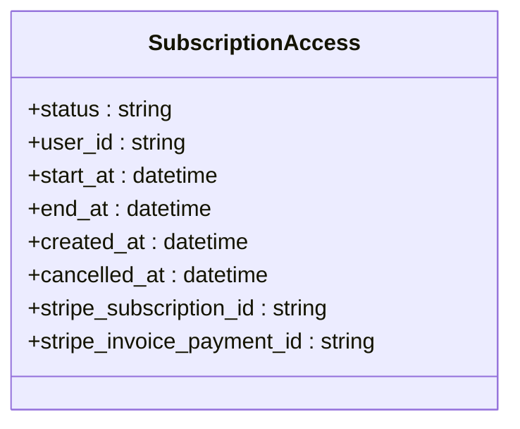

**Diagram sources**
- [subscription_access.py](file://enterprise/storage/subscription_access.py#L7-L46)

### 账单会话模型
`BillingSession` 模型用于跟踪支付交易的状态：

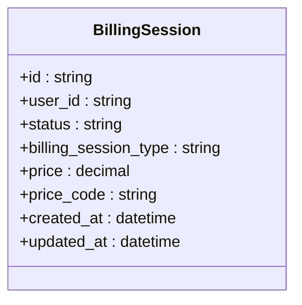

**Diagram sources**
- [billing_session.py](file://enterprise/storage/billing_session.py#L7-L46)

### 订阅访问类型
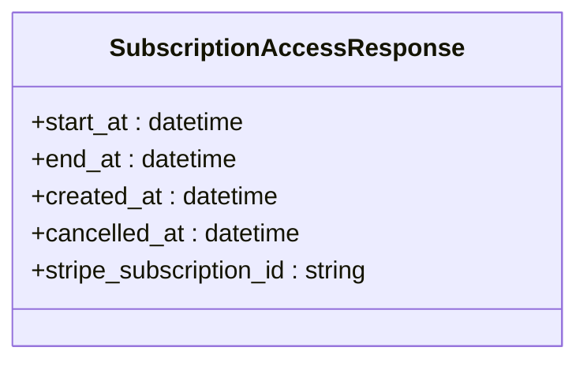

**Diagram sources**
- [billing.py](file://enterprise/server/routes/billing.py#L76-L82)

**Section sources**
- [billing.types.ts](file://frontend/src/api/billing-service/billing.types.ts#L1-L13)
- [billing.py](file://enterprise/server/routes/billing.py#L72-L82)

## 支付状态机
账单服务实现了一个基于状态的支付处理机制，确保支付流程的完整性和一致性。

### 账单会话状态
`BillingSession` 支持以下状态：

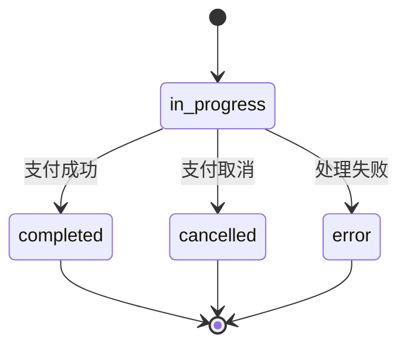

**Diagram sources**
- [billing_session.py](file://enterprise/storage/billing_session.py#L17-L23)

### 订阅访问状态
`SubscriptionAccess` 支持以下状态：

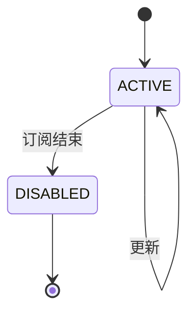

**Diagram sources**
- [subscription_access.py](file://enterprise/storage/subscription_access.py#L16-L19)
- [subscription_access_status.py](file://enterprise/storage/subscription_access_status.py#L4-L7)

**Section sources**
- [billing_session.py](file://enterprise/storage/billing_session.py#L17-L23)
- [subscription_access.py](file://enterprise/storage/subscription_access.py#L16-L19)

## API请求/响应模式
账单服务提供了标准化的API接口，用于处理各种支付和订阅操作。

### 信用额度购买
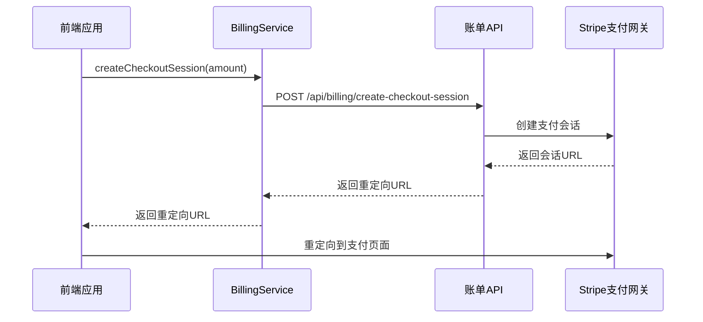

**Diagram sources**
- [billing-service.api.ts](file://frontend/src/api/billing-service/billing-service.api.ts#L16-L24)
- [billing.py](file://enterprise/server/routes/billing.py#L246-L299)

### 订阅管理
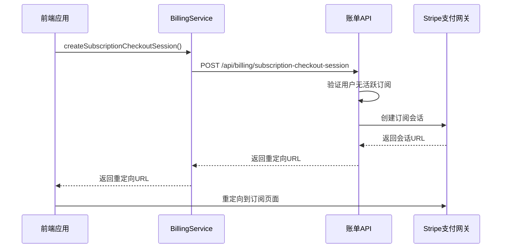

**Diagram sources**
- [billing-service.api.ts](file://frontend/src/api/billing-service/billing-service.api.ts#L63-L70)
- [billing.py](file://enterprise/server/routes/billing.py#L302-L375)

### 取消订阅
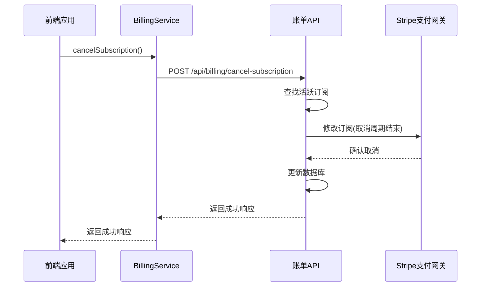

**Diagram sources**
- [billing-service.api.ts](file://frontend/src/api/billing-service/billing-service.api.ts#L76-L81)
- [billing.py](file://enterprise/server/routes/billing.py#L156-L210)

**Section sources**
- [billing-service.api.ts](file://frontend/src/api/billing-service/billing-service.api.ts#L16-L85)
- [billing.py](file://enterprise/server/routes/billing.py#L246-L617)

## 前端集成示例
以下示例展示了如何在前端应用中集成账单服务。

### 支付表单组件
```mermaid
flowchart TD
A[支付表单] --> B[显示当前余额]
A --> C[输入充值金额]
A --> D[验证金额有效性]
A --> E[创建支付会话]
A --> F[重定向到Stripe]
B --> G[调用getBalance()]
C --> H[输入验证]
D --> I[调用createCheckoutSession()]
E --> J[处理重定向]
```

**Diagram sources**
- [payment-form.tsx](file://frontend/src/components/features/payment/payment-form.tsx#L31-L88)

### 支付方式设置模态框
```mermaid
flowchart TD
A[设置支付方式模态框] --> B[显示欢迎信息]
A --> C[创建客户设置会话]
A --> D[重定向到Stripe]
B --> E[显示50美元优惠]
C --> F[调用createBillingSessionResponse()]
D --> G[处理重定向]
```

**Diagram sources**
- [setup-payment-modal.tsx](file://frontend/src/components/features/payment/setup-payment-modal.tsx#L1-L51)

**Section sources**
- [payment-form.tsx](file://frontend/src/components/features/payment/payment-form.tsx#L31-L88)
- [setup-payment-modal.tsx](file://frontend/src/components/features/payment/setup-payment-modal.tsx#L1-L51)

## 错误处理策略
账单服务实现了全面的错误处理机制，确保用户体验的流畅性。

### 前端错误处理
```mermaid
flowchart TD
A[API调用] --> B{成功?}
B --> |是| C[处理成功响应]
B --> |否| D[捕获错误]
D --> E[显示错误Toast]
D --> F[记录错误]
D --> G[提供重试选项]
E --> H[使用displayErrorToast()]
F --> I[使用错误日志]
G --> J[显示重试按钮]
```

**Diagram sources**
- [setup-payment-modal.tsx](file://frontend/src/components/features/payment/setup-payment-modal.tsx#L18-L20)
- [billing.tsx](file://frontend/src/routes/billing.tsx#L19-L21)

### 服务器端错误处理
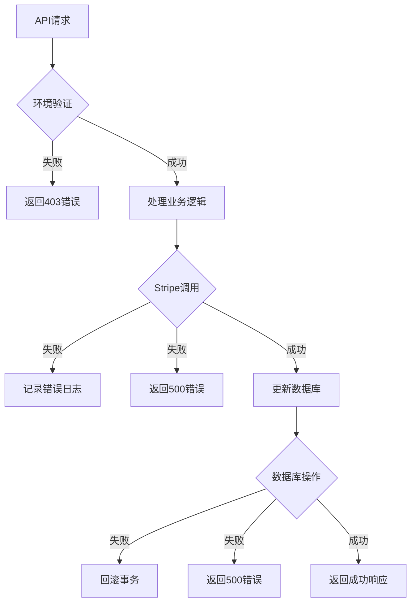

**Diagram sources**
- [billing.py](file://enterprise/server/routes/billing.py#L50-L65)
- [billing.py](file://enterprise/server/routes/billing.py#L212-L224)

**Section sources**
- [setup-payment-modal.tsx](file://frontend/src/components/features/payment/setup-payment-modal.tsx#L18-L20)
- [billing.tsx](file://frontend/src/routes/billing.tsx#L19-L21)
- [billing.py](file://enterprise/server/routes/billing.py#L50-L65)

## 支付流程实现
完整的支付流程包括前端集成、API调用和后端处理。

### 支付流程序列图
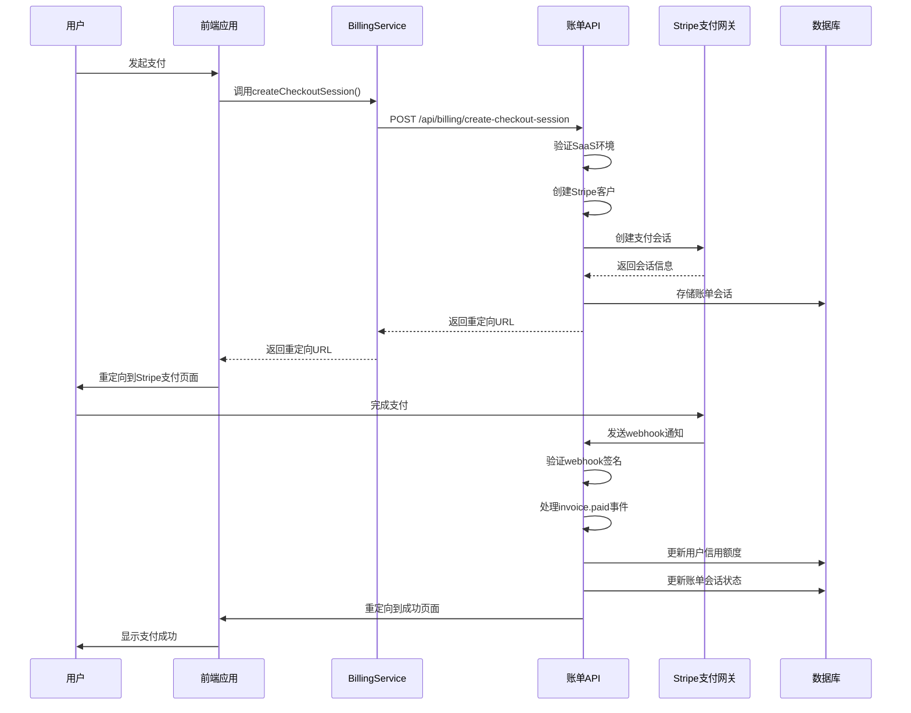

**Diagram sources**
- [billing-service.api.ts](file://frontend/src/api/billing-service/billing-service.api.ts#L16-L24)
- [billing.py](file://enterprise/server/routes/billing.py#L246-L462)
- [billing.py](file://enterprise/server/routes/billing.py#L508-L617)

### 支付回调处理
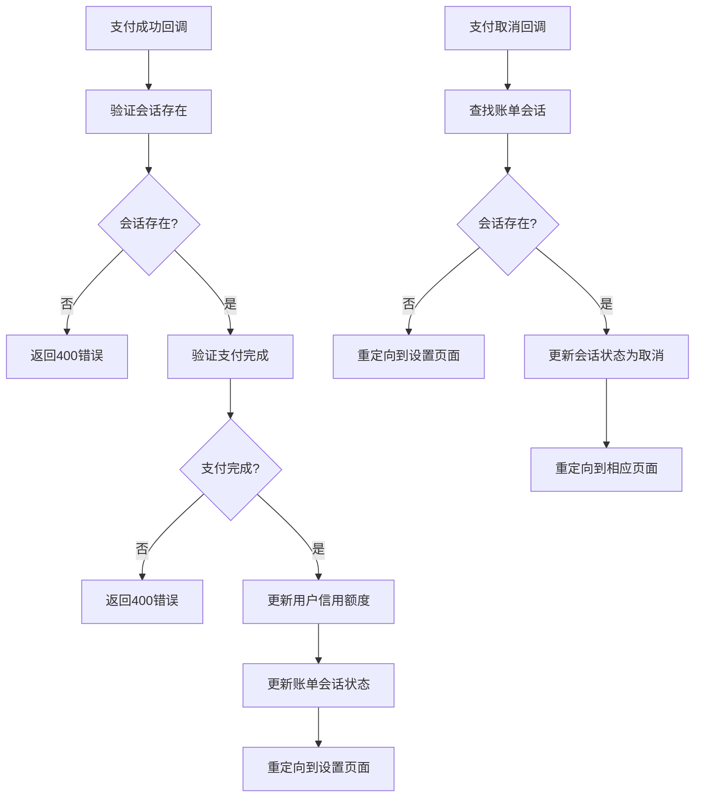

**Diagram sources**
- [billing.py](file://enterprise/server/routes/billing.py#L394-L462)
- [billing.py](file://enterprise/server/routes/billing.py#L466-L505)

**Section sources**
- [billing-service.api.ts](file://frontend/src/api/billing-service/billing-service.api.ts#L16-L85)
- [billing.py](file://enterprise/server/routes/billing.py#L246-L617)
- [payment-form.tsx](file://frontend/src/components/features/payment/payment-form.tsx#L31-L88)
- [billing.tsx](file://frontend/src/routes/billing.tsx#L11-L29)