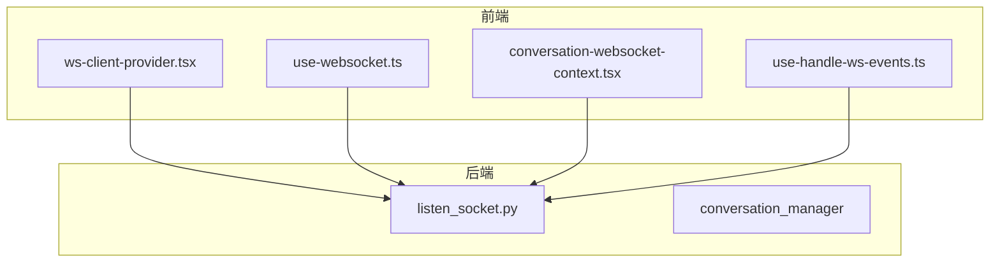
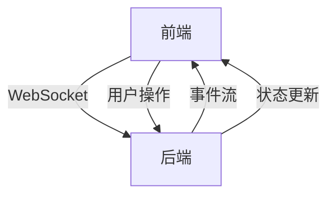
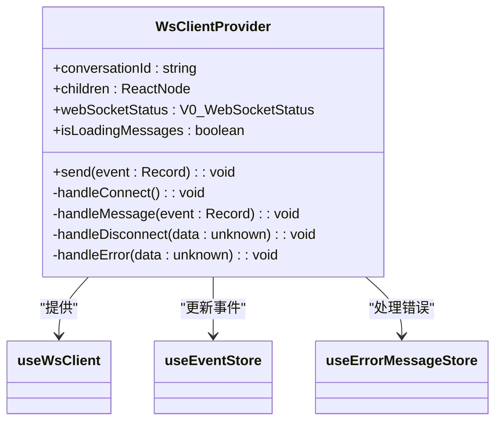
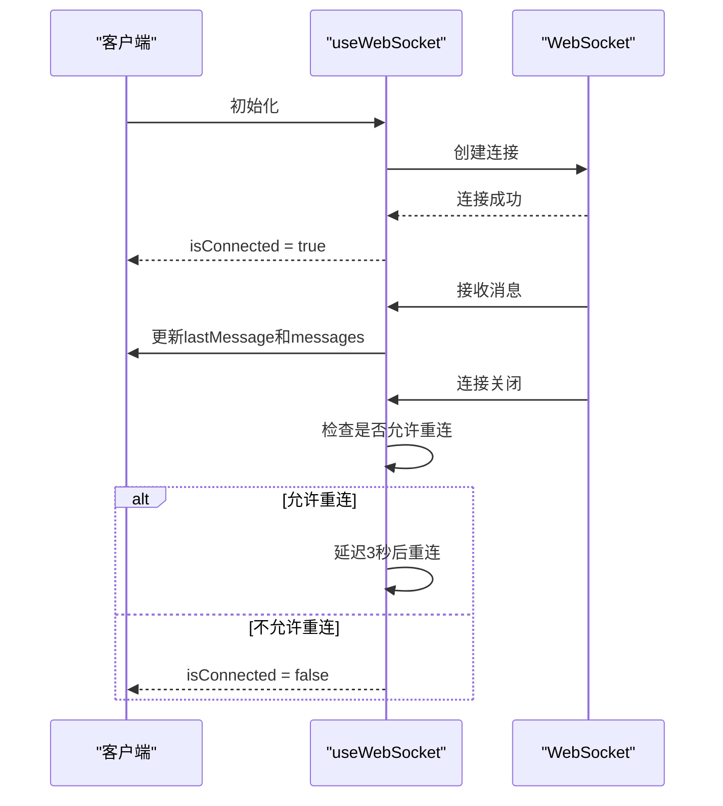
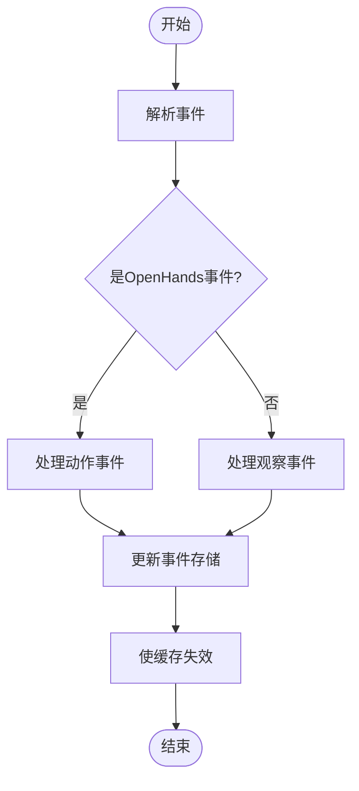
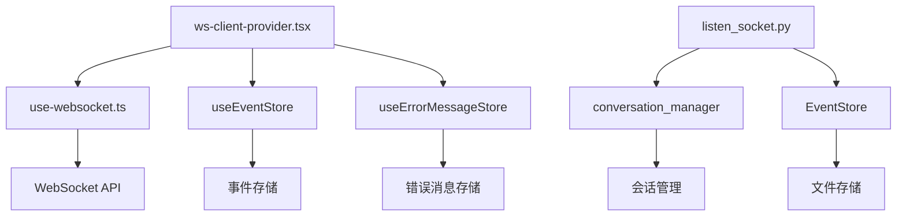

# WebSocket 通信

<cite>
**本文档引用的文件**
- [ws-client-provider.tsx](file://frontend/src/context/ws-client-provider.tsx)
- [use-websocket.ts](file://frontend/src/hooks/use-websocket.ts)
- [conversation-websocket-context.tsx](file://frontend/src/contexts/conversation-websocket-context.tsx)
- [use-handle-ws-events.ts](file://frontend/src/hooks/use-handle-ws-events.ts)
- [listen_socket.py](file://openhands/server/listen_socket.py)
- [buildWebSocketUrl.ts](file://frontend/src/utils/websocket-url.ts)
- [event-logger.ts](file://frontend/src/utils/event-logger.ts)
</cite>

## 目录
1. [引言](#引言)
2. [项目结构](#项目结构)
3. [核心组件](#核心组件)
4. [架构概述](#架构概述)
5. [详细组件分析](#详细组件分析)
6. [依赖分析](#依赖分析)
7. [性能考虑](#性能考虑)
8. [故障排除指南](#故障排除指南)
9. [结论](#结论)

## 引言
本文档详细阐述了OpenHands项目中WebSocket通信机制的实现，重点关注前端如何通过WebSocket与后端建立实时连接以接收事件流。文档详细说明了`ws-client-provider.tsx`中的连接管理、心跳检测和自动重连机制，分析了`use-websocket.ts`和`use-handle-ws-events.ts`钩子函数的实现，包括消息解析、事件分发和状态更新逻辑。同时，文档描述了聊天服务和代理状态服务如何处理实时事件（如代理输出、运行时状态变更、任务进度更新），并提供了WebSocket消息格式的详细规范，包括事件类型、数据结构和错误处理策略。

## 项目结构
OpenHands项目的WebSocket通信机制主要分布在前端和后端两个部分。前端代码位于`frontend/src`目录下，主要包括WebSocket客户端提供者、钩子函数和上下文管理器。后端代码位于`openhands/server`目录下，主要负责WebSocket服务器的监听和事件处理。

**图表来源**
- [ws-client-provider.tsx](file://frontend/src/context/ws-client-provider.tsx)
- [use-websocket.ts](file://frontend/src/hooks/use-websocket.ts)
- [conversation-websocket-context.tsx](file://frontend/src/contexts/conversation-websocket-context.tsx)
- [use-handle-ws-events.ts](file://frontend/src/hooks/use-handle-ws-events.ts)
- [listen_socket.py](file://openhands/server/listen_socket.py)

**章节来源**
- [ws-client-provider.tsx](file://frontend/src/context/ws-client-provider.tsx)
- [use-websocket.ts](file://frontend/src/hooks/use-websocket.ts)
- [conversation-websocket-context.tsx](file://frontend/src/contexts/conversation-websocket-context.tsx)
- [use-handle-ws-events.ts](file://frontend/src/hooks/use-handle-ws-events.ts)
- [listen_socket.py](file://openhands/server/listen_socket.py)

## 核心组件
本文档的核心组件包括WebSocket客户端提供者、钩子函数、上下文管理器和后端事件处理服务。这些组件共同协作，实现了前端与后端之间的实时通信。

**章节来源**
- [ws-client-provider.tsx](file://frontend/src/context/ws-client-provider.tsx)
- [use-websocket.ts](file://frontend/src/hooks/use-websocket.ts)
- [conversation-websocket-context.tsx](file://frontend/src/contexts/conversation-websocket-context.tsx)
- [use-handle-ws-events.ts](file://frontend/src/hooks/use-handle-ws-events.ts)
- [listen_socket.py](file://openhands/server/listen_socket.py)

## 架构概述
OpenHands的WebSocket通信架构采用客户端-服务器模式，前端通过WebSocket与后端建立长连接，实现实时事件流的双向通信。前端使用Socket.IO客户端库与后端的Socket.IO服务器进行通信。

**图表来源**
- [ws-client-provider.tsx](file://frontend/src/context/ws-client-provider.tsx)
- [listen_socket.py](file://openhands/server/listen_socket.py)

## 详细组件分析

### WebSocket客户端提供者分析
`ws-client-provider.tsx`是WebSocket客户端的核心提供者，负责管理WebSocket连接的生命周期，包括连接、断开、重连等操作。

**图表来源**
- [ws-client-provider.tsx](file://frontend/src/context/ws-client-provider.tsx)

**章节来源**
- [ws-client-provider.tsx](file://frontend/src/context/ws-client-provider.tsx)

### 钩子函数分析
`use-websocket.ts`钩子函数封装了WebSocket的连接管理、心跳检测和自动重连机制，为上层组件提供简洁的API。

**图表来源**
- [use-websocket.ts](file://frontend/src/hooks/use-websocket.ts)

**章节来源**
- [use-websocket.ts](file://frontend/src/hooks/use-websocket.ts)

### 事件处理分析
`use-handle-ws-events.ts`钩子函数负责处理WebSocket接收到的事件，包括消息解析、事件分发和状态更新。

**图表来源**
- [use-handle-ws-events.ts](file://frontend/src/hooks/use-handle-ws-events.ts)

**章节来源**
- [use-handle-ws-events.ts](file://frontend/src/hooks/use-handle-ws-events.ts)

## 依赖分析
WebSocket通信机制依赖于多个前端和后端组件，这些组件之间存在复杂的依赖关系。

**图表来源**
- [ws-client-provider.tsx](file://frontend/src/context/ws-client-provider.tsx)
- [use-websocket.ts](file://frontend/src/hooks/use-websocket.ts)
- [listen_socket.py](file://openhands/server/listen_socket.py)

**章节来源**
- [ws-client-provider.tsx](file://frontend/src/context/ws-client-provider.tsx)
- [use-websocket.ts](file://frontend/src/hooks/use-websocket.ts)
- [listen_socket.py](file://openhands/server/listen_socket.py)

## 性能考虑
WebSocket通信机制在设计时考虑了多个性能因素，包括连接管理、消息处理和错误处理。

- **连接管理**: 使用自动重连机制，确保连接的稳定性。
- **消息处理**: 使用事件存储和缓存机制，提高消息处理效率。
- **错误处理**: 提供详细的错误信息和处理策略，确保系统的健壮性。

## 故障排除指南
在使用WebSocket通信机制时，可能会遇到以下常见问题：

- **连接失败**: 检查网络连接和服务器状态。
- **消息丢失**: 检查事件存储和缓存机制。
- **性能问题**: 检查连接管理和消息处理逻辑。

**章节来源**
- [ws-client-provider.tsx](file://frontend/src/context/ws-client-provider.tsx)
- [use-websocket.ts](file://frontend/src/hooks/use-websocket.ts)
- [listen_socket.py](file://openhands/server/listen_socket.py)

## 结论
OpenHands项目的WebSocket通信机制通过前端和后端的紧密协作，实现了高效、稳定的实时通信。通过详细的文档和代码分析，我们可以更好地理解和使用这一机制，为开发和维护提供有力支持。