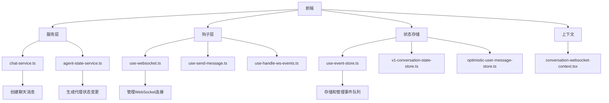
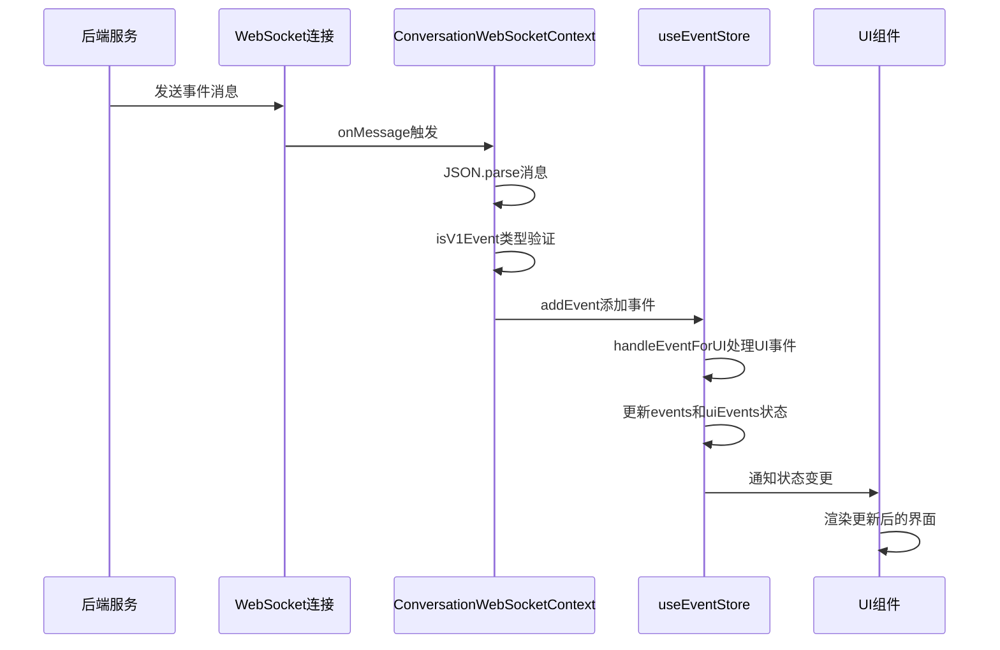
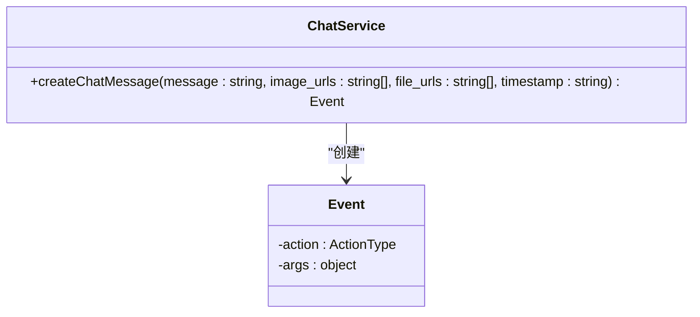
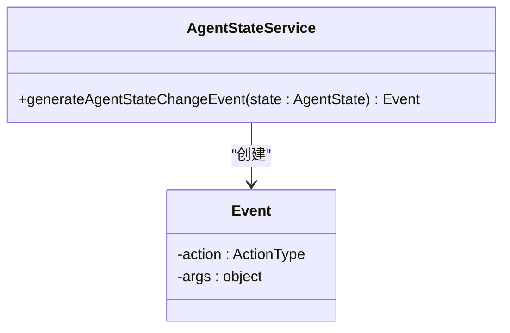
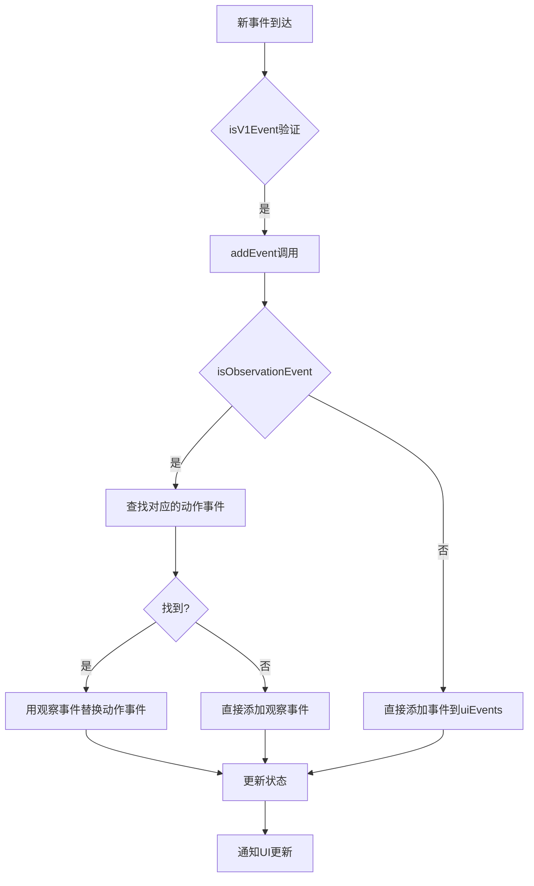
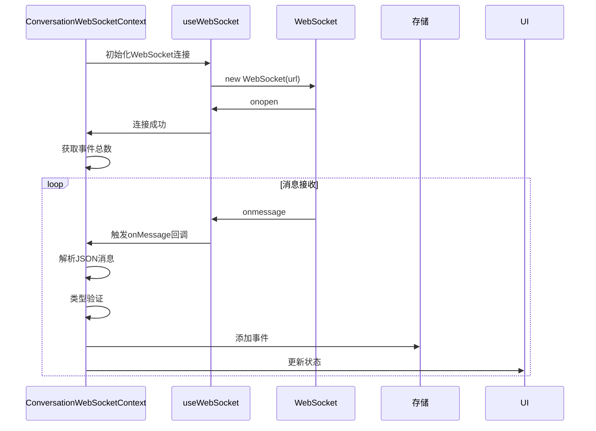
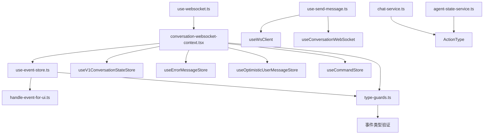

# 事件服务

<cite>
**本文档引用的文件**  
- [chat-service.ts](file://frontend/src/services/chat-service.ts)
- [agent-state-service.ts](file://frontend/src/services/agent-state-service.ts)
- [use-event-store.ts](file://frontend/src/stores/use-event-store.ts)
- [use-websocket.ts](file://frontend/src/hooks/use-websocket.ts)
- [conversation-websocket-context.tsx](file://frontend/src/contexts/conversation-websocket-context.tsx)
- [use-send-message.ts](file://frontend/src/hooks/use-send-message.ts)
- [handle-event-for-ui.ts](file://frontend/src/utils/handle-event-for-ui.ts)
- [type-guards.ts](file://frontend/src/types/v1/type-guards.ts)
- [v1-conversation-state-store.ts](file://frontend/src/stores/v1-conversation-state-store.ts)
- [optimistic-user-message-store.ts](file://frontend/src/stores/optimistic-user-message-store.ts)
- [websocket-url.ts](file://frontend/src/utils/websocket-url.ts)
</cite>

## 目录
1. [项目结构](#项目结构)
2. [核心组件](#核心组件)
3. [架构概述](#架构概述)
4. [详细组件分析](#详细组件分析)
5. [依赖分析](#依赖分析)
6. [性能考虑](#性能考虑)
7. [故障排除指南](#故障排除指南)
8. [结论](#结论)

## 项目结构

前端事件处理系统位于 `frontend/src` 目录下，主要包含服务、钩子、存储和上下文组件。事件处理逻辑集中在 `services`、`hooks` 和 `stores` 目录中，通过 WebSocket 实现与后端的实时通信。

**图示来源**  
- [chat-service.ts](file://frontend/src/services/chat-service.ts)
- [agent-state-service.ts](file://frontend/src/services/agent-state-service.ts)
- [use-websocket.ts](file://frontend/src/hooks/use-websocket.ts)
- [use-event-store.ts](file://frontend/src/stores/use-event-store.ts)

**本节来源**  
- [frontend/src/services](file://frontend/src/services)
- [frontend/src/hooks](file://frontend/src/hooks)
- [frontend/src/stores](file://frontend/src/stores)
- [frontend/src/contexts](file://frontend/src/contexts)

## 核心组件

WebSocket事件服务的核心组件包括事件生成服务、事件存储机制和WebSocket通信层。`chat-service.ts` 和 `agent-state-service.ts` 负责创建标准化的事件对象，`use-event-store.ts` 管理事件队列和状态同步，`use-websocket.ts` 处理底层WebSocket连接。

**本节来源**  
- [chat-service.ts](file://frontend/src/services/chat-service.ts#L1-L15)
- [agent-state-service.ts](file://frontend/src/services/agent-state-service.ts#L1-L8)
- [use-event-store.ts](file://frontend/src/stores/use-event-store.ts#L1-L39)

## 架构概述

系统采用分层架构，前端通过WebSocket与后端建立持久连接，实现双向实时通信。事件流从后端通过WebSocket推送至前端，经过类型验证和处理后存储在Zustand状态管理中，并通知UI组件更新。

**图示来源**  
- [conversation-websocket-context.tsx](file://frontend/src/contexts/conversation-websocket-context.tsx#L110-L178)
- [use-event-store.ts](file://frontend/src/stores/use-event-store.ts#L20-L31)
- [handle-event-for-ui.ts](file://frontend/src/utils/handle-event-for-ui.ts#L8-L32)

## 详细组件分析

### 聊天服务分析

`chat-service.ts` 提供了创建聊天消息事件的功能，将用户输入转换为标准化的事件对象，包含消息内容、图片和文件URL等信息。

**图示来源**  
- [chat-service.ts](file://frontend/src/services/chat-service.ts#L3-L13)

**本节来源**  
- [chat-service.ts](file://frontend/src/services/chat-service.ts#L1-L15)

### 代理状态服务分析

`agent-state-service.ts` 负责生成代理状态变更事件，允许前端控制代理的执行状态（如暂停、恢复、终止等）。

**图示来源**  
- [agent-state-service.ts](file://frontend/src/services/agent-state-service.ts#L4-L7)

**本节来源**  
- [agent-state-service.ts](file://frontend/src/services/agent-state-service.ts#L1-L8)

### 事件存储机制分析

`use-event-store.ts` 使用Zustand实现事件存储，维护两个事件队列：原始事件队列和UI事件队列。通过`handleEventForUI`函数处理观察事件对动作事件的替换，确保UI显示最新的执行结果。

**图示来源**  
- [use-event-store.ts](file://frontend/src/stores/use-event-store.ts#L20-L31)
- [handle-event-for-ui.ts](file://frontend/src/utils/handle-event-for-ui.ts#L8-L32)

**本节来源**  
- [use-event-store.ts](file://frontend/src/stores/use-event-store.ts#L1-L39)
- [handle-event-for-ui.ts](file://frontend/src/utils/handle-event-for-ui.ts#L1-L33)

### WebSocket通信分析

`use-websocket.ts` 封装了WebSocket的连接管理，提供自动重连、错误处理和消息收发功能。`conversation-websocket-context.tsx` 基于此构建了会话特定的WebSocket上下文，处理事件的接收和分发。

**图示来源**  
- [use-websocket.ts](file://frontend/src/hooks/use-websocket.ts#L37-L118)
- [conversation-websocket-context.tsx](file://frontend/src/contexts/conversation-websocket-context.tsx#L110-L178)

**本节来源**  
- [use-websocket.ts](file://frontend/src/hooks/use-websocket.ts#L1-L193)
- [conversation-websocket-context.tsx](file://frontend/src/contexts/conversation-websocket-context.tsx#L1-L328)

## 依赖分析

事件服务系统依赖多个前端组件协同工作，形成完整的事件处理链路。各组件之间的依赖关系确保了事件从接收、处理到UI更新的完整流程。

**图示来源**  
- [use-websocket.ts](file://frontend/src/hooks/use-websocket.ts)
- [conversation-websocket-context.tsx](file://frontend/src/contexts/conversation-websocket-context.tsx)
- [use-event-store.ts](file://frontend/src/stores/use-event-store.ts)
- [use-send-message.ts](file://frontend/src/hooks/use-send-message.ts)
- [type-guards.ts](file://frontend/src/types/v1/type-guards.ts)

**本节来源**  
- [frontend/src/hooks](file://frontend/src/hooks)
- [frontend/src/contexts](file://frontend/src/contexts)
- [frontend/src/stores](file://frontend/src/stores)
- [frontend/src/services](file://frontend/src/services)
- [frontend/src/types](file://frontend/src/types)

## 性能考虑

事件服务在性能方面进行了多项优化，包括事件队列管理、状态更新优化和内存使用控制。通过批量状态更新和选择性渲染，减少了不必要的UI重绘。

**本节来源**  
- [use-event-store.ts](file://frontend/src/stores/use-event-store.ts)
- [conversation-websocket-context.tsx](file://frontend/src/contexts/conversation-websocket-context.tsx)
- [use-websocket.ts](file://frontend/src/hooks/use-websocket.ts)

## 故障排除指南

当遇到WebSocket连接问题或事件处理异常时，可参考以下常见问题的解决方案：

**本节来源**  
- [use-websocket.ts](file://frontend/src/hooks/use-websocket.ts#L73-L113)
- [conversation-websocket-context.tsx](file://frontend/src/contexts/conversation-websocket-context.tsx#L227-L243)

## 结论

WebSocket事件服务为前端提供了实时处理代理会话事件的能力，通过分层架构实现了关注点分离。事件生成、存储和通信组件各司其职，共同构建了稳定高效的实时通信系统。