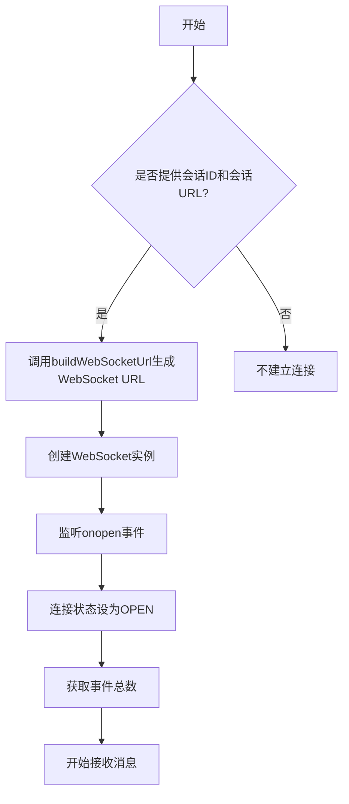
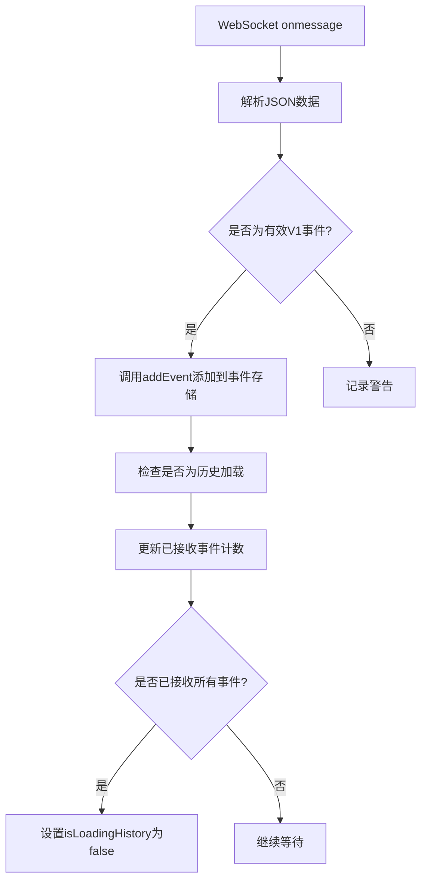
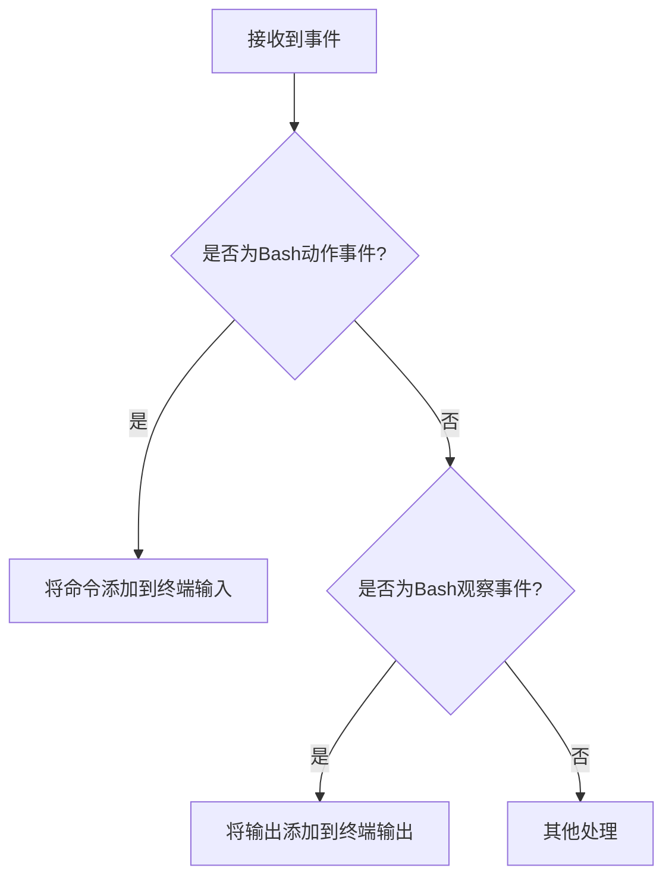

# 消息处理

<cite>
**本文档引用的文件**  
- [use-handle-ws-events.ts](file://frontend/src/hooks/use-handle-ws-events.ts)
- [conversation-websocket-context.tsx](file://frontend/src/contexts/conversation-websocket-context.tsx)
- [use-websocket.ts](file://frontend/src/hooks/use-websocket.ts)
- [v1-conversation-service.types.ts](file://frontend/src/api/conversation-service/v1-conversation-service.types.ts)
- [type-guards.ts](file://frontend/src/types/v1/type-guards.ts)
- [use-event-store.ts](file://frontend/src/stores/use-event-store.ts)
- [websocket-url.ts](file://frontend/src/utils/websocket-url.ts)
- [handle-event-for-ui.ts](file://frontend/src/utils/handle-event-for-ui.ts)
- [custom-toast-handlers.tsx](file://frontend/src/utils/custom-toast-handlers.tsx)
</cite>

## 目录
1. [引言](#引言)
2. [WebSocket连接建立](#websocket连接建立)
3. [消息接收与解析流程](#消息接收与解析流程)
4. [消息分发机制](#消息分发机制)
5. [错误处理与用户反馈](#错误处理与用户反馈)
6. [消息格式规范](#消息格式规范)
7. [状态更新处理](#状态更新处理)
8. [结论](#结论)

## 引言

本文档详细阐述了OpenHands前端应用中WebSocket消息处理机制的实现。系统通过WebSocket协议实现实时通信，前端能够接收、解析和处理来自后端的各种消息，包括代理输出、运行时状态、任务进度等。核心机制集中在`use-handle-ws-events.ts`文件中实现的消息分发逻辑，以及相关的上下文和工具函数。该机制确保了用户界面能够及时响应后端事件，提供流畅的交互体验。

## WebSocket连接建立

前端通过`ConversationWebSocketProvider`组件建立与后端的WebSocket连接。连接的建立依赖于会话ID和会话URL，通过`buildWebSocketUrl`工具函数生成正确的WebSocket地址。



**Diagram sources**
- [conversation-websocket-context.tsx](file://frontend/src/contexts/conversation-websocket-context.tsx#L80-L89)
- [websocket-url.ts](file://frontend/src/utils/websocket-url.ts#L39-L54)

**Section sources**
- [conversation-websocket-context.tsx](file://frontend/src/contexts/conversation-websocket-context.tsx#L50-L328)
- [websocket-url.ts](file://frontend/src/utils/websocket-url.ts#L33-L54)

## 消息接收与解析流程

WebSocket消息的接收和解析由`useWebSocket`自定义Hook管理。该Hook封装了原生WebSocket的复杂性，提供了更简洁的API来处理连接、消息接收和错误处理。

消息处理流程如下：
1. WebSocket接收到原始消息（字符串）
2. 在`onMessage`回调中，将消息字符串解析为JSON对象
3. 通过类型守卫（type guards）验证消息结构
4. 将有效事件添加到全局事件存储中
5. 根据事件类型进行相应的UI更新



**Diagram sources**
- [conversation-websocket-context.tsx](file://frontend/src/contexts/conversation-websocket-context.tsx#L110-L178)
- [use-websocket.ts](file://frontend/src/hooks/use-websocket.ts#L67-L71)

**Section sources**
- [conversation-websocket-context.tsx](file://frontend/src/contexts/conversation-websocket-context.tsx#L110-L190)
- [use-websocket.ts](file://frontend/src/hooks/use-websocket.ts#L67-L71)

## 消息分发机制

`use-handle-ws-events.ts`文件实现了核心的消息分发机制，负责处理从WebSocket接收到的各种事件。该机制基于事件类型进行路由，确保不同类型的消息被正确处理。

主要事件类型包括：
- **ServerError**: 服务器错误消息
- **AgentErrorEvent**: 代理执行错误
- **UserMessageEvent**: 用户消息确认
- **ActionEvent**: 代理执行动作
- **ConversationStateUpdateEvent**: 会话状态更新
- **ExecuteBashActionEvent**: Bash命令执行
- **ExecuteBashObservationEvent**: Bash命令输出

```mermaid
flowchart TD
A[接收到事件] --> B{是否为ServerError?}
B --> |是| C[显示错误Toast]
B --> |否| D{是否为error类型?}
D --> |是| E{消息是否以"Agent reached maximum"开头?}
E --> |是| F[发送代理暂停状态变更]
E --> |否| G[忽略]
D --> |否| H[处理为普通事件]
H --> I[通过类型守卫分类处理]
```

**Diagram sources**
- [use-handle-ws-events.ts](file://frontend/src/hooks/use-handle-ws-events.ts#L16-L48)
- [type-guards.ts](file://frontend/src/types/v1/type-guards.ts#L55-L139)

**Section sources**
- [use-handle-ws-events.ts](file://frontend/src/hooks/use-handle-ws-events.ts#L16-L48)
- [type-guards.ts](file://frontend/src/types/v1/type-guards.ts#L19-L180)

## 错误处理与用户反馈

系统实现了多层次的错误处理机制，确保用户能够及时了解系统状态和潜在问题。

### 错误类型处理
- **会话过期错误 (401)**: 显示"会话已过期"的Toast通知
- **服务器错误**: 根据错误信息显示相应的Toast通知
- **代理达到最大迭代次数**: 自动将代理状态设置为暂停
- **WebSocket连接错误**: 显示连接丢失或连接失败的错误信息

### 用户界面反馈
- 使用`displayErrorToast`函数显示错误通知
- 通过`useErrorMessageStore`管理错误消息状态
- 在连接恢复时自动清除之前的错误消息
- 对于临时性错误，提供重试机制

```mermaid
flowchart TD
A[检测到错误] --> B{错误类型}
B --> C[会话过期]
B --> D[服务器错误]
B --> E[代理限制]
B --> F[连接问题]
C --> G[显示"会话已过期"Toast]
D --> H[显示具体错误信息Toast]
E --> I[暂停代理并提示用户]
F --> J[显示连接状态错误]
G --> K[用户可重新登录]
H --> L[用户可重试操作]
I --> M[用户可调整设置后继续]
J --> N[系统自动重连]
```

**Diagram sources**
- [use-handle-ws-events.ts](file://frontend/src/hooks/use-handle-ws-events.ts#L27-L37)
- [custom-toast-handlers.tsx](file://frontend/src/utils/custom-toast-handlers.tsx)
- [conversation-websocket-context.tsx](file://frontend/src/contexts/conversation-websocket-context.tsx#L231-L243)

**Section sources**
- [use-handle-ws-events.ts](file://frontend/src/hooks/use-handle-ws-events.ts#L8-L48)
- [conversation-websocket-context.tsx](file://frontend/src/contexts/conversation-websocket-context.tsx#L227-L243)

## 消息格式规范

WebSocket消息遵循严格的JSON格式规范，确保前后端通信的一致性和可靠性。

### 消息头部信息
所有消息都必须包含以下基本字段：
- `id`: 事件唯一标识符（字符串）
- `timestamp`: 事件时间戳（ISO 8601格式）
- `source`: 事件来源（"agent"、"user"或"environment"）

### 负载结构
消息负载根据事件类型有不同的结构：

#### 通用消息结构
```json
{
  "id": "string",
  "timestamp": "string",
  "source": "string",
  "type": "string"
}
```

#### V1消息发送请求
```json
{
  "role": "user" | "system" | "assistant" | "tool",
  "content": [
    {
      "type": "text" | "image_url",
      "text?": "string",
      "image_url?": {
        "url": "string"
      }
    }
  ]
}
```

### 序列化/反序列化处理
- 发送消息时：JavaScript对象 → JSON.stringify() → WebSocket发送
- 接收消息时：WebSocket接收 → JSON.parse() → JavaScript对象 → 类型验证

**Section sources**
- [v1-conversation-service.types.ts](file://frontend/src/api/conversation-service/v1-conversation-service.types.ts#L7-L20)
- [type-guards.ts](file://frontend/src/types/v1/type-guards.ts#L24-L39)

## 状态更新处理

系统通过特定的事件类型来处理运行时状态的更新，确保用户界面与后端状态保持同步。

### 状态更新事件类型
- **ConversationStateUpdateEvent**: 通用会话状态更新
- **FullStateConversationStateUpdateEvent**: 完整状态更新
- **AgentStatusConversationStateUpdateEvent**: 代理状态更新

### 状态处理流程
当接收到状态更新事件时，系统会：
1. 验证事件是否为状态更新类型
2. 根据具体的键值（key）更新相应的状态
3. 更新UI组件显示

例如，当接收到执行状态更新时：
```typescript
if (isAgentStatusConversationStateUpdateEvent(event)) {
  setExecutionStatus(event.value);
}
```

### Bash命令处理
系统特别处理Bash相关的事件，以提供终端式交互体验：
- **ExecuteBashActionEvent**: 将执行的命令添加到终端输入
- **ExecuteBashObservationEvent**: 将命令输出添加到终端输出



**Diagram sources**
- [conversation-websocket-context.tsx](file://frontend/src/contexts/conversation-websocket-context.tsx#L154-L172)
- [type-guards.ts](file://frontend/src/types/v1/type-guards.ts#L98-L110)

**Section sources**
- [conversation-websocket-context.tsx](file://frontend/src/contexts/conversation-websocket-context.tsx#L154-L172)
- [type-guards.ts](file://frontend/src/types/v1/type-guards.ts#L98-L110)

## 结论

OpenHands的WebSocket消息处理机制是一个健壮、可扩展的实时通信系统。通过`use-handle-ws-events.ts`中的消息分发机制，前端能够高效地处理各种后端事件，包括代理输出、运行时状态和任务进度。消息解析流程确保了数据的完整性和类型安全，而错误处理策略则提供了良好的用户体验。整个系统通过清晰的消息格式规范和状态更新机制，实现了前后端的无缝集成，为用户提供了一个响应迅速、反馈及时的交互界面。