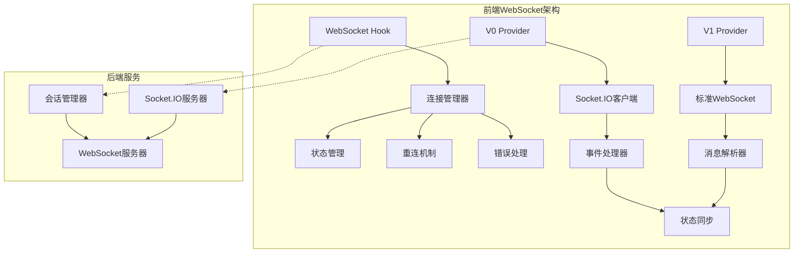
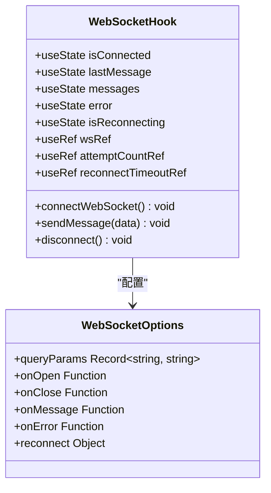
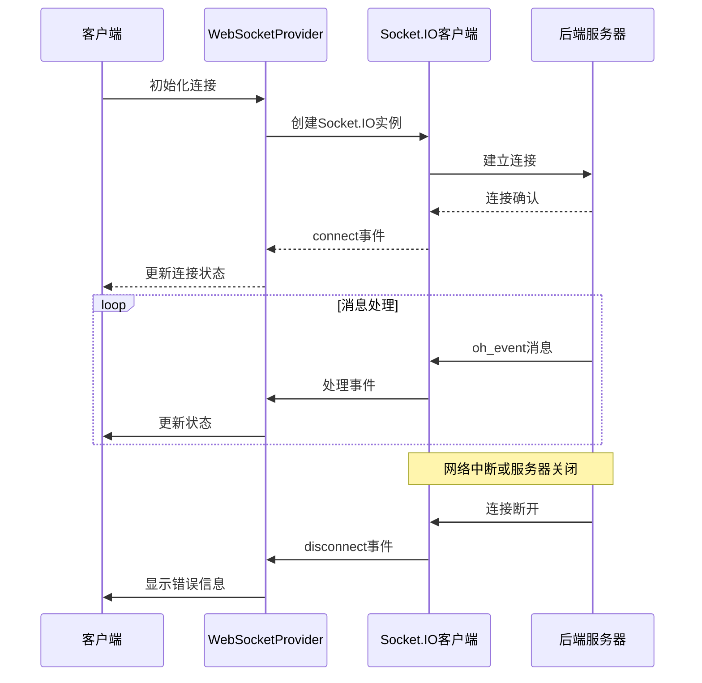
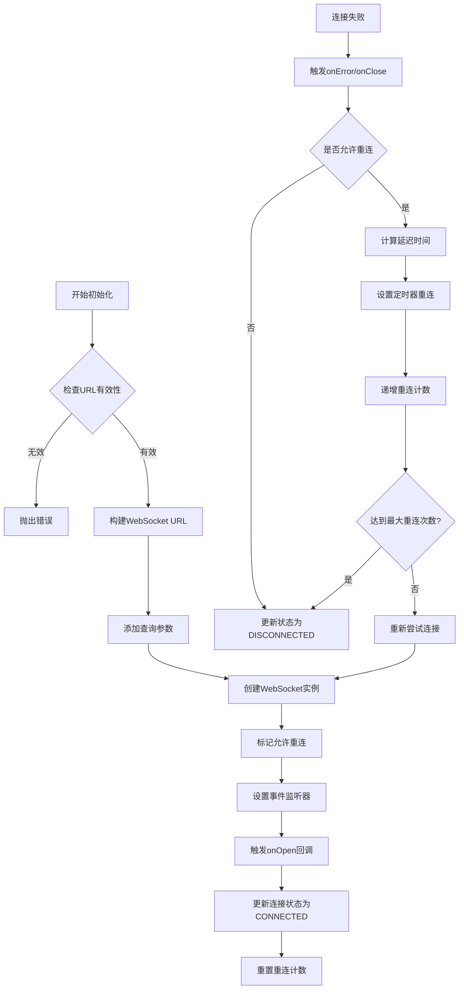
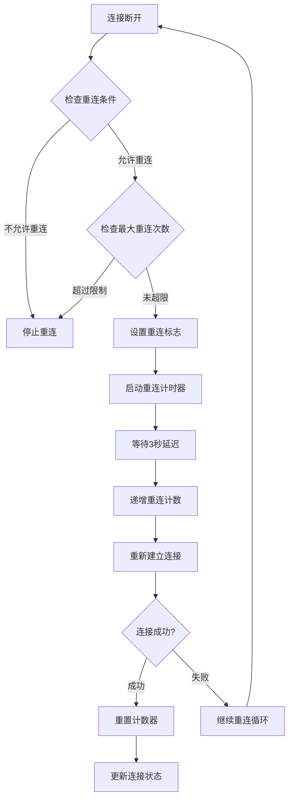
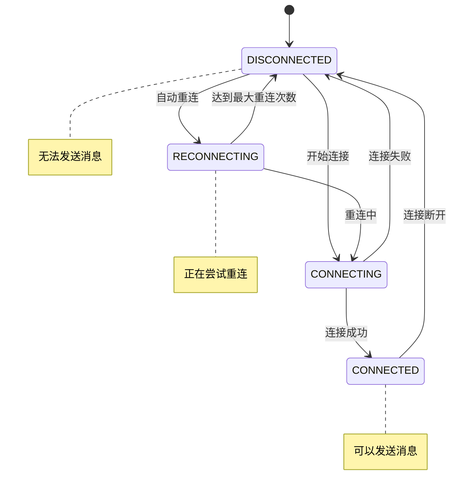

# WebSocket连接管理详细文档

<cite>
**本文档引用的文件**
- [ws-client-provider.tsx](file://frontend/src/context/ws-client-provider.tsx)
- [use-websocket.ts](file://frontend/src/hooks/use-websocket.ts)
- [conversation-websocket-context.tsx](file://frontend/src/contexts/conversation-websocket-context.tsx)
- [conversation-subscriptions-provider.tsx](file://frontend/src/context/conversation-subscriptions-provider.tsx)
- [websocket-url.ts](file://frontend/src/utils/websocket-url.ts)
- [use-unified-websocket-status.ts](file://frontend/src/hooks/use-unified-websocket-status.ts)
- [use-websocket.test.ts](file://frontend/__tests__/hooks/use-websocket.test.ts)
</cite>

## 目录
1. [概述](#概述)
2. [项目架构](#项目架构)
3. [核心组件分析](#核心组件分析)
4. [连接生命周期管理](#连接生命周期管理)
5. [自动重连机制](#自动重连机制)
6. [连接状态管理](#连接状态管理)
7. [错误处理与异常恢复](#错误处理与异常恢复)
8. [配置参数详解](#配置参数详解)
9. [实际应用示例](#实际应用示例)
10. [最佳实践](#最佳实践)

## 概述

OpenHands项目实现了两套WebSocket连接管理系统，分别用于不同版本的对话场景：

- **V0 WebSocket系统**：基于标准WebSocket协议，使用`ws-client-provider.tsx`实现
- **V1 WebSocket系统**：基于Socket.IO协议，使用`conversation-websocket-context.tsx`实现

这两种系统都提供了完整的连接生命周期管理，包括连接建立、心跳检测、自动重连和错误处理机制。

## 项目架构



**图表来源**
- [ws-client-provider.tsx](file://frontend/src/context/ws-client-provider.tsx#L130-L400)
- [conversation-websocket-context.tsx](file://frontend/src/contexts/conversation-websocket-context.tsx#L50-L320)

## 核心组件分析

### WebSocket Hook组件

`useWebSocket` Hook是整个WebSocket连接管理的核心，提供了以下功能：



**图表来源**
- [use-websocket.ts](file://frontend/src/hooks/use-websocket.ts#L15-L192)

### V0 WebSocket提供者

V0系统使用传统的Socket.IO协议，支持复杂的事件处理和状态管理：



**图表来源**
- [ws-client-provider.tsx](file://frontend/src/context/ws-client-provider.tsx#L350-L370)

**章节来源**
- [ws-client-provider.tsx](file://frontend/src/context/ws-client-provider.tsx#L130-L400)
- [use-websocket.ts](file://frontend/src/hooks/use-websocket.ts#L15-L192)

## 连接生命周期管理

### 连接初始化过程

WebSocket连接的初始化遵循严格的生命周期管理：



**图表来源**
- [use-websocket.ts](file://frontend/src/hooks/use-websocket.ts#L37-L113)

### 连接建立机制

连接建立过程包含多个关键步骤：

1. **URL构建**：支持动态查询参数添加
2. **实例创建**：使用`new WebSocket(url)`创建连接
3. **事件绑定**：设置onopen、onmessage、onclose、onerror事件处理器
4. **状态初始化**：重置所有连接相关状态变量

**章节来源**
- [use-websocket.ts](file://frontend/src/hooks/use-websocket.ts#L37-L113)

## 自动重连机制

### 重连策略实现

自动重连机制采用指数退避算法，确保在网络不稳定时能够有效恢复连接：



**图表来源**
- [use-websocket.ts](file://frontend/src/hooks/use-websocket.ts#L98-L112)

### 重连配置参数

| 参数名称 | 类型 | 默认值 | 描述 |
|---------|------|--------|------|
| reconnect.enabled | boolean | false | 是否启用自动重连 |
| reconnect.maxAttempts | number | Infinity | 最大重连次数 |
| retryInterval | number | 3000ms | 重连间隔时间 |

**章节来源**
- [use-websocket.ts](file://frontend/src/hooks/use-websocket.ts#L3-L12)

## 连接状态管理

### 状态类型定义

系统定义了多种连接状态来准确反映当前连接状况：



### 状态转换逻辑

| 当前状态 | 触发事件 | 新状态 | 处理动作 |
|---------|---------|--------|----------|
| DISCONNECTED | 连接成功 | CONNECTED | 清除错误，重置计数 |
| CONNECTED | 连接断开 | DISCONNECTED | 设置错误状态 |
| DISCONNECTED | 重连条件满足 | RECONNECTING | 启动重连计时器 |
| RECONNECTING | 达到最大次数 | DISCONNECTED | 停止重连尝试 |

**章节来源**
- [use-websocket.ts](file://frontend/src/hooks/use-websocket.ts#L19-L23)
- [ws-client-provider.tsx](file://frontend/src/context/ws-client-provider.tsx#L36-L36)

## 错误处理与异常恢复

### 错误分类处理

系统对不同类型的错误进行分类处理：

```mermaid
flowchart TD
A[WebSocket错误] --> B{错误类型判断}
B --> |正常关闭(1000)| C[忽略错误]
B --> |网络错误| D[记录错误日志]
B --> |认证失败| E[显示认证错误]
B --> |服务器错误| F[显示服务器错误]
D --> G[触发重连机制]
E --> H[显示认证提示]
F --> I[显示服务器错误]
G --> J[更新错误状态]
H --> J
I --> J
J --> K[用户界面反馈]
```

**图表来源**
- [use-websocket.ts](file://frontend/src/hooks/use-websocket.ts#L78-L88)

### 异常恢复机制

异常恢复通过多层次的保护机制实现：

1. **连接级别保护**：每个WebSocket实例都有独立的重连控制
2. **状态隔离**：使用WeakSet跟踪可重连的WebSocket实例
3. **优雅降级**：连接失败时提供清晰的错误信息

**章节来源**
- [use-websocket.ts](file://frontend/src/hooks/use-websocket.ts#L74-L88)
- [ws-client-provider.tsx](file://frontend/src/context/ws-client-provider.tsx#L267-L278)

## 配置参数详解

### WebSocket Hook配置

```typescript
interface WebSocketHookOptions {
  queryParams?: Record<string, string | boolean>; // 查询参数
  onOpen?: (event: Event) => void;              // 连接打开回调
  onClose?: (event: CloseEvent) => void;        // 连接关闭回调
  onMessage?: (event: MessageEvent) => void;    // 消息接收回调
  onError?: (event: Event) => void;            // 错误回调
  reconnect?: {                                 // 重连配置
    enabled?: boolean;                          // 是否启用重连
    maxAttempts?: number;                       // 最大重连次数
  };
}
```

### V1 WebSocket配置

V1系统使用Socket.IO特有的配置选项：

| 配置项 | 类型 | 默认值 | 描述 |
|-------|------|--------|------|
| transports | string[] | ["websocket"] | 使用的传输协议 |
| path | string | "/socket.io" | Socket.IO路径 |
| reconnection | boolean | true | 启用自动重连 |
| reconnectionAttempts | number | 5 | 最大重连次数 |
| reconnectionDelay | number | 1000 | 重连延迟时间(ms) |

**章节来源**
- [use-websocket.ts](file://frontend/src/hooks/use-websocket.ts#L3-L12)
- [conversation-subscriptions-provider.tsx](file://frontend/src/context/conversation-subscriptions-provider.tsx#L205-L216)

## 实际应用示例

### 基础WebSocket连接

```typescript
// 基础连接示例
const { isConnected, sendMessage, error } = useWebSocket('ws://localhost:8080');

// 发送消息
sendMessage(JSON.stringify({ type: 'chat', content: 'Hello World' }));

// 检查连接状态
if (isConnected) {
  console.log('WebSocket已连接');
}
```

### 带重连配置的连接

```typescript
// 配置重连的WebSocket连接
const options = {
  reconnect: {
    enabled: true,
    maxAttempts: 5
  },
  queryParams: {
    token: 'your-token',
    userId: 'user123'
  }
};

const { isConnected, isReconnecting, attemptCount } = useWebSocket(
  'ws://localhost:8080/events',
  options
);
```

### V1 WebSocket集成

```typescript
// V1 WebSocket连接示例
<ConversationWebSocketProvider
  conversationId={conversationId}
  conversationUrl={conversation.url}
  sessionApiKey={sessionApiKey}
>
  {/* 子组件 */}
</ConversationWebSocketProvider>
```

**章节来源**
- [use-websocket.test.ts](file://frontend/__tests__/hooks/use-websocket.test.ts#L140-L160)
- [conversation-websocket-context.tsx](file://frontend/src/contexts/conversation-websocket-context.tsx#L50-L60)

## 最佳实践

### 连接管理最佳实践

1. **合理配置重连参数**：根据网络环境调整重连间隔和最大次数
2. **错误处理优先**：始终提供有意义的错误信息给用户
3. **资源清理**：在组件卸载时正确关闭WebSocket连接
4. **状态同步**：保持前端状态与WebSocket连接状态的一致性

### 性能优化建议

1. **连接池管理**：避免同时建立过多的WebSocket连接
2. **消息批处理**：对于高频消息，考虑批量发送
3. **心跳检测**：实现自定义的心跳机制确保连接活跃
4. **缓存策略**：合理缓存历史消息和连接状态

### 安全注意事项

1. **认证令牌**：通过查询参数传递认证信息而非HTTP头
2. **数据验证**：对接收到的消息进行严格的数据验证
3. **连接限制**：实施连接频率限制防止滥用
4. **错误信息**：避免向客户端暴露敏感的错误信息

**章节来源**
- [use-websocket.ts](file://frontend/src/hooks/use-websocket.ts#L121-L156)
- [ws-client-provider.tsx](file://frontend/src/context/ws-client-provider.tsx#L282-L308)