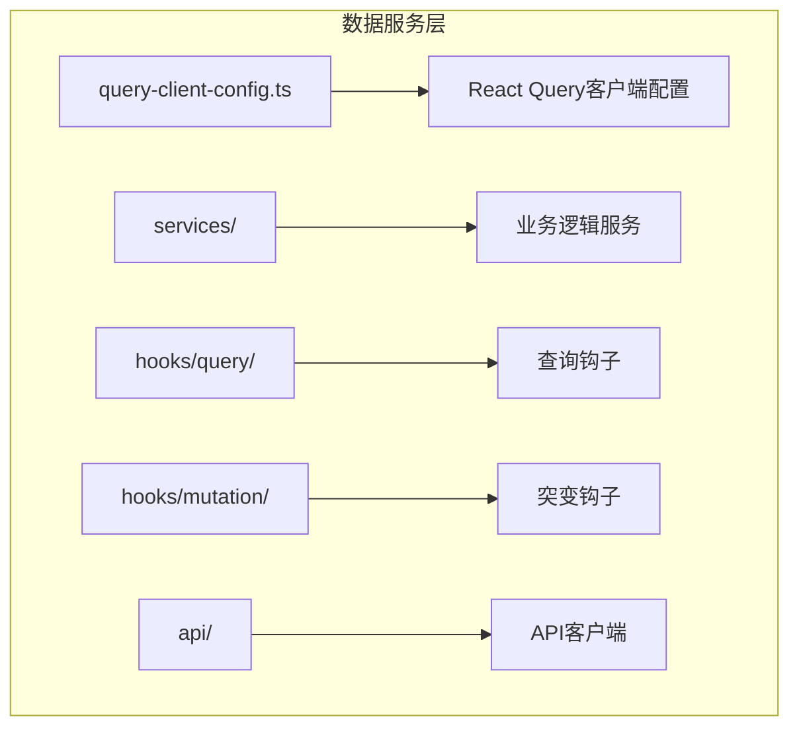
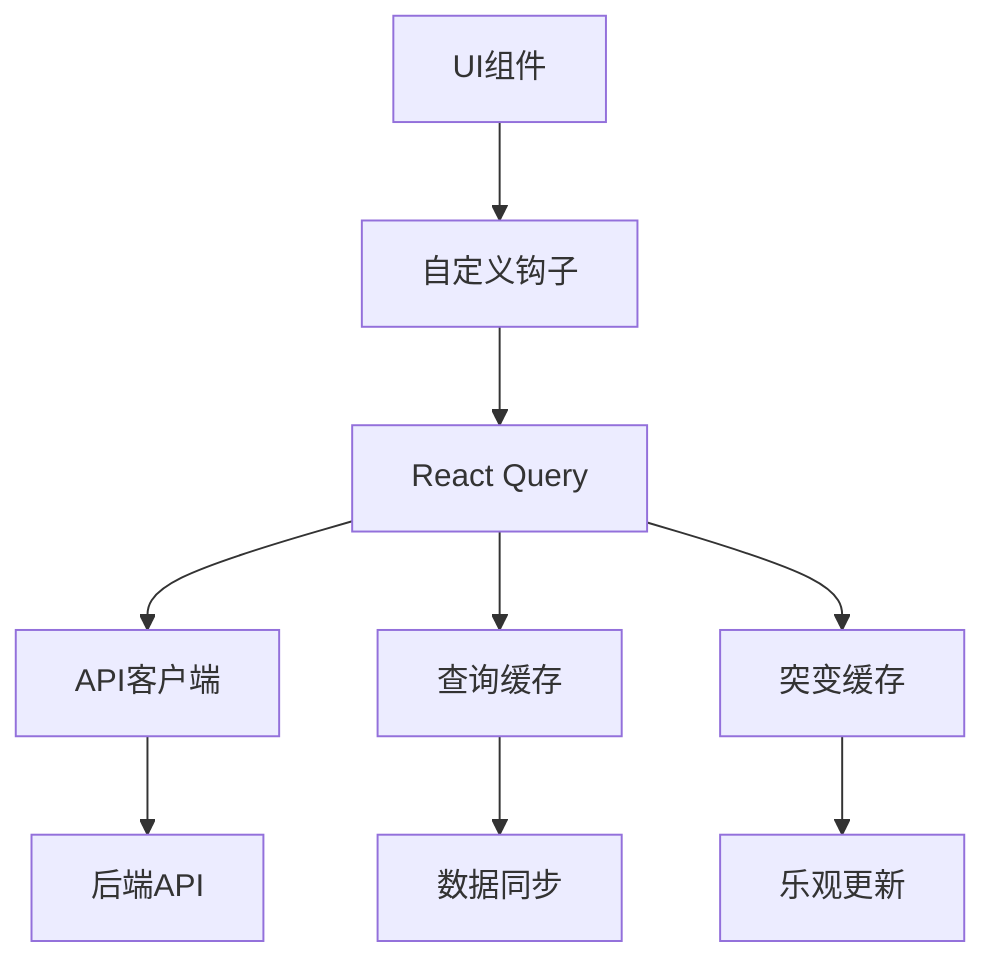
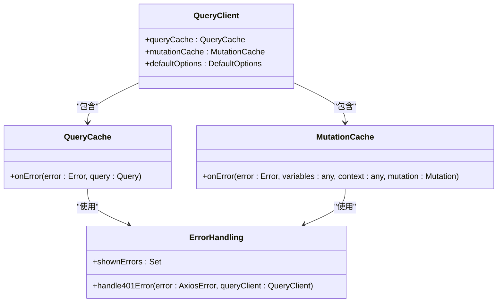
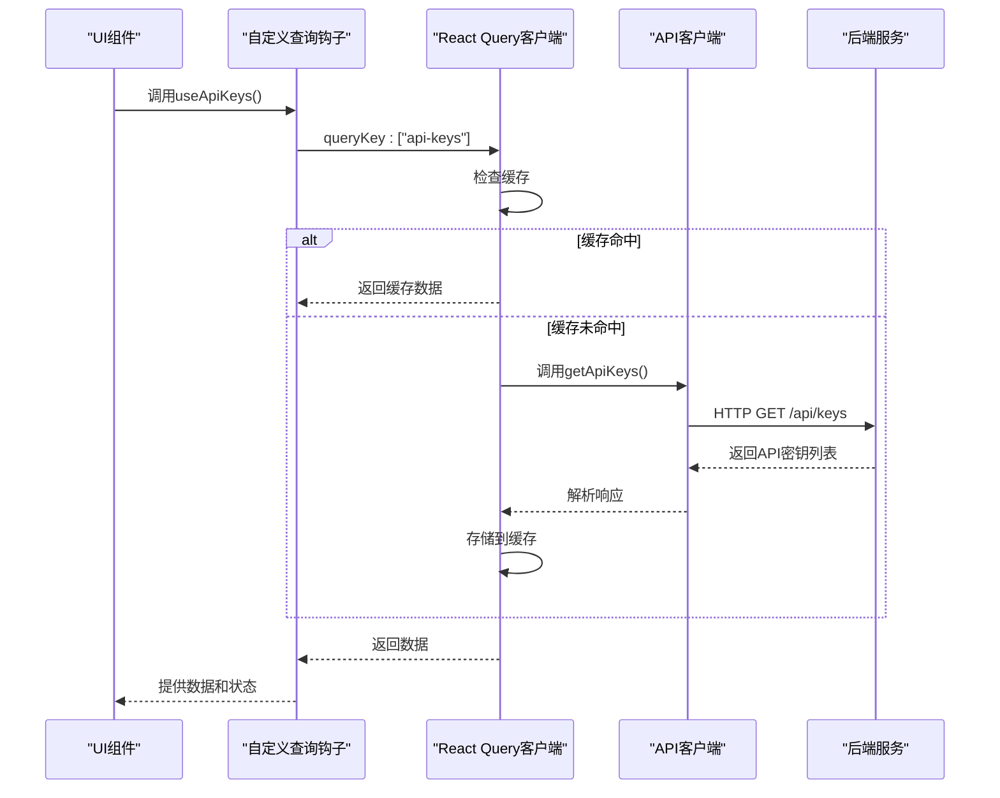
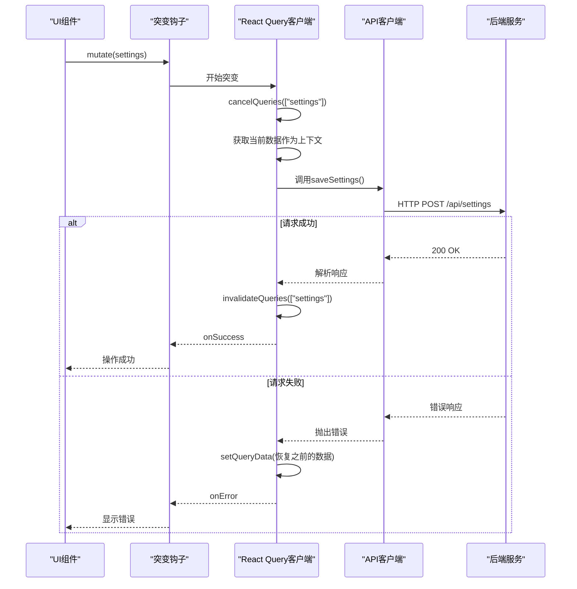
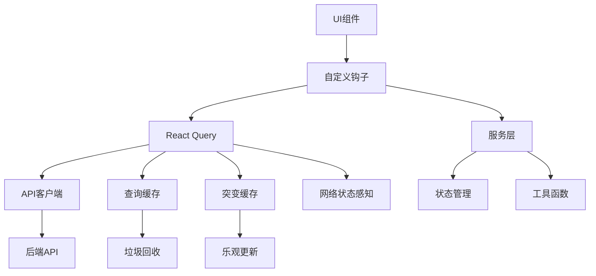

# 数据服务层

<cite>
**本文档中引用的文件**  
- [query-client-config.ts](file://frontend/src/query-client-config.ts)
- [settings.ts](file://frontend/src/services/settings.ts)
- [observations.ts](file://frontend/src/services/observations.ts)
- [actions.ts](file://frontend/src/services/actions.ts)
- [chat-service.ts](file://frontend/src/services/chat-service.ts)
- [agent-state-service.ts](file://frontend/src/services/agent-state-service.ts)
- [use-save-settings.ts](file://frontend/src/hooks/mutation/use-save-settings.ts)
- [use-create-conversation.ts](file://frontend/src/hooks/mutation/use-create-conversation.ts)
- [use-start-conversation.ts](file://frontend/src/hooks/mutation/use-start-conversation.ts)
- [use-api-keys.ts](file://frontend/src/hooks/query/use-api-keys.ts)
- [use-llm-api-key.ts](file://frontend/src/hooks/query/use-llm-api-key.ts)
- [use-config.ts](file://frontend/src/hooks/query/use-config.ts)
- [use-settings.ts](file://frontend/src/hooks/query/use-settings.ts)
</cite>

## 目录
1. [简介](#简介)
2. [项目结构](#项目结构)
3. [核心组件](#核心组件)
4. [架构概述](#架构概述)
5. [详细组件分析](#详细组件分析)
6. [依赖分析](#依赖分析)
7. [性能考虑](#性能考虑)
8. [故障排除指南](#故障排除指南)
9. [结论](#结论)

## 简介
本文档全面介绍了OpenHands项目中基于React Query的数据服务层实现。重点分析了查询缓存、突变操作、客户端配置、查询钩子和突变钩子的实现模式。文档详细阐述了数据同步、乐观更新和错误回滚机制，并描述了服务层如何封装业务逻辑并与API层解耦。

## 项目结构
数据服务层主要位于前端源码的`src`目录下，包含服务、钩子和API客户端等关键组件。



**Diagram sources**
- [query-client-config.ts](file://frontend/src/query-client-config.ts)
- [services/](file://frontend/src/services/)
- [hooks/query/](file://frontend/src/hooks/query/)
- [hooks/mutation/](file://frontend/src/hooks/mutation/)
- [api/](file://frontend/src/api/)

**Section sources**
- [query-client-config.ts](file://frontend/src/query-client-config.ts)
- [services/](file://frontend/src/services/)
- [hooks/query/](file://frontend/src/hooks/query/)
- [hooks/mutation/](file://frontend/src/hooks/mutation/)

## 核心组件
数据服务层的核心组件包括React Query客户端配置、各种服务模块和自定义钩子。这些组件共同实现了高效的数据获取、缓存和状态管理。

**Section sources**
- [query-client-config.ts](file://frontend/src/query-client-config.ts)
- [services/](file://frontend/src/services/)
- [hooks/](file://frontend/src/hooks/)

## 架构概述
数据服务层采用分层架构，将数据获取、业务逻辑和UI展示分离。React Query作为核心状态管理库，负责处理数据缓存、同步和突变操作。



**Diagram sources**
- [query-client-config.ts](file://frontend/src/query-client-config.ts)
- [hooks/](file://frontend/src/hooks/)
- [api/](file://frontend/src/api/)

## 详细组件分析

### 查询客户端配置分析
`query-client-config.ts`文件定义了React Query客户端的全局配置，包括查询缓存、突变缓存和错误处理策略。



**Diagram sources**
- [query-client-config.ts](file://frontend/src/query-client-config.ts)

**Section sources**
- [query-client-config.ts](file://frontend/src/query-client-config.ts)

### 查询钩子实现模式
查询钩子封装了数据获取逻辑，提供类型安全的接口供UI组件使用。`use-api-keys.ts`和`use-settings.ts`等钩子实现了特定数据的查询功能。



**Diagram sources**
- [use-api-keys.ts](file://frontend/src/hooks/query/use-api-keys.ts)
- [use-llm-api-key.ts](file://frontend/src/hooks/query/use-llm-api-key.ts)
- [use-config.ts](file://frontend/src/hooks/query/use-config.ts)

**Section sources**
- [use-api-keys.ts](file://frontend/src/hooks/query/use-api-keys.ts)
- [use-llm-api-key.ts](file://frontend/src/hooks/query/use-llm-api-key.ts)
- [use-config.ts](file://frontend/src/hooks/query/use-config.ts)

### 突变钩子实现模式
突变钩子处理数据修改操作，如创建会话、保存设置等。`use-create-conversation.ts`和`use-save-settings.ts`实现了乐观更新和错误回滚机制。



**Diagram sources**
- [use-save-settings.ts](file://frontend/src/hooks/mutation/use-save-settings.ts)
- [use-create-conversation.ts](file://frontend/src/hooks/mutation/use-create-conversation.ts)
- [use-start-conversation.ts](file://frontend/src/hooks/mutation/use-start-conversation.ts)

**Section sources**
- [use-save-settings.ts](file://frontend/src/hooks/mutation/use-save-settings.ts)
- [use-create-conversation.ts](file://frontend/src/hooks/mutation/use-create-conversation.ts)
- [use-start-conversation.ts](file://frontend/src/hooks/mutation/use-start-conversation.ts)

### 服务层分析
服务层封装了业务逻辑，与API层解耦。`settings.ts`、`observations.ts`等服务模块提供了高层次的业务功能。

```mermaid
classDiagram
class SettingsService {
+saveSettings(settings : PostApiSettings) : Promise<void>
+getSettings() : Promise<Settings>
}
class ObservationsService {
+handleObservationMessage(message : ObservationMessage) : void
}
class ActionsService {
+handleActionMessage(message : ActionMessage) : void
+handleStatusMessage(message : StatusMessage) : void
+handleAssistantMessage(message : Record<string, unknown>) : void
}
class ChatService {
+createChatMessage(message : string, image_urls : string[], file_urls : string[], timestamp : string) : object
}
class AgentStateService {
+generateAgentStateChangeEvent(state : AgentState) : object
}
SettingsService --> "API客户端" : "依赖"
ObservationsService --> "状态存储" : "依赖"
ActionsService --> "状态存储" : "依赖"
ActionsService --> "错误处理" : "依赖"
ActionsService --> "查询客户端" : "依赖"
```

**Diagram sources**
- [settings.ts](file://frontend/src/services/settings.ts)
- [observations.ts](file://frontend/src/services/observations.ts)
- [actions.ts](file://frontend/src/services/actions.ts)
- [chat-service.ts](file://frontend/src/services/chat-service.ts)
- [agent-state-service.ts](file://frontend/src/services/agent-state-service.ts)

**Section sources**
- [settings.ts](file://frontend/src/services/settings.ts)
- [observations.ts](file://frontend/src/services/observations.ts)
- [actions.ts](file://frontend/src/services/actions.ts)
- [chat-service.ts](file://frontend/src/services/chat-service.ts)
- [agent-state-service.ts](file://frontend/src/services/agent-state-service.ts)

## 依赖分析
数据服务层的组件之间存在清晰的依赖关系，确保了代码的可维护性和可测试性。



**Diagram sources**
- [package.json](file://frontend/package.json)
- [query-client-config.ts](file://frontend/src/query-client-config.ts)
- [hooks/](file://frontend/src/hooks/)
- [services/](file://frontend/src/services/)

**Section sources**
- [package.json](file://frontend/package.json)
- [query-client-config.ts](file://frontend/src/query-client-config.ts)

## 性能考虑
数据服务层通过多种机制优化性能，包括查询键设计、数据预取和后台同步。

### 查询键设计
查询键采用分层命名约定，确保缓存的准确性和可预测性：
- `["user", "authenticated"]` - 用户认证状态
- `["user", "conversations"]` - 用户会话列表
- `["user", "conversation", conversationId]` - 特定会话数据
- `["settings"]` - 用户设置
- `["api-keys"]` - API密钥列表

### 数据预取
通过`prefetchQuery`和`fetchQuery`方法实现数据预取，提升用户体验：
- 在用户导航前预取数据
- 基于用户行为预测预取
- 关键路径数据优先加载

### 后台同步策略
实现智能的后台数据同步机制：
- 基于时间的缓存失效（staleTime）
- 垃圾回收时间（gcTime）
- 网络状态感知的自动重试
- 错误处理和用户通知

**Section sources**
- [query-client-config.ts](file://frontend/src/query-client-config.ts)
- [use-api-keys.ts](file://frontend/src/hooks/query/use-api-keys.ts)
- [use-settings.ts](file://frontend/src/hooks/query/use-settings.ts)

## 故障排除指南
### 常见问题及解决方案
1. **查询数据未更新**
   - 检查查询键是否正确
   - 验证`invalidateQueries`是否被正确调用
   - 确认网络请求是否成功

2. **突变操作失败**
   - 检查错误处理逻辑
   - 验证乐观更新是否正确实现
   - 确认回滚机制是否工作

3. **缓存问题**
   - 检查`staleTime`和`gcTime`设置
   - 验证缓存键的唯一性
   - 确认数据一致性

4. **性能问题**
   - 分析查询键设计
   - 优化数据预取策略
   - 检查不必要的重新渲染

**Section sources**
- [query-client-config.ts](file://frontend/src/query-client-config.ts)
- [use-save-settings.ts](file://frontend/src/hooks/mutation/use-save-settings.ts)
- [use-create-conversation.ts](file://frontend/src/hooks/mutation/use-create-conversation.ts)

## 结论
OpenHands项目的数据服务层通过React Query实现了高效、可靠的数据管理。客户端配置提供了灵活的缓存策略和错误处理机制，查询和突变钩子封装了复杂的数据操作逻辑，服务层则实现了业务逻辑与API的解耦。整体架构支持数据同步、乐观更新和错误回滚，为应用提供了流畅的用户体验和稳定的数据管理能力。