# 查询钩子

<cite>
**本文档引用的文件**  
- [use-api-keys.ts](file://frontend/src/hooks/query/use-api-keys.ts)
- [use-settings.ts](file://frontend/src/hooks/query/use-settings.ts)
- [use-active-host.ts](file://frontend/src/hooks/query/use-active-host.ts)
- [use-config.ts](file://frontend/src/hooks/query/use-config.ts)
- [query-client-config.ts](file://frontend/src/query-client-config.ts)
- [use-paginated-conversations.ts](file://frontend/src/hooks/query/use-paginated-conversations.ts)
- [use-repository-branches.ts](file://frontend/src/hooks/query/use-repository-branches.ts)
- [use-user-conversation.ts](file://frontend/src/hooks/query/use-user-conversation.ts)
- [use-user-repositories.ts](file://frontend/src/hooks/query/use-user-repositories.ts)
- [use-infinite-scroll.ts](file://frontend/src/hooks/use-infinite-scroll.ts)
- [react-query.d.ts](file://frontend/src/types/react-query.d.ts)
</cite>

## 目录
1. [简介](#简介)
2. [查询键定义与缓存配置](#查询键定义与缓存配置)
3. [数据选择器与错误处理模式](#数据选择器与错误处理模式)
4. [查询生命周期管理](#查询生命周期管理)
5. [查询键设计最佳实践](#查询键设计最佳实践)
6. [性能优化技巧](#性能优化技巧)
7. [依赖分析](#依赖分析)
8. [结论](#结论)

## 简介
OpenHands项目中的查询钩子基于React Query实现，为前端应用提供了高效的数据获取和状态管理机制。这些自定义钩子封装了复杂的查询逻辑，使组件能够以声明式方式访问后端API数据。核心查询钩子包括`useApiKeys`、`useSettings`、`useConfig`等，它们统一使用React Query的`useQuery`和`useInfiniteQuery`来管理数据获取、缓存、错误处理和生命周期。查询客户端在`query-client-config.ts`中进行全局配置，定义了错误处理策略和默认选项，确保一致的用户体验。

## 查询键定义与缓存配置
查询键在React Query中作为数据的唯一标识符，决定了缓存的存储和检索方式。在OpenHands中，查询键采用字符串或字符串数组的形式定义，确保了良好的可读性和结构化。

在`use-api-keys.ts`中，查询键被定义为常量`API_KEYS_QUERY_KEY`，并在`useQuery`中作为数组使用：

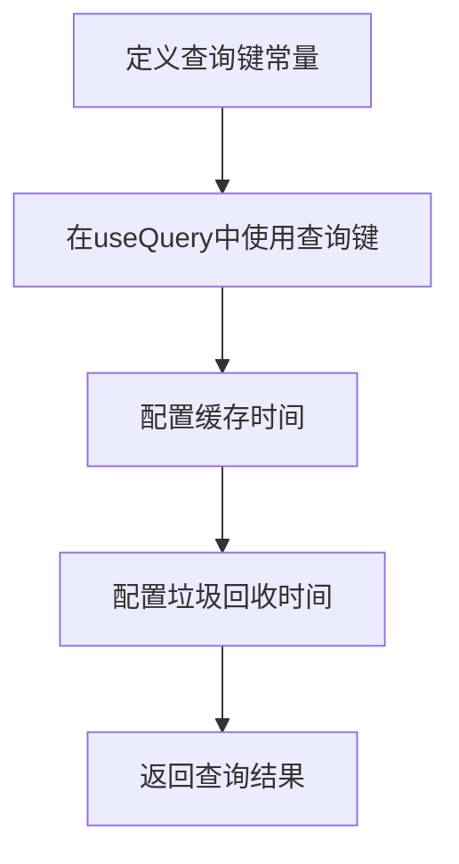

**查询键设计特点：**
- 使用命名常量提高可维护性
- 采用数组结构支持复杂查询场景
- 遵循语义化命名约定

缓存配置方面，OpenHands设置了合理的`staleTime`和`gcTime`值，平衡了数据新鲜度和性能。例如，`useApiKeys`和`useConfig`都设置了5分钟的`staleTime`和15分钟的`gcTime`，这意味着数据在5分钟内被视为新鲜，不会重新获取，而在15分钟后将从缓存中清除。

**Section sources**
- [use-api-keys.ts](file://frontend/src/hooks/query/use-api-keys.ts#L5-L20)
- [use-config.ts](file://frontend/src/hooks/query/use-config.ts#L9-L14)

## 数据选择器与错误处理模式
数据选择器和错误处理是查询钩子的重要组成部分，确保了数据的正确转换和用户友好的错误体验。

在`use-settings.ts`中，通过`getSettingsQueryFn`函数实现了数据选择器模式，将API返回的原始数据映射到应用所需的设置结构：

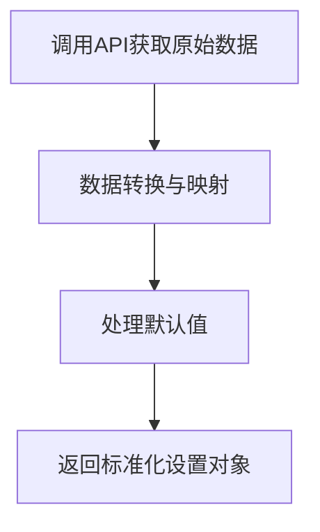

错误处理模式在OpenHands中通过多层次机制实现。首先，在`query-client-config.ts`中定义了全局错误处理逻辑，特别处理401未授权错误，自动使用户认证查询失效：

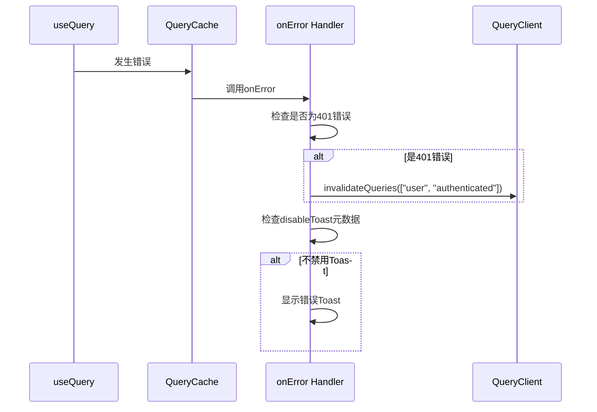

**Diagram sources**
- [query-client-config.ts](file://frontend/src/query-client-config.ts#L8-L12)
- [use-settings.ts](file://frontend/src/hooks/query/use-settings.ts#L10-L42)

在`use-settings.ts`中还实现了特定的错误处理逻辑，当遇到404错误时，返回默认设置而不是抛出错误，确保用户界面的可用性：

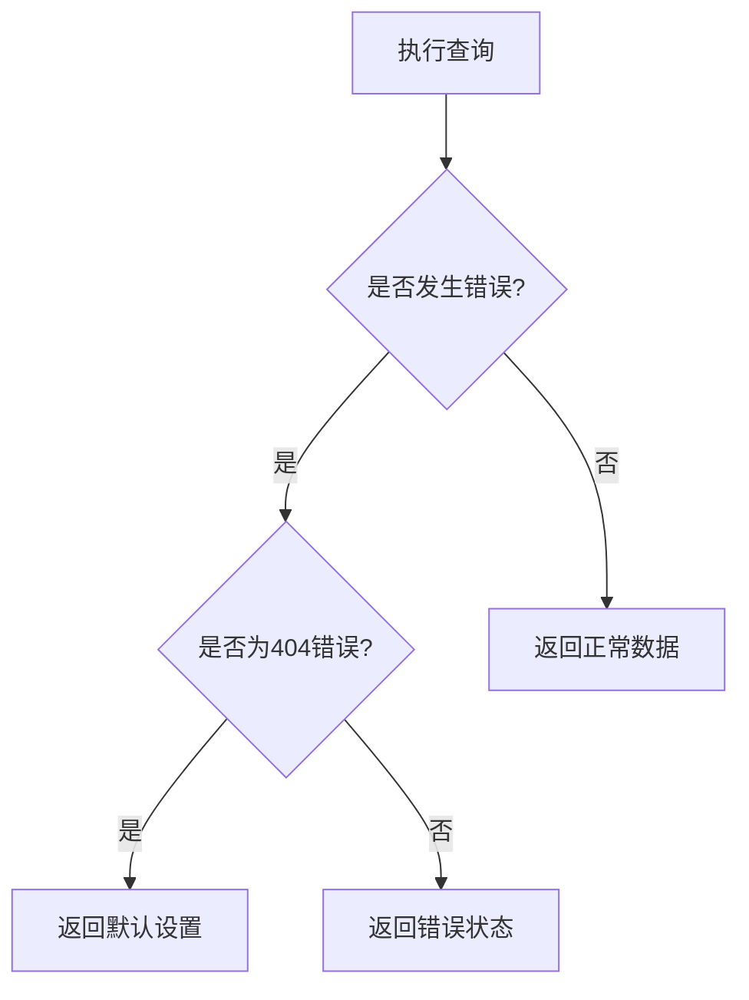

**Section sources**
- [use-settings.ts](file://frontend/src/hooks/query/use-settings.ts#L10-L91)
- [query-client-config.ts](file://frontend/src/query-client-config.ts#L17-L36)

## 查询生命周期管理
查询生命周期管理包括自动重新获取、后台同步和窗口聚焦行为的控制，确保数据的实时性和用户体验的流畅性。

在`useSettings`中，通过设置`refetchOnWindowFocus: false`禁用了窗口聚焦时的自动重新获取，避免了不必要的网络请求：

```mermaid
stateDiagram-v2
[*] --> Idle
Idle --> Fetching : 查询初始化
Fetching --> Success : 获取成功
Fetching --> Error : 获取失败
Success --> Idle : staleTime到期
Error --> Refetch : retry条件满足
click Idle "查询空闲状态"
click Fetching "数据获取中"
click Success "获取成功"
click Error "获取失败"
```

**Diagram sources**
- [use-settings.ts](file://frontend/src/hooks/query/use-settings.ts#L55-L58)

`use-active-host.ts`展示了更复杂的生命周期管理，使用`useQueries`同时管理多个主机的可用性检查，并设置了3秒的`refetchInterval`实现轮询：

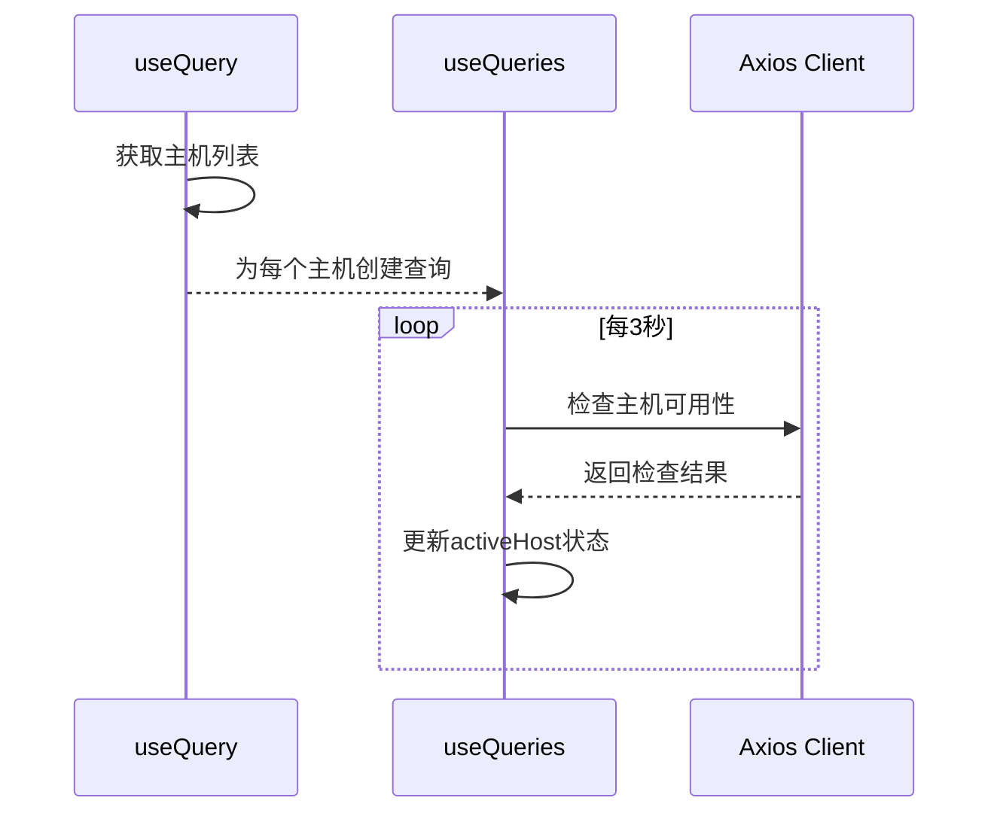

**Diagram sources**
- [use-active-host.ts](file://frontend/src/hooks/query/use-active-host.ts#L26-L41)

查询的启用条件（`enabled`）也是生命周期管理的重要部分。多个钩子如`useApiKeys`、`useSettings`和`useConfig`都根据应用状态动态控制查询的执行：

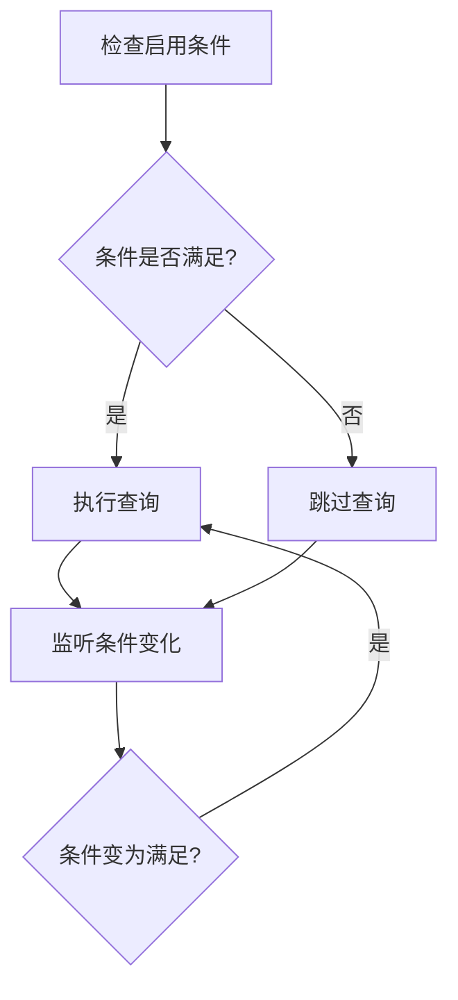

**Section sources**
- [use-active-host.ts](file://frontend/src/hooks/query/use-active-host.ts#L13-L24)
- [use-settings.ts](file://frontend/src/hooks/query/use-settings.ts#L58-L59)
- [use-api-keys.ts](file://frontend/src/hooks/query/use-api-keys.ts#L12-L13)

## 查询键设计最佳实践
OpenHands项目中的查询键设计遵循了React Query的最佳实践，确保了缓存的高效利用和查询的可维护性。

### 使用数组结构化查询键
查询键采用数组形式，支持参数化查询和依赖查询。例如，在`useRepositoryBranches`中，查询键包含仓库信息：

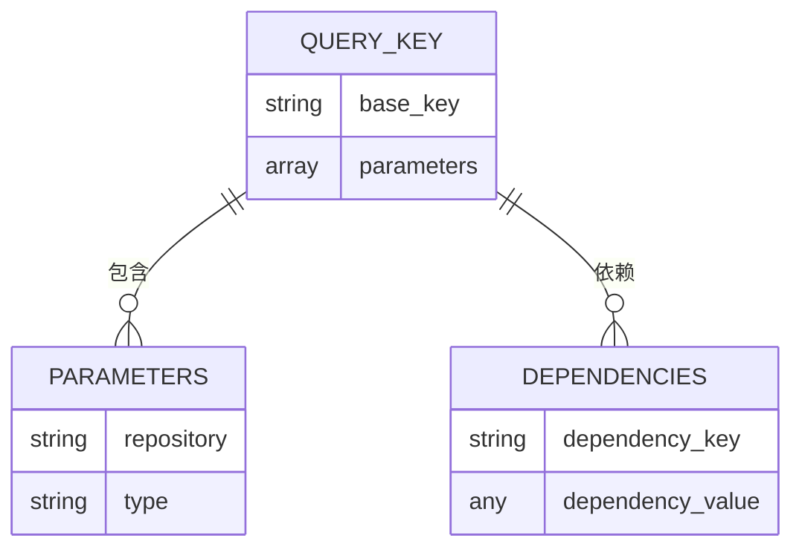

**Diagram sources**
- [use-repository-branches.ts](file://frontend/src/hooks/query/use-repository-branches.ts#L7-L8)

### 依赖查询实现
依赖查询通过在查询键中包含依赖项来实现。当依赖项变化时，查询会自动失效并重新获取。在`useActiveHost`中，查询键包含`conversationId`，确保会话变化时主机信息得到更新：


**Section sources**
- [use-active-host.ts](file://frontend/src/hooks/query/use-active-host.ts#L14-L15)

### 查询键命名约定
项目遵循一致的命名约定，使用小写字母和连字符分隔的字符串作为查询键的基本部分，如`"api-keys"`、`"settings"`、`"config"`等。这种约定提高了代码的可读性和一致性。

## 性能优化技巧
OpenHands项目采用了多种性能优化技巧，提升应用的响应速度和用户体验。

### 数据预取
虽然代码中没有显式的预取实现，但React Query的`initialData`选项被用于提供初始数据，避免了首次渲染时的加载状态。在`useActiveHost`中，为主机查询设置了空数组的`initialData`：

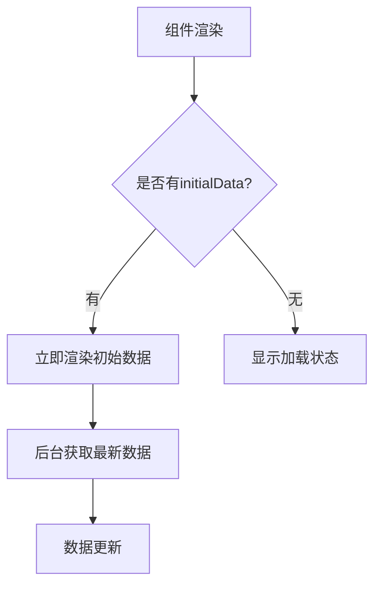

**Section sources**
- [use-active-host.ts](file://frontend/src/hooks/query/use-active-host.ts#L20-L21)

### 无限查询与分页
`usePaginatedConversations`和`useRepositoryBranchesPaginated`实现了无限查询模式，支持大数据集的分页加载：

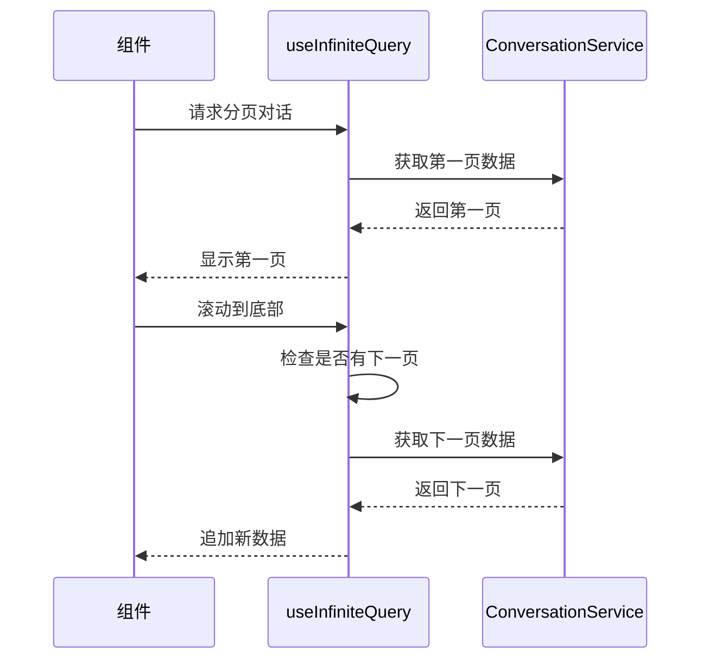

**Diagram sources**
- [use-paginated-conversations.ts](file://frontend/src/hooks/query/use-paginated-conversations.ts#L9-L30)
- [use-repository-branches.ts](file://frontend/src/hooks/query/use-repository-branches.ts#L22-L46)

### 占位符数据使用
通过`initialData`和错误处理中的默认值返回，实现了占位符数据的效果。在`useSettings`中，当设置未找到时返回默认设置，确保UI不会因数据缺失而崩溃：

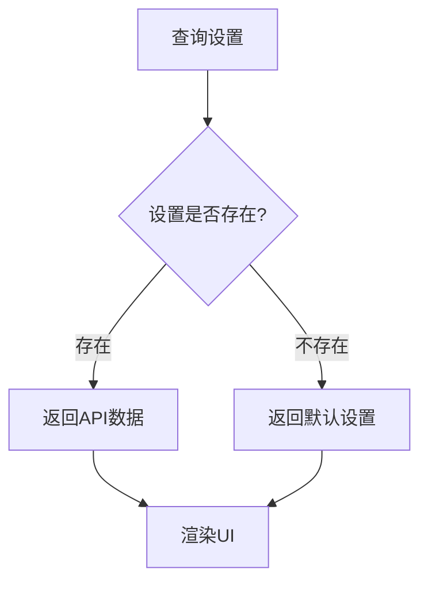

**Section sources**
- [use-settings.ts](file://frontend/src/hooks/query/use-settings.ts#L74-L88)

### 缓存优化
通过合理设置`staleTime`和`gcTime`，平衡了数据新鲜度和网络请求频率。所有主要查询都设置了5分钟的`staleTime`，减少了重复请求：


## 依赖分析
查询钩子系统依赖于多个核心组件和配置，形成了完整的数据获取架构。

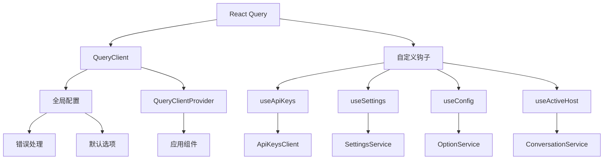

**Diagram sources**
- [query-client-config.ts](file://frontend/src/query-client-config.ts#L15-L48)
- [entry.client.tsx](file://frontend/src/entry.client.tsx#L64-L67)

类型系统通过`react-query.d.ts`进行了扩展，添加了自定义元数据类型`disableToast`，支持更精细的错误处理控制：

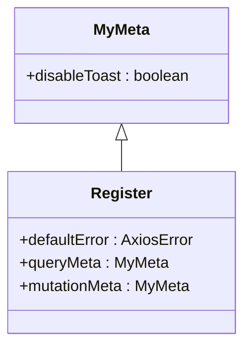

**Diagram sources**
- [react-query.d.ts](file://frontend/src/types/react-query.d.ts#L4-L14)

**Section sources**
- [query-client-config.ts](file://frontend/src/query-client-config.ts#L1-L48)
- [react-query.d.ts](file://frontend/src/types/react-query.d.ts#L1-L15)

## 结论
OpenHands项目的查询钩子实现展示了React Query在复杂前端应用中的有效应用。通过精心设计的查询键、合理的缓存策略、完善的错误处理和性能优化技巧，构建了一个高效、可靠的数据获取系统。查询钩子不仅封装了数据获取逻辑，还通过全局配置确保了行为的一致性。未来可以进一步优化，如实现更智能的预取策略、增强的离线支持和更精细的缓存控制，以提升用户体验和应用性能。