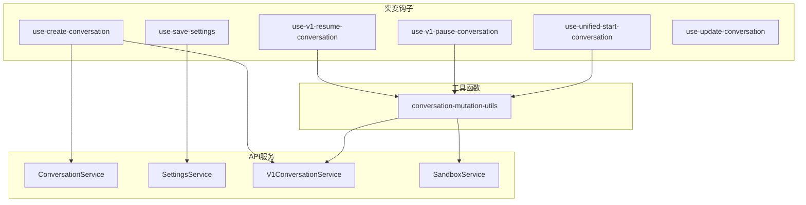
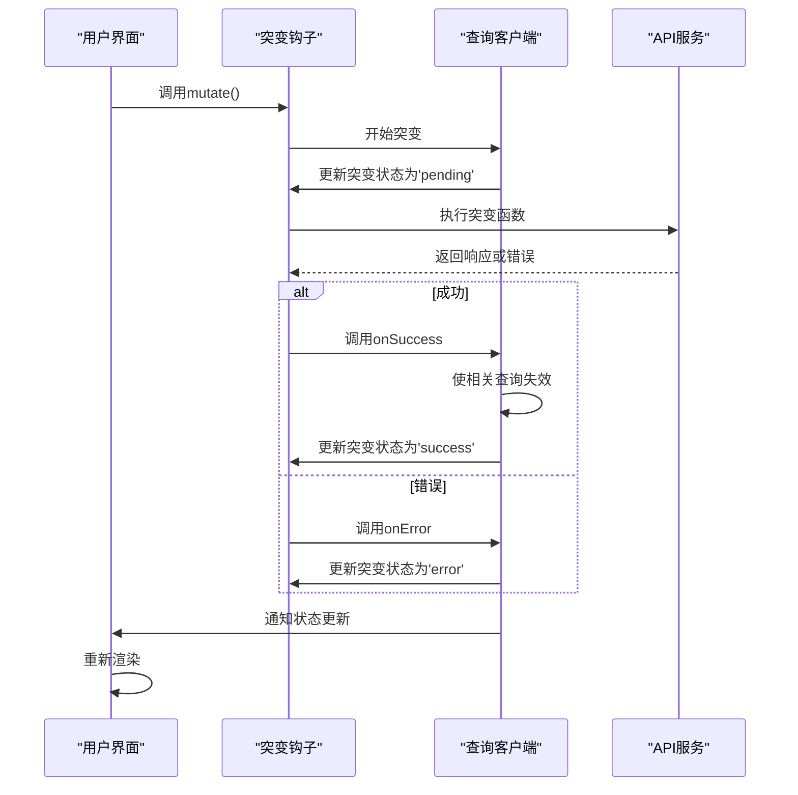
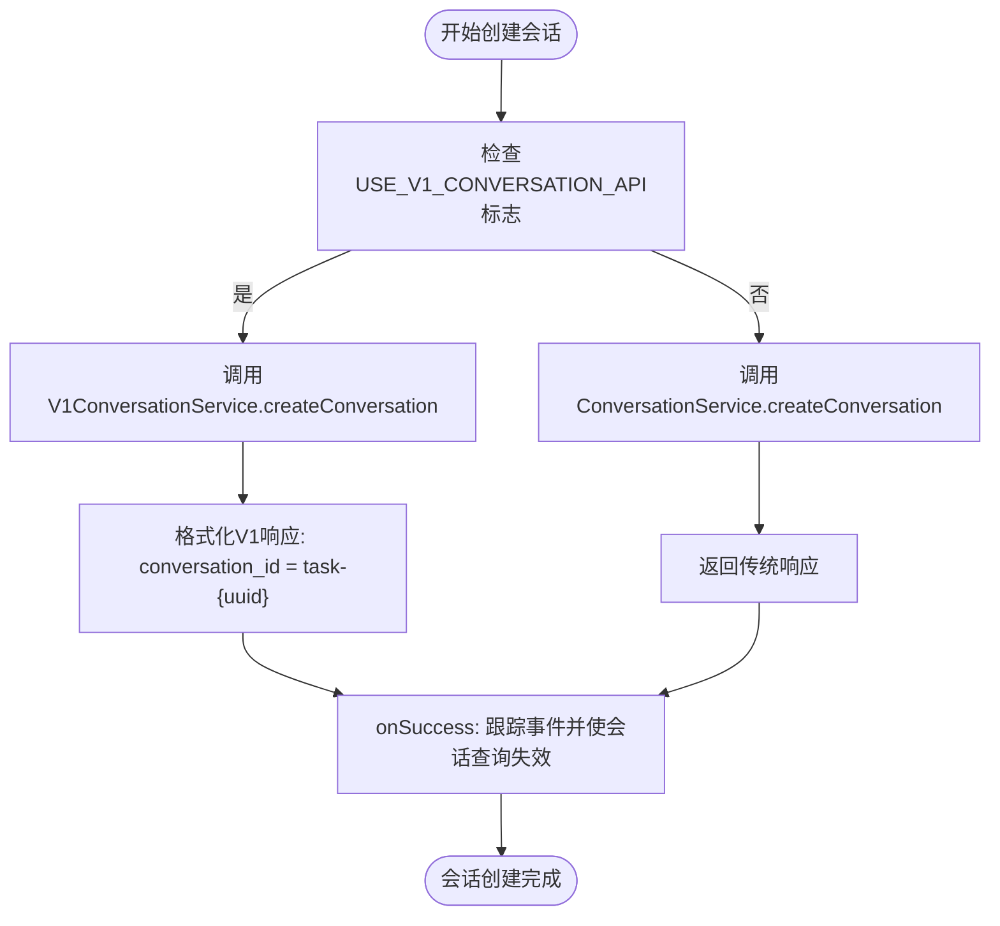
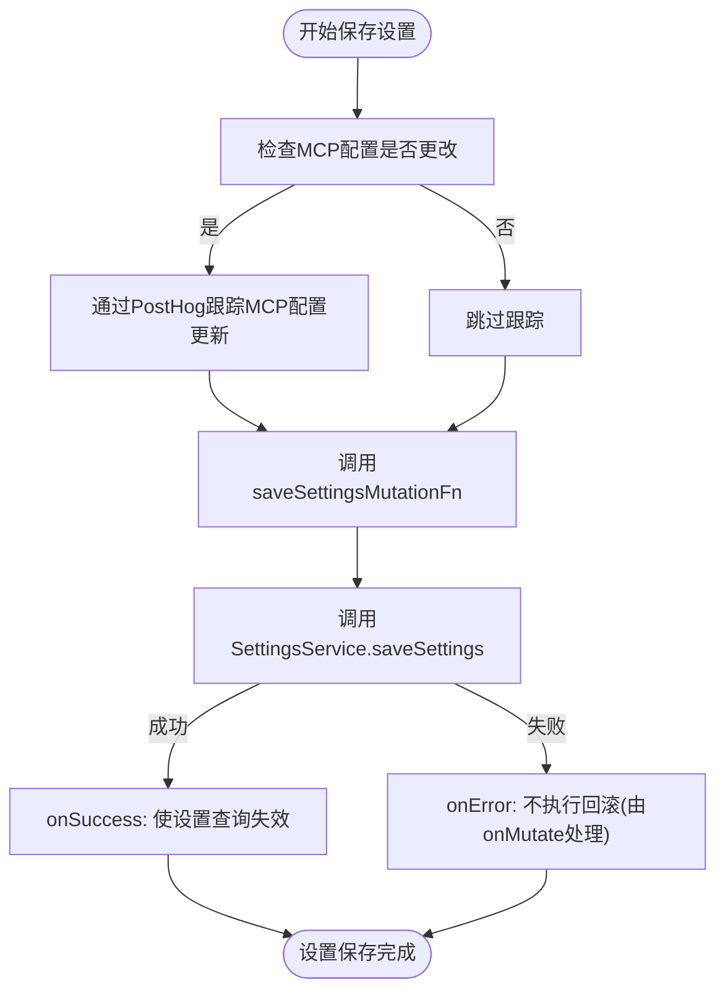
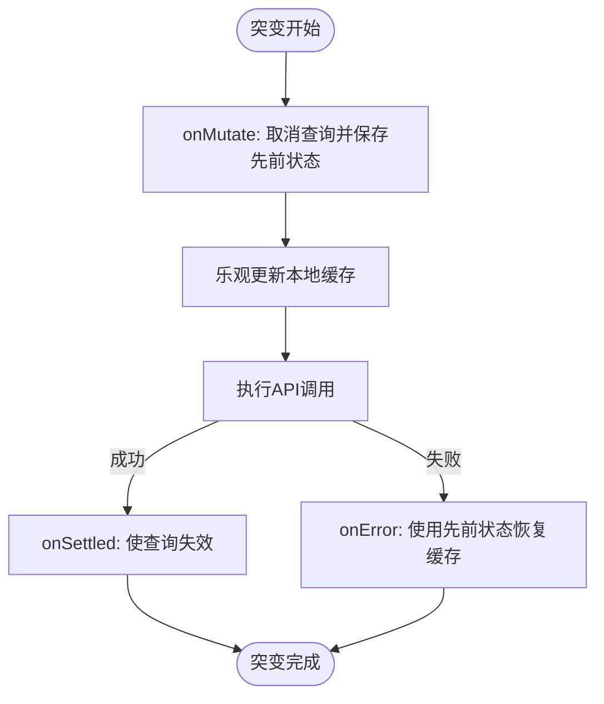
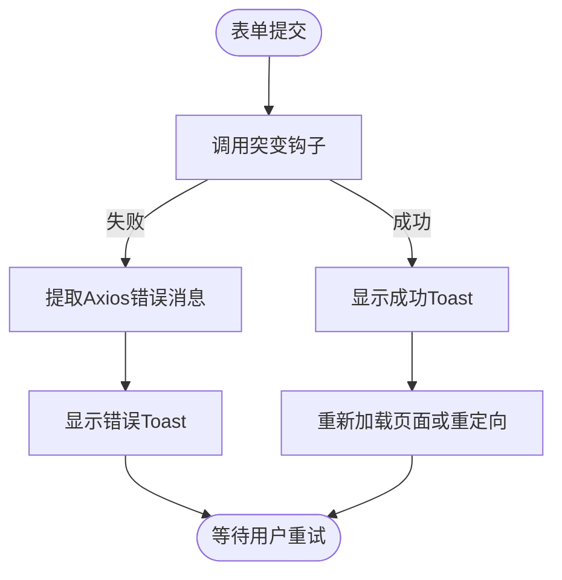
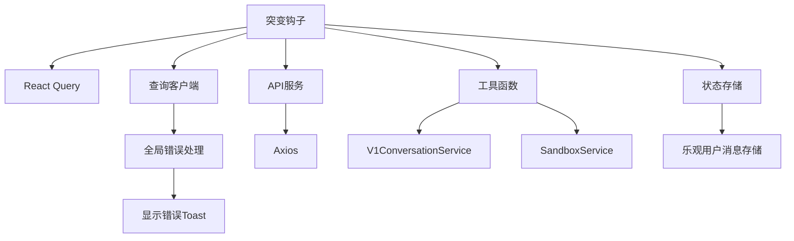

# 突变钩子

<cite>
**本文档中引用的文件**  
- [use-create-conversation.ts](file://frontend/src/hooks/mutation/use-create-conversation.ts)
- [use-save-settings.ts](file://frontend/src/hooks/mutation/use-save-settings.ts)
- [conversation-mutation-utils.ts](file://frontend/src/hooks/mutation/conversation-mutation-utils.ts)
- [query-client-config.ts](file://frontend/src/query-client-config.ts)
- [use-v1-resume-conversation.ts](file://frontend/src/hooks/mutation/use-v1-resume-conversation.ts)
- [use-v1-pause-conversation.ts](file://frontend/src/hooks/mutation/use-v1-pause-conversation.ts)
- [use-unified-start-conversation.ts](file://frontend/src/hooks/mutation/use-unified-start-conversation.ts)
- [use-update-conversation.ts](file://frontend/src/hooks/mutation/use-update-conversation.ts)
- [custom-toast-handlers.tsx](file://frontend/src/utils/custom-toast-handlers.tsx)
- [use-configure-integration.ts](file://frontend/src/hooks/mutation/use-configure-integration.ts)
- [use-link-integration.ts](file://frontend/src/hooks/mutation/use-link-integration.ts)
- [use-unlink-integration.ts](file://frontend/src/hooks/mutation/use-unlink-integration.ts)
- [use-submit-feedback.ts](file://frontend/src/hooks/mutation/use-submit-feedback.ts)
- [optimistic-user-message-store.ts](file://frontend/src/stores/optimistic-user-message-store.ts)
</cite>

## 目录
1. [简介](#简介)
2. [项目结构](#项目结构)
3. [核心组件](#核心组件)
4. [架构概述](#架构概述)
5. [详细组件分析](#详细组件分析)
6. [依赖分析](#依赖分析)
7. [性能考虑](#性能考虑)
8. [故障排除指南](#故障排除指南)
9. [结论](#结论)

## 简介
本文档详细介绍了OpenHands项目中基于React Query的突变钩子实现。重点分析了`use-create-conversation.ts`中的突变函数、成功回调和错误处理机制，以及`use-save-settings.ts`中的乐观更新模式和错误回滚机制。文档还阐述了突变生命周期钩子（onMutate、onSuccess、onError和onSettled）的使用场景，提供了突变队列管理、并发控制和加载状态处理的最佳实践，并包含了表单集成和用户交互反馈的实现模式。

## 项目结构
突变钩子主要位于前端代码库的`hooks/mutation`目录中，这些钩子利用React Query库来管理异步状态和数据突变。突变逻辑与API服务层分离，通过专门的服务类（如ConversationService和SettingsService）进行通信。这种分层架构确保了关注点分离，使突变逻辑可重用且易于测试。

**图源**
- [use-create-conversation.ts](file://frontend/src/hooks/mutation/use-create-conversation.ts)
- [use-save-settings.ts](file://frontend/src/hooks/mutation/use-save-settings.ts)
- [conversation-mutation-utils.ts](file://frontend/src/hooks/mutation/conversation-mutation-utils.ts)

**节源**
- [frontend/src/hooks/mutation](file://frontend/src/hooks/mutation)

## 核心组件
本项目的核心突变组件包括`useCreateConversation`和`useSaveSettings`钩子，它们分别处理会话创建和用户设置保存的复杂业务逻辑。这些组件利用React Query的突变功能，提供了一致的API来处理异步操作，包括自动加载状态管理、错误处理和成功回调。突变钩子与查询钩子协同工作，通过查询客户端的缓存机制实现数据同步，确保UI与后端状态保持一致。

**节源**
- [use-create-conversation.ts](file://frontend/src/hooks/mutation/use-create-conversation.ts#L32-L100)
- [use-save-settings.ts](file://frontend/src/hooks/mutation/use-save-settings.ts#L43-L78)

## 架构概述
突变架构基于React Query构建，采用声明式方法处理数据突变。所有突变都通过`useMutation`钩子定义，该钩子接受一个配置对象，其中包含突变函数、生命周期钩子和元数据。突变函数执行实际的API调用，而生命周期钩子允许在突变的不同阶段（如突变前、成功、错误和最终状态）执行副作用。查询客户端作为全局状态管理器，协调突变和查询之间的数据流，确保缓存一致性。

**图源**
- [query-client-config.ts](file://frontend/src/query-client-config.ts#L15-L47)
- [use-create-conversation.ts](file://frontend/src/hooks/mutation/use-create-conversation.ts#L36-L99)

## 详细组件分析
本节深入分析关键突变组件的实现细节，包括其设计模式、数据流和错误处理策略。每个组件都展示了如何利用React Query的功能来构建健壮且用户友好的交互。

### useCreateConversation分析
`useCreateConversation`钩子负责创建新的对话会话，支持新旧两种API版本。它根据功能标志和输入参数决定使用哪个API端点，并返回一个包含会话ID和相关元数据的标准化响应。该钩子还集成了用户跟踪功能，在会话创建成功后发送分析事件。

**图源**
- [use-create-conversation.ts](file://frontend/src/hooks/mutation/use-create-conversation.ts#L32-L99)

**节源**
- [use-create-conversation.ts](file://frontend/src/hooks/mutation/use-create-conversation.ts#L32-L100)

### useSaveSettings分析
`useSaveSettings`钩子实现了设置保存的乐观更新模式，通过`onMutate`钩子在API调用前更新本地缓存，提供即时的用户反馈。如果突变失败，`onError`钩子会回滚到先前的状态，确保数据一致性。该钩子还通过PostHog集成跟踪MCP配置的变化，为产品分析提供有价值的数据。

**图源**
- [use-save-settings.ts](file://frontend/src/hooks/mutation/use-save-settings.ts#L43-L78)

**节源**
- [use-save-settings.ts](file://frontend/src/hooks/mutation/use-save-settings.ts#L43-L78)

### 乐观更新与错误回滚机制
`useUpdateConversation`和`useV1ResumeConversation`等钩子展示了完整的乐观更新和错误回滚模式。在`onMutate`阶段，它们取消相关查询并保存先前状态，然后在本地缓存中乐观地更新数据。如果突变成功，新数据将被确认；如果失败，`onError`钩子使用保存的先前状态恢复缓存，提供无缝的用户体验。

**图源**
- [use-update-conversation.ts](file://frontend/src/hooks/mutation/use-update-conversation.ts#L7-L34)
- [use-v1-resume-conversation.ts](file://frontend/src/hooks/mutation/use-v1-resume-conversation.ts#L7-L40)

**节源**
- [use-update-conversation.ts](file://frontend/src/hooks/mutation/use-update-conversation.ts#L7-L34)
- [use-v1-resume-conversation.ts](file://frontend/src/hooks/mutation/use-v1-resume-conversation.ts#L7-L40)

### 表单集成与用户反馈
`use-configure-integration`、`use-link-integration`和`use-unlink-integration`钩子展示了突变与表单的集成模式。这些钩子在`onError`中使用`displayErrorToast`显示用户友好的错误消息，在`onSuccess`中使用`displaySuccessToast`提供成功反馈。错误消息的显示时长根据消息长度动态计算，确保用户有足够时间阅读。

**图源**
- [use-configure-integration.ts](file://frontend/src/hooks/mutation/use-configure-integration.ts#L28-L72)
- [use-link-integration.ts](file://frontend/src/hooks/mutation/use-link-integration.ts#L20-L60)
- [use-unlink-integration.ts](file://frontend/src/hooks/mutation/use-unlink-integration.ts#L23-L38)
- [custom-toast-handlers.tsx](file://frontend/src/utils/custom-toast-handlers.tsx)

**节源**
- [use-configure-integration.ts](file://frontend/src/hooks/mutation/use-configure-integration.ts#L28-L72)
- [use-link-integration.ts](file://frontend/src/hooks/mutation/use-link-integration.ts#L20-L60)
- [use-unlink-integration.ts](file://frontend/src/hooks/mutation/use-unlink-integration.ts#L23-L38)

## 依赖分析
突变钩子依赖于React Query库进行状态管理，依赖于Axios进行HTTP通信，并通过服务类与后端API交互。查询客户端配置了全局错误处理程序，自动处理401未授权错误并显示错误Toast。突变钩子之间通过工具函数（如`conversation-mutation-utils.ts`）共享逻辑，减少代码重复。状态存储（如`optimistic-user-message-store.ts`）与突变钩子协同工作，管理乐观更新的UI状态。

**图源**
- [query-client-config.ts](file://frontend/src/query-client-config.ts#L15-L47)
- [conversation-mutation-utils.ts](file://frontend/src/hooks/mutation/conversation-mutation-utils.ts)
- [optimistic-user-message-store.ts](file://frontend/src/stores/optimistic-user-message-store.ts)

**节源**
- [query-client-config.ts](file://frontend/src/query-client-config.ts#L15-L47)
- [frontend/src/hooks/mutation](file://frontend/src/hooks/mutation)
- [frontend/src/stores](file://frontend/src/stores)

## 性能考虑
突变操作通过查询客户端的缓存机制优化性能，避免不必要的网络请求。`onSettled`钩子用于使相关查询失效，触发自动重新获取，确保数据新鲜度。突变队列管理通过`useIsMutating`钩子实现，可以检测挂起的突变并相应地禁用UI元素，防止并发突变。对于长消息的Toast通知，显示时长根据消息长度动态计算，平衡了用户体验和界面干扰。

**节源**
- [use-is-creating-conversation.ts](file://frontend/src/hooks/use-is-creating-conversation.ts)
- [toast-duration.ts](file://frontend/src/utils/toast-duration.ts)

## 故障排除指南
当突变失败时，系统会通过全局错误处理程序或突变特定的`onError`钩子显示错误Toast。401未授权错误会触发用户身份验证状态的重新验证。对于乐观更新，如果突变失败，`onError`钩子会恢复先前的缓存状态。开发人员可以通过检查网络请求、查看错误消息和验证突变配置来诊断问题。确保突变键唯一且查询失效正确配置是避免缓存问题的关键。

**节源**
- [query-client-config.ts](file://frontend/src/query-client-config.ts#L8-L36)
- [use-submit-feedback.ts](file://frontend/src/hooks/mutation/use-submit-feedback.ts#L14-L23)

## 结论
OpenHands项目中的突变钩子实现展示了React Query在复杂前端应用中的强大功能。通过精心设计的突变生命周期钩子、乐观更新模式和全局错误处理，系统提供了流畅且可靠的用户体验。组件间的清晰分离和可重用的工具函数确保了代码的可维护性。未来可以进一步优化突变队列管理和并发控制，以处理更复杂的用户交互场景。