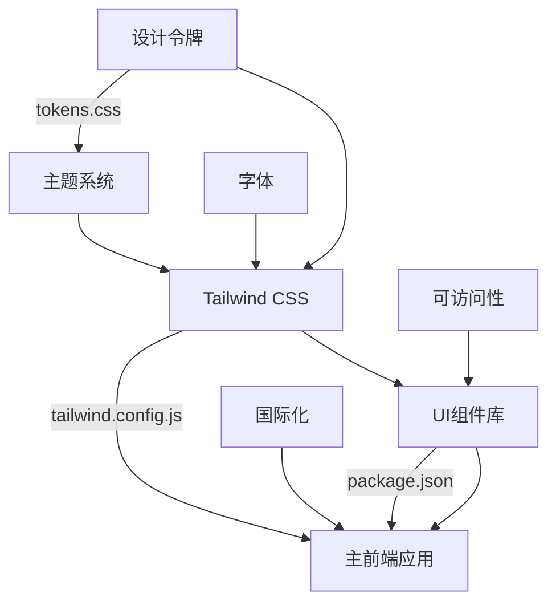
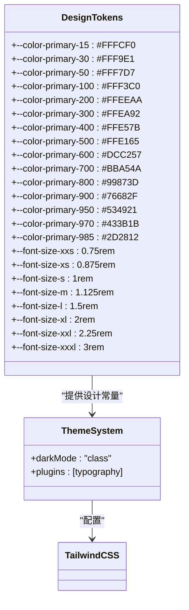
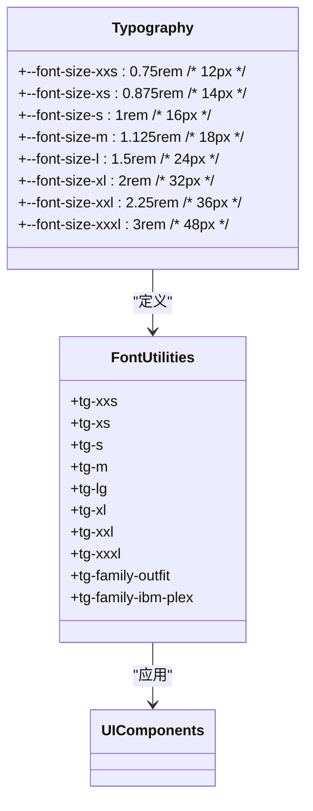
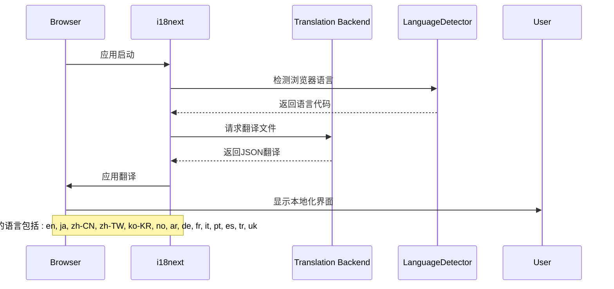
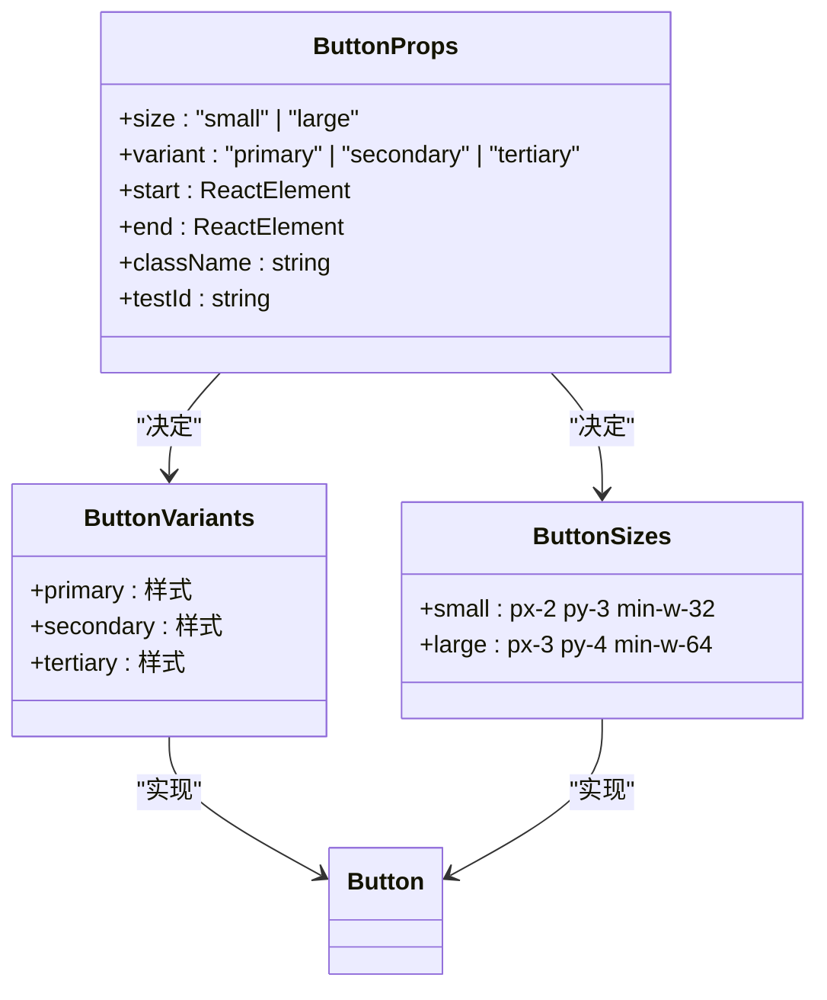
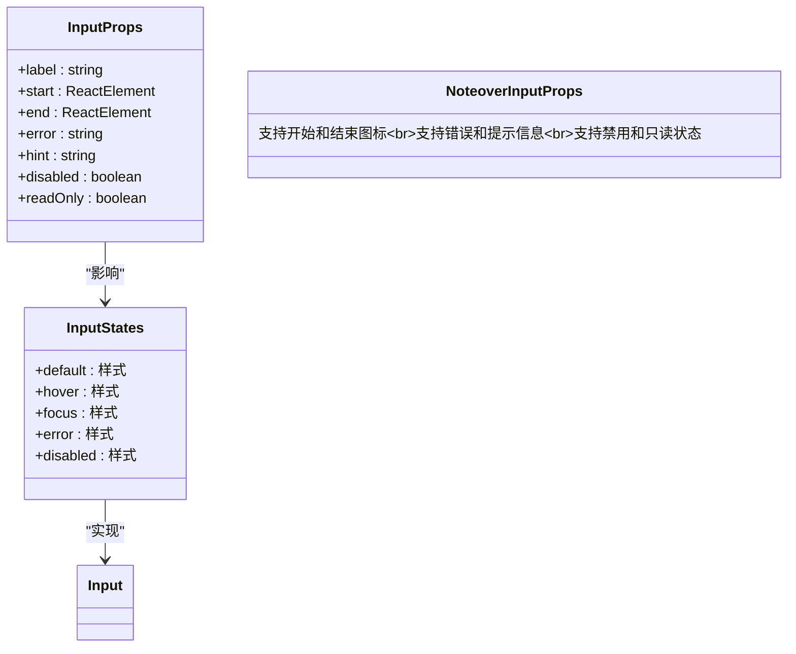
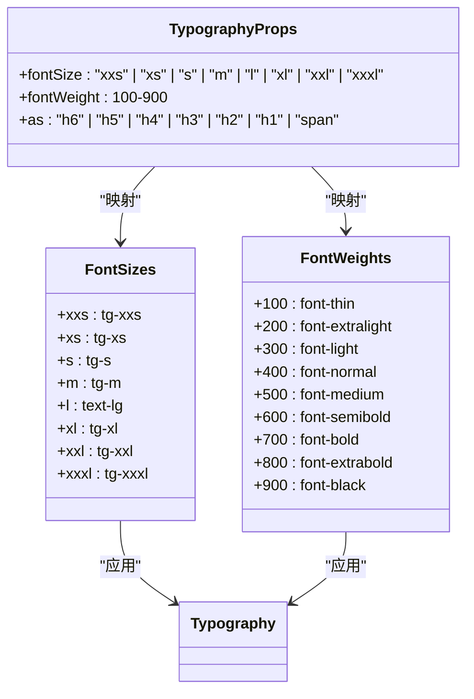
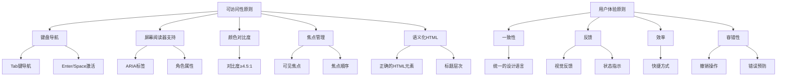
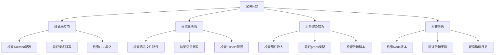

# UI设计系统

<cite>
**本文档中引用的文件**   
- [tailwind.config.js](file://frontend/tailwind.config.js)
- [index.css](file://frontend/src/index.css)
- [tailwind.css](file://frontend/src/tailwind.css)
- [tokens.css](file://openhands-ui/tokens.css)
- [i18n/index.ts](file://frontend/src/i18n/index.ts)
- [Button.tsx](file://openhands-ui/components/button/Button.tsx)
- [Input.tsx](file://openhands-ui/components/input/Input.tsx)
- [BaseTypography.tsx](file://openhands-ui/components/typography/BaseTypography.tsx)
- [package.json](file://frontend/package.json)
- [package.json](file://openhands-ui/package.json)
</cite>

## 目录
1. [简介](#简介)
2. [项目结构](#项目结构)
3. [核心组件](#核心组件)
4. [架构概述](#架构概述)
5. [详细组件分析](#详细组件分析)
6. [依赖分析](#依赖分析)
7. [性能考虑](#性能考虑)
8. [故障排除指南](#故障排除指南)
9. [结论](#结论)
10. [附录](#附录)（如有必要）

## 简介
本文档详细描述了OpenHands项目的UI设计系统，涵盖其视觉设计语言和实现方案。文档重点介绍Tailwind CSS配置、主题系统、国际化(i18n)实现和设计常量管理。我们将深入分析颜色、间距、字体等设计令牌的组织方式，探讨多语言支持的实现机制和RTL布局考虑。此外，文档还提供UI组件的可访问性合规性检查清单和用户体验设计原则，并包含设计系统演进路线图和自定义工具函数的最佳实践。

## 项目结构
OpenHands的UI设计系统采用模块化架构，主要由两个核心部分组成：主前端应用和独立的UI组件库。这种分离的设计使得UI组件可以在不同项目中复用，同时保持一致的视觉语言。

```mermaid
graph TB
subgraph "主前端应用"
frontend[frontend/]
tailwind[tailwind.config.js]
indexcss[index.css]
i18n[i18n/]
end
subgraph "UI组件库"
openhandsui[openhands-ui/]
tokens[tokens.css]
components[components/]
button[Button.tsx]
input[Input.tsx]
typography[Typography.tsx]
end
frontend --> openhandsui : "依赖"
tailwind --> openhandsui : "配置"
indexcss --> tokens : "导入"
i18n --> frontend : "国际化"
```

**Diagram sources**
- [tailwind.config.js](file://frontend/tailwind.config.js)
- [tokens.css](file://openhands-ui/tokens.css)
- [Button.tsx](file://openhands-ui/components/button/Button.tsx)

**Section sources**
- [tailwind.config.js](file://frontend/tailwind.config.js)
- [tokens.css](file://openhands-ui/tokens.css)

## 核心组件
OpenHands的UI设计系统围绕几个核心概念构建：设计令牌、主题系统、国际化支持和可访问性。这些组件共同创建了一个一致、可维护且用户友好的界面。

**Section sources**
- [tailwind.config.js](file://frontend/tailwind.config.js)
- [tokens.css](file://openhands-ui/tokens.css)
- [i18n/index.ts](file://frontend/src/i18n/index.ts)

## 架构概述
OpenHands的UI架构采用分层设计，将样式定义、组件实现和应用集成清晰地分离。系统以Tailwind CSS为基础，通过`@heroui/react`库扩展功能，并使用自定义设计令牌确保视觉一致性。



**Diagram sources**
- [tailwind.config.js](file://frontend/tailwind.config.js)
- [tokens.css](file://openhands-ui/tokens.css)
- [package.json](file://openhands-ui/package.json)

## 详细组件分析
本节深入分析UI设计系统的关键组件，包括设计令牌、主题系统、国际化实现和核心UI组件。

### 设计令牌与主题系统
OpenHands使用CSS自定义属性（CSS变量）作为设计令牌，集中管理颜色、间距、字体等设计常量。这些令牌定义在`openhands-ui/tokens.css`文件中，通过`@theme`规则组织。



**Diagram sources**
- [tokens.css](file://openhands-ui/tokens.css)
- [tailwind.config.js](file://frontend/tailwind.config.js)

#### 颜色系统
OpenHands的颜色系统采用分级设计，为每种主要颜色提供从15到985的多个色调。这种设计允许在不同UI元素中使用合适的颜色变体，同时保持视觉一致性。

```mermaid
flowchart TD
A[Primary Colors] --> B[Primary-15: #FFFCF0]
A --> C[Primary-30: #FFF9E1]
A --> D[Primary-50: #FFF7D7]
A --> E[Primary-100: #FFF3C0]
A --> F[Primary-200: #FFEEAA]
A --> G[Primary-300: #FFEA92]
A --> H[Primary-400: #FFE57B]
A --> I[Primary-500: #FFE165]
A --> J[Primary-600: #DCC257]
A --> K[Primary-700: #BBA54A]
A --> L[Primary-800: #99873D]
A --> M[Primary-900: #76682F]
A --> N[Primary-950: #534921]
A --> O[Primary-970: #433B1B]
A --> P[Primary-985: #2D2812]
Q[Neutral Colors] --> R[Light Neutral]
Q --> S[Grey]
T[Semantic Colors] --> U[Green]
T --> V[Aqua]
T --> W[Red]
```



**Diagram sources**
- [tokens.css](file://openhands-ui/tokens.css)

#### 字体与排版系统
字体和排版系统通过CSS变量和Tailwind实用类结合的方式实现。系统定义了从xxs到xxxl的多种字体大小，并通过`tg-*`类名应用。



**Diagram sources**
- [tokens.css](file://openhands-ui/tokens.css)
- [BaseTypography.tsx](file://openhands-ui/components/typography/BaseTypography.tsx)

### 国际化(i18n)实现
OpenHands使用i18next库实现多语言支持，系统支持多种语言，包括英语、日语、简体中文、繁体中文、韩语等。



**Diagram sources**
- [i18n/index.ts](file://frontend/src/i18n/index.ts)

#### 国际化配置
国际化系统通过`i18next`、`react-i18next`和`i18next-http-backend`等库实现，配置在`frontend/src/i18n/index.ts`文件中。

```mermaid
classDiagram
class I18nConfig {
+fallbackLng : "en"
+debug : boolean
+supportedLngs : string[]
+nonExplicitSupportedLngs : false
}
class TranslationBackend {
+loadPath : "/locales/{{lng}}/translation.json"
}
class LanguageDetector {
+order : ["localStorage", "navigator", "htmlTag"]
+lookupLocalStorage : "i18nextLng"
}
I18nConfig --> TranslationBackend : "使用"
I18nConfig --> LanguageDetector : "使用"
I18nConfig --> ReactI18next : "初始化"
```

**Diagram sources**
- [i18n/index.ts](file://frontend/src/i18n/index.ts)

### 核心UI组件分析
本节分析OpenHands UI设计系统中的核心组件，包括按钮、输入框和排版组件。

#### 按钮组件
按钮组件是UI系统中最常用的交互元素之一，OpenHands的按钮组件支持多种变体和尺寸。



**Diagram sources**
- [Button.tsx](file://openhands-ui/components/button/Button.tsx)

#### 输入框组件
输入框组件提供了完整的表单输入功能，包括标签、占位符、错误状态和提示信息。



**Diagram sources**
- [Input.tsx](file://openhands-ui/components/input/Input.tsx)

#### 排版组件
排版组件提供了统一的文本样式，确保整个应用的文本呈现一致。



**Diagram sources**
- [BaseTypography.tsx](file://openhands-ui/components/typography/BaseTypography.tsx)
- [utils.ts](file://openhands-ui/components/typography/utils.ts)

### 可访问性与用户体验
OpenHands的UI设计系统高度重视可访问性和用户体验，遵循WCAG 2.1标准。



**Diagram sources**
- [Button.tsx](file://openhands-ui/components/button/Button.tsx)
- [Input.tsx](file://openhands-ui/components/input/Input.tsx)

**Section sources**
- [Button.tsx](file://openhands-ui/components/button/Button.tsx)
- [Input.tsx](file://openhands-ui/components/input/Input.tsx)
- [BaseTypography.tsx](file://openhands-ui/components/typography/BaseTypography.tsx)

## 依赖分析
OpenHands的UI设计系统依赖于多个关键库和技术，这些依赖共同构建了强大的前端架构。

```mermaid
graph TD
A[Tailwind CSS] --> B[Utility-First CSS]
C[React] --> D[组件化架构]
E[TypeScript] --> F[类型安全]
G[i18next] --> H[国际化]
I[@heroui/react] --> J[UI组件库]
K[Vite] --> L[构建工具]
A --> M[设计系统]
C --> M
E --> M
G --> M
I --> M
K --> M
M --> N[主前端应用]
O[Tailwind Merge] --> P[类名合并]
Q[Clsx] --> R[条件类名]
S[Focus Trap] --> T[焦点管理]
P --> I
R --> I
T --> I
```

**Diagram sources**
- [package.json](file://frontend/package.json)
- [package.json](file://openhands-ui/package.json)

**Section sources**
- [package.json](file://frontend/package.json)
- [package.json](file://openhands-ui/package.json)

## 性能考虑
虽然本节不分析特定文件，但UI设计系统的性能考虑包括：
- 使用Tailwind CSS的JIT模式减少CSS文件大小
- 通过组件库复用减少重复代码
- 使用懒加载和代码分割优化初始加载时间
- 优化图片和字体资源的加载
- 使用虚拟滚动处理大量数据

## 故障排除指南
本节分析错误处理和调试相关的实现。



**Section sources**
- [tailwind.config.js](file://frontend/tailwind.config.js)
- [i18n/index.ts](file://frontend/src/i18n/index.ts)

## 结论
OpenHands的UI设计系统通过精心设计的架构和实现，创建了一个一致、可维护且用户友好的界面。系统采用Tailwind CSS作为基础，结合自定义设计令牌和组件库，实现了高度的视觉一致性。国际化支持使得应用能够服务于全球用户，而可访问性考虑确保了所有用户都能有效使用系统。未来的发展方向包括进一步优化性能、扩展组件库和改进开发体验。