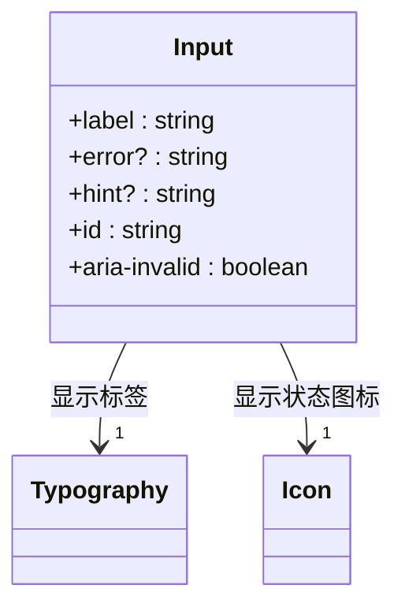
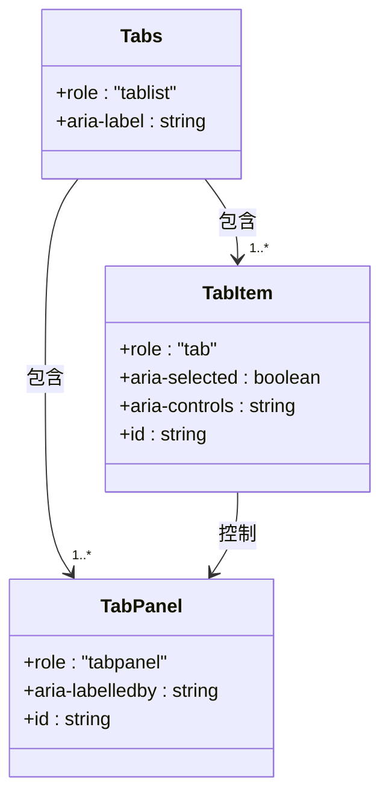
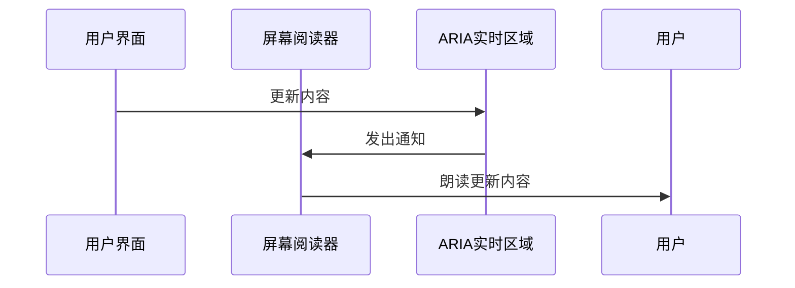
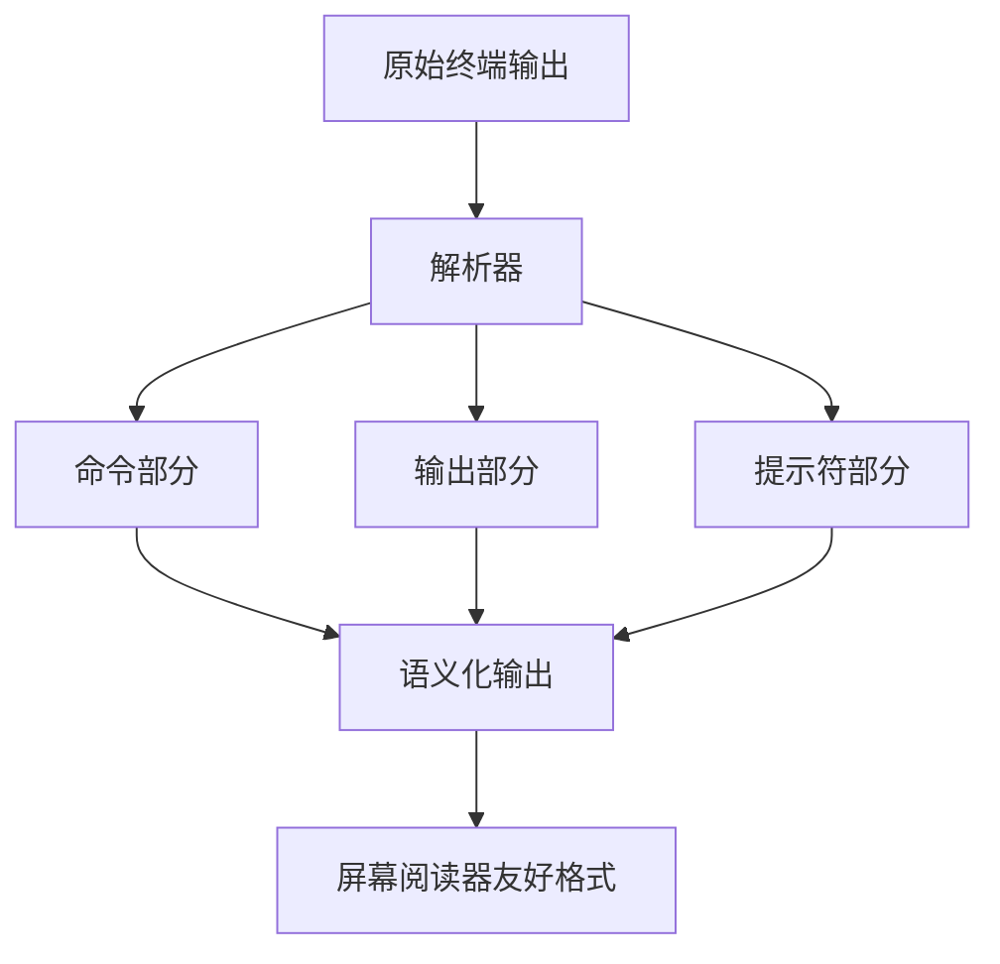
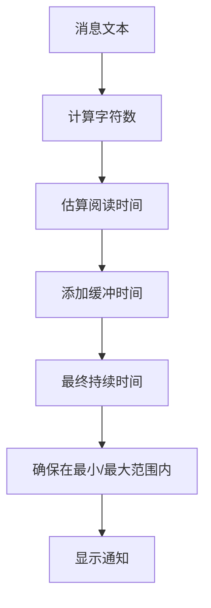
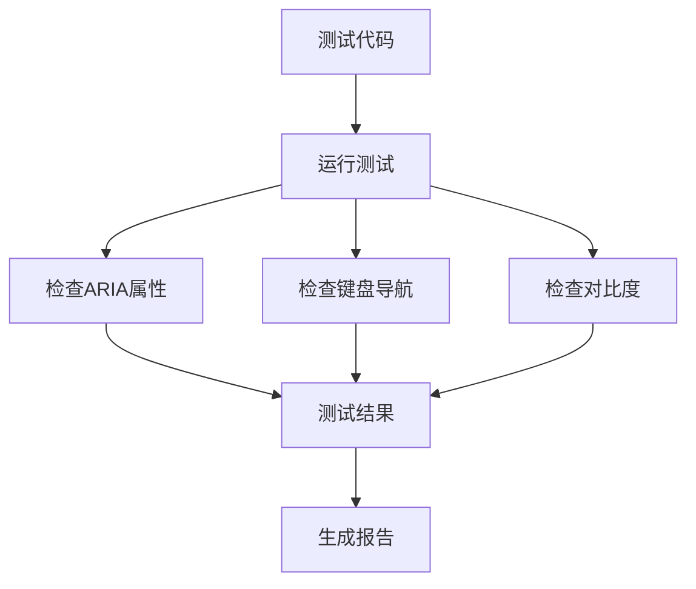

# 可访问性

<cite>
**本文档中引用的文件**  
- [visualbrowsing_agent.py](file://openhands/agenthub/visualbrowsing_agent/visualbrowsing_agent.py)
- [browsing_agent.py](file://openhands/agenthub/browsing_agent/browsing_agent.py)
- [conversation_memory.py](file://openhands/memory/conversation_memory.py)
- [test_browsing.py](file://tests/runtime/test_browsing.py)
- [Input.tsx](file://openhands-ui/components/input/Input.tsx)
- [Select.tsx](file://openhands-ui/components/select/Select.tsx)
- [Tabs.tsx](file://openhands-ui/components/tabs/Tabs.tsx)
- [TabItem.tsx](file://openhands-ui/components/tabs/components/TabItem.tsx)
- [TabScroller.tsx](file://openhands-ui/components/tabs/components/TabScroller.tsx)
- [package-lock.json](file://frontend/package-lock.json)
- [microagent-status-toast.tsx](file://frontend/src/components/features/chat/microagent/microagent-status-toast.tsx)
- [maintenance-banner.tsx](file://frontend/src/components/features/maintenance/maintenance-banner.tsx)
- [conversation-status-badges.tsx](file://frontend/src/components/features/conversation-panel/conversation-card/conversation-status-badges.tsx)
- [conversation-status-indicator.tsx](file://frontend/src/components/features/home/recent-conversations/conversation-status-indicator.tsx)
- [status.ts](file://frontend/src/utils/status.ts)
- [use-handle-ws-events.ts](file://frontend/src/hooks/use-handle-ws-events.ts)
- [use-event-store.ts](file://frontend/src/stores/use-event-store.ts)
- [toast-duration.ts](file://frontend/src/utils/toast-duration.ts)
- [custom-toast-handlers.test.ts](file://frontend/src/utils/__tests__/custom-toast-handlers.test.ts)
- [toast.utils.ts](file://openhands-ui/components/toast/utils.ts)
- [Toast.stories.tsx](file://openhands-ui/components/toast/Toast.stories.tsx)
</cite>

## 目录
1. [引言](#引言)
2. [ARIA标签使用规范](#aria标签使用规范)
3. [键盘导航支持](#键盘导航支持)
4. [屏幕阅读器兼容性](#屏幕阅读器兼容性)
5. [对比度标准](#对比度标准)
6. [终端输出解析的语义化处理](#终端输出解析的语义化处理)
7. [实时更新的可访问性挑战](#实时更新的可访问性挑战)
8. [动态内容更新的最佳实践](#动态内容更新的最佳实践)
9. [自动化测试方案](#自动化测试方案)
10. [手动验证清单](#手动验证清单)

## 引言
OpenHands平台致力于提供全面的可访问性支持，确保所有用户，包括残障人士，都能有效使用其功能。本文件详细阐述了UI组件的无障碍设计实现，涵盖ARIA标签的使用规范、键盘导航支持、屏幕阅读器兼容性和对比度标准。同时，分析了终端输出解析中的语义化处理和实时更新的可访问性挑战，并提供了动态内容更新的无障碍最佳实践。文档还包括自动化测试方案和手动验证清单，以确保可访问性标准的持续符合。

## ARIA标签使用规范
OpenHands平台在UI组件中广泛使用ARIA（Accessible Rich Internet Applications）标签，以增强屏幕阅读器的可访问性。这些标签提供了额外的语义信息，帮助辅助技术理解用户界面的结构和功能。

### 表单元素的ARIA实现
在表单组件中，ARIA标签被用来明确标识输入字段的标签、状态和关系。例如，在`Input.tsx`组件中，通过`aria-invalid`属性来指示输入是否有效，同时使用`label`属性来关联输入字段和其标签文本。



**Diagram sources**
- [Input.tsx](file://openhands-ui/components/input/Input.tsx)

### 选择组件的ARIA实现
选择组件（如下拉菜单）使用ARIA标签来管理焦点和选项状态。`Select.tsx`组件通过`role="combobox"`、`aria-expanded`和`aria-activedescendant`等属性，为屏幕阅读器提供完整的交互信息。

```mermaid
classDiagram
class Select {
+label : string
+value : Option
+options : Option[]
+aria-expanded : boolean
+aria-activedescendant : string
}
Select --> "1..*" Option : 包含
Option {
+label : string
+value : any
+aria-selected : boolean
}
```

**Diagram sources**
- [Select.tsx](file://openhands-ui/components/select/Select.tsx)

### 选项卡组件的ARIA实现
选项卡组件严格遵循WAI-ARIA设计模式，使用`role="tablist"`、`role="tab"`和`role="tabpanel"`来定义组件结构。每个选项卡都有`aria-selected`属性来指示其激活状态，并通过`aria-controls`和`aria-labelledby`建立选项卡与面板之间的关系。



**Diagram sources**
- [Tabs.tsx](file://openhands-ui/components/tabs/Tabs.tsx)
- [TabItem.tsx](file://openhands-ui/components/tabs/components/TabItem.tsx)

**Section sources**
- [Tabs.tsx](file://openhands-ui/components/tabs/Tabs.tsx)
- [TabItem.tsx](file://openhands-ui/components/tabs/components/TabItem.tsx)
- [TabScroller.tsx](file://openhands-ui/components/tabs/components/TabScroller.tsx)

## 键盘导航支持
OpenHands平台提供了全面的键盘导航支持，确保用户无需鼠标即可完成所有操作。这包括焦点管理、键盘快捷键和可预测的导航顺序。

### 焦点管理
组件实现了适当的焦点管理，确保键盘用户可以按逻辑顺序导航。例如，选项卡组件支持使用Tab键在选项卡之间移动，使用箭头键在选项卡列表中导航。

### 键盘快捷键
平台实现了标准的键盘快捷键，如：
- **Tab/Shift+Tab**: 在可聚焦元素之间移动
- **Enter/Space**: 激活按钮和选择项
- **箭头键**: 在选项卡、下拉菜单等组件中导航
- **Esc**: 关闭模态对话框或下拉菜单

### 可聚焦元素
所有交互式元素都具有适当的`tabindex`属性，确保它们可以被键盘访问。非交互式元素不会意外地获得焦点，避免了键盘用户的困惑。

**Section sources**
- [Tabs.tsx](file://openhands-ui/components/tabs/Tabs.tsx)
- [Input.tsx](file://openhands-ui/components/input/Input.tsx)
- [Select.tsx](file://openhands-ui/components/select/Select.tsx)

## 屏幕阅读器兼容性
OpenHands平台通过多种技术确保与屏幕阅读器的良好兼容性，包括语义化HTML、ARIA标签和实时更新通知。

### 语义化HTML
组件使用适当的HTML元素来传达语义信息。例如，按钮使用`<button>`元素，链接使用`<a>`元素，标题使用`<h1>`到`<h6>`元素。这为屏幕阅读器提供了准确的上下文信息。

### 实时更新通知
对于动态内容更新，平台使用ARIA实时区域（live regions）来通知屏幕阅读器。这确保了用户不会错过重要的状态变化或消息。



**Diagram sources**
- [microagent-status-toast.tsx](file://frontend/src/components/features/chat/microagent/microagent-status-toast.tsx)
- [maintenance-banner.tsx](file://frontend/src/components/features/maintenance/maintenance-banner.tsx)

### 状态变更通知
当重要状态发生变化时（如任务开始、错误发生），平台会通过适当的ARIA属性和实时区域通知屏幕阅读器用户。

**Section sources**
- [microagent-status-toast.tsx](file://frontend/src/components/features/chat/microagent/microagent-status-toast.tsx)
- [conversation-status-badges.tsx](file://frontend/src/components/features/conversation-panel/conversation-card/conversation-status-badges.tsx)
- [conversation-status-indicator.tsx](file://frontend/src/components/features/home/recent-conversations/conversation-status-indicator.tsx)

## 对比度标准
OpenHands平台遵循WCAG（Web Content Accessibility Guidelines）的对比度标准，确保文本和背景之间有足够的对比度，便于低视力用户阅读。

### 颜色对比度
所有文本元素都经过验证，确保满足WCAG 2.1 AA级标准（对比度至少4.5:1）。这包括：
- 主要文本与背景
- 辅助文本与背景
- 链接文本与背景
- 禁用状态文本与背景

### 颜色作为唯一信息载体
平台避免仅使用颜色来传达信息。例如，错误状态不仅通过红色显示，还通过图标和文本明确标识。

### 高对比度模式
虽然目前没有专门的高对比度模式，但组件设计考虑了未来实现的可能性，确保在需要时可以轻松添加。

**Section sources**
- [Input.tsx](file://openhands-ui/components/input/Input.tsx)
- [Select.tsx](file://openhands-ui/components/select/Select.tsx)
- [Tabs.tsx](file://openhands-ui/components/tabs/Tabs.tsx)

## 终端输出解析的语义化处理
OpenHands平台处理终端输出时，采用了语义化的方法来确保可访问性。

### 输出解析
终端输出被解析为结构化的数据，而不是简单的文本流。这允许平台识别命令、输出和提示符，并以可访问的方式呈现。



**Diagram sources**
- [parse-terminal-output.ts](file://frontend/src/utils/parse-terminal-output.ts)

### 语义化标记
解析后的输出使用适当的HTML元素和ARIA标签进行标记，确保屏幕阅读器可以正确解释内容的结构和含义。

**Section sources**
- [parse-terminal-output.ts](file://frontend/src/utils/parse-terminal-output.ts)
- [use-terminal.ts](file://frontend/src/hooks/use-terminal.ts)

## 实时更新的可访问性挑战
动态内容更新带来了独特的可访问性挑战，特别是对于屏幕阅读器用户。

### 更新频率
频繁的更新可能会淹没屏幕阅读器用户。平台通过聚合更新和使用适当的ARIA实时区域策略来缓解这一问题。

### 上下文丢失
动态更新可能导致用户失去上下文。平台确保关键信息在更新后仍然可访问，并提供导航辅助。

### 焦点管理
动态内容插入可能意外地改变焦点。平台实施了严格的焦点管理策略，确保用户的导航不会被意外中断。

**Section sources**
- [use-handle-ws-events.ts](file://frontend/src/hooks/use-handle-ws-events.ts)
- [use-event-store.ts](file://frontend/src/stores/use-event-store.ts)
- [status.ts](file://frontend/src/utils/status.ts)

## 动态内容更新的最佳实践
OpenHands平台遵循动态内容更新的无障碍最佳实践，确保所有用户都能及时了解状态变化。

### 实时通知
对于重要事件（如任务状态变更、错误发生），平台使用实时通知系统。

#### 通知类型
- **成功通知**: 任务完成、设置保存成功
- **错误通知**: 操作失败、连接问题
- **警告通知**: 警告信息、潜在问题
- **信息通知**: 状态更新、提示信息

#### 通知持续时间
通知的持续时间根据消息长度动态计算，确保用户有足够时间阅读。



**Diagram sources**
- [toast-duration.ts](file://frontend/src/utils/toast-duration.ts)
- [custom-toast-handlers.test.ts](file://frontend/src/utils/__tests__/custom-toast-handlers.test.ts)

### 状态变更提示
状态变更通过多种方式提示用户：
- **视觉提示**: 颜色变化、图标更新
- **听觉提示**: 可选的声音通知
- **屏幕阅读器提示**: ARIA实时区域通知

**Section sources**
- [microagent-status-toast.tsx](file://frontend/src/components/features/chat/microagent/microagent-status-toast.tsx)
- [toast-duration.ts](file://frontend/src/utils/toast-duration.ts)
- [toast.utils.ts](file://openhands-ui/components/toast/utils.ts)

## 自动化测试方案
OpenHands平台实施了全面的自动化测试方案，以确保可访问性标准的持续符合。

### 静态分析
使用工具对代码进行静态分析，检查ARIA标签的正确使用、对比度合规性和HTML语义。

### 单元测试
为关键组件编写单元测试，验证其可访问性特性。



**Diagram sources**
- [maintenance-banner.test.tsx](file://frontend/__tests__/components/features/maintenance/maintenance-banner.test.tsx)
- [parse-terminal-output.test.ts](file://frontend/__tests__/utils/parse-terminal-output.test.ts)

### 集成测试
在真实环境中测试组件的可访问性行为，确保所有特性协同工作。

**Section sources**
- [maintenance-banner.test.tsx](file://frontend/__tests__/components/features/maintenance/maintenance-banner.test.tsx)
- [parse-terminal-output.test.ts](file://frontend/__tests__/utils/parse-terminal-output.test.ts)
- [custom-toast-handlers.test.ts](file://frontend/src/utils/__tests__/custom-toast-handlers.test.ts)

## 手动验证清单
除了自动化测试，还应进行手动验证以确保最佳的可访问性体验。

### 屏幕阅读器测试
- [ ] 使用主流屏幕阅读器（如NVDA、JAWS、VoiceOver）测试所有主要功能
- [ ] 验证ARIA标签的正确朗读
- [ ] 检查导航顺序的逻辑性
- [ ] 测试表单填写和错误提示

### 键盘导航测试
- [ ] 仅使用键盘完成所有操作
- [ ] 验证焦点指示器的可见性
- [ ] 检查Tab顺序的合理性
- [ ] 测试所有键盘快捷键

### 对比度测试
- [ ] 使用对比度检查工具验证所有文本元素
- [ ] 在不同光照条件下测试可读性
- [ ] 验证禁用状态的可访问性

### 放大测试
- [ ] 将页面放大至200%并验证布局完整性
- [ ] 检查内容是否被截断或重叠
- [ ] 验证滚动是否正常工作

### 色盲模拟
- [ ] 使用色盲模拟工具检查界面
- [ [ 验证颜色不是唯一的信息载体
- [ ] 检查错误和警告状态的可识别性

**Section sources**
- [Input.tsx](file://openhands-ui/components/input/Input.tsx)
- [Select.tsx](file://openhands-ui/components/select/Select.tsx)
- [Tabs.tsx](file://openhands-ui/components/tabs/Tabs.tsx)
- [microagent-status-toast.tsx](file://frontend/src/components/features/chat/microagent/microagent-status-toast.tsx)