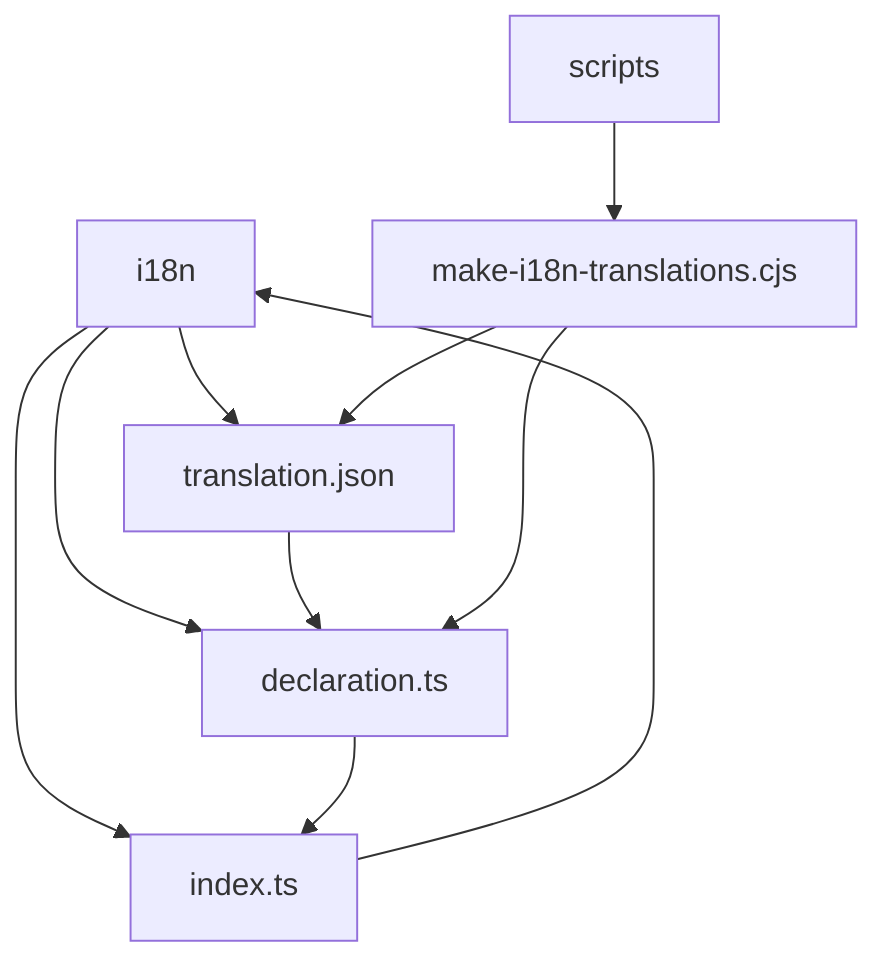
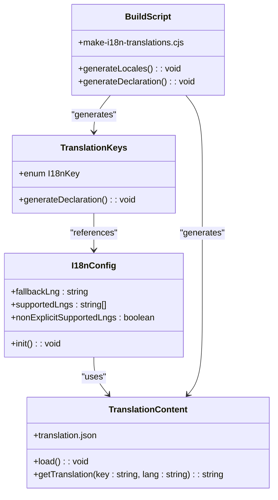
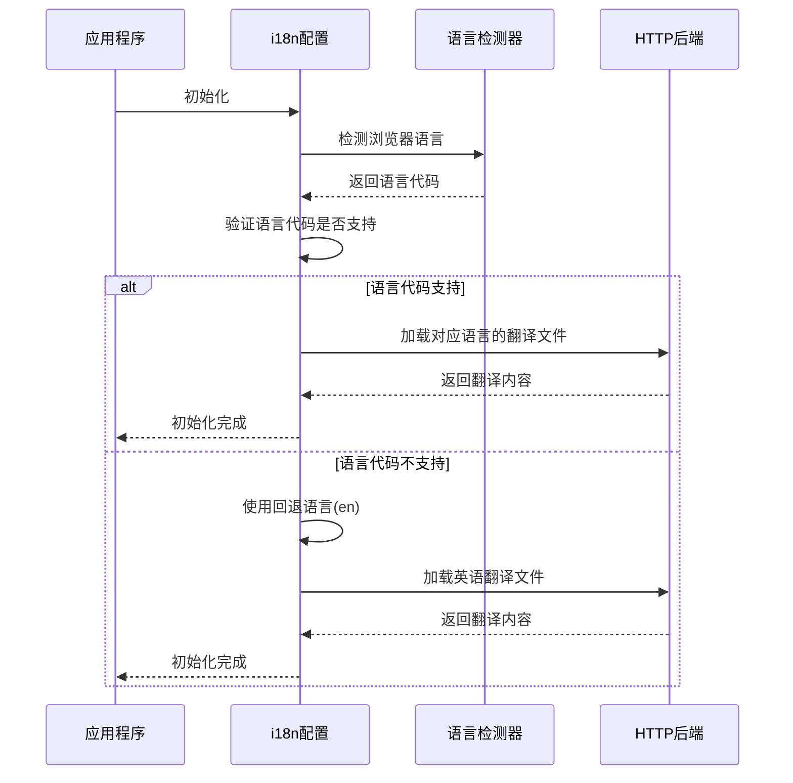
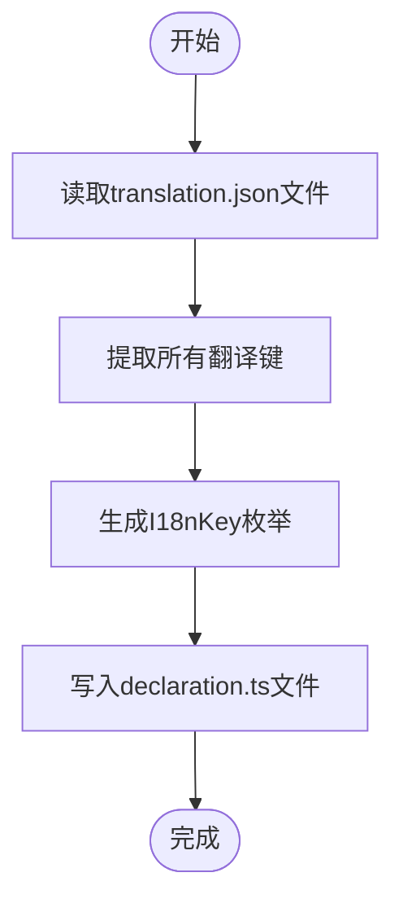
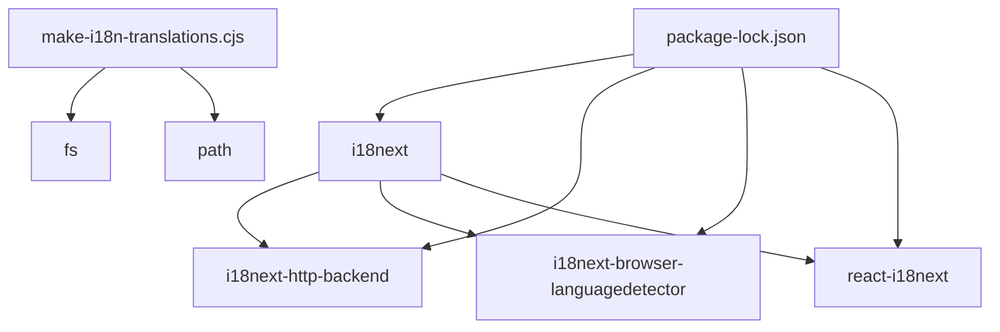

# 国际化(i18n)

<cite>
**本文档引用的文件**   
- [index.ts](file://frontend/src/i18n/index.ts)
- [declaration.ts](file://frontend/src/i18n/declaration.ts)
- [translation.json](file://frontend/src/i18n/translation.json)
- [make-i18n-translations.cjs](file://frontend/scripts/make-i18n-translations.cjs)
- [language-input.tsx](file://frontend/src/components/features/settings/app-settings/language-input.tsx)
- [usage-section.tsx](file://frontend/src/components/features/conversation/metrics-modal/usage-section.tsx)
</cite>

## 目录
1. [简介](#简介)
2. [项目结构](#项目结构)
3. [核心组件](#核心组件)
4. [架构概述](#架构概述)
5. [详细组件分析](#详细组件分析)
6. [依赖分析](#依赖分析)
7. [性能考虑](#性能考虑)
8. [故障排除指南](#故障排除指南)
9. [结论](#结论)

## 简介
本文档详细说明了OpenHands项目的国际化(i18n)实现架构。文档涵盖了语言包的组织结构、翻译键的命名规范和动态加载机制。解释了i18n上下文在React组件中的使用方法和语言切换的实现流程。分析了现有翻译文件的结构特点和缺失键的处理策略。提供了新语言添加的完整流程指南，包括RTL布局的特殊考虑。文档还包含性能监控方案和翻译质量保证的最佳实践。

## 项目结构
OpenHands项目的国际化实现主要集中在前端部分，位于`frontend/src/i18n`目录下。该目录包含了国际化所需的核心文件，包括配置文件、翻译键声明和翻译内容文件。翻译文件通过构建脚本自动生成，确保了翻译键的一致性和完整性。



**Diagram sources**
- [index.ts](file://frontend/src/i18n/index.ts)
- [declaration.ts](file://frontend/src/i18n/declaration.ts)
- [translation.json](file://frontend/src/i18n/translation.json)
- [make-i18n-translations.cjs](file://frontend/scripts/make-i18n-translations.cjs)

**Section sources**
- [index.ts](file://frontend/src/i18n/index.ts)
- [declaration.ts](file://frontend/src/i18n/declaration.ts)
- [translation.json](file://frontend/src/i18n/translation.json)
- [make-i18n-translations.cjs](file://frontend/scripts/make-i18n-translations.cjs)

## 核心组件
国际化实现的核心组件包括i18next配置、翻译键枚举和翻译内容文件。`index.ts`文件负责初始化i18next实例，配置支持的语言和回退机制。`declaration.ts`文件通过脚本自动生成，包含了所有翻译键的枚举，确保了类型安全。`translation.json`文件包含了所有语言的翻译内容，按语言代码组织。

**Section sources**
- [index.ts](file://frontend/src/i18n/index.ts)
- [declaration.ts](file://frontend/src/i18n/declaration.ts)
- [translation.json](file://frontend/src/i18n/translation.json)

## 架构概述
OpenHands的国际化架构基于i18next库，结合React-i18next进行React组件集成。架构采用了中心化的翻译文件管理方式，通过JSON文件存储所有翻译内容。翻译键使用大写字母和美元符号分隔的命名规范，确保了键的可读性和一致性。构建脚本在构建时自动生成翻译键枚举，防止了翻译键的拼写错误。



**Diagram sources**
- [index.ts](file://frontend/src/i18n/index.ts)
- [declaration.ts](file://frontend/src/i18n/declaration.ts)
- [translation.json](file://frontend/src/i18n/translation.json)
- [make-i18n-translations.cjs](file://frontend/scripts/make-i18n-translations.cjs)

## 详细组件分析

### i18n配置分析
i18n配置文件`index.ts`初始化了i18next实例，配置了HTTP后端、浏览器语言检测器和React集成。配置中明确指定了支持的语言列表，防止了对不支持语言代码的404请求。回退语言设置为英语(en)，确保了当请求的语言不可用时能够提供默认翻译。



**Diagram sources**
- [index.ts](file://frontend/src/i18n/index.ts)

**Section sources**
- [index.ts](file://frontend/src/i18n/index.ts)

### 翻译键声明分析
翻译键声明文件`declaration.ts`通过`make-i18n-translations.cjs`脚本自动生成。该脚本读取`translation.json`文件中的所有键，生成一个包含所有翻译键的枚举。这种机制确保了翻译键的类型安全，防止了在代码中使用不存在的翻译键。



**Diagram sources**
- [make-i18n-translations.cjs](file://frontend/scripts/make-i18n-translations.cjs)
- [declaration.ts](file://frontend/src/i18n/declaration.ts)

**Section sources**
- [make-i18n-translations.cjs](file://frontend/scripts/make-i18n-translations.cjs)
- [declaration.ts](file://frontend/src/i18n/declaration.ts)

### 翻译内容组织分析
翻译内容存储在`translation.json`文件中，采用嵌套的JSON结构。每个翻译键对应一个对象，对象的属性是语言代码，值是对应语言的翻译文本。这种结构使得添加新语言变得简单，只需在每个翻译键下添加新的语言属性即可。

```mermaid
erDiagram
TRANSLATION_KEY {
string key PK
string en
string ja
string zh-CN
string zh-TW
string ko-KR
string no
string ar
string de
string fr
string it
string pt
string es
string tr
string uk
}
```

**Diagram sources**
- [translation.json](file://frontend/src/i18n/translation.json)

**Section sources**
- [translation.json](file://frontend/src/i18n/translation.json)

## 依赖分析
国际化实现依赖于多个第三方库，包括i18next、i18next-http-backend、i18next-browser-languagedetector和react-i18next。这些库通过npm包管理器进行管理，版本锁定在package-lock.json文件中。构建脚本依赖于Node.js的文件系统和路径模块来生成翻译文件和声明文件。



**Diagram sources**
- [package-lock.json](file://frontend/package-lock.json)
- [make-i18n-translations.cjs](file://frontend/scripts/make-i18n-translations.cjs)

**Section sources**
- [package-lock.json](file://frontend/package-lock.json)
- [make-i18n-translations.cjs](file://frontend/scripts/make-i18n-translations.cjs)

## 性能考虑
国际化实现考虑了性能优化，通过HTTP后端按需加载翻译文件，避免了在初始加载时下载所有语言的翻译内容。语言检测器优先使用浏览器语言设置，减少了用户手动选择语言的需要。构建时生成的翻译键枚举减少了运行时的字符串比较，提高了翻译查找的效率。

## 故障排除指南
当遇到国际化相关问题时，可以按照以下步骤进行排查：
1. 检查`translation.json`文件中是否存在所需的翻译键
2. 确认新添加的翻译键已通过构建脚本生成到`declaration.ts`文件中
3. 验证语言代码是否在`AvailableLanguages`数组中定义
4. 检查网络请求，确认翻译文件是否正确加载
5. 查看浏览器控制台，检查是否有i18next相关的错误信息

**Section sources**
- [index.ts](file://frontend/src/i18n/index.ts)
- [declaration.ts](file://frontend/src/i18n/declaration.ts)
- [translation.json](file://frontend/src/i18n/translation.json)

## 结论
OpenHands项目的国际化实现采用了现代化的i18next解决方案，结合React-i18next提供了良好的开发者体验。通过自动化脚本生成翻译键枚举，确保了类型安全和开发效率。中心化的翻译文件管理使得多语言支持易于维护和扩展。架构设计考虑了性能优化，通过按需加载翻译文件减少了初始加载时间。整体实现为OpenHands应用提供了强大的多语言支持能力。