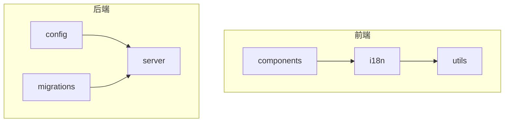
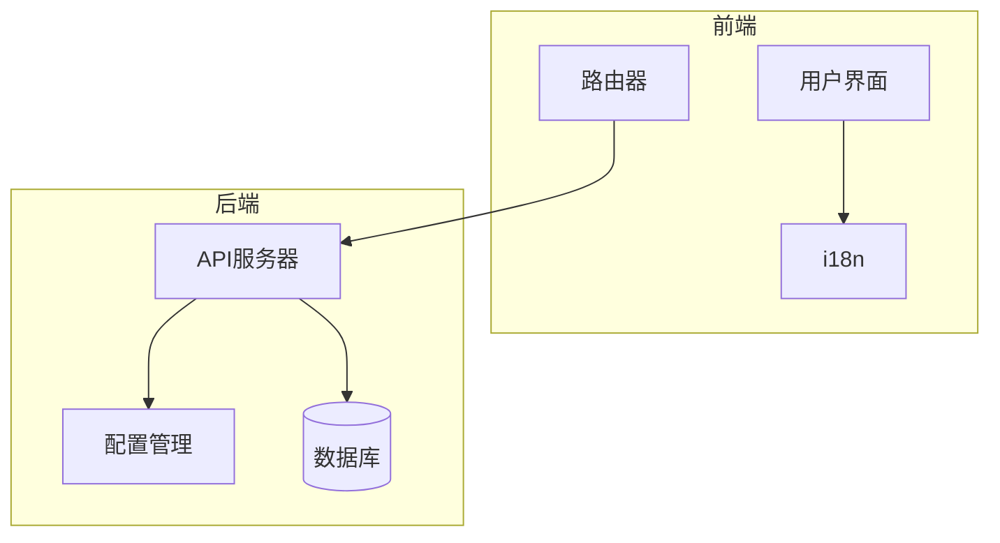
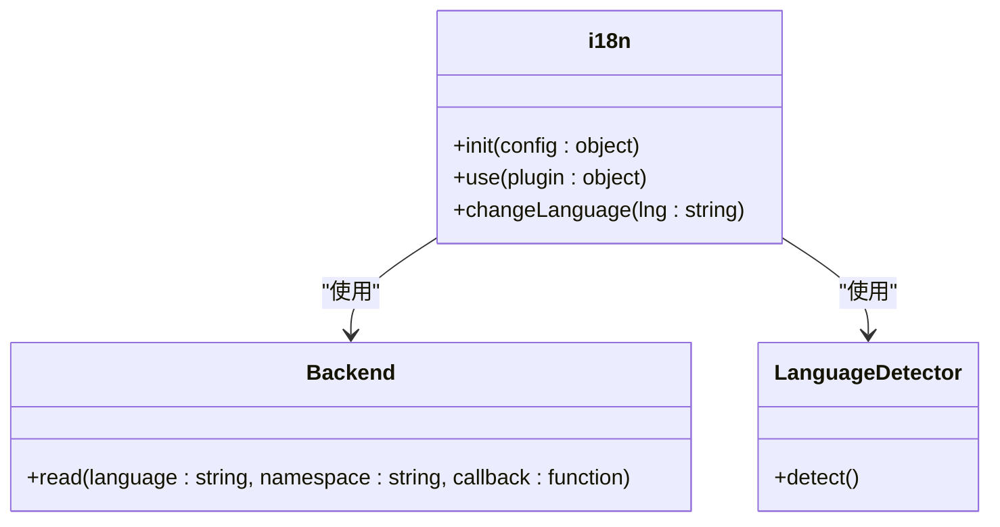
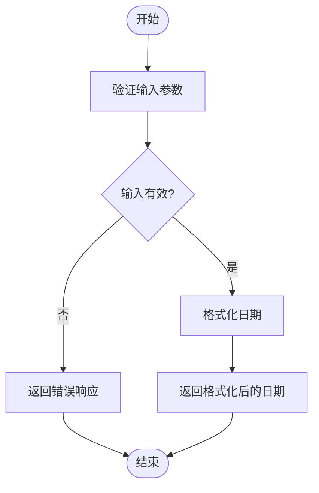
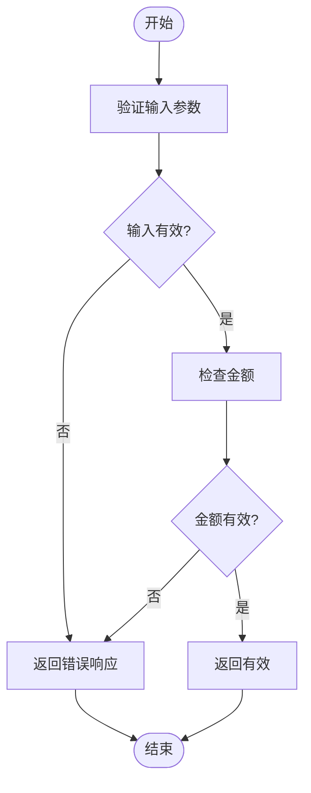
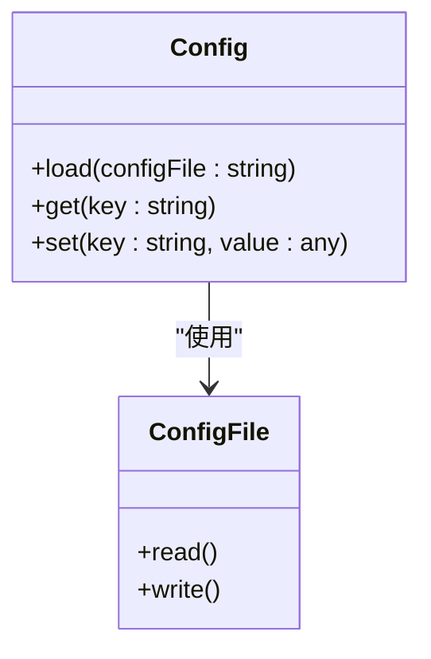
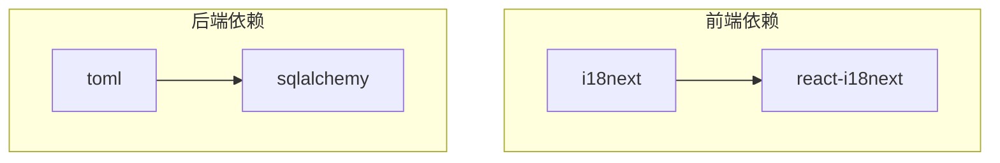

# 本地化策略

<cite>
**本文档引用的文件**
- [language-input.tsx](file://frontend/src/components/features/settings/app-settings/language-input.tsx)
- [index.ts](file://frontend/src/i18n/index.ts)
- [translation.json](file://frontend/src/i18n/translation.json)
- [declaration.ts](file://frontend/src/i18n/declaration.ts)
- [format-time-delta.ts](file://frontend/src/utils/format-time-delta.ts)
- [amount-is-valid.ts](file://frontend/src/utils/amount-is-valid.ts)
- [config.template.toml](file://config.template.toml)
- [maintenance-banner.tsx](file://frontend/src/components/features/maintenance/maintenance-banner.tsx)
- [sql_utils.py](file://openhands/app_server/utils/sql_utils.py)
</cite>

## 目录
1. [简介](#简介)
2. [项目结构](#项目结构)
3. [核心组件](#核心组件)
4. [架构概述](#架构概述)
5. [详细组件分析](#详细组件分析)
6. [依赖分析](#依赖分析)
7. [性能考虑](#性能考虑)
8. [故障排除指南](#故障排除指南)
9. [结论](#结论)
10. [附录](#附录) (如有必要)

## 简介
本文档详细阐述了OpenHands项目的本地化策略，涵盖日期、时间、数字和货币的格式化方案。文档解释了文化特定内容的处理方法，如文本方向、排序规则和称谓系统。此外，文档还涵盖了本地化上下文的传递机制和组件级别的本地化配置，并提供了性能优化建议和bundle大小控制策略。

## 项目结构
项目结构显示了前端和后端文件的组织方式，其中前端部分包含了i18n相关的文件，如`translation.json`和`index.ts`，这些文件用于处理多语言支持。后端部分则包含了配置文件和数据库迁移脚本。



**图表来源**
- [index.ts](file://frontend/src/i18n/index.ts)
- [config.template.toml](file://config.template.toml)

**章节来源**
- [index.ts](file://frontend/src/i18n/index.ts)
- [config.template.toml](file://config.template.toml)

## 核心组件
核心组件包括前端的i18n配置和后端的配置管理。前端使用i18next库来处理多语言支持，而后端则通过配置文件来管理各种设置。

**章节来源**
- [index.ts](file://frontend/src/i18n/index.ts)
- [config.template.toml](file://config.template.toml)

## 架构概述
系统架构包括前端的React应用和后端的服务器。前端负责用户界面的多语言支持，而后端负责处理业务逻辑和数据存储。



**图表来源**
- [index.ts](file://frontend/src/i18n/index.ts)
- [config.template.toml](file://config.template.toml)

## 详细组件分析
### 前端i18n配置分析
前端的i18n配置使用i18next库来处理多语言支持。配置文件`index.ts`定义了支持的语言和回退语言。



**图表来源**
- [index.ts](file://frontend/src/i18n/index.ts)

#### 日期和时间格式化
日期和时间格式化通过`formatDateMMDDYYYY`函数实现，该函数使用`toLocaleDateString`方法来格式化日期。



**图表来源**
- [format-time-delta.ts](file://frontend/src/utils/format-time-delta.ts)

#### 数字和货币格式化
数字和货币格式化通过`amountIsValid`函数实现，该函数验证金额的有效性。



**图表来源**
- [amount-is-valid.ts](file://frontend/src/utils/amount-is-valid.ts)

### 后端配置管理分析
后端配置管理通过`config.template.toml`文件实现，该文件定义了各种配置选项。



**图表来源**
- [config.template.toml](file://config.template.toml)

**章节来源**
- [config.template.toml](file://config.template.toml)

## 依赖分析
项目依赖包括前端的i18next库和后端的配置管理库。这些依赖通过`package.json`和`pyproject.toml`文件管理。



**图表来源**
- [package.json](file://frontend/package.json)
- [pyproject.toml](file://pyproject.toml)

## 性能考虑
为了优化性能，建议使用懒加载来加载翻译文件，并使用缓存来存储已加载的翻译。

## 故障排除指南
如果遇到本地化问题，请检查`translation.json`文件是否包含所有必要的翻译键，并确保`index.ts`文件中的配置正确。

**章节来源**
- [translation.json](file://frontend/src/i18n/translation.json)
- [index.ts](file://frontend/src/i18n/index.ts)

## 结论
本文档详细介绍了OpenHands项目的本地化策略，包括日期、时间、数字和货币的格式化方案，以及文化特定内容的处理方法。通过遵循这些策略，可以确保应用程序在全球范围内的一致性和可用性。

## 附录
### 附录A: 支持的语言列表
- English (en)
- 日本語 (ja)
- 简体中文 (zh-CN)
- 繁體中文 (zh-TW)
- 한국어 (ko-KR)
- Norsk (no)
- Arabic (ar)
- Deutsch (de)
- Français (fr)
- Italiano (it)
- Português (pt)
- Español (es)
- Türkçe (tr)
- Українська (uk)

### 附录B: 配置文件示例
```toml
[core]
workspace_base = "./workspace"
debug = false

[llm]
api_key = ""
model = "gpt-4o"

[agent]
enable_browsing = true
enable_jupyter = true
```