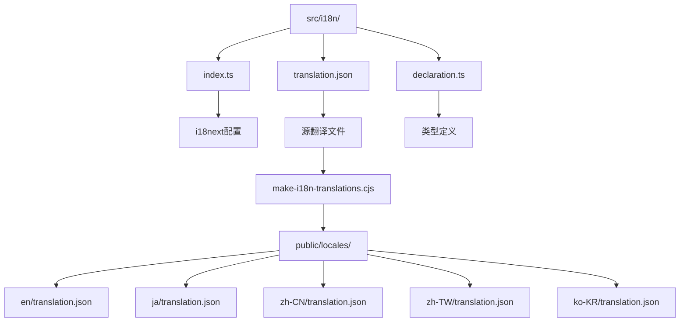
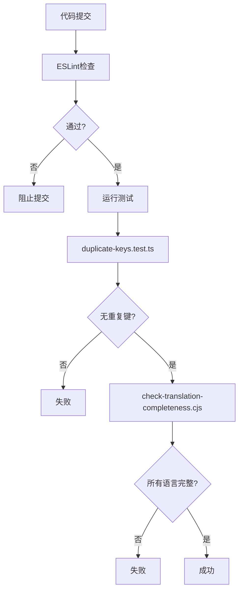
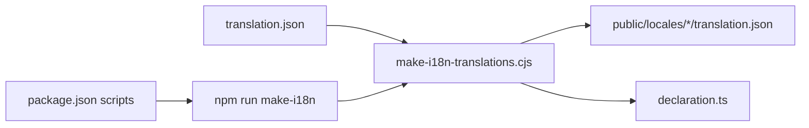

# 翻译流程

<cite>
**本文档引用的文件**
- [index.ts](file://frontend/src/i18n/index.ts)
- [translation.json](file://frontend/src/i18n/translation.json)
- [declaration.ts](file://frontend/src/i18n/declaration.ts)
- [make-i18n-translations.cjs](file://frontend/scripts/make-i18n-translations.cjs)
- [check-translation-completeness.cjs](file://frontend/scripts/check-translation-completeness.cjs)
- [duplicate-keys.test.ts](file://frontend/__tests__/i18n/duplicate-keys.test.ts)
- [package.json](file://frontend/package.json)
</cite>

## 目录
1. [翻译键命名约定](#翻译键命名约定)
2. [文件组织结构](#文件组织结构)
3. [版本控制策略](#版本控制策略)
4. [翻译文件验证机制](#翻译文件验证机制)
5. [缺失键处理方案](#缺失键处理方案)
6. [自动化提取工具链](#自动化提取工具链)
7. [CI/CD集成](#cicd集成)
8. [翻译质量检查清单](#翻译质量检查清单)
9. [审核流程指南](#审核流程指南)
10. [RTL文本特殊处理](#rtl文本特殊处理)

## 翻译键命名约定

OpenHands项目的翻译键采用模块化命名约定，使用大写字母和美元符号（$）分隔符来组织键名。每个翻译键遵循`MODULE$KEY_NAME`的格式，其中模块名称表示功能区域，键名称表示具体的翻译内容。

这种命名约定通过模块前缀（如`SETTINGS$`、`MICROAGENT$`、`CHAT_INTERFACE$`）来组织翻译键，确保了命名空间的清晰性和可维护性。例如，`SETTINGS$LANGUAGE`表示设置模块中的语言相关文本，而`MICROAGENT$ADD_TO_MICROAGENT`表示微代理模块中"添加到微代理"的文本。

所有翻译键都定义在`src/i18n/declaration.ts`文件中，作为枚举类型`I18nKey`的成员。这种枚举定义方式提供了类型安全，确保在代码中使用翻译键时能够获得编译时检查和自动补全支持。

**Section sources**
- [declaration.ts](file://frontend/src/i18n/declaration.ts)

## 文件组织结构

翻译系统的文件组织结构遵循清晰的目录结构，所有国际化相关文件都位于`frontend/src/i18n/`目录下。该目录包含三个核心文件：`index.ts`、`translation.json`和`declaration.ts`。

`translation.json`是主要的翻译资源文件，采用嵌套的JSON结构存储所有翻译内容。其结构为`{ "KEY": { "en": "English text", "ja": "日本語テキスト", ... } }`，其中每个翻译键对应一个包含多种语言翻译的对象。

`declaration.ts`文件包含由构建脚本自动生成的`I18nKey`枚举，为所有翻译键提供类型安全。`index.ts`文件配置i18next国际化库，定义支持的语言列表和初始化设置。

在构建过程中，系统会自动生成`public/locales/`目录，其中包含按语言代码组织的翻译文件。例如，英语翻译位于`public/locales/en/translation.json`，日语翻译位于`public/locales/ja/translation.json`。

**Diagram sources**
- [index.ts](file://frontend/src/i18n/index.ts)
- [translation.json](file://frontend/src/i18n/translation.json)
- [declaration.ts](file://frontend/src/i18n/declaration.ts)
- [make-i18n-translations.cjs](file://frontend/scripts/make-i18n-translations.cjs)

**Section sources**
- [index.ts](file://frontend/src/i18n/index.ts)
- [translation.json](file://frontend/src/i18n/translation.json)
- [declaration.ts](file://frontend/src/i18n/declaration.ts)

## 版本控制策略

翻译文件的版本控制策略与代码库的版本控制紧密集成，确保翻译内容与功能开发同步。`src/i18n/translation.json`作为主翻译文件被纳入Git版本控制，所有翻译更新都通过标准的代码提交和拉取请求流程进行管理。

当添加新功能或修改用户界面时，开发人员首先在`translation.json`中添加新的翻译键，然后通过自动化工具生成相应的类型定义。这些更改与其他代码更改一起提交，并通过代码审查流程进行审核。

对于大型翻译更新或新语言的添加，项目采用分支策略。翻译贡献者可以在专门的分支上工作，完成翻译后通过拉取请求合并到主分支。这种策略确保了翻译质量的控制，同时允许并行的翻译工作。

版本控制还支持翻译的回滚和历史追踪。由于所有翻译更改都记录在Git历史中，团队可以轻松查看翻译的演变过程，必要时恢复到之前的版本。

**Section sources**
- [translation.json](file://frontend/src/i18n/translation.json)

## 翻译文件验证机制

项目实施了多层次的翻译文件验证机制，确保翻译质量和完整性。验证机制包括静态分析、运行时检查和自动化测试。

首先，项目使用`eslint-plugin-i18next`插件在代码审查阶段检查翻译键的使用。该插件能够检测未使用的翻译键、拼写错误和格式问题，确保代码中引用的翻译键确实存在于翻译文件中。

其次，项目包含专门的测试文件`duplicate-keys.test.ts`，用于验证翻译文件中不存在重复的键。该测试使用正则表达式扫描`translation.json`文件，检测并报告任何重复的翻译键，防止因键名冲突导致的翻译错误。

最重要的是，`check-translation-completeness.cjs`脚本实现了翻译完整性检查。该脚本验证每个翻译键是否包含所有支持语言的翻译，确保没有遗漏。它还检查是否存在针对未在`AvailableLanguages`中定义的语言的翻译，维护翻译集的准确性。

**Diagram sources**
- [duplicate-keys.test.ts](file://frontend/__tests__/i18n/duplicate-keys.test.ts)
- [check-translation-completeness.cjs](file://frontend/scripts/check-translation-completeness.cjs)

**Section sources**
- [duplicate-keys.test.ts](file://frontend/__tests__/i18n/duplicate-keys.test.ts)
- [check-translation-completeness.cjs](file://frontend/scripts/check-translation-completeness.cjs)

## 缺失键处理方案

系统采用分层的缺失键处理方案，确保用户界面的稳定性和用户体验。当请求的翻译键不存在时，系统会按照预定义的回退策略进行处理。

首要的保护机制是编译时类型检查。通过`I18nKey`枚举，TypeScript编译器能够捕获代码中使用未定义翻译键的情况，防止此类错误进入运行时阶段。

在运行时，i18next库配置了多级回退策略。首先，如果特定语言的翻译缺失，系统会回退到英语（en）作为后备语言。其次，如果连英语翻译也不存在，i18next会返回原始的键名作为占位符，而不是显示空白或错误。

这种"优雅降级"策略确保了即使在翻译不完整的情况下，用户界面仍然可用。开发人员可以在开发过程中识别这些回退情况，并及时补充缺失的翻译。此外，`check-translation-completeness.cjs`脚本在CI/CD流程中强制执行翻译完整性，从源头上减少缺失键的发生。

**Section sources**
- [index.ts](file://frontend/src/i18n/index.ts)
- [check-translation-completeness.cjs](file://frontend/scripts/check-translation-completeness.cjs)

## 自动化提取工具链

项目建立了完整的自动化工具链，用于翻译键的提取、生成和同步。核心工具是`make-i18n-translations.cjs`脚本，它负责将单一的源翻译文件转换为i18next所需的格式。

该工具链的工作流程如下：开发人员在`src/i18n/translation.json`中添加或修改翻译内容。然后，`make-i18n-translations.cjs`脚本读取这个源文件，重新组织数据结构，为每种支持的语言生成单独的翻译文件，并将其输出到`public/locales/`目录。

同时，该脚本还会生成`src/i18n/declaration.ts`文件，将所有翻译键转换为TypeScript枚举。这一过程实现了翻译资源与代码类型的同步，为开发提供了类型安全。

工具链通过`package.json`中的脚本命令集成：
- `npm run make-i18n`：执行翻译文件生成
- `npm run check-translation-completeness`：验证翻译完整性
- `npm run prelint`：在linting前自动生成翻译文件

这种自动化流程确保了翻译资源的一致性和及时更新，减少了手动操作的错误。

**Diagram sources**
- [make-i18n-translations.cjs](file://frontend/scripts/make-i18n-translations.cjs)
- [package.json](file://frontend/package.json)

**Section sources**
- [make-i18n-translations.cjs](file://frontend/scripts/make-i18n-translations.cjs)
- [package.json](file://frontend/package.json)

## CI/CD集成

翻译流程深度集成到CI/CD管道中，通过自动化检查确保翻译质量。集成主要通过`package.json`中的`lint-staged`配置和CI脚本实现。

在开发阶段，Git预提交钩子（由`lint-staged`配置）会在每次提交时自动运行翻译验证。具体流程包括：首先执行`make-i18n`生成最新翻译文件，然后运行`check-translation-completeness`验证翻译完整性，最后通过ESLint检查代码中的翻译使用。

在持续集成阶段，CI管道执行完整的测试套件，包括翻译相关的测试。`test_translation_completeness.py`单元测试验证完整性检查脚本的正确性，确保其能够准确检测翻译问题。

CI/CD集成的关键优势在于早期发现问题。任何违反翻译规则的提交（如缺失翻译、重复键名）都会导致构建失败，阻止有问题的代码进入主分支。这种"失败快"的策略维护了代码库的高质量标准。

**Section sources**
- [package.json](file://frontend/package.json)
- [test_translation_completeness.py](file://tests/unit/frontend/test_translation_completeness.py)

## 翻译质量检查清单

为确保翻译质量，项目维护一个全面的检查清单，涵盖技术、语言和用户体验方面的要求。

**技术完整性检查：**
- 所有翻译键在`translation.json`中定义
- 每个键包含所有支持语言的翻译
- 无重复的翻译键
- 翻译文件语法正确（有效的JSON）
- 占位符（如`{{time}}`）在所有语言版本中一致

**语言质量检查：**
- 翻译准确传达原文含义
- 术语在全文档中保持一致
- 语气和风格符合产品定位
- 本地化适当（如日期格式、数字格式）
- 无机器翻译痕迹或语法错误

**用户体验检查：**
- 翻译文本长度适合UI布局
- 关键操作按钮文本清晰明确
- 错误消息提供有用信息
- 文化敏感内容适当处理
- RTL语言文本正确对齐

此检查清单在代码审查和翻译审核过程中使用，确保翻译不仅技术正确，而且提供优质的用户体验。

**Section sources**
- [translation.json](file://frontend/src/i18n/translation.json)

## 审核流程指南

翻译审核流程遵循与代码审查相同的严格标准，确保翻译质量和一致性。流程包括自动化检查和人工审查两个阶段。

自动化阶段在提交前执行，由Git钩子触发。该阶段运行所有翻译验证脚本，包括重复键检查、完整性验证和ESLint检查。任何自动化检查失败都会阻止提交，确保只有通过基本验证的更改才能进入审查流程。

人工审查阶段由领域专家和母语审阅者执行。审查重点包括：
1. **准确性**：翻译是否准确传达了原文的技术含义
2. **一致性**：术语和短语是否与产品其他部分保持一致
3. **自然性**：文本是否符合目标语言的表达习惯
4. **上下文**：翻译是否考虑了实际使用场景

对于争议性翻译，团队参考风格指南并进行讨论以达成共识。审核通过后，翻译更改才能合并到主分支。这种双重审查机制平衡了效率和质量，确保了高水平的翻译标准。

**Section sources**
- [translation.json](file://frontend/src/i18n/translation.json)

## RTL文本特殊处理

项目对RTL（从右到左）文本提供了专门的支持，确保阿拉伯语等RTL语言的正确显示。虽然当前代码库中没有明确的RTL特定代码，但基础架构已为此做好准备。

i18next国际化库原生支持RTL语言，能够根据当前语言自动调整文本方向。CSS框架Tailwind CSS也提供了RTL支持，可以通过配置启用。

处理RTL文本的关键实践包括：
- 使用逻辑属性而非物理属性（如`margin-inline-start`而非`margin-left`）
- 在HTML中设置`dir`属性以指示文本方向
- 测试数字和混合文本（LTR和RTL）的显示
- 确保图标和UI元素的布局适应RTL

虽然当前支持的语言列表中没有RTL语言，但系统架构允许轻松添加，如阿拉伯语（ar）已列在`AvailableLanguages`中。添加RTL语言时，需要特别注意UI布局的镜像和文本对齐。

**Section sources**
- [index.ts](file://frontend/src/i18n/index.ts)