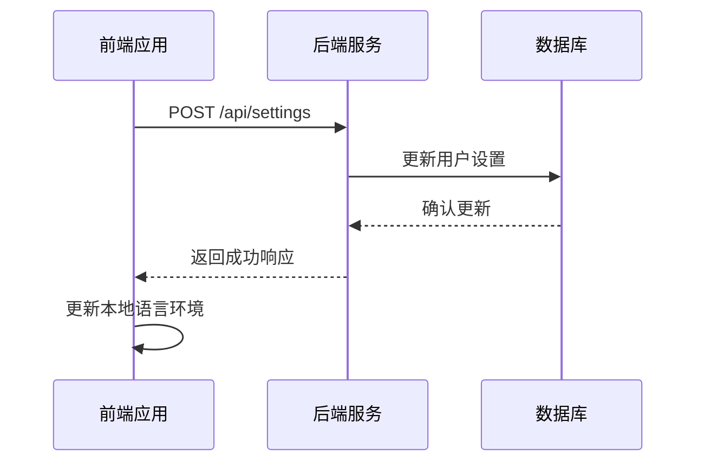

# 语言管理

<cite>
**本文档引用的文件**   
- [index.ts](file://frontend/src/i18n/index.ts)
- [declaration.ts](file://frontend/src/i18n/declaration.ts)
- [translation.json](file://frontend/src/i18n/translation.json)
- [language-input.tsx](file://frontend/src/components/features/settings/app-settings/language-input.tsx)
- [app-settings.tsx](file://frontend/src/routes/app-settings.tsx)
- [user_settings.py](file://enterprise/storage/user_settings.py)
- [saas_settings_store.py](file://enterprise/storage/saas_settings_store.py)
</cite>

## 目录
1. [简介](#简介)
2. [支持的语言列表](#支持的语言列表)
3. [默认语言配置](#默认语言配置)
4. [语言切换机制](#语言切换机制)
5. [语言环境检测逻辑](#语言环境检测逻辑)
6. [用户偏好存储方案](#用户偏好存储方案)
7. [语言包加载策略](#语言包加载策略)
8. [缓存机制](#缓存机制)
9. [错误处理](#错误处理)
10. [动态语言切换API接口](#动态语言切换api接口)
11. [状态管理实现](#状态管理实现)
12. [语言切换动画与用户体验优化](#语言切换动画与用户体验优化)

## 简介
本文档详细说明OpenHands平台的语言管理机制，涵盖支持的语言列表、默认语言配置、语言切换机制、语言环境检测逻辑、用户偏好存储方案、语言包加载策略、缓存机制和错误处理。同时提供动态语言切换的API接口文档和状态管理实现，并包括语言切换动画和用户体验优化的最佳实践。

## 支持的语言列表
OpenHands平台支持多种语言，具体包括：
- 英语 (en)
- 日语 (ja)
- 简体中文 (zh-CN)
- 繁体中文 (zh-TW)
- 韩语 (ko-KR)
- 挪威语 (no)
- 阿拉伯语 (ar)
- 德语 (de)
- 法语 (fr)
- 意大利语 (it)
- 葡萄牙语 (pt)
- 西班牙语 (es)
- 土耳其语 (tr)
- 乌克兰语 (uk)

这些语言在`AvailableLanguages`常量中定义，每个语言都有对应的标签和值。

**Section sources**
- [index.ts](file://frontend/src/i18n/index.ts#L6-L21)

## 默认语言配置
系统的默认语言配置如下：
- 回退语言（fallback language）设置为英语（en）
- 调试模式在开发环境中启用
- 明确定义支持的语言以防止404错误
- `nonExplicitSupportedLngs`设置为false以避免区域特定代码的404错误

这些配置在i18n初始化时设置，确保系统在不支持的语言环境下能够正确回退到默认语言。

**Section sources**
- [index.ts](file://frontend/src/i18n/index.ts#L28-L39)

## 语言切换机制
语言切换机制基于i18next库实现，主要包含以下组件：
- 使用`i18next-http-backend`从服务器加载语言包
- 使用`i18next-browser-languagedetector`检测浏览器语言环境
- 使用`react-i18next`与React框架集成

语言切换通过`i18n.changeLanguage()`方法实现，该方法接受语言代码作为参数并更新当前语言环境。

**Section sources**
- [index.ts](file://frontend/src/i18n/index.ts#L23-L41)

## 语言环境检测逻辑
语言环境检测逻辑主要通过`i18next-browser-languagedetector`实现，其工作流程如下：
1. 检测浏览器的`navigator.language`属性
2. 检测`navigator.languages`数组中的首选语言
3. 检查URL中的语言参数
4. 检查cookie中的语言设置
5. 检查localStorage中的语言偏好

检测到的语言代码会与`supportedLngs`列表进行匹配，如果匹配成功则使用该语言，否则回退到默认语言。

**Section sources**
- [index.ts](file://frontend/src/i18n/index.ts#L25)
- [translation.json](file://frontend/src/i18n/translation.json)

## 用户偏好存储方案
用户语言偏好存储在后端数据库中，具体实现如下：
- 用户设置存储在`user_settings`表中
- 语言偏好作为`LANGUAGE`字段存储
- 使用`saas_settings_store.py`进行设置的读取和保存
- 前端通过API调用保存和获取用户语言设置

当用户更改语言设置时，系统会调用`saveSettings` API将新的语言偏好保存到数据库中。

**Section sources**
- [user_settings.py](file://enterprise/storage/user_settings.py)
- [saas_settings_store.py](file://enterprise/storage/saas_settings_store.py)
- [app-settings.tsx](file://frontend/src/routes/app-settings.tsx#L83-L85)

## 语言包加载策略
语言包加载策略采用按需加载的方式，具体实现如下：
- 使用`i18next-http-backend`从服务器动态加载语言包
- 语言包以JSON格式存储在服务器上
- 根据当前语言环境加载相应的语言包
- 支持语言包的异步加载，避免阻塞页面渲染

语言包的结构采用键值对形式，其中键是大写的常量名，值是不同语言的翻译文本。

**Section sources**
- [index.ts](file://frontend/src/i18n/index.ts#L24)
- [translation.json](file://frontend/src/i18n/translation.json)

## 缓存机制
系统实现了多层缓存机制以提高语言加载性能：
- 浏览器缓存：语言包在浏览器中缓存，避免重复下载
- 内存缓存：i18next库在内存中缓存已加载的语言包
- 本地存储：用户语言偏好存储在localStorage中，实现快速访问

缓存机制确保用户在切换语言时能够快速加载翻译内容，提升用户体验。

**Section sources**
- [index.ts](file://frontend/src/i18n/index.ts)
- [app-settings.tsx](file://frontend/src/routes/app-settings.tsx)

## 错误处理
系统实现了完善的错误处理机制，主要包含：
- 404错误预防：通过`supportedLngs`配置防止请求不存在的语言包
- 语言回退机制：当请求的语言不存在时，自动回退到默认语言
- 错误日志记录：在开发模式下记录语言加载错误
- 用户友好的错误提示：向用户显示简洁明了的错误信息

特别地，系统明确设置`nonExplicitSupportedLngs: false`以防止区域特定代码的404错误。

**Section sources**
- [index.ts](file://frontend/src/i18n/index.ts#L36-L38)
- [translation.test.tsx](file://frontend/__tests__/i18n/translations.test.tsx#L61-L62)

## 动态语言切换API接口
动态语言切换通过以下API接口实现：

**Diagram sources**
- [app-settings.tsx](file://frontend/src/routes/app-settings.tsx#L83-L94)
- [saas_settings_store.py](file://enterprise/storage/saas_settings_store.py)

## 状态管理实现
语言状态管理采用以下实现方式：
- 使用i18next的状态管理机制跟踪当前语言环境
- 通过React的上下文（Context）传递翻译函数
- 在组件中使用`useTranslation`钩子获取翻译函数
- 语言切换时触发状态更新，重新渲染相关组件

状态管理确保整个应用的语言一致性，当语言切换时所有使用翻译的组件都会自动更新。

**Section sources**
- [language-input.tsx](file://frontend/src/components/features/settings/app-settings/language-input.tsx#L1-L34)
- [index.ts](file://frontend/src/i18n/index.ts)

## 语言切换动画与用户体验优化
为提升用户体验，系统实现了以下优化措施：
- 语言切换时的平滑过渡动画
- 加载语言包时的加载状态提示
- 保持页面布局稳定，避免内容跳动
- 快速回退到默认语言，减少等待时间
- 在用户更改语言后立即应用新语言

这些优化措施确保语言切换过程流畅自然，为用户提供良好的多语言体验。

**Section sources**
- [language-input.tsx](file://frontend/src/components/features/settings/app-settings/language-input.tsx)
- [app-settings.tsx](file://frontend/src/routes/app-settings.tsx)