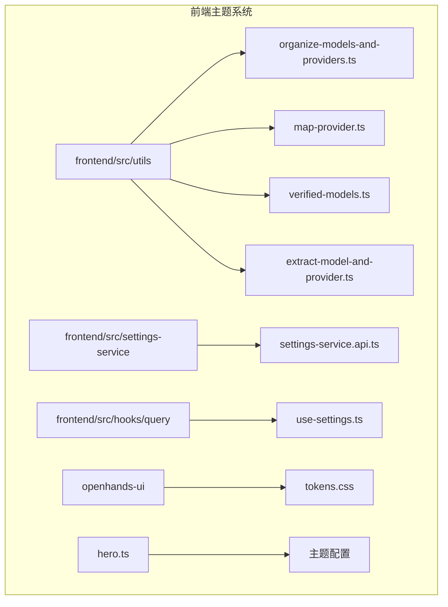
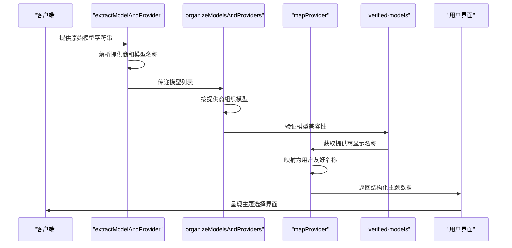
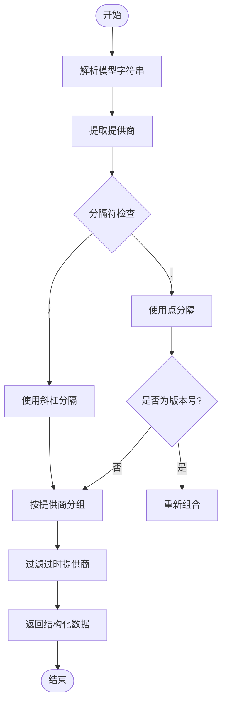
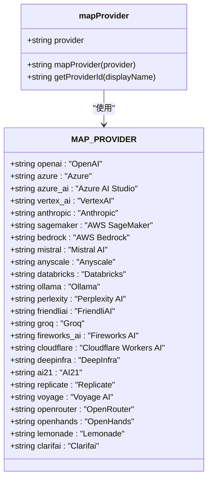
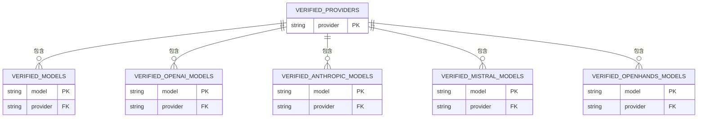
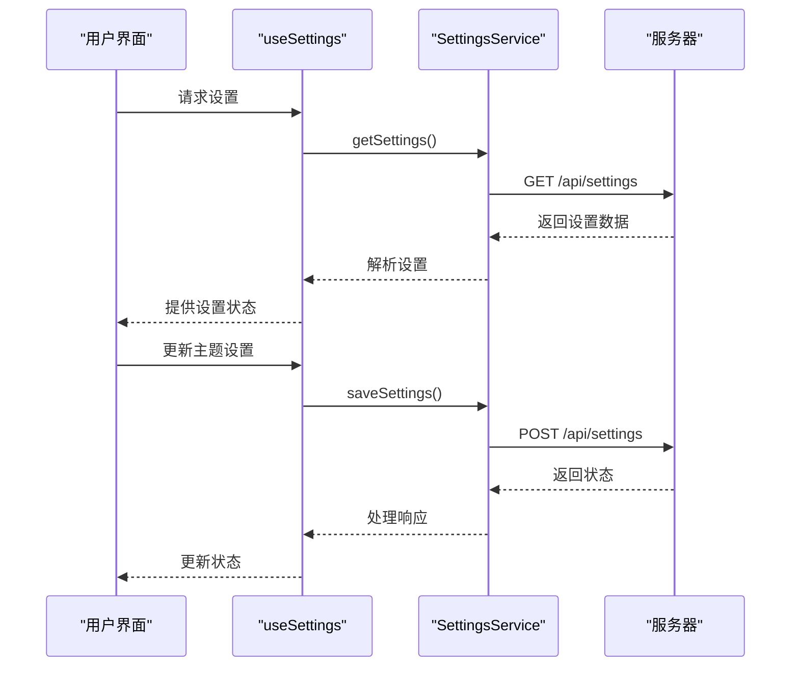
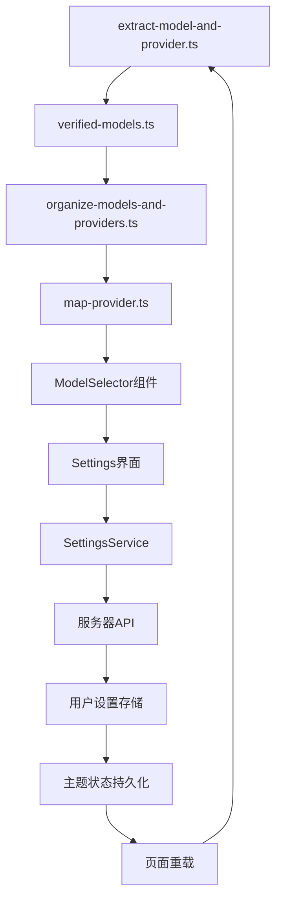

# 主题管理

<cite>
**本文档引用的文件**  
- [organize-models-and-providers.ts](file://frontend/src/utils/organize-models-and-providers.ts)
- [map-provider.ts](file://frontend/src/utils/map-provider.ts)
- [verified-models.ts](file://frontend/src/utils/verified-models.ts)
- [extract-model-and-provider.ts](file://frontend/src/utils/extract-model-and-provider.ts)
- [settings-service.api.ts](file://frontend/src/settings-service/settings-service.api.ts)
- [use-settings.ts](file://frontend/src/hooks/query/use-settings.ts)
- [settings.ts](file://frontend/src/types/settings.ts)
- [tokens.css](file://openhands-ui/tokens.css)
- [hero.ts](file://hero.ts)
</cite>

## 目录
1. [简介](#简介)
2. [项目结构](#项目结构)
3. [核心组件](#核心组件)
4. [架构概述](#架构概述)
5. [详细组件分析](#详细组件分析)
6. [依赖分析](#依赖分析)
7. [性能考虑](#性能考虑)
8. [故障排除指南](#故障排除指南)
9. [结论](#结论)

## 简介
本文档深入讲解OpenHands前端主题系统的实现机制，重点分析主题数据的动态映射与组织、主题验证模型、主题切换逻辑、状态管理以及用户设置集成。同时提供自定义主题扩展的开发指南，包括新增主题变量、深色/浅色模式切换和响应式主题调整，并包含常见问题排查方法和性能优化策略。

## 项目结构
OpenHands项目的主题管理系统主要分布在前端代码库中，涉及多个关键目录和文件。主题相关的逻辑主要集中在`frontend/src/utils`目录下的工具函数中，而主题样式定义则位于`openhands-ui`包中。

**图示来源**
- [organize-models-and-providers.ts](file://frontend/src/utils/organize-models-and-providers.ts)
- [map-provider.ts](file://frontend/src/utils/map-provider.ts)
- [verified-models.ts](file://frontend/src/utils/verified-models.ts)
- [extract-model-and-provider.ts](file://frontend/src/utils/extract-model-and-provider.ts)
- [settings-service.api.ts](file://frontend/src/settings-service/settings-service.api.ts)
- [use-settings.ts](file://frontend/src/hooks/query/use-settings.ts)
- [tokens.css](file://openhands-ui/tokens.css)
- [hero.ts](file://hero.ts)

**本节来源**
- [frontend/src/utils](file://frontend/src/utils)
- [frontend/src/settings-service](file://frontend/src/settings-service)
- [frontend/src/hooks/query](file://frontend/src/hooks/query)
- [openhands-ui](file://openhands-ui)

## 核心组件
主题管理系统的核心组件包括模型与提供商的组织工具、提供商映射工具、验证模型定义以及主题状态管理机制。这些组件协同工作，实现了动态主题数据映射、用户界面主题呈现和主题切换功能。

**本节来源**
- [organize-models-and-providers.ts](file://frontend/src/utils/organize-models-and-providers.ts)
- [map-provider.ts](file://frontend/src/utils/map-provider.ts)
- [verified-models.ts](file://frontend/src/utils/verified-models.ts)

## 架构概述
OpenHands主题系统采用分层架构设计，从数据提取、组织、验证到最终的用户界面呈现，形成了完整的主题管理流程。系统通过工具函数链式调用，将原始模型数据转换为结构化的主题数据，并通过状态管理机制实现主题的动态切换。

**图示来源**
- [extract-model-and-provider.ts](file://frontend/src/utils/extract-model-and-provider.ts)
- [organize-models-and-providers.ts](file://frontend/src/utils/organize-models-and-providers.ts)
- [map-provider.ts](file://frontend/src/utils/map-provider.ts)
- [verified-models.ts](file://frontend/src/utils/verified-models.ts)

## 详细组件分析

### 模型与提供商组织工具分析
`organize-models-and-providers.ts`文件中的`organizeModelsAndProviders`函数负责将扁平的模型列表组织为按提供商分类的结构化数据。该函数通过分隔符（"/"或"."）解析模型字符串，提取提供商信息，并将模型按提供商分组。

**图示来源**
- [organize-models-and-providers.ts](file://frontend/src/utils/organize-models-and-providers.ts#L27-L51)

**本节来源**
- [organize-models-and-providers.ts](file://frontend/src/utils/organize-models-and-providers.ts)

### 提供商映射工具分析
`map-provider.ts`文件实现了提供商名称到用户友好显示名称的映射。系统维护了一个`MAP_PROVIDER`常量对象，包含所有支持的提供商及其对应的显示名称。`mapProvider`函数根据提供商ID查找相应的显示名称，若未找到则返回原始ID。

**图示来源**
- [map-provider.ts](file://frontend/src/utils/map-provider.ts#L2-L29)

**本节来源**
- [map-provider.ts](file://frontend/src/utils/map-provider.ts)

### 验证模型与主题呈现关联分析
`verified-models.ts`文件定义了系统验证的主题模型和提供商列表。这些验证模型确保了主题系统的兼容性和稳定性。系统通过`VERIFIED_PROVIDERS`和`VERIFIED_MODELS`常量维护已验证的提供商和模型列表，并为特定提供商（如OpenAI、Anthropic、Mistral）提供专门的验证模型列表。

**图示来源**
- [verified-models.ts](file://frontend/src/utils/verified-models.ts#L2-L94)

**本节来源**
- [verified-models.ts](file://frontend/src/utils/verified-models.ts)

### 主题切换实现逻辑分析
主题切换的实现逻辑基于状态管理和用户设置集成。系统通过`settings-service.api.ts`中的`SettingsService`类管理应用设置，包括主题相关配置。`use-settings.ts`中的自定义Hook封装了设置的获取和保存逻辑，实现了主题状态的持久化。

**图示来源**
- [settings-service.api.ts](file://frontend/src/settings-service/settings-service.api.ts#L7-L27)
- [use-settings.ts](file://frontend/src/hooks/query/use-settings.ts#L1-L11)

**本节来源**
- [settings-service.api.ts](file://frontend/src/settings-service/settings-service.api.ts)
- [use-settings.ts](file://frontend/src/hooks/query/use-settings.ts)
- [settings.ts](file://frontend/src/types/settings.ts)

## 依赖分析
主题管理系统依赖于多个核心组件和外部服务，形成了复杂的依赖关系网络。系统通过工具函数的链式调用，实现了从原始数据到用户界面呈现的完整转换流程。

**图示来源**
- [extract-model-and-provider.ts](file://frontend/src/utils/extract-model-and-provider.ts)
- [verified-models.ts](file://frontend/src/utils/verified-models.ts)
- [organize-models-and-providers.ts](file://frontend/src/utils/organize-models-and-providers.ts)
- [map-provider.ts](file://frontend/src/utils/map-provider.ts)
- [settings-service.api.ts](file://frontend/src/settings-service/settings-service.api.ts)

**本节来源**
- [frontend/src/utils](file://frontend/src/utils)
- [frontend/src/settings-service](file://frontend/src/settings-service)

## 性能考虑
主题管理系统的性能优化主要体现在以下几个方面：工具函数的高效实现、状态管理的优化、API调用的最小化以及缓存机制的应用。系统通过避免重复计算、批量处理设置更新和合理使用React Query的缓存机制，确保了主题切换的流畅性。

- **工具函数优化**：`organizeModelsAndProviders`和`extractModelAndProvider`等工具函数采用单次遍历算法，时间复杂度为O(n)，确保了大数据量下的性能表现。
- **状态管理优化**：使用Zustand和React Query进行状态管理，避免了不必要的重新渲染，提高了UI响应速度。
- **API调用优化**：设置服务采用GET/POST模式，最小化网络请求次数，并通过HTTP缓存机制减少重复请求。
- **内存使用优化**：验证模型列表采用常量定义，避免了运行时的重复创建和垃圾回收开销。

## 故障排除指南
当主题管理系统出现问题时，可以按照以下步骤进行排查：

1. **检查模型解析问题**：如果模型无法正确解析，检查`extract-model-and-provider.ts`中的分隔符逻辑和版本号处理。
2. **验证提供商映射**：如果提供商显示名称不正确，确认`map-provider.ts`中的`MAP_PROVIDER`对象是否包含正确的映射关系。
3. **检查验证模型列表**：如果模型未被识别为已验证模型，检查`verified-models.ts`中的相关常量是否包含该模型。
4. **调试设置服务**：如果主题设置无法保存或加载，检查`settings-service.api.ts`中的API端点和错误处理逻辑。
5. **查看网络请求**：使用浏览器开发者工具检查设置相关的API请求，确认请求参数和响应数据是否正确。

**本节来源**
- [extract-model-and-provider.ts](file://frontend/src/utils/extract-model-and-provider.ts)
- [map-provider.ts](file://frontend/src/utils/map-provider.ts)
- [verified-models.ts](file://frontend/src/utils/verified-models.ts)
- [settings-service.api.ts](file://frontend/src/settings-service/settings-service.api.ts)

## 结论
OpenHands主题管理系统通过精心设计的工具函数和状态管理机制，实现了灵活、可扩展的主题管理功能。系统采用分层架构，将数据提取、组织、验证和呈现分离，提高了代码的可维护性和可测试性。通过`organize-models-and-providers.ts`、`map-provider.ts`和`verified-models.ts`等核心工具，系统能够动态映射和组织主题数据，确保了主题呈现的一致性和准确性。主题切换逻辑与用户设置深度集成，通过`SettingsService`实现了主题状态的持久化。未来可以进一步优化主题系统的性能，增加更多自定义主题选项，并完善主题相关的测试覆盖。