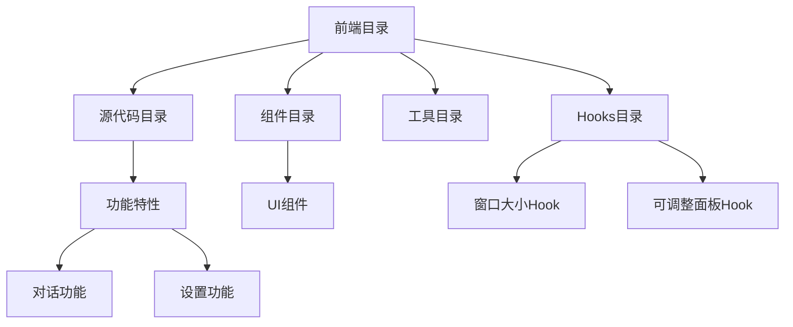
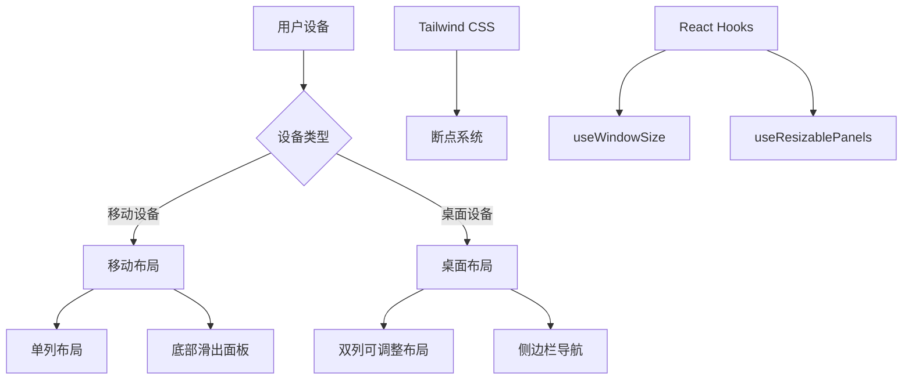
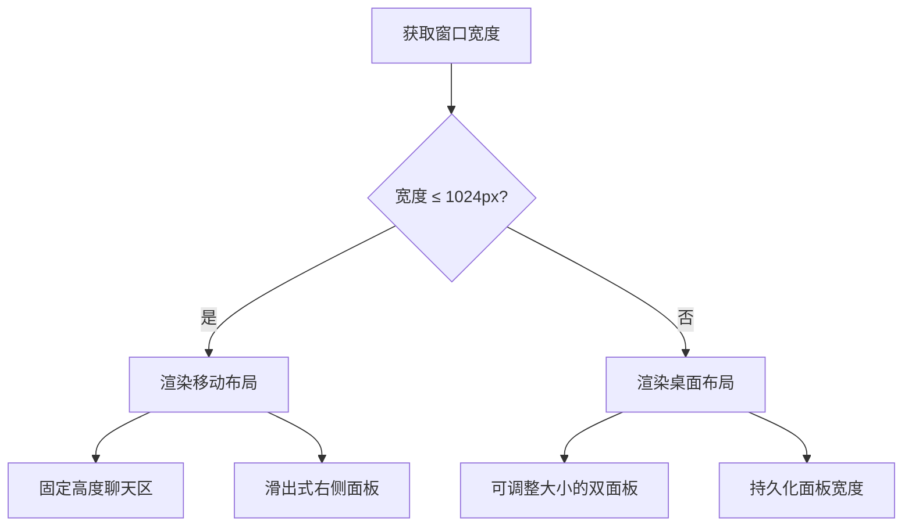
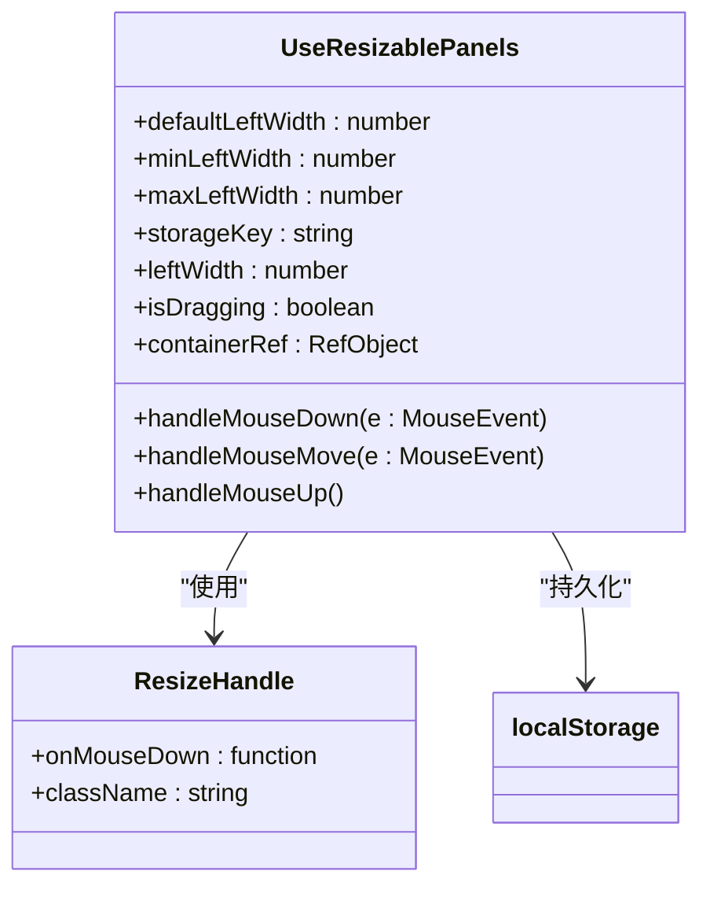
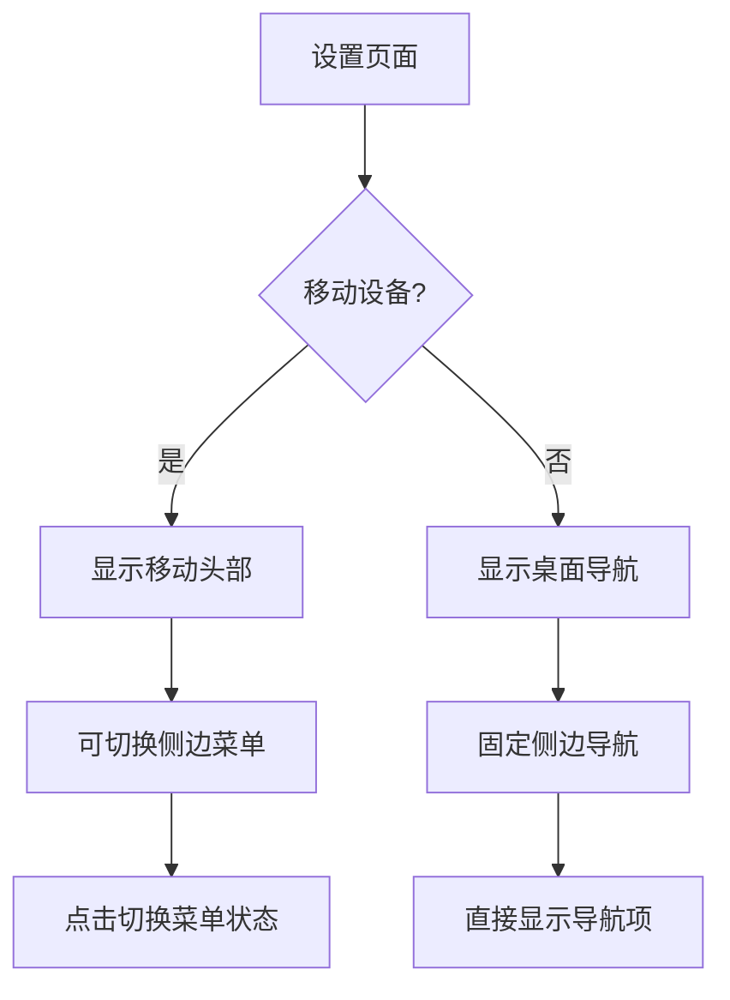

# 响应式设计

<cite>
**本文档引用的文件**
- [tailwind.config.js](file://frontend/tailwind.config.js)
- [conversation-main.tsx](file://frontend/src/components/features/conversation/conversation-main/conversation-main.tsx)
- [desktop-layout.tsx](file://frontend/src/components/features/conversation/conversation-main/desktop-layout.tsx)
- [mobile-layout.tsx](file://frontend/src/components/features/conversation/conversation-main/mobile-layout.tsx)
- [useWindowSize](file://frontend/src/hooks/useWindowSize)
- [use-resizable-panels.ts](file://frontend/src/hooks/use-resizable-panels.ts)
- [settings-layout.tsx](file://frontend/src/components/features/settings/settings-layout.tsx)
- [utils.ts](file://frontend/src/utils/utils.ts)
- [resize-handle.tsx](file://frontend/src/components/ui/resize-handle.tsx)
- [use-drag-resize.ts](file://frontend/src/hooks/use-drag-resize.ts)
</cite>

## 目录
1. [简介](#简介)
2. [项目结构](#项目结构)
3. [核心组件](#核心组件)
4. [架构概述](#架构概述)
5. [详细组件分析](#详细组件分析)
6. [依赖分析](#依赖分析)
7. [性能考虑](#性能考虑)
8. [故障排除指南](#故障排除指南)
9. [结论](#结论)

## 简介
本文档系统阐述了基于Tailwind CSS的响应式架构实现，重点描述了断点配置、布局适配策略以及关键组件的响应式设计模式。文档详细分析了如何通过Tailwind CSS的实用程序类和自定义Hook实现跨设备的无缝用户体验。

## 项目结构
项目采用基于功能的文件组织结构，前端代码位于`frontend`目录下，包含组件、hooks、状态管理等模块。响应式设计主要通过Tailwind CSS配置和React组件的条件渲染实现。



**图示来源**
- [conversation-main.tsx](file://frontend/src/components/features/conversation/conversation-main/conversation-main.tsx)
- [settings-layout.tsx](file://frontend/src/components/features/settings/settings-layout.tsx)

**本节来源**
- [conversation-main.tsx](file://frontend/src/components/features/conversation/conversation-main/conversation-main.tsx)
- [settings-layout.tsx](file://frontend/src/components/features/settings/settings-layout.tsx)

## 核心组件
核心响应式组件包括对话主界面、设置布局和可调整大小的面板。这些组件通过检测窗口大小和设备类型来提供最佳的用户体验。

**本节来源**
- [conversation-main.tsx](file://frontend/src/components/features/conversation/conversation-main/conversation-main.tsx)
- [desktop-layout.tsx](file://frontend/src/components/features/conversation/conversation-main/desktop-layout.tsx)
- [mobile-layout.tsx](file://frontend/src/components/features/conversation/conversation-main/mobile-layout.tsx)

## 架构概述
系统采用移动优先的响应式设计架构，通过Tailwind CSS的断点系统和React的响应式Hook实现多设备适配。



**图示来源**
- [tailwind.config.js](file://frontend/tailwind.config.js)
- [conversation-main.tsx](file://frontend/src/components/features/conversation/conversation-main/conversation-main.tsx)
- [useWindowSize](file://frontend/src/hooks/useWindowSize)

## 详细组件分析

### 对话主界面分析
对话主界面根据屏幕宽度动态切换移动和桌面布局，提供一致的用户体验。

#### 布局切换逻辑


**图示来源**
- [conversation-main.tsx](file://frontend/src/components/features/conversation/conversation-main/conversation-main.tsx)
- [mobile-layout.tsx](file://frontend/src/components/features/conversation/conversation-main/mobile-layout.tsx)
- [desktop-layout.tsx](file://frontend/src/components/features/conversation/conversation-main/desktop-layout.tsx)

**本节来源**
- [conversation-main.tsx](file://frontend/src/components/features/conversation/conversation-main/conversation-main.tsx)
- [mobile-layout.tsx](file://frontend/src/components/features/conversation/conversation-main/mobile-layout.tsx)
- [desktop-layout.tsx](file://frontend/src/components/features/conversation/conversation-main/desktop-layout.tsx)

### 可调整面板分析
可调整面板组件允许用户自定义界面布局，提升用户体验。

#### 可调整面板实现


**图示来源**
- [use-resizable-panels.ts](file://frontend/src/hooks/use-resizable-panels.ts)
- [resize-handle.tsx](file://frontend/src/components/ui/resize-handle.tsx)

**本节来源**
- [use-resizable-panels.ts](file://frontend/src/hooks/use-resizable-panels.ts)
- [resize-handle.tsx](file://frontend/src/components/ui/resize-handle.tsx)

### 设置布局分析
设置页面采用响应式导航模式，适应不同屏幕尺寸。

#### 设置页面响应式设计


**图示来源**
- [settings-layout.tsx](file://frontend/src/components/features/settings/settings-layout.tsx)

**本节来源**
- [settings-layout.tsx](file://frontend/src/components/features/settings/settings-layout.tsx)

## 依赖分析
响应式设计依赖于多个核心库和自定义工具函数，确保跨设备的一致性。

```mermaid
graph LR
A[Tailwind CSS] --> B[响应式断点]
C[React] --> D[组件系统]
E[@uidotdev/usehooks] --> F[useWindowSize]
E --> G[useLocalStorage]
H[自定义工具] --> I[isMobileDevice]
H --> J[cn工具函数]
B --> K[布局适配]
D --> K
F --> K
G --> L[状态持久化]
I --> M[设备检测]
J --> N[样式合并]
```

**图示来源**
- [tailwind.config.js](file://frontend/tailwind.config.js)
- [utils.ts](file://frontend/src/utils/utils.ts)
- [use-resizable-panels.ts](file://frontend/src/hooks/use-resizable-panels.ts)

**本节来源**
- [tailwind.config.js](file://frontend/tailwind.config.js)
- [utils.ts](file://frontend/src/utils/utils.ts)
- [use-resizable-panels.ts](file://frontend/src/hooks/use-resizable-panels.ts)

## 性能考虑
响应式设计在提供良好用户体验的同时，也需要考虑性能优化。

- **条件渲染优化**：仅在窗口大小变化时重新渲染相关组件
- **事件处理优化**：使用防抖和节流技术减少事件处理频率
- **样式性能**：利用Tailwind CSS的原子化CSS减少样式重排
- **状态持久化**：使用localStorage保存用户偏好，避免重复计算

## 故障排除指南
常见响应式布局问题及解决方案：

**本节来源**
- [use-drag-resize.ts](file://frontend/src/hooks/use-drag-resize.ts)
- [utils.ts](file://frontend/src/utils/utils.ts)

### 常见问题
1. **布局错位**：检查CSS类名拼写和Tailwind配置
2. **响应式失效**：验证窗口大小检测逻辑和断点设置
3. **触摸事件问题**：确保移动设备事件处理正确
4. **性能问题**：监控重渲染频率和事件处理开销

## 结论
本文档详细阐述了基于Tailwind CSS的响应式架构实现，展示了如何通过合理的组件设计和工具函数创建跨设备兼容的用户界面。通过移动优先的设计理念和灵活的布局系统，系统能够在各种设备上提供一致且高效的用户体验。