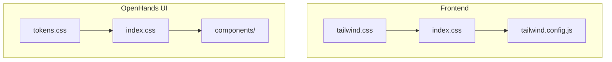
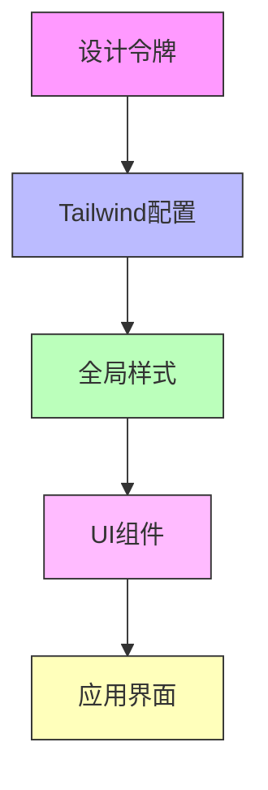
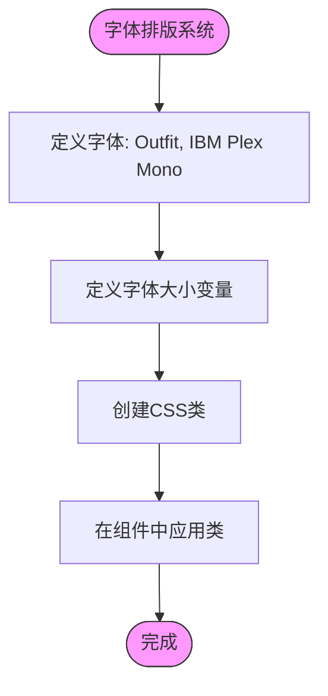

# 样式系统

<cite>
**本文档引用的文件**
- [tailwind.config.js](file://frontend/tailwind.config.js)
- [index.css](file://frontend/src/index.css)
- [tailwind.css](file://frontend/src/tailwind.css)
- [tokens.css](file://openhands-ui/tokens.css)
- [index.css](file://openhands-ui/index.css)
- [Button.tsx](file://openhands-ui/components/button/Button.tsx)
- [Typography.tsx](file://openhands-ui/components/typography/Typography.tsx)
- [cn.ts](file://openhands-ui/shared/utils/cn.ts)
</cite>

## 目录
1. [简介](#简介)
2. [项目结构](#项目结构)
3. [核心组件](#核心组件)
4. [架构概述](#架构概述)
5. [详细组件分析](#详细组件分析)
6. [依赖分析](#依赖分析)
7. [性能考虑](#性能考虑)
8. [故障排除指南](#故障排除指南)
9. [结论](#结论)
10. [附录](#附录)（如有必要）

## 简介
本文档详细描述了OpenHands项目中基于Tailwind CSS的设计令牌系统。该系统通过统一的设计令牌管理颜色主题、间距系统、字体排版和响应式断点，确保了跨组件和页面的一致性。设计令牌在`tailwind.config.js`中定义，并通过CSS变量与前端组件集成，支持自定义主题扩展和动态样式应用。

## 项目结构
OpenHands项目的样式系统分布在多个目录中，主要集中在`frontend`和`openhands-ui`目录下。`frontend`目录包含主应用的样式配置和全局样式，而`openhands-ui`目录则包含可重用UI组件的样式和设计令牌。



**Diagram sources**
- [frontend/src/index.css](file://frontend/src/index.css)
- [frontend/tailwind.config.js](file://frontend/tailwind.config.js)
- [openhands-ui/tokens.css](file://openhands-ui/tokens.css)
- [openhands-ui/index.css](file://openhands-ui/index.css)

**Section sources**
- [frontend/src/index.css](file://frontend/src/index.css)
- [frontend/tailwind.config.js](file://frontend/tailwind.config.js)
- [openhands-ui/tokens.css](file://openhands-ui/tokens.css)
- [openhands-ui/index.css](file://openhands-ui/index.css)

## 核心组件
样式系统的核心组件包括设计令牌、Tailwind配置、全局样式表和UI组件库。设计令牌定义了颜色、字体大小和间距等基本设计属性，Tailwind配置文件将这些令牌集成到Tailwind CSS框架中，全局样式表应用这些配置，而UI组件库则使用这些样式创建可重用的界面元素。

**Section sources**
- [tokens.css](file://openhands-ui/tokens.css)
- [tailwind.config.js](file://frontend/tailwind.config.js)
- [index.css](file://frontend/src/index.css)
- [index.css](file://openhands-ui/index.css)

## 架构概述
OpenHands的样式架构采用分层设计，将设计令牌、框架配置和组件实现分离。这种架构支持主题化、可维护性和可扩展性。



**Diagram sources**
- [tokens.css](file://openhands-ui/tokens.css)
- [tailwind.config.js](file://frontend/tailwind.config.js)
- [index.css](file://frontend/src/index.css)

## 详细组件分析
### 颜色主题分析
颜色主题系统基于CSS变量实现，支持深色和浅色模式。主题变量在`tokens.css`中定义，包括主色、中性色、灰色、绿色、青色和红色等调色板。

```mermaid
classDiagram
class ColorPalette {
+--color-primary-15 : #FFFCF0
+--color-primary-30 : #FFF9E1
+--color-primary-50 : #FFF7D7
+--color-primary-100 : #FFF3C0
+--color-primary-200 : #FFEEAA
+--color-primary-300 : #FFEA92
+--color-primary-400 : #FFE57B
+--color-primary-500 : #FFE165
+--color-primary-600 : #DCC257
+--color-primary-700 : #BBA54A
+--color-primary-800 : #99873D
+--color-primary-900 : #76682F
+--color-primary-950 : #532219
+--color-primary-970 : #433B1B
+--color-primary-985 : #2D2812
}
class NeutralPalette {
+--color-light-neutral-15 : #F7F8FB
+--color-light-neutral-30 : #F0F2F7
+--color-light-neutral-50 : #EBEDF3
+--color-light-neutral-100 : #DFE2ED
+--color-light-neutral-200 : #D4D8E7
+--color-light-neutral-300 : #C8CDE0
+--color-light-neutral-400 : #BCC3D9
+--color-light-neutral-500 : #B1B9D3
+--color-light-neutral-600 : #99A0B6
+--color-light-neutral-700 : #82889B
+--color-light-neutral-800 : #6A6F7F
+--color-light-neutral-900 : #525662
+--color-light-neutral-950 : #3A3C45
+--color-light-neutral-970 : #2F3137
+--color-light-neutral-985 : #1F2125
}
class Typography {
+--font-size-xxs : 0.75rem
+--font-size-xs : 0.875rem
+--font-size-s : 1rem
+--font-size-m : 1.125rem
+--font-size-l : 1.5rem
+--font-size-xl : 2rem
+--font-size-xxl : 2.25rem
+--font-size-xxxl : 3rem
}
ColorPalette --> : defines
NeutralPalette --> : defines
Typography --> : defines
```

**Diagram sources**
- [tokens.css](file://openhands-ui/tokens.css)

**Section sources**
- [tokens.css](file://openhands-ui/tokens.css)

### 字体排版分析
字体排版系统通过CSS类和设计令牌实现，支持多种字体大小和权重。系统使用Outfit和IBM Plex Mono字体，并通过`tg-*`类应用不同的字体大小。



**Diagram sources**
- [tokens.css](file://openhands-ui/tokens.css)
- [Typography.tsx](file://openhands-ui/components/typography/Typography.tsx)

**Section sources**
- [tokens.css](file://openhands-ui/tokens.css)
- [Typography.tsx](file://openhands-ui/components/typography/Typography.tsx)

### 间距系统分析
间距系统基于Tailwind CSS的默认间距比例，通过`px-*`, `py-*`, `gap-*`等类实现。系统支持响应式间距调整，确保在不同屏幕尺寸下保持一致的视觉节奏。

**Section sources**
- [tailwind.config.js](file://frontend/tailwind.config.js)
- [tailwind.css](file://frontend/src/tailwind.css)

### 响应式断点分析
响应式断点系统使用Tailwind CSS的默认断点配置，支持移动优先的设计方法。系统通过`sm:`, `md:`, `lg:`, `xl:`等前缀实现不同屏幕尺寸下的样式调整。

**Section sources**
- [tailwind.config.js](file://frontend/tailwind.config.js)

## 依赖分析
样式系统的依赖关系清晰，主要依赖Tailwind CSS框架和HeroUI组件库。这些依赖通过npm包管理，并在`package.json`中定义。

```mermaid
dependencyDiagram
"tailwindcss" --> "autoprefixer"
"tailwindcss" --> "postcss"
"@heroui/react" --> "tailwindcss"
"@heroui/react" --> "react"
"tailwind-merge" --> "clsx"
"tailwind-scrollbar" --> "tailwindcss"
"@tailwindcss/typography" --> "tailwindcss"
```

**Diagram sources**
- [package.json](file://frontend/package.json)

**Section sources**
- [package.json](file://frontend/package.json)
- [tailwind.config.js](file://frontend/tailwind.config.js)

## 性能考虑
样式系统通过Tree-shaking和按需加载策略优化性能。Tailwind CSS的JIT模式确保只生成实际使用的CSS类，减少最终包的大小。此外，使用`tailwind-merge`和`clsx`库优化类名处理，提高运行时性能。

**Section sources**
- [tailwind.config.js](file://frontend/tailwind.config.js)
- [cn.ts](file://openhands-ui/shared/utils/cn.ts)

## 故障排除指南
### 样式未应用问题
如果样式未正确应用，请检查以下几点：
1. 确保`tailwind.config.js`正确配置
2. 检查组件是否正确导入和使用CSS类
3. 验证构建过程是否包含Tailwind处理

### 主题切换问题
如果主题切换不工作，请检查：
1. `darkMode`配置是否设置为`class`
2. 确保根元素有正确的暗色模式类
3. 验证CSS变量是否正确定义

**Section sources**
- [tailwind.config.js](file://frontend/tailwind.config.js)
- [index.css](file://frontend/src/index.css)

## 结论
OpenHands的样式系统通过基于Tailwind CSS的设计令牌实现了高度一致和可维护的UI设计。系统支持主题化、响应式设计和性能优化，为开发者提供了强大的样式管理工具。通过遵循本文档中的指南，开发者可以有效地扩展和定制样式系统以满足特定需求。

## 附录
### 设计令牌完整列表
| 令牌 | 值 | 描述 |
|------|-----|------|
| --color-primary-500 | #FFE165 | 主色 |
| --color-light-neutral-500 | #B1B9D3 | 中性色 |
| --font-size-l | 1.5rem | 大字体大小 |
| --color-red-500 | #FF684E | 红色调色板 |

**Section sources**
- [tokens.css](file://openhands-ui/tokens.css)