# 设计令牌

<cite>
**本文档中引用的文件**
- [tailwind.config.js](file://frontend/tailwind.config.js)
- [tokens.css](file://openhands-ui/tokens.css)
- [index.css](file://openhands-ui/index.css)
- [tailwind.css](file://frontend/src/tailwind.css)
- [hero.ts](file://frontend/hero.ts)
- [utils.ts](file://openhands-ui/components/typography/utils.ts)
- [Button.tsx](file://openhands-ui/components/button/Button.tsx)
- [InteractiveChip.tsx](file://openhands-ui/components/interactive-chip/InteractiveChip.tsx)
- [BaseTypography.tsx](file://openhands-ui/components/typography/BaseTypography.tsx)
- [cn.ts](file://openhands-ui/shared/utils/cn.ts)
- [types.ts](file://openhands-ui/shared/types.ts)
</cite>

## 目录
1. [简介](#简介)
2. [项目结构概览](#项目结构概览)
3. [核心设计令牌系统](#核心设计令牌系统)
4. [颜色系统](#颜色系统)
5. [字体排版系统](#字体排版系统)
6. [间距和布局系统](#间距和布局系统)
7. [主题配置架构](#主题配置架构)
8. [组件级设计令牌](#组件级设计令牌)
9. [扩展和自定义指南](#扩展和自定义指南)
10. [最佳实践](#最佳实践)
11. [故障排除指南](#故障排除指南)
12. [总结](#总结)

## 简介

OpenHands设计令牌系统是一个全面的、可扩展的设计系统，采用Tailwind CSS作为基础框架，结合自定义CSS变量和TypeScript类型安全的组件设计。该系统提供了统一的颜色调色板、字体排版规范、间距标准和交互状态管理，确保整个应用界面的一致性和可维护性。

设计令牌系统的核心目标是：
- 提供一致的设计语言和视觉体验
- 支持深色和浅色主题切换
- 实现组件级别的样式复用
- 确保设计与开发之间的无缝协作
- 支持灵活的定制和扩展

## 项目结构概览

设计令牌系统在项目中的组织结构如下：

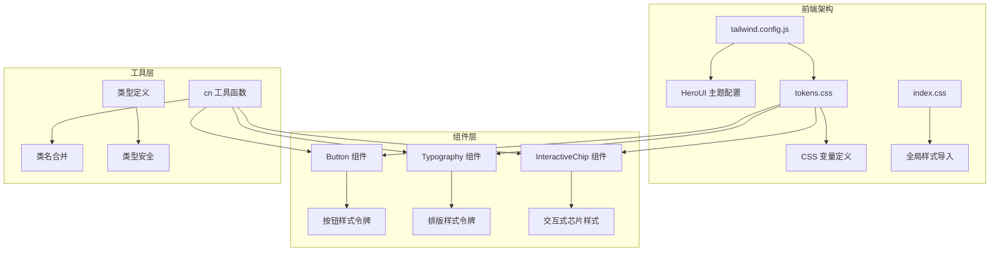

**图表来源**
- [tailwind.config.js](file://frontend/tailwind.config.js#L1-L8)
- [tokens.css](file://openhands-ui/tokens.css#L1-L175)
- [index.css](file://openhands-ui/index.css#L1-L4)

**章节来源**
- [tailwind.config.js](file://frontend/tailwind.config.js#L1-L8)
- [tokens.css](file://openhands-ui/tokens.css#L1-L175)
- [index.css](file://openhands-ui/index.css#L1-L4)

## 核心设计令牌系统

### CSS变量系统

设计令牌系统基于现代CSS自定义属性（CSS Variables）构建，提供了一套完整的变量定义体系：

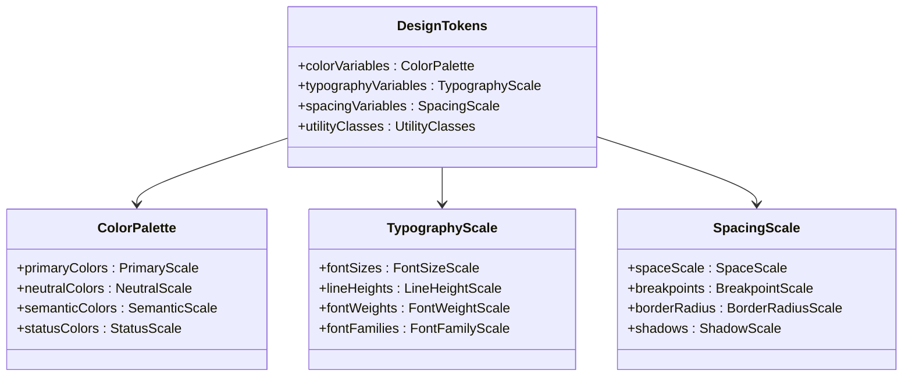

**图表来源**
- [tokens.css](file://openhands-ui/tokens.css#L1-L175)
- [utils.ts](file://openhands-ui/components/typography/utils.ts#L1-L26)

### 主题模式支持

系统支持深色和浅色两种主题模式，通过CSS变量和媒体查询实现动态切换：

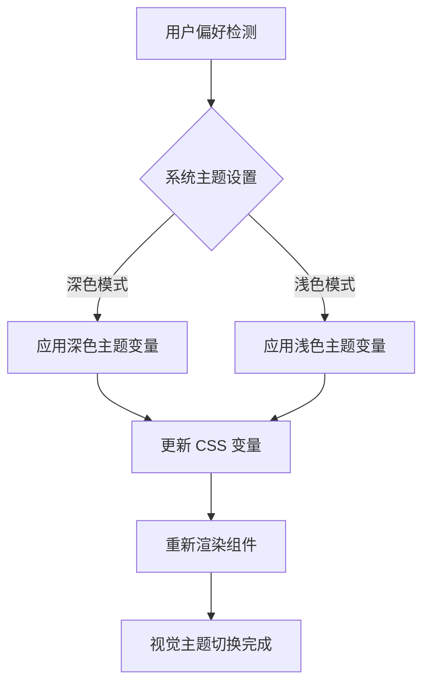

**图表来源**
- [hero.ts](file://frontend/hero.ts#L1-L18)
- [tailwind.config.js](file://frontend/tailwind.config.js#L5-L6)

**章节来源**
- [tokens.css](file://openhands-ui/tokens.css#L1-L175)
- [hero.ts](file://frontend/hero.ts#L1-L18)

## 颜色系统

### 调色板架构

设计令牌系统采用分层的颜色架构，包含主色调、中性色、语义色和状态色四个主要类别：

| 颜色类型 | 描述 | 使用场景 | 示例变量 |
|---------|------|----------|----------|
| 主色调 | 品牌主色，用于强调元素 | 按钮、链接、重要信息 | `--color-primary-500` |
| 中性色 | 灰度色彩，用于背景和文本 | 背景、边框、辅助文本 | `--color-light-neutral-900` |
| 语义色 | 表示特定含义的颜色 | 成功、警告、错误状态 | `--color-success`, `--color-danger` |
| 状态色 | 动态状态指示颜色 | 悬停、聚焦、激活状态 | `--color-primary-600` |

### 颜色层次结构

系统为每种颜色提供15个不同的透明度级别，从最透明到最不透明：

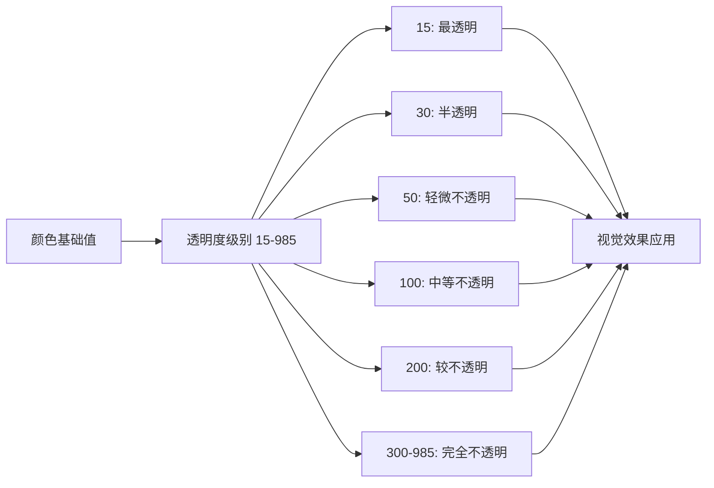

**图表来源**
- [tokens.css](file://openhands-ui/tokens.css#L5-L19)
- [tokens.css](file://openhands-ui/tokens.css#L22-L36)

### 颜色使用规范

| 颜色用途 | 推荐颜色范围 | 透明度建议 | 无障碍考虑 |
|---------|-------------|-----------|-----------|
| 主要操作按钮 | 主色调系列 (500-700) | 100-300 | 对比度 ≥ 4.5:1 |
| 文本内容 | 中性色 900-985 | 100-200 | 对比度 ≥ 7:1 |
| 背景区域 | 中性色 15-50 | 15-30 | 层级区分 |
| 状态指示 | 语义色系列 | 100-300 | 明确语义 |

**章节来源**
- [tokens.css](file://openhands-ui/tokens.css#L1-L175)

## 字体排版系统

### 字体大小层级

设计令牌系统定义了八个标准化的字体大小，对应不同的文本层级：

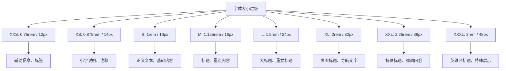

**图表来源**
- [utils.ts](file://openhands-ui/components/typography/utils.ts#L15-L26)
- [tokens.css](file://openhands-ui/tokens.css#L112-L119)

### 字重系统

系统支持完整的9个字重级别，从细体到黑体：

| 字重级别 | 数值 | CSS 类名 | 使用场景 |
|---------|------|----------|----------|
| 细体 | 100 | `font-thin` | 辅助文本、装饰性文字 |
| 极细体 | 200 | `font-extralight` | 小字说明、次要信息 |
| 细体 | 300 | `font-light` | 标题、弱化文本 |
| 正常 | 400 | `font-normal` | 正文、默认文本 |
| 中等 | 500 | `font-medium` | 强调文本、按钮文字 |
| 粗体 | 600 | `font-semibold` | 重要标题、关键信息 |
| 加粗 | 700 | `font-bold` | 主要标题、强调内容 |
| 极粗体 | 800 | `font-extrabold` | 特殊标题、重要提示 |
| 黑体 | 900 | `font-black` | 装饰性文字、品牌标识 |

### 字体族配置

系统集成了两种主要字体族：

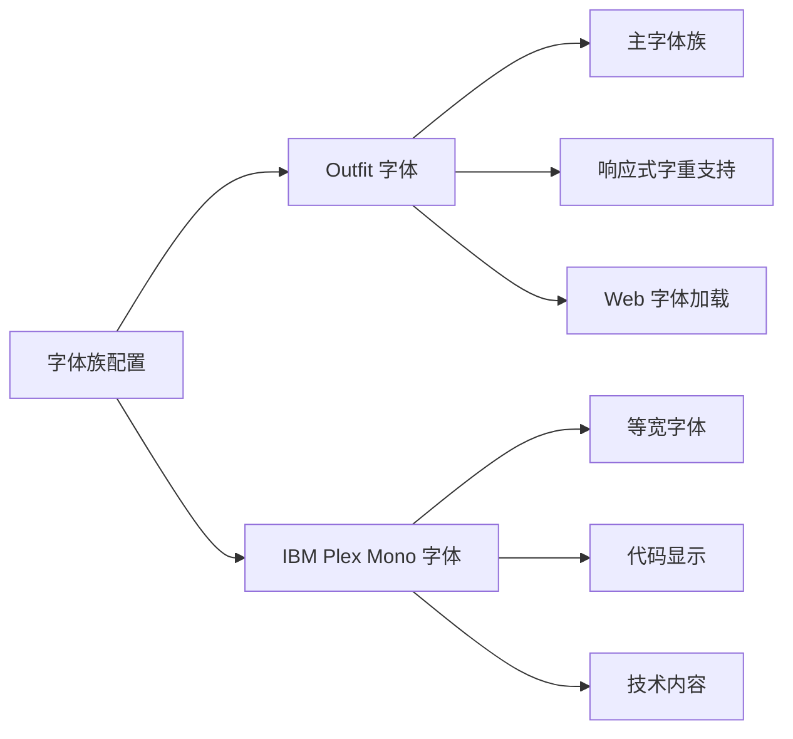

**图表来源**
- [index.css](file://openhands-ui/index.css#L1-L2)
- [tokens.css](file://openhands-ui/tokens.css#L139-L145)

**章节来源**
- [utils.ts](file://openhands-ui/components/typography/utils.ts#L1-L26)
- [tokens.css](file://openhands-ui/tokens.css#L112-L175)

## 间距和布局系统

### 间距缩放系统

设计令牌系统采用基于16px基准的弹性间距系统，支持响应式布局：

| 间距单位 | 像素值 | 使用场景 | 组件应用 |
|---------|--------|----------|----------|
| 0.25rem | 4px | 微小间距、内边距 | 基础间距单元 |
| 0.5rem | 8px | 小间距、紧凑布局 | 密集内容区域 |
| 0.75rem | 12px | 中等间距、标准间距 | 默认间距设置 |
| 1rem | 16px | 大间距、分隔符 | 区域分隔、标题间距 |
| 1.5rem | 24px | 大间距、模块间距 | 内容模块分隔 |
| 2rem | 32px | 超大间距、页边距 | 页面级分隔 |

### 边框半径系统

系统提供四种标准化的圆角半径：

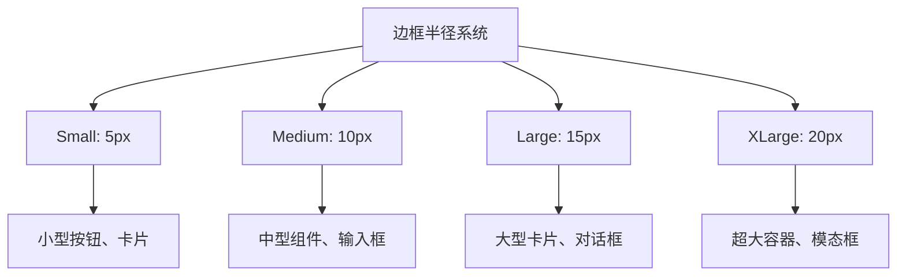

**图表来源**
- [hero.ts](file://frontend/hero.ts#L6-L9)

### 断点系统

虽然当前配置中没有显式的断点定义，但系统通过Tailwind CSS的响应式前缀支持移动端优先的设计：

| 断点 | 屏幕宽度 | 使用场景 |
|------|----------|----------|
| 默认 | 移动端优先 | 手机端显示 |
| sm | ≥640px | 平板设备 |
| md | ≥768px | 小屏幕桌面 |
| lg | ≥1024px | 大屏幕桌面 |
| xl | ≥1280px | 超大屏幕 |

**章节来源**
- [hero.ts](file://frontend/hero.ts#L1-L18)

## 主题配置架构

### Tailwind CSS集成

设计令牌系统通过Tailwind CSS实现高效的样式生成：

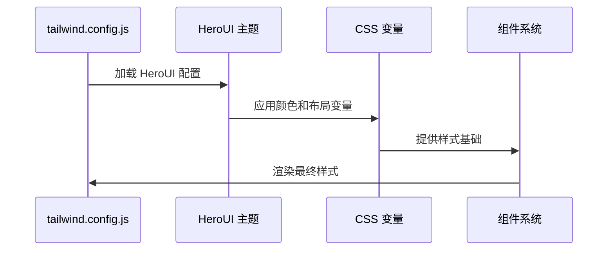

**图表来源**
- [tailwind.config.js](file://frontend/tailwind.config.js#L1-L8)
- [hero.ts](file://frontend/hero.ts#L1-L18)

### 主题配置详解

HeroUI主题配置提供了以下核心功能：

| 配置项 | 值 | 作用 |
|-------|-----|------|
| defaultTheme | "dark" | 默认主题模式 |
| layout.radius | { small: "5px", large: "20px" } | 圆角半径配置 |
| themes.dark.colors.primary | "#4465DB" | 深色主题主色 |

### CSS变量覆盖机制

系统允许通过CSS变量实现样式的动态覆盖：

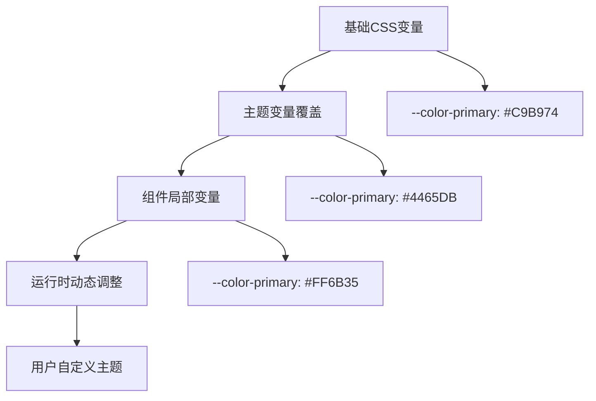

**图表来源**
- [hero.ts](file://frontend/hero.ts#L1-L18)
- [tokens.css](file://openhands-ui/tokens.css#L123-L135)

**章节来源**
- [tailwind.config.js](file://frontend/tailwind.config.js#L1-L8)
- [hero.ts](file://frontend/hero.ts#L1-L18)

## 组件级设计令牌

### 按钮组件样式系统

按钮组件采用了基于设计令牌的样式系统，支持多种变体和状态：

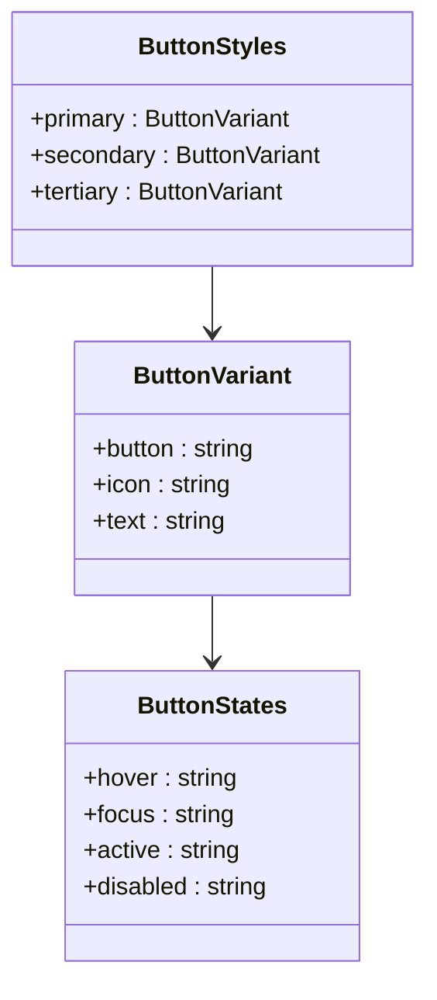

**图表来源**
- [Button.tsx](file://openhands-ui/components/button/Button.tsx#L1-L73)
- [InteractiveChip.tsx](file://openhands-ui/components/interactive-chip/InteractiveChip.tsx#L1-L68)

### 交互式芯片组件

交互式芯片展示了更复杂的样式组合和动画效果：

| 组件状态 | 样式类名 | 触发条件 | 视觉变化 |
|---------|----------|----------|----------|
| 默认 | `bg-light-neutral-950` | 初始状态 | 中性背景 |
| 悬停 | `hover:bg-light-neutral-800` | 鼠标悬停 | 背景加深 |
| 聚焦 | `focus:bg-light-neutral-800` | 键盘聚焦 | 背景加深 |
| 激活 | `active:scale-90` | 点击激活 | 缩小效果 |
| 禁用 | `opacity-40` | disabled 属性 | 半透明显示 |

### 字重动态调整

系统实现了智能的字重动态调整机制，解决粗体文本渲染宽度变化的问题：

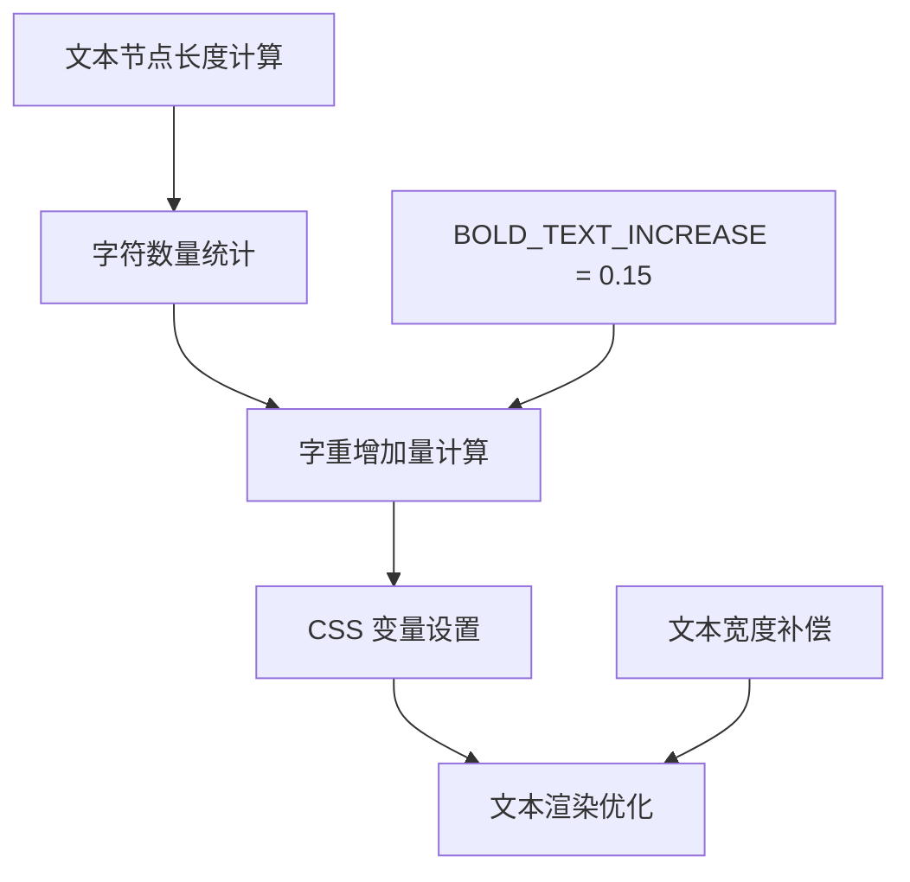

**图表来源**
- [InteractiveChip.tsx](file://openhands-ui/components/interactive-chip/InteractiveChip.tsx#L33-L68)
- [utils.ts](file://openhands-ui/components/interactive-chip/utils.ts#L81-L98)

**章节来源**
- [Button.tsx](file://openhands-ui/components/button/Button.tsx#L1-L73)
- [InteractiveChip.tsx](file://openhands-ui/components/interactive-chip/InteractiveChip.tsx#L1-L68)
- [utils.ts](file://openhands-ui/components/interactive-chip/utils.ts#L81-L98)

## 扩展和自定义指南

### 添加新的颜色调色板

要添加新的颜色调色板，需要修改 `tokens.css` 文件：

```css
/* 新增颜色调色板 */
--color-accent-15: #F8F0FF;
--color-accent-30: #F1E1FF;
--color-accent-50: #EAD3FF;
--color-accent-100: #D9BFFF;
--color-accent-200: #C8ABFF;
--color-accent-300: #B796FF;
--color-accent-400: #A682FF;
--color-accent-500: #956DFF;
--color-accent-600: #8358E6;
--color-accent-700: #7143CC;
--color-accent-800: #5F38B3;
--color-accent-900: #4D2D99;
--color-accent-950: #3B2280;
--color-accent-970: #301B66;
--color-accent-985: #20124D;
```

### 扩展字体大小系统

添加新的字体大小层级：

```css
/* 扩展字体大小 */
--font-size-meta: 0.625rem; /* 10px */
--font-size-caption: 0.75rem; /* 12px */
--font-size-body: 1rem; /* 16px */
--font-size-subtitle: 1.25rem; /* 20px */
--font-size-title: 2rem; /* 32px */

/* 对应的实用类 */
.tg-meta {
  font-size: var(--font-size-meta);
}

.tg-caption {
  font-size: var(--font-size-caption);
}

.tg-subtitle {
  font-size: var(--font-size-subtitle);
}
```

### 自定义间距系统

扩展间距系统以支持新的布局需求：

```css
/* 自定义间距 */
--space-extra-small: 0.125rem; /* 2px */
--space-extra-large: 3rem; /* 48px */
--space-huge: 4rem; /* 64px */

/* 响应式间距 */
@media (min-width: 768px) {
  --space-mobile: var(--space-extra-small);
  --space-tablet: var(--space-small);
  --space-desktop: var(--space-medium);
}
```

### 创建新的组件样式

按照现有模式创建新的组件样式：

```typescript
// 新组件样式定义
export type NewComponentVariant = "primary" | "secondary" | "accent";

export const newComponentStyles: Record<NewComponentVariant, ButtonStyle> = {
  primary: {
    button: cn([
      "rounded-lg bg-primary-500 text-white",
      "hover:bg-primary-600",
      "focus:ring-2 focus:ring-primary-300",
      "active:scale-95",
      "disabled:opacity-50 disabled:cursor-not-allowed"
    ]),
    icon: "text-white",
    text: "font-medium"
  },
  secondary: {
    button: cn([
      "rounded-lg bg-light-neutral-200 text-light-neutral-900",
      "hover:bg-light-neutral-300",
      "focus:ring-2 focus:ring-light-neutral-400"
    ]),
    icon: "text-light-neutral-900",
    text: "font-normal"
  }
};
```

**章节来源**
- [tokens.css](file://openhands-ui/tokens.css#L1-L175)
- [utils.ts](file://openhands-ui/components/typography/utils.ts#L1-L26)

## 最佳实践

### 命名约定

设计令牌系统遵循严格的命名约定以确保一致性：

| 命名类型 | 约定格式 | 示例 | 说明 |
|---------|----------|------|------|
| 颜色变量 | `--color-{category}-{level}` | `--color-primary-500` | 颜色分类 + 透明度级别 |
| 字体变量 | `--font-{property}-{size}` | `--font-size-lg` | 字体属性 + 尺寸级别 |
| 间距变量 | `--space-{level}` | `--space-medium` | 间距级别名称 |
| 组件变量 | `{component}-{property}` | `button-bg-color` | 组件名称 + 属性 |

### 抽象层级原则

设计令牌系统采用三层抽象架构：

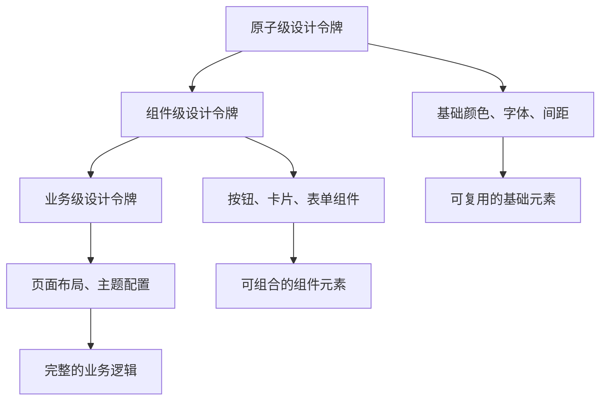

### 可维护性建议

1. **版本控制**：为设计令牌建立版本控制系统
2. **文档同步**：保持设计令牌文档与代码同步更新
3. **变更影响分析**：评估设计令牌变更对整体系统的影响
4. **向后兼容性**：确保新版本的向后兼容性
5. **自动化测试**：建立设计令牌的自动化测试流程

### 性能优化策略

| 优化方面 | 实现方法 | 性能收益 |
|---------|----------|----------|
| CSS变量缓存 | 合理使用CSS变量避免重复计算 | 减少渲染时间 |
| 组件样式复用 | 基于设计令牌的样式组合 | 减少CSS体积 |
| 按需加载 | Tailwind CSS的按需生成功能 | 降低初始加载时间 |
| 缓存策略 | 浏览器缓存CSS和字体文件 | 提升二次访问速度 |

**章节来源**
- [cn.ts](file://openhands-ui/shared/utils/cn.ts#L1-L7)
- [types.ts](file://openhands-ui/shared/types.ts#L1-L17)

## 故障排除指南

### 常见问题及解决方案

#### 1. 颜色显示异常

**问题描述**：某些颜色在特定主题下显示不正确

**解决方案**：
- 检查 `tokens.css` 中的颜色变量定义
- 验证主题配置是否正确应用
- 确认CSS变量的优先级设置

#### 2. 字体加载失败

**问题描述**：自定义字体无法正常显示

**解决方案**：
- 检查字体文件的CDN连接状态
- 验证字体文件的MIME类型配置
- 确认跨域资源共享(CORS)设置

#### 3. 响应式布局问题

**问题描述**：组件在不同屏幕尺寸下显示异常

**解决方案**：
- 检查Tailwind CSS的断点配置
- 验证CSS媒体查询的正确性
- 确认视口(meta viewport)标签设置

#### 4. 样式冲突

**问题描述**：多个组件样式相互干扰

**解决方案**：
- 使用CSS模块或BEM命名规范
- 检查CSS选择器的特异性
- 验证Tailwind CSS类名的组合顺序

### 调试工具和技巧

| 调试工具 | 用途 | 使用方法 |
|---------|------|----------|
| 浏览器开发者工具 | 检查CSS变量和样式 | Elements面板查看computed styles |
| Tailwind CSS插件 | 开发时实时预览 | VS Code插件自动补全和预览 |
| CSS变量检查器 | 调试CSS变量值 | Console面板查看变量值 |
| 性能分析器 | 分析样式性能 | Performance面板分析渲染时间 |

**章节来源**
- [tokens.css](file://openhands-ui/tokens.css#L1-L175)
- [index.css](file://openhands-ui/index.css#L1-L4)

## 总结

OpenHands设计令牌系统是一个完整、可扩展的设计系统，通过以下核心特性实现了高质量的用户体验：

### 系统优势

1. **统一性**：通过集中化的CSS变量管理，确保整个应用界面的一致性
2. **可维护性**：模块化的架构设计使得系统易于维护和扩展
3. **灵活性**：支持多种主题模式和自定义扩展
4. **性能**：基于Tailwind CSS的高效样式生成机制
5. **无障碍**：符合WCAG标准的对比度和可访问性设计

### 技术特色

- **TypeScript类型安全**：提供完整的类型定义和IDE支持
- **CSS变量驱动**：现代CSS特性确保良好的浏览器兼容性
- **响应式设计**：移动端优先的响应式布局系统
- **动画优化**：流畅的过渡效果和交互动画

### 发展方向

设计令牌系统将继续朝着以下方向发展：
- 更丰富的组件库支持
- 更完善的无障碍功能
- 更智能的主题切换机制
- 更强大的自定义能力
- 更好的开发工具集成

通过持续的优化和改进，设计令牌系统将为OpenHands平台提供更加稳定、高效和美观的用户界面体验。