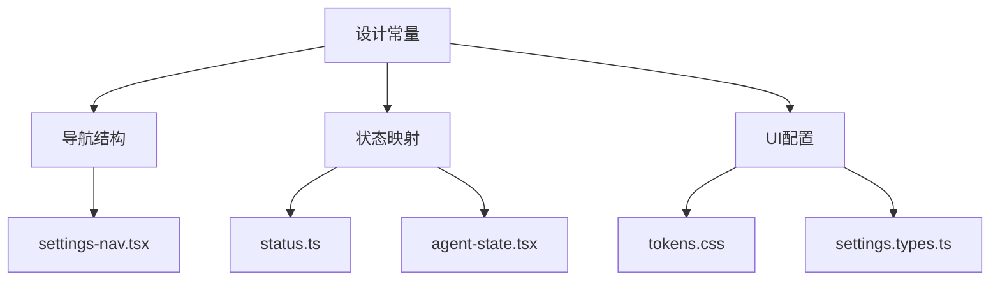
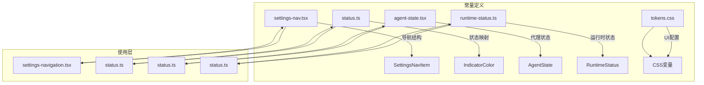
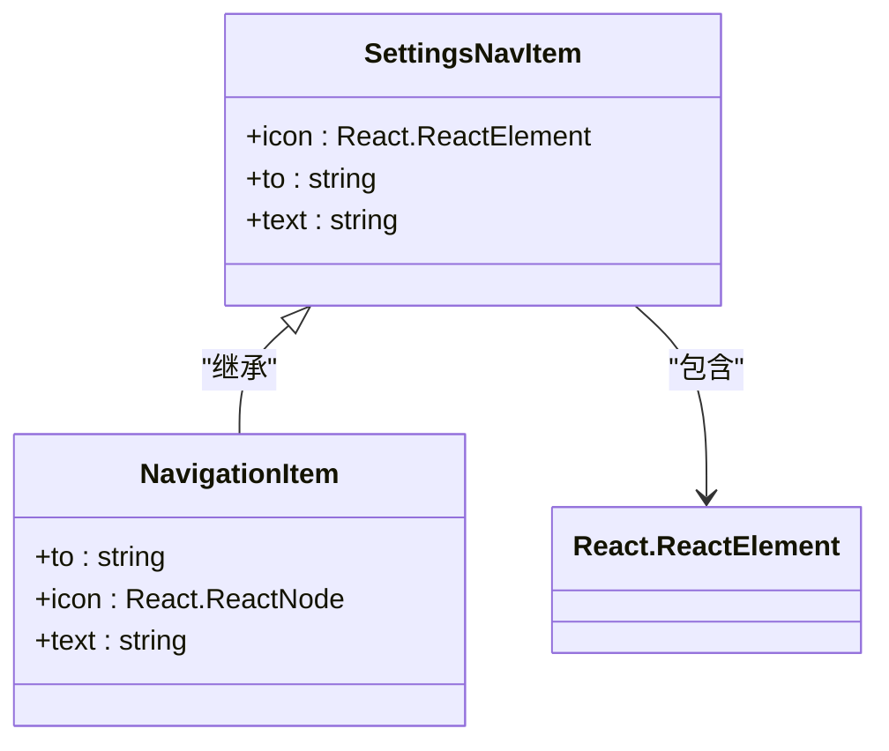
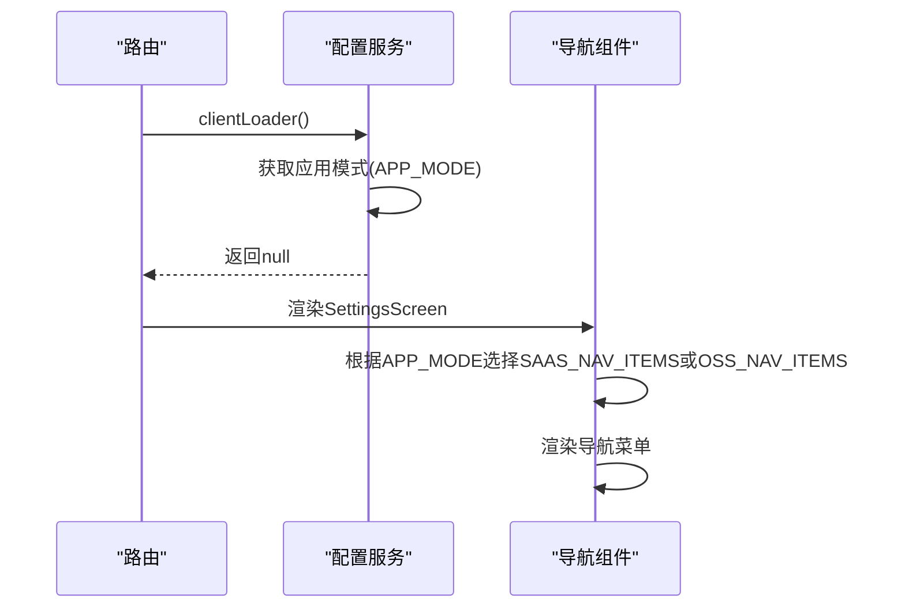
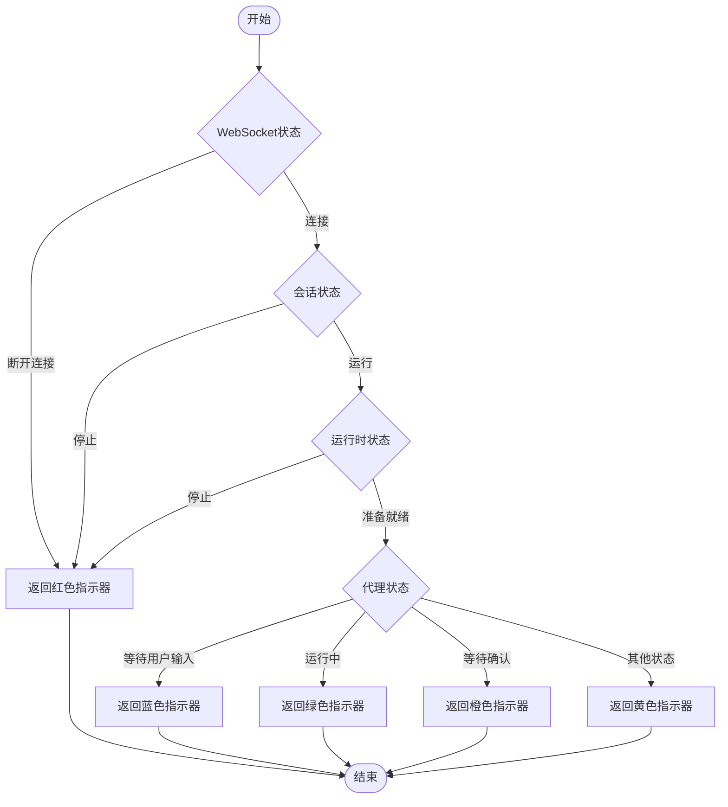
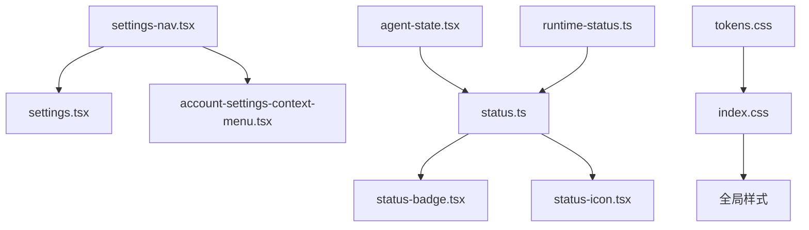

# 设计常量

<cite>
**本文档引用的文件**   
- [settings-nav.tsx](file://frontend/src/constants/settings-nav.tsx)
- [settings.types.ts](file://frontend/src/settings-service/settings.types.ts)
- [settings-navigation.tsx](file://frontend/src/components/features/settings/settings-navigation.tsx)
- [tokens.css](file://openhands-ui/tokens.css)
- [status.ts](file://frontend/src/utils/status.ts)
- [agent-state.tsx](file://frontend/src/types/agent-state.tsx)
- [runtime-status.ts](file://frontend/src/types/runtime-status.ts)
- [settings.ts](file://frontend/src/types/settings.ts)
</cite>

## 目录
1. [简介](#简介)
2. [项目结构](#项目结构)
3. [核心组件](#核心组件)
4. [架构概述](#架构概述)
5. [详细组件分析](#详细组件分析)
6. [依赖分析](#依赖分析)
7. [性能考虑](#性能考虑)
8. [故障排除指南](#故障排除指南)
9. [结论](#结论)
10. [附录](#附录)（如有必要）

## 简介
本文档系统化整理OpenHands前端应用中的所有设计相关常量，涵盖导航结构、状态映射、UI配置等静态数据的组织方式。文档重点分析常量文件与业务逻辑的分离原则和类型安全实现方案，特别是settings-nav.tsx中的导航配置模式和动态菜单生成机制。通过提供常量管理的最佳实践，包括命名规范、模块化组织和类型定义，帮助开发者避免使用魔法值并提高代码可维护性。

## 项目结构
OpenHands前端应用的设计常量主要分布在constants、types和utils目录中，通过模块化组织实现高内聚低耦合的架构设计。导航配置、状态映射和UI配置等静态数据被集中管理，与业务逻辑分离，确保系统的可维护性和可扩展性。

**Diagram sources**
- [settings-nav.tsx](file://frontend/src/constants/settings-nav.tsx)
- [status.ts](file://frontend/src/utils/status.ts)
- [agent-state.tsx](file://frontend/src/types/agent-state.tsx)
- [tokens.css](file://openhands-ui/tokens.css)
- [settings.types.ts](file://frontend/src/types/settings.ts)

**Section sources**
- [settings-nav.tsx](file://frontend/src/constants/settings-nav.tsx)
- [status.ts](file://frontend/src/utils/status.ts)
- [tokens.css](file://openhands-ui/tokens.css)

## 核心组件
设计常量系统的核心组件包括导航配置、状态映射和UI配置三大部分。导航配置通过settings-nav.tsx文件定义SAAS和OSS两种模式的菜单项，包含图标、路由和国际化文本。状态映射在status.ts和agent-state.tsx中定义了代理状态、运行时状态和会话状态的枚举类型及转换逻辑。UI配置在tokens.css中定义了颜色、字体和间距等设计令牌，确保视觉一致性。

**Section sources**
- [settings-nav.tsx](file://frontend/src/constants/settings-nav.tsx)
- [status.ts](file://frontend/src/utils/status.ts)
- [agent-state.tsx](file://frontend/src/types/agent-state.tsx)
- [tokens.css](file://openhands-ui/tokens.css)

## 架构概述
设计常量系统的架构采用分层设计模式，将静态数据与业务逻辑分离。常量文件通过TypeScript的类型系统实现类型安全，确保编译时的错误检测。导航配置根据应用模式（SAAS/OSS）动态生成菜单，状态映射通过枚举和映射表实现状态到UI的转换，UI配置通过CSS变量实现主题化支持。

**Diagram sources**
- [settings-nav.tsx](file://frontend/src/constants/settings-nav.tsx)
- [settings-navigation.tsx](file://frontend/src/components/features/settings/settings-navigation.tsx)
- [status.ts](file://frontend/src/utils/status.ts)
- [agent-state.tsx](file://frontend/src/types/agent-state.tsx)
- [runtime-status.ts](file://frontend/src/types/runtime-status.ts)
- [tokens.css](file://openhands-ui/tokens.css)

## 详细组件分析

### 导航配置分析
导航配置系统通过settings-nav.tsx文件定义了SAAS_NAV_ITEMS和OSS_NAV_ITEMS两个常量数组，分别对应SaaS和OSS两种部署模式的菜单项。每个菜单项包含图标、路由和国际化文本三个属性，实现了导航结构的静态化和类型安全。

#### 对于对象导向组件：

**Diagram sources**
- [settings-nav.tsx](file://frontend/src/constants/settings-nav.tsx)
- [settings-navigation.tsx](file://frontend/src/components/features/settings/settings-navigation.tsx)

#### 对于API/服务组件：

**Diagram sources**
- [settings.tsx](file://frontend/src/routes/settings.tsx)
- [settings-navigation.tsx](file://frontend/src/components/features/settings/settings-navigation.tsx)

### 状态映射分析
状态映射系统通过多个文件协同工作，实现了从后端状态到前端UI的转换。agent-state.tsx定义了代理状态的枚举类型，runtime-status.ts定义了运行时状态的联合类型，status.ts则通过映射表将这些状态转换为UI显示文本和指示器颜色。

#### 对于复杂逻辑组件：

**Diagram sources**
- [status.ts](file://frontend/src/utils/status.ts)
- [agent-state.tsx](file://frontend/src/types/agent-state.tsx)
- [runtime-status.ts](file://frontend/src/types/runtime-status.ts)

**Section sources**
- [settings-nav.tsx](file://frontend/src/constants/settings-nav.tsx)
- [settings.types.ts](file://frontend/src/types/settings.ts)
- [status.ts](file://frontend/src/utils/status.ts)
- [agent-state.tsx](file://frontend/src/types/agent-state.tsx)
- [runtime-status.ts](file://frontend/src/types/runtime-status.ts)

### UI配置分析
UI配置系统通过tokens.css文件定义了完整的视觉设计系统，包括颜色、字体和间距等设计令牌。这些CSS变量被集成到Tailwind CSS中，通过自定义类名提供一致的UI样式。颜色系统采用语义化命名，如--color-primary-500表示主色的500级，确保设计的一致性和可维护性。

**Section sources**
- [tokens.css](file://openhands-ui/tokens.css)
- [index.css](file://openhands-ui/index.css)

## 依赖分析
设计常量系统与其他组件存在明确的依赖关系。settings-nav.tsx被settings.tsx和account-settings-context-menu.tsx引用，提供导航配置数据。状态映射文件被多个UI组件引用，用于状态显示和指示器颜色计算。UI配置文件被全局引入，为整个应用提供统一的视觉样式。

**Diagram sources**
- [settings-nav.tsx](file://frontend/src/constants/settings-nav.tsx)
- [settings.tsx](file://frontend/src/routes/settings.tsx)
- [account-settings-context-menu.tsx](file://frontend/src/components/features/context-menu/account-settings-context-menu.tsx)
- [status.ts](file://frontend/src/utils/status.ts)
- [status-badge.tsx](file://frontend/src/components/features/chat/task-tracking/status-badge.tsx)
- [status-icon.tsx](file://frontend/src/components/features/chat/task-tracking/status-icon.tsx)
- [agent-state.tsx](file://frontend/src/types/agent-state.tsx)
- [runtime-status.ts](file://frontend/src/types/runtime-status.ts)
- [tokens.css](file://openhands-ui/tokens.css)
- [index.css](file://openhands-ui/index.css)

**Section sources**
- [settings-nav.tsx](file://frontend/src/constants/settings-nav.tsx)
- [status.ts](file://frontend/src/utils/status.ts)
- [tokens.css](file://openhands-ui/tokens.css)

## 性能考虑
设计常量系统的性能优化主要体现在以下几个方面：常量数据在编译时确定，避免运行时计算开销；类型检查在开发阶段完成，减少运行时错误；CSS变量的使用减少了样式重复，提高了渲染效率。导航配置的条件渲染通过React的key机制优化了DOM更新性能。

## 故障排除指南
当遇到设计常量相关问题时，可参考以下排查步骤：检查常量文件的导入路径是否正确；验证类型定义是否匹配使用场景；确认CSS变量是否正确加载；检查国际化文本键是否存在。对于状态显示异常，应验证状态映射逻辑是否正确处理所有状态分支。

**Section sources**
- [settings-nav.tsx](file://frontend/src/constants/settings-nav.tsx)
- [status.ts](file://frontend/src/utils/status.ts)
- [tokens.css](file://openhands-ui/tokens.css)

## 结论
OpenHands前端的设计常量系统通过模块化组织、类型安全和静态化配置，实现了高可维护性和可扩展性的架构设计。导航配置的动态生成机制、状态映射的清晰转换逻辑和UI配置的统一管理，为应用提供了稳定的基础。遵循本文档的最佳实践，可以有效避免魔法值的使用，提高代码质量和开发效率。

## 附录

### 常量管理最佳实践
1. **命名规范**：使用大写字母和下划线命名常量，如`SETTINGS$NAV_USER`
2. **模块化组织**：按功能划分常量文件，如导航、状态、UI分别管理
3. **类型定义**：为所有常量提供TypeScript类型定义，确保类型安全
4. **避免魔法值**：将所有硬编码值提取为常量，提高可维护性
5. **文档化**：为复杂常量添加注释，说明其用途和使用场景

### 重构指南
1. **识别魔法值**：搜索代码中的硬编码字符串、数字和布尔值
2. **提取常量**：将识别出的魔法值提取到相应的常量文件中
3. **添加类型**：为新常量定义适当的TypeScript类型
4. **更新引用**：将代码中的魔法值替换为常量引用
5. **测试验证**：确保重构后的功能与之前一致

**Section sources**
- [settings-nav.tsx](file://frontend/src/constants/settings-nav.tsx)
- [settings.types.ts](file://frontend/src/types/settings.ts)
- [status.ts](file://frontend/src/utils/status.ts)
- [tokens.css](file://openhands-ui/tokens.css)