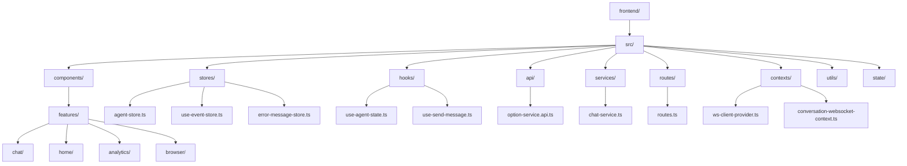
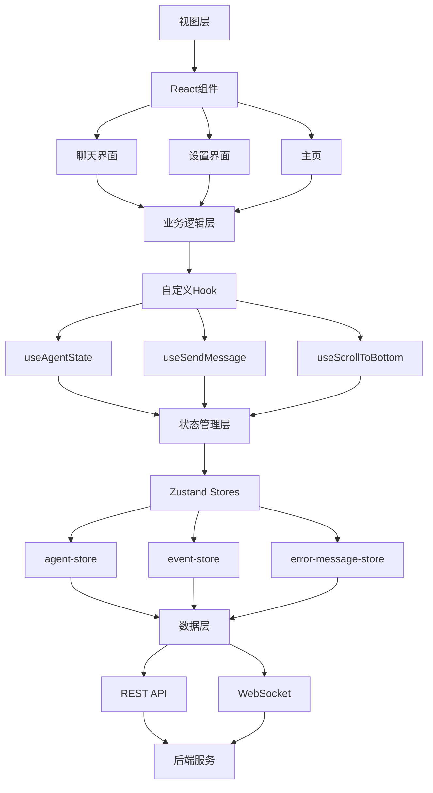
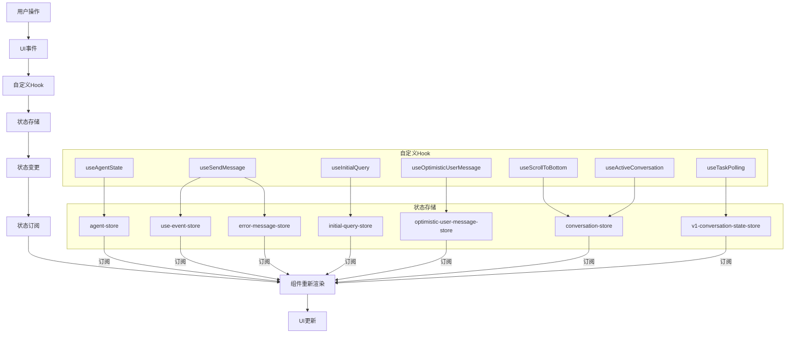
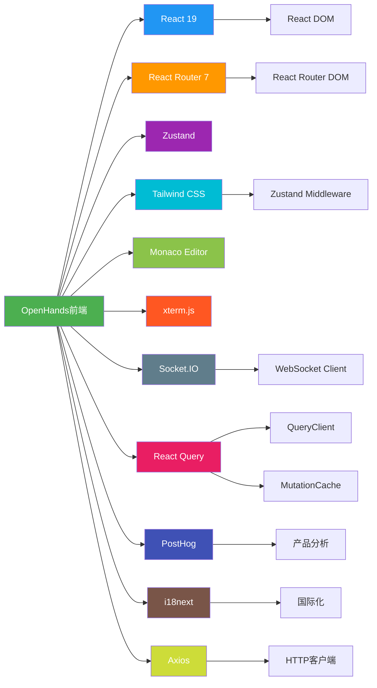
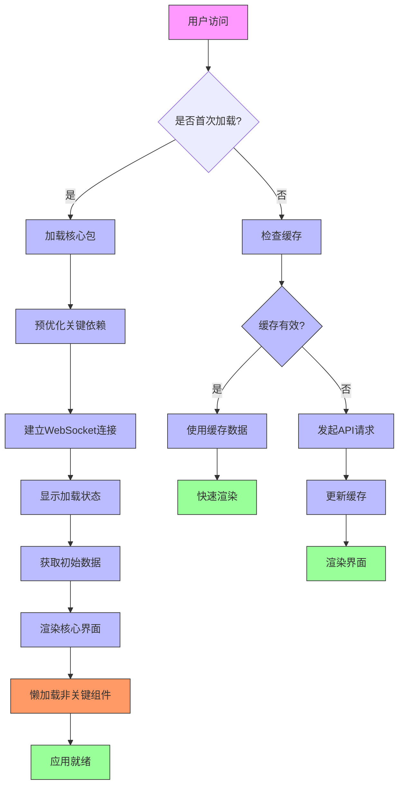

# 前端架构

<cite>
**本文档中引用的文件**  
- [package.json](file://frontend/package.json)
- [root.tsx](file://frontend/src/root.tsx)
- [routes.ts](file://frontend/src/routes.ts)
- [entry.client.tsx](file://frontend/src/entry.client.tsx)
- [vite.config.ts](file://frontend/vite.config.ts)
- [query-client-config.ts](file://frontend/src/query-client-config.ts)
- [tailwind.config.js](file://frontend/tailwind.config.js)
- [chat-interface.tsx](file://frontend/src/components/features/chat/chat-interface.tsx)
- [agent-store.ts](file://frontend/src/stores/agent-store.ts)
- [use-event-store.ts](file://frontend/src/stores/use-event-store.ts)
- [use-agent-state.ts](file://frontend/src/hooks/use-agent-state.ts)
- [use-send-message.ts](file://frontend/src/hooks/use-send-message.ts)
- [conversation-websocket-context.ts](file://frontend/src/contexts/conversation-websocket-context.ts)
- [api-service.ts](file://frontend/src/services/api-service.ts)
- [option-service.api.ts](file://frontend/src/api/option-service/option-service.api.ts)
</cite>

## 目录
1. [简介](#简介)
2. [项目结构](#项目结构)
3. [核心组件](#核心组件)
4. [架构概述](#架构概述)
5. [详细组件分析](#详细组件分析)
6. [依赖分析](#依赖分析)
7. [性能考虑](#性能考虑)
8. [故障排除指南](#故障排除指南)
9. [结论](#结论)

## 简介
OpenHands前端架构基于现代React技术栈构建，采用React Router 7进行路由管理，Zustand进行状态管理，并通过WebSocket与后端实现实时通信。该架构支持服务端渲染（SSR），具备国际化（i18n）能力，并集成了PostHog用于产品分析。前端通过模块化设计实现了高内聚低耦合，组件层次清晰，状态流明确，为开发者提供了良好的可维护性和扩展性。

## 项目结构
OpenHands前端项目采用功能驱动的目录结构，将相关组件、服务和状态管理逻辑组织在功能模块中。这种结构提高了代码的可发现性和可维护性。



**Diagram sources**
- [frontend/src/components/features/chat/chat-interface.tsx](file://frontend/src/components/features/chat/chat-interface.tsx)
- [frontend/src/stores/](file://frontend/src/stores/)
- [frontend/src/hooks/](file://frontend/src/hooks/)
- [frontend/src/api/](file://frontend/src/api/)
- [frontend/src/services/](file://frontend/src/services/)
- [frontend/src/routes.ts](file://frontend/src/routes.ts)
- [frontend/src/contexts/](file://frontend/src/contexts/)

**Section sources**
- [frontend/src/components/features/chat/chat-interface.tsx](file://frontend/src/components/features/chat/chat-interface.tsx)
- [frontend/src/stores/](file://frontend/src/stores/)
- [frontend/src/hooks/](file://frontend/src/hooks/)

## 核心组件
OpenHands前端的核心组件包括聊天界面、状态管理存储、WebSocket通信处理器和API服务层。聊天界面组件（ChatInterface）是用户交互的主要入口，它整合了消息显示、输入处理、状态指示和反馈机制。状态管理采用Zustand库实现，通过多个专用存储（store）管理不同领域的应用状态，如代理状态、事件流、错误消息等。API服务层封装了与后端的通信逻辑，提供类型安全的接口调用。

**Section sources**
- [frontend/src/components/features/chat/chat-interface.tsx](file://frontend/src/components/features/chat/chat-interface.tsx)
- [frontend/src/stores/](file://frontend/src/stores/)
- [frontend/src/api/](file://frontend/src/api/)

## 架构概述
OpenHands前端采用分层架构模式，从下到上分为数据层、状态管理层、业务逻辑层和视图层。数据层负责与后端API和WebSocket的通信；状态管理层使用Zustand管理全局应用状态；业务逻辑层包含自定义Hook和工具函数；视图层由React组件构成，采用Tailwind CSS进行样式设计。



**Diagram sources**
- [frontend/src/components/features/chat/chat-interface.tsx](file://frontend/src/components/features/chat/chat-interface.tsx)
- [frontend/src/hooks/](file://frontend/src/hooks/)
- [frontend/src/stores/](file://frontend/src/stores/)
- [frontend/src/api/](file://frontend/src/api/)
- [frontend/src/services/](file://frontend/src/services/)

## 详细组件分析

### 聊天界面分析
聊天界面是OpenHands用户交互的核心组件，负责消息的显示、用户输入处理和状态反馈。该组件整合了多个子组件和Hook，实现了复杂的交互逻辑。

#### 组件关系图

```mermaid
classDiagram
class ChatInterface {
+scrollRef : RefObject<HTMLDivElement>
+handleSendMessage(content : string, images : File[], files : File[]) : Promise<void>
+onClickShareFeedbackActionButton(polarity : "positive" | "negative") : void
}
class InteractiveChatBox {
+onSubmit : (content : string, images : File[], files : File[]) => void
}
class V0Messages {
+messages : V0Event[]
+isAwaitingUserConfirmation : boolean
}
class V1Messages {
+messages : V1Event[]
+allEvents : V1Event[]
}
class TypingIndicator {
+isVisible : boolean
}
class ChatSuggestions {
+onSuggestionsClick : (message : string) => void
}
class ErrorMessageBanner {
+message : string
}
class ScrollToBottomButton {
+onClick : () => void
}
class FeedbackModal {
+isOpen : boolean
+onClose : () => void
+polarity : "positive" | "negative"
}
class ConfirmationModeEnabled {
}
class TrajectoryActions {
+onPositiveFeedback : () => void
+onNegativeFeedback : () => void
+isSaasMode : boolean
}
ChatInterface --> InteractiveChatBox : "包含"
ChatInterface --> V0Messages : "条件渲染"
ChatInterface --> V1Messages : "条件渲染"
ChatInterface --> TypingIndicator : "条件渲染"
ChatInterface --> ChatSuggestions : "条件渲染"
ChatInterface --> ErrorMessageBanner : "条件渲染"
ChatInterface --> ScrollToBottomButton : "条件渲染"
ChatInterface --> FeedbackModal : "条件渲染"
ChatInterface --> ConfirmationModeEnabled : "包含"
ChatInterface --> TrajectoryActions : "包含"
ChatInterface ..> useAgentState : "使用"
ChatInterface ..> useSendMessage : "使用"
ChatInterface ..> useScrollToBottom : "使用"
ChatInterface ..> useEventStore : "使用"
ChatInterface ..> useErrorMessageStore : "使用"
ChatInterface ..> useOptimisticUserMessageStore : "使用"
ChatInterface ..> useActiveConversation : "使用"
ChatInterface ..> useTaskPolling : "使用"
ChatInterface ..> useConversationWebSocket : "使用"
```


**Diagram sources**
- [frontend/src/components/features/chat/chat-interface.tsx](file://frontend/src/components/features/chat/chat-interface.tsx)
- [frontend/src/components/features/chat/interactive-chat-box](file://frontend/src/components/features/chat/interactive-chat-box)
- [frontend/src/components/features/chat/messages](file://frontend/src/components/features/chat/messages)
- [frontend/src/components/features/chat/typing-indicator](file://frontend/src/components/features/chat/typing-indicator)
- [frontend/src/components/features/chat/chat-suggestions](file://frontend/src/components/features/chat/chat-suggestions)
- [frontend/src/components/features/chat/error-message-banner](file://frontend/src/components/features/chat/error-message-banner)
- [frontend/src/components/shared/buttons/scroll-to-bottom-button](file://frontend/src/components/shared/buttons/scroll-to-bottom-button)
- [frontend/src/components/features/feedback/feedback-modal](file://frontend/src/components/features/feedback/feedback-modal)
- [frontend/src/components/features/chat/confirmation-mode-enabled](file://frontend/src/components/features/chat/confirmation-mode-enabled)
- [frontend/src/components/features/trajectory/trajectory-actions](file://frontend/src/components/features/trajectory/trajectory-actions)
- [frontend/src/hooks/use-agent-state.ts](file://frontend/src/hooks/use-agent-state.ts)
- [frontend/src/hooks/use-send-message.ts](file://frontend/src/hooks/use-send-message.ts)
- [frontend/src/hooks/use-scroll-to-bottom.ts](file://frontend/src/hooks/use-scroll-to-bottom.ts)
- [frontend/src/stores/use-event-store.ts](file://frontend/src/stores/use-event-store.ts)
- [frontend/src/stores/error-message-store.ts](file://frontend/src/stores/error-message-store.ts)
- [frontend/src/stores/optimistic-user-message-store.ts](file://frontend/src/stores/optimistic-user-message-store.ts)
- [frontend/src/hooks/query/use-active-conversation.ts](file://frontend/src/hooks/query/use-active-conversation.ts)
- [frontend/src/hooks/query/use-task-polling.ts](file://frontend/src/hooks/query/use-task-polling.ts)
- [frontend/src/contexts/conversation-websocket-context.ts](file://frontend/src/contexts/conversation-websocket-context.ts)

**Section sources**
- [frontend/src/components/features/chat/chat-interface.tsx](file://frontend/src/components/features/chat/chat-interface.tsx)

### 状态管理分析
OpenHands前端采用Zustand进行状态管理，通过多个专用存储（store）管理不同领域的应用状态。这种模块化状态管理方式避免了单一全局状态的复杂性，提高了代码的可维护性。

#### 状态流图


**Diagram sources**
- [frontend/src/stores/agent-store.ts](file://frontend/src/stores/agent-store.ts)
- [frontend/src/stores/use-event-store.ts](file://frontend/src/stores/use-event-store.ts)
- [frontend/src/stores/error-message-store.ts](file://frontend/src/stores/error-message-store.ts)
- [frontend/src/stores/initial-query-store.ts](file://frontend/src/stores/initial-query-store.ts)
- [frontend/src/stores/optimistic-user-message-store.ts](file://frontend/src/stores/optimistic-user-message-store.ts)
- [frontend/src/state/conversation-store.ts](file://frontend/src/state/conversation-store.ts)
- [frontend/src/stores/v1-conversation-state-store.ts](file://frontend/src/stores/v1-conversation-state-store.ts)
- [frontend/src/hooks/use-agent-state.ts](file://frontend/src/hooks/use-agent-state.ts)
- [frontend/src/hooks/use-send-message.ts](file://frontend/src/hooks/use-send-message.ts)
- [frontend/src/hooks/use-scroll-to-bottom.ts](file://frontend/src/hooks/use-scroll-to-bottom.ts)
- [frontend/src/hooks/use-initial-query.ts](file://frontend/src/hooks/use-initial-query.ts)
- [frontend/src/hooks/use-optimistic-user-message.ts](file://frontend/src/hooks/use-optimistic-user-message.ts)
- [frontend/src/hooks/query/use-active-conversation.ts](file://frontend/src/hooks/query/use-active-conversation.ts)
- [frontend/src/hooks/query/use-task-polling.ts](file://frontend/src/hooks/query/use-task-polling.ts)

**Section sources**
- [frontend/src/stores/](file://frontend/src/stores/)
- [frontend/src/hooks/](file://frontend/src/hooks/)

### 路由系统分析
OpenHands前端使用React Router 7进行路由管理，采用基于文件的路由配置方式。路由配置定义在`routes.ts`文件中，通过嵌套结构组织路由层次。

#### 路由结构图
```mermaid
graph TD
A[/] --> B[根布局]
B --> C[首页]
B --> D[接受服务条款]
B --> E[设置]
E --> F[LLM设置]
E --> G[MCP设置]
E --> H[用户设置]
E --> I[Git设置]
E --> J[应用设置]
E --> K[账单]
E --> L[密钥设置]
E --> M[API密钥]
B --> N[对话/:conversationId]
B --> O[微代理管理]
classDef route fill:#f9f,stroke:#333,stroke-width:2px;
class C,D,E,F,G,H,I,J,K,L,M,N,O route;
```

**Diagram sources**
- [frontend/src/routes.ts](file://frontend/src/routes.ts)
- [frontend/src/routes/root-layout.tsx](file://frontend/src/routes/root-layout.tsx)
- [frontend/src/routes/home.tsx](file://frontend/src/routes/home.tsx)
- [frontend/src/routes/accept-tos.tsx](file://frontend/src/routes/accept-tos.tsx)
- [frontend/src/routes/settings.tsx](file://frontend/src/routes/settings.tsx)
- [frontend/src/routes/conversation.tsx](file://frontend/src/routes/conversation.tsx)
- [frontend/src/routes/microagent-management.tsx](file://frontend/src/routes/microagent-management.tsx)

**Section sources**
- [frontend/src/routes.ts](file://frontend/src/routes.ts)

## 依赖分析
OpenHands前端依赖多种第三方库和框架，这些依赖在`package.json`中定义，通过Vite进行模块打包和优化。



**Diagram sources**
- [frontend/package.json](file://frontend/package.json)
- [frontend/vite.config.ts](file://frontend/vite.config.ts)
- [frontend/src/entry.client.tsx](file://frontend/src/entry.client.tsx)
- [frontend/src/query-client-config.ts](file://frontend/src/query-client-config.ts)

**Section sources**
- [frontend/package.json](file://frontend/package.json)
- [frontend/vite.config.ts](file://frontend/vite.config.ts)

## 性能考虑
OpenHands前端在性能优化方面采取了多种策略，包括代码分割、懒加载、缓存机制和资源预加载。

### 性能优化策略
- **代码分割**：通过React Router的路由级代码分割，实现按需加载，减少初始加载时间
- **懒加载**：使用Vite的动态导入功能，对非关键组件进行懒加载
- **缓存机制**：使用React Query进行数据缓存，减少重复API调用
- **资源预加载**：在`vite.config.ts`中配置`optimizeDeps.include`，预优化关键依赖
- **WebSocket连接复用**：通过上下文提供者模式，确保WebSocket连接在整个应用生命周期内复用
- **错误消息去重**：在`query-client-config.ts`中使用Set数据结构对错误消息进行去重，避免重复显示相同错误



**Diagram sources**
- [frontend/vite.config.ts](file://frontend/vite.config.ts)
- [frontend/src/query-client-config.ts](file://frontend/src/query-client-config.ts)
- [frontend/src/entry.client.tsx](file://frontend/src/entry.client.tsx)
- [frontend/src/context/ws-client-provider.ts](file://frontend/src/context/ws-client-provider.ts)

**Section sources**
- [frontend/vite.config.ts](file://frontend/vite.config.ts)
- [frontend/src/query-client-config.ts](file://frontend/src/query-client-config.ts)

## 故障排除指南
本节提供OpenHands前端常见问题的排查方法和解决方案。

### WebSocket连接问题
- **症状**：聊天界面无法接收消息，状态指示器显示离线
- **排查步骤**：
  1. 检查后端服务是否正常运行
  2. 确认`VITE_BACKEND_HOST`环境变量配置正确
  3. 检查浏览器控制台是否有WebSocket连接错误
  4. 验证网络连接和防火墙设置

### API调用失败
- **症状**：页面加载失败，出现错误提示
- **排查步骤**：
  1. 检查`query-client-config.ts`中的错误处理逻辑
  2. 查看浏览器开发者工具的网络面板，确认API端点和响应
  3. 验证认证令牌是否有效
  4. 检查后端日志获取详细错误信息

### 状态不一致
- **症状**：UI状态与实际数据不符
- **排查步骤**：
  1. 检查相关Zustand存储的状态更新逻辑
  2. 验证状态订阅是否正确设置
  3. 确认自定义Hook是否正确使用存储
  4. 检查是否存在竞态条件

**Section sources**
- [frontend/src/query-client-config.ts](file://frontend/src/query-client-config.ts)
- [frontend/src/stores/](file://frontend/src/stores/)
- [frontend/src/hooks/](file://frontend/src/hooks/)
- [frontend/src/context/ws-client-provider.ts](file://frontend/src/context/ws-client-provider.ts)

## 结论
OpenHands前端架构设计合理，采用了现代前端技术栈的最佳实践。通过React Router实现灵活的路由管理，使用Zustand进行高效的状态管理，结合WebSocket实现实时通信。架构具有良好的可扩展性和可维护性，模块化设计使得功能开发和问题排查更加高效。性能优化策略有效提升了用户体验，错误处理机制确保了应用的健壮性。整体架构为OpenHands的持续发展提供了坚实的基础。