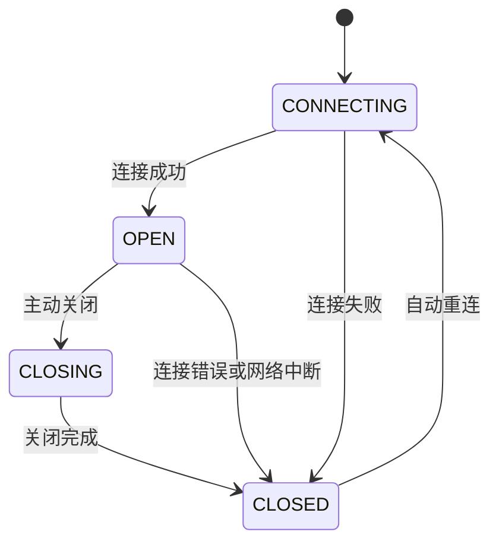
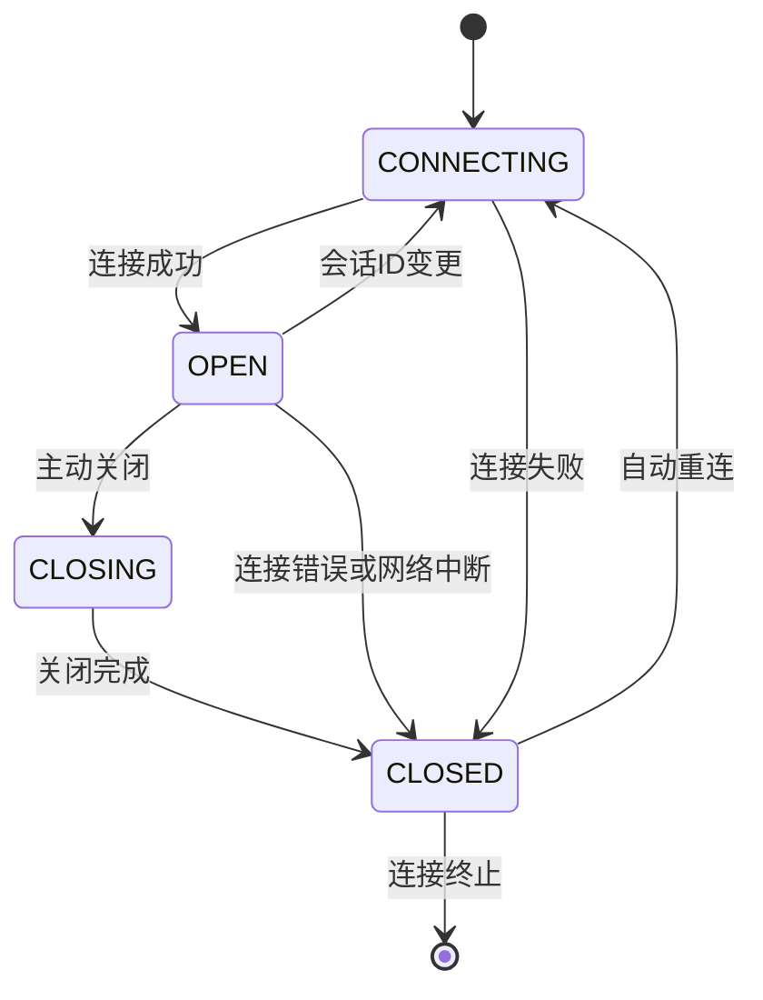

# WebSocket上下文管理

<cite>
**本文档引用的文件**
- [ws-client-provider.tsx](file://frontend/src/context/ws-client-provider.tsx)
- [conversation-websocket-context.tsx](file://frontend/src/contexts/conversation-websocket-context.tsx)
- [use-websocket.ts](file://frontend/src/hooks/use-websocket.ts)
- [websocket-url.ts](file://frontend/src/utils/websocket-url.ts)
- [type-guards.ts](file://frontend/src/types/v1/type-guards.ts)
- [use-event-store.ts](file://frontend/src/stores/use-event-store.ts)
- [error-handler.ts](file://frontend/src/utils/error-handler.ts)
</cite>

## 目录
1. [引言](#引言)
2. [核心组件分析](#核心组件分析)
3. [WebSocket连接管理](#websocket连接管理)
4. [消息分发机制](#消息分发机制)
5. [错误处理与恢复策略](#错误处理与恢复策略)
6. [性能优化建议](#性能优化建议)
7. [WebSocket状态转换图](#websocket状态转换图)
8. [实际使用示例](#实际使用示例)
9. [结论](#结论)

## 引言
WebSocket上下文管理是OpenHands系统中实现实时通信的核心机制。本系统提供了两种WebSocket实现：传统的`ws-client-provider`和现代化的`conversation-websocket-context`。这两种实现分别服务于V0和V1版本的对话会话，通过WebSocket协议实现客户端与服务器之间的双向实时通信。该机制负责管理WebSocket连接的生命周期，包括连接建立、维护、断线重连以及消息的接收和发送，确保了用户与AI代理之间流畅的交互体验。

## 核心组件分析

WebSocket上下文管理主要由两个核心组件构成：`ws-client-provider`和`conversation-websocket-context`。`ws-client-provider`是基于Socket.IO库的旧版实现，主要用于V0对话会话。它通过`socket.io-client`库建立连接，并使用`io()`函数初始化Socket.IO客户端。该组件提供了`useWsClient` Hook，用于在应用中访问WebSocket状态和发送消息。

`conversation-websocket-context`是为V1对话会话设计的新一代WebSocket实现。它直接使用原生WebSocket API，提供了更精细的控制和更好的性能。该组件基于`useWebSocket` Hook构建，通过React Context提供连接状态、发送消息和加载历史记录等状态。`conversation-websocket-context`的设计更加现代化，支持更复杂的连接选项和错误处理策略。

**Section sources**
- [ws-client-provider.tsx](file://frontend/src/context/ws-client-provider.tsx)
- [conversation-websocket-context.tsx](file://frontend/src/contexts/conversation-websocket-context.tsx)

## WebSocket连接管理

### 连接建立
WebSocket连接的建立过程在两个组件中有所不同。`ws-client-provider`使用Socket.IO的`io()`函数建立连接，需要提供基础URL、路径和查询参数。查询参数包括`latest_event_id`（用于断线重连时获取丢失的事件）、`conversation_id`（对话ID）和`session_api_key`（会话API密钥）等。连接建立后，组件会监听`connect`、`oh_event`、`connect_error`、`connect_failed`和`disconnect`等事件。

`conversation-websocket-context`使用原生WebSocket API，通过`useWebSocket` Hook管理连接。连接URL由`buildWebSocketUrl`函数生成，格式为`ws://host:port/sockets/events/{conversationId}`。连接选项通过`websocketOptions`对象配置，包括查询参数（如`resend_all`）、重连设置和各种事件处理器（`onOpen`、`onClose`、`onMessage`、`onError`）。

### 连接状态管理
`ws-client-provider`定义了三种连接状态：`CONNECTING`、`CONNECTED`和`DISCONNECTED`。状态通过`webSocketStatus`状态变量管理，并在`handleConnect`、`handleDisconnect`和`handleError`等事件处理器中更新。

`conversation-websocket-context`定义了四种连接状态：`CONNECTING`、`OPEN`、`CLOSING`和`CLOSED`，这与原生WebSocket的`readyState`完全对应。状态通过`connectionState`状态变量管理，并在`useEffect`中监听`socket`的`readyState`变化来更新。

### 心跳检测与断线重连
`ws-client-provider`依赖Socket.IO内置的连接管理和重连机制。当连接断开时，Socket.IO客户端会自动尝试重连。

`conversation-websocket-context`实现了更精细的断线重连策略。`useWebSocket` Hook提供了可配置的重连功能，通过`reconnect`选项启用。当连接关闭时，`onclose`事件处理器会检查是否允许重连，并在满足条件时启动重连定时器。重连条件包括：重连已启用、当前WebSocket实例允许重连、未被显式断开连接，以及重试次数未超过最大限制。重连间隔固定为3秒。



**Diagram sources**
- [use-websocket.ts](file://frontend/src/hooks/use-websocket.ts)
- [conversation-websocket-context.tsx](file://frontend/src/contexts/conversation-websocket-context.tsx)

**Section sources**
- [use-websocket.ts](file://frontend/src/hooks/use-websocket.ts)
- [conversation-websocket-context.tsx](file://frontend/src/contexts/conversation-websocket-context.tsx)
- [websocket-url.ts](file://frontend/src/utils/websocket-url.ts)

## 消息分发机制

WebSocket消息分发机制负责将接收到的事件消息路由到相应的处理程序。`ws-client-provider`通过`handleMessage`函数处理`oh_event`事件。该函数首先验证事件是否为有效的`OpenHandsParsedEvent`，然后根据事件类型进行分发。例如，`isAssistantMessage`用于处理助手消息，`isErrorObservation`用于处理错误观察，`isUserMessage`用于处理用户消息。

`conversation-websocket-context`通过`handleMessage`回调函数处理`onmessage`事件。该函数首先解析JSON消息，然后使用`isV1Event`类型守卫验证事件结构。验证通过后，根据事件类型调用相应的处理逻辑。例如，`isAgentErrorEvent`用于处理代理错误事件，`isUserMessageEvent`用于处理用户消息事件，`isActionEvent`用于处理动作事件。

消息处理完成后，相关状态会被更新。例如，`addEvent`函数会将事件添加到全局事件存储中，`setErrorMessage`会更新错误消息状态，`removeOptimisticUserMessage`会移除乐观更新的用户消息。此外，还会触发缓存失效，例如在文件编辑或写入后，会调用`queryClient.invalidateQueries`使相关查询缓存失效。

**Section sources**
- [ws-client-provider.tsx](file://frontend/src/context/ws-client-provider.tsx)
- [conversation-websocket-context.tsx](file://frontend/src/contexts/conversation-websocket-context.tsx)
- [use-event-store.ts](file://frontend/src/stores/use-event-store.ts)

## 错误处理与恢复策略

系统实现了全面的错误处理与恢复策略，以应对认证失败、网络中断等各种异常情况。

对于认证失败，`ws-client-provider`在`handleError`和`handleDisconnect`函数中处理连接错误。如果错误数据包含有效的`message`属性，会调用`updateStatusWhenErrorMessagePresent`函数更新状态。该函数会检查错误消息是否为"websocket error"或"timeout"，如果是则忽略，否则会显示错误消息。`conversation-websocket-context`在`onError`和`onClose`处理器中处理错误。`onError`处理器会将连接状态设置为`CLOSED`，并仅在之前已成功连接过时才显示错误消息，以避免在初始连接尝试时显示错误。

对于网络中断，`conversation-websocket-context`的`onclose`处理器会检查关闭代码。如果代码不是1000（正常关闭），则视为错误关闭，会设置错误状态并调用`onError`处理器。同时，系统会尝试自动重连，但仅在满足重连条件时才进行。

错误信息会被记录和上报。`EventLogger`类在开发模式下会记录WebSocket消息和事件，便于调试。`trackError`函数会使用PostHog捕获异常，便于监控和分析。`showChatError`函数会同时上报错误并更新UI状态，确保用户能及时获知错误信息。

**Section sources**
- [ws-client-provider.tsx](file://frontend/src/context/ws-client-provider.tsx)
- [conversation-websocket-context.tsx](file://frontend/src/contexts/conversation-websocket-context.tsx)
- [error-handler.ts](file://frontend/src/utils/error-handler.ts)
- [event-logger.ts](file://frontend/src/utils/event-logger.ts)

## 性能优化建议

### 连接池管理
虽然当前实现没有显式的连接池，但可以通过以下方式优化连接管理：
1. **连接复用**：对于同一用户的多个对话，可以考虑复用同一个WebSocket连接，通过消息中的`conversation_id`字段区分不同对话的事件。
2. **连接预热**：在用户可能发起对话前，提前建立WebSocket连接，减少首次交互的延迟。
3. **连接超时**：为不活跃的连接设置超时，及时释放资源。

### 消息压缩技术
当前系统使用JSON格式传输消息，可以考虑以下压缩技术：
1. **Gzip压缩**：在WebSocket服务器端启用Gzip压缩，减少网络传输的数据量。
2. **二进制协议**：对于高频、小数据量的消息，可以考虑使用二进制协议（如Protocol Buffers）替代JSON，减少序列化开销和数据大小。
3. **消息批处理**：对于短时间内产生的多个小消息，可以进行批处理，合并为一个大消息发送，减少网络开销。

### 其他优化建议
1. **选择性重发**：当前`conversation-websocket-context`使用`resend_all=true`参数，可以优化为仅重发断线期间丢失的事件，减少不必要的数据传输。
2. **事件过滤**：客户端可以根据当前UI状态订阅特定类型的事件，减少不必要的消息处理。
3. **内存管理**：定期清理旧的事件和消息，避免内存泄漏。

## WebSocket状态转换图



**Diagram sources**
- [use-websocket.ts](file://frontend/src/hooks/use-websocket.ts)
- [conversation-websocket-context.tsx](file://frontend/src/contexts/conversation-websocket-context.tsx)

## 实际使用示例

### 使用WebSocketProviderWrapper
`WebSocketProviderWrapper`组件根据对话版本选择使用`ws-client-provider`或`conversation-websocket-context`。

```tsx
<WebSocketProviderWrapper version={1} conversationId="conv-123">
  <ChatComponent />
</WebSocketProviderWrapper>
```

### 使用useConversationWebSocket
在组件中使用`useConversationWebSocket` Hook访问WebSocket功能。

```tsx
const { connectionState, sendMessage, isLoadingHistory } = useConversationWebSocket();

const handleSendMessage = async () => {
  if (connectionState === 'OPEN') {
    await sendMessage({
      type: 'user_message',
      content: 'Hello, agent!',
    });
  }
};
```

### 使用useUnifiedWebSocketStatus
`useUnifiedWebSocketStatus` Hook提供统一的WebSocket状态接口，兼容V0和V1对话。

```tsx
const webSocketStatus = useUnifiedWebSocketStatus();
// 返回 "CONNECTING" | "CONNECTED" | "DISCONNECTED"
```

**Section sources**
- [websocket-provider-wrapper.tsx](file://frontend/src/contexts/websocket-provider-wrapper.tsx)
- [use-conversation-websocket.ts](file://frontend/src/hooks/use-conversation-websocket.ts)
- [use-unified-websocket-status.ts](file://frontend/src/hooks/use-unified-websocket-status.ts)

## 结论
WebSocket上下文管理是OpenHands系统实现实时交互的关键。通过`ws-client-provider`和`conversation-websocket-context`两个组件，系统支持了从传统Socket.IO到现代原生WebSocket的平滑过渡。系统实现了完整的连接生命周期管理、灵活的消息分发机制和健壮的错误处理策略。未来可以通过连接池管理、消息压缩等技术进一步优化性能，提升用户体验。