# 上下文管理

<cite>
**本文档中引用的文件**
- [ws-client-provider.tsx](file://frontend/src/context/ws-client-provider.tsx)
- [conversation-websocket-context.tsx](file://frontend/src/contexts/conversation-websocket-context.tsx)
- [conversation-subscriptions-provider.tsx](file://frontend/src/context/conversation-subscriptions-provider.tsx)
- [websocket-provider-wrapper.tsx](file://frontend/src/contexts/websocket-provider-wrapper.tsx)
- [use-websocket.ts](file://frontend/src/hooks/use-websocket.ts)
- [conversation.tsx](file://frontend/src/routes/conversation.tsx)
- [conversation-store.ts](file://frontend/src/state/conversation-store.ts)
- [v1-conversation-state-store.ts](file://frontend/src/stores/v1-conversation-state-store.ts)
- [websocket-url.ts](file://frontend/src/utils/websocket-url.ts)
</cite>

## 目录
1. [简介](#简介)
2. [项目结构](#项目结构)
3. [核心组件](#核心组件)
4. [架构概览](#架构概览)
5. [详细组件分析](#详细组件分析)
6. [依赖关系分析](#依赖关系分析)
7. [性能考虑](#性能考虑)
8. [故障排除指南](#故障排除指南)
9. [结论](#结论)

## 简介

OpenHands前端采用了一套精心设计的React Context系统来管理WebSocket连接和会话状态。该系统通过多个专门的Context提供者实现了不同版本的WebSocket通信支持，同时确保了良好的性能和可维护性。本文档将深入分析这些Context的设计模式、实现细节以及最佳实践。

## 项目结构

OpenHands的Context系统主要分布在以下目录结构中：

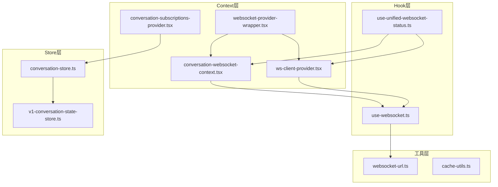

**图表来源**
- [ws-client-provider.tsx](file://frontend/src/context/ws-client-provider.tsx#L1-L50)
- [conversation-websocket-context.tsx](file://frontend/src/contexts/conversation-websocket-context.tsx#L1-L50)
- [conversation-subscriptions-provider.tsx](file://frontend/src/context/conversation-subscriptions-provider.tsx#L1-L50)

## 核心组件

### WebSocket客户端提供者 (WsClientProvider)

`WsClientProvider` 是传统的WebSocket连接管理器，专为V0版本对话设计。它提供了完整的WebSocket生命周期管理和事件处理机制。

**主要功能：**
- 连接状态管理（CONNECTING、CONNECTED、DISCONNECTED）
- 消息发送和接收处理
- 错误状态显示和恢复
- 缓存失效和查询更新

**节来源**
- [ws-client-provider.tsx](file://frontend/src/context/ws-client-provider.tsx#L130-L406)

### 对话WebSocket上下文提供者 (ConversationWebSocketProvider)

`ConversationWebSocketProvider` 是新一代的WebSocket管理器，专为V1版本对话设计，提供了更现代化的连接管理和消息处理机制。

**主要功能：**
- 基于React Query的连接状态同步
- 自动历史加载检测
- 事件缓存和失效管理
- 更好的错误恢复策略

**节来源**
- [conversation-websocket-context.tsx](file://frontend/src/contexts/conversation-websocket-context.tsx#L50-L327)

### 对话订阅提供者 (ConversationSubscriptionsProvider)

`ConversationSubscriptionsProvider` 负责管理多个对话的实时订阅，使用Socket.IO协议实现多路复用连接。

**主要功能：**
- 多对话订阅管理
- 实时事件流处理
- 连接重试和恢复
- 事件状态跟踪

**节来源**
- [conversation-subscriptions-provider.tsx](file://frontend/src/context/conversation-subscriptions-provider.tsx#L72-L324)

## 架构概览

OpenHands的Context架构采用了分层设计，通过包装器组件实现版本兼容性：

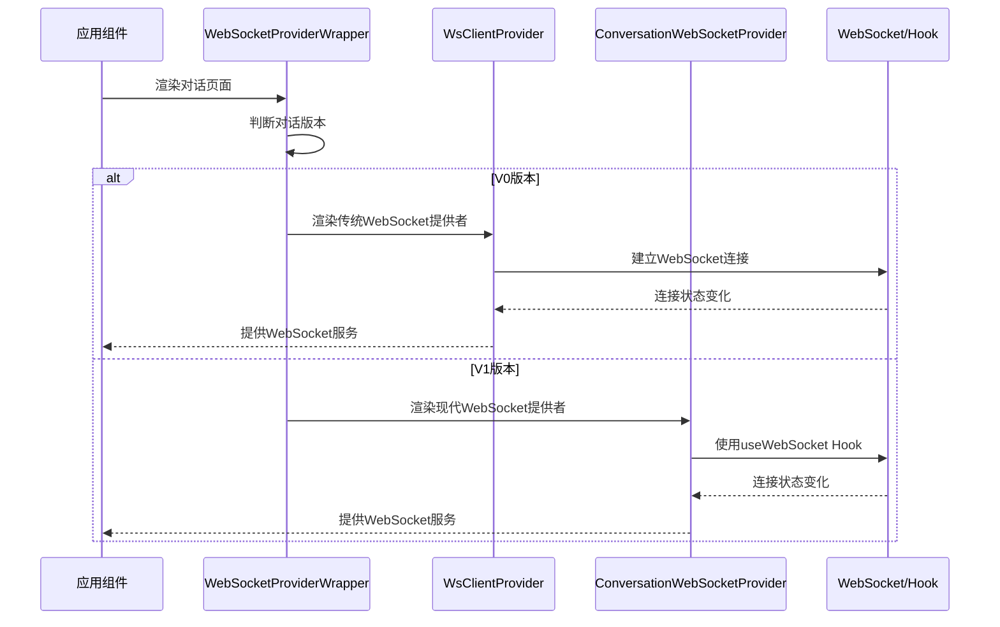

**图表来源**
- [websocket-provider-wrapper.tsx](file://frontend/src/contexts/websocket-provider-wrapper.tsx#L32-L63)
- [conversation.tsx](file://frontend/src/routes/conversation.tsx#L176-L182)

## 详细组件分析

### WebSocket连接生命周期管理

#### V0版本连接管理

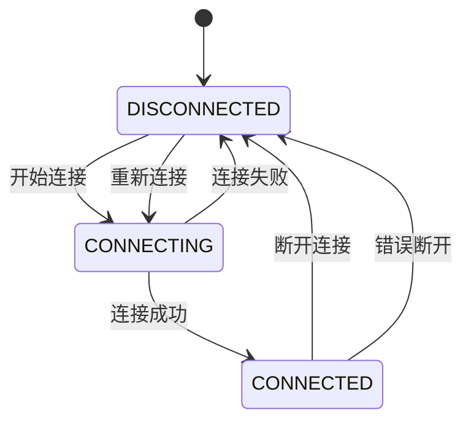

**图表来源**
- [ws-client-provider.tsx](file://frontend/src/context/ws-client-provider.tsx#L156-L265)

#### V1版本连接管理

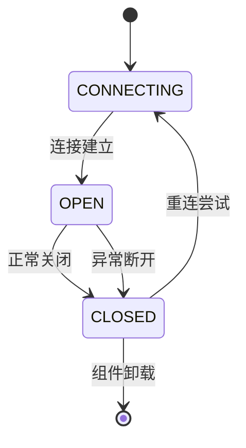

**图表来源**
- [conversation-websocket-context.tsx](file://frontend/src/contexts/conversation-websocket-context.tsx#L206-L242)

### 消息分发机制

#### V0版本消息处理流程

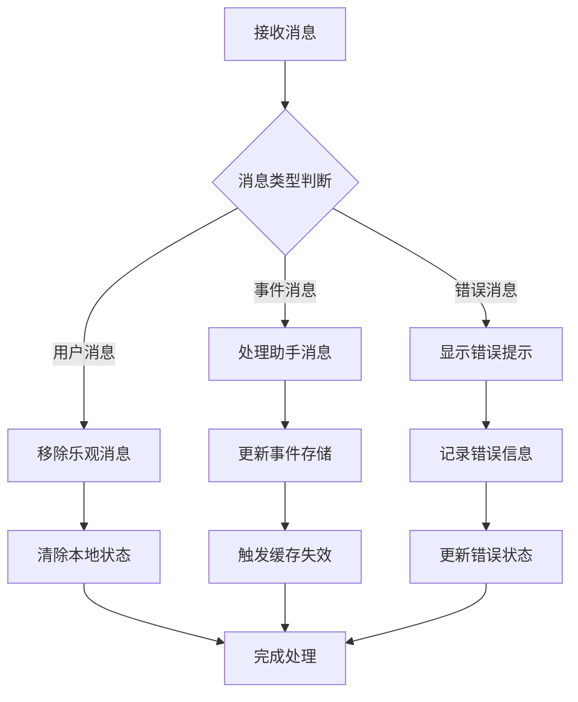

**图表来源**
- [ws-client-provider.tsx](file://frontend/src/context/ws-client-provider.tsx#L161-L247)

#### V1版本消息处理流程

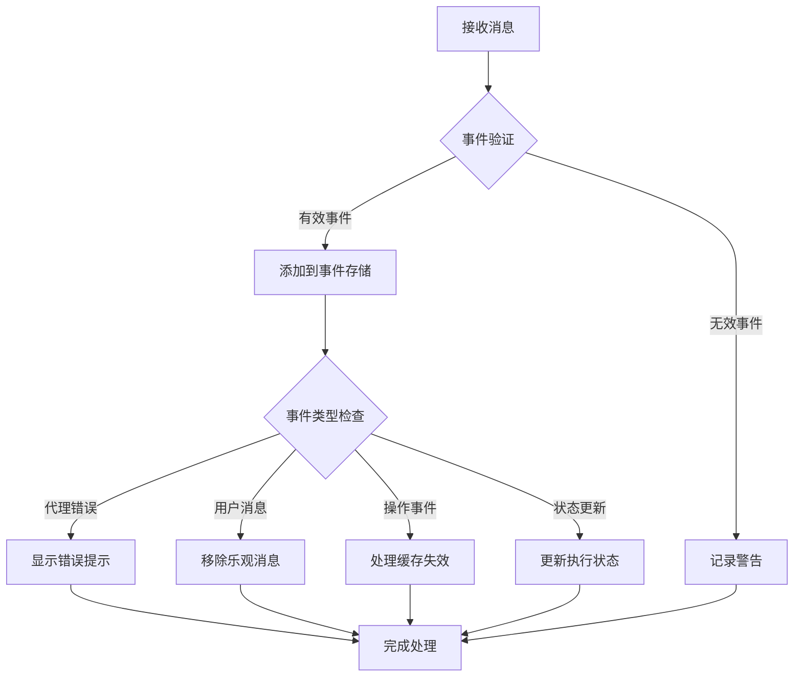

**图表来源**
- [conversation-websocket-context.tsx](file://frontend/src/contexts/conversation-websocket-context.tsx#L110-L178)

### 错误恢复策略

#### 连接错误处理

两种版本都实现了多层次的错误恢复机制：

1. **即时错误检测**：连接失败时立即显示错误信息
2. **自动重连**：在适当时机尝试重新建立连接
3. **状态清理**：错误发生时清理相关状态
4. **用户反馈**：提供清晰的错误信息和恢复建议

**节来源**
- [ws-client-provider.tsx](file://frontend/src/context/ws-client-provider.tsx#L267-L280)
- [conversation-websocket-context.tsx](file://frontend/src/contexts/conversation-websocket-context.tsx#L237-L242)

### ConversationSubscriptionsProvider 订阅机制

该提供者实现了复杂的多对话订阅管理：

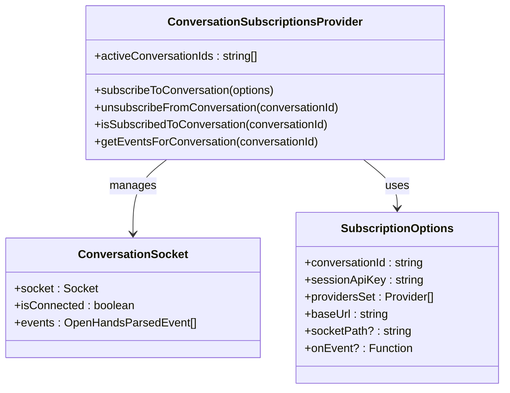

**图表来源**
- [conversation-subscriptions-provider.tsx](file://frontend/src/context/conversation-subscriptions-provider.tsx#L29-L42)

**节来源**
- [conversation-subscriptions-provider.tsx](file://frontend/src/context/conversation-subscriptions-provider.tsx#L134-L283)

### Context与Zustand Store 协作模式

OpenHands采用了混合状态管理模式，结合React Context和Zustand Store：

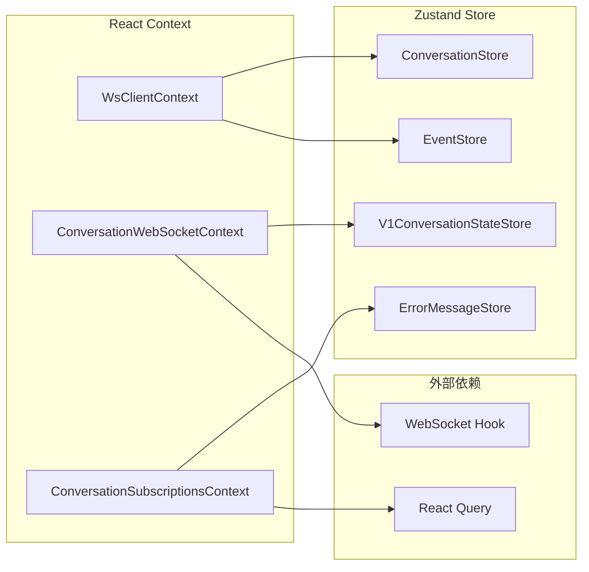

**图表来源**
- [conversation-store.ts](file://frontend/src/state/conversation-store.ts#L60-L311)
- [v1-conversation-state-store.ts](file://frontend/src/stores/v1-conversation-state-store.ts#L18-L27)

**节来源**
- [conversation-store.ts](file://frontend/src/state/conversation-store.ts#L35-L311)
- [v1-conversation-state-store.ts](file://frontend/src/stores/v1-conversation-state-store.ts#L1-L27)

## 依赖关系分析

### Context依赖图

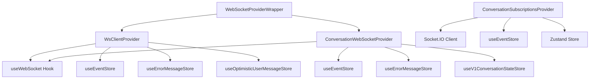

**图表来源**
- [websocket-provider-wrapper.tsx](file://frontend/src/contexts/websocket-provider-wrapper.tsx#L1-L63)
- [conversation-websocket-context.tsx](file://frontend/src/contexts/conversation-websocket-context.tsx#L1-L50)
- [conversation-subscriptions-provider.tsx](file://frontend/src/context/conversation-subscriptions-provider.tsx#L1-L50)

### 数据流向

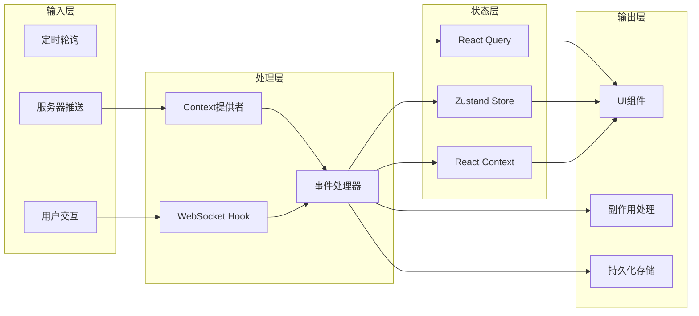

**节来源**
- [use-websocket.ts](file://frontend/src/hooks/use-websocket.ts#L15-L193)
- [conversation-websocket-context.tsx](file://frontend/src/contexts/conversation-websocket-context.tsx#L110-L178)

## 性能考虑

### 避免不必要的重新渲染

OpenHands采用了多种策略来优化性能：

#### 1. useMemo 和 useCallback 的使用

```typescript
// Context值的稳定化
const contextValue = useMemo(
  () => ({ connectionState, sendMessage, isLoadingHistory }),
  [connectionState, sendMessage, isLoadingHistory],
);

// 回调函数的稳定性
const handleMessage = useCallback((messageEvent: MessageEvent) => {
  // 处理消息逻辑
}, [addEvent, isLoadingHistory, expectedEventCount, setErrorMessage]);
```

#### 2. 条件渲染优化

```typescript
// 只有在需要时才渲染WebSocket提供者
return (
  <WebSocketProviderWrapper
    version={isV0Conversation ? 0 : 1}
    conversationId={conversationId}
  >
    {content}
  </WebSocketProviderWrapper>
);
```

#### 3. 内存泄漏预防措施

```typescript
// 组件卸载时的清理
React.useEffect(() => {
  return () => {
    // 禁用重连以防止意外的重新连接尝试
    shouldReconnectRef.current = false;
    // 清除任何待处理的重连超时
    if (reconnectTimeoutRef.current) {
      clearTimeout(reconnectTimeoutRef.current);
      reconnectTimeoutRef.current = null;
    }
    // 关闭WebSocket连接
    if (wsRef.current) {
      allowedToReconnectRef.current.delete(wsRef.current);
      if (readyState === WebSocket.CONNECTING || readyState === WebSocket.OPEN) {
        wsRef.current.close();
      }
      wsRef.current = null;
    }
  };
}, []);
```

**节来源**
- [conversation-websocket-context.tsx](file://frontend/src/contexts/conversation-websocket-context.tsx#L309-L312)
- [use-websocket.ts](file://frontend/src/hooks/use-websocket.ts#L121-L155)

### WebSocket连接池管理

为了防止内存泄漏和提高性能，系统实现了智能的连接管理：

#### 连接生命周期控制

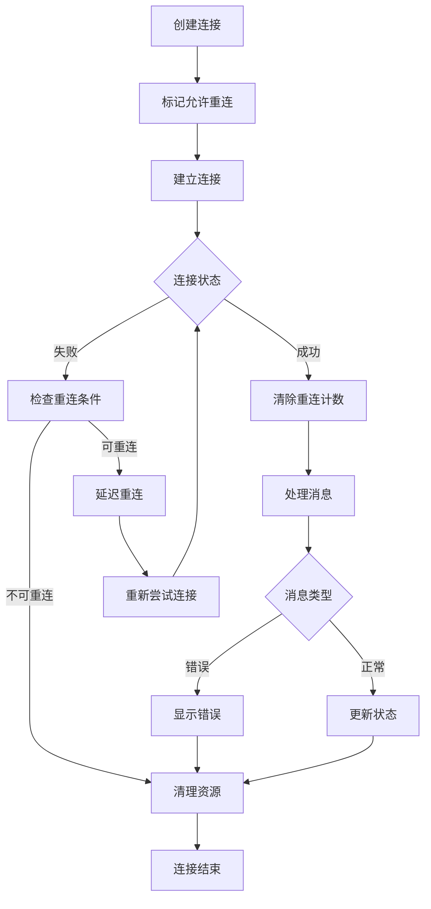

**图表来源**
- [use-websocket.ts](file://frontend/src/hooks/use-websocket.ts#L37-L113)

### 缓存策略优化

#### 事件缓存管理

```typescript
// 基于事件类型的缓存失效策略
if (isFileEditAction(event) || isFileWriteAction(event) || isCommandAction(event)) {
  queryClient.invalidateQueries({
    queryKey: ["file_changes", conversationId],
    // 当消息速率较高时不取消获取，避免不必要的重新获取
    { cancelRefetch: false },
  });
}
```

**节来源**
- [ws-client-provider.tsx](file://frontend/src/context/ws-client-provider.tsx#L215-L246)

## 故障排除指南

### 常见问题及解决方案

#### 1. WebSocket连接失败

**症状**：连接状态始终为"DISCONNECTED"

**诊断步骤**：
- 检查网络连接
- 验证WebSocket URL格式
- 确认服务器端点可用性

**解决方案**：
```typescript
// 添加调试日志
console.log('WebSocket URL:', wsUrl);
console.log('Connection state:', connectionState);
```

#### 2. 消息丢失或重复

**症状**：消息不按顺序到达或出现重复

**诊断步骤**：
- 检查消息ID唯一性
- 验证事件处理顺序
- 确认连接稳定性

**解决方案**：
```typescript
// 实现消息去重机制
const receivedEventCountRef = useRef(0);
const handleMessage = useCallback((messageEvent: MessageEvent) => {
  const event = JSON.parse(messageEvent.data);
  
  // 记录接收的事件数量用于历史加载检测
  if (isLoadingHistory) {
    receivedEventCountRef.current += 1;
    
    if (expectedEventCount !== null && receivedEventCountRef.current >= expectedEventCount) {
      setIsLoadingHistory(false);
    }
  }
}, [isLoadingHistory, expectedEventCount]);
```

#### 3. 内存泄漏问题

**症状**：应用运行时间长后性能下降

**诊断步骤**：
- 检查WebSocket连接是否正确关闭
- 验证事件监听器是否被清理
- 监控Context值的变化频率

**解决方案**：
```typescript
// 确保正确的清理机制
React.useEffect(() => {
  return () => {
    // 禁用重连
    shouldReconnectRef.current = false;
    // 清理定时器
    if (reconnectTimeoutRef.current) {
      clearTimeout(reconnectTimeoutRef.current);
    }
    // 关闭WebSocket
    if (wsRef.current) {
      wsRef.current.close();
    }
  };
}, []);
```

**节来源**
- [conversation-websocket-context.tsx](file://frontend/src/contexts/conversation-websocket-context.tsx#L281-L307)
- [use-websocket.ts](file://frontend/src/hooks/use-websocket.ts#L121-L155)

### 调试工具和技巧

#### 1. WebSocket连接监控

```typescript
// 连接状态监控钩子
export function useWebSocketMonitor() {
  const { isConnected, lastMessage, error, attemptCount } = useWebSocket(url);
  
  useEffect(() => {
    console.log('WebSocket Status:', {
      connected: isConnected,
      lastMessage: lastMessage,
      error: error?.message,
      attempts: attemptCount
    });
  }, [isConnected, lastMessage, error, attemptCount]);
}
```

#### 2. 事件流追踪

```typescript
// 事件处理追踪
const handleMessage = useCallback((messageEvent: MessageEvent) => {
  const startTime = performance.now();
  
  try {
    const event = JSON.parse(messageEvent.data);
    console.log('Received event:', {
      type: event.type,
      timestamp: new Date().getTime(),
      duration: performance.now() - startTime
    });
    
    // 处理事件逻辑...
  } catch (error) {
    console.error('Failed to parse message:', error);
  }
}, []);
```

## 结论

OpenHands的上下文管理系统展现了现代React应用中复杂状态管理的最佳实践。通过精心设计的分层架构，系统成功地平衡了功能性、性能和可维护性。

### 主要优势

1. **版本兼容性**：通过包装器模式实现了V0和V1版本的无缝切换
2. **性能优化**：采用了多种优化策略避免不必要的重新渲染
3. **错误恢复**：实现了健壮的错误处理和自动恢复机制
4. **内存安全**：通过完善的清理机制防止内存泄漏
5. **可扩展性**：模块化的架构设计便于功能扩展

### 最佳实践总结

1. **合理使用Context**：仅在必要时使用Context，避免过度使用
2. **性能优化**：充分利用`useMemo`、`useCallback`等优化工具
3. **资源清理**：确保所有资源都能得到适当的清理
4. **错误处理**：实现全面的错误处理和用户反馈机制
5. **测试覆盖**：为关键路径编写充分的单元测试和集成测试

这套上下文管理系统为OpenHands提供了稳定可靠的WebSocket通信基础，是现代React应用状态管理的一个优秀范例。