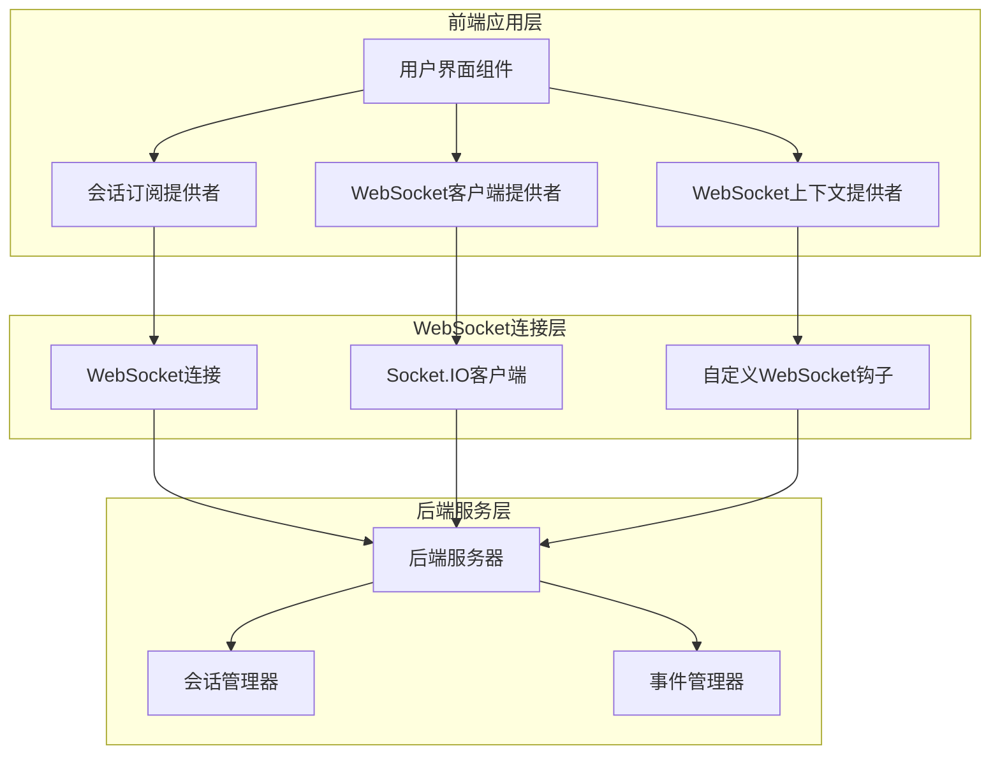

# 会话订阅上下文

<cite>
**本文档中引用的文件**
- [conversation-subscriptions-provider.tsx](file://frontend/src/context/conversation-subscriptions-provider.tsx)
- [ws-client-provider.tsx](file://frontend/src/context/ws-client-provider.tsx)
- [conversation-websocket-context.tsx](file://frontend/src/contexts/conversation-websocket-context.tsx)
- [websocket-provider-wrapper.tsx](file://frontend/src/contexts/websocket-provider-wrapper.tsx)
- [use-websocket.ts](file://frontend/src/hooks/use-websocket.ts)
- [websocket-url.ts](file://frontend/src/utils/websocket-url.ts)
- [conversation.tsx](file://frontend/src/routes/conversation.tsx)
- [microagent-status-toast.tsx](file://frontend/src/components/features/chat/microagent/microagent-status-toast.tsx)
- [build-websocket-url.test.ts](file://frontend/__tests__/build-websocket-url.test.ts)
</cite>

## 目录
1. [简介](#简介)
2. [系统架构概览](#系统架构概览)
3. [核心组件分析](#核心组件分析)
4. [WebSocket连接管理](#websocket连接管理)
5. [订阅注册与事件处理](#订阅注册与事件处理)
6. [错误处理与恢复机制](#错误处理与恢复机制)
7. [性能优化策略](#性能优化策略)
8. [实际应用场景](#实际应用场景)
9. [故障排除指南](#故障排除指南)
10. [总结](#总结)

## 简介

会话订阅上下文是OpenHands项目中负责管理WebSocket连接和实时消息传递的核心系统。该系统通过WebSocket协议实现实时的会话状态同步，支持多个并发对话的独立订阅管理，并提供了完善的错误处理和性能优化机制。

该系统主要解决以下关键问题：
- 实时同步会话状态变化
- 处理WebSocket连接断开和重连
- 确保消息传递的可靠性和顺序性
- 管理多个会话的订阅生命周期
- 提供优雅的错误恢复机制

## 系统架构概览

会话订阅上下文采用分层架构设计，包含前端WebSocket客户端、后端服务器和中间件层：

**图表来源**
- [conversation-subscriptions-provider.tsx](file://frontend/src/context/conversation-subscriptions-provider.tsx#L72-L323)
- [ws-client-provider.tsx](file://frontend/src/context/ws-client-provider.tsx#L130-L405)
- [conversation-websocket-context.tsx](file://frontend/src/contexts/conversation-websocket-context.tsx#L50-L327)

## 核心组件分析

### 会话订阅提供者（ConversationSubscriptionsProvider）

会话订阅提供者是系统的核心组件，负责管理所有WebSocket连接的生命周期和状态同步。

**图表来源**
- [conversation-subscriptions-provider.tsx](file://frontend/src/context/conversation-subscriptions-provider.tsx#L23-L55)

**章节来源**
- [conversation-subscriptions-provider.tsx](file://frontend/src/context/conversation-subscriptions-provider.tsx#L72-L323)

### WebSocket客户端提供者（WsClientProvider）

WebSocket客户端提供者专门处理V0版本的WebSocket连接，提供基础的消息发送和接收功能。

**图表来源**
- [ws-client-provider.tsx](file://frontend/src/context/ws-client-provider.tsx#L148-L154)

**章节来源**
- [ws-client-provider.tsx](file://frontend/src/context/ws-client-provider.tsx#L130-L405)

### WebSocket上下文提供者（ConversationWebSocketProvider）

WebSocket上下文提供者处理V1版本的WebSocket连接，支持更高级的功能如历史加载检测和状态同步。

**图表来源**
- [conversation-websocket-context.tsx](file://frontend/src/contexts/conversation-websocket-context.tsx#L193-L256)

**章节来源**
- [conversation-websocket-context.tsx](file://frontend/src/contexts/conversation-websocket-context.tsx#L50-L327)

## WebSocket连接管理

### 连接建立过程

WebSocket连接的建立遵循严格的初始化流程，确保连接的可靠性和配置的正确性：

**图表来源**
- [conversation-subscriptions-provider.tsx](file://frontend/src/context/conversation-subscriptions-provider.tsx#L204-L216)
- [conversation-websocket-context.tsx](file://frontend/src/contexts/conversation-websocket-context.tsx#L254-L257)

### 连接状态管理

系统维护详细的连接状态信息，支持多种连接状态的监控和处理：

| 连接状态 | 描述 | 处理方式 |
|---------|------|----------|
| CONNECTING | 正在建立连接 | 显示加载指示器，阻止消息发送 |
| OPEN | 连接已建立 | 允许正常的消息交互和状态更新 |
| CLOSING | 正在关闭连接 | 清理资源，准备重新连接 |
| CLOSED | 连接已关闭 | 触发重连机制或显示错误 |

**章节来源**
- [conversation-websocket-context.tsx](file://frontend/src/contexts/conversation-websocket-context.tsx#L281-L302)

## 订阅注册与事件处理

### 订阅注册机制

系统支持动态的订阅注册，允许按需创建和管理WebSocket连接：

**图表来源**
- [conversation-subscriptions-provider.tsx](file://frontend/src/context/conversation-subscriptions-provider.tsx#L134-L282)

### 事件处理流程

系统实现了复杂的事件处理机制，支持多种类型的事件和状态更新：

**图表来源**
- [conversation-subscriptions-provider.tsx](file://frontend/src/context/conversation-subscriptions-provider.tsx#L157-L197)

**章节来源**
- [conversation-subscriptions-provider.tsx](file://frontend/src/context/conversation-subscriptions-provider.tsx#L134-L282)

## 错误处理与恢复机制

### 自动重连机制

系统实现了智能的重连机制，能够自动处理各种连接异常情况：

**图表来源**
- [use-websocket.ts](file://frontend/src/hooks/use-websocket.ts#L73-L112)

### 错误分类与处理

系统对不同类型的错误进行分类处理，提供针对性的恢复策略：

| 错误类型 | 处理策略 | 恢复机制 |
|---------|----------|----------|
| 网络超时 | 自动重连，指数退避 | 最多重连5次，间隔1秒 |
| 身份验证失败 | 显示认证错误，停止重连 | 需要用户重新登录 |
| 服务器不可用 | 指数退避重连 | 最大延迟30秒 |
| 协议错误 | 记录日志，尝试修复 | 重置连接状态 |

**章节来源**
- [use-websocket.ts](file://frontend/src/hooks/use-websocket.ts#L73-L112)
- [ws-client-provider.tsx](file://frontend/src/context/ws-client-provider.tsx#L267-L280)

## 性能优化策略

### 订阅去重机制

为了避免重复订阅相同的会话，系统实现了智能的去重检查：

**图表来源**
- [conversation-subscriptions-provider.tsx](file://frontend/src/context/conversation-subscriptions-provider.tsx#L152-L155)

### 批量更新优化

系统采用批量处理机制，减少不必要的状态更新：

### 内存管理策略

系统实现了完善的内存管理机制，防止内存泄漏：

| 管理策略 | 实现方式 | 效果 |
|---------|----------|------|
| 自动清理 | 组件卸载时清理所有监听器 | 防止内存泄漏 |
| 弱引用 | 使用WeakSet跟踪活跃连接 | 支持垃圾回收 |
| 连接池 | 复用可用的WebSocket连接 | 减少资源消耗 |
| 事件去重 | 过滤重复的事件消息 | 降低CPU使用率 |

**章节来源**
- [conversation-subscriptions-provider.tsx](file://frontend/src/context/conversation-subscriptions-provider.tsx#L83-L126)

## 实际应用场景

### 多会话并发处理

系统支持同时处理多个会话的实时通信：

**图表来源**
- [conversation-subscriptions-provider.tsx](file://frontend/src/context/conversation-subscriptions-provider.tsx#L297-L312)

### 实时状态同步

系统确保会话状态的实时同步，支持多种状态变更场景：

**章节来源**
- [microagent-status-toast.tsx](file://frontend/src/components/features/chat/microagent/microagent-status-toast.tsx#L162-L193)

## 故障排除指南

### 常见问题诊断

| 问题症状 | 可能原因 | 解决方案 |
|---------|----------|----------|
| 连接频繁断开 | 网络不稳定 | 检查网络连接，启用自动重连 |
| 消息丢失 | 连接状态异常 | 重启WebSocket连接 |
| 界面无响应 | 事件处理阻塞 | 检查事件处理器逻辑 |
| 内存泄漏 | 连接未正确清理 | 检查组件卸载逻辑 |

### 调试工具和方法

系统提供了丰富的调试功能，帮助开发者快速定位问题：

**章节来源**
- [build-websocket-url.test.ts](file://frontend/__tests__/build-websocket-url.test.ts#L1-L187)

## 总结

会话订阅上下文是OpenHands项目中一个设计精良的实时通信系统，具有以下核心优势：

1. **可靠性**：完善的错误处理和自动重连机制确保系统的稳定性
2. **可扩展性**：支持多会话并发处理和动态订阅管理
3. **性能优化**：通过去重、批量处理和智能缓存提升系统性能
4. **用户体验**：实时的状态同步和优雅的错误恢复提供良好的用户体验

该系统的设计理念体现了现代Web应用的最佳实践，为构建高性能的实时通信应用提供了优秀的参考实现。通过合理的架构设计和完善的错误处理机制，系统能够在各种复杂环境下稳定运行，为用户提供可靠的实时通信体验。