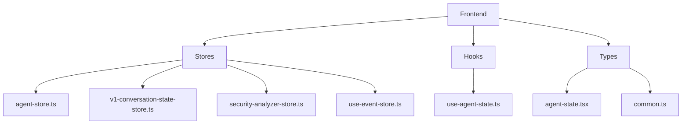
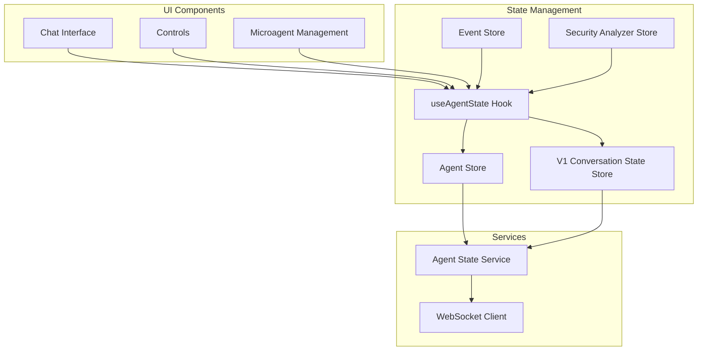
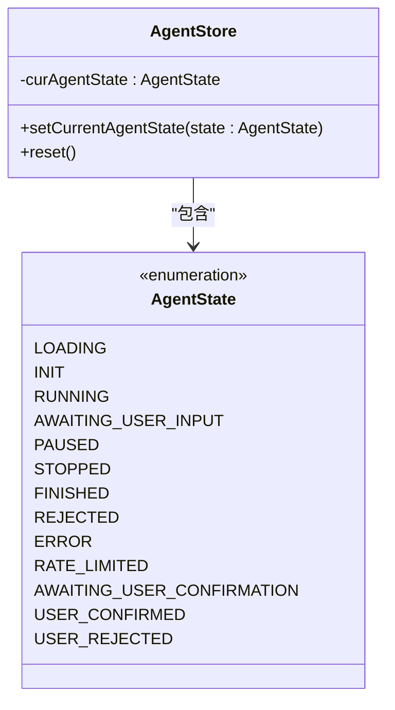
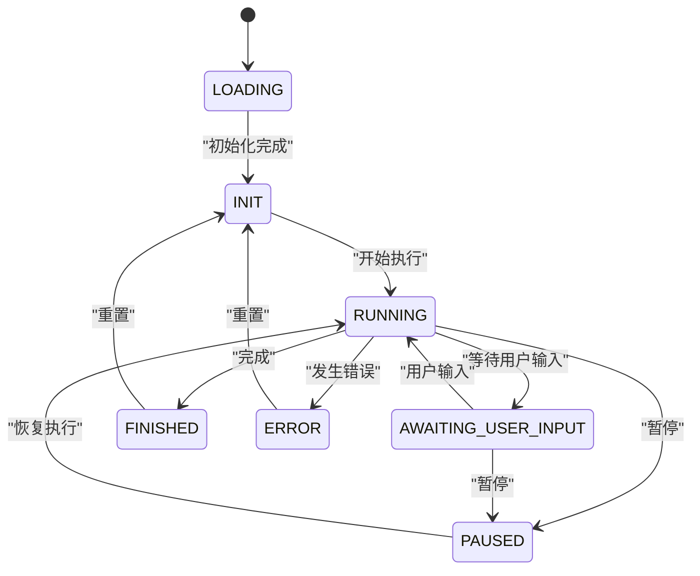
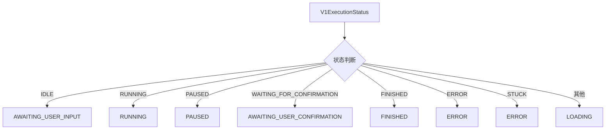

# Agent Store

<cite>
**本文档中引用的文件**  
- [agent-store.ts](file://frontend/src/stores/agent-store.ts)
- [use-agent-state.ts](file://frontend/src/hooks/use-agent-state.ts)
- [agent-state.tsx](file://frontend/src/types/agent-state.tsx)
- [v1-conversation-state-store.ts](file://frontend/src/stores/v1-conversation-state-store.ts)
- [common.ts](file://frontend/src/types/v1/core/base/common.ts)
- [security-analyzer-store.ts](file://frontend/src/stores/security-analyzer-store.ts)
- [use-v0-handle-ws-events.ts](file://frontend/src/hooks/use-v0-handle-ws-events.ts)
- [use-event-store.ts](file://frontend/src/stores/use-event-store.ts)
</cite>

## 目录
1. [简介](#简介)
2. [项目结构](#项目结构)
3. [核心组件](#核心组件)
4. [架构概述](#架构概述)
5. [详细组件分析](#详细组件分析)
6. [依赖分析](#依赖分析)
7. [性能考虑](#性能考虑)
8. [故障排除指南](#故障排除指南)
9. [结论](#结论)

## 简介
Agent Store是OpenHands前端中的核心状态管理模块，负责管理AI代理的生命周期状态。该store为用户界面提供统一的代理状态视图，支持V0和V1版本的对话协议，并与其他store（如conversation-store）协同工作以实现完整的用户体验。

## 项目结构
Agent Store位于前端源代码的stores目录中，与其他状态管理模块共同构成OpenHands的前端状态管理体系。该store通过Zustand库实现，遵循React的最佳实践模式。



**图源**  
- [agent-store.ts](file://frontend/src/stores/agent-store.ts)
- [v1-conversation-state-store.ts](file://frontend/src/stores/v1-conversation-state-store.ts)
- [security-analyzer-store.ts](file://frontend/src/stores/security-analyzer-store.ts)
- [use-event-store.ts](file://frontend/src/stores/use-event-store.ts)

**节源**  
- [agent-store.ts](file://frontend/src/stores/agent-store.ts)
- [v1-conversation-state-store.ts](file://frontend/src/stores/v1-conversation-state-store.ts)

## 核心组件
Agent Store的核心功能包括代理状态管理、状态更新方法和选择器函数。store定义了初始状态并提供方法来更新状态，同时与其他store进行交互以响应代理状态变化。

**节源**  
- [agent-store.ts](file://frontend/src/stores/agent-store.ts)
- [use-agent-state.ts](file://frontend/src/hooks/use-agent-state.ts)

## 架构概述
Agent Store采用分层架构设计，将V0和V1版本的代理状态统一管理。通过useAgentState hook提供统一的API接口，屏蔽了底层版本差异。



**图源**  
- [use-agent-state.ts](file://frontend/src/hooks/use-agent-state.ts)
- [agent-store.ts](file://frontend/src/stores/agent-store.ts)
- [v1-conversation-state-store.ts](file://frontend/src/stores/v1-conversation-state-store.ts)
- [security-analyzer-store.ts](file://frontend/src/stores/security-analyzer-store.ts)
- [use-event-store.ts](file://frontend/src/stores/use-event-store.ts)

## 详细组件分析

### Agent Store分析
Agent Store是管理代理状态的核心模块，负责维护代理的当前状态并提供状态更新方法。

#### 状态定义


**图源**  
- [agent-state.tsx](file://frontend/src/types/agent-state.tsx)
- [agent-store.ts](file://frontend/src/stores/agent-store.ts)

#### 状态转换逻辑


**图源**  
- [agent-store.ts](file://frontend/src/stores/agent-store.ts)
- [use-agent-state.ts](file://frontend/src/hooks/use-agent-state.ts)

### V1状态兼容性分析
为了支持V1版本的对话协议，系统提供了状态映射机制，将V1的执行状态转换为V0的代理状态。



**图源**  
- [use-agent-state.ts](file://frontend/src/hooks/use-agent-state.ts)
- [common.ts](file://frontend/src/types/v1/core/base/common.ts)

**节源**  
- [use-agent-state.ts](file://frontend/src/hooks/use-agent-state.ts)
- [common.ts](file://frontend/src/types/v1/core/base/common.ts)

## 依赖分析
Agent Store与其他多个store和组件存在依赖关系，形成了复杂的状态管理网络。

```mermaid
graph LR
A[Agent Store] --> B[Conversation Store]
A --> C[Security Analyzer Store]
A --> D[Event Store]
A --> E[Microagent Management Store]
B --> F[Active Conversation]
C --> G[Security Risk Analysis]
D --> H[WebSocket Events]
E --> I[Microagent State]
H --> A : "状态更新"
F --> A : "版本检测"
```

**图源**  
- [agent-store.ts](file://frontend/src/stores/agent-store.ts)
- [use-agent-state.ts](file://frontend/src/hooks/use-agent-state.ts)
- [security-analyzer-store.ts](file://frontend/src/stores/security-analyzer-store.ts)
- [use-event-store.ts](file://frontend/src/stores/use-event-store.ts)
- [microagent-management-store.ts](file://frontend/src/state/microagent-management-store.ts)

**节源**  
- [agent-store.ts](file://frontend/src/stores/agent-store.ts)
- [use-agent-state.ts](file://frontend/src/hooks/use-agent-state.ts)
- [security-analyzer-store.ts](file://frontend/src/stores/security-analyzer-store.ts)
- [use-event-store.ts](file://frontend/src/stores/use-event-store.ts)

## 性能考虑
Agent Store的设计考虑了性能优化，通过合理的状态更新策略和依赖管理来确保应用的响应性。

- 使用Zustand的细粒度订阅机制，只在相关状态变化时触发组件重渲染
- 通过useMemo优化状态映射计算，避免不必要的重复计算
- 采用批量状态更新策略，减少不必要的UI更新
- 实现了适当的状态重置机制，防止内存泄漏

## 故障排除指南
当遇到Agent Store相关的问题时，可以参考以下排查步骤：

1. 检查WebSocket连接状态，确保事件能够正常接收
2. 验证代理状态转换逻辑，确保状态机正确工作
3. 检查V0/V1状态映射是否正确处理了所有状态
4. 确认store的初始状态设置是否正确
5. 验证事件处理链路是否完整

**节源**  
- [use-v0-handle-ws-events.ts](file://frontend/src/hooks/use-v0-handle-ws-events.ts)
- [agent-store.ts](file://frontend/src/stores/agent-store.ts)
- [use-event-store.ts](file://frontend/src/stores/use-event-store.ts)

## 结论
Agent Store作为OpenHands前端的核心状态管理模块，成功实现了代理状态的统一管理。通过精心设计的状态机和兼容性层，store能够有效支持不同版本的对话协议，为用户提供一致的用户体验。store与其他组件的良好集成确保了状态变化能够及时反映在用户界面中，形成了完整的反馈循环。