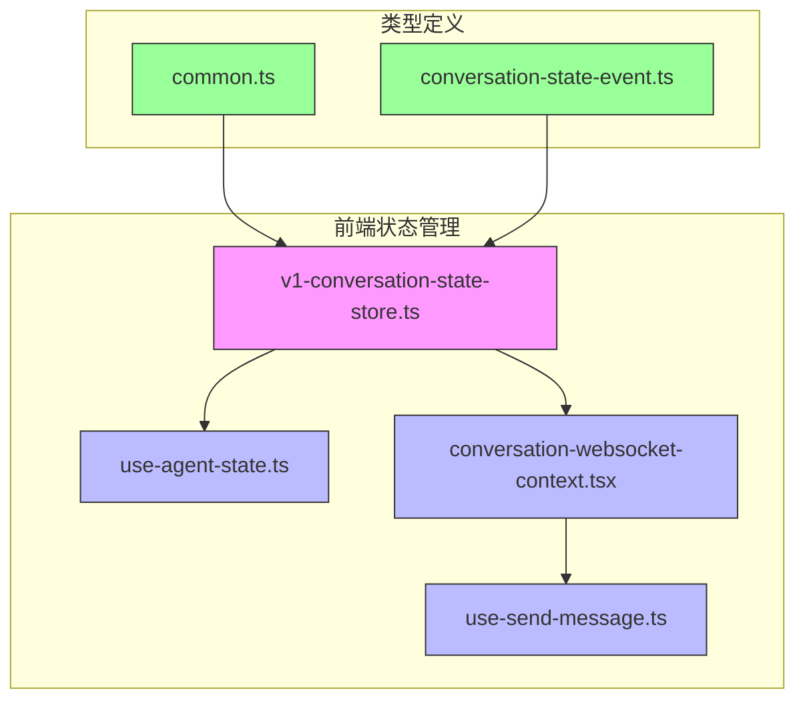
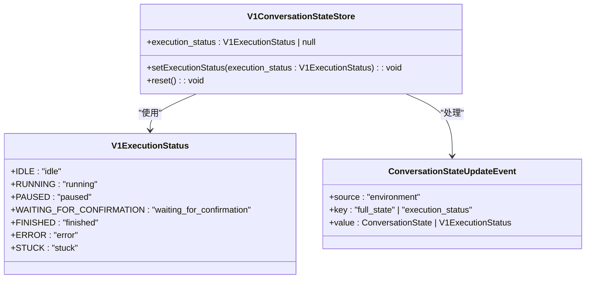
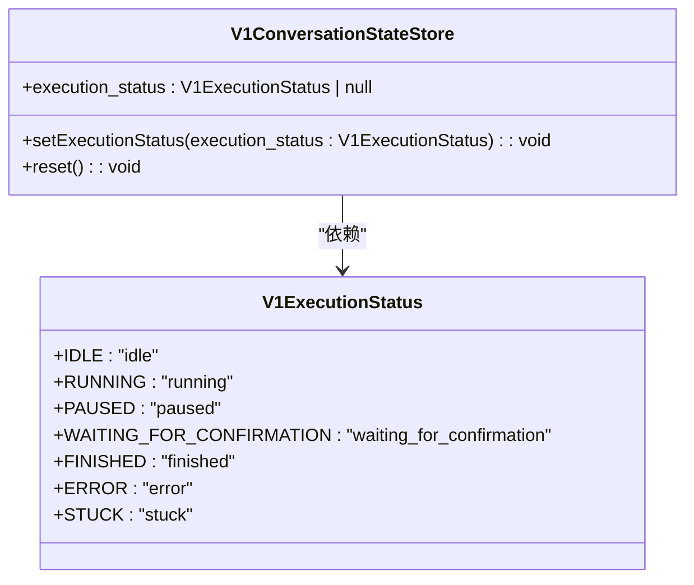
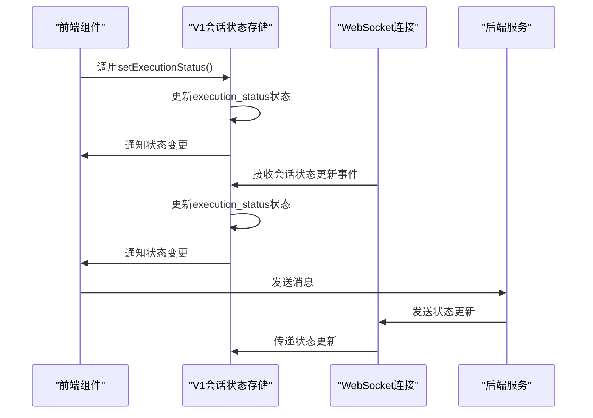
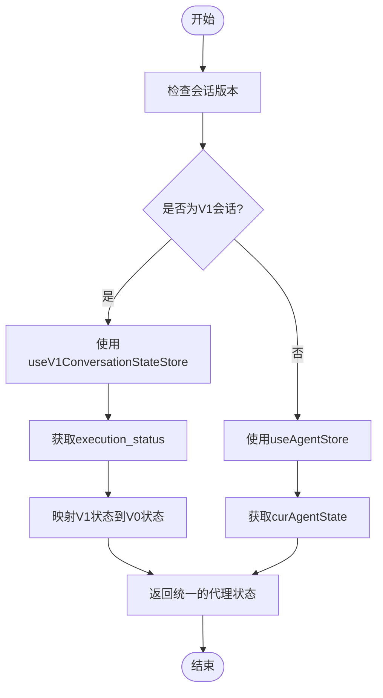
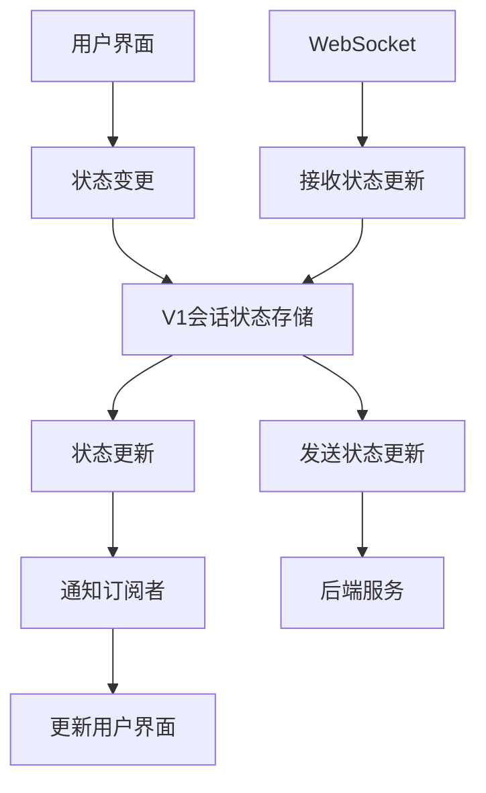
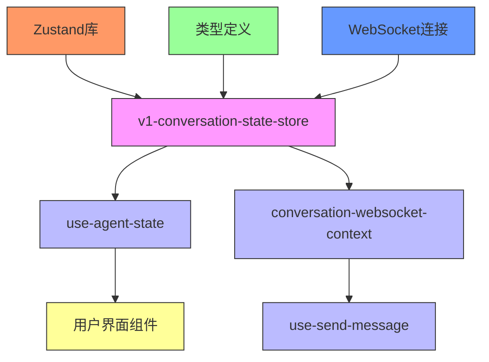

# V1会话状态存储

<cite>
**本文档引用的文件**
- [v1-conversation-state-store.ts](file://frontend/src/stores/v1-conversation-state-store.ts)
- [use-agent-state.ts](file://frontend/src/hooks/use-agent-state.ts)
- [common.ts](file://frontend/src/types/v1/core/base/common.ts)
- [conversation-state-event.ts](file://frontend/src/types/v1/core/events/conversation-state-event.ts)
- [conversation-websocket-context.tsx](file://frontend/src/contexts/conversation-websocket-context.tsx)
- [use-send-message.ts](file://frontend/src/hooks/use-send-message.ts)
- [legacy_conversation_manager.py](file://enterprise/server/legacy_conversation_manager.py)
</cite>

## 目录
1. [简介](#简介)
2. [项目结构](#项目结构)
3. [核心组件](#核心组件)
4. [架构概述](#架构概述)
5. [详细组件分析](#详细组件分析)
6. [依赖分析](#依赖分析)
7. [性能考虑](#性能考虑)
8. [故障排除指南](#故障排除指南)
9. [结论](#结论)

## 简介
本文档详细分析了OpenHands前端中V1版本会话状态管理的架构设计。重点介绍v1-conversation-state-store的职责范围，包括会话配置、代理设置、LLM参数等状态的管理。文档还详细描述了该store与旧版会话管理系统的兼容性处理机制，以及向新架构迁移的策略。通过代码示例说明状态同步、数据验证和错误处理的实现细节，为开发者提供升级和维护指导。

## 项目结构
V1会话状态存储主要位于前端src目录下的stores子目录中，作为Zustand状态管理库的实现。该存储与会话相关的hooks、上下文和类型定义紧密协作，形成了完整的状态管理解决方案。

**图表来源**
- [v1-conversation-state-store.ts](file://frontend/src/stores/v1-conversation-state-store.ts)
- [use-agent-state.ts](file://frontend/src/hooks/use-agent-state.ts)
- [conversation-websocket-context.tsx](file://frontend/src/contexts/conversation-websocket-context.tsx)
- [use-send-message.ts](file://frontend/src/hooks/use-send-message.ts)
- [common.ts](file://frontend/src/types/v1/core/base/common.ts)
- [conversation-state-event.ts](file://frontend/src/types/v1/core/events/conversation-state-event.ts)

**章节来源**
- [v1-conversation-state-store.ts](file://frontend/src/stores/v1-conversation-state-store.ts)
- [use-agent-state.ts](file://frontend/src/hooks/use-agent-state.ts)

## 核心组件
V1会话状态存储的核心是v1-conversation-state-store.ts文件，它使用Zustand库创建了一个专门用于管理V1会话状态的store。该store主要负责管理执行状态(execution_status)，并提供设置状态和重置状态的方法。store的设计遵循了单一职责原则，专注于会话执行状态的管理。

**章节来源**
- [v1-conversation-state-store.ts](file://frontend/src/stores/v1-conversation-state-store.ts)

## 架构概述
V1会话状态存储的架构设计体现了现代前端状态管理的最佳实践。它采用Zustand作为状态管理库，通过create函数创建store实例。store的架构分为状态(state)和操作(actions)两部分，状态部分包含execution_status，操作部分包含setExecutionStatus和reset方法。

**图表来源**
- [v1-conversation-state-store.ts](file://frontend/src/stores/v1-conversation-state-store.ts)
- [common.ts](file://frontend/src/types/v1/core/base/common.ts)
- [conversation-state-event.ts](file://frontend/src/types/v1/core/events/conversation-state-event.ts)

## 详细组件分析

### V1会话状态存储分析
V1会话状态存储是OpenHands前端中用于管理V1版本会话状态的核心组件。它采用Zustand状态管理库实现，提供了简洁而强大的状态管理功能。

#### 对象导向组件

**图表来源**
- [v1-conversation-state-store.ts](file://frontend/src/stores/v1-conversation-state-store.ts)
- [common.ts](file://frontend/src/types/v1/core/base/common.ts)

#### API/服务组件

**图表来源**
- [v1-conversation-state-store.ts](file://frontend/src/stores/v1-conversation-state-store.ts)
- [conversation-websocket-context.tsx](file://frontend/src/contexts/conversation-websocket-context.tsx)
- [use-send-message.ts](file://frontend/src/hooks/use-send-message.ts)

#### 复杂逻辑组件

**图表来源**
- [use-agent-state.ts](file://frontend/src/hooks/use-agent-state.ts)
- [v1-conversation-state-store.ts](file://frontend/src/stores/v1-conversation-state-store.ts)

**章节来源**
- [v1-conversation-state-store.ts](file://frontend/src/stores/v1-conversation-state-store.ts)
- [use-agent-state.ts](file://frontend/src/hooks/use-agent-state.ts)
- [conversation-websocket-context.tsx](file://frontend/src/contexts/conversation-websocket-context.tsx)
- [use-send-message.ts](file://frontend/src/hooks/use-send-message.ts)

### 概念概述
V1会话状态存储的设计体现了现代前端应用状态管理的趋势。它通过将状态管理逻辑集中在一个store中，实现了状态的单一来源，避免了状态分散和不一致的问题。同时，通过与WebSocket的集成，实现了实时的状态同步，确保了用户界面与后端状态的一致性。

## 依赖分析
V1会话状态存储依赖于多个核心组件和库，形成了一个完整的状态管理生态系统。

**图表来源**
- [v1-conversation-state-store.ts](file://frontend/src/stores/v1-conversation-state-store.ts)
- [use-agent-state.ts](file://frontend/src/hooks/use-agent-state.ts)
- [conversation-websocket-context.tsx](file://frontend/src/contexts/conversation-websocket-context.tsx)
- [use-send-message.ts](file://frontend/src/hooks/use-send-message.ts)

**章节来源**
- [v1-conversation-state-store.ts](file://frontend/src/stores/v1-conversation-state-store.ts)
- [use-agent-state.ts](file://frontend/src/hooks/use-agent-state.ts)
- [conversation-websocket-context.tsx](file://frontend/src/contexts/conversation-websocket-context.tsx)
- [use-send-message.ts](file://frontend/src/hooks/use-send-message.ts)

## 性能考虑
V1会话状态存储在设计时充分考虑了性能因素。通过使用Zustand库，实现了高效的订阅通知机制，只有当状态实际发生变化时才会通知订阅者。此外，通过将状态管理逻辑集中化，减少了不必要的状态计算和渲染，提高了应用的整体性能。

## 故障排除指南
在使用V1会话状态存储时，可能会遇到一些常见问题。以下是一些故障排除建议：

1. **状态未更新**：检查WebSocket连接是否正常，确保后端能够正确发送状态更新事件。
2. **状态映射错误**：检查use-agent-state.ts中的映射逻辑，确保V1状态能够正确映射到V0状态。
3. **性能问题**：检查是否有过多的组件订阅了状态变化，考虑使用选择器来优化订阅。

**章节来源**
- [use-agent-state.ts](file://frontend/src/hooks/use-agent-state.ts)
- [v1-conversation-state-store.ts](file://frontend/src/stores/v1-conversation-state-store.ts)
- [conversation-websocket-context.tsx](file://frontend/src/contexts/conversation-websocket-context.tsx)

## 结论
V1会话状态存储是OpenHands前端架构中的关键组件，它通过现代化的状态管理方案，实现了对V1版本会话状态的有效管理。其设计体现了单一职责、关注点分离等软件工程原则，为应用的可维护性和可扩展性奠定了基础。随着OpenHands平台的不断发展，该存储机制将继续发挥重要作用，支持更复杂的会话管理和用户交互场景。