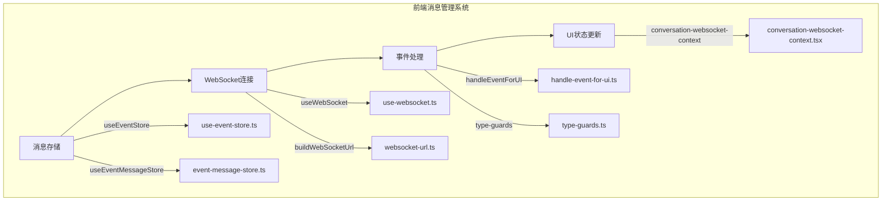
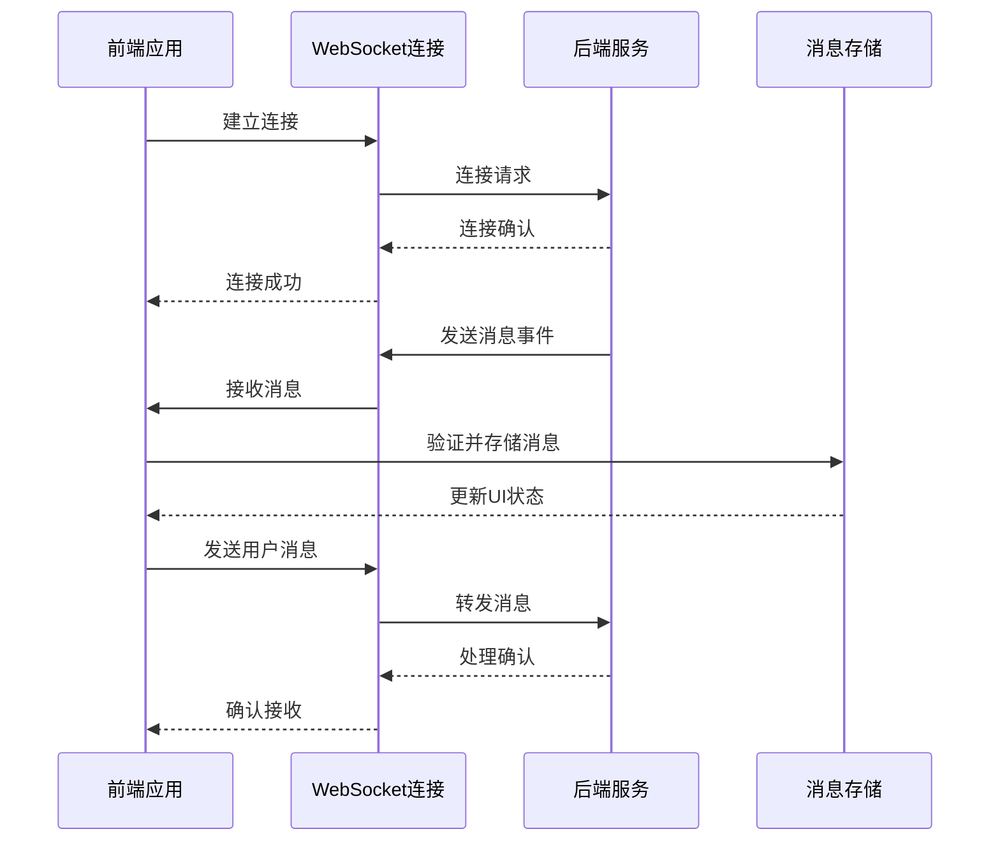
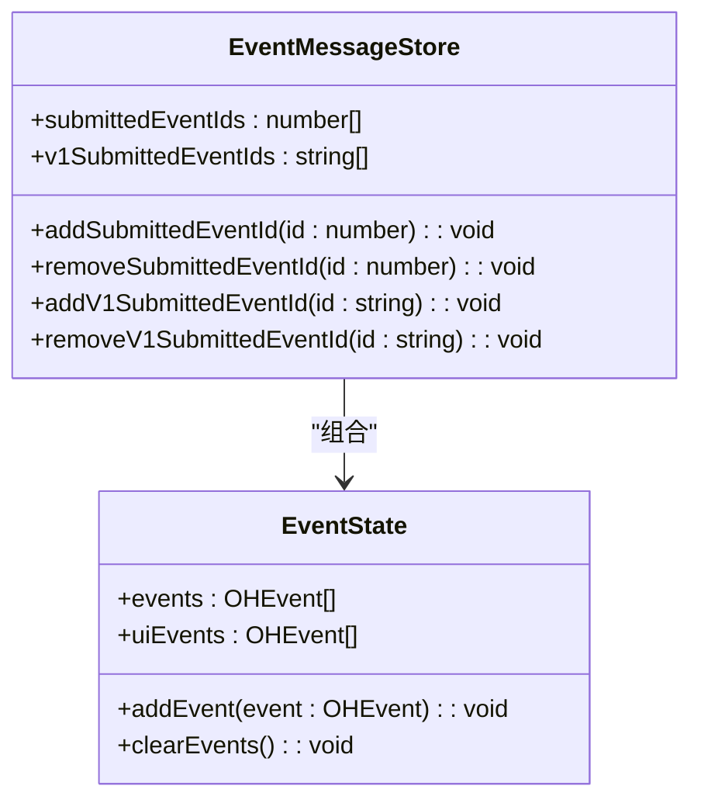
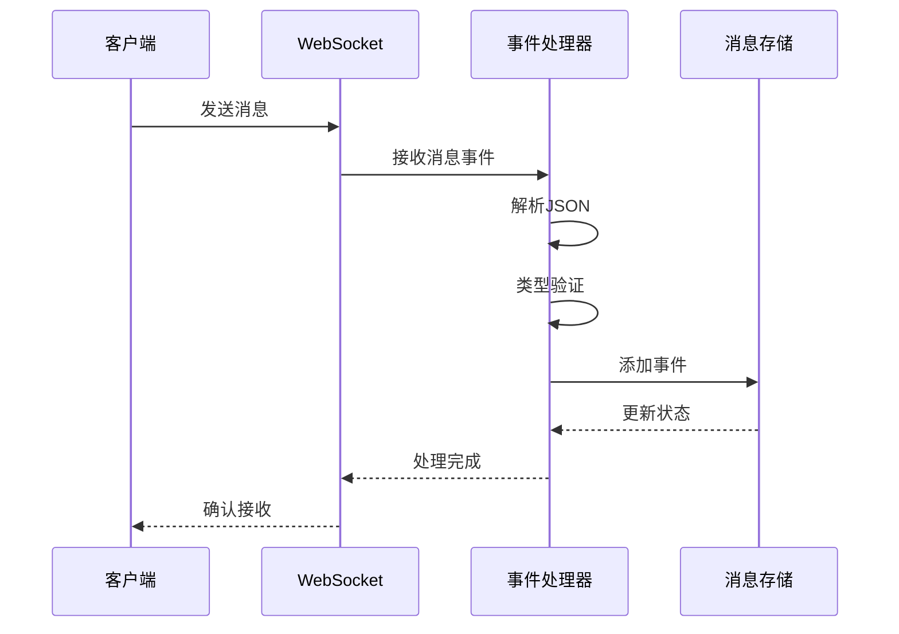
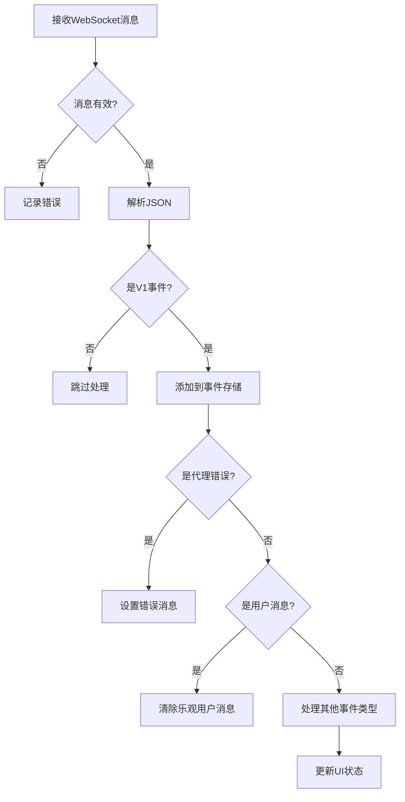
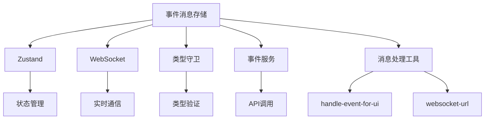

# 事件消息存储

<cite>
**本文档引用的文件**   
- [event-message-store.ts](file://frontend/src/stores/event-message-store.ts)
- [use-event-store.ts](file://frontend/src/stores/use-event-store.ts)
- [conversation-websocket-context.tsx](file://frontend/src/contexts/conversation-websocket-context.tsx)
- [handle-event-for-ui.ts](file://frontend/src/utils/handle-event-for-ui.ts)
- [type-guards.ts](file://frontend/src/types/v1/type-guards.ts)
- [use-websocket.ts](file://frontend/src/hooks/use-websocket.ts)
- [websocket-url.ts](file://frontend/src/utils/websocket-url.ts)
- [event-service.api.ts](file://frontend/src/api/event-service/event-service.api.ts)
</cite>

## 目录
1. [简介](#简介)
2. [项目结构](#项目结构)
3. [核心组件](#核心组件)
4. [架构概述](#架构概述)
5. [详细组件分析](#详细组件分析)
6. [依赖分析](#依赖分析)
7. [性能考虑](#性能考虑)
8. [故障排除指南](#故障排除指南)
9. [结论](#结论)

## 简介
事件消息存储系统是OpenHands前端的核心组件，负责管理事件驱动的消息流。该系统通过WebSocket与后端服务进行实时通信，处理各种类型的消息事件，并在前端应用中维护消息状态。系统设计注重消息的分类管理、状态跟踪和去重处理，确保用户界面能够准确反映对话状态。通过与WebSocket事件系统的集成，实现了高效的消息传递和实时更新，为用户提供流畅的交互体验。

## 项目结构
事件消息存储相关组件主要位于前端代码库的stores和contexts目录中，形成了一个完整的消息管理生态系统。系统通过分层架构实现了关注点分离，将消息存储、WebSocket连接管理和UI状态更新等功能解耦。

**Diagram sources**
- [use-event-store.ts](file://frontend/src/stores/use-event-store.ts)
- [event-message-store.ts](file://frontend/src/stores/event-message-store.ts)
- [use-websocket.ts](file://frontend/src/hooks/use-websocket.ts)
- [websocket-url.ts](file://frontend/src/utils/websocket-url.ts)
- [handle-event-for-ui.ts](file://frontend/src/utils/handle-event-for-ui.ts)
- [type-guards.ts](file://frontend/src/types/v1/type-guards.ts)
- [conversation-websocket-context.tsx](file://frontend/src/contexts/conversation-websocket-context.tsx)

**Section sources**
- [use-event-store.ts](file://frontend/src/stores/use-event-store.ts)
- [event-message-store.ts](file://frontend/src/stores/event-message-store.ts)
- [use-websocket.ts](file://frontend/src/hooks/use-websocket.ts)
- [websocket-url.ts](file://frontend/src/utils/websocket-url.ts)

## 核心组件

事件消息存储系统由多个核心组件构成，包括消息存储、WebSocket连接管理、事件处理和状态更新等。这些组件协同工作，确保消息流的可靠性和一致性。系统采用Zustand状态管理库来维护消息状态，通过WebSocket实现与后端的实时通信，并利用类型守卫确保消息类型的正确性。

**Section sources**
- [use-event-store.ts](file://frontend/src/stores/use-event-store.ts)
- [event-message-store.ts](file://frontend/src/stores/event-message-store.ts)
- [use-websocket.ts](file://frontend/src/hooks/use-websocket.ts)

## 架构概述

事件消息存储系统采用分层架构设计，将消息存储、传输和处理逻辑分离。系统通过WebSocket与后端建立持久连接，接收和发送消息事件。接收到的消息经过类型验证和处理后，存储在Zustand状态管理器中，并触发UI更新。

**Diagram sources**
- [conversation-websocket-context.tsx](file://frontend/src/contexts/conversation-websocket-context.tsx)
- [use-websocket.ts](file://frontend/src/hooks/use-websocket.ts)
- [use-event-store.ts](file://frontend/src/stores/use-event-store.ts)

## 详细组件分析

### 消息存储分析
消息存储组件负责管理应用中的所有消息事件，包括用户消息、系统消息和代理消息。系统维护两个消息队列：一个用于存储所有事件，另一个用于UI显示。这种设计允许系统在后台处理消息的同时，保持UI的响应性。

#### 对于对象导向组件：

**Diagram sources**
- [event-message-store.ts](file://frontend/src/stores/event-message-store.ts)
- [use-event-store.ts](file://frontend/src/stores/use-event-store.ts)

#### 对于API/服务组件：

**Diagram sources**
- [conversation-websocket-context.tsx](file://frontend/src/contexts/conversation-websocket-context.tsx)
- [handle-event-for-ui.ts](file://frontend/src/utils/handle-event-for-ui.ts)

#### 对于复杂逻辑组件：

**Diagram sources**
- [conversation-websocket-context.tsx](file://frontend/src/contexts/conversation-websocket-context.tsx)
- [handle-event-for-ui.ts](file://frontend/src/utils/handle-event-for-ui.ts)
- [type-guards.ts](file://frontend/src/types/v1/type-guards.ts)

**Section sources**
- [event-message-store.ts](file://frontend/src/stores/event-message-store.ts)
- [use-event-store.ts](file://frontend/src/stores/use-event-store.ts)
- [conversation-websocket-context.tsx](file://frontend/src/contexts/conversation-websocket-context.tsx)
- [handle-event-for-ui.ts](file://frontend/src/utils/handle-event-for-ui.ts)
- [type-guards.ts](file://frontend/src/types/v1/type-guards.ts)

### 消息类型分类
系统通过类型守卫机制对消息进行分类和验证。不同类型的消息具有不同的处理逻辑和UI表现。消息类型包括用户消息、代理动作、环境观察、系统事件等，每种类型都有特定的属性和处理方式。

**Section sources**
- [type-guards.ts](file://frontend/src/types/v1/type-guards.ts)
- [openhands-event.ts](file://frontend/src/types/v1/core/openhands-event.ts)

## 依赖分析

事件消息存储系统依赖于多个前端组件和工具库，形成了一个紧密耦合但职责分明的生态系统。系统通过Zustand进行状态管理，利用WebSocket实现双向通信，并使用类型守卫确保数据完整性。

**Diagram sources**
- [event-message-store.ts](file://frontend/src/stores/event-message-store.ts)
- [use-event-store.ts](file://frontend/src/stores/use-event-store.ts)
- [use-websocket.ts](file://frontend/src/hooks/use-websocket.ts)
- [handle-event-for-ui.ts](file://frontend/src/utils/handle-event-for-ui.ts)
- [websocket-url.ts](file://frontend/src/utils/websocket-url.ts)
- [event-service.api.ts](file://frontend/src/api/event-service/event-service.api.ts)

**Section sources**
- [event-message-store.ts](file://frontend/src/stores/event-message-store.ts)
- [use-event-store.ts](file://frontend/src/stores/use-event-store.ts)
- [use-websocket.ts](file://frontend/src/hooks/use-websocket.ts)
- [handle-event-for-ui.ts](file://frontend/src/utils/handle-event-for-ui.ts)
- [websocket-url.ts](file://frontend/src/utils/websocket-url.ts)
- [event-service.api.ts](file://frontend/src/api/event-service/event-service.api.ts)

## 性能考虑

事件消息存储系统在设计时充分考虑了性能优化。系统通过批量处理消息、避免不必要的重新渲染和优化WebSocket连接管理来提高性能。消息去重机制防止了重复事件的处理，内存管理策略确保了长时间运行的会话不会导致内存泄漏。

**Section sources**
- [use-event-store.ts](file://frontend/src/stores/use-event-store.ts)
- [use-websocket.ts](file://frontend/src/hooks/use-websocket.ts)
- [conversation-websocket-context.tsx](file://frontend/src/contexts/conversation-websocket-context.tsx)

## 故障排除指南

当事件消息存储系统出现问题时，可以从以下几个方面进行排查：检查WebSocket连接状态、验证消息格式、确认类型守卫逻辑和审查状态更新流程。常见的错误包括连接中断、消息解析失败和状态不一致等。

**Section sources**
- [conversation-websocket-context.tsx](file://frontend/src/contexts/conversation-websocket-context.tsx)
- [use-websocket.ts](file://frontend/src/hooks/use-websocket.ts)
- [handle-event-for-ui.ts](file://frontend/src/utils/handle-event-for-ui.ts)

## 结论

事件消息存储系统是OpenHands前端架构的核心，通过精心设计的组件和清晰的职责划分，实现了高效、可靠的消息管理。系统不仅满足了基本的消息存储和传输需求，还通过类型安全、错误处理和性能优化等机制，为用户提供了一流的交互体验。未来可以通过引入分页加载和更精细的内存管理策略，进一步提升系统的可扩展性和性能。