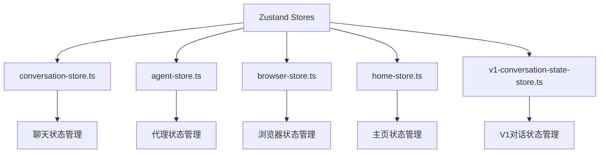
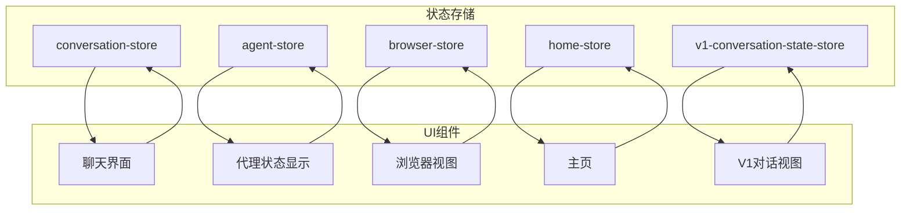
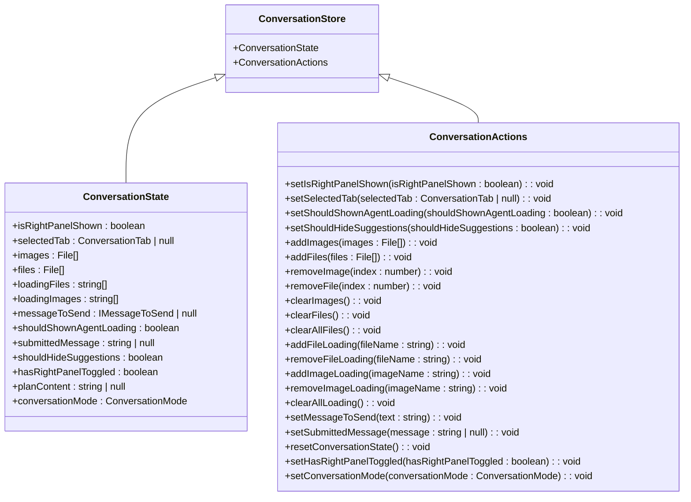
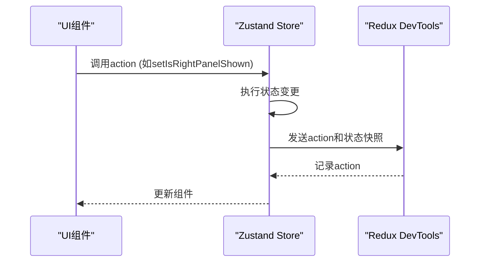
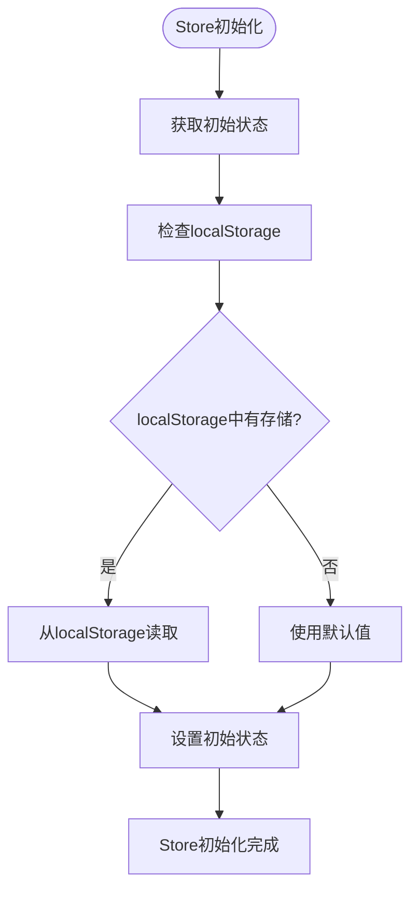
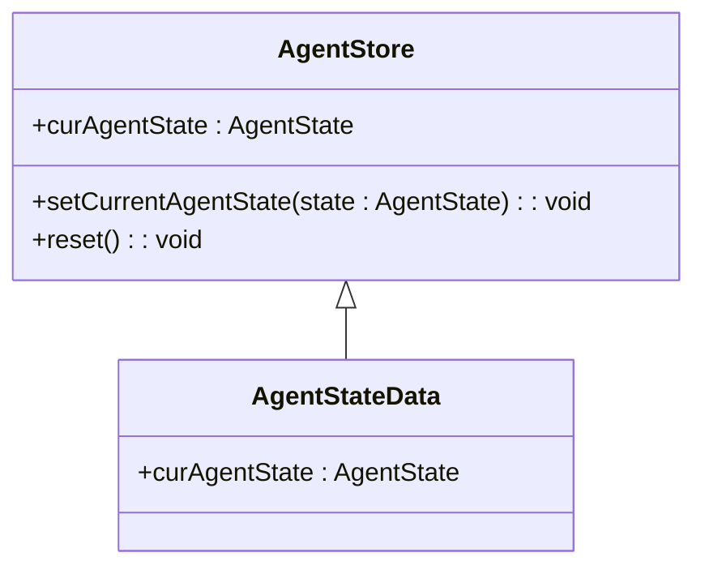
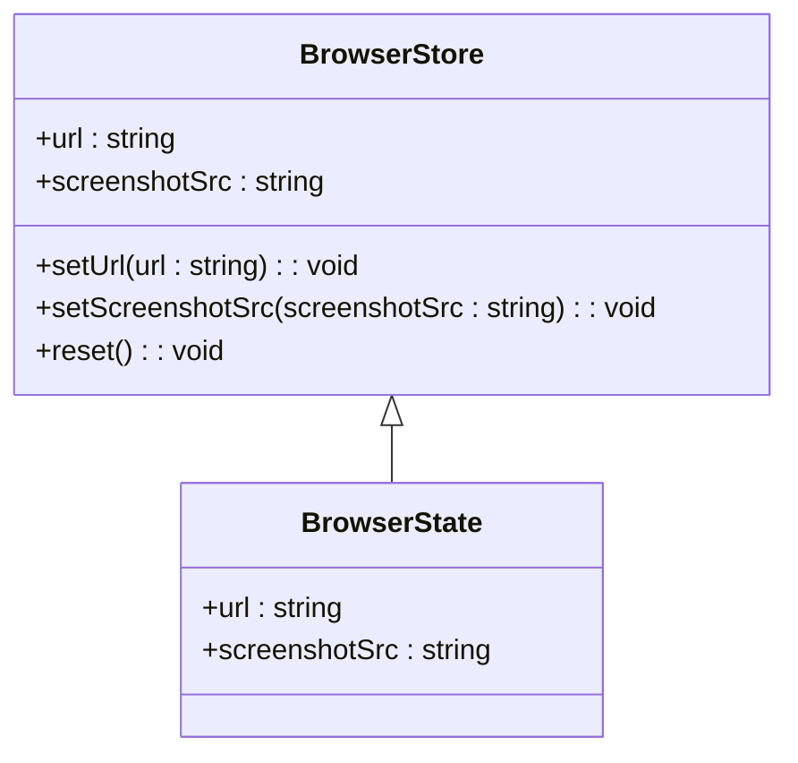
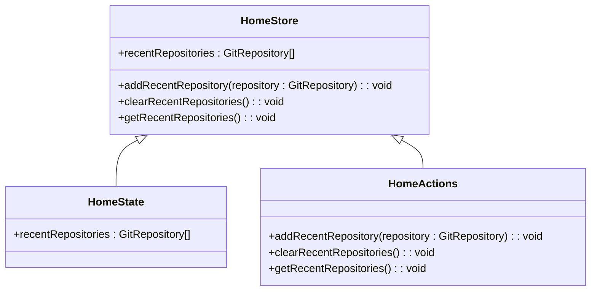
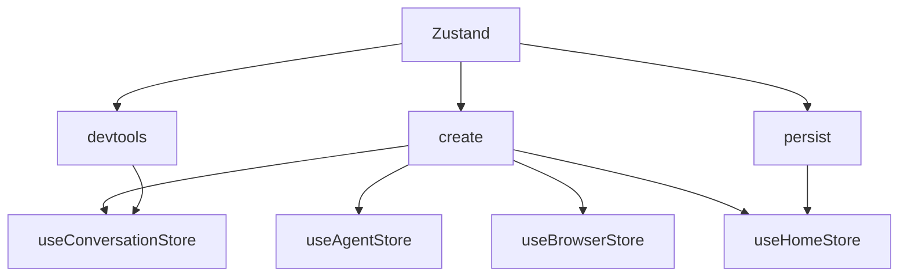

# Zustand集成与调试

<cite>
**本文档引用的文件**  
- [conversation-store.ts](file://frontend/src/state/conversation-store.ts)
- [v1-conversation-state-store.ts](file://frontend/src/stores/v1-conversation-state-store.ts)
- [agent-store.ts](file://frontend/src/stores/agent-store.ts)
- [browser-store.ts](file://frontend/src/stores/browser-store.ts)
- [home-store.ts](file://frontend/src/stores/home-store.ts)
- [zustand.ts](file://frontend/__mocks__/zustand.ts)
</cite>

## 目录
1. [简介](#简介)
2. [项目结构](#项目结构)
3. [核心组件](#核心组件)
4. [架构概述](#架构概述)
5. [详细组件分析](#详细组件分析)
6. [依赖分析](#依赖分析)
7. [性能考虑](#性能考虑)
8. [故障排除指南](#故障排除指南)
9. [结论](#结论)

## 简介
本文档详细说明了OpenHands前端如何使用Zustand进行状态管理。文档涵盖了`create<ConversationStore>`函数的类型安全实现、devtools中间件如何启用状态变更的调试追踪、store的初始化过程（包括初始状态的设置和localStorage的集成）、每个状态变更操作如何通过set函数执行（并包含用于调试的action名称），以及store的模块化设计优势和与其他组件（如聊天界面、文件上传组件）的高效状态同步。

## 项目结构
OpenHands前端使用Zustand作为其状态管理解决方案，将状态逻辑组织在`src/stores`和`src/state`目录中。主要的状态存储包括`conversation-store.ts`、`agent-store.ts`、`browser-store.ts`等，每个store负责管理特定功能域的状态。这种模块化设计使得状态管理清晰且易于维护。

**图示来源**  
- [conversation-store.ts](file://frontend/src/state/conversation-store.ts)
- [agent-store.ts](file://frontend/src/stores/agent-store.ts)
- [browser-store.ts](file://frontend/src/stores/browser-store.ts)
- [home-store.ts](file://frontend/src/stores/home-store.ts)
- [v1-conversation-state-store.ts](file://frontend/src/stores/v1-conversation-state-store.ts)

**本节来源**  
- [frontend/src/state/conversation-store.ts](file://frontend/src/state/conversation-store.ts)
- [frontend/src/stores/](file://frontend/src/stores/)

## 核心组件
OpenHands前端的核心状态管理组件是`useConversationStore`，它使用Zustand的`create`函数创建一个类型安全的状态存储。该store管理聊天界面的各种状态，包括右侧面板的显示状态、选定的标签页、上传的文件和图片、消息输入等。通过将状态和操作方法封装在store中，实现了状态的集中管理和组件间的高效共享。

**本节来源**  
- [conversation-store.ts](file://frontend/src/state/conversation-store.ts)

## 架构概述
OpenHands前端的状态管理架构采用模块化设计，每个功能模块都有其专用的状态存储。`conversation-store`作为核心存储，管理聊天会话的主要状态，而其他存储如`agent-store`、`browser-store`等则负责特定功能的状态管理。这种设计使得状态逻辑清晰分离，便于维护和扩展。

**图示来源**  
- [conversation-store.ts](file://frontend/src/state/conversation-store.ts)
- [agent-store.ts](file://frontend/src/stores/agent-store.ts)
- [browser-store.ts](file://frontend/src/stores/browser-store.ts)
- [home-store.ts](file://frontend/src/stores/home-store.ts)
- [v1-conversation-state-store.ts](file://frontend/src/stores/v1-conversation-state-store.ts)

## 详细组件分析
### ConversationStore分析
`useConversationStore`是OpenHands前端的核心状态存储，负责管理聊天会话的各个方面。它使用Zustand的`create`函数创建，并通过`devtools`中间件启用调试功能。

#### 类型安全实现
`create<ConversationStore>`函数使用TypeScript泛型确保类型安全。`ConversationStore`类型由`ConversationState`接口和`ConversationActions`接口组成，确保状态和操作方法的类型一致性。

**图示来源**  
- [conversation-store.ts](file://frontend/src/state/conversation-store.ts#L19-L57)

#### Devtools调试追踪
`devtools`中间件被用于`useConversationStore`的创建过程中，允许开发者在浏览器的Redux DevTools中追踪状态变更。每个状态变更操作都包含一个action名称，便于在调试工具中识别和追踪。

**图示来源**  
- [conversation-store.ts](file://frontend/src/state/conversation-store.ts#L67-L311)

#### Store初始化
`useConversationStore`在初始化时从localStorage中读取初始状态，确保用户偏好（如右侧面板的显示状态）在页面刷新后得以保留。

**图示来源**  
- [conversation-store.ts](file://frontend/src/state/conversation-store.ts#L61-L65)

**本节来源**  
- [conversation-store.ts](file://frontend/src/state/conversation-store.ts)

### 其他Store分析
除了`conversation-store`，OpenHands还实现了多个专用的状态存储，每个存储负责管理特定功能的状态。

#### AgentStore
`useAgentStore`管理代理的状态，包括当前代理状态（如加载中、运行中等）。

**图示来源**  
- [agent-store.ts](file://frontend/src/stores/agent-store.ts)

#### BrowserStore
`useBrowserStore`管理浏览器视图的状态，包括当前URL和截图。

**图示来源**  
- [browser-store.ts](file://frontend/src/stores/browser-store.ts)

#### HomeStore
`useHomeStore`使用`persist`中间件将状态持久化到localStorage，管理主页的最近仓库列表。

**图示来源**  
- [home-store.ts](file://frontend/src/stores/home-store.ts)

**本节来源**  
- [agent-store.ts](file://frontend/src/stores/agent-store.ts)
- [browser-store.ts](file://frontend/src/stores/browser-store.ts)
- [home-store.ts](file://frontend/src/stores/home-store.ts)

## 依赖分析
OpenHands前端的状态管理依赖于Zustand库及其中间件（如`devtools`和`persist`）。这些依赖使得状态管理更加高效和可调试。

**图示来源**  
- [conversation-store.ts](file://frontend/src/state/conversation-store.ts)
- [agent-store.ts](file://frontend/src/stores/agent-store.ts)
- [browser-store.ts](file://frontend/src/stores/browser-store.ts)
- [home-store.ts](file://frontend/src/stores/home-store.ts)

**本节来源**  
- [package.json](file://frontend/package.json)

## 性能考虑
Zustand的状态管理设计考虑了性能优化。通过使用`shallow`比较和选择性订阅，确保只有相关组件在状态变更时重新渲染。此外，`devtools`中间件仅在开发环境中启用，避免了生产环境的性能开销。

## 故障排除指南
当遇到状态管理相关问题时，可以使用Redux DevTools检查状态变更历史，确保action被正确触发和处理。对于持久化问题，检查localStorage的存储和读取逻辑是否正确实现。

**本节来源**  
- [zustand.ts](file://frontend/__mocks__/zustand.ts)

## 结论
OpenHands前端通过Zustand实现了高效、类型安全的状态管理。`create<ConversationStore>`函数的类型安全实现确保了状态和操作方法的一致性，`devtools`中间件提供了强大的调试能力，而localStorage的集成则保证了用户偏好的持久化。这种模块化的设计使得状态管理清晰且易于维护，为OpenHands的复杂功能提供了坚实的基础。