# 会话存储

<cite>
**本文档引用的文件**
- [conversation_store.py](file://openhands/storage/conversation/conversation_store.py)
- [file_conversation_store.py](file://openhands/storage/conversation/file_conversation_store.py)
- [saas_conversation_store.py](file://enterprise/storage/saas_conversation_store.py)
- [sql_app_conversation_info_service.py](file://openhands/app_server/app_conversation/sql_app_conversation_info_service.py)
- [conversation_metadata.py](file://openhands/storage/data_models/conversation_metadata.py)
- [v1-conversation-state-store.ts](file://frontend/src/stores/v1-conversation-state-store.ts)
- [manage_conversations.py](file://openhands/server/routes/manage_conversations.py)
- [stored_conversation_metadata.py](file://enterprise/storage/stored_conversation_metadata.py)
</cite>

## 目录
1. [简介](#简介)
2. [项目结构概览](#项目结构概览)
3. [核心组件分析](#核心组件分析)
4. [架构概览](#架构概览)
5. [详细组件分析](#详细组件分析)
6. [版本兼容性处理](#版本兼容性处理)
7. [生命周期管理](#生命周期管理)
8. [错误处理与恢复](#错误处理与恢复)
9. [性能考虑](#性能考虑)
10. [故障排除指南](#故障排除指南)
11. [结论](#结论)

## 简介

OpenHands中的会话存储系统是一个复杂而精密的状态管理系统，负责维护和管理所有对话会话的核心状态信息。该系统采用分层架构设计，支持多种存储后端，并提供了完整的版本兼容性处理机制，确保从传统V0版本到现代V1版本的平滑过渡。

会话存储系统的核心职责包括：
- 会话元数据的持久化存储
- 会话状态的实时同步
- 多版本会话的兼容性管理
- 会话生命周期的完整控制
- 错误恢复和状态一致性保证

## 项目结构概览

OpenHands的会话存储系统分布在多个模块中，形成了清晰的层次结构：

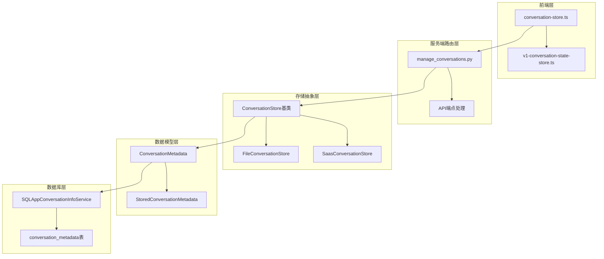

**图表来源**
- [conversation_store.py](file://openhands/storage/conversation/conversation_store.py#L14-L72)
- [manage_conversations.py](file://openhands/server/routes/manage_conversations.py#L1-L50)

**章节来源**
- [conversation_store.py](file://openhands/storage/conversation/conversation_store.py#L1-L72)
- [file_conversation_store.py](file://openhands/storage/conversation/file_conversation_store.py#L1-L123)

## 核心组件分析

### ConversationStore抽象基类

ConversationStore是整个会话存储系统的核心抽象，定义了所有会话存储实现必须遵循的标准接口：

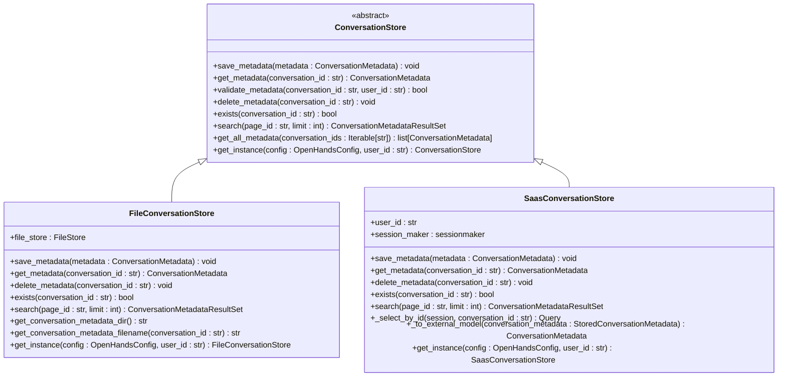

**图表来源**
- [conversation_store.py](file://openhands/storage/conversation/conversation_store.py#L14-L72)
- [file_conversation_store.py](file://openhands/storage/conversation/file_conversation_store.py#L28-L123)
- [saas_conversation_store.py](file://enterprise/storage/saas_conversation_store.py#L29-L149)

### 会话元数据模型

会话元数据是存储系统的核心数据结构，包含了会话的所有基本信息：

| 字段名 | 类型 | 描述 | 默认值 |
|--------|------|------|--------|
| conversation_id | str | 唯一的会话标识符 | 自动生成 |
| user_id | str \| None | 用户标识符 | None |
| selected_repository | str \| None | 选中的代码仓库 | None |
| selected_branch | str \| None | 选中的分支 | None |
| git_provider | ProviderType \| None | Git提供商类型 | None |
| title | str \| None | 会话标题 | None |
| created_at | datetime | 创建时间 | 当前时间 |
| last_updated_at | datetime | 最后更新时间 | None |
| trigger | ConversationTrigger \| None | 触发器类型 | None |
| pr_number | list[int] | 关联的PR编号列表 | [] |
| llm_model | str \| None | 使用的LLM模型 | None |
| accumulated_cost | float | 累计成本 | 0.0 |
| prompt_tokens | int | 提示令牌数 | 0 |
| completion_tokens | int | 补全令牌数 | 0 |
| total_tokens | int | 总令牌数 | 0 |
| sandbox_id | str \| None | 沙箱环境ID | None |
| conversation_version | str \| None | 会话版本 | None |

**章节来源**
- [conversation_metadata.py](file://openhands/storage/data_models/conversation_metadata.py#L21-L42)

## 架构概览

OpenHands的会话存储系统采用了多层架构设计，确保了系统的可扩展性和维护性：

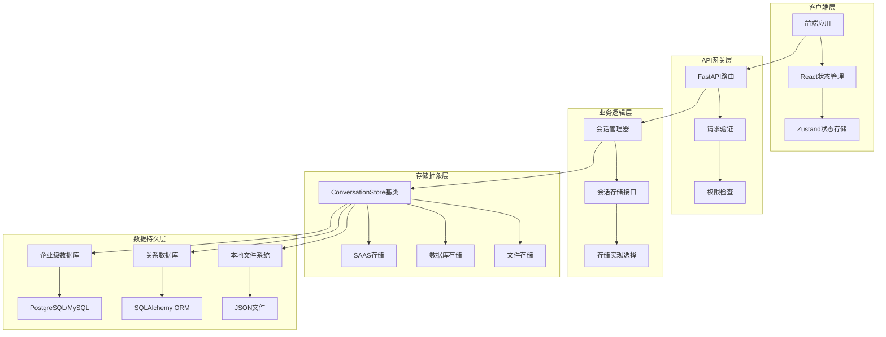

**图表来源**
- [manage_conversations.py](file://openhands/server/routes/manage_conversations.py#L400-L500)
- [conversation_store.py](file://openhands/storage/conversation/conversation_store.py#L14-L72)

## 详细组件分析

### 文件会话存储 (FileConversationStore)

文件会话存储是最基础的存储实现，适用于开发环境和小型部署场景：

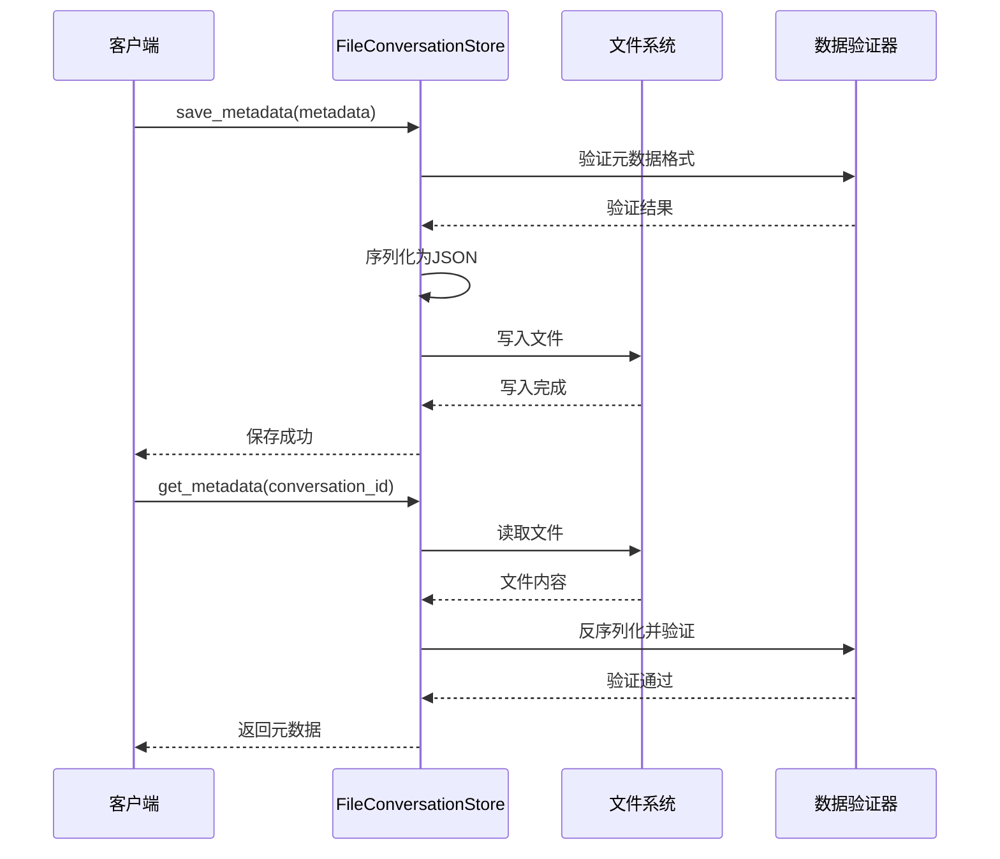

**图表来源**
- [file_conversation_store.py](file://openhands/storage/conversation/file_conversation_store.py#L32-L51)

### SAAS会话存储 (SaasConversationStore)

SAAS会话存储专为企业级部署设计，提供了强大的数据库功能和用户隔离：

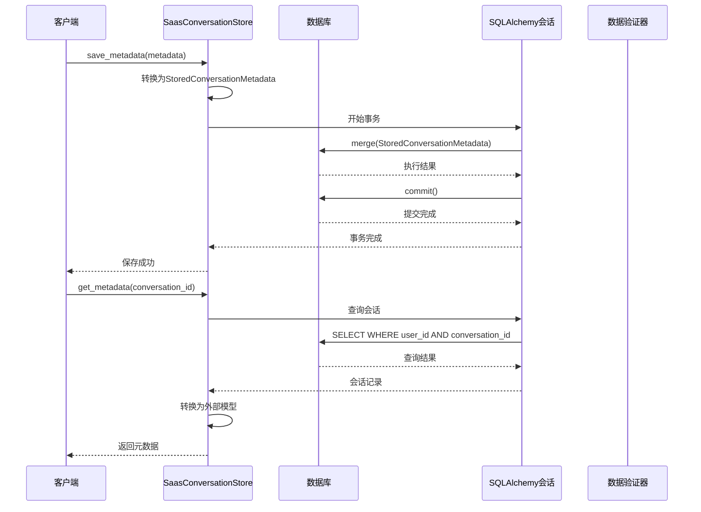

**图表来源**
- [saas_conversation_store.py](file://enterprise/storage/saas_conversation_store.py#L66-L96)

### V1会话信息服务 (SQLAppConversationInfoService)

V1版本引入了更复杂的会话管理机制，支持高级功能如成本跟踪和令牌使用统计：

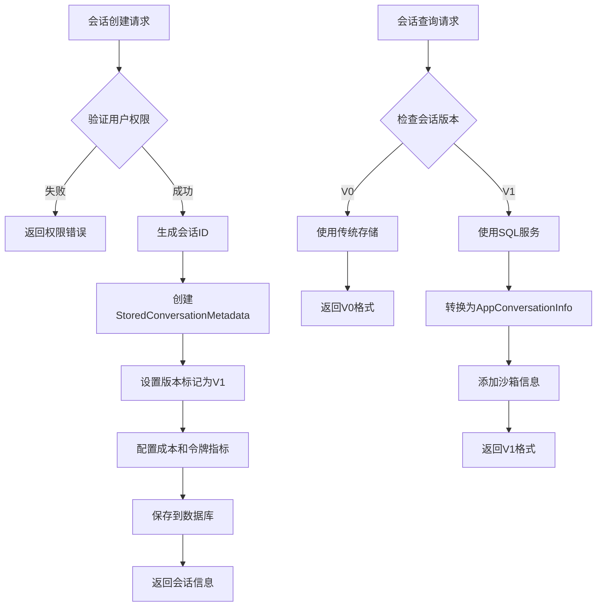

**图表来源**
- [sql_app_conversation_info_service.py](file://openhands/app_server/app_conversation/sql_app_conversation_info_service.py#L270-L315)

**章节来源**
- [file_conversation_store.py](file://openhands/storage/conversation/file_conversation_store.py#L28-L123)
- [saas_conversation_store.py](file://enterprise/storage/saas_conversation_store.py#L29-L149)
- [sql_app_conversation_info_service.py](file://openhands/app_server/app_conversation/sql_app_conversation_info_service.py#L93-L424)

## 版本兼容性处理

OpenHands实现了复杂的版本兼容性机制，确保V0和V1会话能够共存并相互访问：

### 版本标识系统

| 版本 | 标识符 | 主要特性 | 存储位置 |
|------|--------|----------|----------|
| V0 | 'V0' | 基础会话功能 | 传统文件存储 |
| V1 | 'V1' | 高级功能、成本跟踪 | SQL数据库 |

### 兼容性处理流程

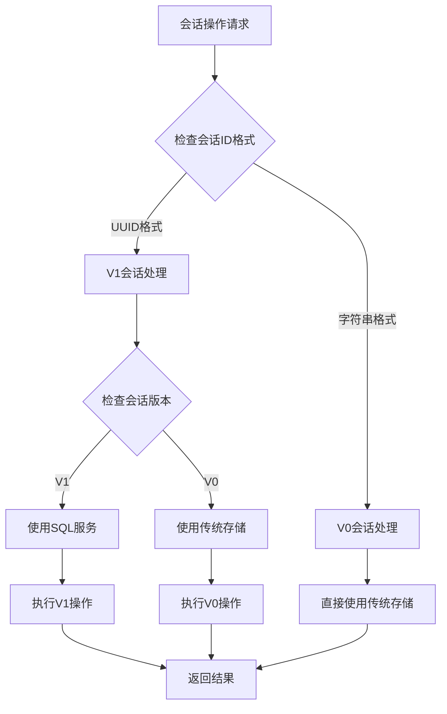

**图表来源**
- [manage_conversations.py](file://openhands/server/routes/manage_conversations.py#L433-L466)

### 数据迁移策略

系统提供了多种数据迁移策略以确保版本间的平滑过渡：

1. **渐进式迁移**: 新建会话自动使用V1格式，现有会话保持原样
2. **版本检测**: 自动识别会话版本并选择合适的处理方式
3. **向后兼容**: V1功能可以访问V0数据，但V0无法访问V1的高级功能

**章节来源**
- [manage_conversations.py](file://openhands/server/routes/manage_conversations.py#L314-L346)
- [sql_app_conversation_info_service.py](file://openhands/app_server/app_conversation/sql_app_conversation_info_service.py#L316-L325)

## 生命周期管理

会话的完整生命周期包括创建、更新、查询和删除四个主要阶段：

### 会话创建流程

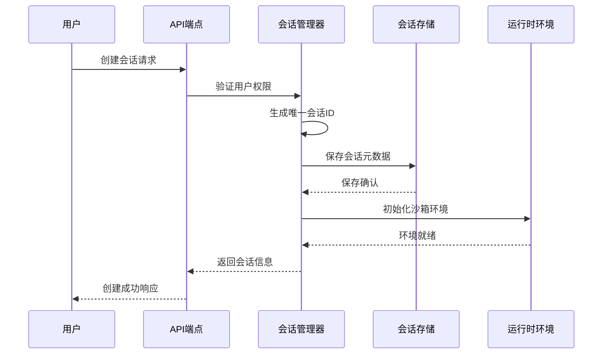

**图表来源**
- [manage_conversations.py](file://openhands/server/routes/manage_conversations.py#L468-L485)

### 会话更新机制

会话更新采用增量更新策略，只修改发生变化的字段：

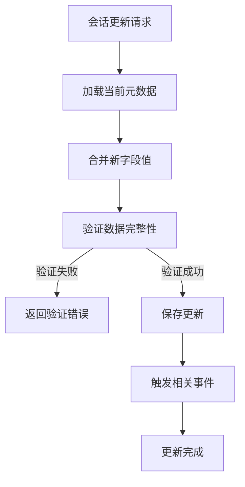

### 会话删除流程

删除操作需要考虑多个层面的数据清理：

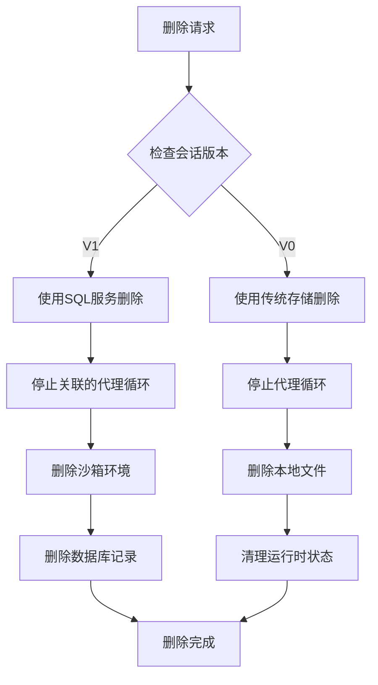

**图表来源**
- [manage_conversations.py](file://openhands/server/routes/manage_conversations.py#L468-L535)

**章节来源**
- [manage_conversations.py](file://openhands/server/routes/manage_conversations.py#L468-L535)

## 错误处理与恢复

OpenHands实现了多层次的错误处理和恢复机制，确保系统的稳定性和数据一致性：

### 错误分类与处理策略

| 错误类型 | 处理策略 | 恢复方法 | 影响范围 |
|----------|----------|----------|----------|
| 文件不存在 | 记录日志并返回空结果 | 重新初始化 | 单个会话 |
| 数据库连接失败 | 重试机制 | 切换备用连接 | 整个服务 |
| 权限验证失败 | 拒绝访问 | 返回认证错误 | 单个请求 |
| 数据格式错误 | 数据修复或重建 | 使用默认值 | 单个记录 |
| 并发冲突 | 乐观锁重试 | 后续重试 | 单个操作 |

### 异常恢复流程

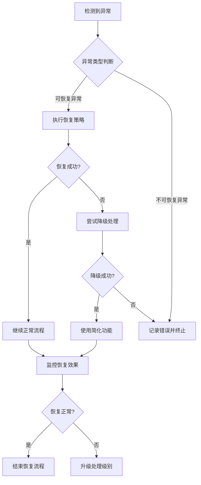

### 状态一致性保证

系统通过以下机制确保状态的一致性：

1. **事务管理**: 所有数据库操作都在事务中执行
2. **乐观锁**: 使用版本号防止并发冲突
3. **补偿机制**: 在操作失败时执行反向操作
4. **健康检查**: 定期验证系统状态

**章节来源**
- [saas_conversation_store.py](file://enterprise/storage/saas_conversation_store.py#L88-L96)
- [sql_app_conversation_info_service.py](file://openhands/app_server/app_conversation/sql_app_conversation_info_service.py#L378-L404)

## 性能考虑

会话存储系统在设计时充分考虑了性能优化，采用了多种技术手段提升系统效率：

### 缓存策略

- **内存缓存**: 热点数据存储在内存中
- **查询缓存**: 缓存常用的查询结果
- **连接池**: 数据库连接复用

### 分页优化

系统实现了智能分页机制，支持大数据集的高效查询：

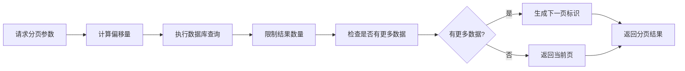

### 并发控制

- **读写分离**: 读操作和写操作分开处理
- **乐观锁**: 减少锁竞争
- **批量操作**: 合并多个小操作

## 故障排除指南

### 常见问题诊断

| 问题症状 | 可能原因 | 诊断方法 | 解决方案 |
|----------|----------|----------|----------|
| 会话加载失败 | 文件损坏或权限问题 | 检查文件存在性和权限 | 重新创建会话 |
| 数据库连接超时 | 网络问题或服务器负载 | 测试网络连通性 | 重启数据库服务 |
| 权限拒绝 | 用户身份验证失败 | 检查认证令牌 | 更新认证信息 |
| 性能下降 | 数据库索引缺失 | 分析查询计划 | 添加适当索引 |

### 调试工具和技巧

1. **日志分析**: 启用详细日志记录
2. **性能监控**: 使用APM工具监控系统性能
3. **数据库分析**: 分析慢查询和锁等待
4. **内存分析**: 监控内存使用情况

**章节来源**
- [file_conversation_store.py](file://openhands/storage/conversation/file_conversation_store.py#L37-L51)
- [saas_conversation_store.py](file://enterprise/storage/saas_conversation_store.py#L88-L96)

## 结论

OpenHands的会话存储系统是一个设计精良、功能完备的状态管理系统。它通过分层架构、多版本兼容性、完善的错误处理机制和性能优化策略，为整个平台提供了可靠的基础支撑。

### 主要优势

1. **架构清晰**: 分层设计便于维护和扩展
2. **版本兼容**: 平滑的V0到V1迁移路径
3. **错误恢复**: 完善的异常处理和恢复机制
4. **性能优化**: 多种优化策略确保系统高效运行
5. **可扩展性**: 支持多种存储后端和部署场景

### 发展方向

随着OpenHands平台的不断发展，会话存储系统将继续演进，可能的方向包括：

- 更智能的缓存策略
- 分布式存储支持
- 实时协作功能增强
- 更丰富的数据分析能力

这个系统为OpenHands提供了坚实的技术基础，支撑着整个平台的稳定运行和持续发展。