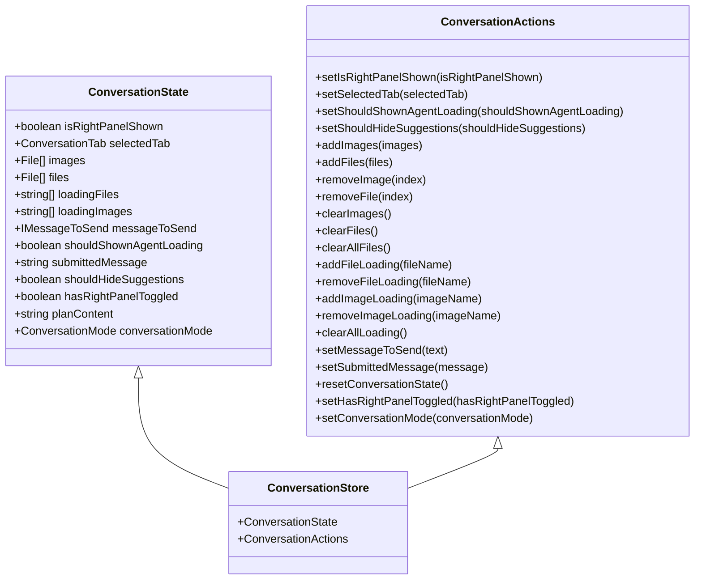
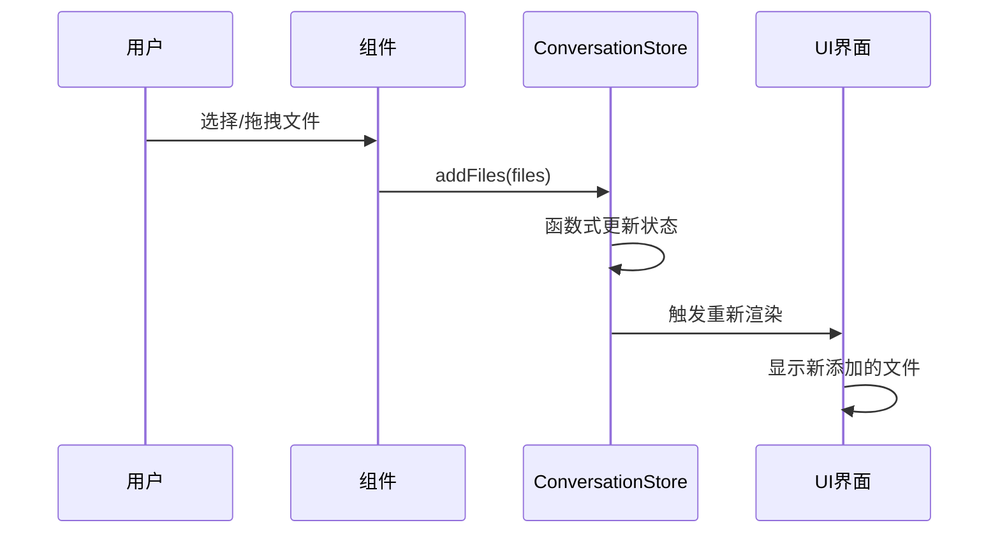
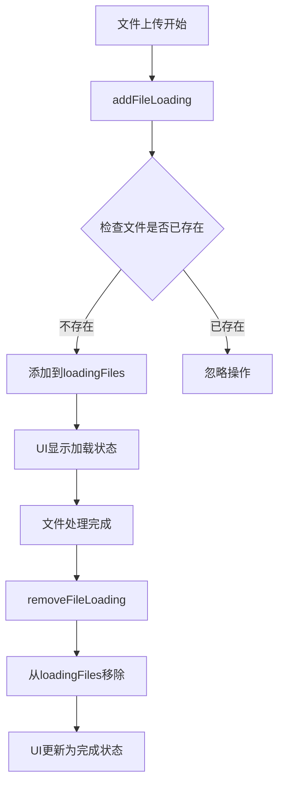
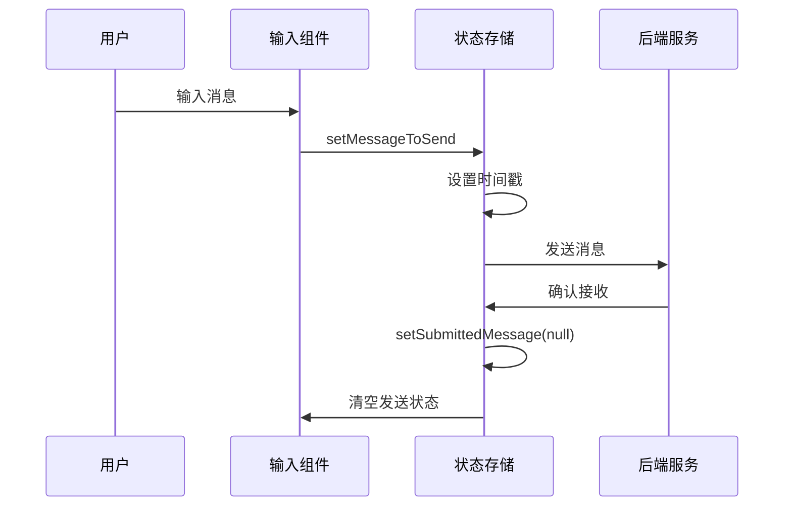
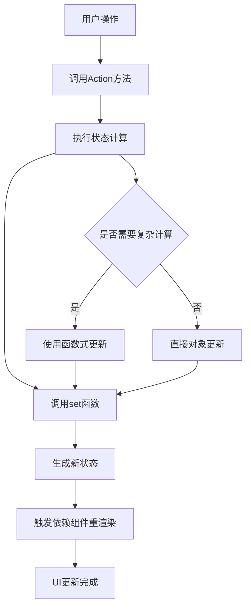
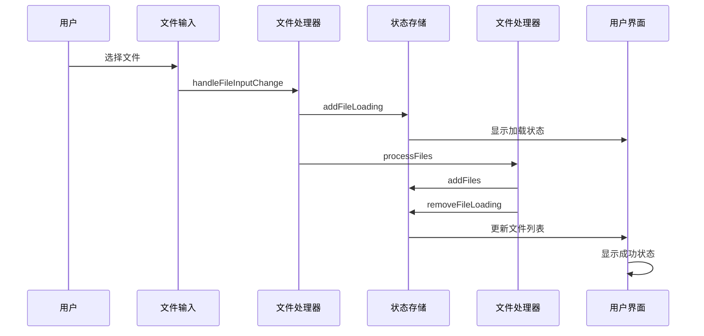

# 会话操作方法详细文档

<cite>
**本文档中引用的文件**
- [conversation-store.ts](file://frontend/src/state/conversation-store.ts)
- [interactive-chat-box.tsx](file://frontend/src/components/features/chat/interactive-chat-box.tsx)
- [uploaded-files.tsx](file://frontend/src/components/features/chat/uploaded-files.tsx)
- [use-file-handling.ts](file://frontend/src/hooks/chat/use-file-handling.ts)
- [file-processing.ts](file://frontend/src/utils/file-processing.ts)
- [custom-chat-input.tsx](file://frontend/src/components/features/chat/custom-chat-input.tsx)
- [use-chat-submission.ts](file://frontend/src/hooks/chat/use-chat-submission.ts)
- [uploaded-file.tsx](file://frontend/src/components/features/chat/uploaded-file.tsx)
</cite>

## 目录
1. [简介](#简介)
2. [ConversationActions接口概述](#conversationactions接口概述)
3. [UI交互方法详解](#ui交互方法详解)
4. [文件和图片操作方法](#文件和图片操作方法)
5. [加载状态管理方法](#加载状态管理方法)
6. [复合操作方法](#复合操作方法)
7. [模式切换方法](#模式切换方法)
8. [zustand状态变更机制](#zustand状态变更机制)
9. [实际应用场景](#实际应用场景)
10. [最佳实践建议](#最佳实践建议)

## 简介

本文档深入解析OpenHands前端项目中`ConversationActions`接口定义的所有状态变更方法。这些方法通过zustand状态管理库实现会话状态的统一管理和响应式更新，涵盖了文件上传、图片处理、加载状态管理以及会话模式切换等核心功能。

## ConversationActions接口概述

`ConversationActions`接口定义了会话状态管理的所有动作方法，继承自`ConversationState`接口，提供了完整的状态变更能力。

**图表来源**
- [conversation-store.ts](file://frontend/src/state/conversation-store.ts#L19-L33)
- [conversation-store.ts](file://frontend/src/state/conversation-store.ts#L35-L56)

**章节来源**
- [conversation-store.ts](file://frontend/src/state/conversation-store.ts#L35-L56)

## UI交互方法详解

### setSelectedTab方法

`setSelectedTab`方法用于设置当前选中的会话标签页，支持编辑器、浏览器、服务端、VSCode、终端和规划器等多种视图模式。

**实现逻辑：**
- 接收`ConversationTab | null`类型的参数
- 直接调用zustand的`set`函数更新状态
- 触发UI重新渲染以显示对应标签页内容

**使用场景：**
- 用户点击不同标签页时切换视图
- 程序化导航到特定功能模块
- 响应路由变化自动切换标签页

### 其他UI交互方法

| 方法名 | 参数类型 | 功能描述 | 使用场景 |
|--------|----------|----------|----------|
| `setIsRightPanelShown` | `boolean` | 控制右侧面板显示状态 | 布局调整、全屏模式 |
| `setShouldShownAgentLoading` | `boolean` | 控制代理加载动画显示 | 加载状态指示 |
| `setShouldHideSuggestions` | `boolean` | 控制输入建议隐藏状态 | 输入框扩展时隐藏建议 |
| `setHasRightPanelToggled` | `boolean` | 记录右侧面板切换状态 | 布局持久化 |

**章节来源**
- [conversation-store.ts](file://frontend/src/state/conversation-store.ts#L170-L180)

## 文件和图片操作方法

### addFiles方法

`addFiles`方法负责向会话添加文件列表，支持批量文件上传和拖拽操作。

**实现细节：**
- 接收`File[]`数组参数
- 使用函数式更新确保状态一致性
- 通过扩展运算符合并新旧文件列表
- 避免重复添加相同文件

**数据流：**

**图表来源**
- [conversation-store.ts](file://frontend/src/state/conversation-store.ts#L188-L194)
- [interactive-chat-box.tsx](file://frontend/src/components/features/chat/interactive-chat-box.tsx#L126-L127)

### removeFile方法

`removeFile`方法从会话中移除指定索引位置的文件。

**实现逻辑：**
- 接收`number`类型的文件索引
- 创建新的文件数组副本
- 使用`splice`方法安全删除元素
- 返回更新后的状态对象

### clearAllFiles方法

`clearAllFiles`是一个复合操作方法，同时清除所有文件、图片及相关加载状态。

**实现效果：**
- 清空`images`数组
- 清空`files`数组  
- 清空`loadingFiles`数组
- 清空`loadingImages`数组

**业务价值：**
- 提供一键清理功能
- 确保状态一致性
- 避免内存泄漏

**章节来源**
- [conversation-store.ts](file://frontend/src/state/conversation-store.ts#L188-L232)

## 加载状态管理方法

### addFileLoading和removeFileLoading方法

这两个方法专门用于管理文件上传过程中的加载状态，提供精确的进度跟踪。

**addFileLoading实现：**
- 检查文件是否已存在于加载队列中
- 避免重复添加相同的文件名
- 使用函数式更新确保原子性操作

**removeFileLoading实现：**
- 过滤掉指定名称的文件
- 保持其他加载文件不变
- 支持并发多个文件的加载状态管理

**数据结构：**

**图表来源**
- [conversation-store.ts](file://frontend/src/state/conversation-store.ts#L234-L254)

### addImageLoading和removeImageLoading方法

图片加载状态管理遵循与文件相同的逻辑，但针对图片特有的处理流程。

**特殊考虑：**
- 图片通常需要预览功能
- 处理速度可能比普通文件快
- 需要支持缩略图生成

### clearAllLoading方法

提供全局加载状态清理功能，当会话重置或错误发生时使用。

**章节来源**
- [conversation-store.ts](file://frontend/src/state/conversation-store.ts#L234-L281)

## 复合操作方法

### resetConversationState方法

`resetConversationState`方法是一个轻量级的状态重置操作，主要用于恢复基本的UI状态。

**实现逻辑：**
- 仅重置`shouldHideSuggestions`状态为`false`
- 不影响文件、图片等媒体内容
- 保持用户的工作进度

**使用时机：**
- 输入框高度重置后
- 建议功能重新启用时
- UI布局调整完成后

### setMessageToSend和setSubmittedMessage方法

这两个方法协同工作，管理消息发送的中间状态。

**消息发送流程：**

**图表来源**
- [conversation-store.ts](file://frontend/src/state/conversation-store.ts#L283-L296)

**章节来源**
- [conversation-store.ts](file://frontend/src/state/conversation-store.ts#L298-L305)

## 模式切换方法

### setConversationMode方法

`setConversationMode`方法控制会话的运行模式，支持"code"（代码模式）和"plan"（规划模式）两种模式。

**模式特性：**
- **Code模式**：专注于代码编辑和调试
- **Plan模式**：支持任务规划和项目管理

**切换影响：**
- 影响可用的标签页配置
- 改变某些功能的可用性
- 影响用户界面布局

**实现机制：**
- 直接更新`conversationMode`状态
- 触发相关组件的重新渲染
- 可能伴随标签页配置的变化

**章节来源**
- [conversation-store.ts](file://frontend/src/state/conversation-store.ts#L304-L305)

## zustand状态变更机制

### set函数的使用

所有状态变更方法都通过zustand的`set`函数执行，该函数具有以下特点：

**核心特性：**
- **原子性**：单次调用完成整个状态更新
- **不可变性**：返回新的状态对象而非修改原对象
- **性能优化**：只更新发生变化的部分
- **调试支持**：可记录操作历史便于调试

### 状态更新流程

**图表来源**
- [conversation-store.ts](file://frontend/src/state/conversation-store.ts#L170-L305)

### 性能优化策略

**批量更新：**
- 将相关的状态变更打包执行
- 减少不必要的重渲染次数

**记忆化：**
- 利用React.memo避免不必要的子组件渲染
- 使用useCallback缓存回调函数

**章节来源**
- [conversation-store.ts](file://frontend/src/state/conversation-store.ts#L67-L311)

## 实际应用场景

### 文件上传处理流程

以下是文件上传的完整处理流程，展示了各种方法的协作：

**图表来源**
- [interactive-chat-box.tsx](file://frontend/src/components/features/chat/interactive-chat-box.tsx#L105-L123)
- [use-file-handling.ts](file://frontend/src/hooks/chat/use-file-handling.ts#L24-L65)

### 会话重置场景

当用户提交消息或系统需要清理状态时，会触发一系列的状态重置操作：

**提交消息流程：**
1. 用户点击发送按钮
2. 调用`handleSubmit`方法
3. 执行`onSubmit`回调
4. 调用`clearAllFiles()`清理附件
5. 重置输入状态

**章节来源**
- [interactive-chat-box.tsx](file://frontend/src/components/features/chat/interactive-chat-box.tsx#L126-L128)
- [custom-chat-input.tsx](file://frontend/src/components/features/chat/custom-chat-input.tsx#L112-L114)

## 最佳实践建议

### 状态管理原则

**单一职责：**
- 每个方法只负责一个明确的功能
- 避免在单个方法中执行过多逻辑

**幂等性：**
- 确保重复调用不会产生副作用
- 特别是在加载状态管理中

**一致性：**
- 保持状态结构的一致性
- 确保相关状态同步更新

### 性能优化建议

**批量操作：**
- 对于大量文件的操作，考虑批量处理
- 使用Web Workers进行后台处理

**内存管理：**
- 及时清理不再需要的文件引用
- 监控内存使用情况

**用户体验：**
- 提供适当的加载反馈
- 支持操作取消机制

### 错误处理策略

**文件处理错误：**
- 实现文件验证机制
- 提供友好的错误提示
- 支持部分失败的处理

**网络错误处理：**
- 实现重试机制
- 提供离线支持选项
- 显示错误状态给用户

通过深入理解这些会话操作方法的实现原理和使用场景，开发者可以更好地利用OpenHands的会话管理系统，构建更加流畅和可靠的用户交互体验。