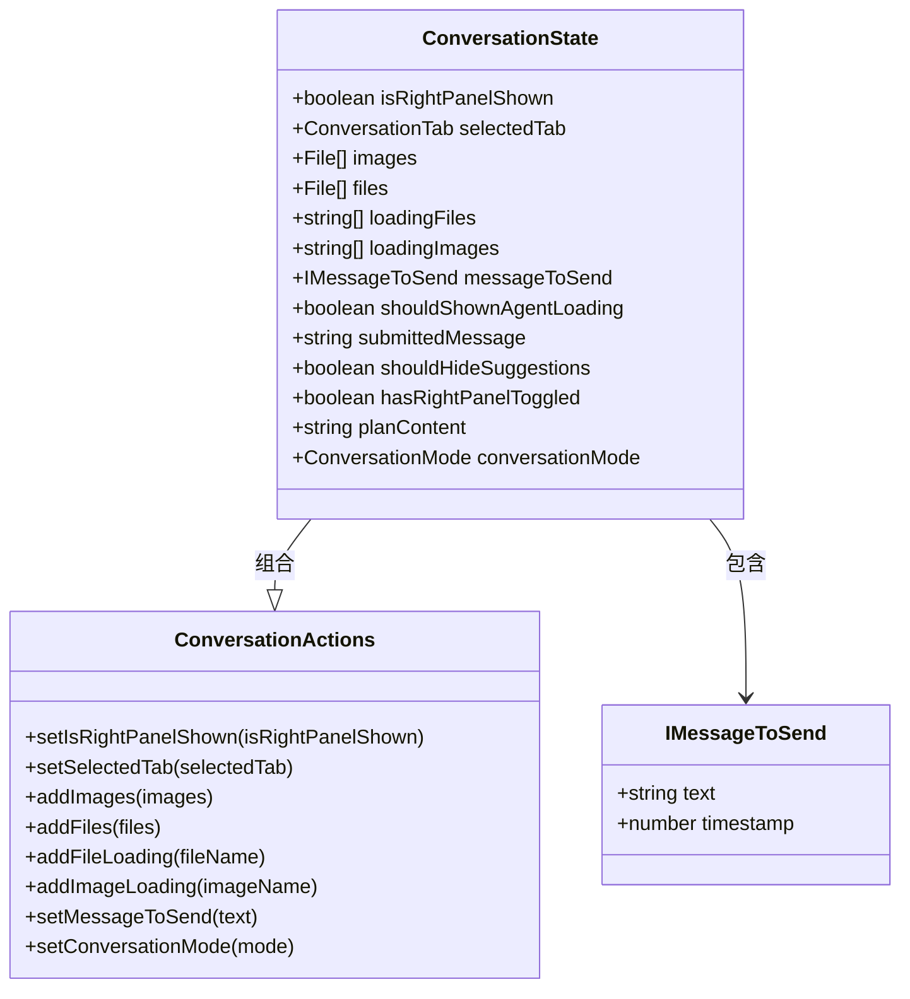
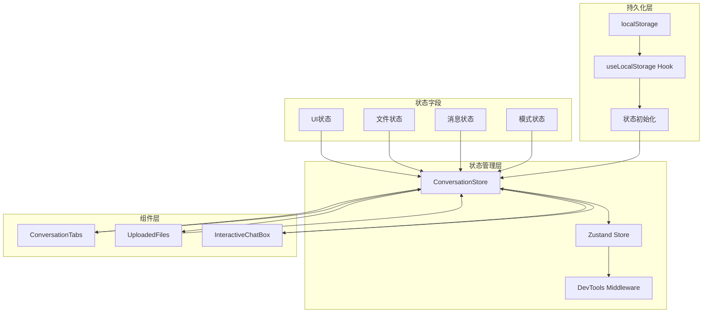
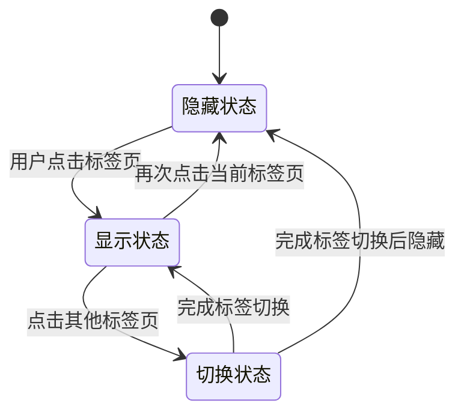
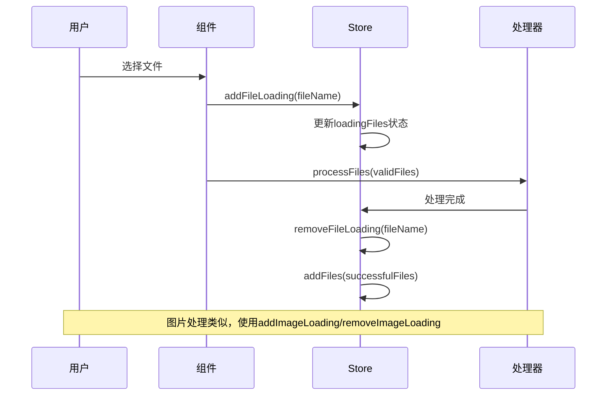
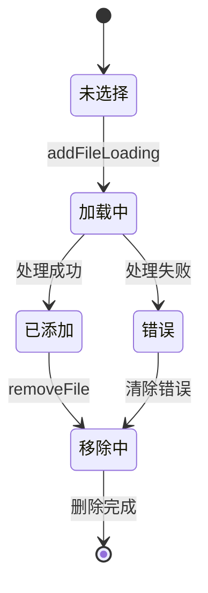
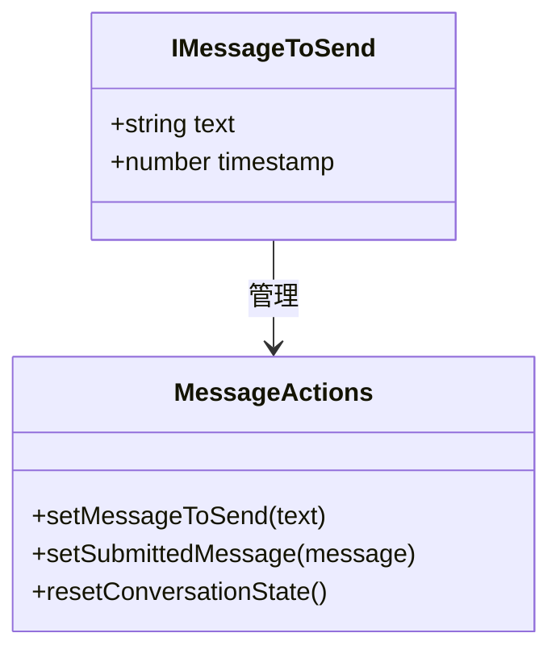
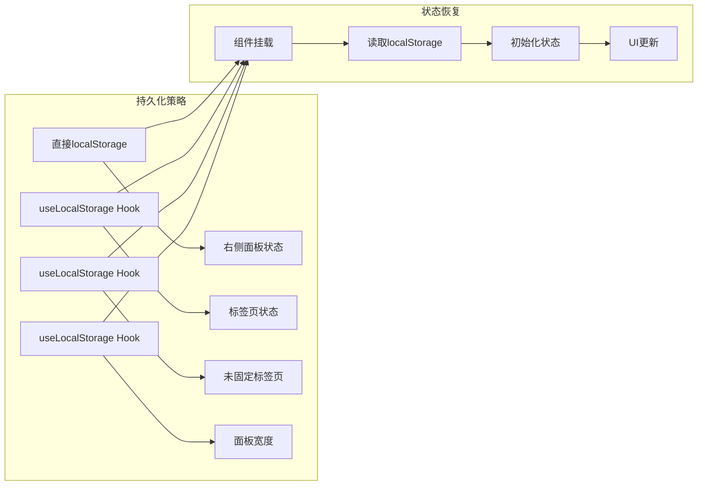
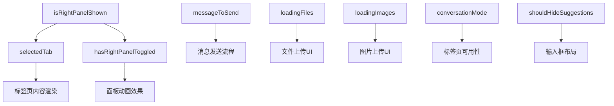

# 会话状态管理

<cite>
**本文档引用的文件**
- [conversation-store.ts](file://frontend/src/state/conversation-store.ts)
- [conversation-tabs.tsx](file://frontend/src/components/features/conversation/conversation-tabs/conversation-tabs.tsx)
- [uploaded-files.tsx](file://frontend/src/components/features/chat/uploaded-files.tsx)
- [interactive-chat-box.tsx](file://frontend/src/components/features/chat/interactive-chat-box.tsx)
- [conversation-tab-content.tsx](file://frontend/src/components/features/conversation/conversation-tabs/conversation-tab-content/conversation-tab-content.tsx)
- [uploaded-image.tsx](file://frontend/src/components/features/chat/uploaded-image.tsx)
- [uploaded-file.tsx](file://frontend/src/components/features/chat/uploaded-file.tsx)
- [use-resizable-panels.ts](file://frontend/src/hooks/use-resizable-panels.ts)
- [file-processing.ts](file://frontend/src/utils/file-processing.ts)
- [home-store.ts](file://frontend/src/stores/home-store.ts)
</cite>

## 目录
1. [简介](#简介)
2. [核心数据结构](#核心数据结构)
3. [状态管理架构](#状态管理架构)
4. [UI状态管理](#ui状态管理)
5. [文件上传状态管理](#文件上传状态管理)
6. [消息发送状态管理](#消息发送状态管理)
7. [对话模式管理](#对话模式管理)
8. [持久化机制](#持久化机制)
9. [状态同步与约束](#状态同步与约束)
10. [最佳实践](#最佳实践)

## 简介

OpenHands前端采用基于Zustand的状态管理方案，实现了复杂的会话状态管理机制。该系统通过`ConversationState`接口统一管理所有会话相关的状态，包括UI状态、文件上传状态、消息发送状态以及对话模式等核心功能。

## 核心数据结构

### ConversationState接口定义

`ConversationState`是整个会话状态管理的核心接口，包含了所有会话相关的状态字段：



**图表来源**
- [conversation-store.ts](file://frontend/src/state/conversation-store.ts#L18-L32)

### 主要状态字段详解

| 字段名 | 类型 | 默认值 | 描述 |
|--------|------|--------|------|
| `isRightPanelShown` | `boolean` | `true` | 右侧面板显示状态 |
| `selectedTab` | `ConversationTab \| null` | `"editor"` | 当前选中的标签页 |
| `images` | `File[]` | `[]` | 已上传的图片文件数组 |
| `files` | `File[]` | `[]` | 已上传的普通文件数组 |
| `loadingFiles` | `string[]` | `[]` | 正在处理的文件名称列表 |
| `loadingImages` | `string[]` | `[]` | 正在处理的图片名称列表 |
| `messageToSend` | `IMessageToSend \| null` | `null` | 待发送的消息内容及时间戳 |
| `shouldShownAgentLoading` | `boolean` | `false` | 是否显示代理加载状态 |
| `submittedMessage` | `string \| null` | `null` | 已提交的消息内容 |
| `shouldHideSuggestions` | `boolean` | `false` | 输入框扩展时是否隐藏建议 |
| `hasRightPanelToggled` | `boolean` | `true` | 右侧面板是否已切换过 |
| `planContent` | `string \| null` | 预设计划内容 | 规划器内容 |
| `conversationMode` | `ConversationMode` | `"code"` | 对话模式：`"code"` 或 `"plan"` |

**章节来源**
- [conversation-store.ts](file://frontend/src/state/conversation-store.ts#L18-L32)

## 状态管理架构

### Zustand Store设计

系统采用Zustand作为主要状态管理库，通过`create`函数创建全局状态存储：



**图表来源**
- [conversation-store.ts](file://frontend/src/state/conversation-store.ts#L67-L311)

### 状态初始化流程

状态初始化遵循以下优先级：
1. 从localStorage读取持久化状态
2. 使用默认值作为后备
3. 通过`getInitialRightPanelState`函数获取初始右侧面板状态

**章节来源**
- [conversation-store.ts](file://frontend/src/state/conversation-store.ts#L61-L65)

## UI状态管理

### 右侧面板状态控制

右侧面板状态通过`isRightPanelShown`和`hasRightPanelToggled`两个字段协同管理：



**图表来源**
- [conversation-tabs.tsx](file://frontend/src/components/features/conversation/conversation-tabs/conversation-tabs.tsx#L83-L95)

### 标签页状态管理

标签页状态通过`selectedTab`字段管理，支持多种标签页类型：

| 标签页类型 | 值 | 功能描述 |
|------------|-----|----------|
| 编辑器 | `"editor"` | Git变更查看和管理 |
| VSCode | `"vscode"` | 集成VSCode编辑器 |
| 终端 | `"terminal"` | 命令行终端界面 |
| 服务端 | `"served"` | 应用服务器监控 |
| 浏览器 | `"browser"` | Web浏览器模拟 |
| 规划器 | `"planner"` | AI规划任务管理 |

**章节来源**
- [conversation-store.ts](file://frontend/src/state/conversation-store.ts#L4-L10)

## 文件上传状态管理

### 文件处理流程

文件上传采用异步处理机制，通过`loadingFiles`和`loadingImages`状态跟踪处理进度：



**图表来源**
- [interactive-chat-box.tsx](file://frontend/src/components/features/chat/interactive-chat-box.tsx#L46-L111)
- [conversation-store.ts](file://frontend/src/state/conversation-store.ts#L234-L278)

### 文件状态转换

文件状态在不同阶段之间转换：



**图表来源**
- [uploaded-files.tsx](file://frontend/src/components/features/chat/uploaded-files.tsx#L45-L84)

### 文件预览和处理

系统提供完整的文件预览功能，支持：

- **文件预览**：显示文件图标、扩展名和名称
- **图片预览**：生成缩略图并支持预览大图
- **加载指示**：处理过程中的旋转加载动画
- **错误处理**：处理失败时的错误提示和状态清理

**章节来源**
- [uploaded-file.tsx](file://frontend/src/components/features/chat/uploaded-file.tsx#L12-L47)
- [uploaded-image.tsx](file://frontend/src/components/features/chat/uploaded-image.tsx#L11-L45)

## 消息发送状态管理

### 消息状态结构

消息发送状态通过`IMessageToSend`接口管理，包含文本内容和时间戳：



**图表来源**
- [conversation-store.ts](file://frontend/src/state/conversation-store.ts#L14-L17)

### 消息发送流程

消息发送遵循严格的顺序控制：

1. **设置待发送消息**：通过`setMessageToSend`设置消息内容和时间戳
2. **验证消息有效性**：检查消息格式和内容
3. **发送消息**：通过WebSocket或Socket.IO发送到后端
4. **更新提交状态**：设置`submittedMessage`标记已发送
5. **重置状态**：调用`resetConversationState`清理临时状态

**章节来源**
- [conversation-store.ts](file://frontend/src/state/conversation-store.ts#L283-L296)

## 对话模式管理

### 模式类型定义

系统支持两种对话模式：

| 模式 | 值 | 描述 |
|------|-----|------|
| 代码模式 | `"code"` | 主要用于代码编辑和Git操作 |
| 规划模式 | `"plan"` | 用于AI规划任务和复杂任务分解 |

### 模式切换机制

模式切换通过`setConversationMode`方法实现，影响以下方面：

- **标签页可用性**：规划模式下显示规划器标签页
- **功能可用性**：根据模式启用相应功能
- **用户界面布局**：调整界面元素的可见性

**章节来源**
- [conversation-store.ts](file://frontend/src/state/conversation-store.ts#L12-L12)

## 持久化机制

### localStorage集成

系统通过多种方式实现状态持久化：



**图表来源**
- [conversation-tabs.tsx](file://frontend/src/components/features/conversation/conversation-tabs/conversation-tabs.tsx#L34-L46)
- [use-resizable-panels.ts](file://frontend/src/hooks/use-resizable-panels.ts#L17-L20)

### 持久化键值映射

| 状态字段 | localStorage键 | 类型 | 默认值 |
|----------|----------------|------|--------|
| 右侧面板显示状态 | `"conversation-right-panel-shown"` | `boolean` | `true` |
| 当前选中标签页 | `"conversation-selected-tab"` | `ConversationTab \| null` | `"editor"` |
| 未固定标签页列表 | `"conversation-unpinned-tabs"` | `string[]` | `[]` |
| 面板宽度 | `"desktop-layout-panel-width"` | `number` | `50` |

### 状态初始化函数

系统提供了专门的初始化函数来处理localStorage状态：

```typescript
// 获取右侧面板初始状态
const getInitialRightPanelState = (): boolean => {
  const stored = localStorage.getItem("conversation-right-panel-shown");
  return stored !== null ? JSON.parse(stored) : true;
};
```

**章节来源**
- [conversation-store.ts](file://frontend/src/state/conversation-store.ts#L61-L65)

## 状态同步与约束

### 状态依赖关系

各状态字段之间存在复杂的依赖关系：



### 业务逻辑约束

系统实现了以下业务逻辑约束：

1. **右侧面板状态约束**：
   - 当`isRightPanelShown`为`true`时，必须有有效的`selectedTab`
   - 首次打开右侧面板时，默认选择`"editor"`标签页

2. **文件状态约束**：
   - 同一文件名不能同时存在于`loadingFiles`和最终文件列表中
   - 文件处理完成后必须从`loadingFiles`移除

3. **消息状态约束**：
   - 消息发送前必须验证消息有效性
   - 消息发送后需要清理临时状态

4. **模式约束**：
   - 规划模式下必须显示规划器标签页
   - 代码模式下不显示规划器标签页

**章节来源**
- [conversation-tabs.tsx](file://frontend/src/components/features/conversation/conversation-tabs/conversation-tabs.tsx#L68-L79)

## 最佳实践

### 状态更新最佳实践

1. **批量更新**：使用Zustand的批量更新功能减少不必要的重新渲染
2. **状态归一化**：避免嵌套状态结构，保持扁平化设计
3. **副作用处理**：在状态更新后正确处理副作用（如localStorage写入）

### 性能优化建议

1. **状态分割**：将频繁变化的状态与稳定状态分离
2. **记忆化**：对计算密集型状态使用React.memo或useMemo
3. **懒加载**：对大型状态使用懒加载机制

### 错误处理策略

1. **状态回滚**：在操作失败时自动回滚到之前的有效状态
2. **降级处理**：在网络异常时提供离线状态支持
3. **用户反馈**：及时向用户提供状态变更的视觉反馈

### 调试和开发工具

1. **DevTools集成**：利用Zustand DevTools进行状态调试
2. **状态快照**：定期保存状态快照用于问题排查
3. **性能监控**：监控状态更新频率和性能指标

**章节来源**
- [conversation-store.ts](file://frontend/src/state/conversation-store.ts#L67-L311)